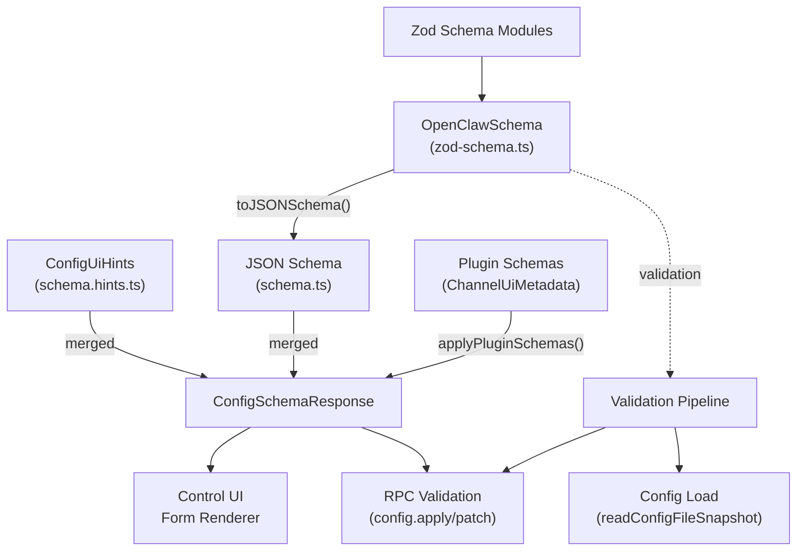
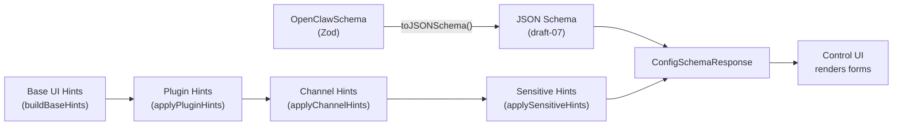
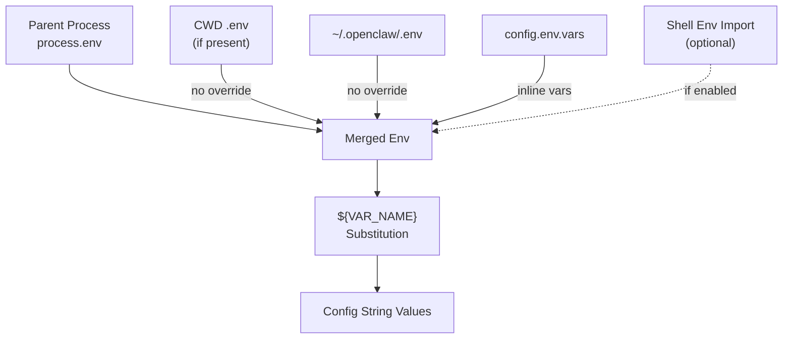
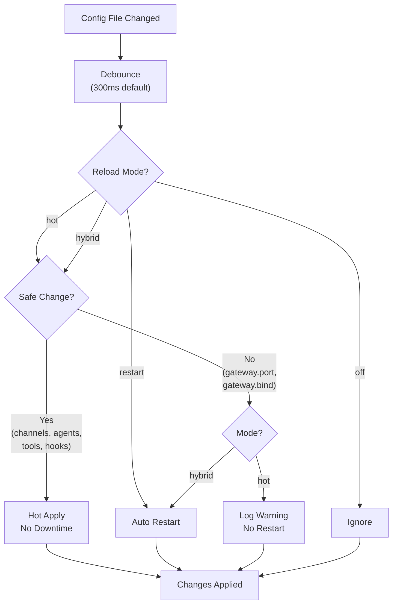
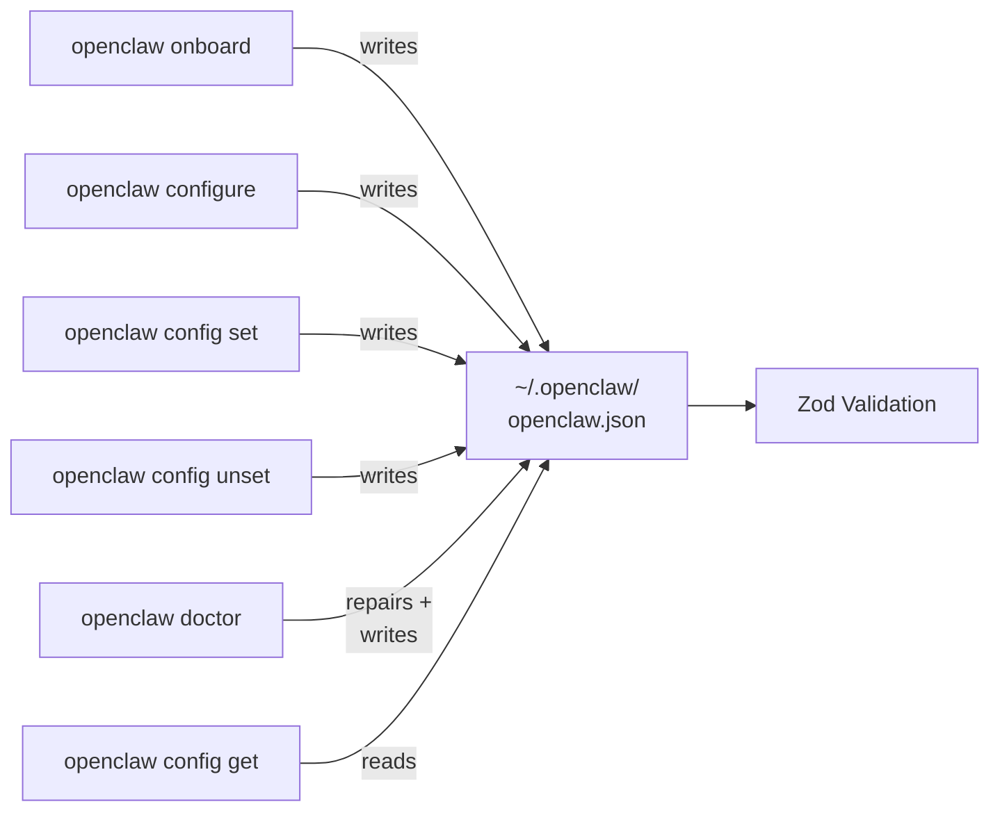
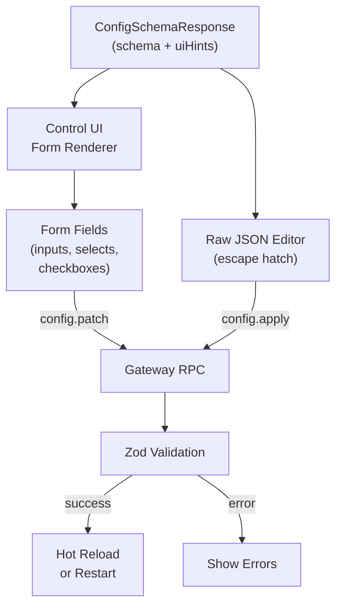
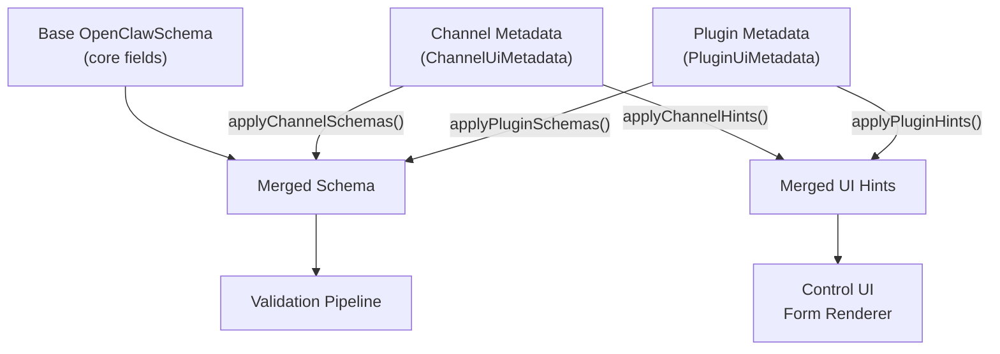

# Page: Configuration System

# 設定システム

<details>
<summary>関連ソースファイル</summary>

この Wiki ページの生成に使用されたコンテキストファイル:

- [CHANGELOG.md](CHANGELOG.md)
- [docs/cli/memory.md](docs/cli/memory.md)
- [docs/cli/sandbox.md](docs/cli/sandbox.md)
- [docs/concepts/memory.md](docs/concepts/memory.md)
- [docs/gateway/configuration.md](docs/gateway/configuration.md)
- [docs/gateway/doctor.md](docs/gateway/doctor.md)
- [docs/gateway/sandbox-vs-tool-policy-vs-elevated.md](docs/gateway/sandbox-vs-tool-policy-vs-elevated.md)
- [docs/gateway/sandboxing.md](docs/gateway/sandboxing.md)
- [docs/platforms/mac/skills.md](docs/platforms/mac/skills.md)
- [docs/tools/elevated.md](docs/tools/elevated.md)
- [docs/tools/index.md](docs/tools/index.md)
- [docs/tools/skills-config.md](docs/tools/skills-config.md)
- [src/agents/bash-tools.test.ts](src/agents/bash-tools.test.ts)
- [src/agents/memory-search.test.ts](src/agents/memory-search.test.ts)
- [src/agents/memory-search.ts](src/agents/memory-search.ts)
- [src/agents/pi-tools-agent-config.test.ts](src/agents/pi-tools-agent-config.test.ts)
- [src/agents/sandbox-explain.test.ts](src/agents/sandbox-explain.test.ts)
- [src/agents/sandbox-skills.test.ts](src/agents/sandbox-skills.test.ts)
- [src/agents/sandbox.ts](src/agents/sandbox.ts)
- [src/cli/memory-cli.test.ts](src/cli/memory-cli.test.ts)
- [src/cli/memory-cli.ts](src/cli/memory-cli.ts)
- [src/cli/models-cli.test.ts](src/cli/models-cli.test.ts)
- [src/commands/configure.gateway.test.ts](src/commands/configure.gateway.test.ts)
- [src/commands/configure.gateway.ts](src/commands/configure.gateway.ts)
- [src/commands/configure.ts](src/commands/configure.ts)
- [src/commands/doctor.ts](src/commands/doctor.ts)
- [src/commands/onboard-helpers.test.ts](src/commands/onboard-helpers.test.ts)
- [src/commands/onboard-helpers.ts](src/commands/onboard-helpers.ts)
- [src/commands/onboard-interactive.ts](src/commands/onboard-interactive.ts)
- [src/config/merge-config.ts](src/config/merge-config.ts)
- [src/config/schema.ts](src/config/schema.ts)
- [src/config/types.tools.ts](src/config/types.tools.ts)
- [src/config/types.ts](src/config/types.ts)
- [src/config/zod-schema.agent-runtime.ts](src/config/zod-schema.agent-runtime.ts)
- [src/config/zod-schema.ts](src/config/zod-schema.ts)
- [src/memory/embeddings.test.ts](src/memory/embeddings.test.ts)
- [src/memory/embeddings.ts](src/memory/embeddings.ts)
- [src/memory/manager.ts](src/memory/manager.ts)
- [src/wizard/onboarding.gateway-config.test.ts](src/wizard/onboarding.gateway-config.test.ts)
- [src/wizard/onboarding.gateway-config.ts](src/wizard/onboarding.gateway-config.ts)
- [src/wizard/onboarding.ts](src/wizard/onboarding.ts)
- [src/wizard/onboarding.types.ts](src/wizard/onboarding.types.ts)

</details>

設定システムは、OpenClaw のすべてのランタイム設定を検証、管理、およびホットリロードするための基盤です。Zod を使用した厳格なスキーマ検証を適用し、編集用の対話型ウィザードを提供し、ほとんどの設定についてダウンタイムなしでの動的リロードをサポートします。このページでは、スキーマアーキテクチャ、設定ライフサイクル、検証パイプライン、およびホットリロードの仕組みについて説明します。

ユーザー向けの設定リファレンスと例については、[設定ファイル構造](#4.1)および[設定管理](#4.2)ページを参照してください。マルチエージェントルーティングとワークスペースの分離については、[マルチエージェント設定](#4.3)を参照してください。

---

## 設定ファイルとスキーマ

OpenClaw は `~/.openclaw/openclaw.json` にある単一の JSON5 設定ファイルを読み込みます。スキーマは Zod で定義され、Control UI フォームレンダリングおよび RPC 検証用に JSON Schema に変換されます。

### スキーマ定義アーキテクチャ



**ソース:**
- [src/config/zod-schema.ts:95-632]()
- [src/config/schema.ts:293-335]()
- [src/config/schema.hints.ts]()

### コアスキーマモジュール

Zod スキーマは保守性のために複数のファイルに分割されています。ルートスキーマは [src/config/zod-schema.ts]() の `OpenClawSchema` であり、サブスキーマを構成します:

| スキーマモジュール | 対象 | ソースファイル |
|-------------------|------|---------------|
| `OpenClawSchema` | ルート設定オブジェクト | [src/config/zod-schema.ts:95-632]() |
| `AgentsSchema` | エージェント定義、デフォルト、マルチエージェント | [src/config/zod-schema.agents.ts]() |
| `ToolsSchema` | ツールポリシー、プロファイル、実行設定 | [src/config/zod-schema.agent-runtime.ts]() |
| `ChannelsSchema` | チャネル設定（WhatsApp、Telegram など） | [src/config/zod-schema.providers.ts]() |
| `ModelsConfigSchema` | モデルカタログ、プロバイダー、認証 | [src/config/zod-schema.core.ts]() |
| `SessionSchema` | セッションスコープ、リセット、送信ポリシー | [src/config/zod-schema.session.ts]() |
| `HooksSchema` | Webhook マッピング、Gmail 設定 | [src/config/zod-schema.hooks.ts]() |

各サブスキーマは `.strict()` を指定した Zod の `.object()` を使用して定義され、未知のキーを拒否します。クロスフィールド検証には `.superRefine()` が使用されます（例: [src/config/zod-schema.ts:602-632]() は `broadcast` エントリ内のエージェント ID を検証します）。

**ソース:**
- [src/config/types.ts:1-33]()
- [src/config/zod-schema.ts:1-14]()

### JSON Schema 生成

JSON Schema は `toJSONSchema()` を使用して Zod から生成され、Control UI フォームレンダラー用の UI ヒントで拡張されます:



`buildConfigSchema()` 関数 [src/config/schema.ts:313-335]() は、ベースヒントをプラグイン/チャネルメタデータとマージします。機密フィールド（トークン、API キー）は `applySensitiveHints()` [src/config/schema.hints.ts]() でフラグ付けされ、パスワード入力としてレンダリングされます。

**ソース:**
- [src/config/schema.ts:293-335]()
- [src/config/schema.hints.ts]()

---

## 設定ライフサイクル

```mermaid
sequenceDiagram
    participant User
    participant CLI
    participant ConfigFile["~/.openclaw/<br/>openclaw.json"]
    participant Loader["Config Loader<br/>(readConfigFileSnapshot)"]
    participant Validator["Zod Validator<br/>(OpenClawSchema.parse)"]
    participant Watcher["File Watcher<br/>(chokidar)"]
    participant Gateway["Gateway Runtime"]

    User->>CLI: openclaw config set
    CLI->>ConfigFile: Write JSON5
    ConfigFile->>Watcher: File change event
    Watcher->>Gateway: Debounced reload trigger
    Gateway->>Loader: readConfigFileSnapshot()
    Loader->>ConfigFile: Read + parse JSON5
    Loader->>Validator: OpenClawSchema.parse()

    alt Valid Config
        Validator-->>Gateway: Parsed config
        Gateway->>Gateway: Determine reload mode
        alt Hot-applicable
            Gateway->>Gateway: Apply changes
        else Restart-required
            Gateway->>Gateway: Restart gateway
        end
    else Invalid Config
        Validator-->>Gateway: Zod validation errors
        Gateway->>User: Log errors, keep old config
    end
```

**ソース:**
- [src/config/config.ts]()
- [src/config/zod-schema.ts:95-632]()

### 設定読み込み

`readConfigFileSnapshot()` 関数 [src/config/config.ts]() は完全な読み込みパイプラインを処理します:

1. **ファイル解決:** `~/.openclaw/openclaw.json` の存在を確認
2. **JSON5 パース:** コメントと末尾カンマをサポートするために `json5` を使用
3. **環境変数置換:** `${VAR_NAME}` を環境変数で置換 [src/config/env.ts]()
4. **$include 解決:** インクルードされたファイルを再帰的にマージ [src/config/includes.ts]()
5. **Zod 検証:** `OpenClawSchema.parse()` でパース
6. **エラー収集:** `{ valid: boolean, config: OpenClawConfig, issues: ZodIssue[] }` を返す

検証が失敗した場合、Gateway は起動を拒否し、診断コマンド（`openclaw doctor`、`openclaw logs`）のみが機能します。

**ソース:**
- [src/config/config.ts]()
- [src/config/includes.ts]()
- [src/config/env.ts]()

### 環境変数処理

環境変数は複数のソースから読み込まれ、設定文字列内でのインライン置換をサポートします:



**置換ルール** [src/config/env.ts]():
- 大文字の名前のみマッチ: `[A-Z_][A-Z0-9_]*`
- 欠落/空の変数は検証エラーをスロー
- リテラル出力用に `$${VAR}` でエスケープ
- インライン置換: `"${BASE}/v1"` → `"https://api.example.com/v1"`

**シェル環境インポート** (`config.env.shellEnv.enabled`):
- ログインシェルを実行して欠落キーをインポート
- まだ設定されていないキーのみをインポート
- タイムアウト: 15 秒（`timeoutMs` で設定可能）

**ソース:**
- [src/config/env.ts]()
- [docs/gateway/configuration.md:419-472]()

---

## 設定ホットリロード

Gateway は `~/.openclaw/openclaw.json` を監視し、リロードモードに基づいて変更を自動的に適用します。

### リロードモード

| モード | 動作 | ユースケース |
|-------|------|-------------|
| **`hybrid`** (デフォルト) | 安全な変更はホット適用、インフラは自動再起動 | 開発 + 本番のバランス |
| **`hot`** | 安全な変更のみホット適用、安全でない変更は警告をログ | 手動再起動制御 |
| **`restart`** | すべての変更で再起動 | 最小リスク、最大ダウンタイム |
| **`off`** | ファイル監視を無効化 | 手動再起動のみ |

**設定:**
```json5
{
  gateway: {
    reload: {
      mode: "hybrid",
      debounceMs: 300
    }
  }
}
```

**ソース:**
- [docs/gateway/configuration.md:327-366]()
- [src/config/zod-schema.ts:423-436]()

### ホットリロード決定フロー



**ホット適用可能フィールド**（再起動不要）:
- すべてのチャネル設定（`channels.*`）
- エージェント/モデル設定（`agents`、`models`、`routing`）
- オートメーション（`hooks`、`cron`、`agents.defaults.heartbeat`）
- セッション/メッセージ（`session`、`messages`）
- ツール/メディア（`tools`、`browser`、`skills`、`audio`）
- UI/その他（`ui`、`logging`、`identity`、`bindings`）

**再起動必須フィールド**:
- Gateway サーバー設定（`gateway.port`、`gateway.bind`、`gateway.auth`、`gateway.tailscale`、`gateway.tls`）
- インフラ（`discovery`、`canvasHost`、`plugins`）

**例外:** `gateway.reload` と `gateway.remote` は再起動をトリガーしません。

**ソース:**
- [docs/gateway/configuration.md:348-365]()

---

## 設定管理インターフェース

### CLI コマンド



**コマンド概要:**
- `openclaw onboard`: 完全な対話型セットアップウィザード [src/wizard/onboarding.ts:90-483]()
- `openclaw configure`: セクションベースの設定ウィザード [src/commands/configure.wizard.ts]()
- `openclaw config get <path>`: 設定値を読み取り（ドット記法）
- `openclaw config set <path> <value>`: 設定値を書き込み
- `openclaw config unset <path>`: 設定キーを削除
- `openclaw doctor`: 設定の修復 + マイグレーション [src/commands/doctor.ts:65-313]()

**ソース:**
- [src/wizard/onboarding.ts:90-483]()
- [src/commands/configure.ts:1-5]()
- [src/commands/doctor.ts:65-313]()
- [docs/gateway/configuration.md:36-59]()

### Control UI 設定エディタ

Control UI は JSON Schema + UI ヒントから動的フォームをレンダリングします:



Control UI は増分更新に `config.patch` を、完全な置換に `config.apply` を使用します。両方の RPC は書き込み前に Zod スキーマに対して検証します [src/gateway/rpc/config.ts]()。

**ソース:**
- [src/config/schema.ts:313-335]()
- [docs/gateway/configuration.md:52-58]()
- [src/gateway/rpc/config.ts]()

### Doctor コマンド

`doctor` コマンド [src/commands/doctor.ts:65-313]() は自動修復を実行します:

1. **設定マイグレーション:** レガシーキーを現在のスキーマに移動
2. **認証プロファイル修復:** OAuth プロファイル ID を修正、非推奨 CLI プロファイルを削除
3. **Gateway トークン生成:** 欠落した認証トークンを自動生成
4. **状態マイグレーション:** セッション/エージェントディレクトリをレガシーの場所から移動
5. **サンドボックスイメージチェック:** サンドボックス有効時に Docker イメージを検証
6. **サービス設定修復:** systemd/launchd 設定を修正

**非対話モード**（`--non-interactive`）:
- 安全なマイグレーションのみを適用
- 確認が必要な再起動/サービス/サンドボックスアクションをスキップ
- レガシー状態マイグレーションは検出時に自動実行

**ソース:**
- [src/commands/doctor.ts:65-313]()
- [docs/gateway/doctor.md:14-76]()

---

## プラグイン設定統合

プラグインはパッケージメタデータで `configSchema` と `configUiHints` を提供することで、設定スキーマを拡張できます。

### プラグインスキーママージ



**プラグイン設定構造:**
```json5
{
  plugins: {
    entries: {
      "my-plugin": {
        enabled: true,
        config: { /* plugin-specific schema */ }
      }
    }
  }
}
```

`applyPluginSchemas()` 関数 [src/config/schema.ts:209-248]() は、プラグインスキーマを `plugins.entries.<pluginId>.config` でベーススキーマにマージします。UI ヒントも同様にマージされます [src/config/schema.ts:91-132]()。

**チャネルプラグイン**は同じパターンに従いますが、`channels.<channelId>` にマージされます [src/config/schema.ts:250-274]()。

**ソース:**
- [src/config/schema.ts:209-274]()
- [src/config/schema.ts:91-165]()

---

## 設定 RPC メソッド

Gateway はプログラムによる設定更新のための 3 つの RPC メソッドを公開しています:

### `config.get`

現在の設定、ハッシュ、スキーマを返します:

```json5
{
  "payload": {
    "gateway": { "port": 18789 },
    // ... full config
  },
  "hash": "a1b2c3d4...",
  "schema": { /* JSON Schema */ }
}
```

### `config.apply`

**設定全体を置換**し、オプションで再起動します:

**パラメータ:**
- `raw` (string): 設定全体の JSON5
- `baseHash` (設定が存在する場合必須): `config.get` からのハッシュ
- `sessionKey` (オプション): 再起動後のウェイクアップ用セッションキー
- `note` (オプション): 再起動センチネル用のノート
- `restartDelayMs` (オプション): 再起動前の遅延（デフォルト 2000）

**警告:** `config.apply` は完全な置換です。部分的な更新には `config.patch` を使用してください。

### `config.patch`

JSON merge patch セマンティクスを使用して部分的な更新をマージします:

**パラメータ:**
- `raw` (string): 変更するキーのみを含む JSON5
- `baseHash` (必須): `config.get` からの設定ハッシュ
- `sessionKey`、`note`、`restartDelayMs`: `config.apply` と同じ

**マージルール:**
- オブジェクトは再帰的にマージ
- `null` はキーを削除
- 配列は置換（マージなし）

**ソース:**
- [docs/gateway/configuration.md:367-417]()
- [src/gateway/rpc/config.ts]()

---

## 高度な設定機能

### $include ディレクティブ

`$include` ディレクティブは大きな設定を複数のファイルに分割します:

```json5
// ~/.openclaw/openclaw.json
{
  gateway: { port: 18789 },
  agents: { $include: "./agents.json5" },
  broadcast: {
    $include: ["./clients/a.json5", "./clients/b.json5"]
  }
}
```

**動作:**
- **単一ファイル:** 含むオブジェクトを置換
- **ファイルの配列:** 順序に従ってディープマージ（後方が優先）
- **兄弟キー:** インクルード後にマージ（インクルード値を上書き）
- **ネストされたインクルード:** 最大 10 レベルまでサポート
- **相対パス:** インクルード元のファイルからの相対パスで解決

**エラー処理:** 欠落ファイル、パースエラー、循環インクルードに対する明確なエラー。

**ソース:**
- [docs/gateway/configuration.md:303-325]()
- [src/config/includes.ts]()

### ウィザードメタデータ

`wizard` セクションは最後の onboard/configure/doctor 実行を追跡します:

```json5
{
  wizard: {
    lastRunAt: "2026-01-15T10:30:00Z",
    lastRunVersion: "2026.1.15",
    lastRunCommit: "a1b2c3d4",
    lastRunCommand: "onboard",
    lastRunMode: "local"
  }
}
```

このメタデータは [src/commands/onboard-helpers.ts:92-108]() で書き込まれ、アップグレード検出に使用されます。

**ソース:**
- [src/config/zod-schema.ts:117-126]()
- [src/commands/onboard-helpers.ts:92-108]()

### 設定スナップショットとバックアップ

`doctor --fix` または設定マイグレーションが実行されると、バックアップが `~/.openclaw/openclaw.json.bak` に書き込まれます [src/commands/doctor.ts:288-290]()。Control UI は `config.apply` の前にスナップショットを作成し、ロールバックを可能にします。

**ソース:**
- [src/commands/doctor.ts:288-290]()

---

## 設定検証の詳細

### 検証失敗モード

検証が失敗した場合:

1. **Gateway 起動:** ブロック; 診断コマンドのみ機能
2. **ホットリロード:** 古い設定を保持; エラーをログ
3. **RPC:** 検証エラーをクライアントに返す

**イシュー形式** [src/config/config.ts]():
```typescript
{
  path: string[];      // JSON path to invalid field
  message: string;     // Human-readable error
  code: ZodIssueCode;  // Zod error code
}
```

### カスタム検証ルール

スキーマはクロスフィールド検証に `.superRefine()` を使用します:

- **Broadcast エージェント ID:** [src/config/zod-schema.ts:602-632]() は `broadcast.<peerId>[]` が有効なエージェント ID を参照することを保証
- **ハートビートスケジュール:** [src/config/zod-schema.agent-runtime.ts:32-85]() は期間文字列と時刻形式を検証
- **ツールポリシー競合:** [src/config/zod-schema.agent-runtime.ts:161-169]() は同じスコープで `allow` と `alsoAllow` の両方を防止

**ソース:**
- [src/config/zod-schema.ts:602-632]()
- [src/config/zod-schema.agent-runtime.ts:32-85]()
- [src/config/zod-schema.agent-runtime.ts:161-169]()

---

## 設定システムコードマップ

### 主要ファイル

| ファイル | 目的 |
|--------|------|
| [src/config/zod-schema.ts]() | ルート Zod スキーマ定義 |
| [src/config/schema.ts]() | JSON Schema 生成 + プラグインマージング |
| [src/config/config.ts]() | 設定読み込み、書き込み、パス解決 |
| [src/config/includes.ts]() | `$include` ディレクティブリゾルバ |
| [src/config/env.ts]() | 環境変数置換 |
| [src/config/types.ts]() | TypeScript 設定タイプ（Zod から生成） |
| [src/wizard/onboarding.ts]() | オンボーディングウィザード実装 |
| [src/commands/configure.ts]() | 設定ウィザードエントリーポイント |
| [src/commands/doctor.ts]() | Doctor コマンド（修復 + マイグレーション） |
| [src/gateway/rpc/config.ts]() | 設定更新用 RPC メソッド |

### スキーマモジュールファイル

| ファイル | スキーマ |
|--------|---------|
| [src/config/zod-schema.agents.ts]() | `AgentsSchema`、`BindingsSchema` |
| [src/config/zod-schema.agent-runtime.ts]() | `ToolsSchema`、`SandboxSchema`、`HeartbeatSchema` |
| [src/config/zod-schema.providers.ts]() | `ChannelsSchema`（すべてのチャネル） |
| [src/config/zod-schema.core.ts]() | `ModelsConfigSchema`、`HexColorSchema` |
| [src/config/zod-schema.session.ts]() | `SessionSchema`、`MessagesSchema`、`CommandsSchema` |
| [src/config/zod-schema.hooks.ts]() | `HooksSchema`、`HookMappingSchema` |
| [src/config/zod-schema.approvals.ts]() | `ApprovalsSchema`（実行許可リスト） |

**ソース:**
- [src/config/types.ts:1-33]()
- [src/config/zod-schema.ts:1-14]()

---
