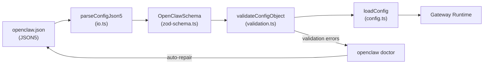

# Page: Configuration File Structure

# 設定ファイル構造

<details>
<summary>関連ソースファイル</summary>

この Wiki ページの生成に使用されたコンテキストファイル:

- [CHANGELOG.md](CHANGELOG.md)
- [docs/cli/memory.md](docs/cli/memory.md)
- [docs/cli/sandbox.md](docs/cli/sandbox.md)
- [docs/concepts/memory.md](docs/concepts/memory.md)
- [docs/gateway/configuration.md](docs/gateway/configuration.md)
- [docs/gateway/sandbox-vs-tool-policy-vs-elevated.md](docs/gateway/sandbox-vs-tool-policy-vs-elevated.md)
- [docs/gateway/sandboxing.md](docs/gateway/sandboxing.md)
- [docs/platforms/mac/skills.md](docs/platforms/mac/skills.md)
- [docs/tools/elevated.md](docs/tools/elevated.md)
- [docs/tools/index.md](docs/tools/index.md)
- [docs/tools/skills-config.md](docs/tools/skills-config.md)
- [src/agents/memory-search.test.ts](src/agents/memory-search.test.ts)
- [src/agents/memory-search.ts](src/agents/memory-search.ts)
- [src/agents/sandbox-explain.test.ts](src/agents/sandbox-explain.test.ts)
- [src/agents/sandbox.ts](src/agents/sandbox.ts)
- [src/cli/memory-cli.test.ts](src/cli/memory-cli.test.ts)
- [src/cli/memory-cli.ts](src/cli/memory-cli.ts)
- [src/cli/models-cli.test.ts](src/cli/models-cli.test.ts)
- [src/config/schema.ts](src/config/schema.ts)
- [src/config/types.tools.ts](src/config/types.tools.ts)
- [src/config/types.ts](src/config/types.ts)
- [src/config/zod-schema.agent-runtime.ts](src/config/zod-schema.agent-runtime.ts)
- [src/config/zod-schema.ts](src/config/zod-schema.ts)
- [src/memory/embeddings.test.ts](src/memory/embeddings.test.ts)
- [src/memory/embeddings.ts](src/memory/embeddings.ts)
- [src/memory/manager.ts](src/memory/manager.ts)

</details>

このページでは、OpenClaw の主要設定ファイルである `openclaw.json` の構造について説明します。トップレベルのスキーマセクション（`gateway`、`agents`、`channels`、`tools`、`models`、`memory` など）、それらの Zod 検証スキーマへのマッピング、システムコンポーネントとの関係について説明します。設定編集パターンとホットリロード動作については、[設定管理](#4.2)を参照してください。マルチエージェントルーティングについては、[マルチエージェント設定](#4.3)を参照してください。

---

## ファイルの場所と検証

OpenClaw の設定はデフォルトで `~/.openclaw/openclaw.json` に配置されます。ファイルの場所は `OPENCLAW_CONFIG_PATH` または `--profile` フラグでオーバーライドできます。

**形式**: JSON5（コメント、末尾カンマ、引用符なしキーをサポート）
**検証**: [src/config/zod-schema.ts:95-632]() が `OpenClawSchema` を Zod で定義
**パーサー**: [src/config/io.ts]() がファイル I/O と JSON5 パースを処理
**エンコーディング**: UTF-8

設定ファイルに以下が含まれる場合、Gateway は起動を拒否します:
- 不明なキー（厳格モード）
- タイプの不一致
- 無効な値（範囲外、不正なパターンなど）

設定の問題を検証して自動修復するには `openclaw doctor` を実行してください。

**検証チェーン**:



**タイトル**: Configuration Loading and Validation Pipeline

**ソース**: [src/config/config.ts:1-15]()、[src/config/io.ts]()、[src/config/zod-schema.ts:95-632]()、[src/config/validation.ts]()

---

## スキーマの構成と構造

[src/config/zod-schema.ts:95-632]() の `OpenClawSchema` はルートスキーマオブジェクトです。ドメイン固有のファイルから専門化されたスキーマをインポートして構成します:

| スキーマファイル | エクスポート | トップレベルキー |
|----------------|-------------|-----------------|
| [src/config/zod-schema.ts]() | `OpenClawSchema` | ルートオブジェクト（すべてのドメインを構成） |
| [src/config/zod-schema.agents.ts]() | `AgentsSchema`、`AudioSchema`、`BindingsSchema`、`BroadcastSchema` | `agents`、`audio`、`bindings`、`broadcast` |
| [src/config/zod-schema.agent-runtime.ts]() | `ToolsSchema`、`SandboxDockerSchema`、`SandboxBrowserSchema`、`HeartbeatSchema` | `tools`、`agents.defaults.sandbox`、`agents.defaults.heartbeat` |
| [src/config/zod-schema.session.ts]() | `SessionSchema`、`MessagesSchema`、`CommandsSchema` | `session`、`messages`、`commands` |
| [src/config/zod-schema.providers.ts]() | `ChannelsSchema` | `channels` |
| [src/config/zod-schema.hooks.ts]() | `HookMappingSchema`、`HooksGmailSchema`、`InternalHooksSchema` | `hooks` |
| [src/config/zod-schema.approvals.ts]() | `ApprovalsSchema` | `approvals` |
| [src/config/zod-schema.core.ts]() | `ModelsConfigSchema`、`HexColorSchema` | `models`、`agents.defaults.models` |

**ソース**: [src/config/zod-schema.ts:95-632]()、[src/config/types.ts:1-32]()、[src/config/zod-schema.agents.ts]()、[src/config/zod-schema.agent-runtime.ts]()、[src/config/zod-schema.session.ts]()、[src/config/zod-schema.providers.ts]()

---

## コア構造: エージェントとデフォルト

OpenClaw は**デフォルトとオーバーライド**パターンを使用します: `agents.defaults` がすべてのエージェントのベースライン設定を設定し、`agents.list[]` エントリがエージェントごとに特定のフィールドをオーバーライドできます。マルチエージェントルーティングはトップレベルの `bindings` 配列で設定されます。

**設定例**:

```json5
{
  agents: {
    defaults: {
      workspace: "~/.openclaw/workspace",
      repoRoot: null, // auto-detect git root
      bootstrapMaxChars: 20000,
      envelopeTimezone: "local",
      envelopeTimestamp: "on",
      envelopeElapsed: "on",

      model: {
        primary: "anthropic/claude-sonnet-4-20250514",
        fallbacks: [
          "openai/gpt-4.5-turbo",
          "google/gemini-2.0-flash"
        ]
      },

      memorySearch: {
        enabled: true,
        sources: ["memory"],
        extraPaths: [],
        provider: "auto"
      },

      tools: {
        profile: "coding",
        allow: null,
        alsoAllow: [],
        deny: [],
        byProvider: {}
      },

      sandbox: {
        mode: "non-main",
        workspaceAccess: "rw",
        sessionToolsVisibility: "spawned",
        scope: "session"
      },

      heartbeat: {
        every: "30m",
        activeHours: {
          start: "08:00",
          end: "22:00",
          timezone: "America/New_York"
        }
      }
    },

    list: [
      {
        id: "main",
        default: true,
        workspace: "~/.openclaw/workspace",
        agentDir: "~/.openclaw/agents/main"
      },
      {
        id: "work",
        workspace: "~/.openclaw/workspace-work",
        agentDir: "~/.openclaw/agents/work",
        model: {
          primary: "openai/gpt-5.2"
        },
        sandbox: {
          mode: "off"
        }
      }
    ]
  }
}
```

**フィールドの目的**:

| フィールド | タイプ | デフォルト | 目的 |
|-----------|-------|-----------|------|
| `agents.defaults.workspace` | string | `~/.openclaw/workspace` | エージェントワークスペースディレクトリ |
| `agents.defaults.repoRoot` | string? | null（自動検出） | リポジトリルート |
| `agents.defaults.bootstrapMaxChars` | number | 20000 | ブートストラップファイルごとの最大文字数 |
| `agents.defaults.envelopeTimezone` | string | "local" | メッセージエンベロープのタイムゾーン |
| `agents.defaults.model.primary` | string | required | プライマリモデル（プロバイダー/モデル形式） |
| `agents.defaults.model.fallbacks` | string[] | [] | 順序付きフォールバックモデル |
| `agents.list[].id` | string | required | ユニークなエージェント識別子 |
| `agents.list[].default` | boolean | false | デフォルトエージェントとしてマーク |
| `agents.list[].workspace` | string? | inherits | ワークスペースパスをオーバーライド |

**ソース**: [src/config/zod-schema.agent-runtime.ts:12-80]()、[src/agents/memory-search.ts:1-143]()、[docs/start/wizard.md:295-308]()

---

## Gateway 設定

Gateway コントロールプレーンは `gateway` キーの下で設定されます。これは WebSocket サーバーのバインディング、認証、リロード動作、ノード管理を制御します。

```json5
{
  gateway: {
    mode: "local", // local|remote (required; gateway won't start if unset)
    port: 18789,
    bind: "loopback", // loopback|lan|tailnet|auto|custom

    auth: {
      mode: "token", // token|password|tailscale
      token: "generated-by-wizard"
    },

    remote: {
      url: null, // ws:// or wss:// for remote mode
      sshTarget: null, // user@host or user@host:port for SSH tunnel
      token: null
    },

    controlUi: {
      basePath: "", // URL prefix (e.g. /openclaw)
      allowInsecureAuth: false
    },

    reload: {
      mode: "hybrid", // off|soft|restart|hybrid
      debounceMs: 500
    },

    nodes: {
      browser: {
        mode: "auto", // auto|manual|off
        node: null
      }
    },

    tailscale: {
      mode: "off", // off|serve|funnel
      hostname: null
    }
  }
}
```

**フィールドの目的**:

| フィールド | タイプ | デフォルト | 目的 |
|-----------|-------|-----------|------|
| `gateway.mode` | string | required | ランタイムモード（local は gateway を起動、remote は接続） |
| `gateway.port` | number | 18789 | WebSocket + HTTP ポート |
| `gateway.bind` | string | "loopback" | ネットワークバインディング |
| `gateway.auth.mode` | string | "token" | 認証方法 |
| `gateway.auth.token` | string? | null | Gateway トークン（非ループバックで必須） |
| `gateway.reload.mode` | string | "hybrid" | ホットリロード戦略 |
| `gateway.tailscale.mode` | string | "off" | Tailscale 公開 |

**ソース**: [src/config/schema.ts:104-211]()、[docs/gateway/index.md:1-117]()

---

## ツール設定

ツールポリシーはエージェントが使用できるツールを制御します。[src/config/zod-schema.agent-runtime.ts]() の `ToolsSchema` が完全な構造を定義します。

**ツールプロファイル**:

| プロファイル | 説明 | 含まれるツール |
|------------|------|---------------|
| `minimal` | 読み取り専用クエリ | `memory_search`、`memory_get` |
| `coding` | 開発タスク | `read`、`write`、`edit`、`apply_patch`、`exec`、`memory_*` |
| `messaging` | クロスチャネルメッセージング | `message`、`sessions`、`memory_*` |
| `full` | すべてのツールが有効 | 利用可能なすべてのツール |

**ソース**: [src/config/types.tools.ts:1-430]()、[src/config/zod-schema.agent-runtime.ts:1-300]()、[src/agents/pi-tools.ts:115-167]()

---

## サンドボックス設定

サンドボックスはエージェント実行のための Docker ベースの分離を提供します。

**サンドボックスモード**:

| モード | 動作 |
|-------|------|
| `off` | サンドボックスなし; エージェントはホストで実行 |
| `non-main` | 非メインセッションをサンドボックス化 |
| `all` | すべてのセッションをサンドボックス化 |

**ワークスペースアクセス**:

| モード | 動作 |
|-------|------|
| `none` | ワークスペースアクセスなし |
| `ro` | 読み取り専用ワークスペースマウント |
| `rw` | 読み書きワークスペースマウント |

**サンドボックススコープ**:

| スコープ | 動作 |
|--------|------|
| `session` | セッションキーごとに 1 つのコンテナ |
| `agent` | エージェントごとに 1 つのコンテナ（セッション間で共有） |
| `shared` | すべてのエージェントで 1 つのコンテナを共有 |

**ソース**: [src/agents/sandbox/types.ts:1-44]()、[src/agents/sandbox/config.ts:1-7]()、[src/config/zod-schema.agent-runtime.ts:82-245]()

---

## チャネル設定

チャネルは `channels` キーの下で設定されます。

**DM ポリシーオプション**:

| ポリシー | 動作 |
|--------|------|
| `open` | すべての DM を受け入れる（`allowFrom: ["*"]` が必要） |
| `allowlist` | `allowFrom` リストからの DM のみを受け入れる |
| `pairing` | 不明な送信者はペアリングコードを受け取る |

**ソース**: [src/config/zod-schema.providers.ts]()、[src/config/types.whatsapp.ts]()、[src/config/types.telegram.ts]()、[src/config/types.discord.ts]()、[src/config/types.slack.ts]()

---

## 環境変数と認証

OpenClaw はインライン環境変数設定と認証プロファイル管理をサポートしています。

```json5
{
  env: {
    OPENROUTER_API_KEY: "sk-or-...",
    vars: {
      GROQ_API_KEY: "gsk-...",
    },
    shellEnv: {
      enabled: true,
      timeoutMs: 15000
    }
  }
}
```

`${VAR_NAME}` 構文を使用した環境変数置換は、任意の文字列設定値でサポートされています。

**ソース**: [src/config/zod-schema.ts:99-111]()、[src/config/zod-schema.ts:242-268]()、[docs/gateway/configuration.md:268-403]()

---

## セッションとメッセージ設定

**DM スコープオプション**:

| スコープ | 動作 |
|--------|------|
| `main` | すべての DM が 1 つのセッションを共有 |
| `per-peer` | ピアごとに 1 つのセッション |
| `per-channel-peer` | (チャネル、ピア) ごとに 1 つのセッション |
| `per-account-channel-peer` | (チャネル、アカウント、ピア) ごとに 1 つのセッション |

**ソース**: [src/config/zod-schema.session.ts:1-100]()、[src/config/types.messages.ts]()、[src/config/types.queue.ts]()

---

## 設定優先順位

設定は以下の優先順位（高い順から低い順）で複数のソースから解決されます:

1. **ランタイムオーバーライド** - `applyRuntimeConfigOverrides`
2. **環境変数** - `OPENCLAW_GATEWAY_PORT` など
3. **openclaw.json** - ユーザー設定
4. **システムデフォルト** - Zod スキーマデフォルト

**ソース**: [src/config/runtime-overrides.ts]()、[src/agents/agent-scope.ts]()、[src/agents/pi-tools.policy.ts:28-33]()、[src/agents/tool-policy.ts:46-54]()

---
