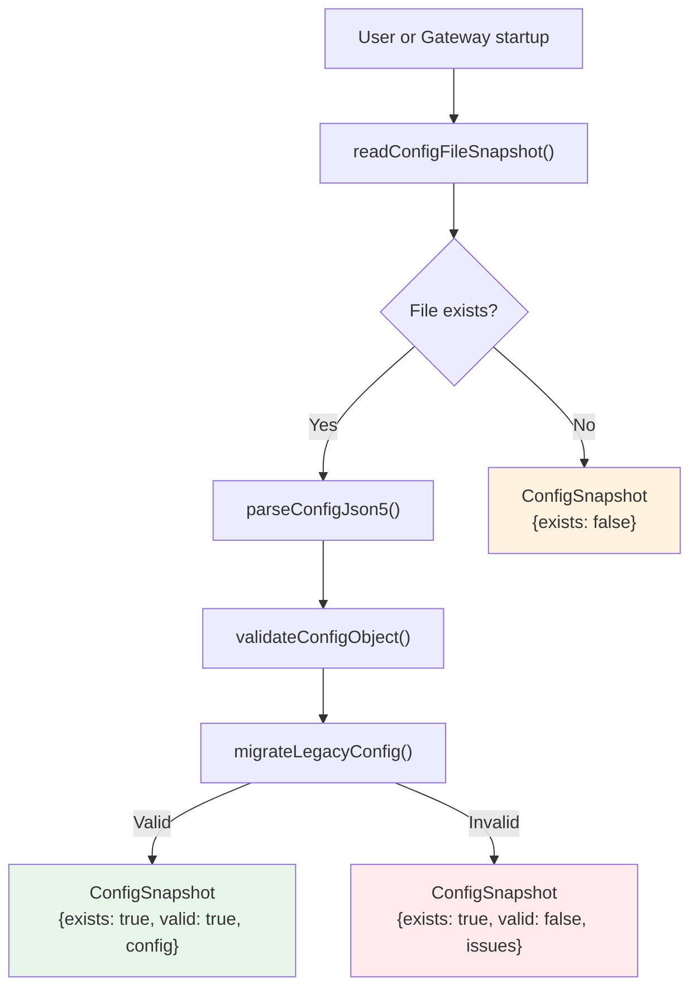
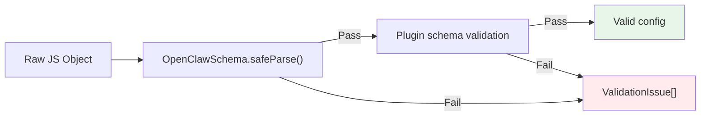
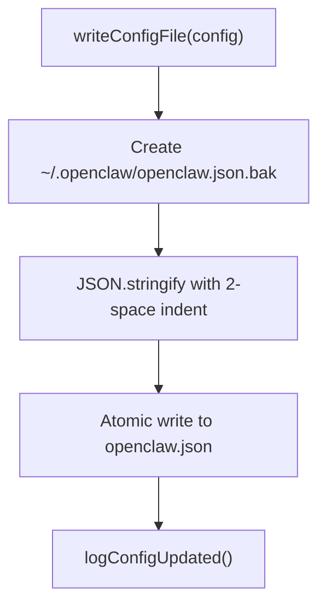

# Page: Configuration Management

# 設定管理

<details>
<summary>関連ソースファイル</summary>

この Wiki ページの生成に使用されたコンテキストファイル:

- [CHANGELOG.md](CHANGELOG.md)
- [docs/cli/memory.md](docs/cli/memory.md)
- [docs/cli/sandbox.md](docs/cli/sandbox.md)
- [docs/concepts/memory.md](docs/concepts/memory.md)
- [docs/gateway/configuration.md](docs/gateway/configuration.md)
- [docs/gateway/doctor.md](docs/gateway/doctor.md)
- [docs/gateway/sandbox-vs-tool-policy-vs-elevated.md](docs/gateway/sandbox-vs-tool-policy-vs-elevated.md)
- [docs/gateway/sandboxing.md](docs/gateway/sandboxing.md)
- [docs/platforms/mac/skills.md](docs/platforms/mac/skills.md)
- [docs/tools/elevated.md](docs/tools/elevated.md)
- [docs/tools/index.md](docs/tools/index.md)
- [docs/tools/skills-config.md](docs/tools/skills-config.md)
- [src/agents/bash-tools.test.ts](src/agents/bash-tools.test.ts)
- [src/agents/memory-search.test.ts](src/agents/memory-search.test.ts)
- [src/agents/memory-search.ts](src/agents/memory-search.ts)
- [src/agents/pi-tools-agent-config.test.ts](src/agents/pi-tools-agent-config.test.ts)
- [src/agents/sandbox-explain.test.ts](src/agents/sandbox-explain.test.ts)
- [src/agents/sandbox-skills.test.ts](src/agents/sandbox-skills.test.ts)
- [src/agents/sandbox.ts](src/agents/sandbox.ts)
- [src/cli/memory-cli.test.ts](src/cli/memory-cli.test.ts)
- [src/cli/memory-cli.ts](src/cli/memory-cli.ts)
- [src/cli/models-cli.test.ts](src/cli/models-cli.test.ts)
- [src/commands/configure.gateway.test.ts](src/commands/configure.gateway.test.ts)
- [src/commands/configure.gateway.ts](src/commands/configure.gateway.ts)
- [src/commands/configure.ts](src/commands/configure.ts)
- [src/commands/doctor.ts](src/commands/doctor.ts)
- [src/commands/onboard-helpers.test.ts](src/commands/onboard-helpers.test.ts)
- [src/commands/onboard-helpers.ts](src/commands/onboard-helpers.ts)
- [src/commands/onboard-interactive.ts](src/commands/onboard-interactive.ts)
- [src/config/merge-config.ts](src/config/merge-config.ts)
- [src/config/schema.ts](src/config/schema.ts)
- [src/config/types.tools.ts](src/config/types.tools.ts)
- [src/config/types.ts](src/config/types.ts)
- [src/config/zod-schema.agent-runtime.ts](src/config/zod-schema.agent-runtime.ts)
- [src/config/zod-schema.ts](src/config/zod-schema.ts)
- [src/memory/embeddings.test.ts](src/memory/embeddings.test.ts)
- [src/memory/embeddings.ts](src/memory/embeddings.ts)
- [src/memory/manager.ts](src/memory/manager.ts)
- [src/wizard/onboarding.gateway-config.test.ts](src/wizard/onboarding.gateway-config.test.ts)
- [src/wizard/onboarding.gateway-config.ts](src/wizard/onboarding.gateway-config.ts)
- [src/wizard/onboarding.ts](src/wizard/onboarding.ts)
- [src/wizard/onboarding.types.ts](src/wizard/onboarding.types.ts)

</details>

このページでは、OpenClaw が設定ファイルをどのように読み込み、検証、マイグレーション、修復するかについて説明します。ディスクからの読み込み、JSON5 パース、Zod 検証を経て、レガシー設定キーのマイグレーションシステム、そして `doctor` コマンドの自動修復機能について説明します。

設定ファイル自体の構造とスキーマについては、[設定ファイル構造](#4.1)を参照してください。マルチエージェント設定の詳細については、[マルチエージェント設定](#4.3)を参照してください。

---

## 設定読み込みパイプライン

OpenClaw は `~/.openclaw/openclaw.json` から設定を読み込み、JSON5 構文を処理し、Zod スキーマに対して検証し、レガシーマイグレーションを適用するマルチステージパイプラインを経由します。

### 読み込みフロー



**ソース:** [src/config/config.ts:1-15]()、[src/wizard/onboarding.ts:98-118]()、[src/commands/doctor.ts:94-99]()

### コア読み込み関数

| 関数 | 目的 | 戻り値 |
|-----|------|--------|
| `readConfigFileSnapshot()` | ディスクから設定を読み込んで検証 | 検証ステータス付き `ConfigSnapshot` |
| `parseConfigJson5(text)` | JSON5 テキストを JavaScript オブジェクトにパース | パースされたオブジェクトまたはスロー |
| `loadConfig()` | 現在の設定を読み込んで検証 | `OpenClawConfig` オブジェクト |
| `validateConfigObject(obj)` | 生のオブジェクトを Zod スキーマに対して検証 | イシュー付き検証結果 |
| `validateConfigObjectWithPlugins(obj)` | プラグイン固有のスキーマを含めて検証 | 拡張検証結果 |

**ソース:** [src/config/config.ts:1-15]()

### ConfigSnapshot 構造

`readConfigFileSnapshot()` 関数は以下を含む型付きスナップショットを返します:

```typescript
type ConfigSnapshot = {
  exists: boolean;           // File exists on disk
  valid: boolean;            // Passed validation
  config: OpenClawConfig;    // Parsed config (empty object if invalid)
  issues: ValidationIssue[]; // Validation errors
  path?: string;             // Config file path
}
```

**ソース:** [src/wizard/onboarding.ts:98-99]()

---

## JSON5 パース

OpenClaw は JSON5 を使用して、設定ファイル内のコメント、末尾カンマ、引用符なしのキーを許可します。パーサーは標準の JSON5 パースをエラー処理でラップします。

### サポートされる JSON5 機能

- 単一行（`//`）および複数行（`/* */`）コメント
- オブジェクトと配列の末尾カンマ
- 引用符なしのオブジェクトキー（有効な識別子の場合）
- 単一引用符文字列
- 16 進数

**ソース:** [src/config/config.ts:4]()

---

## 検証パイプライン

設定検証は Zod スキーマを使用してタイプセーフを強制し、エラーを早期に検出します。検証パイプラインはすべての設定読み込み操作中に実行されます。



**ソース:** [src/config/config.ts:13-14]()

### 検証関数

**`validateConfigObject(obj)`**

生のオブジェクトをベースの `OpenClawSchema` に対して検証します。すべての設定読み込みパスで使用されます。

**`validateConfigObjectWithPlugins(obj)`**

ベース検証をプラグイン固有のスキーマで拡張します。プラグインが有効で、設定セクションの検証が必要な場合に使用されます。

**ソース:** [src/config/config.ts:13-14]()

### エラー報告

検証エラーは以下を含む `ValidationIssue` オブジェクトとして構造化されます:

```typescript
type ValidationIssue = {
  path: string;      // JSON path to the invalid field (e.g. "gateway.port")
  message: string;   // Human-readable error message
  code?: string;     // Zod error code
}
```

オンボーディングフローからの例:

```typescript
if (snapshot.issues.length > 0) {
  await prompter.note(
    [
      ...snapshot.issues.map((iss) => `- ${iss.path}: ${iss.message}`),
      "",
      "Docs: https://docs.openclaw.ai/gateway/configuration",
    ].join("\n"),
    "Config issues",
  );
}
```

**ソース:** [src/wizard/onboarding.ts:103-112]()

---

## 設定書き込み

設定書き込みはアトミックで、自動バックアップ作成を含みます。

### 書き込みフロー



**ソース:** [src/config/config.ts:7]()、[src/wizard/onboarding.ts:439-440]()、[src/commands/doctor.ts:285-290]()

### バックアップ動作

すべての設定書き込みは、メインファイルを変更する前に `~/.openclaw/openclaw.json.bak` にバックアップを作成します。これにより、新しい設定が問題を引き起こした場合にロールバックできます。

**ソース:** [src/commands/doctor.ts:287-290]()

### ウィザードメタデータ

オンボーディングと doctor コマンドは、いつどのように最後に変更されたかを追跡するためにメタデータを設定にスタンプします:

```typescript
function applyWizardMetadata(
  cfg: OpenClawConfig,
  params: { command: string; mode: OnboardMode },
): OpenClawConfig {
  const commit = process.env.GIT_COMMIT?.trim() || process.env.GIT_SHA?.trim() || undefined;
  return {
    ...cfg,
    wizard: {
      ...cfg.wizard,
      lastRunAt: new Date().toISOString(),
      lastRunVersion: VERSION,
      lastRunCommit: commit,
      lastRunCommand: params.command,
      lastRunMode: params.mode,
    },
  };
}
```

**ソース:** [src/commands/onboard-helpers.ts:91-107]()、[src/commands/doctor.ts:284]()

---

## レガシー設定マイグレーション

OpenClaw は非推奨の設定キーを現在の同等のものに自動的にマイグレーションします。マイグレーションはすべての設定読み込み中に実行され、べき等です。

### サポートされるマイグレーション

マイグレーションシステムはこれらのレガシーキーパターンを処理します:

| レガシーキー | 現在のキー | 備考 |
|------------|-----------|------|
| `routing.allowFrom` | `channels.whatsapp.allowFrom` | チャネル固有の許可リスト |
| `routing.groupChat.requireMention` | `channels.*.groups."*".requireMention` | チャネルごとのグループポリシー |
| `routing.groupChat.historyLimit` | `messages.groupChat.historyLimit` | メッセージ設定 |
| `routing.groupChat.mentionPatterns` | `messages.groupChat.mentionPatterns` | メッセージ設定 |
| `routing.queue` | `messages.queue` | メッセージキューイング |
| `routing.bindings` | `bindings` | トップレベルバインディング |
| `routing.agents` / `routing.defaultAgentId` | `agents.list` + `agents.list[].default` | マルチエージェント設定 |
| `routing.agentToAgent` | `tools.agentToAgent` | ツール設定 |
| `routing.transcribeAudio` | `tools.media.audio.models` | 音声トランスクリプション |
| `bindings[].match.accountID` | `bindings[].match.accountId` | ケース正規化 |
| `identity` | `agents.list[].identity` | エージェントごとの ID |
| `agent.*` | `agents.defaults` + `tools.*` | エージェントデフォルト分割 |

**ソース:** [docs/gateway/doctor.md:112-128]()

### 起動時の自動マイグレーション

Gateway はレガシーキーを検出すると、起動時に設定マイグレーションを自動的に実行します。これにより、手動介入なしに設定がアップデート間で互換性を保つことができます。

レガシーキーが検出された場合に実行を拒否するコマンドは、ユーザーにマイグレーションを適用するために `openclaw doctor` を実行するよう指示します。

**ソース:** [docs/gateway/doctor.md:108-110]()、[src/wizard/onboarding.ts:98-118]()

---

## Doctor コマンド: 設定修復

`doctor` コマンドは自動設定検証、マイグレーション、修復を提供します。`--fix` または `--repair` フラグを指定して実行すると、ユーザーの介入なしに設定の問題を検出して修正できます。

### 設定修復アクション

| 修復アクション | トリガー | `--fix` で自動修復 |
|--------------|---------|-------------------|
| レガシーキーマイグレーション | レガシーキーが検出された | 常に |
| 設定正規化 | 非推奨の値形状 | 常に |
| Gateway トークン生成 | ローカル gateway に `gateway.auth.token` がない | プロンプトのみ（`--generate-gateway-token` で強制） |
| 認証プロファイル修復 | 期限切れの OAuth トークン | 対話のみ |
| OpenCode Zen プロバイダーオーバーライド警告 | `models.providers.opencode` が設定されている | 警告のみ |

**ソース:** [src/commands/doctor.ts:94-160]()、[docs/gateway/doctor.md:59-83]()

### 対話モードと非対話モード

Doctor は異なる修復戦略でヘッドレス操作をサポートします:

| フラグ | 動作 |
|------|------|
| (なし) | 修復のための対話型プロンプト |
| `--yes` | デフォルトの修復プロンプトを受け入れる |
| `--repair` | プロンプトなしで推奨修復を適用 |
| `--repair --force` | 積極的な修復を適用（カスタム設定を上書き） |
| `--non-interactive` | 安全なマイグレーションのみを適用、確認が必要な修復をスキップ |

**ソース:** [docs/gateway/doctor.md:20-44]()

---

## 設定優先順位とオーバーライド

OpenClaw は環境変数と CLI フラグを通じたランタイム設定オーバーライドをサポートしています。

### 一般的な環境オーバーライド

| 環境変数 | 設定キー | 目的 |
|---------|---------|------|
| `OPENCLAW_GATEWAY_TOKEN` | `gateway.auth.token` | Gateway 認証トークン |
| `OPENCLAW_GATEWAY_PASSWORD` | `gateway.auth.password` | Gateway 認証パスワード |
| `OPENCLAW_STATE_DIR` | (implicit) | 状態ディレクトリの場所 |

**ソース:** [src/wizard/onboarding.ts:297-299]()

---

## 設定変更の適用

設定変更はどのセクションが変更されたかによって異なるアクションを必要とします:

| 設定セクション | 変更の適用 |
|--------------|-----------|
| `gateway.*` | Gateway 再起動が必要 |
| `agents.*` | 次のエージェント呼び出しで変更が反映 |
| `channels.*` | チャネルモニターが自動的に再起動 |
| `tools.*` | 次のエージェント呼び出しで変更が反映 |
| `models.*` | 次のモデル呼び出しで即座に有効 |

Gateway の再起動は以下でトリガーできます:
- `openclaw gateway restart`
- Gateway プロトコルメソッド `gateway.restart` と `delayMs`
- Gateway サービスの再起動（launchd/systemd）

**ソース:** [src/commands/doctor.ts:268-280]()

---

## エラー復旧パターン

OpenClaw は設定問題のためのいくつかのエラー復旧パターンを実装しています:

### 起動時の無効な設定

Gateway が起動時に無効な設定を検出すると:
1. 自動マイグレーションを試みる
2. 検証エラーをログに記録
3. まだ無効な場合は起動を拒否
4. 修復のために `openclaw doctor` を実行するよう提案

**ソース:** [src/wizard/onboarding.ts:101-118]()

### 設定バックアップとロールバック

すべての設定書き込みはタイムスタンプ付きバックアップを作成します:
```
~/.openclaw/openclaw.json.bak
```

ロールバックするには:
```bash
cp ~/.openclaw/openclaw.json.bak ~/.openclaw/openclaw.json
openclaw gateway restart
```

**ソース:** [src/commands/doctor.ts:287-290]()

---
