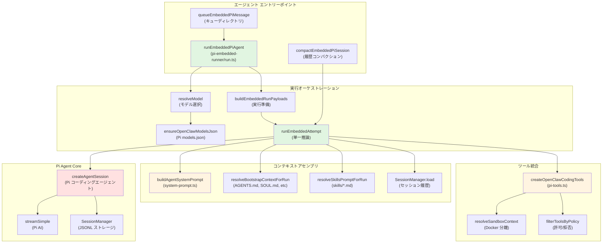
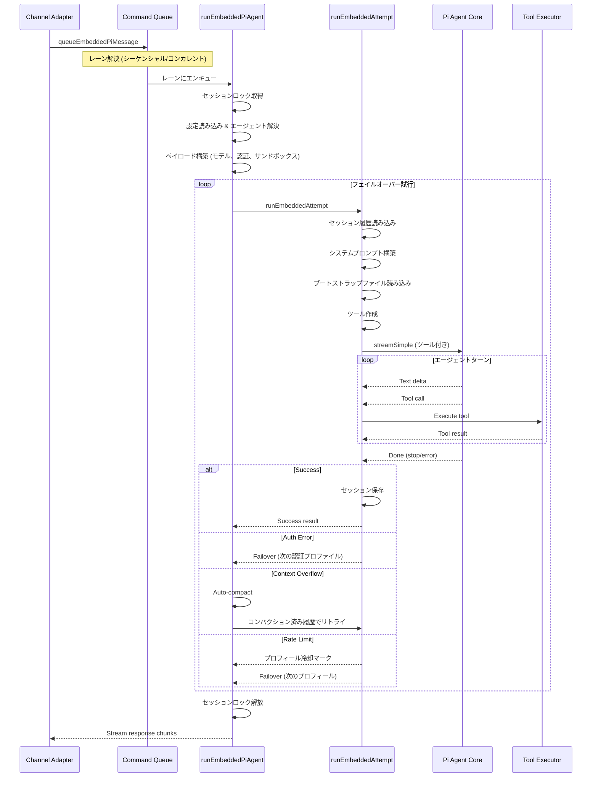
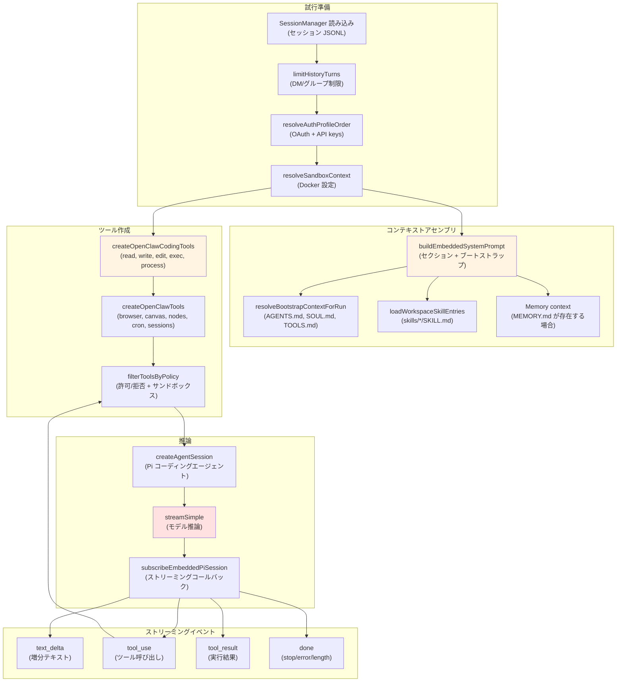
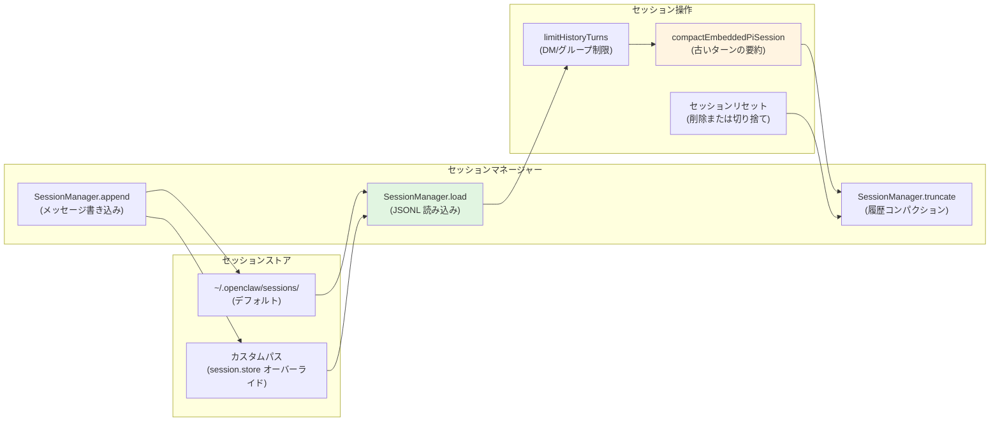
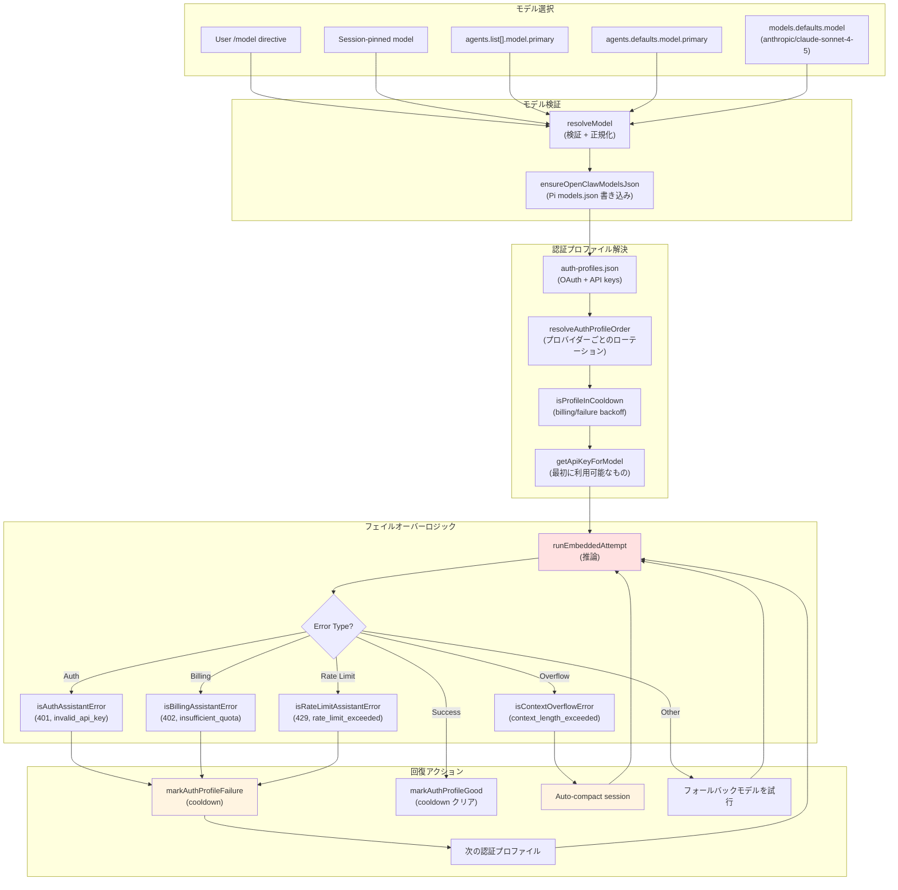
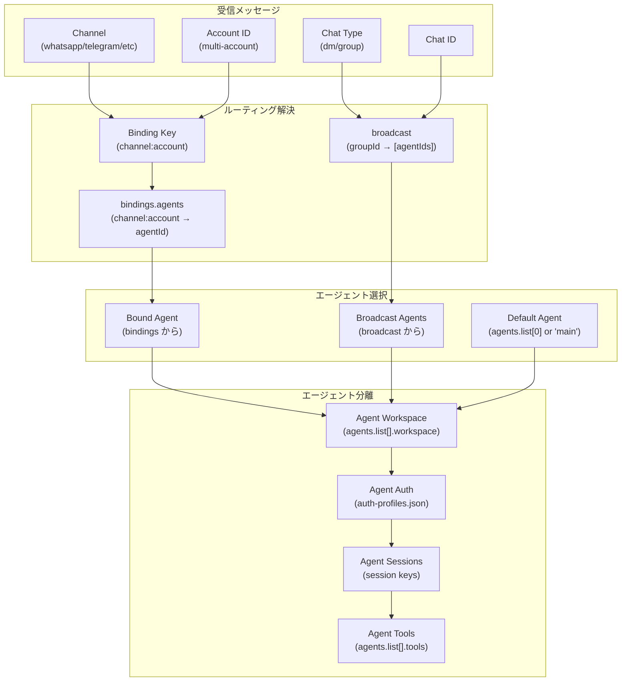

# ページ: エージェント システム

# エージェント システム

<details>
<summary>関連ソースファイル</summary>

この Wiki ページの作成に使用されたコンテキストとなるファイルは以下の通りです：

- [docs/concepts/system-prompt.md](docs/concepts/system-prompt.md)
- [docs/gateway/background-process.md](docs/gateway/background-process.md)
- [docs/gateway/cli-backends.md](docs/gateway/cli-backends.md)
- [docs/reference/token-use.md](docs/reference/token-use.md)
- [src/agents/auth-profiles/oauth.fallback-to-main-agent.test.ts](src/agents/auth-profiles/oauth.fallback-to-main-agent.test.ts)
- [src/agents/auth-profiles/oauth.ts](src/agents/auth-profiles/oauth.ts)
- [src/agents/bash-process-registry.test.ts](src/agents/bash-process-registry.test.ts)
- [src/agents/bash-process-registry.ts](src/agents/bash-process-registry.ts)
- [src/agents/bash-tools.ts](src/agents/bash-tools.ts)
- [src/agents/cli-backends.ts](src/agents/cli-backends.ts)
- [src/agents/cli-runner.test.ts](src/agents/cli-runner.test.ts)
- [src/agents/cli-runner.ts](src/agents/cli-runner.ts)
- [src/agents/cli-runner/helpers.ts](src/agents/cli-runner/helpers.ts)
- [src/agents/pi-embedded-helpers.ts](src/agents/pi-embedded-helpers.ts)
- [src/agents/pi-embedded-runner.test.ts](src/agents/pi-embedded-runner.test.ts)
- [src/agents/pi-embedded-runner.ts](src/agents/pi-embedded-runner.ts)
- [src/agents/pi-embedded-runner/compact.ts](src/agents/pi-embedded-runner/compact.ts)
- [src/agents/pi-embedded-runner/run/attempt.ts](src/agents/pi-embedded-runner/run/attempt.ts)
- [src/agents/pi-embedded-runner/system-prompt.ts](src/agents/pi-embedded-runner/system-prompt.ts)
- [src/agents/pi-embedded-subscribe.ts](src/agents/pi-embedded-subscribe.ts)
- [src/agents/pi-tools.ts](src/agents/pi-tools.ts)
- [src/agents/system-prompt-params.ts](src/agents/system-prompt-params.ts)
- [src/agents/system-prompt-report.ts](src/agents/system-prompt-report.ts)
- [src/agents/system-prompt.test.ts](src/agents/system-prompt.test.ts)
- [src/agents/system-prompt.ts](src/agents/system-prompt.ts)
- [src/auto-reply/reply/agent-runner.heartbeat-typing.runreplyagent-typing-heartbeat.retries-after-compaction-failure-by-resetting-session.test.ts](src/auto-reply/reply/agent-runner.heartbeat-typing.runreplyagent-typing-heartbeat.retries-after-compaction-failure-by-resetting-session.test.ts)
- [src/auto-reply/reply/commands-context-report.ts](src/auto-reply/reply/commands-context-report.ts)
- [src/gateway/gateway-cli-backend.live.test.ts](src/gateway/gateway-cli-backend.live.test.ts)
- [src/telegram/group-migration.test.ts](src/telegram/group-migration.test.ts)
- [src/telegram/group-migration.ts](src/telegram/group-migration.ts)

</details>


## 目的と範囲

エージェント システムは OpenClaw のコア実行エンジンです。モデル推論、ツール実行、セッション管理をすべてのエージェントの対話のためのオーケストレーションを行います。このページではエージェントのアーキテクチャ、実行フロー、設定について説明します。

特定のサブシステムについては、以下を参照してください：
- **[エージェント実行フロー](#5.1)** 詳細なメッセージ処理パイプライン
- **[システムプロンプト](#5.2)** プロンプト構築とカスタマイズ
- **[セッション管理](#5.3)** セッションキー、履歴、コンパクション
- **[モデル選択とフェイルオーバー](#5.4)** モデル設定と認証プロファイルのローテーション

**ソース**: [CHANGELOG.md:1-850](), [README.md:1-500]()

---

## アーキテクチャの概要

エージェント システムは Pi Agent Core ライブラリ（`@mariozechner/pi-agent-core`）をラップし、チャネル、ツール、サンドボックス、設定のための OpenClaw 固有の統合を提供します。主要なエントリーポイントは `runEmbeddedPiAgent` で、エージェントのターン全体のライフサイクルを管理します。



**主要な抽象化**：
- **EmbeddedPiAgentMeta**: エージェントインスタンスの設定（ワークスペース、モデル、ツール、サンドボックス）
- **EmbeddedPiRunMeta**: ターンごとのメタデータ（セッションキー、メッセージ、チャネルコンテキスト）
- **EmbeddedPiRunResult**: 実行結果（成功、エラー、使用量、タイミング）
- **SubscribeEmbeddedPiSessionParams**: リアルタイム出力のためのストリーミングコールバック

**ソース**: [src/agents/pi-embedded-runner.ts:1-28](), [src/agents/pi-embedded-runner/run.ts:1-100](), [README.md:130-200]()

---

## エージェント実行フロー

### キューディレクトリとレーン

エージェント実行は 2 つのキューモードをサポートします：
- **シーケンシャル** (`session`): セッションごとに一度に 1 ターン
- **コンカレント** (`global`): すべてのセッションで並列実行

キューモードは `resolveSessionLane` と `resolveGlobalLane` を使用して設定 `agents.defaults.queue.mode` から解決されます。



**主要な関数**：
- `queueEmbeddedPiMessage` [src/agents/pi-embedded-runner/runs.ts:100-200](): 実行用のメッセージをキューに追加
- `resolveSessionLane` [src/agents/pi-embedded-runner/lanes.ts:10-40](): シーケンシャルかコンカレントかを判断
- `acquireSessionWriteLock` [src/agents/session-write-lock.ts:10-60](): 同時書き込みを防止

**ソース**: [src/agents/pi-embedded-runner/run.ts:50-150](), [src/agents/pi-embedded-runner/lanes.ts:1-80](), [src/agents/pi-embedded-runner/runs.ts:1-300]()

---

### 実行モデルの試行

各エージェントターンはフェイルオーバーにより複数回の試行を伴うことがあります。`runEmbeddedAttempt` 関数は完全なコンテキストアセンブリで単一の推論試行を処理します。



**主要なファイル**：
- `runEmbeddedAttempt` [src/agents/pi-embedded-runner/run/attempt.ts:80-500](): 単一推論試行のオーケストレーション
- `subscribeEmbeddedPiSession` [src/agents/pi-embedded-subscribe.ts:30-200](): イベントストリーミングとコールバック
- `createOpenClawCodingTools` [src/agents/pi-tools.ts:100-400](): ツールレジストリ構築

**ソース**: [src/agents/pi-embedded-runner/run/attempt.ts:1-600](), [src/agents/pi-embedded-subscribe.ts:1-300](), [src/agents/pi-tools.ts:1-500]()

---

## システムプロンプトの構築

システムプロンプトは設定可能なセクションで複数のソースからアセンブルされます。`buildAgentSystemPrompt` 関数がすべてのプロンプトセクションを調整します。

### プロンプトモード

3 つのモードが含まれるセクションを制御します：
- **full**: すべてのセクション（メインエージェントのデフォルト）
- **minimal**: セクションを削減（ツーリング、ワークスペース、ランタイム）- サブエージェントで使用
- **none**: 基本アイデンティティ行のみ、セクションなし

```mermaid
graph TB
    subgraph "設定入力"
        agentConfig["agents.defaults / agents.list[]"]
        identityConfig["agents.list[].identity"]
        toolsConfig["tools.allow / tools.deny"]
        sandboxConfig["agents.defaults.sandbox"]
    end

    subgraph "プロンプトセクション (フルモード)"
        identity["## User Identity<br/>(owner numbers)"]
        time["## Current Date & Time<br/>(timezone only)"]
        skills["## Skills (mandatory)<br/>(skills/*/SKILL.md)"]
        memory["## Memory Recall<br/>(memory_search/memory_get)"]
        messaging["## Messaging<br/>(message tool, SILENT_REPLY_TOKEN)"]
        voice["## Voice (TTS)<br/>(TTS hints)"]
        replyTags["## Reply Tags<br/>([[reply_to_current]])"]
        docs["## Documentation<br/>(local docs path)"]
        reasoning["## Reasoning Format<br/>(ς/<final>)"]
        cli["## OpenClaw CLI Quick Reference<br/>(gateway restart, etc)"]
        runtime["## Runtime Environment<br/>(host, OS, arch, model)"]
        tools["## Tooling<br/>(available tool list)"]
        workspace["## Workspace<br/>(workspace dir, notes)"]
        sandbox["## Sandbox<br/>(browser bridge, elevated mode)"]
    end

    subgraph "ブートストラップファイル"
        agentsMd["AGENTS.md<br/>(core identity)"]
        soulMd["SOUL.md<br/>(personality)"]
        toolsMd["TOOLS.md<br/>(custom tools)"]
        identityMd["IDENTITY.md<br/>(per-agent identity)"]
        userMd["USER.md<br/>(user context)"]
        memoryMd["MEMORY.md<br/>(memory context)"]
    end

    subgraph "出力"
        systemPrompt["System Prompt<br/>(buildAgentSystemPrompt)"]
    end

    agentConfig --> identity
    agentConfig --> time
    agentConfig --> skills
    toolsConfig --> memory
    toolsConfig --> messaging
    agentConfig --> voice
    agentConfig --> replyTags
    agentConfig --> docs
    agentConfig --> reasoning
    agentConfig --> cli
    agentConfig --> runtime
    toolsConfig --> tools
    agentConfig --> workspace
    sandboxConfig --> sandbox

    identity --> systemPrompt
    time --> systemPrompt
    skills --> systemPrompt
    memory --> systemPrompt
    messaging --> systemPrompt
    voice --> systemPrompt
    replyTags --> systemPrompt
    docs --> systemPrompt
    reasoning --> systemPrompt
    cli --> systemPrompt
    runtime --> systemPrompt
    tools --> systemPrompt
    workspace --> systemPrompt
    sandbox --> systemPrompt

    agentsMd --> systemPrompt
    soulMd --> systemPrompt
    toolsMd --> systemPrompt
    identityMd --> systemPrompt
    userMd --> systemPrompt
    memoryMd --> systemPrompt
```



**主要な関数**：
- `buildAgentSystemPrompt` [src/agents/system-prompt.ts:129-400](): すべてのプロンプトセクションをアセンブル
- `resolveBootstrapContextForRun` [src/agents/bootstrap-files.ts:50-200](): ブートストラップファイル読み込み
- `resolveSkillsPromptForRun` [src/agents/skills.ts:100-300](): スキル XML 構築

**プロンプトセクションの要約**：

| セクション | 条件 | 目的 |
|---------|-----------|---------|
| User Identity | `ownerNumbers` が設定されている | 認可されたユーザーを特定 |
| Current Date & Time | `userTimezone` が設定されている | スケジューリングのためのタイムゾーン |
| Skills (mandatory) | `skillsPrompt` が存在する | スキル発見と読み込み |
| Memory Recall | `memory_search` ツールが利用可能 | メモリ統合ガイド |
| Messaging | minimal モードでない | クロスチャネルメッセージングルール |
| Voice (TTS) | `ttsHint` が設定されている | TTS タグ使用 |
| Reply Tags | minimal モードでない | ネイティブ返信/引用構文 |
| Documentation | `docsPath` が設定されている | OpenClaw ドキュメント参照 |
| Reasoning Format | `reasoningTagHint` true | `ς/<final>` タグ使用 |
| CLI Quick Reference | 常に (フルモード) | ゲートウェイコマンド |
| Runtime Environment | `runtimeInfo` が存在する | ホスト/OS/モデルコンテキスト |
| Tooling | `toolNames` が存在する | 利用可能なツールリスト |
| Workspace | 常に | ワークスペースディレクトリ |
| Sandbox | サンドボックス有効 | ブラウザブリッジ、昇格モード |

**ソース**: [src/agents/system-prompt.ts:1-500](), [docs/concepts/system-prompt.md:1-200](), [src/agents/bootstrap-files.ts:1-300]()

---

## セッション管理

セッションはセッションキーによって識別され、Pi Agent Core `SessionManager` を介して JSONL ファイルとして保存されます。

### セッションキーの形式

セッションキーは階層パターンに従います：
```
agent:{agentId}:{channel}:{scope}:{identifier}
```

例：
- `agent:main:whatsapp:dm:+15555550123` (DM)
- `agent:main:telegram:group:123456789` (グループ)
- `agent:work:slack:dm:U0123ABC` (マルチエージェント DM)

**主要な解決**：
- `deriveSessionKey` [src/config/sessions.ts:50-150](): チャネル/メッセージコンテキストからセッションキーを生成
- `resolveSessionKey` [src/config/sessions.ts:150-250](): セッションキー形式を正規化し検証

### セッションストレージ

セッションは JSONL ファイルとして保存されます：
- **場所**: `~/.openclaw/sessions/{sessionKey}.jsonl`
- **形式**: 1 行ごとに JSON オブジェクト（メッセージ、メタデータ、イベント）
- **管理**: `@mariozechner/pi-coding-agent` の `SessionManager`



**履歴制限**：
- **DM セッション**: `session.dmHistoryLimit` (デフォルト: 無制限)
- **グループセッション**: `session.historyLimit` (デフォルト: 100 ターン)
- チャネルごとのオーバーライド: `session.dmHistoryLimitByChannel`, `session.historyLimitByChannel`

**コンパクション**：
- コンテキストオーバーフロー時にトリガー
- 古い会話ターンを要約
- 最近のメッセージを保持
- `compactEmbeddedPiSession` [src/agents/pi-embedded-runner/compact.ts:50-300]() を参照

**ソース**: [src/config/sessions.ts:1-400](), [src/agents/pi-embedded-runner/compact.ts:1-400](), [docs/gateway/configuration.md:1800-2000]()

---

## モデル選択とフェイルオーバー

モデル選択にはプライマリモデルの解決、認証プロファイルの読み込み、エラー時のフェイルオーバー処理が含まれます。

### モデル解決パイプライン



**主要な関数**：
- `resolveDefaultModelForAgent` [src/agents/model-selection.ts:50-150](): フォールバック付きでモデルを解決
- `resolveAuthProfileOrder` [src/agents/model-auth.ts:200-300](): 認証プロファイルローテーション順序
- `isProfileInCooldown` [src/agents/auth-profiles.ts:50-100](): 料金/エラー冷却チェック
- `classifyFailoverReason` [src/agents/pi-embedded-helpers/errors.ts:200-350](): エラータイプを分類

**フェイルオーバーの理由**：

| 理由 | 検出 | アクション |
|--------|-----------|--------|
| `auth_error` | 401, invalid_api_key | プロファイルを不良とマーク、認証をローテート |
| `billing_error` | 402, insufficient_quota | プロファイルを不良とマーク（長期冷却）、ローテート |
| `rate_limit` | 429, rate_limit_exceeded | プロファイルを冷却、ローテート |
| `context_overflow` | context_length_exceeded | Auto-compact、同じモデルでリトライ |
| `timeout` | Network timeout | 次の認証プロファイルでリトライ |
| `overloaded` | 529, overloaded_error | 指数バックオフ付きでリトライ |
| `unknown` | Other errors | フォールバックモデルを試行 |

**冷却設定**：
- `auth.cooldowns.billingBackoffHours` (デフォルト: 24 時間)
- `auth.cooldowns.failureWindowHours` (デフォルト: 1 時間)
- `auth.cooldowns.billingMaxHours` (デフォルト: 168 時間 = 7 日)

**ソース**: [src/agents/pi-embedded-runner/run.ts:200-600](), [src/agents/model-auth.ts:1-500](), [src/agents/auth-profiles.ts:1-300](), [src/agents/failover-error.ts:1-200]()

---

## ツールシステム統合

ツールは `createOpenClawCodingTools` を介して作成され、Pi コーディングツール（read, write, edit, exec, process）と OpenClaw 固有のツール（browser, canvas, nodes, cron, sessions, message）を組み合わせます。

### ツール作成パイプライン

```mermaid
graph TB
    subgraph "ツールポリシーの解決"
        globalPolicy["tools.allow / tools.deny"]
        agentPolicy["agents.list[].tools"]
        profilePolicy["tools.profile<br/>(minimal/coding/messaging/full)"]
        providerPolicy["tools.byProvider"]
        groupPolicy["channels.*.groups.*.toolPolicy"]
        subagentPolicy["サブエージェントのツール制限"]
        sandboxPolicy["agents.defaults.sandbox.tools"]
    end

    subgraph "ツール作成"
        codingTools["Pi コーディングツール<br/>(read, write, edit)"]
        execTool["createExecTool<br/>(bash-tools.exec.ts)"]
        processTool["createProcessTool<br/>(bash-tools.process.ts)"]
        applyPatchTool["createApplyPatchTool<br/>(apply-patch.ts)"]
        openclawTools["createOpenClawTools<br/>(openclaw-tools.ts)"]
    end

    subgraph "OpenClaw ツール"
        browserTool["browser<br/>(CDP control)"]
        canvasTool["canvas<br/>(A2UI host)"]
        nodesTool["nodes<br/>(device actions)"]
        cronTool["cron<br/>(scheduled tasks)"]
        messageTool["message<br/>(channel actions)"]
        sessionsTool["sessions_*<br/>(cross-session)"]
        gatewayTool["gateway<br/>(restart, config)"]
    end

    subgraph "ツールフィルタリング"
        filterByPolicy["filterToolsByPolicy<br/>(すべてのポリシーをマージ)"]
        sandboxFilter["サンドボックスツール制限"]
        finalTools["利用可能なツール<br/>(モデルに送信)"]
    end

    globalPolicy --> filterByPolicy
    agentPolicy --> filterByPolicy
    profilePolicy --> filterByPolicy
    providerPolicy --> filterByPolicy
    groupPolicy --> filterByPolicy
    subagentPolicy --> filterByPolicy
    sandboxPolicy --> filterByPolicy

    codingTools --> filterByPolicy
    execTool --> filterByPolicy
    processTool --> filterByPolicy
    applyPatchTool --> filterByPolicy
    openclawTools --> filterByPolicy

    openclawTools --> browserTool
    openclawTools --> canvasTool
    openclawTools --> nodesTool
    openclawTools --> cronTool
    openclawTools --> messageTool
    openclawTools --> sessionsTool
    openclawTools --> gatewayTool

    filterByPolicy --> sandboxFilter
    sandboxFilter --> finalTools

    style filterByPolicy fill:#fff4e1
    style sandboxFilter fill:#fff4e1
```



**ツールポリシーの優先順位**（最も制限的から最も緩和へ）：
1. サブエージェント制限（サブエージェントの場合）
2. サンドボックスツールポリシー（サンドボックス有効の場合）
3. グループツールポリシー（グループメッセージの場合）
4. プロバイダー固有のポリシー（`tools.byProvider`）
5. ツールプロファイル（`tools.profile`）
6. グローバル許可/拒否（`tools.allow`, `tools.deny`）

**ツールグループ**：
- `group:fs`: read, write, edit, apply_patch, grep, find, ls
- `group:runtime`: exec, process
- `group:sessions`: sessions_list, sessions_history, sessions_send, sessions_spawn
- `group:memory`: memory_search, memory_get
- `group:messaging`: message (all actions)

**サンドボックスツール制限**：
- デフォルトサンドボックスツールポリシー: `{ allow: ["group:fs", "group:runtime", "group:sessions", "group:memory"], deny: ["browser", "canvas", "nodes", "cron", "gateway"] }`
- エージェントごとのオーバーライド: `agents.list[].sandbox.tools`
- 詳細なサンドボックス設定については [サンドボックス](#13.3) を参照

**ソース**: [src/agents/pi-tools.ts:1-700](), [src/agents/pi-tools.policy.ts:1-400](), [src/agents/tool-policy.ts:1-300](), [docs/tools/index.md:1-400]()

---

## 設定

エージェント システムは `openclaw.json` の `agents.defaults` と `agents.list[]` で設定されます。

### 設定スキーマ

```mermaid
graph TB
    subgraph "エージェント デフォルト (agents.defaults)"
        workspace["workspace<br/>(ワークスペースディレクトリ)"]
        model["model.primary<br/>(デフォルトモデル)"]
        sandbox["sandbox<br/>(Docker 分離)"]
        queueMode["queue.mode<br/>(シーケンシャル/コンカレント)"]
        tools["tools<br/>(許可/拒否)"]
        groupChat["groupChat<br/>(メンションパターン)"]
    end

    subgraph "エージェントごとの設定 (agents.list[])"
        agentId["id<br/>(エージェント識別子)"]
        agentWorkspace["workspace<br/>(オーバーライド)"]
        agentModel["model<br/>(オーバーライド)"]
        agentSandbox["sandbox<br/>(オーバーライド)"]
        agentTools["tools<br/>(オーバーライド)"]
        agentIdentity["identity<br/>(名前、絵文字、アバター)"]
        agentGroupChat["groupChat<br/>(オーバーライド)"]
    end

    subgraph "ランタイム解決"
        resolveAgent["resolveSessionAgentIds<br/>(session → agent)"]
        resolveSandbox["resolveSandboxConfigForAgent<br/>(デフォルトをマージ)"]
        resolveModel["resolveDefaultModelForAgent<br/>(デフォルトをマージ)"]
    end

    workspace --> resolveAgent
    model --> resolveAgent
    sandbox --> resolveAgent
    queueMode --> resolveAgent
    tools --> resolveAgent
    groupChat --> resolveAgent

    agentId --> resolveAgent
    agentWorkspace --> resolveAgent
    agentModel --> resolveAgent
    agentSandbox --> resolveAgent
    agentTools --> resolveAgent
    agentIdentity --> resolveAgent
    agentGroupChat --> resolveAgent

    resolveAgent --> resolveSandbox
    resolveAgent --> resolveModel
```



**主要な設定フィールド**：

| フィールド | 型 | 目的 |
|-------|------|---------|
| `agents.defaults.workspace` | string | デフォルトワークスペースディレクトリ |
| `agents.defaults.model.primary` | string | デフォルトモデル（例: `anthropic/claude-sonnet-4-5`） |
| `agents.defaults.sandbox.mode` | string | サンドボックスモード（`off`, `non-main`, `all`） |
| `agents.defaults.queue.mode` | string | キューモード（`sequential`, `concurrent`） |
| `agents.defaults.tools` | object | グローバルツールポリシー |
| `agents.list[].id` | string | エージェント識別子（一意） |
| `agents.list[].workspace` | string | エージェントごとのワークスペースオーバーライド |
| `agents.list[].model` | object | エージェントごとのモデルオーバーライド |
| `agents.list[].sandbox` | object | エージェントごとのサンドボックスオーバーライド |
| `agents.list[].tools` | object | エージェントごとのツールポリシーオーバーライド |
| `agents.list[].identity` | object | エージェントアイデンティティ（名前、絵文字、アバター） |

**設定例**：

最小設定（単一エージェント）：
```json5
{
  agents: {
    defaults: {
      workspace: "~/.openclaw/workspace",
      model: { primary: "anthropic/claude-sonnet-4-5" }
    }
  }
}
```

マルチエージェント設定：
```json5
{
  agents: {
    defaults: {
      workspace: "~/.openclaw/workspace",
      model: { primary: "anthropic/claude-sonnet-4-5" },
      sandbox: { mode: "non-main", scope: "session" }
    },
    list: [
      {
        id: "main",
        identity: { name: "Clawd", emoji: "🦞" }
      },
      {
        id: "work",
        workspace: "~/work/workspace",
        sandbox: { mode: "all" },
        tools: { profile: "coding" }
      },
      {
        id: "support",
        tools: { profile: "messaging", allow: ["slack", "discord"] }
      }
    ]
  }
}
```

**エージェント解決**：
- `resolveSessionAgentIds` [src/agents/agent-scope.ts:50-150](): セッションキーをエージェント ID にマップ
- `resolveSandboxConfigForAgent` [src/agents/sandbox/config.ts:50-200](): サンドボックス設定をマージ
- `resolveDefaultModelForAgent` [src/agents/model-selection.ts:50-150](): モデル設定をマージ

**ソース**: [docs/gateway/configuration.md:400-800](), [docs/gateway/configuration-examples.md:1-300](), [docs/multi-agent-sandbox-tools.md:1-250](), [src/config/types.agents.ts:1-200]()

---

## マルチエージェントアーキテクチャ

OpenClaw は、専用のワークスペース、認証プロファイル、ツールポリシーを持つ複数の分離されたエージェントをサポートします。エージェントはチャネルバインディングを介してルーティングされます。

### エージェントルーティング



**バインディング設定**：
```json5
{
  bindings: {
    agents: {
      "whatsapp:default": "main",
      "telegram:work_bot": "work",
      "slack:support_bot": "support"
    }
  }
}
```

**ブロードキャスト設定**（グループ → 複数エージェント）：
```json5
{
  broadcast: {
    "120363403215116621@g.us": ["main", "work"],
    "telegram:-1001234567890": ["support", "sales"]
  }
}
```

**エージェント分離**：
- **ワークスペース**: 各エージェントには専用のワークスペースディレクトリ
- **認証**: 各エージェントには独自の `auth-profiles.json`
- **セッション**: セッションキーにはエージェント ID が含まれる: `agent:{agentId}:...`
- **ツール**: 各エージェントは異なるツールポリシーを持つことができる

**ソース**: [src/config/types.agents.ts:1-300](), [docs/gateway/configuration.md:1200-1500](), [docs/multi-agent-sandbox-tools.md:1-250]()