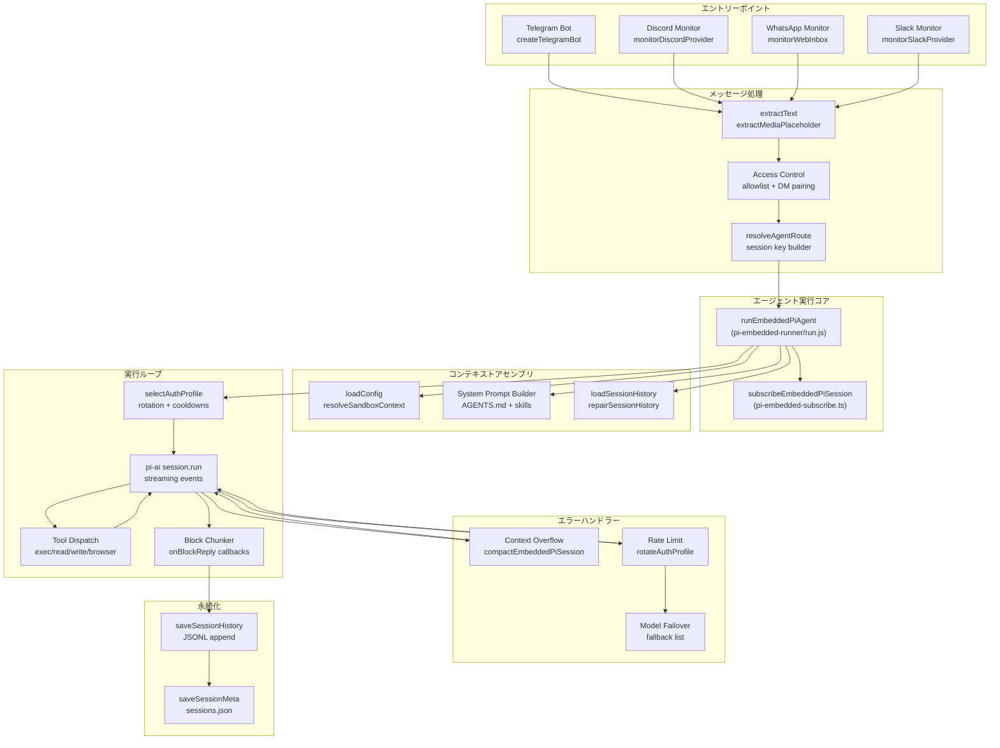
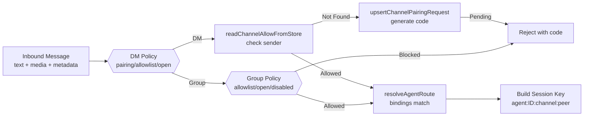
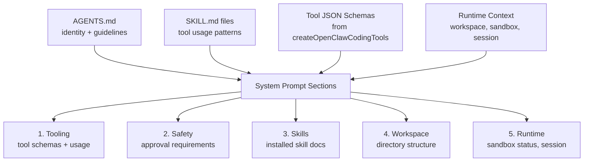
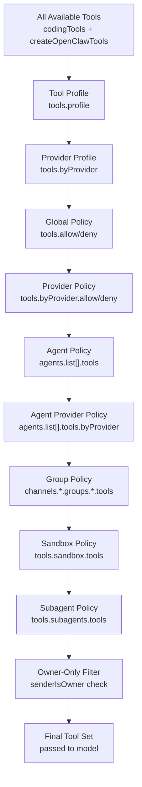
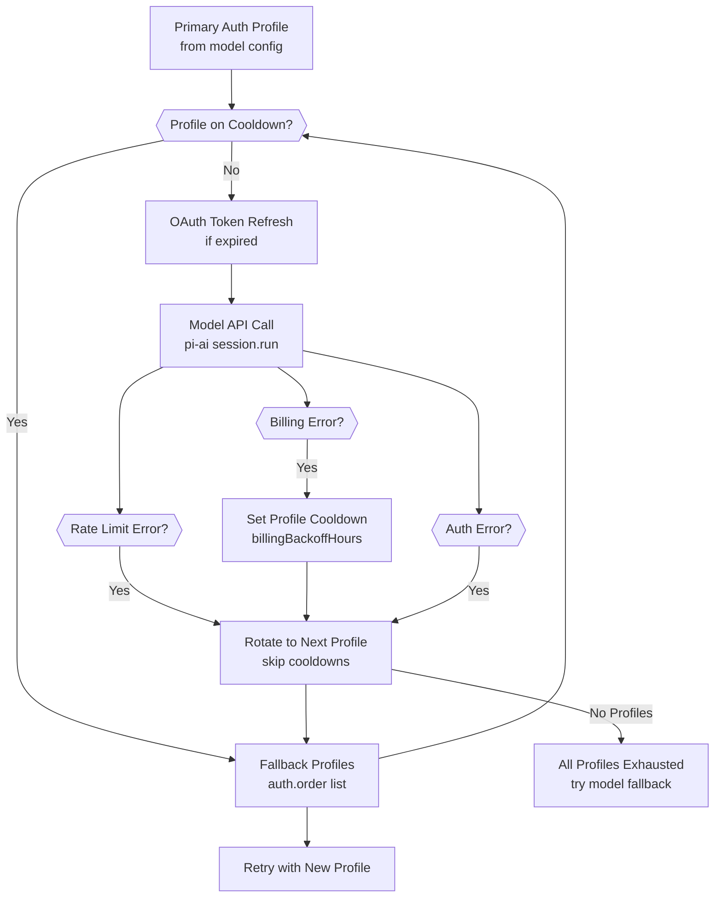
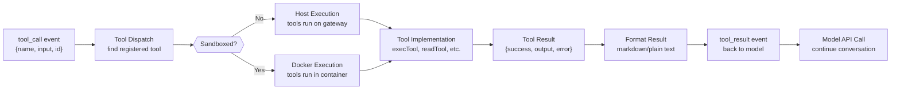
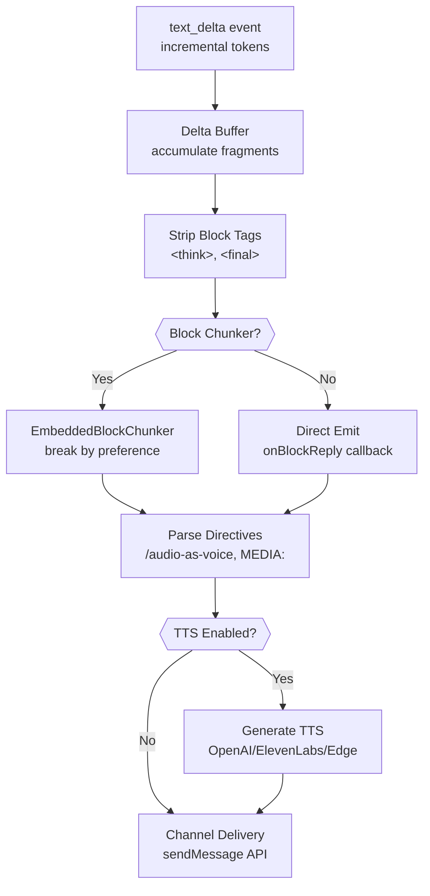
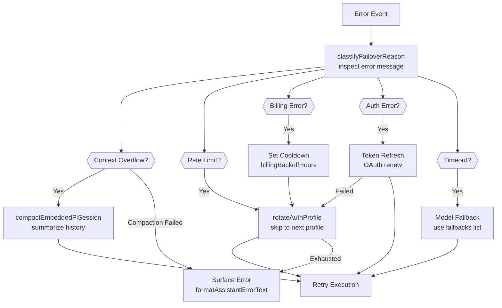
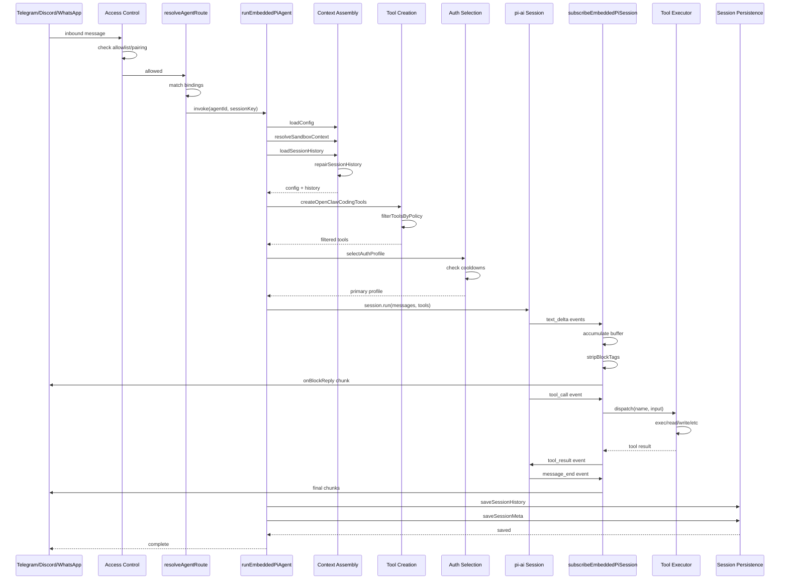

# ページ: エージェント実行フロー

# エージェント実行フロー

<details>
<summary>関連ソースファイル</summary>

この Wiki ページの作成に使用されたコンテキストとなるファイルは以下の通りです：

- [docs/gateway/background-process.md](docs/gateway/background-process.md)
- [src/agents/bash-process-registry.test.ts](src/agents/bash-process-registry.test.ts)
- [src/agents/bash-process-registry.ts](src/agents/bash-process-registry.ts)
- [src/agents/bash-tools.ts](src/agents/bash-tools.ts)
- [src/agents/pi-embedded-helpers.ts](src/agents/pi-embedded-helpers.ts)
- [src/agents/pi-embedded-runner.test.ts](src/agents/pi-embedded-runner.test.ts)
- [src/agents/pi-embedded-runner.ts](src/agents/pi-embedded-runner.ts)
- [src/agents/pi-embedded-subscribe.ts](src/agents/pi-embedded-subscribe.ts)
- [src/agents/pi-tools.ts](src/agents/pi-tools.ts)

</details>


このドキュメントでは OpenClaw におけるエージェントターンの完全な実行パイプラインを説明します。メッセージ受信から応答ストリーミング、永続化までをカバーします。これにはすべてのチャネルを横断するエージェント対話を駆動するコアループが含まれます。

エージェント設定とマルチエージェントルーティングについては [5.3 セッション管理](#5.3) を参照してください。システムプロンプト構築の詳細については [5.2 システムプロンプト](#5.2) を参照してください。ツールのセキュリティとフィルタリングについては [6.2 ツールセキュリティとサンドボックス](#6.2) を参照してください。

---

## 概要

エージェント実行は `runEmbeddedPiAgent` 関数によってオーケストレーションされ、以下を処理します：

1. **セッション解決**: `agent:main:telegram:dm:123456789` のようなキーを使用してチャネルメッセージをエージェントセッションにマッピング
2. **コンテキストアセンブリ**: 設定を読み込み、システムプロンプトを構築、履歴を取得
3. **モデル呼び出し**: 認証プロファイルを選択、ツール定義付きで LLM API を呼び出し
4. **ツール実行**: ループ内でツール（ファイルシステム、実行、ブラウザ、メッセージ）を実行し完了まで待機
5. **応答ストリーミング**: チャネルにテキスト/メディアをチャンクして配信
6. **エラー回復**: オーバーフロー（コンパクション）、レートリミット（プロファイルローテーション）、障害（モデルフォールバック）を処理
7. **永続化**: 会話履歴とトークン使用量を保存

パイプラインは耐障害性を備えています：コンテキストオーバーフローは自動コンパクションをトリガーし、認証障害はプロファイルをローテートし、ツールエラーは適切に処理されます。

---

## 実行パイプラインの概要



**ソース:**
- [src/agents/pi-embedded-runner.ts:11]()
- [src/agents/pi-embedded-subscribe.ts:30-566]()
- [src/telegram/bot.ts:112-490]()
- [src/discord/monitor.ts:22]()
- [src/web/auto-reply.ts:1]()

---

## フェーズ 1: メッセージ受信とセッション解決

チャネル（Telegram、Discord、WhatsApp など）は受信メッセージを監視し、アクセス制御を通過させた後にエージェントを呼び出します。

### アクセス制御フロー



**アクセス制御手順:**

1. **メッセージ内容の抽出**: テキストは `extractText`、メディアは `extractMediaPlaceholder`
2. **DM ポリシーのチェック**: `channels.<provider>.dmPolicy` (`pairing`/`allowlist`/`open`/`disabled`)
3. **許可リストの検証**: `channels.<provider>.allowFrom` または pairing ストアで送信者をマッチ
4. **グループ認証**: グループ ID を `channels.<provider>.groups` または `groupAllowFrom` でマッチ
5. **エージェントへのルーティング**: `bindings` を使用してエージェント ID を選択、セッションキーを構築

**セッションキーの形式:**
```
agent:<agentId>:<channel>:<peerType>:<peerId>
```

例：
- `agent:main:telegram:dm:123456789`
- `agent:work:discord:group:987654321`
- `agent:main:whatsapp:group:120363403215116621@g.us`

**ソース:**
- [src/telegram/bot.ts:67-110]() (シーケンシャルキー生成)
- [src/telegram/bot.ts:286-327]() (グループポリシー解決)
- [src/routing/resolve-route.js]() (エージェントルーティング、bot.ts:449 で参照)
- [src/pairing/pairing-store.js]() (telegram/bot.ts のインポートで参照)

---

## フェーズ 2: コンテキストアセンブリ

モデルを呼び出す前に、エージェントは設定、システムプロンプト、会話履歴を含む実行コンテキストをアセンブルします。

### コンテキストアセンブリのコンポーネント

| コンポーネント | ソース | 目的 |
|-----------|--------|---------|
| **エージェント設定** | `agents.list[]` または `agents.defaults` | ワークスペース、モデル、サンドボックス設定 |
| **システムプロンプト** | `AGENTS.md`、スキル、ツール定義 | モデルの動作を指示 |
| **セッション履歴** | `~/.openclaw/sessions/<agentId>/<sessionKey>.jsonl` | 過去のターン（ユーザー + アシスタント） |
| **ツール定義** | `createOpenClawCodingTools` | JSON スキーマを持つ利用可能なツール |
| **サンドボックスコンテキスト** | `resolveSandboxContext` | Docker コンテナ情報（サンドボックス化の場合） |
| **認証プロファイル** | `<agentDir>/auth-profiles.json` | API キーと OAuth トークン |

### システムプロンプトの構築



**ソース:**
- [src/agents/pi-embedded-runner/system-prompt.js]() (pi-embedded-runner.ts:20 で参照)
- [docs/gateway/configuration.md:17-19]() (ワークスペースとアイデンティティ設定)

---

## フェーズ 3: ツール作成とフィルタリング

ツールはポリシーでフィルタリングされ、モデル API に渡されます。

### ツールポリシーの階層



**ツール作成関数:**

`createOpenClawCodingTools` 関数 ([src/agents/pi-tools.ts:115-453]()) はツールを作成しフィルタリングします：

1. **基本ツール**: `exec`, `read`, `write`, `edit`, `apply_patch`, `process`
2. **OpenClaw ツール**: `browser`, `canvas`, `nodes`, `cron`, `gateway`, `message`, `sessions_*`, `memory_*`, `image`
3. **チャネルツール**: チャネル固有のエージェントツール（ログインなど）
4. **プラグインツール**: 読み込まれたプラグインから

**ポリシーの適用:**

各ポリシーレイヤーはツールを**制限**のみできます（以前のレイヤーで拒否されたツールを付与することはできません）。`deny` にツールが含まれている場合、`allow` リストに関係なくブロックされます。

**ソース:**
- [src/agents/pi-tools.ts:115-453]()
- [src/agents/pi-tools.policy.ts]() (pi-tools.ts のインポートで参照)
- [docs/tools/index.md:32-137]()

---

## フェーズ 4: モデル呼び出しとストリーミング

エージェントは認証プロファイルを選択し、モデル API を呼び出し、ストリーミングイベントを購読します。

### 認証プロファイルの選択とローテーション



**認証プロファイルの構造:**

`<agentDir>/auth-profiles.json` に保存：
```json
{
  "anthropic:me@example.com": {
    "provider": "anthropic",
    "mode": "oauth",
    "email": "me@example.com",
    "tokens": { "access_token": "...", "expires_at": 1234567890 }
  },
  "anthropic:api-key": {
    "provider": "anthropic",
    "mode": "api_key",
    "key": "sk-ant-..."
  }
}
```

**ローテーション順序:**

`auth.order` で定義：
```json
{
  "auth": {
    "order": {
      "anthropic": ["anthropic:me@example.com", "anthropic:work@example.com", "anthropic:api-key"]
    }
  }
}
```

**ソース:**
- [src/agents/model-auth.js]() (pi-tools.ts のインポートで参照)
- [docs/gateway/configuration.md:383-403]() (認証プロファイル設定)

### ストリーミングイベントの購読

`subscribeEmbeddedPiSession` 関数 ([src/agents/pi-embedded-subscribe.ts:30-566]()) はモデルイベントを購読します：

**イベントタイプ:**

| イベント | ハンドラー | 目的 |
|-------|---------|---------|
| `text_delta` | デルタ累積 | 墶分テキストストリーミング |
| `text_end` | テキストの最終化 | アシスタントメッセージの完了 |
| `tool_call` | ツールディスパッチ | 要求されたツールの実行 |
| `tool_result` | ツール出力 | モデルへの結果返却 |
| `message_end` | セッション完了 | 最終クリーンアップと保存 |
| `error` | エラーハンドリング | 障害からの分類と回復 |

**ブロックチャンキング:**

`blockReplyChunking` が設定されている場合、サブスクライバーは `EmbeddedBlockChunker` を使用して以下に基づいて応答をチャンクに分割します：
- `minChars` / `maxChars`: サイズの境界
- `breakPreference`: `paragraph` / `newline` / `sentence`
- `flushDelayMs`: 高速なチャンクのデバウンス

**ソース:**
- [src/agents/pi-embedded-subscribe.ts:30-566]()
- [src/agents/pi-embedded-block-chunker.ts]() (subscribe で参照)
- [src/agents/pi-embedded-subscribe.handlers.ts]() (イベントハンドラー実装)

---

## フェーズ 5: ツール実行ループ

モデルがツール使用を要求した場合、エージェントはツールをディスパッチし、追加のターンのために結果をフィードバックします。

### ツール実行フロー



**ツールカテゴリ:**

| カテゴリ | ツール | 実行コンテキスト |
|----------|-------|-------------------|
| **Filesystem** | `read`, `write`, `edit`, `apply_patch` | サンドボックスまたはホストワークスペース |
| **Runtime** | `exec`, `process` | サンドボックスまたはホストシェル |
| **Web** | `browser`, `web_search`, `web_fetch` | ホストまたはノード |
| **Messaging** | `message` (all channels) | Gateway RPC |
| **Sessions** | `sessions_list`, `sessions_send`, `sessions_spawn` | Gateway 状態 |
| **Memory** | `memory_search`, `memory_get` | Builtin または QMD バックエンド |
| **UI** | `canvas`, `nodes` | 接続されたノード |
| **Automation** | `cron`, `gateway` | Gateway 管理 |

**サンドボックス化された実行:**

`agents.defaults.sandbox.mode` が `"off"` でない場合、ツールは `ensureSandboxWorkspaceForSession` によって作成された Docker コンテナ内で実行されます：

- **スコープ**: `session`（セッションごとのコンテナ）、`agent`（エージェントごと）、`shared`（グローバルコンテナ 1 つ）
- **ワークスペースアクセス**: `none`（空のサンドボックス）、`ro`（読み取り専用マウント）、`rw`（読み書きマウント）
- **ネットワーク**: デフォルトは `"none"`（_egress なし）

**ツール結果:**

ツールは構造化された結果を返します：
```typescript
{
  success: boolean;
  output?: string;
  error?: string;
  metadata?: Record<string, unknown>;
}
```

**ソース:**
- [src/agents/bash-tools.ts:1-10]()
- [src/agents/bash-tools.exec.ts]() (bash-tools.ts で参照)
- [src/agents/bash-tools.process.ts]() (bash-tools.ts で参照)
- [src/agents/sandbox.ts:1-45]()
- [src/agents/sandbox/context.ts]() (sandbox.ts で参照)
- [docs/tools/index.md:179-439]()

---

## フェーズ 6: 応答ストリーミングと配送

モデルがテキストを生成する際、エージェントはチャンクをチャネルにストリーミングします。

### ストリーミングパイプライン



**推論タグの処理:**

`reasoningMode` が設定されている場合：
- `` ブロックは**ストリップ**されます（ユーザー向け返信から）
- `<final>...</final>` ブロックは `enforceFinalTag` が有効な場合に**抽出**されます
- `reasoningMode: "stream"` は `onReasoningStream` を介して推論を別途発行します

**返信ディレクティブ:**

メッセージには配送を変更するディレクティブを含めることができます：
- `/audio-as-voice`: テキストを音声メッセージとして送信
- `MEDIA:<path>`: ワークスペースからメディアを添付
- `/reply-to:<id>`: 特定のメッセージにスレッド

これらは `createStreamingDirectiveAccumulator` と `parseReplyDirectives` によって解析されます。

**メッセージングツールの重複排除:**

`message` のようなツールが `sessions_send` で返信を送信する場合、そのテキストは重複ブロック返信を避けるために追跡されます。サブスクライバーは以下を保持します：
- `messagingToolSentTexts`: コミットされた成功送信
- `messagingToolSentTextsNormalized`: 比較用の正規化バージョン
- `pendingMessagingTexts`: 保留中の送信（まだコミットされていない）

**ソース:**
- [src/agents/pi-embedded-subscribe.ts:291-398]() (ブロックタグのストリップ)
- [src/agents/pi-embedded-block-chunker.ts]() (subscribe で参照)
- [src/auto-reply/reply/reply-directives.ts]() (subscribe で参照)
- [src/auto-reply/reply/streaming-directives.ts]() (subscribe で参照)

---

## フェーズ 7: エラーハンドリングと回復

実行パイプラインには一般的な障害モードのための自動回復メカニズムが含まれます。

### エラー分類と回復



### コンテキストオーバーフローとコンパクション

コンテキストウィンドウが超過した場合、エージェントは自動的に履歴をコンパクトします：

**コンパクション戦略:**

1. **オーバーフロー検出**: `isContextOverflowError` / `isLikelyContextOverflowError`
2. **コンパクション呼び出し**: リカウンター付きで `compactEmbeddedPiSession`
3. **履歴の要約**: 過去のターンを凝縮するようモデルに要求
4. **実行のリトライ**: コンパクション済み履歴で再実行
5. **フォールバック**: コンパクションに失敗した場合はセッションをリセットまたはエラーを表示

**コンパクション制限:**

- `pendingCompactionRetry` カウンターは無限ループを防止
- N 回失敗後、セッションはリセットされるかエラーが表示されます

**ソース:**
- [src/agents/pi-embedded-runner/compact.js]() (pi-embedded-runner.ts:2 で参照)
- [src/agents/pi-embedded-helpers/errors.ts]() (pi-embedded-helpers.ts:10-34 で参照)

### レートリミットと認証の回復

**レートリミット処理:**

1. `isRateLimitErrorMessage` で検出
2. `auth.order` で次のプロファイルにローテート
3. 冷却中のプロファイルをスキップ
4. すべて使い切った場合はモデルフォールバックまたはエラーを表示

**料金エラー処理:**

1. `isBillingErrorMessage` で検出
2. 冷却設定: `auth.cooldowns.billingBackoffHours`（デフォルト: 24h）
3. 次のプロファイルにローテート
4. 冷却は時間切れになるまでプロファイルの再利用を防止

**認証エラー処理:**

1. `isAuthErrorMessage` で検出
2. モードが `"oauth"` の場合は OAuth トークンリフレッシュを試行
3. リフレッシュに失敗した場合やモードが `"api_key"` の場合は次のプロファイルにローテート

**ソース:**
- [src/agents/pi-embedded-helpers/errors.ts]() (エラー分類)
- [src/agents/model-auth.js]() (プロファイルローテーションと冷却)
- [docs/gateway/configuration.md:255-266]() (冷却設定)

---

## フェーズ 8: セッション永続化

完了またはエラー後、エージェントは会話状態を保存します。

### 永続化アーティファクト

| アーティファクト | パス | 形式 | 内容 |
|----------|------|--------|---------|
| **セッション履歴** | `~/.openclaw/sessions/<agentId>/<sessionKey>.jsonl` | JSONL | ユーザーとアシスタントのターン |
| **セッションメタデータ** | `~/.openclaw/sessions/<agentId>/sessions.json` | JSON | セッションサマリー、タイムスタンプ、トークン使用量 |
| **セッションストア** | `session.store` 設定オーバーライド | JSON | 代替ストレージ場所 |

**履歴形式 (JSONL):**

各行は JSON オブジェクトです：
```json
{"role":"user","content":"Write a Python script","timestamp":"2024-01-09T10:30:00.000Z"}
{"role":"assistant","content":"Here's a script:\n```python\nprint('Hello')\n```","timestamp":"2024-01-09T10:30:15.000Z","usage":{"inputTokens":20,"outputTokens":50}}
```

**セッションメタデータ:**

`sessions.json` に保存：
```json
{
  "agent:main:telegram:dm:123456789": {
    "agentId": "main",
    "channel": "telegram",
    "peer": "dm:123456789",
    "firstMessageAt": "2024-01-09T10:00:00.000Z",
    "lastMessageAt": "2024-01-09T10:30:15.000Z",
    "messageCount": 10,
    "totalInputTokens": 2000,
    "totalOutputTokens": 5000
  }
}
```

**履歴修復:**

読み込み前に `repairSessionHistory` は JSONL をサニタイズします：
- 連続する重複メッセージを削除
- 無効なロールシーケンスを修正（ユーザー/アシスタントの交替を強制）
- メッセージ構造を検証

**ソース:**
- [src/config/sessions.js]() (telegram/bot.ts のインポートで参照)
- [src/agents/pi-embedded-runner/history.js]() (pi-embedded-runner.ts:7-9 で参照)

---

## 完全な実行シーケンス

この図はメッセージ受信から永続化までの完全なエージェントターンを示し、すべての主要な関数とデータフローを含みます。

### エンドツーエンドシーケンス



**ソース:**
- [src/agents/pi-embedded-runner/run.js]() (主要なオーケストレーション)
- [src/agents/pi-embedded-subscribe.ts:30-566]() (イベント処理)
- [src/telegram/bot.ts:339-361]() (メッセージプロセッサ)
- [src/routing/resolve-route.js]() (エージェントルーティング)

---

## 主要なデータ構造

### セッションキーコンポーネント

```typescript
type SessionKey = `agent:${agentId}:${channel}:${peerKind}:${peerId}`;

// 例:
// "agent:main:telegram:dm:123456789"
// "agent:work:discord:group:987654321"
// "agent:main:whatsapp:group:120363403215116621@g.us"
```

セッション解決ロジックで解析され、以下を決定：
- どのエージェントがメッセージを処理するか
- どのチャネルから来たか
- DM かグループか
- ピアが誰か（ユーザー ID またはグループ ID）

**ソース:**
- [src/routing/session-key.js]() (解析と検証)

### ツール定義スキーマ

モデルに渡されるツールは JSON Schema を使用します：

```typescript
type AgentTool = {
  name: string;
  description: string;
  input_schema: {
    type: "object";
    properties: Record<string, JSONSchema>;
    required?: string[];
  };
  call: (input: Record<string, unknown>) => Promise<ToolResult>;
};
```

**正規化:**

`normalizeToolParameters` ([src/agents/pi-tools.schema.ts]()) はすべてのプロバイダー（OpenAI、Anthropic、Google）との互換性を確保します。

**ソース:**
- [src/agents/pi-tools.types.ts]() (型定義)
- [src/agents/pi-tools.schema.ts]() (スキーマの正規化)

### エージェント設定構造

```typescript
type AgentConfig = {
  id: string;
  workspace: string;
  agentDir?: string;
  model?: string | { primary: string; fallbacks?: string[] };
  identity?: {
    name?: string;
    theme?: string;
    emoji?: string;
    avatar?: string;
  };
  sandbox?: {
    mode: "off" | "non-main" | "all";
    scope?: "session" | "agent" | "shared";
    workspaceAccess?: "none" | "ro" | "rw";
  };
  tools?: {
    profile?: string;
    allow?: string[];
    deny?: string[];
  };
};
```

**ソース:**
- [src/config/types.agents.ts]() (型定義)
- [docs/gateway/configuration.md:732-791]() (設定ドキュメント)

---

## 設定が実行に与える影響

### 主要な設定ノブ

| 設定パス | 影響 | デフォルト |
|-------------|--------|---------|
| `agents.defaults.model.primary` | 呼び出すモデル API | _(required)_ |
| `agents.defaults.model.fallbacks` | モデルフォールバックリスト | `[]` |
| `agents.defaults.sandbox.mode` | Docker 使用のタイミング | `"off"` |
| `agents.defaults.sandbox.scope` | コンテナライフサイクル | `"session"` |
| `tools.allow` / `tools.deny` | ツールの利用可能性 | すべて許可 |
| `tools.sandbox.tools` | サンドボックスツール制限 | すべて許可 |
| `tools.elevated.enabled` | ホスト実行のエスケープハッチ | `false` |
| `auth.order` | プロファイルローテーションシーケンス | プロバイダー順序 |
| `auth.cooldowns.billingBackoffHours` | 料金エラーの冷却 | 24 |
| `session.mainKey` | メインセッション識別子 | `"main"` |
| `messages.queue.mode` | 同時メッセージ処理 | `"collect"` |

**ソース:**
- [src/config/zod-schema.ts:90-625]() (完全なスキーマ)
- [docs/gateway/configuration.md]() (設定リファレンス)

---

## まとめ

エージェント実行フローは多フェーズのパイプラインです：

1. **認証**: チャネル固有のアクセス制御を使用して受信メッセージを認証
2. **ルーティング**: セッションキーとバインディングを使用して適切なエージェントにルーティング
3. **アセンブリ**: 実行コンテキスト（設定、プロンプト、履歴、ツール）をアセンブル
4. **呼び出し**: 自動フェイルオーバーとプロファイルローテーション付きで LLM API を呼び出し
5. **実行**: モデルが最終応答を生成するまでループ内でツールを実行
6. **ストリーミング**: チャンキングとフォーマットを使用して応答をチャネルにストリーミング
7. **回復**: コンパクション、ローテーション、フォールバックからエラーを回復
8. **永続化**: 将来のターン用に会話状態を永続化

設計は耐障害性を優先しています：コンテキストオーバーフローは自動コンパクションをトリガーし、認証障害はプロファイルをローテートし、ツールエラーは適切に処理されます。モジュラーアーキテクチャにより、チャネルはコアロジックを再実装することなく統合できます。

**主要な実装ファイル:**
- [src/agents/pi-embedded-runner/run.js]() - 主要なオーケストレーター
- [src/agents/pi-embedded-subscribe.ts:30-566]() - イベントストリームハンドラー
- [src/agents/pi-tools.ts:115-453]() - ツール作成とフィルタリング
- [src/agents/sandbox/context.ts]() - サンドボックス設定
- [src/routing/resolve-route.js]() - エージェントルーティング