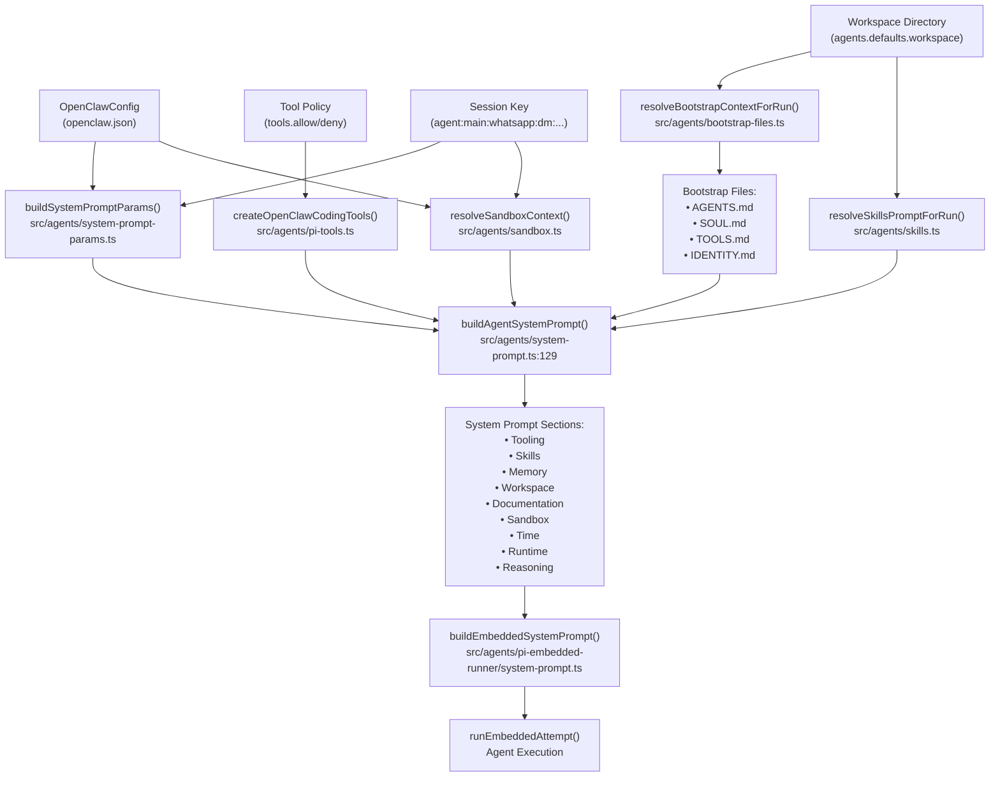
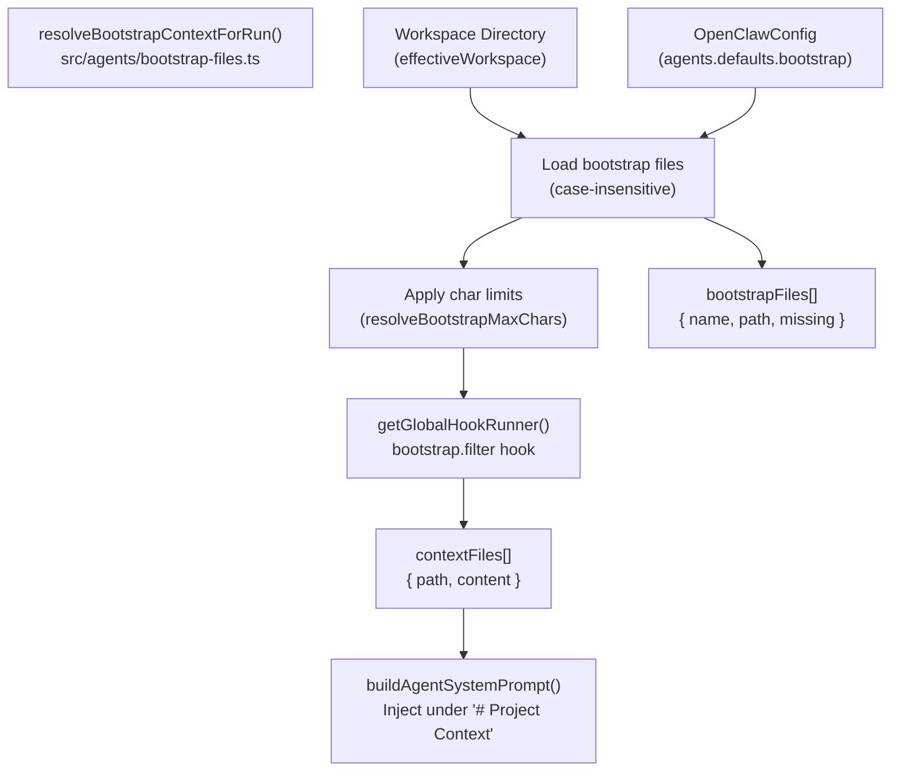
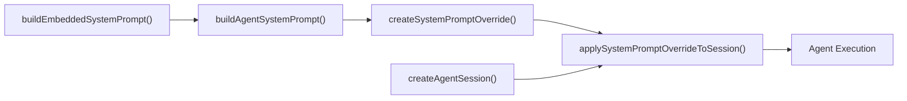

# ページ: システムプロンプト

# システムプロンプト

<details>
<summary>関連ソースファイル</summary>

この Wiki ページの作成に使用されたコンテキストとなるファイルは以下の通りです：

- [docs/concepts/system-prompt.md](docs/concepts/system-prompt.md)
- [docs/gateway/cli-backends.md](docs/gateway/cli-backends.md)
- [docs/reference/token-use.md](docs/reference/token-use.md)
- [src/agents/auth-profiles/oauth.fallback-to-main-agent.test.ts](src/agents/auth-profiles/oauth.fallback-to-main-agent.test.ts)
- [src/agents/auth-profiles/oauth.ts](src/agents/auth-profiles/oauth.ts)
- [src/agents/cli-backends.ts](src/agents/cli-backends.ts)
- [src/agents/cli-runner.test.ts](src/agents/cli-runner.test.ts)
- [src/agents/cli-runner.ts](src/agents/cli-runner.ts)
- [src/agents/cli-runner/helpers.ts](src/agents/cli-runner/helpers.ts)
- [src/agents/pi-embedded-runner/compact.ts](src/agents/pi-embedded-runner/compact.ts)
- [src/agents/pi-embedded-runner/run/attempt.ts](src/agents/pi-embedded-runner/run/attempt.ts)
- [src/agents/pi-embedded-runner/system-prompt.ts](src/agents/pi-embedded-runner/system-prompt.ts)
- [src/agents/system-prompt-params.ts](src/agents/system-prompt-params.ts)
- [src/agents/system-prompt-report.ts](src/agents/system-prompt-report.ts)
- [src/agents/system-prompt.test.ts](src/agents/system-prompt.test.ts)
- [src/agents/system-prompt.ts](src/agents/system-prompt.ts)
- [src/auto-reply/reply/agent-runner.heartbeat-typing.runreplyagent-typing-heartbeat.retries-after-compaction-failure-by-resetting-session.test.ts](src/auto-reply/reply/agent-runner.heartbeat-typing.runreplyagent-typing-heartbeat.retries-after-compaction-failure-by-resetting-session.test.ts)
- [src/auto-reply/reply/commands-context-report.ts](src/auto-reply/reply/commands-context-report.ts)
- [src/gateway/gateway-cli-backend.live.test.ts](src/gateway/gateway-cli-backend.live.test.ts)
- [src/telegram/group-migration.test.ts](src/telegram/group-migration.test.ts)
- [src/telegram/group-migration.ts](src/telegram/group-migration.ts)

</details>


このドキュメントでは OpenClaw が各エージェント実行のためにシステムプロンプトを構築する方法を説明します。システムプロンプトは設定、ワークスペースファイル、ツール定義、ランタイムコンテキストから動的にアセンブルされます。

エージェント実行フローについては [エージェント実行フロー](#5.1) を参照してください。セッションレベルのコンテキストと履歴管理については [セッション管理](#5.3) を参照してください。

---

## 概要

OpenClaw は各エージェントターンにカスタムシステムプロンプトを構築します。このプロンプトはデフォルトの `pi-coding-agent` プロンプトではありません - それは `buildAgentSystemPrompt()` [src/agents/system-prompt.ts:164-612]() によって動的にアセンブルされます。

プロンプトは意図的に**コンパクト**で構造化されており、固定されたセクションを使用してトークン使用量を最小限に抑えつつ、必要なコンテキストを提供します。

### メインビルダー関数

```typescript
buildAgentSystemPrompt(params: {
  workspaceDir: string;
  defaultThinkLevel?: ThinkLevel;
  reasoningLevel?: ReasoningLevel;
  extraSystemPrompt?: string;
  ownerNumbers?: string[];
  reasoningTagHint?: boolean;
  toolNames?: string[];
  toolSummaries?: Record<string, string>;
  modelAliasLines?: string[];
  userTimezone?: string;
  userTime?: string;
  userTimeFormat?: ResolvedTimeFormat;
  contextFiles?: EmbeddedContextFile[];
  skillsPrompt?: string;
  heartbeatPrompt?: string;
  docsPath?: string;
  workspaceNotes?: string[];
  ttsHint?: string;
  promptMode?: PromptMode;  // "full" | "minimal" | "none"
  runtimeInfo?: { ... };
  messageToolHints?: string[];
  sandboxInfo?: { ... };
  reactionGuidance?: { ... };
  memoryCitationsMode?: MemoryCitationsMode;
}): string
```

埋め込みエージェント実行の場合、`buildEmbeddedSystemPrompt()` [src/agents/pi-embedded-runner/system-prompt.ts:11-78]() は `buildAgentSystemPrompt()` をラップし、`createSystemPromptOverride()` [src/agents/pi-embedded-runner/system-prompt.ts:80-85]() を介して pi-agent セッションに注入します。

**ソース:** [src/agents/system-prompt.ts:164-612](), [src/agents/pi-embedded-runner/system-prompt.ts:11-99]()

---

## システムプロンプト構築フロー



**ソース:** [src/agents/system-prompt.ts:129-554](), [src/agents/pi-embedded-runner/system-prompt.ts:9-61](), [src/agents/system-prompt-params.ts:1-133]()

---

## プロンプトモード

OpenClaw は `promptMode` パラメータ [src/agents/system-prompt.ts:8-14]() で 3 つのプロンプトモードをサポートします：

```typescript
type PromptMode = "full" | "minimal" | "none";
```

### モード選択

| モード | 使用タイミング | 出力 | 含まれるセクション |
|------|-----------|--------|-------------------|
| `full` | すべてのユーザー向けセッションのデフォルト | 完全なシステムプロンプト | 以下のすべてのセクション |
| `minimal` | `sessions_spawn` で生成されたサブエージェント | 削減されたシステムプロンプト | ツーリング、セーフティ、ワークスペース、サンドボックス、ランタイム |
| `none` | 予約済み/内部 | アイデンティティ行のみ | `"You are a personal assistant running inside OpenClaw."` |

モードは [src/agents/pi-embedded-runner/run/attempt.ts:344]() で自動的に決定されます：

```typescript
const promptMode = isSubagentSessionKey(params.sessionKey) ? "minimal" : "full";
```

### ミニマルモードで省略されるセクション

`promptMode === "minimal"` または `promptMode === "none"` の場合、これらのセクションはスキップされます [src/agents/system-prompt.ts:350]()：

- Skills (`buildSkillsSection`)
- Memory Recall (`buildMemorySection`)
- OpenClaw Self-Update
- Model Aliases
- User Identity (`buildUserIdentitySection`)
- Current Date & Time (`buildTimeSection`)
- Reply Tags (`buildReplyTagsSection`)
- Messaging (`buildMessagingSection`)
- Voice/TTS (`buildVoiceSection`)
- Documentation (`buildDocsSection`)
- Silent Replies
- Heartbeats

ミニマルモードチェックはセクションビルダーに伝播します：

```typescript
const isMinimal = promptMode === "minimal" || promptMode === "none";
```

これによりサブエージェントのプロンプトはコンパクトになります（フルモードの約 5-10k トークンに対し 1-2k トークン）。

**ソース:** [src/agents/system-prompt.ts:8-14](), [src/agents/system-prompt.ts:350](), [src/agents/pi-embedded-runner/run/attempt.ts:344](), [src/agents/system-prompt.test.ts:26-59]()

---

## システムプロンプトの構造

### セクションアセンブリ順序

`buildAgentSystemPrompt()` 関数 [src/agents/system-prompt.ts:164-612]() はこの順序でセクションをアセンブルします：

```mermaid
graph TB
    Identity["Identity Line<br/>'You are a personal assistant...'"]

    Tooling["## Tooling<br/>Tool list (lines 248-310)<br/>toolNames → coreToolSummaries"]
    ToolCallStyle["## Tool Call Style<br/>Narration guidance"]
    Safety["## Safety<br/>Guardrails (lines 351-357)"]

    CLIRef["## OpenClaw CLI Quick Reference<br/>gateway status/start/stop"]

    Skills["## Skills (optional)<br/>buildSkillsSection (lines 16-38)<br/>if skillsPrompt && !isMinimal"]

    Memory["## Memory Recall (optional)<br/>buildMemorySection (lines 40-66)<br/>if memory_search tool && !isMinimal"]

    SelfUpdate["## OpenClaw Self-Update (optional)<br/>if hasGateway && !isMinimal"]

    ModelAliases["## Model Aliases (optional)<br/>if modelAliasLines && !isMinimal"]

    Workspace["## Workspace<br/>workspaceDir + notes"]

    Docs["## Documentation (optional)<br/>buildDocsSection (lines 146-162)<br/>if docsPath && !isMinimal"]

    Sandbox["## Sandbox (optional)<br/>if sandboxInfo.enabled"]

    UserIdent["## User Identity (optional)<br/>buildUserIdentitySection (lines 68-73)<br/>if ownerNumbers && !isMinimal"]

    Time["## Current Date & Time (optional)<br/>buildTimeSection (lines 75-80)<br/>if userTimezone"]

    ReplyTags["## Reply Tags (optional)<br/>buildReplyTagsSection (lines 82-95)<br/>if !isMinimal"]

    Messaging["## Messaging (optional)<br/>buildMessagingSection (lines 97-133)<br/>if !isMinimal"]

    Voice["## Voice TTS (optional)<br/>buildVoiceSection (lines 135-144)<br/>if ttsHint && !isMinimal"]

    GroupContext["## Group Chat Context (optional)<br/>if extraSystemPrompt && !isMinimal"]

    Reactions["## Reactions (optional)<br/>if reactionGuidance"]

    ReasoningFormat["## Reasoning Format (optional)<br/>if reasoningTagHint"]

    ProjectContext["# Project Context<br/>contextFiles (lines 552-572)<br/>Bootstrap files from workspace"]

    SilentReplies["## Silent Replies (optional)<br/>NO_REPLY token (lines 575-590)<br/>if !isMinimal"]

    Heartbeats["## Heartbeats (optional)<br/>HEARTBEAT_OK protocol (lines 592-603)<br/>if !isMinimal"]

    Runtime["## Runtime<br/>buildRuntimeLine (lines 605-610)<br/>Host/OS/Model/Channel/Thinking"]

    Identity --> Tooling
    Tooling --> ToolCallStyle
    ToolCallStyle --> Safety
    Safety --> CLIRef
    CLIRef --> Skills
    Skills --> Memory
    Memory --> SelfUpdate
    SelfUpdate --> ModelAliases
    ModelAliases --> Workspace
    Workspace --> Docs
    Docs --> Sandbox
    Sandbox --> UserIdent
    UserIdent --> Time
    Time --> ReplyTags
    ReplyTags --> Messaging
    Messaging --> Voice
    Voice --> GroupContext
    GroupContext --> Reactions
    Reactions --> ReasoningFormat
    ReasoningFormat --> ProjectContext
    ProjectContext --> SilentReplies
    SilentReplies --> Heartbeats
    Heartbeats --> Runtime
```



### 条件付きセクションロジック

"(optional)" とマークされたセクションは以下に基づいて条件付きで含まれます：
- **プロンプトモード**: `isMinimal = promptMode === "minimal" || promptMode === "none"` [src/agents/system-prompt.ts:350]()
- **ツールの利用可能性**: `availableTools.has(toolName)` [src/agents/system-prompt.ts:287]() でチェック
- **設定の存在**: `skillsPrompt`、`docsPath`、`ttsHint` などのパラメータ
- **サンドボックスの状態**: `sandboxInfo?.enabled` [src/agents/system-prompt.ts:458]()

**ソース:** [src/agents/system-prompt.ts:164-612]()

### セクション: ツーリング

利用可能なすべてのツールを一行の要約でリストします。ツールの利用可能性は以下でフィルタリングされます：
1. ツールプロファイル (`tools.profile`)
2. プロバイダー固有のポリシー (`tools.byProvider`)
3. グローバル許可/拒否 (`tools.allow`、`tools.deny`)
4. エージェント固有のポリシー (`agents.list[].tools`)
5. グループポリシー（グループチャットの場合）
6. サンドボックスツールポリシー

ツール順序は `toolOrder` 配列 [src/agents/system-prompt.ts:247-271]() から保持されます：
```
read, write, edit, apply_patch, grep, find, ls, exec, process,
web_search, web_fetch, browser, canvas, nodes, cron, message,
gateway, agents_list, sessions_list, sessions_history, sessions_send,
session_status, image
```

この順序にないツールはアルファベット順に追加されます [src/agents/system-prompt.ts:296-309]()。

ツール名のケースは呼び出し元から保持され、小文字で重複を排除します [src/agents/system-prompt.ts:275-285]()。これにより、ツールは `Read`、`read`、または `READ` として一貫して参照できます。

**ソース:** [src/agents/system-prompt.ts:247-309](), [src/agents/system-prompt.ts:218-245]()

### セクション: スキル

`skillsPrompt` が存在し、ミニマルモードでない場合にのみ含まれます [src/agents/system-prompt.ts:16-38]()。

必須のスキル読み込み手順を提供します：
```
Before replying: scan <available_skills> <description> entries.
- If exactly one skill clearly applies: read its SKILL.md at <location> with `read`, then follow it.
- If multiple could apply: choose the most specific one, then read/follow it.
- If none clearly apply: do not read any SKILL.md.
Constraints: never read more than one skill up front; only read after selecting.
```

`readToolName` パラメータ（通常は `"read"`）は利用可能なツールから動的に解決され、指示が実際のツール名のケースと一致することが保証されます [src/agents(system-prompt.ts:31]()。

スキルプロンプト自体（`<available_skills>` を含む XML 形式）はルールの後に追加されます。

**ソース:** [src/agents/system-prompt.ts:16-38](), [src/agents/system-prompt.ts:357-362]()

### セクション: メモリリコール

`memory_search` または `memory_get` ツールが利用可能で、ミニマルモードでない場合にのみ含まれます [src/agents/system-prompt.ts:40-66]()。

このセクションには、いつメモリを検索し、どのようにソースを引用するかに関するガイドが含まれます。引用モードは `params.memoryCitationsMode` によって制御されます：

- `"off"`: "Citations are disabled: do not mention file paths or line numbers in replies unless the user explicitly asks."
- `"auto"` または `"on"`: "Citations: include Source: <path#line> when it helps the user verify memory snippets."

全文：
```
Before answering anything about prior work, decisions, dates, people, preferences,
or todos: run memory_search on MEMORY.md + memory/*.md; then use memory_get to
pull only the needed lines. If low confidence after search, say you checked.
```

**ソース:** [src/agents/system-prompt.ts:40-66]()

### セクション: ワークスペース

常に含まれます [src/agents/system-prompt.ts:451-456]()。作業ディレクトリパスを述べます：
```
Your working directory is: /path/to/workspace
Treat this directory as the single global workspace for file operations unless
explicitly instructed otherwise.
```

オプションのワークスペースメモ（例：「編集後はこのワークスペースで変更をコミットすることを忘れないでください」）は、`params.workspaceNotes` が提供されている場合に追加されます [src/agents/system-prompt.ts:372]()。

**ソース:** [src/agents/system-prompt.ts:451-456](), [src/agents/system-prompt.ts:372]()

### セクション: サンドボックス

`sandboxInfo.enabled === true` の場合にのみ含まれます [src/agents/system-prompt.ts:458-498]()。

以下を記述します：
- サンドボックスランタイムの状態
- ワークスペースディレクトリとアクセスモード（none/ro/rw）
- エージェントワークスペースマウントパス
- ブラウザブリッジ URL（サンドボックスブラウザが有効な場合）
- noVNC オブザーバー URL（利用可能な場合）
- ホストブラウザコントロールの許可
- 昇格された exec の利用可能性と現在のレベル

セクションにはサブエージェントのための注意が含まれます："Sub-agents stay sandboxed (no elevated/host access). Need outside-sandbox read/write? Don't spawn; ask first." [src/agents/system-prompt.ts:462]()

例：
```
You are running in a sandboxed runtime (tools execute in Docker).
Some tools may be unavailable due to sandbox policy.
Sub-agents stay sandboxed (no elevated/host access). Need outside-sandbox read/write? Don't spawn; ask first.
Sandbox workspace: /tmp/sandboxes/session-abc123
Agent workspace access: ro (mounted at /agent)
Elevated exec is available for this session.
User can toggle with /elevated on|off|ask|full.
Current elevated level: ask (ask runs exec on host with approvals; full auto-approves).
```

**ソース:** [src/agents/system-prompt.ts:458-498]()

### セクション: ランタイム

ランタイムセクションはプロンプトの**常に含まれる**最後のセクションです [src/agents/system-prompt.ts:605-610]()。`buildRuntimeLine()` [src/agents/system-prompt.ts:614-651]() によって構築されます：

```
## Runtime
Runtime: agent=main | host=mbp-mario | os=Darwin 23.6.0 (arm64) | node=v20.11.0 | model=anthropic/claude-sonnet-4-5 | channel=telegram | capabilities=inlineButtons | thinking=low
Reasoning: off (hidden unless on/stream). Toggle /reasoning; /status shows Reasoning when enabled.
```

ランタイム行には以下が含まれます：
- `agent=<agentId>`（提供されている場合）
- `host=<hostname>`
- `repo=<repoRoot>`（`.git` で検出された場合）
- `os=<type> <release> (<arch>)`
- `node=<version>`
- `model=<provider>/<modelId>`
- `default_model=<provider>/<model>`（異なる場合）
- `shell=<shell>`（検出されたシェル）
- `channel=<channel>`（例: telegram, signal）
- `capabilities=<list>`（例: inlineButtons）
- `thinking=<level>`（off/low/medium/high）

推論行が続き、現在の表示モードと切り替え手順を示します。

**ソース:** [src/agents/system-prompt.ts:605-610](), [src/agents/system-prompt.ts:614-651](), [src/agents(system-prompt-params.ts:34-59]()

---

## ブートストラップファイルとコンテキスト注入

ブートストラップファイルは、ワークスペースファイルで、**自動的に読み込みられシステムプロンプトの「# Project Context」セクションに注入**されます [src/agents/system-prompt.ts:497-514]()。

### デフォルトのブートストラップファイル

OpenClaw はワークスペースディレクトリ（大文字小文字を区別しない）でこれらのファイルを検索します [src/agents/bootstrap-files.ts]())：
- `AGENTS.md` - エージェントのアイデンティティと動作ガイドライン
- `SOUL.md` - パーソナリティとトーンガイダンス
- `TOOLS.md` - ツール使用手順
- `IDENTITY.md` - ユーザー/オーナーのアイデンティティ情報

`SOUL.md` が存在する場合、プロンプトに以下が追加されます：
```
If SOUL.md is present, embody its persona and tone. Avoid stiff, generic replies;
follow its guidance unless higher-priority instructions override it.
```

### ブートストラップ解決フロー



### 文字数制限

ブートストラップファイルは `DEFAULT_BOOTSTRAP_MAX_CHARS`（デフォルト: ファイルあたり 65536）に制限されます [src/agents/pi-embedded-helpers/bootstrap.ts:13]()。以下で設定：
```json5
{
  agents: {
    defaults: {
      bootstrap: {
        maxChars: 32768  // Override per-file limit
      }
    }
  }
}
```

### カスタムブートストラップファイル

設定でカスタムブートストラップファイルを追加：
```json5
{
  agents: {
    defaults: {
      bootstrap: {
        files: [
          "AGENTS.md",
          "SOUL.md",
          "custom/GUIDELINES.md",
          "docs/CONTEXT.md"
        ]
      }
    }
  }
}
```

**ソース:** [src/agents/bootstrap-files.ts:1-302](), [src/agents/pi-embedded-helpers/bootstrap.ts:1-190](), [src/agents/system-prompt.ts:497-514]()

---

## ツールの説明と要約

ツールの説明は 2 か所に表示されます：
1. **システムプロンプト**（ツーリングセクション）
2. **ツールスキーマ**（モデルに送信される JSON Schema 説明）

### 組み込みツールの要約

コアツールの要約は `coreToolSummaries` [src/agents/system-prompt.ts:182-208]() で定義されます：

```typescript
const coreToolSummaries: Record<string, string> = {
  read: "Read file contents",
  write: "Create or overwrite files",
  edit: "Make precise edits to files",
  apply_patch: "Apply multi-file patches",
  exec: "Run shell commands (pty available for TTY-required CLIs)",
  process: "Manage background exec sessions",
  browser: "Control web browser",
  canvas: "Present/eval/snapshot the Canvas",
  nodes: "List/describe/notify/camera/screen on paired nodes",
  cron: "Manage cron jobs and wake events (use for reminders...)",
  message: "Send messages and channel actions",
  gateway: "Restart, apply config, or run updates...",
  // ...
}
```

### 外部ツールの要約

プラグインツールは `toolSummaries` パラメータ [src/agents/system-prompt.ts:237-257]() で要約を提供できます：

```typescript
const externalToolSummaries = new Map<string, string>();
for (const [key, value] of Object.entries(params.toolSummaries ?? {})) {
  const normalized = key.trim().toLowerCase();
  if (!normalized || !value?.trim()) continue;
  externalToolSummaries.set(normalized, value.trim());
}
```

### ツール名のケース

ツール名は呼び出し元のケースを保持しながら、小文字で重複を排除します [src/agents/system-prompt.ts:239-248]()：

```typescript
const canonicalByNormalized = new Map<string, string>();
for (const name of canonicalToolNames) {
  const normalized = name.toLowerCase();
  if (!canonicalByNormalized.has(normalized)) {
    canonicalByNormalized.set(normalized, name);
  }
}
```

これにより、ツールは `Read`、`read`、または `READ` として一貫して参照できます。

**ソース:** [src/agents/system-prompt.ts:182-271](), [src/agents/tool-summaries.ts:1-82]()

---

## 動的コンテキスト

### 時刻とタイムゾーン

`userTimezone` が提供されており、ミニマルモードでない場合、システムプロンプトには以下が含まれます [src/agents(system-prompt.ts:75-80]()：

```
## Current Date & Time
Time zone: America/Chicago
```

**重要**: システムプロンプトは意図的に**現在の日付や時刻文字列を含みません**。タイムゾーンのみです。これはキャッシュの安定性のためです - 日付/時刻は頻繁に変化し、プロンプトキャッシュを無効にしてしまいます。エージェントは `session_status` ツールまたはメッセージタイムスタンプを使用して現在の日付/時刻を判断する必要があります [src/agents/system-prompt.test.ts:211-228]()。

タイムゾーンが提供される際に `session_status` の使用がヒントとして含まれます："If you need the current date, time, or day of week, run session_status (📊 session_status)." [src/agents(system-prompt.ts:448-450]()。

時刻の表示（`session_status` 経由）は `formatUserTime()` [src/agents/date-time.ts]() を使用し、12 時間制と 24 時間制の両方をサポートします。

**ソース:** [src/agents/system-prompt.ts:75-80](), [src/agents/system-prompt.ts:448-450](), [src/agents/system-prompt.test.ts:211-228]()

### ランタイム情報

ランタイム情報は `buildSystemPromptParams()` [src/agents(system-prompt-params.ts:15-133]() で構築され、`buildAgentSystemPrompt()` に渡されます：

```typescript
runtimeInfo: {
  agentId: "main",
  host: "mbp-mario",
  os: "Darwin 23.6.0",
  arch: "arm64",
  node: "v20.11.0",
  model: "anthropic/claude-sonnet-4-5",
  defaultModel: "anthropic/claude-sonnet-4-5",
  channel: "telegram",
  capabilities: ["inlineButtons"],
  channelActions: ["reactions", "stickers", "polls", ...]
}
```

この情報はプロンプトのさまざまなセクション（例: メッセージングセクションのチャネル機能）を埋めるために使用されますが、スタンドアロンの「ランタイム」セクションとしてレンダリングされるわけではありません。

**ソース:** [src/agents(system-prompt-params.ts:15-133](), [src/agents/pi-embedded-runner/run/attempt.ts:322-338]()

### チャネル機能

チャネル機能はプロバイダーごとに解決されます [src/config/channel-capabilities.ts]() で、エージェントが実行できることに影響を与えます：
- `inlineButtons` - イラインボタンサポート（Telegram）
- その他プロバイダー固有の機能

Telegram の場合、インラインボタンのスコープは `resolveTelegramInlineButtonsScope()` [src/agents/pi-embedded-runner/run/attempt.ts:249-260]() でチェックされます。

### 反応ガイダンス

Telegram と Signal では、反応ガイダンスレベルが含まれます [src/agents(system-prompt.ts:470-492]()：

```
## Reactions
Reactions are enabled for Telegram in MINIMAL mode.
React ONLY when truly relevant:
- Acknowledge important user requests or confirmations
- Express genuine sentiment (humor, appreciation) sparingly
- Avoid reacting to routine messages or your own replies
Guideline: at most 1 reaction per 5-10 exchanges.
```

**ソース:** [src/agents(system-prompt-params.ts:1-133](), [src/agents/system-prompt.ts:52-55](), [src/agents/system-prompt.ts:310-327](), [src/agents/system-prompt.ts:470-492]()

---

## カスタマイズ

### 追加システムプロンプト

`extraSystemPrompt` パラメータはプロンプトにカスタムテキストを追加します [src/agents(system-prompt.ts:464-469]()：

```typescript
if (extraSystemPrompt) {
  const contextHeader = promptMode === "minimal"
    ? "## Subagent Context"
    : "## Group Chat Context";
  lines.push(contextHeader, extraSystemPrompt, "");
}
```

これは以下に使用されます：
- **グループチャット**: グループ固有の指示
- **サブエージェント**: スポナーのタスクコンテキスト

### オーナー番号

オーナー番号はユーザーアイデンティティセクション [src/agents(system-prompt.ts:47-50]() に含まれます：

```
## User Identity
Owner numbers: +15555550123, +447700900456. Treat messages from these numbers as the user.
```

### メッセージングツールのヒント

チャネル固有のメッセージングツールヒントは `resolveChannelMessageToolHints()` [src/agents/channel-tools.ts]() で解決され、メッセージングセクション [src/agents(system-prompt.ts:86-98]() に追加されます。

### TTS ヒント

TTS ヒントは `buildTtsSystemPromptHint()` [src/tts/tts.ts]() で構築され、ボイスセクション [src/agents(system-prompt.ts:106-111]() に追加されます。

**ソース:** [src/agents(system-prompt.ts:464-469](), [src/agents(system-prompt.ts:47-50](), [src/agents(system-prompt.ts:86-98](), [src/agents(system-prompt.ts:106-111]()

---

## システムプロンプトオーバーライド（Pi 統合）

OpenClaw は `createSystemPromptOverride()` [src/agents/pi-embedded-runner/system-prompt.ts:80-85]() を使用して `pi-coding-agent` システムプロンプトをオーバーライドします：

```typescript
export function createSystemPromptOverride(
  systemPrompt: string,
): (defaultPrompt?: string) => string {
  const override = systemPrompt.trim();
  return (_defaultPrompt?: string) => override;
}
```

このオーバーライド関数は `applySystemPromptOverrideToSession()` [src/agents/pi-embedded-runner/system-prompt.ts:87-99]() を使用してエージェントセッションに適用されます：

```typescript
export function applySystemPromptOverrideToSession(
  session: AgentSession,
  override: string | ((defaultPrompt?: string) => string),
) {
  const prompt = typeof override === "function" ? override() : override.trim();
  session.agent.setSystemPrompt(prompt);
  const mutableSession = session as unknown as {
    _baseSystemPrompt?: string;
    _rebuildSystemPrompt?: (toolNames: string[]) => string;
  };
  mutableSession._baseSystemPrompt = prompt;
  mutableSession._rebuildSystemPrompt = () => prompt;
}
```

これはエージェント実行フローで適用されます：



オーバーライドは `createAgentSession()` [src/agents/pi-embedded-runner/run/attempt.ts:398-464]() に渡されます：

```typescript
const systemPromptOverride = createSystemPromptOverride(appendPrompt);
const systemPromptText = systemPromptOverride();

const session = createAgentSession(piAgent, {
  sessionManager: guardedSessionManager,
  // ...
});

applySystemPromptOverrideToSession(session, systemPromptOverride);
```

**ソース:** [src/agents/pi-embedded-runner/system-prompt.ts:80-99](), [src/agents/pi-embedded-runner/run/attempt.ts:398-473]()

---

## 検査とデバッグ

### /context コマンド

`/context` コマンドは現在のセッションのシステムプロンプトを表示します [src/auto-reply/reply/commands-context-report.ts:48-231]()。

出力例：
```
📊 System Prompt Report (session)

🔧 Tooling (15 tools, ~450 tok)
🛠️ Tools.md (~120 tok)
📚 Skills (3 skills, ~280 tok)
📄 Bootstrap (4 files, ~1.8k tok)
  - AGENTS.md (~800 tok)
  - SOUL.md (~600 tok)
  - TOOLS.md (~300 tok)
  - IDENTITY.md (~100 tok)

📦 Total: ~2.7k tokens
```

### システムプロンプトレポート

システムプロンプトレポートはセッション状態に保存されます [src/config/sessions/types.ts:SessionSystemPromptReport]()：

```typescript
export type SessionSystemPromptReport = {
  source: "run" | "command";
  timestamp?: number;
  sections: Array<{
    name: string;
    chars: number;
  }>;
  bootstrap?: Array<{
    path: string;
    chars: number;
  }>;
  tools?: Array<{
    name: string;
    chars: number;
  }>;
  skills?: {
    prompt: number;
    count: number;
  };
  totalChars: number;
};
```

### buildSystemPromptReport

`buildSystemPromptReport()` 関数 [src/agents/system-prompt-report.ts:1-172]() はシステムプロンプトを分析し、内訳を返します：

```typescript
export function buildSystemPromptReport(params: {
  systemPrompt: string;
  toolNames?: string[];
  contextFiles?: Array<{ path: string; content: string }>;
  skillsPrompt?: string;
}): SessionSystemPromptReport
```

**ソース:** [src/auto-reply/reply/commands-context-report.ts:1-231](), [src/agents/system-prompt-report.ts:1-172](), [src/config/sessions/types.ts:SessionSystemPromptReport]()

---

## 主要な関数のまとめ

| 関数 | ファイル | 目的 |
|----------|------|---------|
| `buildAgentSystemPrompt` | [src/agents(system-prompt.ts:129-554]() | コアシステムプロンプトビルダー |
| `buildEmbeddedSystemPrompt` | [src/agents/pi-embedded-runner/system-prompt.ts:9-61]() | 埋め込みランナー用ラッパー |
| `buildSystemPromptParams` | [src/agents(system-prompt-params.ts:15-133]() | ランタイムコンテキスト収集 |
| `buildSystemPromptReport` | [src/agents/system-prompt-report.ts:5-172]() | プロンプトセクション分析 |
| `createSystemPromptOverride` | [src/agents/pi-embedded-runner/system-prompt.ts:1-61]() | Pi agent SDK 統合 |
| `resolveBootstrapContextForRun` | [src/agents/bootstrap-files.ts]() | ブートストラップファイル読み込み |
| `resolveSkillsPromptForRun` | [src/agents/skills.ts]() | スキルプロンプト読み込み |
| `buildRuntimeLine` | [src/agents(system-prompt.ts:556-585]() | ランタイム情報フォーマット |

**ソース:** [src/agents(system-prompt.ts:1-586](), [src/agents/pi-embedded-runner/system-prompt.ts:1-61](), [src/agents(system-prompt-params.ts:1-133](), [src/agents/system-prompt-report.ts:1-172]()