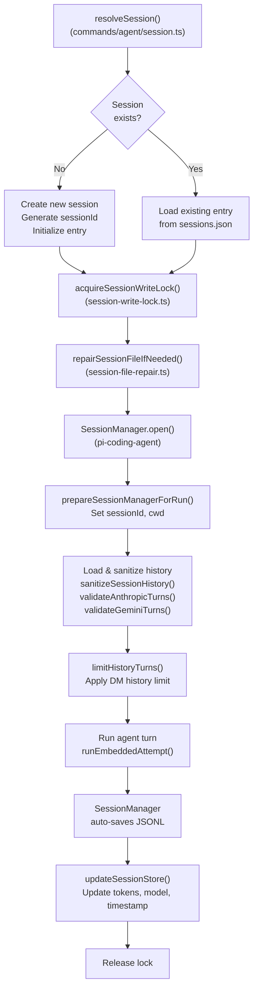
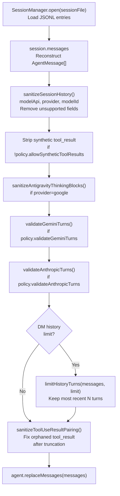
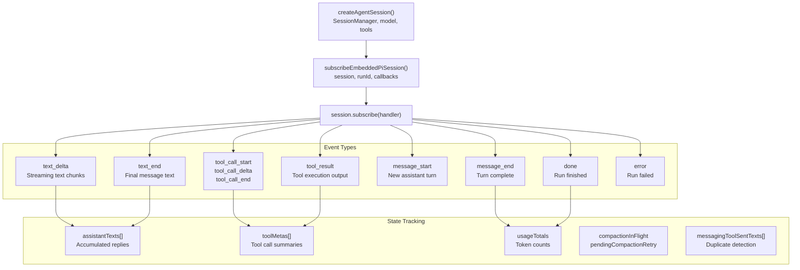
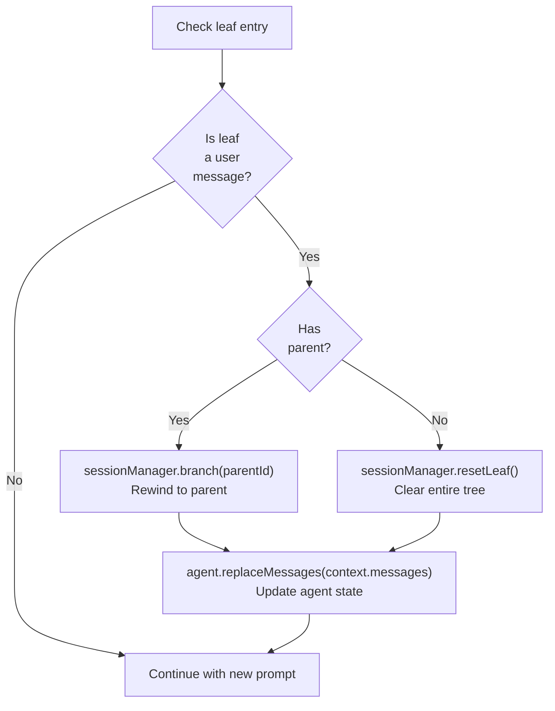

# ページ: セッション管理

# セッション管理

<details>
<summary>関連ソースファイル</summary>

この Wiki ページの作成に使用されたコンテキストとなるファイルは以下の通りです：

- [docs/concepts/system-prompt.md](docs/concepts/system-prompt.md)
- [docs/gateway/background-process.md](docs/gateway/background-process.md)
- [docs/gateway/cli-backends.md](docs/gateway/cli-backends.md)
- [docs/reference/token-use.md](docs/reference/token-use.md)
- [src/agents/auth-profiles/oauth.fallback-to-main-agent.test.ts](src/agents/auth-profiles/oauth.fallback-to-main-agent.test.ts)
- [src/agents/auth-profiles/oauth.ts](src/agents/auth-profiles/oauth.ts)
- [src/agents/bash-process-registry.test.ts](src/agents/bash-process-registry.test.ts)
- [src/agents/bash-process-registry.ts](src/agents/bash-process-registry.ts)
- [src/agents/bash-tools.ts](src/agents/bash-tools.ts)
- [src/agents/cli-backends.ts](src/agents/cli-backends.ts)
- [src/agents/cli-runner.test.ts](src/agents/cli-runner.test.ts)
- [src/agents/cli-runner.ts](src/agents/cli-runner.ts)
- [src/agents/cli-runner/helpers.ts](src/agents/cli-runner/helpers.ts)
- [src/agents/pi-embedded-helpers.ts](src/agents/pi-embedded-helpers.ts)
- [src/agents/pi-embedded-runner.test.ts](src/agents/pi-embedded-runner.test.ts)
- [src/agents/pi-embedded-runner.ts](src/agents/pi-embedded-runner.ts)
- [src/agents/pi-embedded-runner/compact.ts](src/agents/pi-embedded-runner/compact.ts)
- [src/agents/pi-embedded-runner/run/attempt.ts](src/agents/pi-embedded-runner/run/attempt.ts)
- [src/agents/pi-embedded-runner/system-prompt.ts](src/agents/pi-embedded-runner/system-prompt.ts)
- [src/agents/pi-embedded-subscribe.ts](src/agents/pi-embedded-subscribe.ts)
- [src/agents/pi-tools.ts](src/agents/pi-tools.ts)
- [src/agents/system-prompt-params.ts](src/agents/system-prompt-params.ts)
- [src/agents/system-prompt-report.ts](src/agents/system-prompt-report.ts)
- [src/agents/system-prompt.test.ts](src/agents/system-prompt.test.ts)
- [src/agents/system-prompt.ts](src/agents/system-prompt.ts)
- [src/auto-reply/reply/agent-runner.heartbeat-typing.runreplyagent-typing-heartbeat.retries-after-compaction-failure-by-resetting-session.test.ts](src/auto-reply/reply/agent-runner.heartbeat-typing.runreplyagent-typing-heartbeat.retries-after-compaction-failure-by-resetting-session.test.ts)
- [src/auto-reply/reply/commands-context-report.ts](src/auto-reply/reply/commands-context-report.ts)
- [src/gateway/gateway-cli-backend.live.test.ts](src/gateway/gateway-cli-backend.live.test.ts)
- [src/telegram/group-migration.test.ts](src/telegram/group-migration.test.ts)
- [src/telegram/group-migration.ts](src/telegram/group-migration.ts)

</details>


OpenClaw のセッション管理は、会話の永続化、履歴ストレージ、エージェン実行にわたる状態の追跡を処理します。各セッションは JSONL 形式で完全な会話履歴を維持し、メタデータは個別に高速ルックアップとルーティング用に保存されます。

セッションレベルの設定オーバーライド（モデル選択、思考レベル）については [モデル選択とフェイルオーバー](#5.4) を参照してください。コンパクションと履歴の剪定については [コンテキストオーバーフローと自動コンパクション](#5.5) を参照してください。

---

## セッションキーの形式

セッションキーは会話を一意に識別し、ルーティング、エージェント選択、分離の境界を決定します。形式はエージェント、チャネル、会話ピアをエンコードする階層パターンに従います。

**形式**: `agent:ID:channel:peer`

| コンポーネント | 説明 | 例 |
|-----------|-------------|---------|
| `agent` | リテラル接頭辞 | `agent` |
| `ID` | エージェント識別子（main, work など） | `main`, `work` |
| `channel` | メッセージプロバイダー | `telegram`, `signal`, `whatsapp` |
| `peer` | 会話識別子（E.164、ユーザーID、グループID） | `+15551234567`, `user:123`, `group:-456` |

**例**:
- `agent:main:telegram:+15551234567` - メインエージェント、Telegram DM
- `agent:work:signal:group:-100` - ワークエージェント、Signal グループ
- `agent:main:whatsapp:+14155551234` - メインエージェント、WhatsApp DM

サブエージェントセッションは `agent:parent:subagent:ID` のパターンに従い、親セッションキーが埋め込まれます。キーの解析と検証については [src/routing/session-key.ts:1-50]() を参照してください。

**ソース**: [src/routing/session-key.ts:1-100](), [src/config/sessions.ts:40-80]()

---

## セッションファイルストレージ

各セッションは JSONL ファイル（`.jsonl`）で永続的な会話履歴を維持します。ファイルにはメッセージ、ツール呼び出し、ツール結果を表すエントリのシーケンスが含まれます。

### ファイルの場所

セッションファイルは以下の場所に保存されます：
```
~/.openclaw/agents/<agentId>/sessions/<sessionId>.jsonl
```

メインエージェント（`agentId` = `main`）の場合：
```
~/.openclaw/agents/main/sessions/<sessionId>.jsonl
```

パスは `resolveSessionFilePath()` で解決され、`sessionId`、オプションの `sessionEntry`、エージェントコンテキストを受け取ります。

**ソース**: [src/config/sessions.ts:120-180](), [src/agents/pi-embedded-runner/run/attempt.ts:401-410]()

### JSONL 形式

セッションファイルの各行はエントリを表す JSON オブジェクトです。`SessionManager`（`@mariozechner/pi-coding-agent` から）は JSONL からの読み取り、書き込み、セッションツリー構造のナビゲーションを処理します。

**エントリタイプ**:

| タイプ | 説明 | フィールド |
|------|-------------|--------|
| `message` | ユーザーまたはアシスタントのメッセージ | `type`, `message: { role, content, timestamp, api, provider, model, usage?, stopReason? }` |
| `tool_call` | ツール呼び出し要求 | `type`, `toolCall: { name, params, id }` |
| `tool_result` | ツール実行結果 | `type`, `toolResult: { toolCallId, result, isError? }` |
| `header` | セッションメタデータ（最初のエントリ） | `type: "header"`, `sessionId`, `cwd` |

セッションファイルの例：
```jsonl
{"type":"header","sessionId":"session-abc123","cwd":"/workspace"}
{"type":"message","message":{"role":"user","content":"hello","timestamp":1704067200000}}
{"type":"message","message":{"role":"assistant","content":"Hi!","timestamp":1704067201000,"api":"anthropic-messages","provider":"anthropic","model":"claude-opus-4-5","usage":{"input":10,"output":5},"stopReason":"stop"}}
{"type":"tool_call","toolCall":{"name":"exec","params":{"command":"date"},"id":"tc_1"}}
{"type":"tool_result","toolResult":{"toolCallId":"tc_1","result":"Mon Jan 1 12:00:00","isError":false}}
```

**セッションツリーのナビゲーション**：
- `SessionManager.open(file)` - JSONL からセッションをロード
- `SessionManager.appendMessage(msg)` - 現在のブランチにエントリを追加
- `SessionManager.branch(parentId)` - 以前の状態に巻き戻し
- `SessionManager.resetLeaf()` - すべてのツリーをクリア

セッションファイルは通常操作中は append-only です。分岐は履歴を削除せずに代替的な会話パスを作成します。

**ソース**: [src/agents/pi-embedded-runner/run/attempt.ts:408-435](), [src/agents/pi-embedded-runner.test.ts:290-320](), [src/agents/session-file-repair.ts:1-50]()

---

## セッションメタデータストア

セッションメタデータストア（`sessions.json`）は、ルーティング、フィルタリング、UI 表示のためにフルセッションファイルをロードせずに高速アクセス用のメタデータを保持します。

### 場所

```
~/.openclaw/sessions.json
```

`openclaw.json` の `session.store` で設定されます。

### ストアの構造

```typescript
{
  "agent:main:telegram:+15551234567": {
    "sessionId": "session-abc123",
    "sessionKey": "agent:main:telegram:+15551234567",
    "updatedAt": 1704067200000,
    "channel": "telegram",
    "chatType": "dm",
    "thinkingLevel": "high",
    "verboseLevel": "on",
    "modelOverride": "claude-opus-4-5",
    "providerOverride": "anthropic",
    "totalTokens": 45234,
    "inputTokens": 32100,
    "outputTokens": 13134,
    "contextTokens": 28000,
    "groupId": null,
    "groupChannel": null,
    "space": null,
    "spawnedBy": null,
    "skillsSnapshot": {...}
  }
}
```

| フィールド | 型 | 説明 |
|-------|------|-------------|
| `sessionId` | `string` | 一意のセッション識別子 |
| `sessionKey` | `string` | 完全なセッションキー（agent:ID:channel:peer） |
| `updatedAt` | `number` | 最終アクティブタイムスタンプ（ms） |
| `channel` | `string` | メッセージプロバイダー（telegram, signal など） |
| `chatType` | `string` | `dm`, `group`, `channel` |
| `thinkingLevel` | `string` | 持続的な思考オーバーライド（off/low/high/xhigh） |
| `verboseLevel` | `string` | 持続的な冗長オーバーライド（off/on/full） |
| `modelOverride` | `string` | セッション固有のモデル選択 |
| `providerOverride` | `string` | セッション固有のプロバイダー選択 |
| `totalTokens` | `number` | 累積トークン使用量 |
| `inputTokens` | `number` | 累積入力トークン |
| `outputTokens` | `number` | 累積出力トークン |
| `contextTokens` | `number` | 現在のコンテキストウィンドウ使用量 |
| `skillsSnapshot` | `object` | セッション用のフリーズされたスキル状態 |

ストアは各エージェント実行後に `updateSessionStore()` で更新されます。

**ソース**: [src/config/sessions.ts:200-350](), [src/commands/agent/session-store.ts:1-100]()

---

## セッションライフサイクル



**ソース**: [src/commands/agent/session.ts:1-150](), [src/agents/pi-embedded-runner/run/attempt.ts:400-440]()

### セッション解決

`--to`、`--session-id`、`--session-key`、または `--agent` 付きでコマンドが到着した場合：

1. **セッションキーの派生**: `--to` が提供されている場合、エージェント + チャネル + ピアからキーを生成
2. **メタデータの読み込み**: `sessions.json` でエントリをルックアップ
3. **不足の作成**: 新しい `sessionId` を生成しエントリを初期化
4. **コンテキストの返却**: `sessionId`、`sessionKey`、`sessionEntry`、`sessionStore`、`storePath` を提供

**ソース**: [src/commands/agent/session.ts:20-120](), [src/commands/agent.ts:139-156]()

### セッションの初期化

新しいセッションの場合：

1. `sessionId` を生成（例: `session-<uuid>`）
2. `updatedAt`、`channel`、`chatType` でセッションエントリを作成
3. `sessions.json` に書き込み
4. 初回実行時に不足している場合、スナップショットを構築

`sessions_spawn` で生成されたサブエージェントの場合、セッションキーに親セッションコンテキストが含まれます。

**ソース**: [src/commands/agent.ts:189-217](), [src/agents/pi-embedded-runner/run/attempt.ts:189-217]()

---

## セッション履歴管理

セッション履歴は JSONL ファイルからロードされ、対象モデル API 用にサニタイズされ、ターン順序の検証が行われ、オプションで制限された後にモデルプロバイダーに渡されます。

**履歴処理パイプライン**



**ソース**: [src/agents/pi-embedded-runner/run/attempt.ts:544-574](), [src/agents/pi-embedded-runner/google.ts:200-350]()

### 履歴サニタイズ

`sanitizeSessionHistory()` 関数は、サポートされていないフィールドを削除しプロバイダー固有の問題を修正することで、セッション履歴をさまざまなモデル API に適合させます。

**サニタイズ操作**:

| 操作 | プロバイダー | 説明 |
|-----------|----------|-------------|
| Strip synthetic tool_result | Anthropic | アシスタントメッセージ内の一致する tool_use がない tool_result エントリを削除 |
| Fix turn ordering | Anthropic, Gemini | ユーザー/アシスタントの交替を保証、連続するターンを統合 |
| Clean thinking blocks | Google | Gemini の形式と競合する `ς` ブロックを削除またはエスケープ |
| Remove unsupported fields | All | プロバイダー固有のメタデータ（キャッシュ制御など）をストリップ |
| Repair tool pairings | All | 切り捨て後の孤立した tool_use または tool_result を修正

**トランスクリプトポリシーの解決**:

```typescript
const policy = resolveTranscriptPolicy({
  modelApi: "anthropic-messages",
  provider: "anthropic",
  modelId: "claude-opus-4-5"
});
// Returns: {
//   allowSyntheticToolResults: false,
//   validateAnthropicTurns: true,
//   validateGeminiTurns: false,
//   repairToolUseResultPairing: true
// }
```

ポリシーは `modelApi`（例: `anthropic-messages`、`openai-responses`、`google-generative-ai`）によって決定され、どのサニタイズステップを実行するかを制御します。

**ソース**: [src/agents/pi-embedded-runner/run/attempt.ts:544-570](), [src/agents/transcript-policy.ts:1-100](), [src/agents/session-transcript-repair.ts:1-150](), [src/agents/pi-embedded-runner/google.ts:200-350]()

### ターン検証

#### Anthropic 検証

`validateAnthropicTurns()` は以下を保証します：
- 最初のメッセージは `user` ロール
- 同じロールの連続メッセージなし
- 連続するユーザー/アシスタントメッセージを単一ターンに統合

**ソース**: [src/agents/pi-embedded-helpers.ts:400-500]()

#### Gemini 検証

`validateGeminiTurns()` は以下を保証します：
- 最初のメッセージは `user` ロール
- 厳密なユーザー/アシスタントの交替
- Google の特定のターン要件を処理

**ソース**: [src/agents/pi-embedded-helpers.ts:500-600]()

### 履歴の制限

DM セッションは無制限なコンテキスト成長を防ぐために履歴制限を持つことができます：

```typescript
getDmHistoryLimitFromSessionKey(
  sessionKey: "agent:main:telegram:+15551234567",
  config
)
// Returns configured limit or undefined
```

制限は `limitHistoryTurns()` で適用され、最新の N 個のメッセージペアを保持します。

**設定**:
```json
{
  "agents": {
    "defaults": {
      "dmHistoryLimit": 50
    }
  }
}
```

**ソース**: [src/agents/pi-embedded-runner/history.ts:1-100](), [src/agents/pi-embedded-runner/run/attempt.ts:557-560]()

---

## セッションイベント購読

エージェント実行中、OpenClaw はアシスタントの応答、ツール呼び出し、使用量、状態変化を追跡するためにセッションイベントを購読します。`subscribeEmbeddedPiSession()` 関数は `AgentSession` を監視し結果を集約する購読を作成します。

**購読アーキテクチャ**



**追跡状態**（`EmbeddedPiSubscribeState` から）:

```typescript
{
  assistantTexts: string[],           // All assistant message texts
  toolMetas: ToolMeta[],               // Tool calls and results
  toolMetaById: Map<string, ToolMeta>, // Quick lookup by call ID
  lastToolError?: { name, error },     // Most recent tool failure

  // Usage tracking
  usageTotals: { input, output, cacheRead, cacheWrite, total },

  // Compaction state
  compactionInFlight: boolean,
  pendingCompactionRetry: number,

  // Messaging tool deduplication
  messagingToolSentTexts: string[],
  messagingToolSentTextsNormalized: string[],
  messagingToolSentTargets: Array<{ channel, to }>,

  // Block reply streaming
  blockReplyBreak: "text_end" | "message_end",
  blockBuffer: string,
  lastBlockReplyText?: string,

  // Reasoning mode
  reasoningMode: "off" | "on" | "stream",
  lastStreamedReasoning?: string
}
```

**コールバックフック**：
- `onToolResult(payload)` - 冗長モードでツールサマリーを発行する際に呼び出し
- `onReasoningStream(payload)` - ストリーミング推論テキスト用（`reasoningMode: "stream"` の場合）
- `onBlockReply(payload)` - 増分返信チャンク用（ストリーミング有効の場合）
- `onPartialReply(payload)` - 部分的アシスタント更新用

**使用量集約**:

```typescript
const subscription = subscribeEmbeddedPiSession({
  session: agentSession,
  runId: "run-123",
  verboseLevel: "on",
  reasoningMode: "stream",
  onToolResult: (payload) => { /* ... */ },
  onBlockReply: (payload) => { /* ... */ }
});

// After run completes:
const texts = subscription.assistantTexts;  // ["first reply", "second reply"]
const tools = subscription.toolMetas;       // [{ name: "exec", params, result }]
const usage = subscription.getUsageTotals(); // { input: 1000, output: 500, ... }
const lastError = subscription.getLastToolError(); // { name: "exec", error: "..." }

subscription.unsubscribe();
```

購読は以下を追跡します：
1. すべてのアシスタントメッセージテキスト（トランスクリプト構築用）
2. ツール呼び出し/結果ペア（冗長出力用）
3. すべてのターンにおけるトークン使用量（セッションストア更新用）
4. コンパクションリトライ（コンテキストオーバーフロー時の自動リトライ用）
5. メッセージングツールの重複排除（重複ブロック返信を抑制するため）

**ソース**: [src/agents/pi-embedded-subscribe.ts:32-635](), [src/agents/pi-embedded-runner/run/attempt.ts:632-708]()

---

## セッションロック

セッションファイルは、エージェント実行とコンパクション中に同時修正と競合状態を防ぐための書き込みロックメカニズムを使用します。

**ロックの取得**:

```typescript
const sessionLock = await acquireSessionWriteLock({
  sessionFile: "/path/to/session.jsonl"
});
// Lock held until function returns or process exits
```

**ロックのプロパティ**：
- `proper-lockfile` を使用したファイルベースのロック
- 同じセッションファイルへの同時書き込みをブロック
- プロセス終了時に自動リリース（`onExit` ハンドラー経由）
- 古いロック検出をサポート（デフォルト: 10 秒）
- ロックが保持されている場合は取得をリトライ（デフォルト: 5 回）

**ロックのスコープ**：
- `SessionManager` オープン前に取得
- エージェント実行全体の間保持（プロンプト → ツール呼び出し → 応答）
- コンパクション操作中に保持
- セッションリセット/修復中に保持

複数のセッションの読み取りは同時に発生できますが、同じセッションへの書き込みはシリアル化されます。

**ソース**: [src/agents/session-write-lock.ts:1-100](), [src/agents/pi-embedded-runner/run/attempt.ts:405-407](), [src/agents/pi-embedded-runner/compact.ts:364-366]()

### ロックのスコープ

ロックは取得されます：
- `SessionManager` オープン前
- 任意のセッションファイル修正前
- コンパクション操作中
- セッションリセット中

複数の読み取りは同時に発生できますが、書き込みはシリアル化されます。

**ソース**: [src/agents/pi-embedded-runner/compact.ts:361-363]()

---

## セッション修復

セッションファイルはクラッシュ、不完全な書き込み、または形式の変更によって破損することがあります。修復システムは一般的な問題を検出し修正します。

### 修復のトリガー

```typescript
await repairSessionFileIfNeeded({
  sessionFile: "/path/to/session.jsonl",
  warn: (message) => log.warn(message)
});
```

呼び出される場所：
- `runEmbeddedAttempt()` で `SessionManager` オープン前
- `compactEmbeddedPiSessionDirect()` でコンパクション前
- セッションロードエラー時

**ソース**: [src/agents/session-file-repair.ts:1-200](), [src/agents/pi-embedded-runner/run/attempt.ts:408-411]()

### 修復操作

| 問題 | 検出 | 修正 |
|-------|-----------|-----|
| 孤立したユーザーメッセージ（リーフ） | 最終エントリがユーザーメッセージでアシスタント応答なし | 孤立したメッセージを削除または親に分岐 |
| 欠落したセッションヘッダー | 開始にヘッダーエントリなし | sessionId と cwd でヘッダーを注入 |
| 形式不正な JSON 行 | JSON 解析エラー | 無効な行をスキップ、警告 |
| 不完全なツール呼び出し/結果ペア | ツール呼び出しが結果なし | 合成結果を注入または呼び出しを削除

### 孤立メッセージの修復



これにより、モデル API 制約に違反する連続ユーザーターンを防ぎます。

**ソース**: [src/agents/pi-embedded-runner/run/attempt.ts:747-760](), [src/agents/pi-embedded-runner.test.ts:477-507]()

---

## セッションマネージャーキャッシュ

セッションファイル I/O を削減するために、OpenClaw は最近アクセスされた `SessionManager` インスタンスのメモリ内キャッシュを維持します。

**キャッシュ操作**:

```typescript
await prewarmSessionFile(sessionFile);
// Preload session into cache before run starts

trackSessionManagerAccess(sessionFile);
// Update LRU access time after using cached manager
```

**キャッシュの動作**:
- 絶対ファイルパスをキーに `SessionManager` インスタンスを保存
- LRU 除外ポリシーを使用（デフォルト: 50 エントリ）
- 外部ファイル修正で自動無効化（`fs.watch` 経由）
- キャッシュヒットは JSONL の再解析とメッセージツリーの再構築を回避
- キャッシュミスは通常の `SessionManager.open()` フローをトリガー

**キャッシュのライフサイクル**：
1. `prewarmSessionFile()` - 実行開始前にセッションをキャッシュにロード
2. `SessionManager.open()` - キャッシュをチェック、キャッシュされたインスタンスを返すまたはディスクからロード
3. `trackSessionManagerAccess()` - LRU のアクセス時間を更新
4. キャッシュサイズ制限を超えた場合の自動除外

この最適化は、グループチャットや高速 DM 対話など、頻繁なメッセージ交換を行うアクティブセッションのパフォーマンスを大幅に改善します。

**ソース**: [src/agents/pi-embedded-runner/session-manager-cache.ts:1-200](), [src/agents/pi-embedded-runner/run/attempt.ts:427-433]()

---

## セッションストアの更新

各エージェント実行後、セッションメタデータストア（`sessions.json`）は累積使用量、モデル情報、タイムスタンプで更新されます。

**更新フロー**:

```typescript
await updateSessionStoreAfterAgentRun({
  cfg,
  contextTokensOverride,
  sessionId,
  sessionKey,
  storePath,
  sessionStore,
  defaultProvider,
  defaultModel,
  fallbackProvider,
  fallbackModel,
  result // EmbeddedPiRunResult with { meta: { agentMeta: { usage } } }
});
```

**更新されたフィールド**:

| フィールド | ソース | 説明 |
|-------|--------|-------------|
| `updatedAt` | `Date.now()` | 最終アクティブタイムスタンプ |
| `totalTokens` | `session.totalTokens + usage.total` | 累積トークン（すべての実行） |
| `inputTokens` | `session.inputTokens + usage.input` | 累積入力トークン |
| `outputTokens` | `session.outputTokens + usage.output` | 累積出力トークン |
| `contextTokens` | `contextTokensOverride ?? estimateContextTokens()` | 現在のコンテキストウィンドウサイズ |
| `providerOverride` | `fallbackProvider`（フォールバック発生時） | 持続的なプロバイダーオーバーライド |
| `modelOverride` | `fallbackModel`（フォールバック発生時） | 持続的なモデルオーバーライド |
| `lastRunDurationMs` | `result.meta.durationMs` | 最後の実行期間

**永続性**：
- 更新中はストアがロックされます（`lockfile` 経由）
- 変更はアトミックに書き込まれます
- すべての更新でストアが読み込まれ/保存されます（メモリ内キャッシュなし）

**使用量追跡**:

使用量は `getUsageTotals()` から来て、実行中のすべてのモデル呼び出しを集約します：

```typescript
const subscription = subscribeEmbeddedPiSession({ ... });
// Run completes
const usage = subscription.getUsageTotals();
// usage: { input: 1000, output: 500, cacheRead: 200, cacheWrite: 100, total: 1800 }
```

実行に複数のモデル呼び出しが含まれる場合（例: コンパクションリトライ）、すべての使用量が合計されます。

**ソース**: [src/commands/agent/session-store.ts:1-150](), [src/commands/agent.ts:500-530](), [src/agents/pi-embedded-subscribe.ts:235-268]()

---

## セッションコンテキストオーバーフロー

セッションがモデルのコンテキストウィンドウを超えた場合、OpenClaw は要求を失敗させる前に自動コンパクションを試行します。詳細な処理については [コンテキストオーバーフローと自動コンパクション](#5.5) を参照してください。

**オーバーフロー検出**：
- モデル API からのコンテキストオーバーフローエラーをキャッチ
- 診断情報をログ（メッセージ数、セッションファイル、プロバイダー/モデル）
- 最大 3 回の自動コンパクションリトライを試行

**コンパクション呼び出し**:
```typescript
await compactEmbeddedPiSessionDirect({
  sessionId,
  sessionKey,
  sessionFile,
  workspaceDir,
  config,
  provider,
  model: modelId,
  thinkLevel,
  reasoningLevel
});
```

成功の場合、元のプロンプトがリトライされます。失敗の場合、ユーザーフレンドリーなエラーが返されます。

**ソース**: [src/agents/pi-embedded-runner/run.ts:376-425](), [src/agents/pi-embedded-runner/compact.ts:114-450]()

---

## セッションのリセットと削除

セッションは履歴をクリアしてメタデータを保持するリセット、または完全な削除ができます。

### ゲートウェイ経由でのリセット

```typescript
{
  "method": "sessions.reset",
  "params": {
    "sessionKey": "agent:main:telegram:+15551234567"
  }
}
```

**動作**：
- `.jsonl` ファイルを削除
- `sessions.json` でのセッションメタデータを保持
- 次の実行で新規履歴を開始

**ソース**: [src/gateway/server-methods/sessions.ts:200-250]()

### ゲートウェイ経由での削除

```typescript
{
  "method": "sessions.delete",
  "params": {
    "sessionKey": "agent:main:telegram:+15551234567"
  }
}
```

**動作**：
- `.jsonl` ファイルを削除
- `sessions.json` からエントリを削除
- セッションキーが再利用可能になる

**ソース**: [src/gateway/server-methods/sessions.ts:250-300]()

---

## セッションマネージャーガード

`guardSessionManager()` ラッパーはセッションレベルの不変条件とポリシーを強制します：

```typescript
const sessionManager = guardSessionManager(
  SessionManager.open(sessionFile),
  {
    agentId: "main",
    sessionKey: "agent:main:telegram:+15551234567",
    allowSyntheticToolResults: false
  }
);
```

**強制**：
- `allowSyntheticToolResults=false` のとき合成ツール結果をブロック
- ツール呼び出し/結果ペアの検証
- ポリシー違反の警告ログ
- 無効なセッション状態の防止

**ソース**: [src/agents/session-tool-result-guard-wrapper.ts:1-150](), [src/agents/pi-embedded-runner/run/attempt.ts:424-428]()

---

## コマンド用のセッション解決

`resolveSession()` ヘルパーは CLI、ゲートウェイ、チャネルハンドラー全体でセッション解決を統一します：

```typescript
const resolution = resolveSession({
  cfg,
  to: "+15551234567",
  sessionId: undefined,
  sessionKey: undefined,
  agentId: "main"
});
// Returns: {
//   sessionId,
//   sessionKey,
//   sessionEntry,
//   sessionStore,
//   storePath,
//   isNewSession,
//   persistedThinking,
//   persistedVerbose
// }
```

**優先順位**：
1. `sessionKey`（明示的、最高優先度）
2. `sessionId`（ストアでのルックアップ）
3. `to` + `agentId`（ルーティングからキーを派生）
4. 単独の `agentId`（メインセッションキーを使用）

**ソース**: [src/commands/agent/session.ts:1-150](), [src/commands/agent.ts:139-156]()