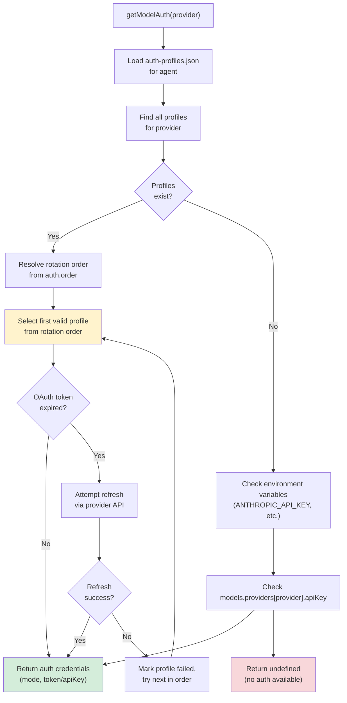
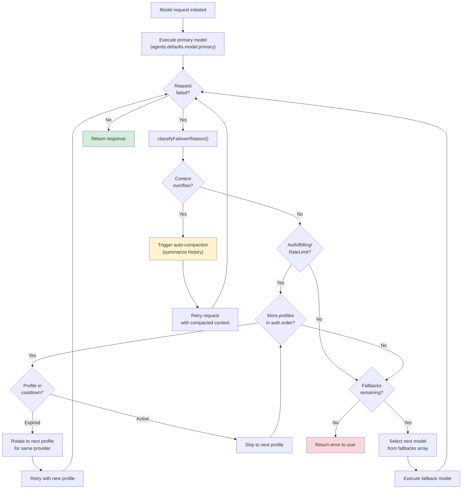

# ページ: モデル選択とフェイルオーバー

# モデル選択とフェイルオーバー

<details>
<summary>関連ソースファイル</summary>

以下のファイルがこの Wiki ページの生成に使用されました：

- [docs/concepts/system-prompt.md](docs/concepts/system-prompt.md)
- [docs/gateway/cli-backends.md](docs/gateway/cli-backends.md)
- [docs/reference/token-use.md](docs/reference/token-use.md)
- [src/agents/auth-profiles/oauth.fallback-to-main-agent.test.ts](src/agents/auth-profiles/oauth.fallback-to-main-agent.test.ts)
- [src/agents/auth-profiles/oauth.ts](src/agents/auth-profiles/oauth.ts)
- [src/agents/cli-backends.ts](src/agents/cli-backends.ts)
- [src/agents/cli-runner.test.ts](src/agents/cli-runner.test.ts)
- [src/agents/cli-runner.ts](src/agents/cli-runner.ts)
- [src/agents/cli-runner/helpers.ts](src/agents/cli-runner/helpers.ts)
- [src/agents/pi-embedded-runner/compact.ts](src/agents/pi-embedded-runner/compact.ts)
- [src/agents/pi-embedded-runner/run/attempt.ts](src/agents/pi-embedded-runner/run/attempt.ts)
- [src/agents/pi-embedded-runner/system-prompt.ts](src/agents/pi-embedded-runner/system-prompt.ts)
- [src/agents/system-prompt-params.ts](src/agents/system-prompt-params.ts)
- [src/agents/system-prompt-report.ts](src/agents/system-prompt-report.ts)
- [src/agents/system-prompt.test.ts](src/agents/system-prompt.test.ts)
- [src/agents/system-prompt.ts](src/agents/system-prompt.ts)
- [src/auto-reply/reply/agent-runner.heartbeat-typing.runreplyagent-typing-heartbeat.retries-after-compaction-failure-by-resetting-session.test.ts](src/auto-reply/reply/agent-runner.heartbeat-typing.runreplyagent-typing-heartbeat.retries-after-compaction-failure-by-resetting-session.test.ts)
- [src/auto-reply/reply/commands-context-report.ts](src/auto-reply/reply/commands-context-report.ts)
- [src/commands/agent.test.ts](src/commands/agent.test.ts)
- [src/commands/agent.ts](src/commands/agent.ts)
- [src/cron/isolated-agent.ts](src/cron/isolated-agent.ts)
- [src/cron/run-log.test.ts](src/cron/run-log.test.ts)
- [src/cron/run-log.ts](src/cron/run-log.ts)
- [src/cron/store.ts](src/cron/store.ts)
- [src/gateway/gateway-cli-backend.live.test.ts](src/gateway/gateway-cli-backend.live.test.ts)
- [src/gateway/protocol/index.ts](src/gateway/protocol/index.ts)
- [src/gateway/protocol/schema.ts](src/gateway/protocol/schema.ts)
- [src/gateway/protocol/schema/agents-models-skills.ts](src/gateway/protocol/schema/agents-models-skills.ts)
- [src/gateway/protocol/schema/protocol-schemas.ts](src/gateway/protocol/schema/protocol-schemas.ts)
- [src/gateway/protocol/schema/types.ts](src/gateway/protocol/schema/types.ts)
- [src/gateway/server-methods-list.ts](src/gateway/server-methods-list.ts)
- [src/gateway/server-methods.ts](src/gateway/server-methods.ts)
- [src/gateway/server-methods/agents.ts](src/gateway/server-methods/agents.ts)
- [src/gateway/server.ts](src/gateway/server.ts)
- [src/telegram/group-migration.test.ts](src/telegram/group-migration.test.ts)
- [src/telegram/group-migration.ts](src/telegram/group-migration.ts)

</details>


## 目的と範囲

このページでは、OpenClaw が実行時に AI モデルを選択し、複数のプロバイダー間で認証資格情報を管理し、モデルが失敗したときに自動フェイルオーバーを実装する方法を文書化します。モデル設定構造、認証プロファイル管理、エラーによってトリガーされるフォールバックチェーン、モデル管理のための CLI ツールについてカバーしています。

マルチエージェントルーティングとワークスペースの分離については、「[マルチエージェント設定](#4.3)」を参照してください。プロバイダー/モデルによるツール制限については、「[ツールとスキル](#6)」を参照してください。

---

## モデル設定構造

OpenClaw は、プライマリモデル、フォールバックチェーン、オプションのエージェントごとのオーバーライドを備えた階層的なモデル設定システムを使用しています。

### プライマリとフォールバックモデル

ベース設定は `agents.defaults.model` の下にあります：

```json5
{
  agents: {
    defaults: {
      model: {
        primary: "anthropic/claude-sonnet-4-20250514",
        fallbacks: [
          "openai-codex/gpt-5.2",
          "google-gemini/gemini-2.0-flash-exp"
        ]
      }
    }
  }
}
```

**フィールド：**
- `primary` (string, 必須): `provider/model` 形式のデフォルトモデル
- `fallbacks` (string[], オプション): 失敗時に試すモデルの順序付きリスト

イメージモデル設定は同じパターンに従います：

```json5
{
  agents: {
    defaults: {
      imageModel: {
        primary: "openai-codex/gpt-5.2",
        fallbacks: ["anthropic/claude-sonnet-4-20250514"]
      }
    }
  }
}
```

### エージェントごとのモデルオーバーライド

個々のエージェントはデフォルトのモデル設定をオーバーライドできます：

```json5
{
  agents: {
    list: [
      {
        id: "work",
        model: {
          primary: "openai-codex/gpt-5.2",
          fallbacks: []  // グローバルフォールバックを無効化
        }
      },
      {
        id: "personal",
        model: "anthropic/claude-sonnet-4-20250514"  // ショートハンド：プライマリのみオーバーライド
      }
    ]
  }
}
```

オブジェクト形式を使用する場合、`fallbacks` はグローバルリストを置き換えます。空の配列 `[]` はそのエージェントに対してフォールバックを完全に無効化します。

### モデルエイリアス

エイリアスはフルモデル参照の shorthand 名を提供します：

```json5
{
  models: {
    aliases: {
      "sonnet": "anthropic/claude-sonnet-4-20250514",
      "gpt5": "openai-codex/gpt-5.2",
      "flash": "google-gemini/gemini-2.0-flash-exp"
    }
  }
}
```

エイリアスはモデル選択の早い段階で解決され、`primary` と `fallbacks` の両方のフィールドで機能します。

**ソース：**
- [docs/gateway/configuration.md:195-230]()
- [docs/gateway/configuration.md:723-731]()

---

## プロバイダー設定

各モデルプロバイダーは `models.providers.*` の下で接続設定と認証設定を必要とします。

### プロバイダー設定の構造

```json5
{
  models: {
    providers: {
      anthropic: {
        apiKey: "${ANTHROPIC_API_KEY}",
        baseUrl: "https://api.anthropic.com"  // オプションのオーバーライド
      },
      "openai-codex": {
        apiKey: "${OPENAI_API_KEY}"
      },
      "google-gemini": {
        apiKey: "${GOOGLE_API_KEY}",
        baseUrl: "https://generativelanguage.googleapis.com"
      },
      bedrock: {
        region: "us-east-1",
        profile: "default"  // AWS プロファイル名
      },
      ollama: {
        baseUrl: "http://localhost:11434"
      }
    }
  }
}
```

**共通フィールド：**
- `apiKey` (string): プロバイダーの API キー（環境変数置換をサポート）
- `baseUrl` (string): デフォルト API エンドポイントをオーバーライド
- `timeout` (number): リクエストタイムアウト（ミリ秒）
- `maxRetries` (number): フェイルオーバーまでのリトライ試行数

プロバイダー固有のフィールド：
- **AWS Bedrock**: `region`, `profile`, `accessKeyId`, `secretAccessKey`
- **OpenRouter**: `apiKey`, `baseUrl`（デフォルトは `https://openrouter.ai/api/v1`）
- **ローカルモデル**: `baseUrl` のみ（例: Ollama、LM Studio）

### 認証モード

プロバイダーは異なる認証モードをサポートします：

| プロバイダー | サポートされるモード | 備考 |
|----------|----------------|-------|
| `anthropic` | `api_key`, `oauth`, `token` | OAuth は Claude サブスクリプション用、token は setup-token 用 |
| `openai-codex` | `oauth`, `api_key` | OAuth は ChatGPT/Codex サブスクリプション用 |
| `google-gemini` | `api_key`, `oauth` | OAuth は Antigravity または Gemini CLI プラグイン経由 |
| `openai` | `api_key` | 標準 API キーのみ |
| `bedrock` | `token` | AWS 資格情報またはベアラー トークン |
| `ollama` | なし | ローカルインスタンスでは認証不要 |

**ソース：**
- [docs/gateway/configuration.md:320-354]()
- [src/agents/model-auth.ts:55-100]()

---

## 認証プロファイルシステム

OpenClaw はエージェントごとの認証プロファイルストアを通じて認証資格情報を管理し、OAuth トークン、API キー、プロバイダー固有のトークン形式をサポートしています。

### 認証プロファイルのストレージ

認証プロファイルはエージェントごとに `~/.openclaw/agents/<agentId>/agent/auth-profiles.json` に保存されます：

```json
{
  "version": 1,
  "profiles": {
    "anthropic:me@example.com": {
      "provider": "anthropic",
      "mode": "oauth",
      "email": "me@example.com",
      "token": "...",
      "refreshToken": "...",
      "expiresAt": "2025-02-01T00:00:00Z"
    },
    "anthropic:manual": {
      "provider": "anthropic",
      "mode": "api_key",
      "apiKey": "sk-ant-..."
    },
    "openai-codex:work": {
      "provider": "openai-codex",
      "mode": "oauth",
      "token": "...",
      "refreshToken": "..."
    }
  }
}
```

プロファイル ID は `<provider>:<identifier>` パターンに従い、識別子はメール（OAuth）またはカスタムラベル（API キー/トークン）になります。

### レガシ OAuth インポート

初回使用時、OpenClaw は `~/.openclaw/credentials/oauth.json` から OAuth 資格情報をエージェントごとの auth-profiles.json にインポートします：

```json
{
  "anthropic": {
    "me@example.com": {
      "accessToken": "...",
      "refreshToken": "...",
      "expiresAt": 1738368000
    }
  },
  "openai-codex": {
    "work": {
      "accessToken": "...",
      "refreshToken": "..."
    }
  }
}
```

インポート後、資格情報はエージェントごとのストアに保存されます。レガシーの `oauth.json` は参照用に保持されますが、書き込みは行われません。

### プファイルローテーションの順序

`auth.order` 設定は、プロバイダーに対して複数のプロファイルが存在する場合に、どのプロファイルを最初に試すかを制御します：

```json5
{
  auth: {
    profiles: {
      "anthropic:me@example.com": { provider: "anthropic", mode: "oauth", email: "me@example.com" },
      "anthropic:work": { provider: "anthropic", mode: "api_key" },
      "anthropic:backup": { provider: "anthropic", mode: "token" }
    },
    order: {
      anthropic: [
        "anthropic:me@example.com",
        "anthropic:work",
        "anthropic:backup"
      ]
    }
  }
}
```

`anthropic` へのリクエストが認証/請求/レート制限エラーで失敗した場合、OpenClaw は順序リストの次のプロファイルにローテートします。

**ソース：**
- [docs/gateway/configuration.md:356-395]()
- [src/agents/model-auth.ts:1-100]()

---

## 認証解決フロー



**主要な関数：**
- `getModelAuth()` in [src/agents/model-auth.ts:100-200]()
- `ensureAuthProfileStore()` in [src/agents/auth-profiles.ts]()
- `resolveAuthProfileOrder()` in [src/agents/auth-profiles.ts]()

**ソース：**
- [src/agents/model-auth.ts:1-300]()
- [docs/gateway/configuration.md:356-395]()

---

## フェイルオーバー機構

OpenClaw はエラー分類に基づいて自動フェイルオーバーを実装し、プライマリモデルが失敗したときにフォールバック試行をトリガーします。

### エラー分類

エージェントランタイムは、フェイルオーバーの適格性を決定するためにエラーを分類します：

| エラーの種類 | 関数 | フェイルオーバーをトリガーする？ | 例 |
|------------|----------|-------------------|---------|
| 認証失敗 | `isAuthAssistantError()` | はい | 無効な API キー、期限切れの OAuth トークン |
| 請求問題 | `isBillingAssistantError()` | はい | クォータ超過、支払いが必要 |
| レート制限 | `isRateLimitAssistantError()` | はい | 429 Too Many Requests |
| コンテキストオーバーフロー | `isContextOverflowError()` | いいえ | プロンプトが長すぎる、コンパクションをトリガー |
| タイムアウト | `isTimeoutErrorMessage()` | はい | リクエストタイムアウト、ネットワーク障害 |
| オーバーロード | `isOverloadedErrorMessage()` | はい | 503 Service Unavailable |
| 画像サイズ | `isImageDimensionErrorMessage()` | いいえ | 画像が大きすぎる/小さすぎる |
| 一般的な失敗 | N/A | はい | 不明なエラー |

**分類関数：**
```typescript
// src/agents/pi-embedded-helpers/errors.ts
export function isAuthAssistantError(error: unknown): boolean;
export function isBillingAssistantError(error: unknown): boolean;
export function isRateLimitAssistantError(error: unknown): boolean;
export function isContextOverflowError(message: string): boolean;
export function isTimeoutErrorMessage(message: string): boolean;
export function isOverloadedErrorMessage(message: string): boolean;
export function isImageDimensionErrorMessage(message: string): boolean;

export function classifyFailoverReason(error: unknown): FailoverReason;
```

### フォールバックチェーンの実行

エラーがフェイルオーバーをトリガーした場合：

1. **プライマリ試行が** 認証/請求/レート制限エラーで失敗する
2. **認証プロファイルローテーション** は同じプロバイダーの次のプロファイルを試す
3. **フォールバックモデル選択** は `fallbacks` 配列の次のモデルに移動
4. **繰り返し** 成功するかフォールバックが使い切られるまで

```json5
{
  agents: {
    defaults: {
      model: {
        primary: "anthropic/claude-sonnet-4-20250514",
        fallbacks: [
          "openai-codex/gpt-5.2",
          "google-gemini/gemini-2.0-flash-exp"
        ]
      }
    }
  },
  auth: {
    order: {
      anthropic: ["anthropic:me@example.com", "anthropic:backup"],
      "openai-codex": ["openai-codex:work", "openai-codex:personal"]
    }
  }
}
```

**実行シーケンス：**
1. `anthropic/claude-sonnet-4-20250514` を `anthropic:me@example.com` で試す
2. 認証が失敗したら、`anthropic:backup` でリトライ
3. それでも失敗したら、`openai-codex/gpt-5.2` を `openai-codex:work` で試す
4. 認証が失敗したら、`openai-codex:personal` でリトライ
5. それでも失敗したら、`google-gemini/gemini-2.0-flash-exp` を試す
6. すべてが失敗したら、ユーザーにエラーを返す

### クールダウン動作

永続的な失敗に対する高速リトライサイクルを防ぐため、OpenClaw はクールダウンタイマーを実装します：

```json5
{
  auth: {
    cooldowns: {
      billingBackoffHours: 24,  // 請求失敗後 24時間待機
      billingBackoffHoursByProvider: {
        anthropic: 48,  // プロバイダー固有のオーバーライド
        "openai-codex": 12
      },
      billingMaxHours: 168,  // 最大クールダウン：7日間
      failureWindowHours: 1  // 1時間失敗がないとカウンターをリセット
    }
  }
}
```

**クールダウンルール：**
- 請求失敗は `billingBackoffHours` クールダウンをトリガー
- プファイルはクールダウンが切れるまで使用不能としてマークされる
- 後続の失敗はクールダウンを増加させる（`billingMaxHours` まで）
- 成功または時間ウィンドウの期限切れは失敗カウンターをリセットする

**ソース：**
- [src/agents/pi-embedded-helpers/errors.ts:1-300]()
- [docs/gateway/configuration.md:196-206]()
- [src/agents/pi-embedded-runner/run.ts]()

---

## フェイルオーバー意思決定ツリー



**主要な意思決定ポイント：**
1. **エラー分類** は認証ローテーションとモデルフォールバックのどちらを試すかを決定
2. **クールダウンチェック** は最近失敗とマークされたプロファイルをスキップ
3. **コンテキストオーバーフロー** はコンパクションをトリガー、フェイルオーバーではない
4. **プロファイル使い切り** は次のフォールバックモデルに移動
5. **フォールバック使い切り** はユーザーにエラーを返す

**ソース：**
- [src/agents/pi-embedded-helpers/errors.ts]()
- [src/agents/pi-embedded-runner/run.ts]()
- [docs/gateway/configuration.md:196-206]()

---

## モデル選択アルゴリズム

ランタイムはエイリアスを処理し、カタログに対して検証し、許可リストを適用する多段階プロセスを通じてモデル参照を解決します。

### 解決フロー

```mermaid
graph TB
    Start["Model selection initiated<br/>(agent, sessionKey, directive)"]
    CheckDirective{"/model<br/>directive?"}
    UseDirective["Use directive model<br/>(runtime override)"]
    CheckAgent["Resolve agent from sessionKey"]
    CheckAgentModel{Agent has<br/>model override?}
    UseAgentModel["Use agents.list[].model"]
    UseDefaultModel["Use agents.defaults.model.primary"]
    ResolveAlias["Check models.aliases"]
    IsAlias{Match found?}
    ExpandAlias["Expand to provider/model"]
    ParseRef["Parse provider/model format"]
    ValidFormat{Valid<br/>format?}
    LoadCatalog["Load model catalog<br/>(loadModelCatalog)"]
    CheckCatalog{Model in<br/>catalog?}
    CheckAllowlist{Model in<br/>allowlist?"}
    GetAuth["getModelAuth(provider, cfg)"]
    HasAuth{Auth<br/>available?}
    BuildModelRef["Build final ModelRef"]
    FallbackDefault["Fallback to DEFAULT_MODEL<br/>(anthropic/claude-sonnet-4)"]
    ReturnRef["Return ModelRef"]

    Start --> CheckDirective
    CheckDirective -->|Yes| UseDirective
    CheckDirective -->|No| CheckAgent
    UseDirective --> ResolveAlias
    CheckAgent --> CheckAgentModel
    CheckAgentModel -->|Yes| UseAgentModel
    CheckAgentModel -->|No| UseDefaultModel
    UseAgentModel --> ResolveAlias
    UseDefaultModel --> ResolveAlias
    ResolveAlias --> IsAlias
    IsAlias -->|Yes| ExpandAlias
    IsAlias -->|No| ParseRef
    ExpandAlias --> ParseRef
    ParseRef --> ValidFormat
    ValidFormat -->|No| FallbackDefault
    ValidFormat -->|Yes| LoadCatalog
    LoadCatalog --> CheckCatalog
    CheckCatalog -->|No| CheckAllowlist
    CheckCatalog -->|Yes| CheckAllowlist
    CheckAllowlist -->|No| FallbackDefault
    CheckAllowlist -->|Yes| GetAuth
    GetAuth --> HasAuth
    HasAuth -->|No| FallbackDefault
    HasAuth -->|Yes| BuildModelRef
    BuildModelRef --> ReturnRef
    FallbackDefault --> ReturnRef

    style ReturnRef fill:#d4edda
    style FallbackDefault fill:#fff3cd
```

### 主要な解決関数

```typescript
// src/agents/model-selection.ts
export function resolveConfiguredModelRef(params: {
  cfg: OpenClawConfig;
  sessionKey?: string;
  directive?: string;
  defaultProvider: string;
  defaultModel: string;
}): { provider: string; model: string };

export function getModelRefStatus(params: {
  cfg: OpenClawConfig;
  catalog: ModelCatalog;
  ref: { provider: string; model: string };
  defaultProvider: string;
  defaultModel: string;
}): {
  key: string;
  allowed: boolean;
  inCatalog: boolean;
  hasAuth: boolean;
};
```

### 許可リストの適用

モデルは `agents.defaults.models`（またはエージェントごとの `agents.list[].models`）経由で制限できます：

```json5
{
  agents: {
    defaults: {
      models: [
        "anthropic/claude-sonnet-4-20250514",
        "openai-codex/gpt-5.2",
        "google-gemini/gemini-2.0-flash-exp"
      ]
    },
    list: [
      {
        id: "restricted",
        models: ["anthropic/claude-haiku-20250107"]  // Haiku のみ許可
      }
    ]
  }
}
```

`models` が未設定または空の場合、すべてのカタログモデルが許可されます。設定されている場合、リストされたモデルのみが検証を通過します。

### デフォルトフォールバック

解決がいずれかの段階で失敗した場合（無効な形式、認証なし、許可リストにない）、システムは以下にフォールバックします：

```typescript
// src/agents/defaults.ts
export const DEFAULT_PROVIDER = "anthropic";
export const DEFAULT_MODEL = "claude-sonnet-4-20250514";
```

これにより、設定エラーによってシステムが完全にブロックされることがなくなります。

**ソース：**
- [src/agents/model-selection.ts]()
- [src/agents/defaults.ts]()
- [src/agents/model-catalog.ts]()
- [src/commands/doctor.ts:195-230]()

---

## CLI モデル管理

OpenClaw はモデルの検査と設定のための包括的な CLI ツールを提供します。

### ステータスと検査

**現在の設定を表示：**
```bash
openclaw models status
openclaw models status --json
openclaw models status --plain
```

出力には以下が含まれます：
- プライマリモデルとフォールバック
- 設定されたプロバイダー
- 期限切れステータスを含む認証プロファイル
- 許可リスト制限

**利用可能なモデルを一覧表示：**
```bash
openclaw models list
openclaw models list --all            # すべてのカタログモデルを含む
openclaw models list --provider anthropic
openclaw models list --json
```

**認証プロファイルをテスト：**
```bash
openclaw models status --probe                    # すべてのプロファイルをテスト
openclaw models status --probe --probe-provider anthropic
openclaw models status --probe --probe-profile "anthropic:me@example.com"
openclaw models status --probe --probe-timeout 5000
openclaw models status --probe --probe-max-tokens 10
```

ライブプロービングは認証の有効性を確認するために最小限のリクエストを送信します。トークンを消費し、レート制限をトリガーする可能性があります。

### モデル設定

**プライマリモデルを設定：**
```bash
openclaw models set anthropic/claude-sonnet-4-20250514
openclaw models set openai-codex/gpt-5.2
openclaw models set sonnet  # エイリアスを使用
```

`agents.defaults.model.primary` に書き込みます。

**イメージモデルを設定：**
```bash
openclaw models set-image openai-codex/gpt-5.2
openclaw models set-image anthropic/claude-sonnet-4-20250514
```

`agents.defaults.imageModel.primary` に書き込みます。

**フォールバックを管理：**
```bash
openclaw models fallbacks list
openclaw models fallbacks add openai-codex/gpt-5.2
openclaw models fallbacks add google-gemini/gemini-2.0-flash-exp
openclaw models fallbacks remove openai-codex/gpt-5.2
openclaw models fallbacks clear
```

**イメージモデルのフォールバックを管理：**
```bash
openclaw models image-fallbacks list
openclaw models image-fallbacks add anthropic/claude-sonnet-4-20250514
openclaw models image-fallbacks remove anthropic/claude-sonnet-4-20250514
openclaw models image-fallbacks clear
```

### エイリアス管理

**エイリアスを一覧表示：**
```bash
openclaw models aliases list
openclaw models aliases list --json
```

**エイリアスを追加/削除：**
```bash
openclaw models aliases add sonnet anthropic/claude-sonnet-4-20250514
openclaw models aliases add gpt5 openai-codex/gpt-5.2
openclaw models aliases remove sonnet
```

### 認証プロファイル管理

**新しいプロファイルを追加：**
```bash
# インタラクティブなトークン貼り付け
openclaw models auth add --provider anthropic

# setup-token フロー（ゲートウェイホストで `claude setup-token` を実行）
openclaw models auth setup-token --provider anthropic

# 別の場所から setup-token を貼り付け
openclaw models auth paste-token --provider anthropic
```

**ローテーション順序を管理：**
```bash
openclaw models auth order get anthropic
openclaw models auth order set anthropic "anthropic:me@example.com,anthropic:backup"
openclaw models auth order clear anthropic
```

**ソース：**
- [docs/cli/index.md:668-728]()
- [src/commands/models/]()

---

## 設定例

### フォールバックを備えたマルチプロバイダー設定

```json5
{
  agents: {
    defaults: {
      model: {
        primary: "anthropic/claude-sonnet-4-20250514",
        fallbacks: [
          "openai-codex/gpt-5.2",
          "google-gemini/gemini-2.0-flash-exp",
          "ollama/llama3.3"
        ]
      },
      imageModel: {
        primary: "openai-codex/gpt-5.2",
        fallbacks: ["anthropic/claude-sonnet-4-20250514"]
      }
    }
  },
  models: {
    providers: {
      anthropic: {
        apiKey: "${ANTHROPIC_API_KEY}",
        timeout: 60000
      },
      "openai-codex": {
        apiKey: "${OPENAI_API_KEY}"
      },
      "google-gemini": {
        apiKey: "${GOOGLE_API_KEY}",
        baseUrl: "https://generativelanguage.googleapis.com"
      },
      ollama: {
        baseUrl: "http://localhost:11434"
      }
    },
    aliases: {
      sonnet: "anthropic/claude-sonnet-4-20250514",
      haiku: "anthropic/claude-haiku-20250107",
      gpt5: "openai-codex/gpt-5.2",
      flash: "google-gemini/gemini-2.0-flash-exp",
      llama: "ollama/llama3.3"
    }
  },
  auth: {
    profiles: {
      "anthropic:me@example.com": {
        provider: "anthropic",
        mode: "oauth",
        email: "me@example.com"
      },
      "anthropic:backup": {
        provider: "anthropic",
        mode: "api_key"
      },
      "openai-codex:work": {
        provider: "openai-codex",
        mode: "oauth"
      }
    },
    order: {
      anthropic: ["anthropic:me@example.com", "anthropic:backup"],
      "openai-codex": ["openai-codex:work"]
    },
    cooldowns: {
      billingBackoffHours: 24,
      billingMaxHours: 168,
      failureWindowHours: 1
    }
  }
}
```

### エージェントごとのモデルオーバーライド

```json5
{
  agents: {
    defaults: {
      model: {
        primary: "anthropic/claude-sonnet-4-20250514",
        fallbacks: ["openai-codex/gpt-5.2"]
      }
    },
    list: [
      {
        id: "work",
        model: {
          primary: "openai-codex/gpt-5.2",
          fallbacks: []  // ワークエージェントにはフォールバックなし
        }
      },
      {
        id: "personal",
        model: "anthropic/claude-sonnet-4-20250514"  // プライマリのみオーバーライド
      },
      {
        id: "budget",
        model: {
          primary: "anthropic/claude-haiku-20250107",
          fallbacks: ["ollama/llama3.3"]  // 安価なモデルのみ
        }
      }
    ]
  }
}
```

### OpenRouter 設定

```json5
{
  agents: {
    defaults: {
      model: {
        primary: "openrouter/anthropic/claude-sonnet-4",
        fallbacks: [
          "openrouter/openai/gpt-4-turbo",
          "openrouter/google/gemini-pro-1.5"
        ]
      }
    }
  },
  models: {
    providers: {
      openrouter: {
        apiKey: "${OPENROUTER_API_KEY}",
        baseUrl: "https://openrouter.ai/api/v1"
      }
    }
  }
}
```

### ローカルモデル設定（Ollama）

```json5
{
  agents: {
    defaults: {
      model: {
        primary: "ollama/llama3.3",
        fallbacks: []
      }
    }
  },
  models: {
    providers: {
      ollama: {
        baseUrl: "http://localhost:11434"
      }
    }
  }
}
```

**ソース：**
- [docs/gateway/configuration-examples.md:1-500]()
- [docs/gateway/configuration.md:1-2000]()

---

## トラブルシューティング

### プロバイダーの API キーが見つからない

**症状:** `No API key found for provider "anthropic"`

**原因:** 認証プロファイルはエージェントごとです。新しいエージェントは他のエージェントの資格情報を継承しません。

**解決策:**
```bash
# このエージェントでオンボーディングを再実行
openclaw onboard

# またはゲートウェイホストで setup-token を貼り付け
openclaw models auth setup-token --provider anthropic

# または他のエージェントから auth-profiles.json をコピー
cp ~/.openclaw/agents/main/agent/auth-profiles.json \
   ~/.openclaw/agents/work/agent/auth-profiles.json
```

### OAuth トークンの更新に失敗

**症状:** 保存された OAuth トークンが期限切れで更新に失敗

**解決策:** setup-token（より信頼性が高い）に切り替え：
```bash
# ゲートウェイホストで（トークンを貼り付け）
openclaw models auth setup-token --provider anthropic

# またはトークンを他の場所で生成して貼り付け
openclaw models auth paste-token --provider anthropic

# 確認
openclaw models status
```

### モデルが許可リストにない

**症状:** Doctor がモデルが `agents.defaults.models` 許可リストにないと警告

**解決策:** モデルを許可リストに追加または制限を削除：
```bash
# 許可リストに追加
openclaw config set agents.defaults.models '["anthropic/claude-sonnet-4-20250514", "openai-codex/gpt-5.2"]'

# または許可リストを完全に削除（すべてを許可）
openclaw config unset agents.defaults.models
```

### フォールバックチェーンが使い切られた

**症状:** フォールバックチェーンのすべてのモデルが失敗

**診断:**
```bash
# 認証ステータスを確認
openclaw models status

# ライブ認証をプローブ
openclaw models status --probe

# ログを確認
openclaw logs --follow
```

**一般的な原因：**
- すべてのプロファイルが期限切れまたは無効
- ネットワーク接続の問題
- プロバイダー API の停止
- すべてのプロバイダーでレート制限に達

**解決策:** 動作する認証プロファイルまたは異なるプロバイダーをフォールバックチェーンに追加。

**ソース：**
- [docs/gateway/troubleshooting.md:34-73]()
- [docs/gateway/troubleshooting.md:158-240]()

---