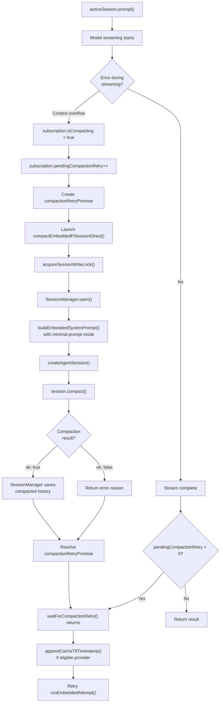
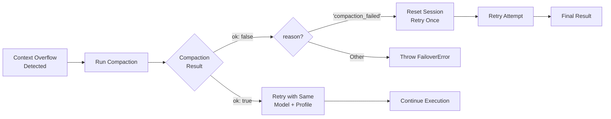
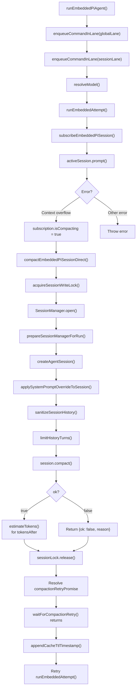

# ページ: コンテキストオーバーフローと自動コンパクション

# コンテキストオーバーフローと自動コンパクション

<details>
<summary>関連ソースファイル</summary>

以下のファイルがこの Wiki ページの生成に使用されました：

- [docs/concepts/system-prompt.md](docs/concepts/system-prompt.md)
- [docs/gateway/cli-backends.md](docs/gateway/cli-backends.md)
- [docs/reference/token-use.md](docs/reference/token-use.md)
- [src/agents/auth-profiles/oauth.fallback-to-main-agent.test.ts](src/agents/auth-profiles/oauth.fallback-to-main-agent.test.ts)
- [src/agents/auth-profiles/oauth.ts](src/agents/auth-profiles/oauth.ts)
- [src/agents/cli-backends.ts](src/agents/cli-backends.ts)
- [src/agents/cli-runner.test.ts](src/agents/cli-runner.test.ts)
- [src/agents/cli-runner.ts](src/agents/cli-runner.ts)
- [src/agents/cli-runner/helpers.ts](src/agents/cli-runner/helpers.ts)
- [src/agents/pi-embedded-runner/compact.ts](src/agents/pi-embedded-runner/compact.ts)
- [src/agents/pi-embedded-runner/run/attempt.ts](src/agents/pi-embedded-runner/run/attempt.ts)
- [src/agents/pi-embedded-runner/system-prompt.ts](src/agents/pi-embedded-runner/system-prompt.ts)
- [src/agents/system-prompt-params.ts](src/agents/system-prompt-params.ts)
- [src/agents/system-prompt-report.ts](src/agents/system-prompt-report.ts)
- [src/agents/system-prompt.test.ts](src/agents/system-prompt.test.ts)
- [src/agents/system-prompt.ts](src/agents/system-prompt.ts)
- [src/auto-reply/reply/agent-runner.heartbeat-typing.runreplyagent-typing-heartbeat.retries-after-compaction-failure-by-resetting-session.test.ts](src/auto-reply/reply/agent-runner.heartbeat-typing.runreplyagent-typing-heartbeat.retries-after-compaction-failure-by-resetting-session.test.ts)
- [src/auto-reply/reply/commands-context-report.ts](src/auto-reply/reply/commands-context-report.ts)
- [src/gateway/gateway-cli-backend.live.test.ts](src/gateway/gateway-cli-backend.live.test.ts)
- [src/telegram/group-migration.test.ts](src/telegram/group-migration.test.ts)
- [src/telegram/group-migration.ts](src/telegram/group-migration.ts)

</details>


## 目的と範囲

このページでは、OpenClaw がコンテキストウィンドウのオーバーフロー状況を検出し、処理する方法を説明します。これは、蓄積された会話履歴がモデルのトークン制限を超える状況です。自動コンパクションメカニズム、リトロジー、セッションリセットフォールバックについてカバーし、コンテキスト制限に達した場合でもエージェント実行が続けられるようにします。

セッション履歴管理と永続化の詳細については、「[セッション管理](#5.3)」を参照してください。モデル選択と一般的なフェイルオーバーの動作については、「[モデル選択とフェイルオーバー](#5.4)」を参照してください。

## コンテキストウィンドウ管理

各 AI モデルは、単一のリクエストで処理できる最大トークン数を定義する **コンテキストウィンドウ** を持っています。このウィンドウは以下を収容する必要があります：

- システムプロンプト
- ツール定義
- 会話履歴
- 現在のユーザーメッセージ
- モデルの応答のための予約トークン

OpenClaw はコンテキストウィンドウの使用量を追跡し、モデルプロバイダーに送信する前にリクエストが制限内に収まることを検証します。

### コンテキストウィンドウ情報

各モデルのコンテキストウィンドウは、複数のソースから解決されます（優先順順序）：

1. セッションごとのオーバーライド (`session.model.contextWindow`)
2. エージェントレベルのオーバーライド (`agents.list[].model.contextWindow`)
3. グローバルオーバーライド (`agents.defaults.model.contextWindow`)
4. モデルレジストリ定義 (`models.json`)

**ソース：** [src/agents/context-window-guard.ts:14-53]()

### 予約トークン

OpenClaw は、モデルが応答を生成するためのスペースを確保するため、トークンのバッファを予約します。予約量は設定可能で、モデルの能力によって異なります：

| 設定 | デフォルト値 | 目的 |
|--------------|---------------|---------|
| `agents.defaults.compaction.reserveTokens` | 4096 | モデル出力用のトークンバッファ |
| 最小フロア | 512 | ハード最小予約 |

リクエストが収まるかどうかを計算する際、予約トークンは利用可能なコンテキストウィンドウから減算されます。

**ソース：** [src/agents/pi-settings.ts:1-50](), [src/agents/context-window-guard.ts:14-53]()

### コンテキストオーバーフロー検出

モデルプロバイダーがコンテキストウィンドウが超過したことを示すエラーを返す場合、OpenClaw はエラーメッセージのパターンマッチングを通じてこれを検出します：

```typescript
// 一般的なオーバーフローパターン（大文字小文字を区別しない）
- "context window"
- "context length"
- "maximum context"
- "token limit"
- "too many tokens"
```

検出ロジックはエラーをコンテキストオーバーフローとして分類し、一般的な失敗として扱うのではなく自動コンパクションをトリガーします。

**ソース：** [src/agents/pi-embedded-helpers/errors.ts:1-100]()

## 自動コンパクションプロセス

**自動コンパクション** は、コンテキストオーバーフローが検出されたときに古い会話履歴を要約してトークン使用量を減少させる自動メカニズムです。リクエストを失敗させる代わりに、OpenClaw は以下を行います：

1. コンテキストオーバーフローエラーを検出
2. セッションでコンパクションをトリガー
3. コンパクト化された履歴で元のリクエストをリトライ

### コンパクションフロー

コンパクションは、モデルプロバイダーがコンテキストオーバーフローエラーを返すときにトリガーされます。フローにはエージェントランタイムとセッションサブスクリプションシステム間の連携が含まれます：



**ソース：** [src/agents/pi-embedded-runner/run/attempt.ts:832-863](), [src/agents/pi-embedded-runner/compact.ts:116-490](), [src/agents/pi-embedded-subscribe.ts:186-224]()
</thinking>

サブスクリプションシステム (`subscribeEmbeddedPiSession`) は、複数のターンが同時にオーバーフローをトリガーする場合の競合条件を防ぐため、コンパクション状態を維持します。`waitForCompactionRetry()` 関数は、実行中のコンパクションが完了するまでブロックし、その後リトライが進行できるようにします。

**ソース：** [src/agents/pi-embedded-subscribe.ts:62-224](), [src/agents/pi-embedded-runner/run/attempt.ts:832-863]()

### コンパクション実装

コンパクションは `@mariozechner/pi-coding-agent` SDK から `session.compact()` を呼び出し、モデルを使用して会話履歴を要約します。OpenClaw ラッパー (`compactEmbeddedPiSessionDirect`) は以下を提供します：

1. **セッションロック取得**: `acquireSessionWriteLock()` が同時変更を防止
2. **ワークスペースとサンドボックス設定**: ワークスペースディレクトリを解決、スキル環境のオーバーライドを適用
3. **ツール作成**: 通常の実行と同じツールセットを構築（`createOpenClawCodingTools` 経由）
4. **システムプロンプト**: `buildEmbeddedSystemPrompt()` を `promptMode: "minimal"` でサブエージェントに、`"full"` でメインセッションに呼び出し
5. **エージェントセッション作成**: モデル、ツール、セッションマネージャーで `createAgentSession()` を使用
6. **コンパクション呼び出し**: `await session.compact(customInstructions)`
7. **トークン推定**: コンパクション後、残りのメッセージの `estimateTokens()` を合計して `tokensAfter` を推定

SDK のコンパクションロジック：
- 事実情報と決定を保持
- 時系列順序を維持
- 冗長な交換を圧縮
- ツール使用結果を保持
- 典型的な削減：元のトークン数の 50-70%

`compactEmbeddedPiSessionDirect()` 関数は、レーンキューイングなしで完全なコンパクションフローを処理します（セッションレーン内に既にある場合のデッドロックを避けるため）。ラッパー `compactEmbeddedPiSession()` は外部呼び出し用にレーンキューイングを追加します。

**ソース：** [src/agents/pi-embedded-runner/compact.ts:116-490](), [src/agents/session-write-lock.ts:1-100](), [src/agents/pi-embedded-runner/system-prompt.ts:11-78]()

### コンパクション状態管理とキャッシュ TTL

サブスクリプションシステム (`subscribeEmbeddedPiSession`) は、同時コンパクション試行を防止するためにコンパクション状態を追跡します：

```typescript
// サブスクリプションクロージャ内で追跡される状態
isCompacting: () => boolean          // compactionInFlight を返す
compactionInFlight: boolean          // アクティブなコンパクションフラグ
pendingCompactionRetry: number       // キューされたリトライ数
compactionRetryResolve?: () => void  // プロミスリゾルバー
compactionRetryPromise: Promise<void> | null
```

アクティブなコンパクション中にコンテキストオーバーフローが発生した場合、システムは以下を行います：
1. `pendingCompactionRetry` をインクリメント
2. プロミスが存在しない場合は新しい `compactionRetryPromise` を作成
3. `waitForCompactionRetry()` でプロミスが解決されるまでブロック
4. アクティブなコンパクションが完了時にプロミスを解決
5. キューされたリトライが解決後に進行

コンパクションが正常に完了した後、OpenClaw はプロバイダーがプロンプトキャッシュの対象である場合、セッションにキャッシュ TTL タイムスタンプを追加します：

```typescript
// コンパクション後のキャッシュ TTL 追跡
if (isCacheTtlEligibleProvider(provider)) {
  appendCacheTtlTimestamp({
    sessionManager,
    provider,
    modelId,
    cfg: params.config,
  });
}
```

これはキャッシュウィンドウがいつ確立されたかを追跡し、キャッシュ対応のプルーニング戦略を可能にします（詳細は [セッションプルーニング](#) を参照）。

**ソース：** [src/agents/pi-embedded-subscribe.ts:62-224](), [src/agents/pi-embedded-runner/run/attempt.ts:844-863](), [src/agents/pi-embedded-runner/cache-ttl.ts:1-100]()

## リトライとフェイルオーバーロジック

### コンパクション後のリトライ

成功したコンパクション後、OpenClaw は自動的に元のリクエストをリトライします：



**ソース：** [src/agents/pi-embedded-runner/run.ts:276-364]()

### リトライ制限

OpenClaw は無限ループを防止するため、コンパクションリトライに厳格な制限を課します：

| リトライの種類 | 制限 | 動作 |
|------------|-------|----------|
| コンパクションリトライ | 1 | コンパクション後の単一リトライ |
| セリセットリトライ | 1 | セットリセット後の 1 回の試行 |
| 思考レベルフォールバック | 1 | 低減された思考レベルでのリトライ |

リトライを使い切った後、エラーは呼び出し元に伝播します（通常はユーザー向けのエラーメッセージになります）。

**ソース：** [src/agents/pi-embedded-runner/run.ts:276-364]()

### セットリセットフォールバック

コンパクション自体が失敗した場合（例：コンパクションリクエストもコンテキスト制限に達した、またはモデルがエラーを返した）、OpenClaw は **セッションリセット** を実行します。このロジックは compaction 関数自体ではなく `runReplyAgent()` で処理されます：

1. 返されたペイロードで `meta.error.kind === "context_overflow"` を検出
2. エラーメッセージでコンパクション失敗パターンを検出：`"Context overflow: Summarization failed"`
3. 現在のセッションを置き換える新しいセッション ID を生成
4. セットストアを新しい ID で更新
5. 空の履歴でリトライ

これはエージェントが引き続き機能できるようにするため、会話コンテキストを犠牲にする最終手段です。セットリセット応答にはユーザー向けメッセージが含まれます：

```
Context limit exceeded during compaction. Session has been reset.
```

リセットは、古いセッション ID が再利用されないようにするために、すぐにセッションストア JSON ファイルに永続化されます。

**ソース：** [src/auto-reply/reply/agent-runner.ts:400-500](), [src/auto-reply/reply/agent-runner.heartbeat-typing.runreplyagent-typing-heartbeat.retries-after-compaction-failure-by-resetting-session.test.ts:128-175]()

### 思考レベルフォールバック

コンパクションに加えて、OpenClaw は **思考レベル** を低下させてトークンを節約することがあります：

- `thinkLevel="on"` でオーバーフローが発生した場合、`thinkLevel="off"` にフォールバック
- これはプロンプトから推論/思考タグを削除し、トークン使用量を削減
- 実行ごとに 1 回のみ試行

**ソース：** [src/agents/pi-embedded-helpers/thinking.ts:1-50](), [src/agents/pi-embedded-runner/run.ts:276-364]()

## 設定

### 予約トークン設定

予約トークンは `agents.defaults.compactionReserveTokens`（`compaction` オブジェクトの下にネストされていない）で設定されます：

```json5
{
  agents: {
    defaults: {
      compactionReserveTokens: 4096  // 出力用トークンバッファ
    }
  }
}
```

`ensurePiCompactionReserveTokens()` 関数はこの設定を SDK の `SettingsManager` に適用します：

```typescript
ensurePiCompactionReserveTokens({
  settingsManager,
  minReserveTokens: resolveCompactionReserveTokensFloor(config)
});
```

最小フロアは 512 トークンで、`resolveCompactionReserveTokensFloor()` によって適用されます。

エージェントごとのオーバーライドは現在サポートされていません。予約トークン設定はグローバルです。

**ソース：** [src/agents/pi-settings.ts:1-50](), [src/agents/pi-embedded-runner/run/attempt.ts:443-447](), [src/agents/pi-embedded-runner/compact.ts:384-388]()

### コンテキストウィンドウオーバーライド

特定のモデルのコンテキストウィンドウサイズをオーバーライドします：

```json5
{
  agents: {
    defaults: {
      model: {
        contextWindow: 128000  // グローバルオーバーライド
      }
    },
    list: [
      {
        id: "assistant",
        model: {
          contextWindow: 200000  // エージェント固有のオーバーライド
        }
      }
    ]
  }
}
```

**ソース：** [src/agents/context-window-guard.ts:14-53]()

## エラー処理と診断

### コンテキストオーバーフローエラーメッセージ

コンパクションを通じてコンテキストオーバーフローを解決できない場合、OpenClaw は詳細なエラーメッセージを返します：

```
Context window exceeded and compaction failed.
Model: anthropic/claude-3-5-sonnet-20241022
Context window: 200000 tokens
Reserve tokens: 4096
Session: agent:main:telegram:dm:123456789
```

これらのメッセージは、設定の問題を診断し、過度の履歴を持つセッションを特定するのに役立ちます。

**ソース：** [src/agents/pi-embedded-helpers/errors.ts:1-100]()

### コンパクション失敗の理由

`EmbeddedPiCompactResult` には、コンパクションが失敗した理由を説明する `reason` フィールドが含まれています：

| 理由 | 説明 |
|--------|-------------|
| `"Unknown model"` | レジストリにモデルが見つからない |
| `"No API key"` | 認証が不足 |
| `"compaction_failed"` | モデルが要約中にエラーを返した |
| エラーメッセージ | プロバイダーからの特定のエラー |

**ソース：** [src/agents/pi-embedded-runner/types.ts:1-50](), [src/agents/pi-embedded-runner/compact.ts:114-415]()

## 実装の詳細

### 主要な関数と呼び出しチェーン

以下の図は、エージェント呼び出しからコンパクション、リトライまでの関数呼び出しチェーンをマッピングします：



**ソース：** [src/agents/pi-embedded-runner/run.ts:73-281](), [src/agents/pi-embedded-runner/run/attempt.ts:142-1095](), [src/agents/pi-embedded-runner/compact.ts:116-490](), [src/agents/pi-embedded-subscribe.ts:62-224]()

### セットマネージャーロック

コンパクションは、同時変更を防ぐためにセッションファイルへの書き込みロックを取得します：

```typescript
const sessionLock = await acquireSessionWriteLock({
  sessionFile: params.sessionFile
});

try {
  // Perform compaction
  const sessionManager = SessionManager.open(params.sessionFile);
  // ... compaction logic
} finally {
  await sessionLock.release();
}
```

これにより、コンパクションと同時エージェント実行がセッション状態を破損することがなくなります。

**ソース：** [src/agents/session-write-lock.ts:1-100](), [src/agents/pi-embedded-runner/compact.ts:114-415]()

### 履歴制限と検証

コンパクション前（および各エージェント実行前）、OpenClaw は履歴サニタイゼーション、検証、制限を適用します：

1. **サニタイゼーション**: `sanitizeSessionHistory()` はモデル API（Anthropic vs Gemini）に基づく無効なメッセージ構造を削除
2. **検証**:
   - `validateGeminiTurns()` は Gemini 交互のユーザー/モデルターンを保証
   - `validateAnthropicTurns()` は Anthropic の正しいターン構造を保証
3. **制限**: `limitHistoryTurns()` は DM 特定の履歴制限を適用：
   ```typescript
   const dmLimit = getDmHistoryLimitFromSessionKey(sessionKey, config);
   const truncated = limitHistoryTurns(validated, dmLimit);
   ```
4. **ツール結果ペアリング**: `sanitizeToolUseResultPairing()` は切り捨て後の孤立した tool_result ブロックを修復

`TranscriptPolicy`（モデル API ごとに解決）は、どの検証ステップが適用されるかを制御します：

```typescript
const transcriptPolicy = resolveTranscriptPolicy({
  modelApi: model.api,
  provider,
  modelId,
});
// Policy flags:
// - allowSyntheticToolResults
// - validateGeminiTurns
// - validateAnthropicTurns
// - repairToolUseResultPairing
// - normalizeAntigravityThinkingBlocks
```

この事前フィルタリングは、コンパクション前のトークン使用量を削減し、メッセージがプロバイダーの要件に適合することを保証します。

**ソース：** [src/agents/pi-embedded-runner/history.ts:1-100](), [src/agents/pi-embedded-runner/run/attempt.ts:545-580](), [src/agents/pi-embedded-runner/compact.ts:417-442](), [src/agents/transcript-policy.ts:1-100]()

## テストと検証

OpenClaw には、コンテキストオーバーフローとコンパクションシナリオのための包括的なテストが含まれています：

- **モックオーバーフローエラー**: プロバイダーからのコンテキストオーバーフロー応答をシミュレート
- **コンパクションリトライ検証**: コンパクション後のリトロジー実行を確認
- **セッションリセット検証**: コンパクションが失敗したときにセッションがクリアされることを確認
- **同時コンパクション処理**: 複数のオーバーフローが適切にキューされることをテスト

**ソース：** [src/agents/pi-embedded-runner.test.ts:1-450](), [src/agents/pi-embedded-runner/run.overflow-compaction.test.ts:1-500](), [src/auto-reply/reply/agent-runner.heartbeat-typing.runreplyagent-typing-heartbeat.retries-after-compaction-failure-by-resetting-session.test.ts:1-400]()

---