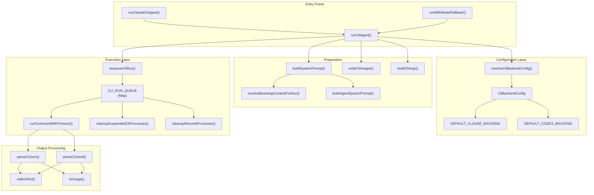
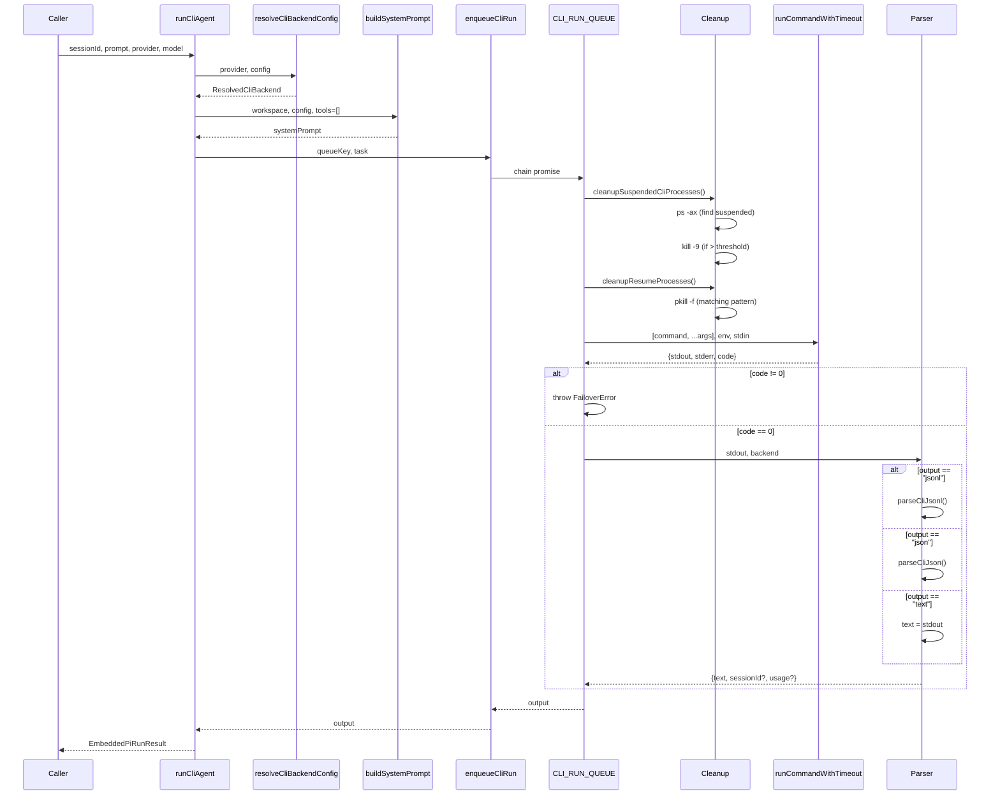
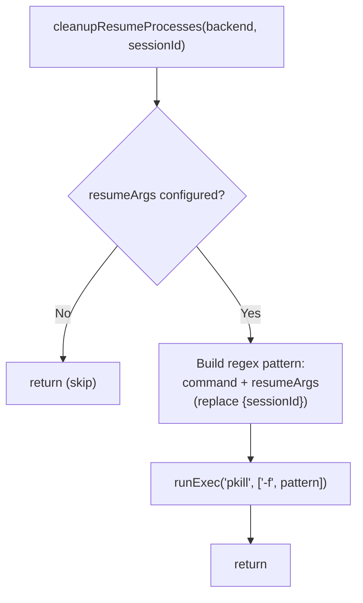
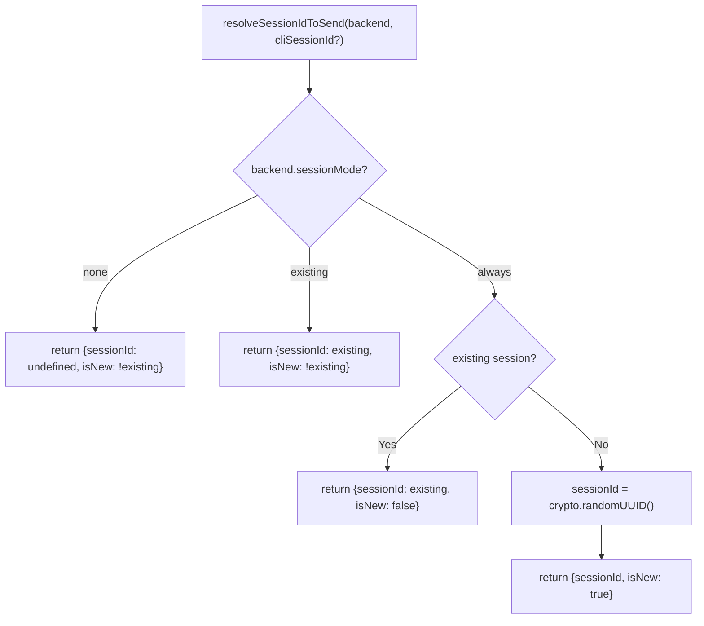
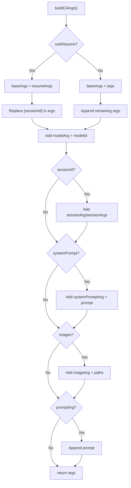
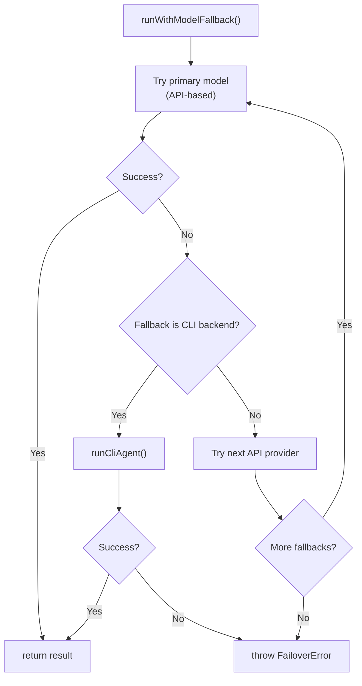

# ページ: CLI バックエンド実行

# CLI バックエンド実行

<details>
<summary>関連ソースファイル</summary>

以下のファイルがこの Wiki ページの生成に使用されました：

- [docs/concepts/system-prompt.md](docs/concepts/system-prompt.md)
- [docs/gateway/cli-backends.md](docs/gateway/cli-backends.md)
- [docs/reference/token-use.md](docs/reference/token-use.md)
- [src/agents/auth-profiles/oauth.fallback-to-main-agent.test.ts](src/agents/auth-profiles/oauth.fallback-to-main-agent.test.ts)
- [src/agents/auth-profiles/oauth.ts](src/agents/auth-profiles/oauth.ts)
- [src/agents/cli-backends.ts](src/agents/cli-backends.ts)
- [src/agents/cli-runner.test.ts](src/agents/cli-runner.test.ts)
- [src/agents/cli-runner.ts](src/agents/cli-runner.ts)
- [src/agents/cli-runner/helpers.ts](src/agents/cli-runner/helpers.ts)
- [src/agents/pi-embedded-runner/compact.ts](src/agents/pi-embedded-runner/compact.ts)
- [src/agents/pi-embedded-runner/run/attempt.ts](src/agents/pi-embedded-runner/run/attempt.ts)
- [src/agents/pi-embedded-runner/system-prompt.ts](src/agents/pi-embedded-runner/system-prompt.ts)
- [src/agents/system-prompt-params.ts](src/agents/system-prompt-params.ts)
- [src/agents/system-prompt-report.ts](src/agents/system-prompt-report.ts)
- [src/agents/system-prompt.test.ts](src/agents/system-prompt.test.ts)
- [src/agents/system-prompt.ts](src/agents/system-prompt.ts)
- [src/auto-reply/reply/agent-runner.heartbeat-typing.runreplyagent-typing-heartbeat.retries-after-compaction-failure-by-resetting-session.test.ts](src/auto-reply/reply/agent-runner.heartbeat-typing.runreplyagent-typing-heartbeat.retries-after-compaction-failure-by-resetting-session.test.ts)
- [src/auto-reply/reply/commands-context-report.ts](src/auto-reply/reply/commands-context-report.ts)
- [src/gateway/gateway-cli-backend.live.test.ts](src/gateway/gateway-cli-backend.live.test.ts)
- [src/telegram/group-migration.test.ts](src/telegram/group-migration.test.ts)
- [src/telegram/group-migration.ts](src/telegram/group-migration.ts)

</details>


このドキュメントは、OpenClaw の **CLI バックエンドシステム**について説明します。これは、ローカル AI コマンドラインツールを通じてテキストのみのエージェント実行を可能にします。CLI バックエンドは API プロバイダーが利用できない場合のフォールバックランタイムとして機能し、ツールなしの対話でも直接呼び出すことができます。

メインの埋め込みエージェント実行パイプライン（API ベース、ツール有効）については、「[エージェント実行フロー](#5.1)」を参照してください。プロバイダー間のモデル選択とフェイルオーバーについては、「[モデル選択とフェイルオーバー](#5.4)」を参照してください。

## 目的と範囲

CLI バックエンドは以下を提供する **テキストのみの実行パス** です：

- **ツールを無効化**（OpenClaw ツール呼び出しは CLI に到達しない）
- **セッションをサポート**（ターン間での会話の継続性）
- **画像を処理**（パス注入または CLI 画像引数を介して）
- **構造化出力を解析**（利用可能な場合の JSON/JSONL）
- **フォールバックとして機能**（プライマリモデルが失敗した場合に自動的に呼び出される）

このシステムは、機能の完全性よりも信頼性を重視して設計されています。すべての API プロバイダーがダウンしている場合でも、機能するテキストパスを保証します。

## CLI バックエンドアーキテクチャ

CLI バックエンドシステムは、設定解決、実行キューイング、出力解析レイヤーで構成されます。

### システムコンポーネントマップ



**ソース：** [src/agents/cli-runner.ts:1-363](), [src/agents/cli-runner/helpers.ts:1-489](), [src/agents/cli-backends.ts:1-158]()

## 設定システム

CLI バックエンドは `agents.defaults.cliBackends` の下で設定されます。各バックエンドは **プロバイダー ID**（例: `claude-cli`, `codex-cli`, `my-cli`）でキー付けされ、これがモデル参照の左側になります：`<provider>/<model>`。

### CliBackendConfig 構造

`CliBackendConfig` タイプはすべての実行パラメータを定義します：

| フィールド | タイプ | 目的 |
|-------|------|---------|
| `command` | `string` | 実行可能ファイルパス（必須） |
| `args` | `string[]` | デフォルト CLI 引数 |
| `resumeArgs` | `string[]` | セッション再開用の引数（`args` を置換） |
| `output` | `"json" \| "jsonl" \| "text"` | 出力形式パーサー |
| `resumeOutput` | `"json" \| "jsonl" \| "text"` | 再開時の出力形式 |
| `input` | `"arg" \| "stdin"` | プロンプトの渡し方 |
| `modelArg` | `string` | モデル選択用フラグ |
| `modelAliases` | `Record<string, string>` | モデル名マッピング |
| `sessionArg` | `string` | セッション ID 用フラグ（単一引数） |
| `sessionArgs` | `string[]` | `{sessionId}` を含むセッション ID テンプレート |
| `sessionMode` | `"always" \| "existing" \| "none"` | セッション ID を送信するタイミング |
| `sessionIdFields` | `string[]` | セッション ID を抽出する JSON フィールド |
| `systemPromptArg` | `string` | システムプロンプト用フラグ |
| `systemPromptMode` | `"append" \| "replace"` | システムプロンプトの適用方法 |
| `systemPromptWhen` | `"always" \| "first" \| "never"` | システムプロンプトを送信するタイミング |
| `imageArg` | `string` | 画像パス用フラグ |
| `imageMode` | `"list" \| "repeat"` | 複数の画像を渡す方法 |
| `maxPromptArgChars` | `number` | stdin に切り替えるしきい値 |
| `env` | `Record<string, string>` | 設定する環境変数 |
| `clearEnv` | `string[]` | 未設定にする環境変数 |
| `serialize` | `boolean` | 実行をシリアルにキューするかどうか |

**ソース：** [src/config/types.ts](), [src/agents/cli-backends.ts:1-158]()

### 組み込みバックエンドのデフォルト

OpenClaw は 2 つの組み込みバックエンドとともに付属します：

#### claude-cli

```typescript
DEFAULT_CLAUDE_BACKEND = {
  command: "claude",
  args: ["-p", "--output-format", "json", "--dangerously-skip-permissions"],
  resumeArgs: ["-p", "--output-format", "json",
               "--dangerously-skip-permissions", "--resume", "{sessionId}"],
  output: "json",
  modelArg: "--model",
  sessionArg: "--session-id",
  sessionMode: "always",
  systemPromptArg: "--append-system-prompt",
  systemPromptWhen: "first",
  clearEnv: ["ANTHROPIC_API_KEY", "ANTHROPIC_API_KEY_OLD"],
  serialize: true
}
```

#### codex-cli

```typescript
DEFAULT_CODEX_BACKEND = {
  command: "codex",
  args: ["exec", "--json", "--color", "never",
         "--sandbox", "read-only", "--skip-git-repo-check"],
  resumeArgs: ["exec", "resume", "{sessionId}", "--color", "never",
               "--sandbox", "read-only", "--skip-git-repo-check"],
  output: "jsonl",
  resumeOutput: "text",
  modelArg: "--model",
  sessionMode: "existing",
  imageArg: "--image",
  imageMode: "repeat",
  serialize: true
}
```

**ソース：** [src/agents/cli-backends.ts:10-77]()

### 設定解決

`resolveCliBackendConfig` 関数は、ユーザーオーバーライドと組み込みのデフォルトをマージします：

```mermaid
flowchart TD
    Start["resolveCliBackendConfig(provider, cfg)"] --> Normalize["normalizeBackendKey(provider)"]
    Normalize --> IsClaudeCli{provider == 'claude-cli'?}

    IsClaudeCli -->|Yes| MergeClaudeDefaults["mergeBackendConfig(<br/>DEFAULT_CLAUDE_BACKEND,<br/>cfg.agents.defaults.cliBackends['claude-cli'])"]
    IsClaudeCli -->|No| IsCodexCli{provider == 'codex-cli'?}

    IsCodexCli -->|Yes| MergeCodexDefaults["mergeBackendConfig(<br/>DEFAULT_CODEX_BACKEND,<br/>cfg.agents.defaults.cliBackends['codex-cli'])"]
    IsCodexCli -->|No| CheckCustom{Custom backend<br/>configured?}

    CheckCustom -->|Yes| UseCustom["Use cfg.agents.defaults.cliBackends[provider]"]
    CheckCustom -->|No| ReturnNull["return null"]

    MergeClaudeDefaults --> ValidateCommand{command.trim()?}
    MergeCodexDefaults --> ValidateCommand
    UseCustom --> ValidateCommand

    ValidateCommand -->|Valid| Return["return {id, config}"]
    ValidateCommand -->|Empty| ReturnNull

    Return --> End[/"ResolvedCliBackend"/]
    ReturnNull --> End
```

**ソース：** [src/agents/cli-backends.ts:79-158](), [src/agents/cli-runner.ts:72-76]()

## 実行パイプライン

実行パイプラインは、キューイング、クリーンアップ、コマンド構築、実行、出力解析の各フェーズを経て実行されます。

### 高レベル実行フロー



**ソース：** [src/agents/cli-runner.ts:35-324](), [src/agents/cli-runner/helpers.ts:152-162]()

### キューのシリアル化

`CLI_RUN_QUEUE` は `serialize: true` の場合シリアル実行を保証します：

```typescript
// src/agents/cli-runner/helpers.ts:19
const CLI_RUN_QUEUE = new Map<string, Promise<unknown>>();

export function enqueueCliRun<T>(key: string, task: () => Promise<T>): Promise<T> {
  const prior = CLI_RUN_QUEUE.get(key) ?? Promise.resolve();
  const chained = prior.catch(() => undefined).then(task);
  const tracked = chained.finally(() => {
    if (CLI_RUN_QUEUE.get(key) === tracked) {
      CLI_RUN_QUEUE.delete(key);
    }
  });
  CLI_RUN_QUEUE.set(key, tracked);
  return chained;
}
```

各バックエンドプロバイダーは独自のキューキー（例: `claude-cli`, `codex-cli`）を持ち、同時実行が CLI セッション状態に干渉するのを防ぎます。

**ソース：** [src/agents/cli-runner/helpers.ts:19-162](), [src/agents/cli-runner.ts:178-179]()

### プロセスクリーンアップ

実行前、2 つのクリーンアップフェーズが実行されます：

#### 停止したプロセスクリーンアップ

`cleanupSuspendedCliProcesses` は、数がしきい値（デフォルト: 10）を超えると停止した（状態 `T`）CLI プロセスを削除します：

```mermaid
flowchart TD
    Start["cleanupSuspendedCliProcesses(backend, threshold=10)"] --> BuildMatchers["buildSessionMatchers(backend)"]
    BuildMatchers --> HasMatchers{matchers.length > 0?}
    HasMatchers -->|No| Skip["return (skip)"]
    HasMatchers -->|Yes| RunPs["runExec('ps', ['-ax', '-o', 'pid=,stat=,command='])"]

    RunPs --> ParseLines["For each ps line:"]
    ParseLines --> ExtractPid["extract pid, stat, command"]
    ExtractPid --> CheckSuspended{stat.includes('T')?}
    CheckSuspended -->|Yes| MatchCommand{matcher.test(command)?}
    CheckSuspended -->|No| NextLine
    MatchCommand -->|Yes| AddToList["suspended.push(pid)"]
    MatchCommand -->|No| NextLine
    AddToList --> NextLine["next line"]

    NextLine --> CheckThreshold{suspended.length > threshold?}
    CheckThreshold -->|Yes| Kill["runExec('kill', ['-9', ...pids])"]
    CheckThreshold -->|No| Done["return"]
    Kill --> Done
```

**ソース：** [src/agents/cli-runner/helpers.ts:105-151]()

#### 再開プロセスクリーンアップ

`cleanupResumeProcesses` は特定のセッション ID の古い再開プロセスを終了します：



**ソース：** [src/agents/cli-runner/helpers.ts:21-54]()

## システムプロンプト構築

CLI バックエンドは OpenClaw のシステムプロンプトビルダーを再利用しますが、ツール無効化通知を注入します：

```typescript
// src/agents/cli-runner.ts:81-86
const extraSystemPrompt = [
  params.extraSystemPrompt?.trim(),
  "Tools are disabled in this session. Do not call tools.",
]
  .filter(Boolean)
  .join("\n");
```

システムプロンプトには以下が含まれます：

- **ブートストラップコンテキスト**（AGENTS.md、SOUL.md、IDENTITY.md など）
- **実行情報**（ホスト、OS、モデル表示名、シェル）
- **時間とタイムゾーン**（設定されている場合）
- **ハートビート指示**（デフォルトエージェントのみ）
- **ドキュメントパス**（OpenClaw 自己参照用）
- **ツール無効化通知**（extraSystemPrompt に追加）

`tools: []` が `buildSystemPrompt` に渡されるため、ツーリングセクションは最小限または省略されています。

**ソース：** [src/agents/cli-runner.ts:81-122](), [src/agents/cli-runner/helpers.ts:197-249]()

## セッション管理

CLI バックエンドは、CLI がセッション ID を提供する場合、セッションの継続性をサポートします：

### セッション ID 解決



**ソース：** [src/agents/cli-runner/helpers.ts:421-437]()

### セッション引数注入

セッションは 3 つのメカニズムのいずれかを通じて CLI に渡されます：

1. **sessionArg**: 単一フラグ + 値（例: `--session-id <uuid>`）
2. **sessionArgs**: `{sessionId}` プレースホルダーを含むテンプレート配列
3. **resumeArgs**: 再開用の代替引数（例: `resume {sessionId}`）

`buildCliArgs` 関数は最終的な引数リストを構築します：



**ソース：** [src/agents/cli-runner.ts:166-175](), [src/agents/cli-runner/helpers.ts]()

### セッション ID 抽出

実行後、`parseCliJson` と `parseCliJsonl` は `sessionIdFields` を使用して出力からセッション ID を抽出します：

```typescript
// src/agents/cli-runner/helpers.ts:311-328
function pickSessionId(
  parsed: Record<string, unknown>,
  backend: CliBackendConfig,
): string | undefined {
  const fields = backend.sessionIdFields ?? [
    "session_id",
    "sessionId",
    "conversation_id",
    "conversationId",
  ];
  for (const field of fields) {
    const value = parsed[field];
    if (typeof value === "string" && value.trim()) {
      return value.trim();
    }
  }
  return undefined;
}
```

**ソース：** [src/agents/cli-runner/helpers.ts:311-397]()

## 出力解析

CLI 出力は `output` モードに基づいて解析されます：

### JSON 解析

`parseCliJson` は構造化出力からテキスト、セッション ID、使用量を抽出します：

```mermaid
flowchart TD
    Start["parseCliJson(raw, backend)"] --> Trim["stdout.trim()"]
    Trim --> Parse["JSON.parse(trimmed)"]
    Parse --> IsRecord{isRecord(parsed)?}

    IsRecord -->|No| ReturnNull["return null"]
    IsRecord -->|Yes| PickSession["pickSessionId(parsed, backend)"]

    PickSession --> ParseUsage["toUsage(parsed.usage)"]
    ParseUsage --> CollectText["collectText(parsed):<br/>message | content | result | *"]

    CollectText --> Return["return {text, sessionId?, usage?}"]
```

`collectText` 関数はネストされた構造から再帰的にテキストを抽出します：

```typescript
// src/agents/cli-runner/helpers.ts:283-309
function collectText(value: unknown): string {
  if (typeof value === "string") return value;
  if (Array.isArray(value)) return value.map(collectText).join("");
  if (!isRecord(value)) return "";
  if (typeof value.text === "string") return value.text;
  if (typeof value.content === "string") return value.content;
  if (Array.isArray(value.content)) return value.content.map(collectText).join("");
  if (isRecord(value.message)) return collectText(value.message);
  return "";
}
```

**ソース：** [src/agents/cli-runner/helpers.ts:283-352]()

### JSONL 解析

`parseCliJsonl` はストリーミング JSONL 出力（Codex CLI `--json` モード）を処理します：

```mermaid
flowchart TD
    Start["parseCliJsonl(raw, backend)"] --> Split["Split by newlines"]
    Split --> ForEach["For each non-empty line:"]

    ForEach --> ParseLine["JSON.parse(line)"]
    ParseLine --> IsRecord{isRecord(parsed)?}

    IsRecord -->|No| NextLine
    IsRecord -->|Yes| ExtractSession{sessionId extracted?}
    ExtractSession -->|No| TryPickSession["pickSessionId(parsed, backend)"]
    TryPickSession --> CheckThreadId{parsed.thread_id?}
    CheckThreadId -->|Yes| SetThreadId["sessionId = thread_id"]
    CheckThreadId -->|No| ExtractUsage
    ExtractSession -->|Yes| ExtractUsage{parsed.usage?}
    SetThreadId --> ExtractUsage

    ExtractUsage -->|Yes| MergeUsage["usage = toUsage(parsed.usage)"]
    ExtractUsage -->|No| CheckItem
    MergeUsage --> CheckItem{parsed.item?}

    CheckItem -->|Yes| ExtractItemText["if item.type ~ 'message':<br/>texts.push(item.text)"]
    CheckItem -->|No| NextLine["next line"]
    ExtractItemText --> NextLine

    NextLine --> Done{All lines processed?}
    Done -->|No| ForEach
    Done -->|Yes| Return["return {text: texts.join('\\n'), sessionId?, usage?}"]
```

**ソース：** [src/agents/cli-runner/helpers.ts:354-397]()

### テキストモード

`output: "text"` の場合、stdout が直接返されます：

```typescript
// src/agents/cli-runner.ts:274-278
if (outputMode === "text") {
  return { text: stdout, sessionId: undefined };
}
```

**ソース：** [src/agents/cli-runner.ts:274-286]()

## 画像処理

CLI バックエンドは 2 つの戦略を通じて画像パススルーをサポートします：

### 画像引数

`imageArg` が設定されている場合、画像は一時ファイルに書き込まれ、CLI 引数として渡されます：

```typescript
// src/agents/cli-runner.ts:148-155
if (params.images && params.images.length > 0) {
  const imagePayload = await writeCliImages(params.images);
  imagePaths = imagePayload.paths;
  cleanupImages = imagePayload.cleanup;
  if (!backend.imageArg) {
    prompt = appendImagePathsToPrompt(prompt, imagePaths);
  }
}
```

`writeCliImages` は `/tmp/openclaw-cli-images-*` に一時ファイルを作成します：

```typescript
// src/agents/cli-runner/helpers.ts:479-489
export async function writeCliImages(
  images: ImageContent[],
): Promise<{ paths: string[]; cleanup: () => Promise<void> }> {
  const tempDir = await fs.mkdtemp(path.join(os.tmpdir(), "openclaw-cli-images-"));
  const paths: string[] = [];
  for (let i = 0; i < images.length; i += 1) {
    const image = images[i];
    const ext = resolveImageExtension(image.mimeType);
    const filePath = path.join(tempDir, `image-${i + 1}.${ext}`);
    const buffer = Buffer.from(image.data, "base64");
    await fs.writeFile(filePath, buffer);
    paths.push(filePath);
  }
  return {
    paths,
    cleanup: async () => { await fs.rm(tempDir, { recursive: true }); }
  };
}
```

**ソース：** [src/agents/cli-runner.ts:146-155](), [src/agents/cli-runner/helpers.ts:453-489]()

### パス注入

`imageArg` が不足している場合、画像パスはプロンプトに追加されます：

```typescript
// src/agents/cli-runner/helpers.ts:470-477
export function appendImagePathsToPrompt(prompt: string, paths: string[]): string {
  if (!paths.length) return prompt;
  const trimmed = prompt.trimEnd();
  const separator = trimmed ? "\n\n" : "";
  return `${trimmed}${separator}${paths.join("\n")}`;
}
```

これは、プロンプトからローカルパスの画像を自動ロードする CLI（Claude Code CLI の動作）に依存します。

**ソース：** [src/agents/cli-runner/helpers.ts:470-477]()

## 使用量追跡

トークン使用量は CLI JSON 出力から抽出され、正規化されます：

```typescript
// src/agents/cli-runner/helpers.ts:268-281
function toUsage(raw: Record<string, unknown>): CliUsage | undefined {
  const pick = (key: string) =>
    typeof raw[key] === "number" && raw[key] > 0 ? raw[key] : undefined;
  const input = pick("input_tokens") ?? pick("inputTokens");
  const output = pick("output_tokens") ?? pick("outputTokens");
  const cacheRead =
    pick("cache_read_input_tokens") ?? pick("cached_input_tokens") ?? pick("cacheRead");
  const cacheWrite = pick("cache_write_input_tokens") ?? pick("cacheWrite");
  const total = pick("total_tokens") ?? pick("total");
  if (!input && !output && !cacheRead && !cacheWrite && !total) {
    return undefined;
  }
  return { input, output, cacheRead, cacheWrite, total };
}
```

正規化された使用量は `EmbeddedPiRunResult.meta.agentMeta.usage` で返されます。

**ソース：** [src/agents/cli-runner/helpers.ts:164-281](), [src/agents/cli-runner.ts:290-301]()

## フェイルオーバー統合

CLI バックエンドは `runWithModelFallback` を通じて OpenClaw のフェイルオーバーシステムと統合されます：



CLI 実行が失敗した場合、エラーは `FailoverError` でラップされます：

```typescript
// src/agents/cli-runner.ts:262-273
if (result.code !== 0) {
  const err = stderr || stdout || "CLI failed.";
  const reason = classifyFailoverReason(err) ?? "unknown";
  const status = resolveFailoverStatus(reason);
  throw new FailoverError(err, {
    reason,
    provider: params.provider,
    model: modelId,
    status,
  });
}
```

**ソース：** [src/agents/cli-runner.ts:262-316](), [src/agents/model-fallback.ts]()

## 制限

CLI バックエンドには意図的な制限があります：

| 制限 | 理由 |
|------------|--------|
| **OpenClaw ツールなし** | CLI 出力は構造化されておらず、ツール呼び出しを解析/実行できない |
| **ストリーミングなし** | CLI 出力は解析前に同期して収集される |
| **テキストのみの応答** | リッチなコンテンツ（ボタン、リアクション、埋め込み）はサポートされていない |
| **セッションコンパクションなし** | CLI セッションはコンパクションできない（トランスクリプトアクセスなし） |
| **制限付きエラー処理** | CLI エラーは FailoverError にマッピング、細かなリトライロジックなし |
| **バックグラウンドプロセスなし** | CLI 実行は同期、`bash` プロセスレジストリなし |
| **シリアル実行** | `serialize: true` が同時実行を防ぐ（CLI セッション整合性のため） |
| **プラットフォーム固有** | プロセスクリーンアップ（`ps`, `pkill`）は Windows で無効 |

**ソース：** [docs/gateway/cli-backends.md:209-218](), [src/agents/cli-runner.ts:35-324]()

## 設定例

### 最小限のオーバーライド（パスのみ）

```json
{
  "agents": {
    "defaults": {
      "cliBackends": {
        "claude-cli": {
          "command": "/opt/homebrew/bin/claude"
        }
      }
    }
  }
}
```

### カスタム CLI バックエンド

```json
{
  "agents": {
    "defaults": {
      "cliBackends": {
        "my-cli": {
          "command": "/usr/local/bin/my-ai-cli",
          "args": ["--json", "--no-color"],
          "output": "json",
          "input": "stdin",
          "modelArg": "--model",
          "modelAliases": {
            "fast": "gpt-4o-mini",
            "smart": "gpt-4o"
          },
          "sessionArg": "--session",
          "sessionMode": "always",
          "systemPromptArg": "--system",
          "systemPromptWhen": "first",
          "serialize": true
        }
      }
    }
  }
}
```

### CLI を使用したフォールバックチェーン

```json
{
  "agents": {
    "defaults": {
      "model": {
        "primary": "anthropic/claude-opus-4-6",
        "fallbacks": ["openai/gpt-4o", "claude-cli/opus-4.6"]
      },
      "models": {
        "anthropic/claude-opus-4-6": {},
        "openai/gpt-4o": {},
        "claude-cli/opus-4.6": {}
      }
    }
  }
}
```

**ソース：** [docs/gateway/cli-backends.md:23-132](), [src/agents/cli-backends.ts:79-158]()

---

**ページソース：** [src/agents/cli-runner.ts:1-363](), [src/agents/cli-runner/helpers.ts:1-489](), [src/agents/cli-backends.ts:1-158](), [docs/gateway/cli-backends.md:1-226](), [src/agents/cli-runner.test.ts:1-223](), [src/gateway/gateway-cli-backend.live.test.ts:1-436]()