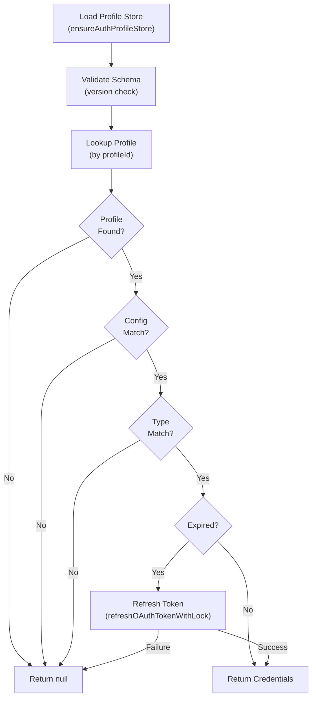
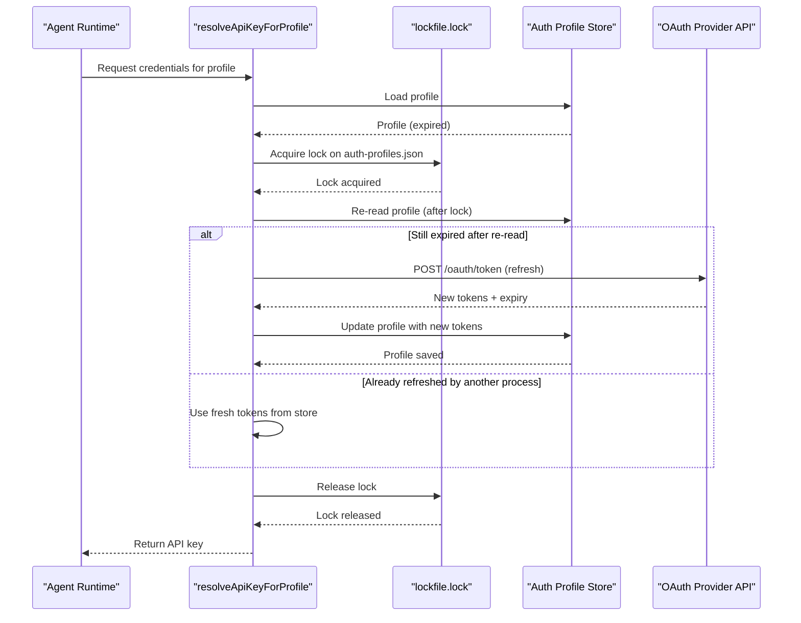
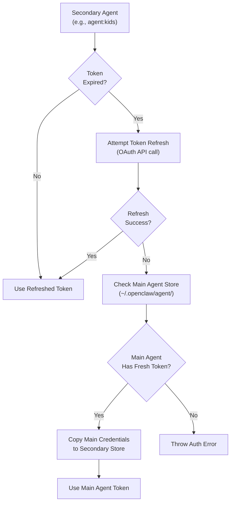
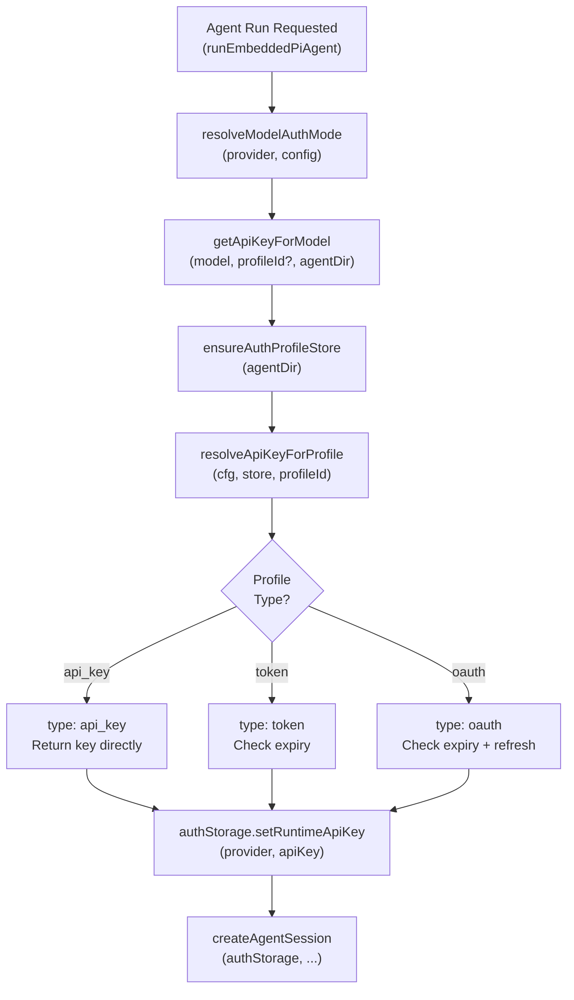

# ページ: 認証プロファイル

# 認証プロファイル

<details>
<summary>関連ソースファイル</summary>

以下のファイルがこの Wiki ページの生成に使用されました：

- [docs/concepts/system-prompt.md](docs/concepts/system-prompt.md)
- [docs/gateway/cli-backends.md](docs/gateway/cli-backends.md)
- [docs/reference/token-use.md](docs/reference/token-use.md)
- [src/agents/auth-profiles/oauth.fallback-to-main-agent.test.ts](src/agents/auth-profiles/oauth.fallback-to-main-agent.test.ts)
- [src/agents/auth-profiles/oauth.ts](src/agents/auth-profiles/oauth.ts)
- [src/agents/cli-backends.ts](src/agents/cli-backends.ts)
- [src/agents/cli-runner.test.ts](src/agents/cli-runner.test.ts)
- [src/agents/cli-runner.ts](src/agents/cli-runner.ts)
- [src/agents/cli-runner/helpers.ts](src/agents/cli-runner/helpers.ts)
- [src/agents/pi-embedded-runner/compact.ts](src/agents/pi-embedded-runner/compact.ts)
- [src/agents/pi-embedded-runner/run/attempt.ts](src/agents/pi-embedded-runner/run/attempt.ts)
- [src/agents/pi-embedded-runner/system-prompt.ts](src/agents/pi-embedded-runner/system-prompt.ts)
- [src/agents/system-prompt-params.ts](src/agents/system-prompt-params.ts)
- [src/agents/system-prompt-report.ts](src/agents/system-prompt-report.ts)
- [src/agents/system-prompt.test.ts](src/agents/system-prompt.test.ts)
- [src/agents/system-prompt.ts](src/agents/system-prompt.ts)
- [src/auto-reply/reply/agent-runner.heartbeat-typing.runreplyagent-typing-heartbeat.retries-after-compaction-failure-by-resetting-session.test.ts](src/auto-reply/reply/agent-runner.heartbeat-typing.runreplyagent-typing-heartbeat.retries-after-compaction-failure-by-resetting-session.test.ts)
- [src/auto-reply/reply/commands-context-report.ts](src/auto-reply/reply/commands-context-report.ts)
- [src/gateway/gateway-cli-backend.live.test.ts](src/gateway/gateway-cli-backend.live.test.ts)
- [src/telegram/group-migration.test.ts](src/telegram/group-migration.test.ts)
- [src/telegram/group-migration.ts](src/telegram/group-migration.ts)

</details>


このドキュメントは、OpenClaw の認証プロファイルシステムについて説明します。このシステムは AI モデルプロバイダーの API キー、OAuth トークン、その他の資格情報を管理します。認証プロファイルは自動トークン更新、マルチエージェント資格情報共有、プロバイダー固有の認証モードをサポートしています。

モデル選択とフォールバックチェーンについては、「[モデル選択とフェイルオーバー](#5.4)」を参照してください。CLI バックエンド設定については、「[CLI バックエンド実行](#5.6)」を参照してください。

---

## 概要

認証プロファイルは、資格情報をモデル設定から分離し、以下を可能にします：

- **プロバイダーごとの複数アカウント**: 異なる API キーや OAuth アカウントで異なるセッションを実行
- **自動 OAuth トークン更新**: トークンは期限切れ前に透過的に更新される
- **マルチエージェント資格情報継承**: セカンダリーエージェントはメインエージェントから資格情報を継承できる
- **プロバイダー固有の認証モード**: 異なるプロバイダーが異なる認証方法をサポート（API キー、OAuth、AWS SDK）

プロファイルはメインエージェントの場合 `~/.openclaw/agent/auth-profiles.json` に、設定されたエージェントの場合はエージェントごとのディレクトリ（`~/.openclaw/agents/<agentId>/agent/auth-profiles.json`）に保存されます。

ソース： [src/agents/auth-profiles/oauth.ts:1-286]()

---

## プロファイルの種類

OpenClaw は 3 つのプロファイル種類をサポートします：

| 種類 | 説明 | 使用例 |
|------|-------------|----------|
| `api_key` | 静的 API キー | 従来のプロバイダー API キー |
| `token` | 時間制限付きトークン | 短期アクセストークン |
| `oauth` | OAuth 資格情報 | Anthropic OAuth、Google OAuth など |

各プロファイル種類は、異なる有効期限と更新動作を持っています：

- **`api_key`**: 期限切れなし、そのまま保存
- **`token`**: オプションの `expires` タイムスタンプあり、自動更新なし
- **`oauth`**: `access`、`refresh`、`expires` フィールドあり、自動更新をサポート

ソース： [src/agents/auth-profiles/oauth.ts:156-192]()

---

## プロファイルストア構造

### 認証プロファイルストアファイル

```typescript
{
  "version": 1,
  "profiles": {
    "anthropic:claude-cli": {
      "type": "oauth",
      "provider": "anthropic",
      "access": "sk-ant-...",
      "refresh": "refresh-token-...",
      "expires": 1735689600000,
      "email": "user@example.com"
    },
    "openai:primary": {
      "type": "api_key",
      "provider": "openai",
      "key": "sk-proj-...",
      "email": "user@example.com"
    }
  }
}
```

**プロファイルストライフルifecycle**



ソース： [src/agents/auth-profiles/oauth.ts:149-285](), [src/agents/auth-profiles/oauth.fallback-to-main-agent.test.ts:53-127]()

---

## OAuth トークン更新

### ファイルロックを伴う更新フロー

OAuth トークンは期限切れ前に自動的に更新されます。同時実行での競合条件を防ぐため、OpenClaw は更新操作中にファイルロックを使用します。



ロック機構により、複数のプロセスが同じトークンを同時に更新することを防ぎ、無効化された資格情報を使用してしまう可能性を防ぎます。

ソース： [src/agents/auth-profiles/oauth.ts:36-106]()

---

## マルチエージェント資格情報継承

セカンダリーエージェントの OAuth トークンが期限切れになり、更新が失敗した場合、OpenClaw はメインエージェントから新しい資格情報を継承しようとします。これにより、手動の複製なしにエージェント設定間での資格情報共有が可能になります。

### 継承フロー



**例シナリオ：**

1. メインエージェント（`~/.openclaw/agent/`）に新しい Anthropic OAuth トークン（1 時間後期限切れ）がある
2. キッズエージェント（`~/.openclaw/agents/kids/agent/`）に期限切れのトークンがある
3. キッズエージェントの更新に失敗（例: ネットワークエラー）
4. OpenClaw がメインエージェントに新しいトークンがあることを検出
5. 新しいトークンがキッズエージェントストアにコピーされる
6. キッズエージェントが継承された資格情報で続行

ソース： [src/agents/auth-profiles/oauth.ts:247-269](), [src/agents/auth-profiles/oauth.fallback-to-main-agent.test.ts:53-127]()

---

## 設定統合

### 設定でのプロファイル定義

プロファイルは `openclaw.json` で宣言し、プロバイダーとモードの制約を強制できます：

```json5
{
  "auth": {
    "profiles": {
      "anthropic:primary": {
        "provider": "anthropic",
        "mode": "oauth"
      },
      "openai:research": {
        "provider": "openai",
        "mode": "api_key"
      }
    }
  }
}
```

設定は検証として機能します：ストアにプロファイルが存在しても、設定されたプロバイダーやモードに一致しない場合は拒否されます。

ソース： [src/agents/auth-profiles/oauth.ts:119-125](), [src/agents/auth-profiles/oauth.ts:160-169]()

---

## エージェントランタイムでのプロファイル解決

### 自動プロファイル選択

モデルが呼び出されたとき、OpenClaw は以下を使用して認証プロファイルを解決します：

1. **明示的なプロファイル ID**（`authProfileId` パラメータ経由で提供された場合）
2. **モデル固有の認証モード**（`resolveModelAuthMode` 経由で解決）
3. **プロバイダーのデフォルトプロファイル**（設定されている場合）

### プロファイル解決フロー



ソース： [src/agents/pi-embedded-runner/run/attempt.ts:140-161](), [src/agents/pi-embedded-runner/run/attempt.ts:239](), [src/agents/pi-embedded-runner/run/attempt.ts:483-491]()

---

## プロバイダー別認証モード

異なるプロバイダーは異なる認証モードをサポートします：

| プロバイダー | サポートされるモード | 備考 |
|----------|----------------|-------|
| `anthropic` | `api_key`, `oauth` | Anthropic コンソール経由の OAuth |
| `openai` | `api_key`, `oauth` | OpenAI プラットフォーム経由の OAuth |
| `google-gemini` | `api_key` | API キーのみ |
| `google-gemini-cli` | `oauth` | プロジェクト ID 付き OAuth |
| `google-antigravity` | `oauth` | プロジェクト ID 付き OAuth |
| `github-copilot` | `token` | GitHub トークン → Copilot トークン交換 |
| `aws-bedrock` | `aws-sdk` | AWS SDK 資格情報 |

**特別な処理：**

- **GitHub Copilot**: OpenClaw が `resolveCopilotApiToken` を呼び出し、GitHub トークンを Copilot トークンに交換
- **Google Gemini CLI/Antigravity**: API キー JSON に OAuth トークン + `projectId` が必要

ソース： [src/agents/pi-embedded-runner/run/attempt.ts:140-161](), [src/agents/auth-profiles/oauth.ts:26-34]()

---

## 手動プロファイルオーバーライド

特定の実行でプロファイルを指定できます：

```bash
# 特定のプロファイルをこの実行で使用
openclaw agent --message "hello" --auth-profile "anthropic:research"
```

`authProfileId` パラメータはエージェントランタイムを通じて渡され、資格情報解決中に使用されます。

ソース： [src/agents/pi-embedded-runner/run/attempt.ts:140-161](), [src/agents/pi-embedded-runner/compact.ts:78-168]()

---

## CLI バックエンド統合

CLI バックエンド（例: `claude-cli`, `codex-cli`）も認証プロファイルを使用できます。CLI バックエンドは外部コマンドを実行するため、通常は以下を行います：

1. 環境変数（例: `ANTHROPIC_API_KEY`）をクリアして意図しない API キー漏洩を防ぐ
2. CLI 引数または stdin 経由で資格情報を渡す
3. CLI ツール独自の認証メカニズムに依存

CLI バックエンド設定の `clearEnv` フィールドは、どの環境変数を未設定にするかを指定します：

```json5
{
  "agents": {
    "defaults": {
      "cliBackends": {
        "claude-cli": {
          "clearEnv": ["ANTHROPIC_API_KEY", "ANTHROPIC_API_KEY_OLD"]
        }
      }
    }
  }
}
```

ソース： [src/agents/cli-backends.ts:51](), [src/agents/cli-runner.ts:221-228]()

---

## Doctor と修復

`openclaw doctor` コマンドは、一般的な認証問題を検出し修復できます：

- **更新トークンのない期限切れトークン**: 再認証を促す
- **プロファイル/設定の不一致**: プロファイル ID 修正を提案
- **レガシーデフォルトプロファイル**: 新しいプロファイル ID 形式への移行

Doctor は `formatAuthDoctorHint` を使用して、実行可能な修復手順を提供します。

ソース： [src/agents/auth-profiles/oauth.ts:272-283]()

---

## まとめ表：プロファイルライフサイクル操作

| 操作 | 関数 | ファイルロック | フォールバック |
|-----------|----------|--------------|----------|
| プロファイルの読み込み | `ensureAuthProfileStore` | いいえ | 空のストアを作成 |
| 資格情報の解決 | `resolveApiKeyForProfile` | いいえ | null を返す |
| OAuth トークンの更新 | `refreshOAuthTokenWithLock` | はい（ロックファイル） | メインからの継承 |
| 更新トークンの保存 | `saveAuthProfileStore` | いいえ（アトミック書き込み） | N/A |
| メインからの継承 | （内部フォールバック） | いいえ | 認証エラーをスロー |

ソース： [src/agents/auth-profiles/oauth.ts:1-286](), [src/agents/auth-profiles/oauth.fallback-to-main-agent.test.ts:1-127]()

---