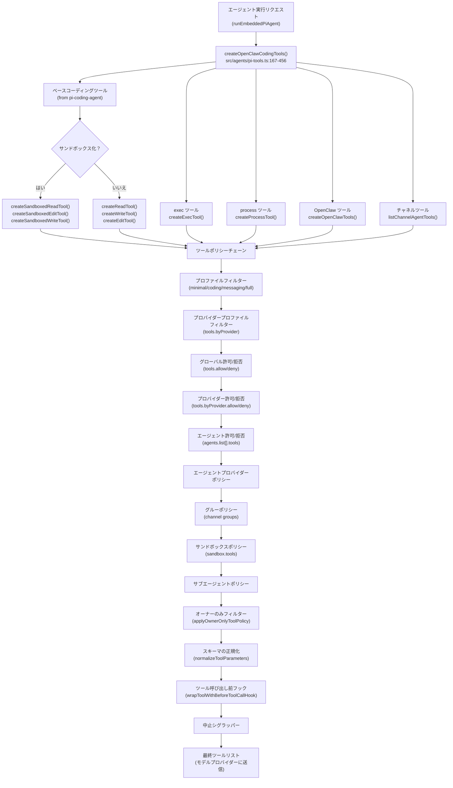
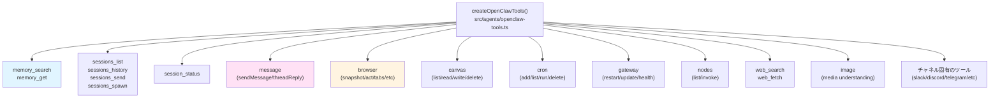
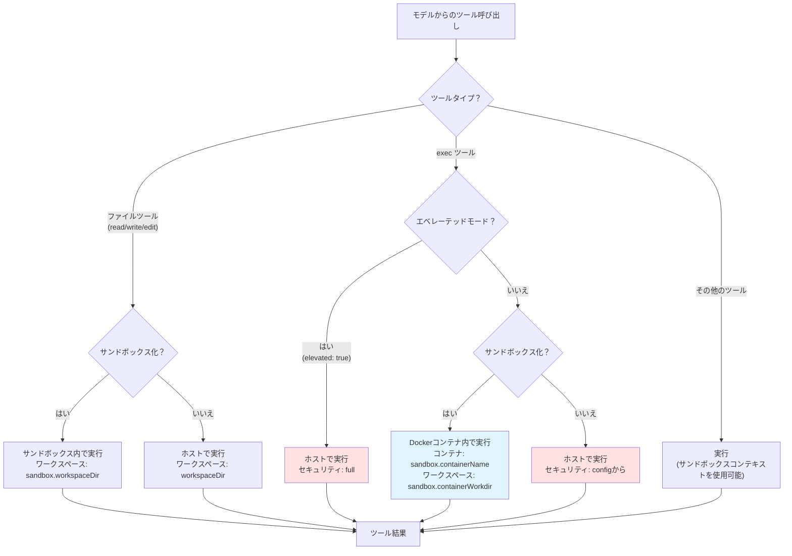
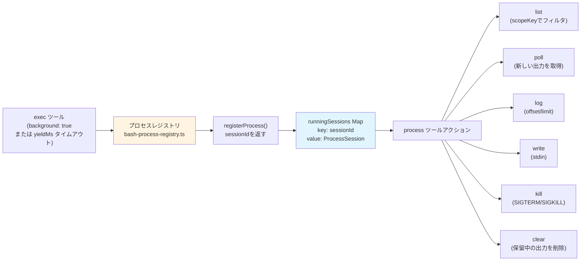
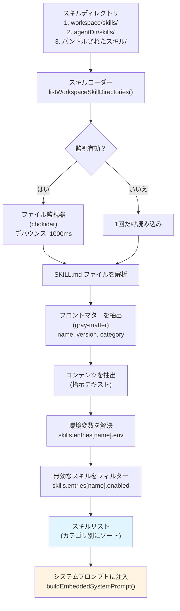

# ページ: ツールとスキル

# ツールとスキル

<details>
<summary>関連ソースファイル</summary>

このWikiページの生成に使用されたファイル：

- [CHANGELOG.md](CHANGELOG.md)
- [docs/cli/memory.md](docs/cli/memory.md)
- [docs/cli/sandbox.md](docs/cli/sandbox.md)
- [docs/concepts/memory.md](docs/concepts/memory.md)
- [docs/gateway/background-process.md](docs/gateway/background-process.md)
- [docs/gateway/configuration.md](docs/gateway/configuration.md)
- [docs/gateway/sandbox-vs-tool-policy-vs-elevated.md](docs/gateway/sandbox-vs-tool-policy-vs-elevated.md)
- [docs/gateway/sandboxing.md](docs/gateway/sandboxing.md)
- [docs/platforms/mac/skills.md](docs/platforms/mac/skills.md)
- [docs/tools/elevated.md](docs/tools/elevated.md)
- [docs/tools/index.md](docs/tools/index.md)
- [docs/tools/skills-config.md](docs/tools/skills-config.md)
- [src/agents/bash-process-registry.test.ts](src/agents/bash-process-registry.test.ts)
- [src/agents/bash-process-registry.ts](src/agents/bash-process-registry.ts)
- [src/agents/bash-tools.ts](src/agents/bash-tools.ts)
- [src/agents/pi-embedded-helpers.ts](src/agents/pi-embedded-helpers.ts)
- [src/agents/pi-embedded-runner.test.ts](src/agents/pi-embedded-runner.test.ts)
- [src/agents/pi-embedded-runner.ts](src/agents/pi-embedded-runner.ts)
- [src/agents/pi-embedded-subscribe.ts](src/agents/pi-embedded-subscribe.ts)
- [src/agents/pi-tools.ts](src/agents/pi-tools.ts)
- [src/agents/pi-embedded-runner/system-prompt.ts](src/agents/pi-embedded-runner/system-prompt.ts)

</details>


**目的**: このドキュメントでは、OpenClawのツールシステムとスキルフレームワークについて説明します。ツール作成、ポリシーベースの認可、ビルトインツールインベントリ、サンドボックス制限、およびスキル（テキストベースのツール使用ガイダンス）がエージェントプロンプトに注入される方法についてカバーします。

**関連ページ**:
- サンドボックス構成の詳細については、[サンドボックス](#14)（デプロイ/運用）を参照
- CLIツールの使用については、[ツール](#12.1)（CLIリファレンス）を参照
- エベレーテッド実行モードについては、[エベレーテッドモード](#14.2)を参照
- バックグラウンドプロセス管理については、[バックグラウンドプロセス](#14.3)を参照

---

## ツールシステムアーキテクチャ

OpenClawは2つのカテゴリのツールを提供します：
1. **コアコーディングツール**: ファイル操作（`read`、`write`、`edit`）、シェル実行（`exec`、`bash`）、プロセス管理（`process`）
2. **OpenClaw固有のツール**: メモリ検索、セッション管理、メッセージング、ブラウザ自動化、cron、canvas、ノード

すべてのツールは、モデルプロバイダーに送られる前に連鎖的なポリシールールを強制する統一されたパイプラインを通じて作成およびフィルタリングされます。

### ツール作成パイプライン



**ソース**: [src/agents/pi-tools.ts:167-456](), [src/agents/pi-tools.policy.ts](), [src/agents/tool-policy.ts]()

### ツールポリシー解決チェーン

ツールポリシーシステムは、各ステージがツールセットを**制限するのみ**（決して拡張しない）連鎖フィルタを適用します。拒否ルールは常にすべてのステージで許可ルールに勝ちます。

```mermaid
flowchart LR
    Start["すべての利用可能なツール"] --> ProfilePolicy["1. プロファイルポリシー<br/>tools.profile<br/>agents.list[].tools.profile"]

    ProfilePolicy --> ProviderProfile["2. プロバイダープロファイル<br/>tools.byProvider[provider].profile"]

    ProviderProfile --> GlobalPolicy["3. グローバルポリシー<br/>tools.allow/deny"]

    GlobalPolicy --> ProviderPolicy["4. プロバイダーポリシー<br/>tools.byProvider[provider].allow/deny"]

    ProviderPolicy --> AgentPolicy["5. エージェントポリシー<br/>agents.list[].tools.allow/deny"]

    AgentPolicy --> AgentProvider["6. エージェントプロバイダーポリシー<br/>agents.list[].tools.byProvider"]

    AgentProvider --> GroupPolicy["7. グルーポリシー<br/>channels.*.groups[id].tools<br/>sender/channel/spaceで一致"]

    GroupPolicy --> SandboxPolicy["8. サンドボックスポリシー<br/>agents.defaults.sandbox.tools<br/>agents.list[].sandbox.tools"]

    SandboxPolicy --> SubagentPolicy["9. サブエージェントポリシー<br/>agents.defaults.subagents.tools"]

    SubagentPolicy --> Final["最終許可ツール"]

    style Start fill:#e1f5ff
    style Final fill:#d4edda
    style SandboxPolicy fill:#ffe1e1
```



**ポリシー解決関数**:
- プロフィール解決: [src/agents/tool-policy.ts:resolveToolProfilePolicy]()
- グローバル/エージェント解決: [src/agents/pi-tools.policy.ts:resolveEffectiveToolPolicy]()
- グループ解決: [src/agents/pi-tools.policy.ts:resolveGroupToolPolicy]()
- サンドボックス解決: [src/agents/sandbox/tool-policy.ts:resolveSandboxToolPolicyForAgent]()
- サブエージェント解決: [src/agents/pi-tools.policy.ts:resolveSubagentToolPolicy]()

**ソース**: [src/agents/pi-tools.ts:167-210](), [src/agents/pi-tools.policy.ts:1-238](), [src/agents/tool-policy.ts:1-300]()

---

## ツールインベントリ

### コアコーディングツール

| ツール | 用途 | サンドボックスバリアント | 設定キー |
|--------|------|------------------------|----------|
| `read` | ファイル内容の読み取り | `createSandboxedReadTool()` | 該当なし（常に利用可能） |
| `write` | コンテンツでファイルに書き込み | `createSandboxedWriteTool()` | 該当なし（常に利用可能） |
| `edit` | 検索/置換編集を適用 | `createSandboxedEditTool()` | 該当なし（常に利用可能） |
| `apply_patch` | 構造化パッチを適用 | サンドボックスバリアントなし | `tools.exec.applyPatch.enabled` |
| `exec` | シェルコマンドの実行 | 有効時はサンドボックス内で実行 | `tools.exec.*` |
| `process` | バックグラウンド実行セッションの管理 | サンドボックスコンテキストを継承 | 該当なし（`process`が許可されている必要あり） |

**ファイルツールの実装**:
- サンドボックスバリアント: [src/agents/pi-tools.read.ts:createSandboxedReadTool](), [src/agents/pi-tools.read.ts:createSandboxedWriteTool](), [src/agents/pi-tools.read.ts:createSandboxedEditTool]()
- ホストバリアント: [src/agents/pi-tools.ts:248-275]()
- パッチ適用ツール: [src/agents/apply-patch.ts:createApplyPatchTool]()

**execツールの機能**:
- 承認システム: `tools.exec.ask`（`off`、`on-miss`、`always`）
- セキュリティモード: `tools.exec.security`（`deny`、`allowlist`、`full`）
- バックグラウンド実行: `yieldMs`パラメータが`process`ツールをトリガー
- エベレーテッドモード: `elevated: true`はホストで実行（サンドボックスをバイパス）
- ホストルーティング: `host`パラメータ（`sandbox`、`gateway`、`node`）

**ソース**: [src/agents/pi-tools.ts:248-275](), [src/agents/bash-tools.exec.ts](), [src/agents/apply-patch.ts]()

### OpenClaw固有のツール

OpenClawツールは`createOpenClawTools()`によって作成され、以下を含みます：



**ツール作成ディスパッチ**:
- メモリツール: [src/agents/openclaw-tools.ts:createMemorySearchTools]()
- セッションツール: [src/agents/openclaw-tools.ts:createSessionsTools]()
- メッセージツール: [src/agents/openclaw-tools.ts:createMessageTool]()
- ブラウザツール: [src/agents/openclaw-tools.ts:createBrowserTool]()
- Canvasツール: [src/agents/openclaw-tools.ts:createCanvasTool]()
- Cronツール: [src/agents/openclaw-tools.ts:createCronTool]()
- Webツール: [src/agents/openclaw-tools.ts:createWebTools]()

**ソース**: [src/agents/openclaw-tools.ts]()

### チャネルエージェントツール

チャネルは追加のツール（例：WhatsApp/Signalのログインツール）を登録できます。これらはツール作成中に収集され、ポリシーフィルタリングの前にツールセットにマージされます。

**ソース**: [src/agents/channel-tools.ts:listChannelAgentTools](), [src/agents/pi-tools.ts:328]()

---

## ツールグループとプロファイル

### ツールグループ

ツールグループは、ポリシールールで一般的なツールセットの省略形を提供します：

| グループ名 | 展開先 |
|------------|--------|
| `group:runtime` | `exec`、`bash`、`process` |
| `group:fs` | `read`、`write`、`edit`、`apply_patch` |
| `group:sessions` | `sessions_list`、`sessions_history`、`sessions_send`、`sessions_spawn`、`session_status` |
| `group:memory` | `memory_search`、`memory_get` |
| `group:web` | `web_search`、`web_fetch` |
| `group:ui` | `browser`、`canvas` |
| `group:automation` | `cron`、`gateway` |
| `group:messaging` | `message` |
| `group:nodes` | `nodes` |
| `group:openclaw` | すべてのビルトインOpenClawツール（プロバイダープラグインを除く） |

**グループ展開ロジック**: [src/agents/tool-policy.ts:buildPluginToolGroups](), [src/agents/tool-policy.ts:expandPolicyWithPluginGroups]()

**ソース**: [src/agents/tool-policy.ts:1-150]()

### ツールプロファイル

ツールプロファイルは、明示的な`allow`/`deny`ルールの前に適用されるベース許可リストを定義します：

| プロファイル | ツールセット |
|-------------|--------------|
| `minimal` | `session_status`のみ |
| `coding` | `group:fs`、`group:runtime`、`group:sessions`、`group:memory`、`image` |
| `messaging` | `group:messaging`、`sessions_list`、`sessions_history`、`sessions_send`、`session_status` |
| `full` | 制限なし（すべての利用可能なツール） |

**プロファイルIDタイプ**: [src/config/types.tools.ts:ToolProfileId]()

**設定パス**:
- グローバルプロファイル: `tools.profile`
- エージェントごとのプロファイル: `agents.list[].tools.profile`
- プロバイダー固有のプロファイル: `tools.byProvider[provider].profile`
- エージェントプロバイダー固有のプロファイル: `agents.list[].tools.byProvider[provider].profile`

**ソース**: [src/config/types.tools.ts:139-152](), [src/agents/tool-policy.ts:resolveToolProfilePolicy]()

---

## ツールポリシー設定

### ポリシーシンタックス

ツールポリシーは3つのフィールドを受け入れます：
- `allow`: ツール名またはグループ名の配列（許可リスト）
- `alsoAllow`: ツール名の配列、`allow`に加算的にマージ（増分用）
- `deny`: ツール名またはグループ名の配列（拒否リスト、常に勝つ）
- `profile`: `minimal`、`coding`、`messaging`、`full`のいずれか

**設定例**:

```json5
{
  tools: {
    // ベースプロファイル
    profile: "coding",

    // グローバル制限
    deny: ["group:runtime"],

    // プロバイダー固有の上書き
    byProvider: {
      "google-antigravity": {
        profile: "minimal"
      },
      "openai/gpt-5.2": {
        allow: ["group:fs", "sessions_list"]
      }
    },

    // 加算的プラグイン有効化
    alsoAllow: ["lobster", "llm_task"]
  },

  agents: {
    list: [
      {
        id: "support",
        tools: {
          profile: "messaging",
          allow: ["slack", "discord"]
        }
      }
    ]
  }
}
```

**スキーマ定義**:
- 基本ツールポリシー: [src/config/types.tools.ts:ToolPolicyConfig]()
- グループツールポリシー: [src/config/types.tools.ts:GroupToolPolicyConfig]()
- Zodスキーマ: [src/config/zod-schema.agent-runtime.ts:ToolsSchema]()

**ソース**: [src/config/types.tools.ts:139-162](), [src/config/zod-schema.agent-runtime.ts:ToolsSchema]()

### オーナーのみツール

特定のツールは、ポリシー設定に関わらずオーナーセンダーにのみ制限されます。オーナー状態は`createOpenClawCodingTools()`に渡される`senderIsOwner`フラグによって決定されます。

**オーナーのみゲート強制**: [src/agents/tool-policy.ts:applyOwnerOnlyToolPolicy]()

**オーナーのみツール**（現在の実装）:
- `gateway`ツールアクション（restart、update）
- `whatsapp_login`ツール

**ソース**: [src/agents/tool-policy.ts:applyOwnerOnlyToolPolicy](), [src/agents/pi-tools.ts:367-368]()

---

## ツール実行フロー

### ホスト vs サンドボックスルーティング



**実行コンテキスト**:
- サンドボックスコンテキスト解決: [src/agents/sandbox/context.ts:resolveSandboxContext]()
- execツールサンドボックス設定: [src/agents/bash-tools.exec.ts:execTool]()
- ファイルツールサンドボックスルーティング: [src/agents/pi-tools.ts:248-275]()

**ソース**: [src/agents/pi-tools.ts:167-305](), [src/agents/bash-tools.exec.ts](), [src/agents/sandbox/context.ts]()

### バックグラウンドプロセス管理

`process`ツールはプロセスレジストリを介して長時間実行される`exec`セッションを管理します：



**プロセスセッションスコープ**:
- セッションは`scopeKey`（デフォルトは`sessionKey`または`agent:${agentId}`）でスコープされる
- エージェント間のプロセス可視性/キルを防止
- スコープ解決: [src/agents/pi-tools.ts:217-218]()

**プロセスレジストリ操作**:
- 登録: [src/agents/bash-process-registry.ts:registerProcess]()
- 一覧表示: [src/agents/bash-process-registry.ts:listProcesses]()
- 取得: [src/agents/bash-process-registry.ts:getProcess]()
- ポーリング: [src/agents/bash-process-registry.ts:pollProcess]()
- キル: [src/agents/bash-process-registry.ts:killProcess]()

**ソース**: [src/agents/bash-process-registry.ts:1-300](), [src/agents/bash-tools.process.ts](), [src/agents/pi-tools.ts:217-218]()

---

## スキルシステム

スキルは、ツール使用の自然言語ガイダンスを提供し、システムプロンプトに注入されます。ツール（APIを定義するもの）とは異なり、スキルは純粋なドキュメントです。

### スキルアーキテクチャ



**ソース**: [src/skills/list.ts:listWorkspaceSkillDirectories](), [src/skills/parse.ts](), [src/agents/pi-embedded-runner/system-prompt.ts]()

### スキルディレクトリ構造

スキールは以下の順序で検出されます：
1. ワークスペーススキル: `${workspaceDir}/skills/`
2. エージェントスキル: `${agentDir}/skills/`
3. バンドルされたスキル: `bundled/skills/`
4. 追加ディレクトリ: `skills.load.extraDirs`

各スキルディレクトリには以下が必要です：
- `SKILL.md`: フロントマター + 指示テキスト
- オプションの環境変数: `skills.entries[skillName].env`

**スキル発見**: [src/skills/list.ts:157-289]()

**ソース**: [src/skills/list.ts](), [src/config/types.skills.ts]()

### SKILL.md 形式

```markdown
---
name: example-skill
version: 1.0.0
category: Tools
---

# Example Skill

エージェントへの指示テキスト。${SKILL_API_KEY}のような環境変数は、
skills.entries[example-skill].env configから置き換えられます。
```

**フロントマター解析**: [src/skills/parse.ts:parseSkillFile]()

**環境変数置換**: [src/skills/parse.ts:81-124]()

**ソース**: [src/skills/parse.ts:1-150](), [docs/tools/skills-config.md:1-100]()

### スキル設定

```json5
{
  skills: {
    // バンドルされたスキル許可リスト（デフォルト: すべて有効）
    allowBundled: ["memory", "browser"],

    // ファイル変更を監視
    load: {
      watch: true,
      watchDebounceMs: 1000,
      extraDirs: ["/opt/custom-skills"]
    },

    // スキルごとの設定
    entries: {
      "example-skill": {
        enabled: true,
        env: {
          SKILL_API_KEY: "sk-..."
        }
      }
    }
  }
}
```

**スキーマ**: [src/config/zod-schema.ts:518-553]()

**ソース**: [src/config/zod-schema.ts:518-553](), [src/config/types.skills.ts](), [docs/tools/skills-config.md]()

---

## サンドボックスとツール制限

### サンドボックスモード

サンドボックスはツール実行の場所とワークスペースアクセスに影響します：

| モード | 動作 |
|--------|------|
| `off` | すべてのツールがホストで実行 |
| `non-main` | メイン以外のセッションでツールがサンドボックス内で実行 |
| `all` | すべてのツールがサンドボックス内で実行 |

**モード解決**: [src/agents/sandbox/config.ts:resolveSandboxConfigForAgent]()

**ソース**: [src/agents/sandbox/config.ts:1-200](), [src/config/types.sandbox.ts]()

### ワークスペースアクセスレベル

サンドボックスワークスペースアクセスはファイルツールの権限を制御します：

| アクセス | ファイルツールの動作 |
|----------|---------------------|
| `none` | ファイルツールは利用不可 |
| `ro` | 読み取り専用: `read`は利用可能、`write`/`edit`は不可 |
| `rw` | 読み書き: すべてのファイルツールが利用可能 |

**アクセス強制**: [src/agents/pi-tools.ts:236-322]()

**ソース**: [src/agents/pi-tools.ts:236-322](), [src/config/types.sandbox.ts]()

### サンドボックスタールポリシー

サンドボックスコンテキストは`sandbox.tools`を介して追加のツール制限を適用できます：

```json5
{
  agents: {
    defaults: {
      sandbox: {
        mode: "non-main",
        scope: "agent",
        workspaceAccess: "rw",
        tools: {
          allow: ["group:fs", "group:sessions"],
          deny: ["exec"]
        }
      }
    }
  }
}
```

**サンドボックスタールポリシー解決**: [src/agents/sandbox/tool-policy.ts:resolveSandboxToolPolicyForAgent]()

**ポリシー適用**: [src/agents/pi-tools.ts:433-435]()

**ソース**: [src/agents/sandbox/tool-policy.ts](), [src/agents/pi-tools.ts:433-435]()

### エベレーテッドモードバイパス

`elevated: true`パラメータを持つツールは、サンドボックス化されたコンテキストでもホストで実行されます。これは`tools.elevated`設定によってゲートされます：

```json5
{
  tools: {
    elevated: {
      enabled: true,
      allowFrom: ["user:alice", "+15555550123"],
      // useAccessGroupsでマルチユーザーゲーティングも使用可能
      useAccessGroups: ["admins"]
    }
  }
}
```

**エベレーテッドゲートチェック**: [src/agents/bash-tools.exec.ts:elevatedGateCheck]()

**ソース**: [src/agents/bash-tools.exec.ts](), [src/config/types.tools.ts:ExecElevatedConfig](), [docs/tools/elevated.md]()

---

## プラグインツール

プラグインはビルトインセットを超えて追加のツールを登録できます。プラグインツールは：
1. ツール作成中に収集される
2. 同じポリシーフィルタリングの対象になる
3. プラグインメタデータ（`getPluginToolMeta()`）によって識別可能
4. ポリシールールのためのツールグループに展開可能

### プラグインツールグループ

プラグインツールはポリシーの設定にグループを定義できます：

```typescript
// プラグインがメタデータ付きでツールを登録
{
  name: "lobster_run",
  pluginId: "lobster",
  pluginGroups: ["lobster"]
}
```

**プラグインツールメタデータ**: [src/plugins/tools.ts:getPluginToolMeta]()

**グループ構築**: [src/agents/tool-policy.ts:buildPluginToolGroups]()

**ソース**: [src/plugins/tools.ts](), [src/agents/tool-policy.ts:buildPluginToolGroups](), [src/agents/pi-tools.ts:375-389]()

### プラグインツール許可リスト処理

`tools.allow`がプラグインツール名のみを参照し、コアツールを参照しない場合、OpenClawは警告を記録し、許可リストを無視してコアツールを利用可能にします。増分的プラグイン有効化には`tools.alsoAllow`を使用してください。

**許可リストストリップ**: [src/agents/tool-policy.ts:stripPluginOnlyAllowlist]()

**警告ロジック**: [src/agents/pi-tools.ts:382-387]()

**ソース**: [src/agents/tool-policy.ts:stripPluginOnlyAllowlist](), [src/agents/pi-tools.ts:382-387]()

---

## 設定リファレンス

### トップレベルのツール設定

| キー | 型 | 用途 |
|------|----|-----|
| `tools.allow` | `string[]` | グローバルツール許可リスト |
| `tools.alsoAllow` | `string[]` | 加算的許可リスト（`allow`にマージ） |
| `tools.deny` | `string[]` | グローバルツール拒否リスト |
| `tools.profile` | `ToolProfileId` | ベースプロファイル（`minimal`、`coding`、`messaging`、`full`） |
| `tools.byProvider` | `Record<string, ToolPolicyConfig>` | プロバイダー固有のツールポリシー |
| `tools.exec` | `ExecToolConfig` | execツール設定 |
| `tools.elevated` | `ExecElevatedConfig` | エベレーテッドモードゲート |
| `tools.web` | `WebToolsConfig` | Web検索/取得設定 |
| `tools.media` | `MediaToolsConfig` | メディア理解設定 |
| `tools.links` | `LinkToolsConfig` | リンク処理設定 |

**完全スキーマ**: [src/config/types.tools.ts](), [src/config/zod-schema.agent-runtime.ts:ToolsSchema]()

**ソース**: [src/config/types.tools.ts:1-300](), [src/config/zod-schema.agent-runtime.ts:152-359]()

### エージェントごとのツール設定

| キー | 型 | 用途 |
|------|----|-----|
| `agents.list[].tools.allow` | `string[]` | エージェント固有の許可リスト |
| `agents.list[].tools.alsoAllow` | `string[]` | エージェント固有の加算的許可リスト |
| `agents.list[].tools.deny` | `string[]` | エージェント固有の拒否リスト |
| `agents.list[].tools.profile` | `ToolProfileId` | エージェント固有のプロファイル |
| `agents.list[].tools.byProvider` | `Record<string, ToolPolicyConfig>` | エージェントプロバイダー固有のポリシー |
| `agents.list[].tools.elevated` | `ExecElevatedConfig` | エージェント固有のエベレーテッドゲート |

**スキーマ**: [src/config/zod-schema.agent-runtime.ts:ToolsSchema]()

**ソース**: [src/config/zod-schema.agent-runtime.ts:152-359](), [src/config/types.tools.ts]()

### スキル設定

| キー | 型 | 用途 |
|------|----|-----|
| `skills.allowBundled` | `string[]` | バンドルされたスキル許可リスト |
| `skills.load.extraDirs` | `string[]` | 追加スキルディレクトリ |
| `skills.load.watch` | `boolean` | スキルファイルの変更を監視 |
| `skills.load.watchDebounceMs` | `number` | 監視デバウンス遅延（デフォルト: 1000） |
| `skills.entries` | `Record<string, SkillConfig>` | スキルごとの設定 |
| `skills.entries[name].enabled` | `boolean` | スキルの有効化/無効化 |
| `skills.entries[name].env` | `Record<string, string>` | スキル環境変数 |

**スキーマ**: [src/config/zod-schema.ts:518-553]()

**ソース**: [src/config/zod-schema.ts:518-553](), [src/config/types.skills.ts](), [docs/tools/skills-config.md]()

---

## ツール使用パターン

### 例: ファイルツールのみに制限

```json5
{
  tools: {
    allow: ["group:fs"]
  }
}
```

### 例: コーディングプロファイル + exec拒否

```json5
{
  tools: {
    profile: "coding",
    deny: ["group:runtime"]
  }
}
```

### 例: プロバイダー固有の制限

```json5
{
  tools: {
    profile: "coding",
    byProvider: {
      "google-antigravity": {
        profile: "minimal"
      },
      "openai/gpt-5.2": {
        allow: ["group:fs", "sessions_list"]
      }
    }
  }
}
```

### 例: 異なるプロファイルを持つマルチエージェント

```json5
{
  tools: {
    profile: "coding"
  },
  agents: {
    list: [
      {
        id: "main",
        default: true
      },
      {
        id: "support",
        tools: {
          profile: "messaging",
          allow: ["slack", "discord"]
        }
      }
    ]
  }
}
```

**ソース**: [docs/tools/index.md:20-80](), [src/config/types.tools.ts]()

---