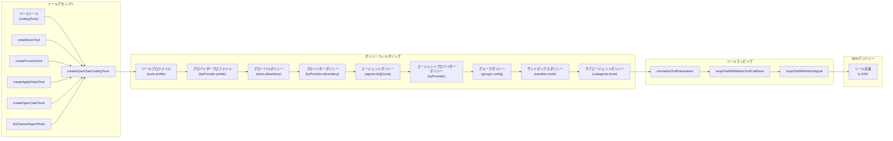
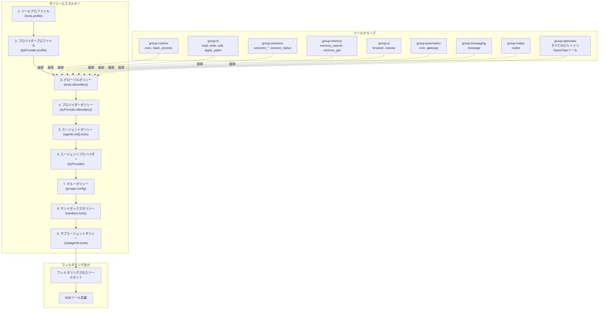
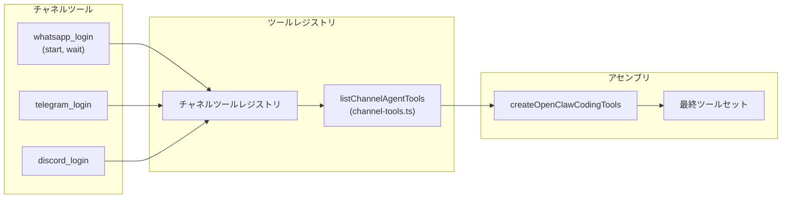

# ページ: ビルトインツール

# ビルトインツール

<details>
<summary>関連ソースファイル</summary>

このWikiページの生成に使用されたファイル：

- [docs/gateway/background-process.md](docs/gateway/background-process.md)
- [src/agents/bash-process-registry.test.ts](src/agents/bash-process-registry.test.ts)
- [src/agents/bash-process-registry.ts](src/agents/bash-process-registry.ts)
- [src/agents/bash-tools.ts](src/agents/bash-tools.ts)
- [src/agents/pi-embedded-helpers.ts](src/agents/pi-embedded-helpers.ts)
- [src/agents/pi-embedded-runner.test.ts](src/agents/pi-embedded-runner.test.ts)
- [src/agents/pi-embedded-runner.ts](src/agents/pi-embedded-runner.ts)
- [src/agents/pi-embedded-subscribe.ts](src/agents/pi-embedded-subscribe.ts)
- [src/agents/pi-tools.ts](src/agents/pi-tools.ts)

</details>


このページは、OpenClawエージェントが実行中に使用できるすべてのビルトインツールをカタログ化しています。ビルトインツールはコアコードベースで定義され、プラグインのインストールなしで利用可能です。ツールのセキュリティポリシーとサンドボックスについては、[ツールのセキュリティとサンドボックス](#6.2)を参照してください。再利用可能なツールガイダンスのパッケージ化については、[スキルシステム](#6.3)を参照してください。バックグラウンドプロセス実行の詳細については、[バックグラウンドプロセス実行](#6.4)を参照してください。

---

## 概要

ビルトインツールは[`createOpenClawCodingTools`](src/agents/pi-tools.ts:115-453)()によって作成され、複数のソースから構成されます：

- **ファイルシステムツール**: `pi-coding-agent`ライブラリからの`read`、`write`、`edit`、`apply_patch`
- **実行ツール**: [src/agents/bash-tools.ts]()からの`exec`、`process`
- **OpenClawツール**: [src/agents/openclaw-tools.ts]()からの`browser`、`canvas`、`nodes`、`cron`、`gateway`、`message`、`sessions_*`、`agents_list`、`memory_*`
- **チャネルツール**: [src/agents/channel-tools.ts]()からのプロバイダー固有のログイン/管理ツール

ツールはモデルプロバイダーに送られる前にポリシーヒエラルキーによってフィルタリングされます。各ツールはJSONスキーマパラメータを持つ構造化関数定義です。

---

## ツールカテゴリ

```mermaid
graph TB
    subgraph "ツールアセンブリ"
        createTools["createOpenClawCodingTools<br/>(pi-tools.ts:115)"]
    end

    subgraph "コアライブラリ"
        piCoding["pi-coding-agent<br/>codingTools"]
        bashTools["bash-tools.ts<br/>createExecTool<br/>createProcessTool"]
        openclawTools["openclaw-tools.ts<br/>createOpenClawTools"]
        channelTools["channel-tools.ts<br/>listChannelAgentTools"]
    end

    subgraph "ファイルシステムツール"
        read["read"]
        write["write"]
        edit["edit"]
        applyPatch["apply_patch"]
    end

    subgraph "実行ツール"
        exec["exec"]
        process["process"]
    end

    subgraph "Web & UI ツール"
        webSearch["web_search"]
        webFetch["web_fetch"]
        browser["browser"]
        canvas["canvas"]
    end

    subgraph "インフラストラクチャツール"
        nodes["nodes"]
        cron["cron"]
        gateway["gateway"]
        image["image"]
    end

    subgraph "通信ツール"
        message["message"]
        sessionsList["sessions_list"]
        sessionsHistory["sessions_history"]
        sessionsSend["sessions_send"]
        sessionsSpawn["sessions_spawn"]
        sessionStatus["session_status"]
        agentsList["agents_list"]
    end

    subgraph "メモリツール"
        memorySearch["memory_search"]
        memoryGet["memory_get"]
    end

    piCoding --> createTools
    bashTools --> createTools
    openclawTools --> createTools
    channelTools --> createTools

    createTools --> read
    createTools --> write
    createTools --> edit
    createTools --> applyPatch
    createTools --> exec
    createTools --> process
    createTools --> webSearch
    createTools --> webFetch
    createTools --> browser
    createTools --> canvas
    createTools --> nodes
    createTools --> cron
    createTools --> gateway
    createTools --> image
    createTools --> message
    createTools --> sessionsList
    createTools --> sessionsHistory
    createTools --> sessionsSend
    createTools --> sessionsSpawn
    createTools --> sessionStatus
    createTools --> agentsList
    createTools --> memorySearch
    createTools --> memoryGet
```



**ソース:** [src/agents/pi-tools.ts:115-453](), [src/agents/bash-tools.ts](), [src/agents/openclaw-tools.ts](), [docs/tools/index.md:179-513]()

---

## ツール作成パイプライン



**ソース:** [src/agents/pi-tools.ts:167-453]()

---

## ファイルシステムツール

### read

ファイルの内容を読み取るかディレクトリエントリを一覧表示します。部分的な読み取りにはoffset/limitがサポートされています。

**パラメータ**:
- `path` (必須): ワークスペースからの相対ファイルまたはディレクトリパス
- `offset` (オプション): 部分的読み取りのための文字オフセット
- `limit` (オプション): 読み取る最大文字数

**サンドボックス化**:
- サンドボックス化された場合: サンドボックスワークスペース（`/workspace`または`/sandbox`）から読み取る
- ホスト: エージェントワークスペースディレクトリから読み取る
- 作成者: [`createReadTool`](src/agents/pi-tools.ts:250)()または[`createSandboxedReadTool`](src/agents/pi-tools.ts:247)()

**ソース:** [src/agents/pi-tools.ts:245-252](), [src/agents/pi-tools.read.ts]()

---

### write

コンテンツをファイルに書き込み、必要に応じて親ディレクトリを作成します。

**パラメータ**:
- `path` (必須): ワークスペースからの相対ファイルパス
- `content` (必須): 書き込むテキストコンテンツ

**サンドボックス化**:
- `workspaceAccess: "ro"`または`"none"`のサンドボックスでは利用不可
- 作成者: [`createWriteTool`](src/agents/pi-tools.ts:262)()または[`createSandboxedWriteTool`](src/agents/pi-tools.ts:318)()

**ソース:** [src/agents/pi-tools.ts:256-263](), [docs/tools/index.md]()

---

### edit

検索置換ブロックを使用してターゲット編集を実行します。

**パラメータ**:
- `path` (必須): ワークスペースからの相対ファイルパス
- `edits` (必須): `{search, replace}`ブロックの配列
- `dryRun` (オプション): 変更を適用せずにプレビュー

**サンドボックス化**:
- `workspaceAccess: "ro"`または`"none"`のサンドボックスでは利用不可
- 作成者: [`createEditTool`](src/agents/pi-tools.ts:270)()または[`createSandboxedEditTool`](src/agents/pi-tools.ts:317)()

**ソース:** [src/agents/pi-tools.ts:265-271](), [docs/tools/index.md]()

---

### apply_patch

複数ファイルにわたって構造化パッチを適用します。マルチハンク編集の実験的機能です。

**パラメータ**:
- `patches` (必須): ハンクを持つファイルパッチの配列
- `dryRun` (オプション): 変更を適用せずにプレビュー

**設定**:
- `tools.exec.applyPatch.enabled`で有効化
- OpenAIモデルのみ（[`isOpenAIProvider`](src/agents/pi-tools.ts:56)()と[`isApplyPatchAllowedForModel`](src/agents/pi-tools.ts:61)()で強制）
- `workspaceAccess: "ro"`または`"none"`のサンドボックスでは利用不可

**ソース:** [src/agents/pi-tools.ts:237-243](), [src/agents/apply-patch.ts](), [docs/tools/index.md:180-183]()

---

## 実行ツール

### exec

ワークスペースまたはサンドボックスでシェルコマンドを実行します。

**コアパラメータ**:
| パラメータ | 型 | 説明 |
|-----------|------|-------------|
| `command` | string (必須) | 実行するシェルコマンド |
| `yieldMs` | number | 自動バックグラウンドタイムアウト（デフォルト10000） |
| `background` | boolean | 即時バックグラウンド実行 |
| `timeout` | number | キルタイムアウト（秒、デフォルト1800） |
| `elevated` | boolean | エベレーテッドモード有効の場合はホストで実行 |
| `host` | string | 実行先: `sandbox`、`gateway`、`node` |
| `security` | string | セキュリティモード: `deny`、`allowlist`、`full` |
| `ask` | string | 承認モード: `off`、`on-miss`、`always` |
| `node` | string | `host=node`のためのノードID/名前 |
| `pty` | boolean | 偽TTYを割り当てる |

**戻り値**:
- 同期: `{status: "completed", exitCode, stdout, stderr}`
- バックグラウンド化: `{status: "running", sessionId}`（`process`ツールが必要）

**設定**:
- [src/config/zod-schema.agent-runtime.ts]の`tools.exec.*`からのデフォルト
- `tools.elevated.enabled`と`tools.elevated.allowFrom`でエベレーテッドがゲートされる

**ソース:** [src/agents/bash-tools.exec.ts](), [src/agents/pi-tools.ts:275-302](), [docs/tools/index.md:185-210]()

---

### process

`yieldMs`または`background: true`で開始されたバックグラウンドexecセッションを管理します。

**アクション**:

| アクション | パラメータ | 説明 |
|-----------|------------|-------------|
| `list` | なし | すべてのバックグラウンドセッションを一覧表示 |
| `poll` | `sessionId` | 最後のポーリング以降の新しい出力を取得 |
| `log` | `sessionId`, `offset?`, `limit?` | ログ行を取得（offsetなしでtail） |
| `write` | `sessionId`, `data` | stdinに書き込む |
| `kill` | `sessionId`, `signal?` | シグナルを送信（デフォルトSIGTERM） |
| `clear` | `sessionId` | 完了したセッションを削除 |
| `remove` | `sessionId` | `clear`のエイリアス |

**スコーピング**:
- セッションごとにエージェントごとにスコープされる（`scopeKey: "agent:{agentId}"`で）
- エージェント間またはセッション間では共有されない

**ソース:** [src/agents/bash-tools.process.ts](), [src/agents/pi-tools.ts:303-306](), [docs/tools/index.md:212-224]()

---

## Webツール

### web_search

Brave Search APIを使用してWebを検索します。

**パラメータ**:
- `query` (必須): 検索クエリ文字列
- `count` (オプション): 返す結果数（1-10、`tools.web.search.maxResults`からデフォルト）

**設定**:
- `tools.web.search.enabled`で有効化
- `BRAVE_API_KEY`環境変数が必要
- レスポンスはキャッシュされる（デフォルト15分）

**ソース:** [docs/tools/index.md:226-240]()

---

### web_fetch

URLからコンテンツを取得し、読み取り可能なコンテンツを抽出します（HTML → markdown/text）。

**パラメータ**:
- `url` (必須): ターゲットURL
- `extractMode` (オプション): `markdown`または`text`
- `maxChars` (オプション): 長いページを切り詰める（`tools.web.fetch.maxCharsCap`でクランプ）

**設定**:
- `tools.web.fetch.enabled`で有効化
- デフォルト`maxCharsCap: 50000`
- レスポンスはキャッシュされる（デフォルト15分）

**ソース:** [docs/tools/index.md:242-260]()

---

## ブラウザツール

`browser`ツールは、複数プロファイルサポート付きの専用OpenClaw管理ブラウザインスタンスを制御します。

```mermaid
graph TB
    subgraph "ブラウザプロファイル"
        defaultProfile["デフォルトプロファイル<br/>(browser.defaultProfile)"]
        profile1["プロファイル: chrome<br/>(CDPポート 18800)"]
        profile2["プロファイル: dev<br/>(CDPポート 18801)"]
        profile3["カスタムプロファイル<br/>(cdpUrl)"]
    end

    subgraph "ブラウザアクション"
        lifecycle["ライフサイクル<br/>status, start, stop"]
        tabs["タブ管理<br/>tabs, open, focus, close"]
        snapshot["スナップショット<br/>aria, ai"]
        screenshot["スクリーンショット<br/>MEDIA:pathを返す"]
        navigate["ナビゲーション<br/>navigate, console, pdf"]
        upload["ファイルアップロード<br/>upload (ref/inputRef/element)"]
        dialog["ダイアログ処理<br/>dialog (accept/promptText)"]
        act["UIアクション<br/>act (click/type/press/hover/drag/select/fill/resize/wait/evaluate)"]
    end

    subgraph "プロファイル管理"
        profiles["profiles<br/>(すべてを一覧表示)"]
        createProfile["create-profile<br/>(自動ポート割り当て)"]
        deleteProfile["delete-profile<br/>(停止 + データ削除)"]
        resetProfile["reset-profile<br/>(孤児プロセスをキル)"]
    end

    subgraph "ターゲット選択"
        targetSandbox["target: sandbox<br/>(サンドボックス化されたブラウザ)"]
        targetHost["target: host<br/>(ホストブラウザ)"]
        targetNode["target: node<br/>(ノードブラウザ)"]
    end

    defaultProfile --> profile1
    defaultProfile --> profile2
    defaultProfile --> profile3

    lifecycle --> targetSandbox
    tabs --> targetSandbox
    snapshot --> targetSandbox
    screenshot --> targetSandbox
    navigate --> targetSandbox
    upload --> targetSandbox
    dialog --> targetSandbox
    act --> targetSandbox

    lifecycle --> targetHost
    tabs --> targetHost
    snapshot --> targetHost
    screenshot --> targetHost
    navigate --> targetHost
    upload --> targetHost
    dialog --> targetHost
    act --> targetHost

    lifecycle --> targetNode
    tabs --> targetNode
    snapshot --> targetNode
    screenshot --> targetNode
    navigate --> targetNode
    upload --> targetNode
    dialog --> targetNode
    act --> targetNode

    profiles --> createProfile
    createProfile --> deleteProfile
    deleteProfile --> resetProfile
```



### ブラウザコアクション

| アクション | パラメータ | 説明 |
|-----------|------------|-------------|
| `status` | `profile?` | ブラウザの状態を確認 |
| `start` | `profile?` | ブラウザインスタンスを起動 |
| `stop` | `profile?` | ブラウザインスタンスを停止 |
| `tabs` | `profile?` | 開いているタブを一覧表示 |
| `open` | `targetUrl`, `profile?` | 新しいタブを開く |
| `focus` | `targetId`, `profile?` | タブに切り替える |
| `close` | `targetId`, `profile?` | タブを閉じる |
| `snapshot` | `targetId?`, `format?`, `profile?` | ページスナップショットを取得（aria/ai） |
| `screenshot` | `targetId?`, `profile?` | スクリーンショットを撮影 |
| `navigate` | `targetUrl`, `targetId?`, `profile?` | タブをナビゲート |
| `console` | `targetId?`, `level?`, `profile?` | コンソールログを取得 |
| `pdf` | `targetId?`, `profile?` | ページをPDFとしてエクスポート |
| `upload` | `paths`, `ref?`, `inputRef?`, `element?`, `profile?` | ファイルをアップロード |
| `dialog` | `accept?`, `promptText?`, `profile?` | ダイアログを処理 |
| `act` | `request`, `profile?` | UIアクションを実行 |

### ブラウザプロファイル管理

| アクション | パラメータ | 説明 |
|-----------|------------|-------------|
| `profiles` | なし | ステータス付きですべてのプロファイルを一覧表示 |
| `create-profile` | `name`, `cdpPort?`, `cdpUrl?`, `driver?`, `color?` | 新しいプロファイルを作成 |
| `delete-profile` | `name` | ブラウザを停止、データを削除、設定から削除 |
| `reset-profile` | `name` | プロファイルのポートで孤児プロセスをキル |

**共通パラメータ**:
- `profile` (オプション): プロファイル名（デフォルトは`browser.defaultProfile`）
- `target` (オプション): `sandbox`、`host`、または`node`
- `node` (オプション): `target=node`のための特定のノードID/名前

**設定**:
- `browser.enabled`で有効化（デフォルト`true`）
- プロファイル名: 小文字の英数字 + ハイフン（最大64文字）
- ポート範囲: 18800-18899（約100プロファイル最大）
- リモートプロファイルはattach-only（start/stop/resetなし）

**スナップショット形式**:
- `ai`: AIフレンドリーなスナップショット（Playwrightが必要）、`12`のようなrefを返す
- `aria`: アクセシビリティツリースナップショット、`e12`のようなrefを返す
- ロールスナップショットオプション: `interactive`、`compact`、`depth`、`selector`

**アクションリクエスト**:
- `click`、`type`、`press`、`hover`、`drag`、`select`、`fill`、`resize`、`wait`、`evaluate`
- スナップショットからの`ref`が必要（数値または`e`プレフィックス）
- CSSセレクタが必要な場合のみ`evaluate`を使用（稀）

**ソース:** [docs/tools/index.md:262-298](), [src/agents/openclaw-tools.ts]()

---

## Canvasツール

`canvas`ツールは、プレゼンテーション、評価、A2UIレンダリングのためのノードCanvasを駆動します。

**アクション**:

| アクション | パラメータ | 説明 |
|-----------|------------|-------------|
| `present` | `target`, `node?`, `nodeId?` | コンテンツをプレゼンテーション |
| `hide` | `node?`, `nodeId?` | canvasを非表示 |
| `navigate` | `url`, `node?`, `nodeId?` | URLにナビゲート |
| `eval` | `javaScript`, `node?`, `nodeId?` | JavaScriptを評価 |
| `snapshot` | `format?`, `node?`, `nodeId?` | スナップショットを取得（`MEDIA:path`を返す） |
| `a2ui_push` | `text?`, `jsonlPath?`, `node?`, `nodeId?` | A2UIコンテンツをプッシュ |
| `a2ui_reset` | `node?`, `nodeId?` | A2UI状態をリセット |

**設定**:
- ゲートウェイRPCを介して`node.invoke`を使用
- 単一接続ノードまたはローカルmacノードが省略された場合、自動的にノードを選択
- A2UIはv0.8のみ（`createSurface`なし）

**ソース:** [docs/tools/index.md:300-315](), [src/agents/openclaw-tools.ts]()

---

## ノードツール

`nodes`ツールはペアリングされたノードを検出し、通知を送信し、カメラ/スクリーンをキャプチャします。

**アクション**:

| アクション | パラメータ | 説明 |
|-----------|------------|-------------|
| `status` | なし | ペアリングされたノードを一覧表示 |
| `describe` | `node`, `nodeId?` | ノード機能を取得 |
| `pending` | なし | 保留中のペアリングリクエストを一覧表示 |
| `approve` | `requestId` | ペアリングリクエストを承認 |
| `reject` | `requestId` | ペアリングリクエストを拒否 |
| `notify` | `node`, `title`, `body`, `subtitle?` | システム通知を送信 |
| `run` | `node`, `command`, `cwd?`, `env?`, `commandTimeoutMs?`, `invokeTimeoutMs?`, `needsScreenRecording?` | コマンドを実行 |
| `camera_snap` | `node`, `facing?`, `deviceId?` | 写真を撮影 |
| `camera_clip` | `node`, `facing?`, `duration?`, `durationMs?`, `deviceId?` | 動画を録画 |
| `screen_record` | `node`, `duration?`, `durationMs?`, `fps?`, `screenIndex?` | スクリーンを録画 |
| `location_get` | `node` | デバイス位置を取得 |

**戻り値の型**:
- カメラ/スクリーン: 画像ブロック + `MEDIA:<path>`または`FILE:<path>`（mp4）を返す
- 位置: `lat`、`lon`、`accuracy`、`timestamp`を持つJSONペイロード

**実行コマンド例**:
```json
{
  "action": "run",
  "node": "office-mac",
  "command": ["echo", "Hello"],
  "env": ["FOO=bar"],
  "commandTimeoutMs": 12000,
  "invokeTimeoutMs": 45000,
  "needsScreenRecording": false
}
```

**ソース:** [docs/tools/index.md:317-350](), [src/agents/openclaw-tools.ts]()

---

## イメージツール

構成されたイメージモデルを使用して画像を分析します。

**パラメータ**:
- `image` (必須): 画像へのパスまたはURL
- `prompt` (オプション): 分析プロンプト（デフォルト: "Describe the image."）
- `model` (オプション): イメージモデルを上書き
- `maxBytesMb` (オプション): メガバイト単位のサイズ制限

**設定**:
- `agents.defaults.imageModel`が構成されている場合のみ利用可能
- チャットモデルから独立してイメージモデルを直接使用
- デフォルトモデル + 構成された認証からイメージモデルを自動推論（ベストエフォート）

**ソース:** [docs/tools/index.md:352-366](), [src/agents/openclaw-tools.ts]()

---

## メッセージツール

Discord、Google Chat、Slack、Telegram、WhatsApp、Signal、iMessage、MS Teamsを横断してメッセージを送信し、チャネルアクションを実行します。

**コアクション**:

| アクション | チャネル | パラメータ |
|-----------|----------|------------|
| `send` | すべて | `to`, `content`, `card?` (Teams) |
| `poll` | WhatsApp, Discord, Teams | `question`, `options`, `to` |
| `react` | すべて | `channelId`, `messageId`, `emoji` |
| `reactions` | すべて | `channelId`, `messageId` |
| `read` | すべて | `channelId`, `messageId` |
| `edit` | すべて | `channelId`, `messageId`, `content` |
| `delete` | すべて | `channelId`, `messageId` |
| `pin` | すべて | `channelId`, `messageId` |
| `unpin` | すべて | `channelId`, `messageId` |
| `list-pins` | すべて | `channelId` |
| `permissions` | Discord, Slack | `channelId` |
| `thread-create` | Discord, Slack | `channelId`, `name` |
| `thread-list` | Discord, Slack | `guildId?`, `channelId?` |
| `thread-reply` | Discord, Slack | `channelId`, `content` |
| `search` | Discord, Slack | `query`, `guildId?` |
| `sticker` | Discord | `to`, `stickerIds` |
| `member-info` | Discord, Slack | `userId`, `guildId?` |
| `role-info` | Discord | `guildId` |
| `emoji-list` | Discord, Slack | `guildId?` |
| `emoji-upload` | Discord | `guildId`, `name`, `image` |
| `sticker-upload` | Discord | `guildId`, `name`, `file`, `description?` |
| `role-add` | Discord | `guildId`, `userId`, `roleId` |
| `role-remove` | Discord | `guildId`, `userId`, `roleId` |
| `channel-info` | Discord | `channelId` |
| `channel-list` | Discord | `guildId` |
| `voice-status` | Discord | `guildId`, `userId` |
| `event-list` | Discord | `guildId` |
| `event-create` | Discord | `guildId`, `name`, `scheduledStartTime` |
| `timeout` | Discord | `guildId`, `userId`, `durationSeconds` |
| `kick` | Discord | `guildId`, `userId` |
| `ban` | Discord | `guildId`, `userId` |

**ルーティング**:
- WhatsApp: Gateway経由でルーティング
- MS Teams: Gateway経由でポール、他のアクションは直接
- Discord、Slack、Telegram、Signal、iMessage: 直接
- アクティブなチャットセッションにバインドされている場合、セッションターゲットに制限して送信

**アクションベート**:
- チャネルごとのアクショングループは設定可能（例: `channels.discord.actions.reactions: false`）

**ソース:** [docs/tools/index.md:368-389](), [src/agents/openclaw-tools.ts](), [skills/slack/SKILL.md]()

---

## Cronツール

Gateway cronジョブとウェイクアップを管理します。

**アクション**:

| アクション | パラメータ | 説明 |
|-----------|------------|-------------|
| `status` | なし | cronシステムの状態を取得 |
| `list` | `limit?` | ジョブを一覧表示 |
| `add` | `job` | 新しいジョブを追加（完全なジョブオブジェクト） |
| `update` | `id`, `patch` | 既存ジョブを更新 |
| `remove` | `id` | ジョブを削除 |
| `run` | `id` | 即時実行をトリガー |
| `runs` | `id`, `limit?` | 実行履歴を取得 |
| `wake` | `text?`, `mode?`, `immediate?` | システムイベントをキューに追加 + オプショナルなハートビート |

**設定**:
- `cron.enabled`で有効化
- ジョブストアは`cron.store`（デフォルト`~/.openclaw/cron-jobs.json`）
- 最大同時実行数: `cron.maxConcurrentRuns`

**ソース:** [docs/tools/index.md:391-409](), [src/agents/openclaw-tools.ts]()

---

## Gatewayツール

実行中のGatewayプロセスを再起動または更新を適用します。

**アクション**:

| アクション | パラメータ | 説明 |
|-----------|------------|-------------|
| `restart` | `reason?`, `delayMs?` | Gatewayをその場で再起動 |
| `config.get` | なし | 現在の設定を取得 |
| `config.schema` | なし | 設定JSONスキーマを取得 |
| `config.apply` | `raw`, `baseHash`, `sessionKey?`, `note?`, `restartDelayMs?` | 検証 + 設定を書き込み + 再起動 |
| `config.patch` | `raw`, `baseHash`, `sessionKey?`, `note?`, `restartDelayMs?` | 部分更新をマージ + 再起動 |
| `update.run` | `sessionKey?`, `restartDelayMs?` | 更新を実行 + 再起動 |

**設定**:
- `restart`はデフォルトで無効; `commands.restart: true`で有効化
- デフォルト`delayMs: 2000`で、実行中の返信を中断しないようにする

**ソース:** [docs/tools/index.md:411-426](), [src/agents/openclaw-tools.ts]()

---

## セッションツール

エージェントセッション間で管理および通信するためのツール。

### sessions_list

オプションのメッセージ履歴付きでアクティブなセッションを一覧表示します。

**パラメータ**:
- `kinds` (オプション): セッション種別の配列でフィルタ
- `limit` (オプション): 返す最大セッション数
- `activeMinutes` (オプション): 直前のN分以内のアクティブなセッションのみ
- `messageLimit` (オプション): セッションごとの最後のNメッセージを含める（0 = なし）

**ソース:** [docs/tools/index.md:428-459](), [src/agents/openclaw-tools.ts]()

---

### sessions_history

特定のセッションのトランスクリプト履歴を取得します。

**パラメータ**:
- `sessionKey`または`sessionId` (必須): ターゲットセッション
- `limit` (オプション): 返す最大ターン数
- `includeTools` (オプション): ツール呼び出しの詳細を含む

**ソース:** [docs/tools/index.md:428-459](), [src/agents/openclaw-tools.ts]()

---

### sessions_send

メッセージを別のセッションに送信し、オプションで完了を待機します。

**パラメータ**:
- `sessionKey`または`sessionId` (必須): ターゲットセッション
- `message` (必須): メッセージコンテンツ
- `timeoutSeconds` (オプション): 待機タイムアウト（0 = ファイアアンドフォーゲット）

**動作**:
- `timeoutSeconds > 0`の場合: エージェント完了を待機
- 返信ピンポン: ターゲットは`REPLY_SKIP`で返信して停止（`session.agentToAgent.maxPingPongTurns`による最大ターン）
- アナウンスステップ: ターゲットはピンポン後にアナウンスを実行; `ANNOUNCE_SKIP`で抑制
- エージェント実行が完了したら`{status: "ok"}`を返す（配信確認ではない）

**ソース:** [docs/tools/index.md:428-459](), [src/agents/openclaw-tools.ts]()

---

### sessions_spawn

サブエージェント実行を開始し、リクエスターにアナウンス返信を投稿します。

**パラメータ**:
- `task` (必須): サブエージェントのためのタスク説明
- `label` (オプション): セッションラベル
- `agentId` (オプション): ターゲットエージェント（デフォルト: 同じエージェント）
- `model` (オプション): モデルを上書き
- `runTimeoutSeconds` (オプション): 実行タイムアウト
- `cleanup` (オプション): 自動クリーンアップモード

**動作**:
- 非ブロッキング: 即時に`{status: "accepted"}`を返す
- サブエージェントは完了後にアナウンスステップを実行
- 許可リストでゲート: `agents.list[].subagents.allowAgents`（デフォルト: 同じエージェントのみ）

**ソース:** [docs/tools/index.md:428-459](), [src/agents/openclaw-tools.ts]()

---

### session_status

現在のセッションの状態を取得または更新します。

**パラメータ**:
- `sessionKey` (オプション): ターゲットセッション（デフォルト: 現在）
- `sessionId` (オプション): 代替セッション識別子
- `model` (オプション): モデルを上書き（`"default"`はクリア）

**ソース:** [docs/tools/index.md:428-459](), [src/agents/openclaw-tools.ts]()

---

## エージェントツール

### agents_list

`sessions_spawn`で現在のセッションがターゲットにできるエージェントIDを一覧表示します。

**パラメータ**: なし

**戻り値**:
- `agents`: 利用可能なエージェントIDの配列
- `allowAny`: `["*"]`が設定されている場合`true`

**フィルタリング**:
- `agents.list[].subagents.allowAgents`によって制限される
- デフォルト: 同じエージェントのみ許可

**ソース:** [docs/tools/index.md:451-458](), [src/agents/openclaw-tools.ts]()

---

## メモリツール

### memory_search

ハイブリッド検索（ベクトル + BM25）を使用してメモリを検索します。

**パラメータ**:
- `query` (必須): 検索クエリ
- `count` (オプション): 最大結果数
- `scope` (オプション): スコープフィルタ

**設定**:
- バックエンド: `memory.backend`（`builtin`または`qmd`）
- 引用: `memory.citations`（`auto`、`on`、`off`）

**ソース:** [docs/tools/index.md](), [src/agents/openclaw-tools.ts]()

---

### memory_get

特定のメモリドキュメントを取得します。

**パラメータ**:
- `ids` (必須): ドキュメントIDの配列
- `scope` (オプション): スコープフィルタ

**ソース:** [docs/tools/index.md](), [src/agents/openclaw-tools.ts]()

---

## ツールポリシー適用



**フィルタ実装**:

1. **プロファイルフィルタ**: [`resolveToolProfilePolicy`](src/agents/tool-policy.ts)()を介して最初に適用
2. **プラグイン展開**: ツールグループは[`expandPolicyWithPluginGroups`](src/agents/pi-tools.ts:385-407)()を介して展開
3. **逐次フィルタリング**: 各ポリシーレベルが[`filterToolsByPolicy`](src/agents/pi-tools.policy.ts)()を呼び出す
4. **正規化**: ツールは[`normalizeToolParameters`](src/agents/pi-tools.ts:438)()を介して正規化

**ソース:** [src/agents/pi-tools.ts:167-453](), [src/agents/pi-tools.policy.ts](), [src/agents/tool-policy.ts]()

---

## ツールラッピングとライフサイクル

```mermaid
graph LR
    subgraph "ツール作成"
        create["createOpenClawCodingTools"]
        rawTools["生のツール定義"]
    end

    subgraph "ポリシーフィルタリング"
        filter["filterToolsByPolicy<br/>(9レベル)"]
        filtered["フィルタリングされたツール"]
    end

    subgraph "スキーマ正規化"
        normalize["normalizeToolParameters<br/>(pi-tools.schema.ts)"]
        normalized["正規化されたスキーマ"]
    end

    subgraph "フックラッピング"
        hooks["wrapToolWithBeforeToolCallHook<br/>(pi-tools.before-tool-call.ts)"]
        hooked["フックされたツール"]
    end

    subgraph "中止ラッピング"
        abort["wrapToolWithAbortSignal<br/>(pi-tools.abort.ts)"]
        final["最終ツールセット"]
    end

    subgraph "SDKデリバリー"
        sdk["pi-ai SDK<br/>ツール定義"]
        invoke["ツール呼び出し<br/>エージェント実行中"]
    end

    create --> rawTools
    rawTools --> filter
    filter --> filtered
    filtered --> normalize
    normalize --> normalized
    normalized --> hooks
    hooks --> hooked
    hooked --> abort
    abort --> final
    final --> sdk
    sdk --> invoke
```



**ラッピング関数**:

1. **パラメータ正規化**: [`wrapToolParamNormalization`](src/agents/pi-tools.read.ts:42)()はClaude Code互換性用
2. **ツール呼び出し前フック**: [`wrapToolWithBeforeToolCallHook`](src/agents/pi-tools.before-tool-call.ts)()はログとメトリクス用
3. **中止シグナル**: [`wrapToolWithAbortSignal`](src/agents/pi-tools.abort.ts)()はキャンセルサポート用

**ソース:** [src/agents/pi-tools.ts:439-448](), [src/agents/pi-tools.abort.ts](), [src/agents/pi-tools.before-tool-call.ts](), [src/agents/pi-tools.schema.ts]()

---

## ツールスキーマ正規化

ツールはモデルプロバイダーへの配信前にスキーマ変換を受けます：

1. **パラメータ正規化**: [`normalizeToolParameters`](src/agents/pi-tools.schema.ts)()はユニオンスキーマを平坦化
2. **Claude互換性**: [`patchToolSchemaForClaudeCompatibility`](src/agents/pi-tools.read.ts)()はパラメータグループを処理
3. **Geminiクリーンアップ**: [`cleanToolSchemaForGemini`](src/agents/pi-tools.schema.ts)()はサポートされていない構造を削除

**プロバイダーのクセ**:

- **OpenAI**: ルートレベルのユニオンスキーマを拒否（正規化で除去）
- **Claude OAuth**: 特定のツール名をブロック（`pi-ai`トランスポートで処理）
- **Gemini**: 複雑なタイプにはスキーマクリーンアップが必要

**ソース:** [src/agents/pi-tools.ts:107-113](), [src/agents/pi-tools.schema.ts](), [src/agents/pi-tools.read.ts]()

---

## チャネル固有のツール

チャネルプラグインはログインと管理のための追加エージェントツールを登録します：



**実装**:

- [`registerChannelAgentTools`](src/agents/channel-tools.ts)()を介して登録
- [`listChannelAgentTools`](src/agents/channel-tools.ts)()で一覧表示
- [src/agents/pi-tools.ts:325]でツールアセンブリに含まれる

**ソース:** [src/agents/channel-tools.ts](), [src/agents/pi-tools.ts:325](), [ui/src/ui/tool-display.json:175-181]()

---

## ツール表示メタデータ

Control UIはレンダリングのためにツール表示メタデータを使用します：

**設定**: [ui/src/ui/tool-display.json]()

**構造**:
```typescript
{
  version: number
  fallback: { icon, detailKeys }
  tools: {
    [toolName]: {
      icon: IconName
      title: string
      actions: {
        [action]: {
          label: string
          detailKeys: string[]
        }
      }
    }
  }
}
```

**例**:
```json
{
  "browser": {
    "icon": "globe",
    "title": "ブラウザ",
    "actions": {
      "snapshot": {
        "label": "snapshot",
        "detailKeys": ["targetUrl", "targetId", "ref", "format"]
      }
    }
  }
}
```

**表示解決**:

1. `tools`マップでツールを検索
2. ツールパラメータから`action`を抽出
3. アクション固有のメタデータを解決
4. `detailKeys`から詳細文字列をフォーマット
5. ホームディレクトリの短縮を適用

**ソース:** [ui/src/ui/tool-display.json](), [ui/src/ui/tool-display.ts:159-207]()