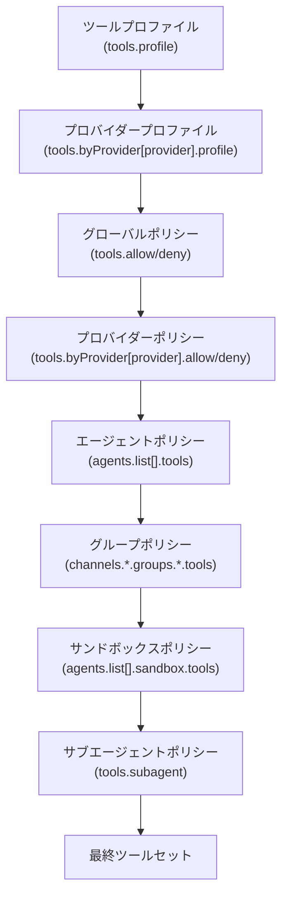
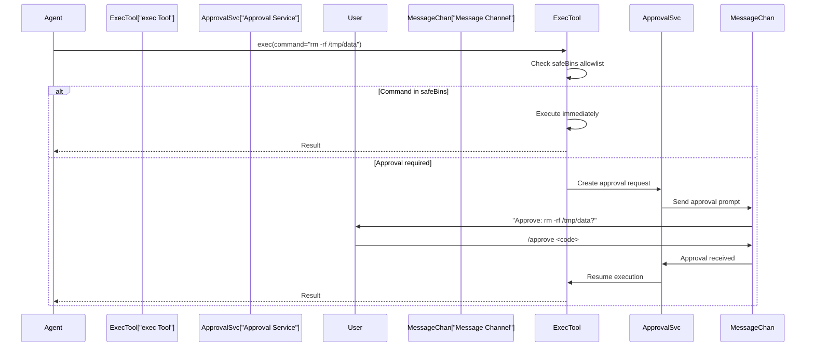
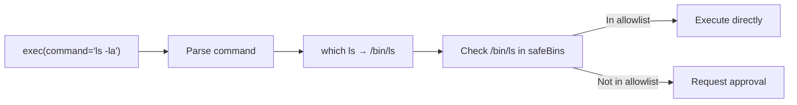
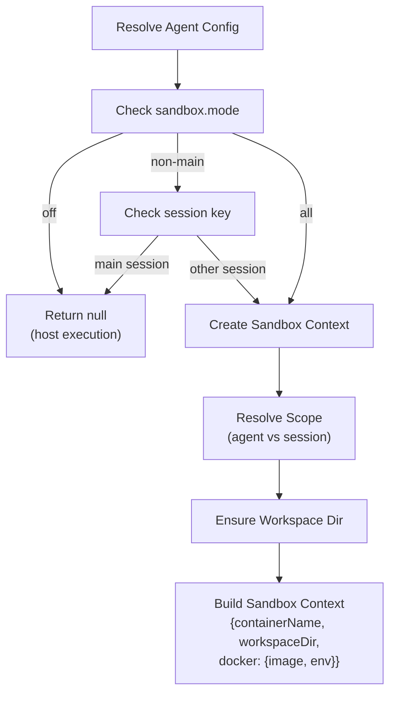

# ページ: ツールのセキュリティとサンドボックス

# ツールのセキュリティとサンドボックス

<details>
<summary>関連ソースファイル</summary>

この Wiki ページ生成のために使用されたファイル：

- [CHANGELOG.md](CHANGELOG.md)
- [docs/cli/memory.md](docs/cli/memory.md)
- [docs/cli/sandbox.md](docs/cli/sandbox.md)
- [docs/concepts/memory.md](docs/concepts/memory.md)
- [docs/gateway/configuration.md](docs/gateway/configuration.md)
- [docs/gateway/doctor.md](docs/gateway/doctor.md)
- [docs/gateway/sandbox-vs-tool-policy-vs-elevated.md](docs/gateway/sandbox-vs-tool-policy-vs-elevated.md)
- [docs/gateway/sandboxing.md](docs/gateway/sandboxing.md)
- [docs/platforms/mac/skills.md](docs/platforms/mac/skills.md)
- [docs/tools/elevated.md](docs/tools/elevated.md)
- [docs/tools/index.md](docs/tools/index.md)
- [docs/tools/skills-config.md](docs/tools/skills-config.md)
- [src/agents/bash-tools.test.ts](src/agents/bash-tools.test.ts)
- [src/agents/memory-search.test.ts](src/agents/memory-search.test.ts)
- [src/agents/memory-search.ts](src/agents/memory-search.ts)
- [src/agents/pi-tools-agent-config.test.ts](src/agents/pi-tools-agent-config.test.ts)
- [src/agents/sandbox-explain.test.ts](src/agents/sandbox-explain.test.ts)
- [src/agents/sandbox-skills.test.ts](src/agents/sandbox-skills.test.ts)
- [src/agents/sandbox.ts](src/agents/sandbox.ts)
- [src/cli/memory-cli.test.ts](src/cli/memory-cli.test.ts)
- [src/cli/memory-cli.ts](src/cli/memory-cli.ts)
- [src/cli/models-cli.test.ts](src/cli/models-cli.test.ts)
- [src/commands/configure.gateway.test.ts](src/commands/configure.gateway.test.ts)
- [src/commands/configure.gateway.ts](src/commands/configure.gateway.ts)
- [src/commands/configure.ts](src/commands/configure.ts)
- [src/commands/doctor.ts](src/commands/doctor.ts)
- [src/commands/onboard-helpers.test.ts](src/commands/onboard-helpers.test.ts)
- [src/commands/onboard-helpers.ts](src/commands/onboard-helpers.ts)
- [src/commands/onboard-interactive.ts](src/commands/onboard-interactive.ts)
- [src/config/merge-config.ts](src/config/merge-config.ts)
- [src/config/schema.ts](src/config/schema.ts)
- [src/config/types.tools.ts](src/config/types.tools.ts)
- [src/config/types.ts](src/config/types.ts)
- [src/config/zod-schema.agent-runtime.ts](src/config/zod-schema.agent-runtime.ts)
- [src/config/zod-schema.ts](src/config/zod-schema.ts)
- [src/memory/embeddings.test.ts](src/memory/embeddings.test.ts)
- [src/memory/embeddings.ts](src/memory/embeddings.ts)
- [src/memory/manager.ts](src/memory/manager.ts)
- [src/wizard/onboarding.gateway-config.test.ts](src/wizard/onboarding.gateway-config.test.ts)
- [src/wizard/onboarding.gateway-config.ts](src/wizard/onboarding.gateway-config.ts)
- [src/wizard/onboarding.ts](src/wizard/onboarding.ts)
- [src/wizard/onboarding.types.ts](src/wizard/onboarding.types.ts)

</details>


このページでは、OpenClaw のツールセキュリティモデルについて説明します。これにはツールポリシー（許可/拒否リストとプロファイル）、危険操作の承認ワークフロー、セーフなバイナリ、Docker サンドボックスの分離、セキュリティのベストプラクティスが含まれます。利用可能なツールとその使用方法については、[ビルトインツール](#6.1) を参照してください。ワークスペースレベルのスキル設定については、[スキルシステム](#6.3) を参照してください。

---

## 概要

OpenClaw は、エージェントが実行できるツールを制御するための複数のセキュリティ層を提供します：

1. **ツールポリシー** — プロファイルベースのデフォルトとエージェント/プロバイダーごとのオーバーライドを伴う許可/拒否リスト
2. **承認ワークフロー** — 危険なコマンドに対するユーザー承認プロンプト
3. **セーフなバイナリ** — 承認をバイパスする一般的なユーティリティの許可リスト
4. **Docker サンドボックス** — エージェントごとまたはセッションごとのコンテナ分離
5. **グループツールポリシー** — グループチャットでの送信者ごとの制限

---

## ツールポリシーシステム

### ポリシーの解決

ツールポリシーは優先順に解決されます（後のソースが前のものを上書き）：



**ソース:** [src/agents/pi-tools.ts:156-171](), [src/agents/pi-tools.policy.ts:1-250]()

### ツールプロファイル

ポリシーテンプレートとして機能するベースの許可リスト：

| プロファイル | 許可されるツールグループ |
|-------------|----------------------|
| `minimal` | `session_status` のみ |
| `coding` | `group:fs`, `group:runtime`, `group:sessions`, `group:memory`, `image` |
| `messaging` | `group:messaging`, `sessions_list`, `sessions_history`, `sessions_send`, `session_status` |
| `full` | すべてのツール（制限なし） |

グローバルまたはエージェントごとに設定：

```json5
{
  tools: { profile: "coding" },
  agents: {
    list: [
      {
        id: "support",
        tools: { profile: "messaging", allow: ["slack"] }
      }
    ]
  }
}
```

**ソース:** [src/agents/tool-policy.ts:45-70](), [docs/tools/index.md:30-74]()

### ツールグループ

一般的なツールセットのショートハンド展開：

| グループ | 展開先 |
|----------|--------|
| `group:runtime` | `exec`, `bash`, `process` |
| `group:fs` | `read`, `write`, `edit`, `apply_patch` |
| `group:sessions` | `sessions_list`, `sessions_history`, `sessions_send`, `sessions_spawn`, `session_status` |
| `group:memory` | `memory_search`, `memory_get` |
| `group:web` | `web_search`, `web_fetch` |
| `group:ui` | `browser`, `canvas` |
| `group:automation` | `cron`, `gateway` |
| `group:messaging` | `message` |
| `group:nodes` | `nodes` |

拒否の例：

```json5
{
  tools: {
    profile: "coding",
    deny: ["group:runtime"]  // exec, bash, process をブロック
  }
}
```

**ソース:** [src/agents/tool-policy.ts:72-106](), [docs/tools/index.md:130-154]()

### プロバイダー固有のポリシー

特定のモデルプロバイダーまたは `provider/model` 組み合わせに対するツール制限：

```json5
{
  tools: {
    profile: "coding",
    byProvider: {
      "google-antigravity": { profile: "minimal" },
      "openai/gpt-5.2": { allow: ["group:fs", "sessions_list"] }
    }
  }
}
```

プロバイダーポリシーは、ベースプロファイルの**後**に適用されますが、グローバル許可/拒否の**前**に適用されるため、ツールセットを縮小するのみです。

**ソース:** [docs/tools/index.md:76-128](), [src/agents/pi-tools.ts:156-171]()

---

## 承認ワークフロー

### exec ツール承認モード

`exec` ツールは `tools.exec.ask` により3つの承認モードをサポート：

| モード | 動作 |
|--------|------|
| `off` | 承認不要（`security` に基づきサンドボックス/ホストを使用） |
| `elevated` | セッションに elevated モードが有効の場合に承認が必要 |
| `always` | すべてのコマンドで承認が必要 |

セキュリティルーティングは `tools.exec.security` で制御：

| 値 | 動作 |
|--------|------|
| `host` | 常にゲートウェイホストで実行 |
| `sandbox` | 常にサンドボックス内で実行（有効な場合） |
| `ask` | コマンドごとにユーザーにホスト vs サンドボックスをプロンプト |

**ソース:** [src/agents/bash-tools.ts:1-10](), [docs/gateway/configuration.md:82-97]()

### 承認フロー



**ソース:** [src/agents/bash-tools.ts:250-280](), [CHANGELOG.md:149]()

### 承認コマンド

ユーザーは `/approve` コマンドで保留中のリクエストを承認します：

```bash
# 保留中の承認を一覧表示
openclaw approvals list

# コードで承認
openclaw approvals approve <code>

# またはチャット内で
/approve <code>
```

承認プロンプには以下が含まれます：
- 実行中のコマンド
- 作業ディレクトリ
- エージェントID
- セッションキー
- 有効期限（デフォルト5分）

**ソース:** [CHANGELOG.md:149-160](), [src/agents/bash-tools.ts:260-275]()

---

## セーフなバイナリ

### 概念

セーフなバイナリは、低リスクと見なされるため承認チェックをバイパスするコマンドです。`tools.exec.safeBins` で設定：

```json5
{
  tools: {
    exec: {
      ask: "elevated",
      safeBins: [
        "ls", "cat", "grep", "find", "head", "tail",
        "echo", "date", "pwd", "whoami", "uname"
      ]
    }
  }
}
```

### 解決

exec ツールは許可リストをチェックする前にバイナリパスを解決します：



複合コマンド（`ls | grep foo`）の場合、各セグメントが独立してチェックされます。いずれかのセグメントに承認が必要な場合、全体のコマンドに承認が必要です。

**ソース:** [src/agents/bash-tools.ts:85-89](), [CHANGELOG.md:18]()

### デフォルトのセーフなバイナリ

OpenClaw はデフォルトのセーフバイナリリストに一般的な読み取り専用ユーティリティを含めます：

- ファイル検査: `ls`, `cat`, `head`, `tail`, `less`, `more`, `file`
- テキスト処理: `grep`, `awk`, `sed`, `cut`, `sort`, `uniq`, `wc`
- システム情報: `pwd`, `whoami`, `uname`, `date`, `which`, `env`
- アーカイブ: `tar`, `zip`, `unzip`（読み取り操作のみ）

**ソース:** [src/agents/bash-tools.ts:85-89]()

---

## Docker サンドボックス分離

### サンドボックス設定

サンドボックスはエージェントの実行を Docker コンテナで分離します。グローバルまたはエージェントごとに設定：

```json5
{
  agents: {
    defaults: {
      sandbox: {
        mode: "non-main",      // off | non-main | all
        scope: "session",      // agent | session
        workspaceAccess: "rw", // ro | rw
        tools: {
          allow: ["read", "write", "exec", "sessions_list"],
          deny: ["browser", "canvas", "nodes", "cron"]
        }
      }
    }
  }
}
```

### サンドボックスモード

| モード | 動作 |
|--------|------|
| `off` | サンドボックスなし（すべてのセッションがホストで実行） |
| `non-main` | メイン以外のセッションをサンドボックス化（グループ、チャネル、サブエージェント） |
| `all` | メインを含むすべてのセッションをサンドボックス化 |

**ソース:** [src/agents/sandbox/config.ts:1-100](), [docs/gateway/sandboxing.md:1-50]()

### サンドボックススコープ

| スコープ | ライフタイム | ワークスペース |
|----------|-------------|---------------|
| `agent` | エージェントシャットダウンまで | 共有 `~/.openclaw/agents/<id>/sandbox-workspace` |
| `session` | 会話ごと | 一意の `/tmp/openclaw-sandbox-<session-hash>` |

セッションスコープのサンドボックスは必要に応じて作成され、会話終了または Gateway の再起動時にクリーンアップされます。

**ソース:** [src/agents/sandbox/context.ts:1-150](), [docs/gateway/sandboxing.md:51-100]()

### サンドボックスコンテキスト解決



**ソース:** [src/agents/sandbox/context.ts:10-150](), [src/agents/pi-embedded-runner/sandbox-info.ts:1-50]()

### Docker コンテナライフサイクル

サンドボックスが必要な場合：

1. **ワークスペース作成** — `ensureSandboxWorkspaceForSession` がワークスペースディレクトリを作成
2. **ビルド引数** — `buildSandboxCreateArgs` が `docker run` 引数を構築
3. **コンテナ起動** — Gateway がワークスペースを `/workspace` にマウントしてコンテナ起動
4. **コマンド実行** — exec ツールが `docker exec` を介してコンテナにルーティング
5. **クリーンアップ** — セッション終了または Gateway 再起動時にコンテナ停止

コンテナ引数には以下が含まれます：
- 読み取り専用ルートファイルシステム（`--read-only`）
- メモリ制限（`--memory`, `--memory-swap`）
- CPU 制限（`--cpus`）
- ネットワーク分離（デフォルト `--network none`）
- ワークスペースマウント（`-v <host>:/workspace`）

**ソース:** [src/agents/sandbox/docker.ts:1-100](), [src/agents/bash-tools.ts:270-290]()

### サンドボックスツールポリシー

サンドボックス固有のツールポリシーはエージェントポリシーを上書きします：

```json5
{
  agents: {
    list: [
      {
        id: "main",
        tools: { allow: ["exec", "read", "write", "browser"] },
        sandbox: {
          mode: "non-main",
          tools: {
            allow: ["exec", "read", "write"],  // サンドボックス内では browser なし
            deny: ["browser", "canvas", "nodes"]
          }
        }
      }
    ]
  }
}
```

サンドボックス化されたセッションはアクセスできません：
- ホストブラウザ制御（`browserAllowHostControl: true` の場合を除く）
- Canvas ホスト
- ペアリングされたノード（iOS/Android デバイス）
- ホスト専用の cron ジョブ

**ソース:** [src/agents/sandbox/tool-policy.ts:1-50](), [docs/multi-agent-sandbox-tools.md:1-100]()

---

## グループツールポリシー

### 送信者ごとの制限

グループ送信者IDに基づいてツールを制限：

```json5
{
  channels: {
    telegram: {
      groups: {
        "*": {
          tools: {
            bySender: {
              "@untrusted_user": {
                deny: ["exec", "process", "write"]
              }
            }
          }
        }
      }
    }
  }
}
```

送信者マッチングは以下をサポート：
- ユーザー名: `@username`
- ユーザーID: `123456789`
- E.164 電話番号: `+1234567890`
- 表示名: `"John Doe"`

**ソース:** [CHANGELOG.md:14](), [src/agents/pi-tools.ts:172-185]()

### エージェントポリシーとの優先順位

グループツールポリシーはエージェントポリシーの**後**に適用されます：

```
ツールプロファイル → プロバイダープロファイル → グローバルポリシー →
プロバイダーポリシー → エージェントポリシー → グループポリシー → サンドボックスポリシー
```

これは、グループポリシーがエージェントのツールセットをさらに制限できますが、拡張はできないことを意味します。

**ソース:** [src/agents/pi-tools.policy.ts:150-250](), [docs/multi-agent-sandbox-tools.md:50-100]()

---

## セキュリティのベストプラクティス

### 推奨ベースライン

```json5
{
  // チャネルアクセス制御
  channels: {
    telegram: {
      dmPolicy: "pairing",  // 不明な送信者にはペアリング必須
      groups: {
        "*": { requireMention: true }  // グループでは @mention 必須
      }
    }
  },

  // メイン以外のセッションをサンドボックス化
  agents: {
    defaults: {
      sandbox: {
        mode: "non-main",
        scope: "session",
        tools: {
          deny: ["browser", "canvas", "nodes", "cron", "gateway"]
        }
      }
    }
  },

  // 危険操作の承認
  tools: {
    exec: {
      ask: "elevated",
      security: "sandbox",
      safeBins: ["ls", "cat", "grep", "find"]
    }
  }
}
```

**ソース:** [docs/gateway/security.md:1-100](), [README.md:314-320]()

### セキュリティ監査

`openclaw doctor` で定期的な監査を実行：

```bash
# セキュリティ警告をチェック
openclaw doctor

# ディープ監査
openclaw security audit --deep

# 問題を自動修正
openclaw security audit --fix
```

Doctor は以下をチェックします：
- 認証なしでのゲートウェイ公開
- 許可リストなしのオープン DM ポリシー
- グループセッションでのサンドボックス無効化
- ツール制限の欠如
- 弱い承認設定

**ソース:** [src/commands/doctor.ts:180-250](), [CHANGELOG.md:25]()

### 多層防御

複数のセキュリティ層を実装：

1. **ネットワーク** — ループバックにバインド、Tailscale Serve を使用、認証を要求
2. **チャネル** — ペアリング/許可リスト、メンションゲート、送信者ごとのポリシー
3. **サンドボックス** — 信頼できないセッションのコンテナ分離
4. **ツール** — 最小権限ポリシー、承認ワークフロー
5. **ワークスペース** — シークレットをエージェントワークスペース外に保持
6. **モデル** — ツール有効エージェントには利用可能な最強のモデルを使用

**ソース:** [README.md:102-113](), [docs/gateway/security.md:1-150]()

### シークレット管理

シークレットを保存しない場所：
- エージェントワークスペース（`~/.openclaw/workspace`）
- ブートストラップファイル（`AGENTS.md`, `SOUL.md`, `TOOLS.md`）
- スキルディレクトリ

シークレットを保存する場所：
- 環境変数
- キーチェーン（macOS）
- ワークスペース外の専用シークレットディレクトリ
- 制限付きファイルパーミッションの設定

**ソース:** [docs/gateway/security.md:100-150]()

---

## 主要なクラスと関数

### ツールポリシー解決

- `resolveEffectiveToolPolicy` — グローバル、エージェント、プロバイダーポリシーを結合 [src/agents/pi-tools.ts:156-171]()
- `filterToolsByPolicy` — 許可/拒否リストをツールセットに適用 [src/agents/pi-tools.policy.ts:50-100]()
- `resolveToolProfilePolicy` — プロファイルを許可リストに解決 [src/agents/tool-policy.ts:150-200]()
- `resolveGroupToolPolicy` — 送信者ごとのグループポリシーを解決 [src/agents/pi-tools.policy.ts:200-250]()

### 承認システム

- `createExecTool` — 承論ロジック付き exec ツールを作成 [src/agents/bash-tools.ts:1-10]()
- 承認プロンプトはメッセージチャネル経由で送信 [src/agents/bash-tools.ts:260-275]()
- `/approve` コマンドハンドラ [CHANGELOG.md:149-160]()

### サンドボックスシステム

- `resolveSandboxConfigForAgent` — サンドボックス設定を決定 [src/agents/sandbox/config.ts:1-50]()
- `resolveSandboxContext` — サンドボックスコンテキストを構築 [src/agents/sandbox/context.ts:10-50]()
- `ensureSandboxWorkspaceForSession` — ワークスペースを作成 [src/agents/sandbox/context.ts:50-100]()
- `buildSandboxCreateArgs` — docker 引数を構築 [src/agents/sandbox/docker.ts:1-50]()

---

**ソース:** [src/agents/pi-tools.ts](), [src/agents/pi-tools.policy.ts](), [src/agents/tool-policy.ts](), [src/agents/bash-tools.ts](), [src/agents/sandbox/](), [docs/gateway/configuration.md](), [docs/tools/index.md](), [docs/multi-agent-sandbox-tools.md](), [docs/gateway/sandboxing.md](), [CHANGELOG.md](), [README.md]()

---