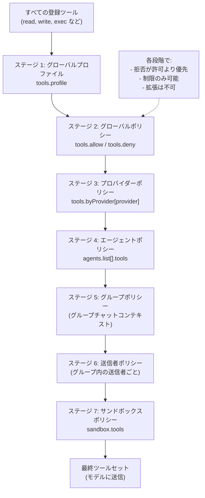
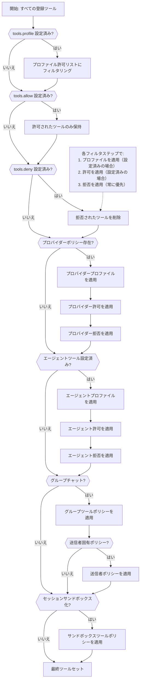
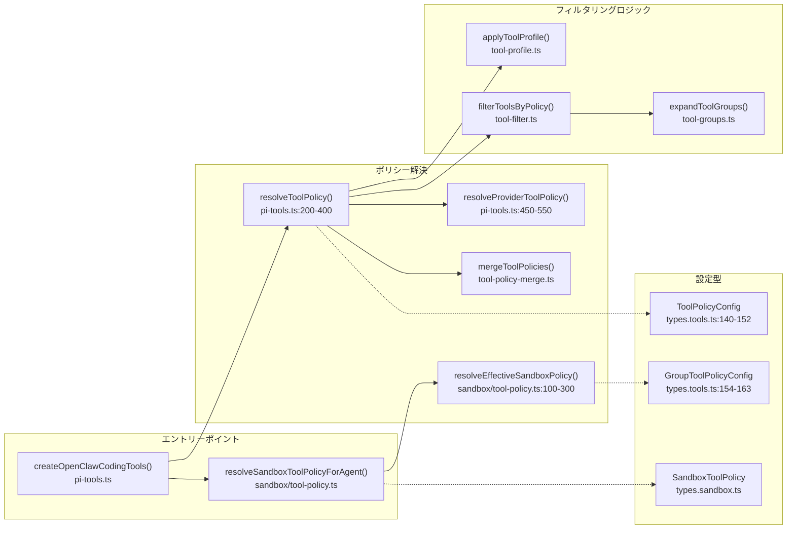

# ページ: ツールポリシー解決

# ツールポリシー解決

<details>
<summary>関連ソースファイル</summary>

この Wiki ページ生成のために使用されたファイル：

- [CHANGELOG.md](CHANGELOG.md)
- [docs/cli/memory.md](docs/cli/memory.md)
- [docs/cli/sandbox.md](docs/cli/sandbox.md)
- [docs/concepts/memory.md](docs/concepts/memory.md)
- [docs/gateway/configuration.md](docs/gateway/configuration.md)
- [docs/gateway/doctor.md](docs/gateway/doctor.md)
- [docs/gateway/sandbox-vs-tool-policy-vs-elevated.md](docs/gateway/sandbox-vs-tool-policy-vs-elevated.md)
- [docs/gateway/sandboxing.md](docs/gateway/sandboxing.md)
- [docs/platforms/mac/skills.md](docs/platforms/mac/skills.md)
- [docs/tools/elevated.md](docs/tools/elevated.md)
- [docs/tools/index.md](docs/tools/index.md)
- [docs/tools/skills-config.md](docs/tools/skills-config.md)
- [src/agents/bash-tools.test.ts](src/agents/bash-tools.test.ts)
- [src/agents/memory-search.test.ts](src/agents/memory-search.test.ts)
- [src/agents/memory-search.ts](src/agents/memory-search.ts)
- [src/agents/pi-tools-agent-config.test.ts](src/agents/pi-tools-agent-config.test.ts)
- [src/agents/sandbox-explain.test.ts](src/agents/sandbox-explain.test.ts)
- [src/agents/sandbox-skills.test.ts](src/agents/sandbox-skills.test.ts)
- [src/agents/sandbox.ts](src/agents/sandbox.ts)
- [src/cli/memory-cli.test.ts](src/cli/memory-cli.test.ts)
- [src/cli/memory-cli.ts](src/cli/memory-cli.ts)
- [src/cli/models-cli.test.ts](src/cli/models-cli.test.ts)
- [src/commands/configure.gateway.test.ts](src/commands/configure.gateway.test.ts)
- [src/commands/configure.gateway.ts](src/commands/configure.gateway.ts)
- [src/commands/configure.ts](src/commands/configure.ts)
- [src/commands/doctor.ts](src/commands/doctor.ts)
- [src/commands/onboard-helpers.test.ts](src/commands/onboard-helpers.test.ts)
- [src/commands/onboard-helpers.ts](src/commands/onboard-helpers.ts)
- [src/commands/onboard-interactive.ts](src/commands/onboard-interactive.ts)
- [src/config/merge-config.ts](src/config/merge-config.ts)
- [src/config/schema.ts](src/config/schema.ts)
- [src/config/types.tools.ts](src/config/types.tools.ts)
- [src/config/types.ts](src/config/types.ts)
- [src/config/zod-schema.agent-runtime.ts](src/config/zod-schema.agent-runtime.ts)
- [src/config/zod-schema.ts](src/config/zod-schema.ts)
- [src/memory/embeddings.test.ts](src/memory/embeddings.test.ts)
- [src/memory/embeddings.ts](src/memory/embeddings.ts)
- [src/memory/manager.ts](src/memory/manager.ts)
- [src/wizard/onboarding.gateway-config.test.ts](src/wizard/onboarding.gateway-config.test.ts)
- [src/wizard/onboarding.gateway-config.ts](src/wizard/onboarding.gateway-config.ts)
- [src/wizard/onboarding.ts](src/wizard/onboarding.ts)
- [src/wizard/onboarding.types.ts](src/wizard/onboarding.types.ts)

</details>


このページでは、OpenClaw が実行時にエージェントにどのツールが利用可能かを段階的ポリシーチェーンを通じて決定する方法を説明します。一般的なツール設定については、[ツールのセキュリティとサンドボックス](#6.2) を参照してください。利用可能なツールの完全リストについては、[ビルトインツール](#6.1) を参照してください。

## 概要

ツールの利用可能性は**段階的フィルターチェーン**を通じて解決され、各段階はツールセットを制限するのみ（拡張はしない）です。チェーンは広範なグローバルデフォルトから特定のコンテキスト依存のオーバーライドへと進行します：

**グローバル → プロバイダー → エージェント → グループ → 送信者 → サンドボックス**

すべての段階で**拒否が常に優先されます**：ツールがいかなるレベルでも拒否された場合、後の段階で再許可することはできません。これにより、より具体的なコンテキストは権限を縮小できるのみの、セキュリティデフォルトのモデルが作成されます。

**ソース:** [src/agents/sandbox/tool-policy.ts:1-500](), [src/agents/pi-tools.ts:1-1000]()

## ポリシーチェーンの段階



**ソース:** [src/agents/pi-tools.ts:200-400](), [src/agents/sandbox/tool-policy.ts:50-300]()

### ステージ 1: グローバルプロファイル

`tools.profile` 設定は他のフィルタリングの前に**ベース許可リスト**を確立します：

| プロファイル | 許可されるツール |
|-------------|----------------|
| `minimal` | `session_status` のみ |
| `coding` | `group:fs`, `group:runtime`, `group:sessions`, `group:memory`, `image` |
| `messaging` | `group:messaging`, `sessions_list`, `sessions_history`, `sessions_send`, `session_status` |
| `full` | 制限なし（すべてのツールが利用可能） |

プロファイルが設定されていない場合、すべてのツールが利用可能として開始されます（`full` に相当）。

**例：**
```json5
{
  "tools": {
    "profile": "coding"
  }
}
```

**ソース:** [src/config/types.tools.ts:139-152](), [src/agents/tool-profile.ts:1-100]()

### ステージ 2: グローバルポリシー

`tools.allow` と `tools.deny` リストがツールセットをフィルタリングします：

- **`tools.allow`**: 設定されている場合、リストされたツールのみが通過します（許可リストモード）
- **`tools.alsoAllow`**: 加算的エントリが既存の許可リストにマージされ、既存の許可リストを置き換えません
- **`tools.deny`**: このリストにあるツールが削除されます（拒否が許可より優先）

**例：**
```json5
{
  "tools": {
    "profile": "full",
    "deny": ["exec", "bash", "process"]
  }
}
```

**特殊ケース:** `tools.allow` にのみ未知/ロードされていないプラグインツールが含まれる場合、OpenClaw はコアツールを利用可能にするために許可リストを無視し、警告をログ出力します。

**ソース:** [src/agents/pi-tools.ts:300-400](), [src/config/types.tools.ts:140-160]()

### ステージ 3: プロバイダーポリシー

`tools.byProvider` オブジェクトは特定のモデルプロバイダーまたはプロバイダー/モデル組み合わせに対してツールを制限します。この段階は**さらに制限するのみ**で、拡張はできません。

プロバイダーキーは以下を受け入れます：
- `provider`（例: `"openai"`, `"google-antigravity"`）
- `provider/model`（例: `"openai/gpt-5.2"`）

**例：**
```json5
{
  "tools": {
    "profile": "coding",
    "byProvider": {
      "google-antigravity": {
        "profile": "minimal"
      },
      "openai/gpt-5.2": {
        "allow": ["group:fs", "sessions_list"]
      }
    }
  }
}
```

**解決順序：**
1. 正確な `provider/model` マッチをチェック
2. `provider` マッチにフォールバック
3. ベースポリシーにフォールバック

**ソース:** [src/agents/pi-tools.ts:450-550](), [src/config/types.tools.ts:82-136]()

### ステージ 4: エージェントポリシー

`agents.list[]` の各エージェントは `agents.list[].tools` を介してツールポリシーをオーバーライドできます。この段階はプロバイダーポリシーの後に適用され、有効なポリシーをさらに制限または置換できます。

**例：**
```json5
{
  "agents": {
    "list": [
      {
        "id": "support",
        "tools": {
          "profile": "messaging",
          "allow": ["slack", "discord"]
        }
      },
      {
        "id": "dev",
        "tools": {
          "deny": ["web_search"]
        }
      }
    ]
  }
}
```

エージェント固有のプロバイダーオーバーライドもサポートされます：
```json5
{
  "agents": {
    "list": [
      {
        "id": "main",
        "tools": {
          "byProvider": {
            "google-antigravity": {
              "allow": ["message", "sessions_list"]
            }
          }
        }
      }
    ]
  }
}
```

**ソース:** [src/agents/pi-tools.ts:600-700](), [src/config/types.agents.ts:1-500]()

### ステージ 5: グループポリシー

エージェントが**グループチャットコンテキスト**で呼び出された場合、グループ固有のツールポリシーを介して追加のフィルタリングが適用されます。これはチャネルごととグループごとに設定されます。

**設定表面：**
- `channels.<channel>.groups.<groupId>.tools`
- `allow`, `alsoAllow`, `deny` をサポート

**例：**
```json5
{
  "channels": {
    "telegram": {
      "groups": {
        "tg:group:123": {
          "tools": {
            "allow": ["message", "sessions_list"],
            "deny": ["exec"]
          }
        },
        "*": {
          "tools": {
            "deny": ["group:runtime"]
          }
        }
      }
    }
  }
}
```

**ソース:** [src/agents/sandbox/tool-policy.ts:100-200](), [src/config/types.tools.ts:154-160]()

### ステージ 6: 送信者ポリシー

グループコンテキスト内では、送信者ごとのオーバーライドがツールをさらに制限できます。これは `channels.<channel>.groups.<groupId>.bySender` で設定されます。

**例：**
```json5
{
  "channels": {
    "whatsapp": {
      "groups": {
        "wa:group:abc": {
          "bySender": {
            "+15555550123": {
              "tools": {
                "allow": ["message", "read", "write"]
              }
            }
          }
        }
      }
    }
  }
}
```

**ソース:** [src/agents/sandbox/tool-policy.ts:200-300](), [src/config/types.tools.ts:161-163]()

### ステージ 7: サンドボックスポリシー

セッションが**サンドボックス化された Docker コンテナ**で実行されている場合、最終的なツールフィルタリング段階が `agents.defaults.sandbox.tools`（またはエージェントごとの `agents.list[].sandbox.tools`）に基づいて適用されます。

**設定：**
```json5
{
  "agents": {
    "defaults": {
      "sandbox": {
        "mode": "non-main",
        "tools": {
          "allow": ["read", "write", "exec"],
          "deny": ["message"]
        }
      }
    }
  }
}
```

サンドボックスポリシーは**最後に**適用され、絶対的な基準を表します：ここで拒否されたツールは、他のすべてのポリシーに関係なく、サンドボックス化されたセッションで使用できません。

**ソース:** [src/agents/sandbox/tool-policy.ts:300-500](), [src/config/types.sandbox.ts:1-100]()

## 解決アルゴリズム



**重要な原則:** 各段階は作業セットからツールを削除するのみです。最終的なツールセットは、すべての許可リストの交差からすべての拒否リストの和集合を引いたものです。

**ソース:** [src/agents/pi-tools.ts:200-800](), [src/agents/sandbox/tool-policy.ts:1-500]()

## ツールグループ

ツールポリシーは `group:*` ショートハンドをサポートし、これは複数のツールに展開されます。これらは `allow`、`alsoAllow`、`deny` リストのいずれの段階でも使用できます。

| グループ | 展開されるツール |
|----------|------------------|
| `group:runtime` | `exec`, `bash`, `process` |
| `group:fs` | `read`, `write`, `edit`, `apply_patch` |
| `group:sessions` | `sessions_list`, `sessions_history`, `sessions_send`, `sessions_spawn`, `session_status` |
| `group:memory` | `memory_search`, `memory_get` |
| `group:web` | `web_search`, `web_fetch` |
| `group:ui` | `browser`, `canvas` |
| `group:automation` | `cron`, `gateway` |
| `group:messaging` | `message` |
| `group:nodes` | `nodes` |
| `group:openclaw` | すべてのビルトイン OpenClaw ツール（プラグインツールを除く） |

**例：**
```json5
{
  "tools": {
    "allow": ["group:fs", "group:sessions"],
    "deny": ["group:runtime"]
  }
}
```

**ソース:** [src/agents/tool-groups.ts:1-100](), [docs/tools/index.md:138-165]()

## コードエンティティ

以下の図は、高レベルの概念を実際のコード関数とファイルにマッピングします：



**ソース:** [src/agents/pi-tools.ts:1-1000](), [src/agents/sandbox/tool-policy.ts:1-500](), [src/config/types.tools.ts:1-300]()

## 実用的な例

### 例 1: 実行制限付きコーディングプロファイル

**目標:** デフォルトでコーディングツールを使用するが、どこでも実行を拒否する。

```json5
{
  "tools": {
    "profile": "coding",
    "deny": ["group:runtime"]
  }
}
```

**結果:** エージェントはファイルツール（`read`, `write`, `edit`, `apply_patch`）、セッションツール、メモリツール、`image` を取得しますが、`exec`、`bash`、`process` は取得しません。

**ソース:** [src/agents/pi-tools-agent-config.test.ts:8-36]()

### 例 2: プロバイダー固有の最小ツール

**目標:** 特定のプロバイダーを最小限のツールに制限し、他のプロバイダーは完全アクセスを保持する。

```json5
{
  "tools": {
    "profile": "full",
    "byProvider": {
      "google-antigravity": {
        "profile": "minimal"
      }
    }
  }
}
```

**結果:** `google-antigravity/*` モデルを使用時、`session_status` のみが利用可能。他のすべてのプロバイダーは完全なツールアクセスを取得します。

**ソース:** [docs/tools/index.md:93-104]()

### 例 3: 異なるポリシーを持つ複数のエージェント

**目標:** 1つのエージェントはコーディング用、1つはメッセージのみの顧客サポート用。

```json5
{
  "tools": {
    "profile": "coding"
  },
  "agents": {
    "list": [
      {
        "id": "dev",
        "workspace": "~/dev-workspace"
      },
      {
        "id": "support",
        "workspace": "~/support-workspace",
        "tools": {
          "profile": "messaging",
          "alsoAllow": ["slack", "discord"]
        }
      }
    ]
  }
}
```

**結果：**
- `dev` エージェント: 完全なコーディングツール（fs、runtime、sessions、memory、image）
- `support` エージェント: メッセージ + sessions + status + Slack + ツールのみ

**ソース:** [docs/tools/index.md:66-80]()

### 例 4: 送信者制限付きグループチャット

**目標:** 共有 Telegram グループで、1人のユーザーを読み取り専用ツールに制限する。

```json5
{
  "channels": {
    "telegram": {
      "groups": {
        "tg:group:123": {
          "tools": {
            "allow": ["group:fs", "group:runtime", "sessions_list"]
          },
          "bySender": {
            "tg:user:456": {
              "tools": {
                "allow": ["read", "sessions_list"],
                "deny": ["write", "edit", "exec"]
              }
            }
          }
        }
      }
    }
  }
}
```

**結果：**
- グループ `tg:group:123` の大多数のユーザー: ファイルツール + 実行ツール + sessions_list
- ユーザー `tg:user:456`: `read` と `sessions_list` のみ

**ソース:** [src/agents/sandbox/tool-policy.ts:200-300](), [src/config/types.tools.ts:161-163]()

### 例 5: サンドボックス化されたセッションのツール基準

**目標:** 信頼されていないセッションをサンドボックス化し、メッセージングツールを使用できないようにする。

```json5
{
  "agents": {
    "defaults": {
      "sandbox": {
        "mode": "non-main",
        "tools": {
          "allow": ["group:fs", "group:runtime"],
          "deny": ["message", "nodes"]
        }
      }
    }
  }
}
```

**結果:** セッションがサンドボックスで実行される場合（メイン以外のセッション）、ファイルツールと実行ツールのみが利用可能。前の段階で `message` や `nodes` が許可されていても、サンドボックスポリシーがそれらを削除します。

**ソース:** [src/agents/sandbox/tool-policy.ts:300-500](), [docs/gateway/sandboxing.md:1-100]()

## ツール利用可能性のデバッグ

ツールが予期せずブロックされている場合、ポリシーチェーンを順序よく確認してください：

1. **グローバルプロファイル**: 制限的なプロフィールが設定されていますか？（`tools.profile` を確認）
2. **グローバルポリシー**: ツールが `tools.deny` にありますか？ `tools.allow` にありませんか？
3. **プロバイダーポリシー**: `tools.byProvider[<provider>]` がブロックしていますか？
4. **エージェントポリシー**: `agents.list[<id>].tools` がブロックしていますか？
5. **グループポリシー**: 制限された `tools` を持つグループにいますか？
6. **送信者ポリシー**: 送信者固有のオーバーライドがありますか？
7. **サンドボックスポリシー**: セッションが `sandbox.tools` で制限されていてサンドボックス化されていますか？

`openclaw sandbox effective-policy` コマンドは、特定のコンテキストに対する最終解決ツールセットを表示します：

```bash
openclaw sandbox effective-policy \
  --agent main \
  --channel telegram \
  --chat-type group \
  --sender "tg:user:123"
```

**ソース:** [docs/cli/sandbox.md:1-100](), [docs/gateway/sandbox-vs-tool-policy-vs-elevated.md:1-200]()

---

**関連ページ：**
- [ツールのセキュリティとサンドボックス](#6.2) — サンドボックスモード、ワークスペースアクセス、セキュリティ境界
- [ビルトインツール](#6.1) — 完全なツールインベントリとパラメータ
- [スキルシステム](#6.4) — ツール使用ガイダンスがプロンプトに注入される方法
- [サンドボックス化](#13) — 詳細なサンドボックス設定ガイド

---