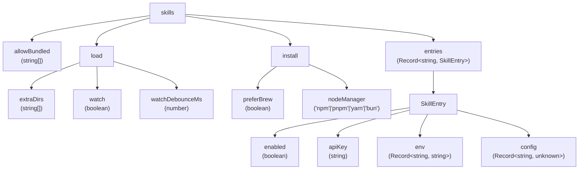
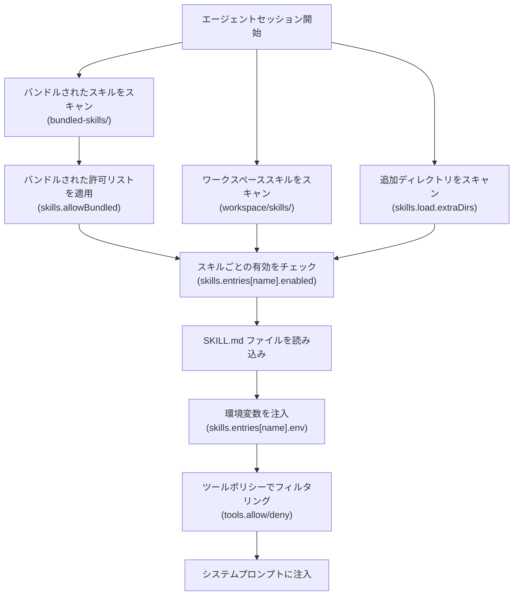
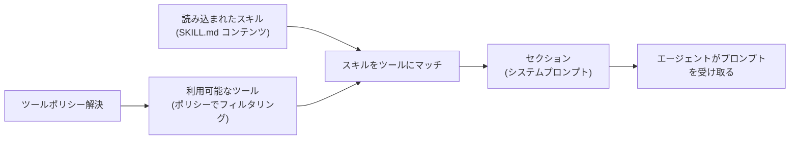
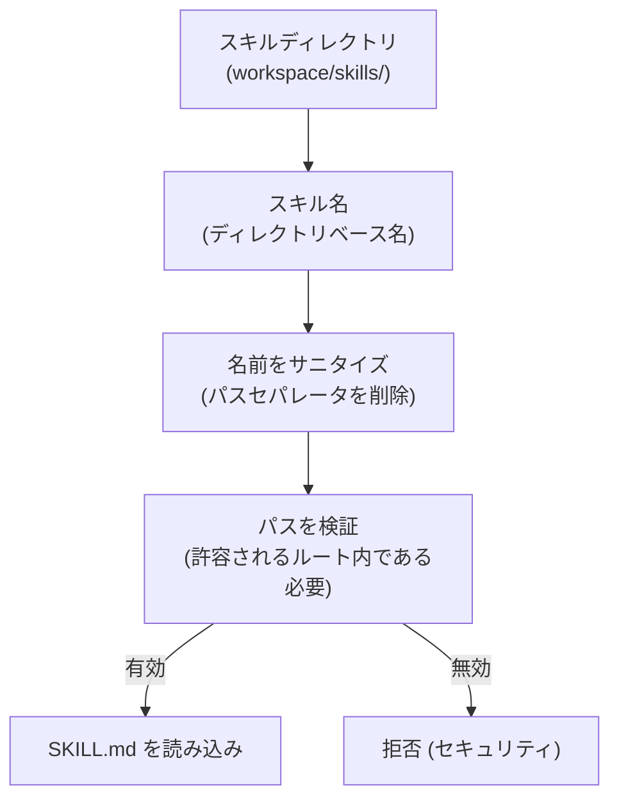

# ページ: スキルシステム

# スキルシステム

<details>
<summary>関連ソースファイル</summary>

この Wiki ページ生成のために使用されたファイル：

- [CHANGELOG.md](CHANGELOG.md)
- [docs/cli/memory.md](docs/cli/memory.md)
- [docs/cli/sandbox.md](docs/cli/sandbox.md)
- [docs/concepts/memory.md](docs/concepts/memory.md)
- [docs/gateway/background-process.md](docs/gateway/background-process.md)
- [docs/gateway/configuration.md](docs/gateway/configuration.md)
- [docs/gateway/sandbox-vs-tool-policy-vs-elevated.md](docs/gateway/sandbox-vs-tool-policy-vs-elevated.md)
- [docs/gateway/sandboxing.md](docs/gateway/sandboxing.md)
- [docs/platforms/mac/skills.md](docs/platforms/mac/skills.md)
- [docs/tools/elevated.md](docs/tools/elevated.md)
- [docs/tools/index.md](docs/tools/index.md)
- [docs/tools/skills-config.md](docs/tools/skills-config.md)
- [src/agents/bash-process-registry.test.ts](src/agents/bash-process-registry.test.ts)
- [src/agents/bash-process-registry.ts](src/agents/bash-process-registry.ts)
- [src/agents/bash-tools.ts](src/agents/bash-tools.ts)
- [src/agents/memory-search.test.ts](src/agents/memory-search.test.ts)
- [src/agents/memory-search.ts](src/agents/memory-search.ts)
- [src/agents/pi-embedded-helpers.ts](src/agents/pi-embedded-helpers.ts)
- [src/agents/pi-embedded-runner.test.ts](src/agents/pi-embedded-runner.test.ts)
- [src/agents/pi-embedded-runner.ts](src/agents/pi-embedded-runner.ts)
- [src/agents/pi-embedded-subscribe.ts](src/agents/pi-embedded-subscribe.ts)
- [src/agents/pi-tools.ts](src/agents/pi-tools.ts)
- [src/agents/sandbox-explain.test.ts](src/agents/sandbox-explain.test.ts)
- [src/agents/sandbox.ts](src/agents/sandbox.ts)
- [src/cli/memory-cli.test.ts](src/cli/memory-cli.test.ts)
- [src/cli/memory-cli.ts](src/cli/memory-cli.ts)
- [src/cli/models-cli.test.ts](src/cli/models-cli.test.ts)
- [src/config/schema.ts](src/config/schema.ts)
- [src/config/types.tools.ts](src/config/types.tools.ts)
- [src/config/types.ts](src/config/types.ts)
- [src/config/zod-schema.agent-runtime.ts](src/config/zod-schema.agent-runtime.ts)
- [src/config/zod-schema.ts](src/config/zod-schema.ts)
- [src/memory/embeddings.test.ts](src/memory/embeddings.test.ts)
- [src/memory/embeddings.ts](src/memory/embeddings.ts)
- [src/memory/manager.ts](src/memory/manager.ts)

</details>


スキルシステムは、利用可能なツールと機能についてエージェントにドキュメンテーションと使用ガイダンスを提供します。スキルは、エージェントのシステムプロンプトに注入される Markdown ファイルで、モデルがツールを正しく呼び出す方法を理解できるようにします。

**範囲**: このページは、スキルディレクトリ、`SKILL.md` 形式、設定スキーマ、スキールがシステムプロンプトに読み込まれる方法をカバーします。ツールのセキュリティと許可リストについては、[ツールポリシー解決](#6.3) を参照してください。ツールインベントリとパラメータについては、[ビルトインツール](#6.1) を参照してください。

---

## 概要

スキルは利用可能なツールとエージェント理解の間の架け橋となります：

- **Markdown ベースのドキュメンテーション**: 各スキルは機能を記述する `SKILL.md` ファイルです
- **システムプロンプト注入**: ツールが利用可能な場合、スキルはエージェントのシステムプロンプトに表示されます
- **スキルごとの設定**: 環境変数、API キー、カスタム設定ペイロード
- **バンドルとユーザー定義**: OpenClaw はバンドルされたスキルを同梱します。ユーザーはカスタムなものを追加できます
- **ウォッチサポート**: スキルディレクトリはライブ更新のためにウォッチできます

**ツールとの関係**: スキルはツールをドキュメント化します。ツールがエージェントに利用可能な場合（ツールポリシーを介して）、対応するスキルドキュメンテーションがシステムプロンプトに含まれます。

ソース: [docs/tools/index.md:10-26](), [src/config/zod-schema.ts:518-553](), [CHANGELOG.md:17]()

---

## スキルディレクトリ構造

スキルは、OpenClaw と一緒にバンドルされているか、ユーザー定義の場所にあるスキルディレクトリに存在します。

### レイアウト

```
~/.openclaw/workspace/
  skills/                    # ユーザー定義スキル（ワークスペース相対）
    my-skill/
      SKILL.md               # スキルドキュメンテーション
      install.sh             # オプションのインストールスクリプト
      config.json            # オプションの設定スキーマ

bundled-skills/              # バンドルされたスキル（OpenClaw と同梱）
  voice-call/
    SKILL.md
  lobster/
    SKILL.md
```

### SKILL.md 形式

各スキルディレクトリには、ツール使用ドキュメンテーションを含む `SKILL.md` ファイルが必要です：

```markdown
# My Skill

機能の簡単な説明。

## Usage

- Tool: `my_tool`
- Parameters: `param1`, `param2`
- Example: `my_tool(param1="value")`

## Environment Variables

- `MY_SKILL_API_KEY`: 必須の API キー
- `MY_SKILL_ENDPOINT`: オプションのエンドポイントオーバーライド
```

**制約**:
- `SKILL.md` という名前である必要があります（大文字小文字を区別）
- Markdown 形式
- ディレクトリ名によって参照されます（例: `skills/my-skill` → スキル名は `my-skill`）
- パストラバーサルを防ぐためにスキル名がサニタイズされます

ソース: [docs/tools/index.md:10-26](), [CHANGELOG.md:17]()

---

## 設定スキーマ

スキルは `openclaw.json` の `skills.*` で設定されます：

```json5
{
  skills: {
    allowBundled: ["voice-call", "lobster"],
    load: {
      extraDirs: ["~/custom-skills", "/srv/team-skills"],
      watch: true,
      watchDebounceMs: 1500
    },
    install: {
      preferBrew: false,
      nodeManager: "pnpm"
    },
    entries: {
      "my-skill": {
        enabled: true,
        apiKey: "sk-...",
        env: { MY_SKILL_ENDPOINT: "https://api.example.com" },
        config: { maxRetries: 3 }
      }
    }
  }
}
```

### スキーマ構造



**フィールド説明**:

| フィールド | 型 | デフォルト | 説明 |
|----------|----|-----------|------|
| `skills.allowBundled` | `string[]` | `[]` | 読み込むバンドルされたスキル名（空 = すべて） |
| `skills.load.extraDirs` | `string[]` | `[]` | 追加のスキルディレクトリ（絶対パスまたはワークスペース相対） |
| `skills.load.watch` | `boolean` | `false` | 変更のためにスキルディレクトリをウォッチ |
| `skills.load.watchDebounceMs` | `number` | `1500` | ファイルウォッチイベントのデバウンス遅延 |
| `skills.install.preferBrew` | `boolean` | `false` | スキル依存関係に Homebrew を優先 |
| `skills.install.nodeManager` | `string` | `"npm"` | スキルインストール用の Node パッケージマネージャー |
| `skills.entries[name]` | `SkillEntry` | — | スキルごとの設定 |

ソース: [src/config/zod-schema.ts:518-553](), [docs/tools/skills-config.md:1-50]()

---

## スキル読み込みフロー

スキルは複数のソースから発見され、単一のスキルレジストリにマージされます。

### 読み込みパイプライン



**優先順位**（後のソースが前のものを上書き）：
1. バンドルされたスキル
2. ワークスペーススキル（`workspace/skills/`）
3. 追加ディレクトリ（`skills.load.extraDirs`）

**フィルタリング**：
- **バンドル許可リスト**: `skills.allowBundled` はどのバンドルされたスキルが読み込まれるかを制限します（空配列 = すべてを読み込む）
- **スキルごとの有効**: `skills.entries[name].enabled = false` はスキルを無効化します
- **ツールポリシー**: スキルは対応するツールがツールポリシーをパスした場合のみ含まれます

ソース: [src/config/zod-schema.ts:518-553](), [docs/gateway/configuration.md:1-50]()

---

## スキルエントリー（スキルごとの設定）

個々のスキルは `skills.entries[skillName]` で設定できます：

### エントリー スキーマ

```json5
{
  skills: {
    entries: {
      "voice-call": {
        enabled: true,
        apiKey: "${TWILIO_AUTH_TOKEN}",
        env: {
          TWILIO_ACCOUNT_SID: "AC...",
          TWILIO_PHONE_NUMBER: "+15555550123"
        },
        config: {
          recordCalls: true,
          maxDurationSeconds: 300
        }
      }
    }
  }
}
```

**フィールド使用**:

| フィールド | 目的 | 例 |
|----------|------|-----|
| `enabled` | このスキルの有効/無効 | `false` でエージェントから非表示 |
| `apiKey` | スキル固有の API キー | Twilio、OpenAI、Deepgram キー |
| `env` | 環境変数 | サービス資格情報、エンドポイント |
| `config` | スキル定義の設定 | スキル固有の調整パラメータ |

**環境変数置換**：
- `apiKey` と `env` 値は `${VAR_NAME}` 置換をサポート
- 変数は実行時に環境から解決されます
- 標準の OpenClaw env 優先順序に従います（インライン → `.env` → プロセス）

ソース: [src/config/zod-schema.ts:539-549](), [docs/gateway/configuration.md:421-469]()

---

## システムプロンプト注入

スキルは、対応するツールが利用可能な場合にエージェントのシステムプロンプトに注入されます。

### 注入フロー



**スキルが表示される場合**：
- スキルは以下の場合にシステムプロンプトに含まれます：
  1. スキルが読み込まれている（無効化されておらず、許可リストをパス）
  2. スキルの少なくとも1つのツールが利用可能（ツールポリシーをパス）
  3. セッションのプロンプトモードにスキルが含まれる（デフォルト動作）

**プロンプト構造**（概算）：
```
# System Prompt

[Identity Section]
[Skills Section]
  ## voice-call
  [voice-call/SKILL.md のコンテンツ]

  ## lobster
  [lobster/SKILL.md のコンテンツ]

[Tools Section]
[Memory Section]
[Context Files]
```

**環境変数伝搬**：
- `skills.entries[name].env` 変数はエージェントの環境に設定されます
- これらの env 変数はツール実行で利用可能です（例: `exec` が参照できる）
- サンドボックス化されたセッションは Docker `--env` フラグを介してスキル env 変数を継承

ソース: [src/agents/pi-embedded-runner.ts:1-28](), [docs/agents/system-prompt.md]()

---

## バンドル vs ユーザースキル

OpenClaw は、コードベースと一緒に配布されるバンドルされたスキルと、ユーザー定義のスキルを区別します。

### 比較

| アスペクト | バンドルされたスキル | ユーザースキル |
|----------|-------------------|----------------|
| 場所 | `bundled-skills/`（OpenClaw インストール内） | `workspace/skills/` または `skills.load.extraDirs` |
| 許可リスト | `skills.allowBundled`（空 = すべて） | 常に `enabled` の場合に読み込まれる |
| 例 | `voice-call`, `lobster` | カスタム組織固有ツール |
| セキュリティ | OpenClaw メンテナーによって配送 | ユーザーの責任 |

### バンドルされたスキル許可リスト

どのバンドルされたスキルを読み込むかを制御：

```json5
{
  skills: {
    // これらのバンドルされたスキルのみを読み込む：
    allowBundled: ["voice-call", "lobster"]
  }
}
```

**動作**：
- **空配列**（`[]`）：すべてのバンドルされたスキルを読み込む（デフォルト）
- **空でない配列**：リストされたバンドルされたスキルのみを読み込む
- **ワークスペース/追加スキル**: `allowBundled` の影響を受けない（有効な場合常に読み込まれる）

**ユースケース**: 実際に使用するバンドルされたスキルのみを読み込むことでプロンプトの膨張を減らします。

ソース: [src/config/zod-schema.ts:520](), [docs/tools/skills-config.md:1-50]()

---

## スキルインストール

スキルにはインストールスクリプトと、OpenClaw によって管理される依存関係があります。

### インストール設定

```json5
{
  skills: {
    install: {
      preferBrew: true,            // システム依存関係に Homebrew を優先
      nodeManager: "pnpm"           // Node.js パッケージに pnpm を使用
    }
  }
}
```

**インストール動作**：
- **`preferBrew`**: `true` の場合、他のパッケージマネージャーへのフォールバック前に Homebrew をチェック
- **`nodeManager`**: どの Node パッケージマネージャーを使用するか（`npm`, `pnpm`, `yarn`, `bun`）
- **インストールスクリプト**: スキルは `install.sh` または `package.json` を依存関係として含めることができます
- **呼び出し**: OpenClaw はインストールスクリプトを自動実行しません（ユーザーは手動またはスキル固有のコマンドでトリガーする必要があります）

**セキュリティ注意点**: スキルインストールスクリプトは任意のコード実行を防ぐために自動的に実行されません。ユーザーは明示的にインストールをトリガーする必要があります（通常は CLI またはプラグイン固有のセットアップコマンドを介して）。

ソース: [src/config/zod-schema.ts:529-537](), [CHANGELOG.md:142]()

---

## セキュリティ上の考慮事項

スキルはシステムプロンプト注入とコード実行の可能性があるため、セキュリティ上の意味合いがあります。

### パス制約



**セキュリティ対策**：

1. **パスサニタイゼーション** (CHANGELOG.md:17):
   - スキル名はパストラバーサルを防ぐためにサニタイズされます
   - フロントマター制御スキル名はファイルシステムパスとして使用されなくなりました
   - スキル同期先はサンドボックス `skills/` ルートに限定されます

2. **インストールスクリプトのセキュリティ** (CHANGELOG.md:142):
   - プラグインとフックインストールスクリプトは `--ignore-scripts` で無効化
   - プラグインインストール中のライフサイクルスクリプト実行を防止

3. **スキルコードレビュー**:
   - スキルとプラグインのコード安全スキャナー (CHANGELOG.md:194)
   - ゲートウェイ応答からスキル設定の資格情報をマスキング

**ベストプラクティス**:
- `allowBundled` に追加する前にスキル `SKILL.md` コンテンツをレビュー
- 手動実行前に `install.sh` スクリプトを監査
- 資格情報のハードコードではなくスキル env 変数（`skills.entries[name].env`）を使用
- `skills.load.extraDirs` を信頼できるディレクトリのみに制限

ソース: [CHANGELOG.md:17](), [CHANGELOG.md:142](), [CHANGELOG.md:194]()

---

## 設定例

### 最小限（バンドルされたスキルを使用）

```json5
{
  skills: {
    // すべてのバンドルされたスキルを読み込む（デフォルト）
  }
}
```

### 選択的なバンドルされたスキル

```json5
{
  skills: {
    allowBundled: ["voice-call"],  // voice-call スキルのみ
    entries: {
      "voice-call": {
        enabled: true,
        env: {
          TWILIO_ACCOUNT_SID: "${TWILIO_ACCOUNT_SID}",
          TWILIO_AUTH_TOKEN: "${TWILIO_AUTH_TOKEN}"
        }
      }
    }
  }
}
```

### カスタムスキルディレクトリ

```json5
{
  skills: {
    load: {
      extraDirs: ["~/my-org-skills", "/opt/shared-skills"],
      watch: true,
      watchDebounceMs: 2000
    },
    entries: {
      "custom-reporting": {
        enabled: true,
        apiKey: "${REPORTING_API_KEY}",
        config: {
          defaultFormat: "pdf",
          maxPages: 50
        }
      }
    }
  }
}
```

### すべてのスキルを無効化

```json5
{
  skills: {
    allowBundled: [],  // バンドルされたスキルなし
    // extraDirs や entries を追加しない
  }
}
```

ソース: [docs/tools/skills-config.md:1-50](), [docs/gateway/configuration.md:1-50]()

---

**関連ページ**:
- [ビルトインツール](#6.1) — ツールインベントリとパラメータ
- [ツールポリシー解決](#6.3) — ツール許可リストがスキルをフィルタリングする方法
- [エージェントシステム](#5) — エージェントがシステムプロンプトでスキルを使用する方法
- [設定](#4) — 設定ファイル構造と検証

---