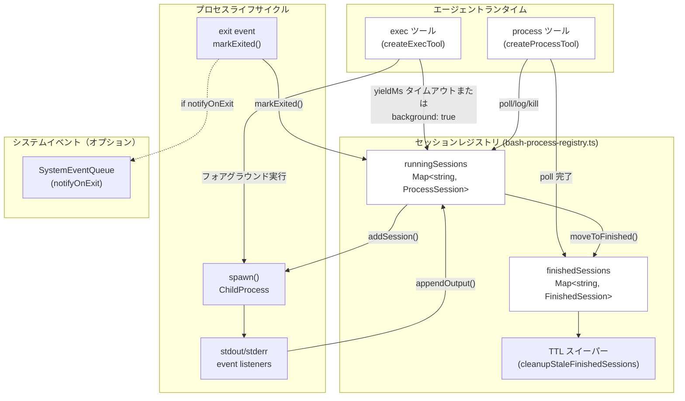
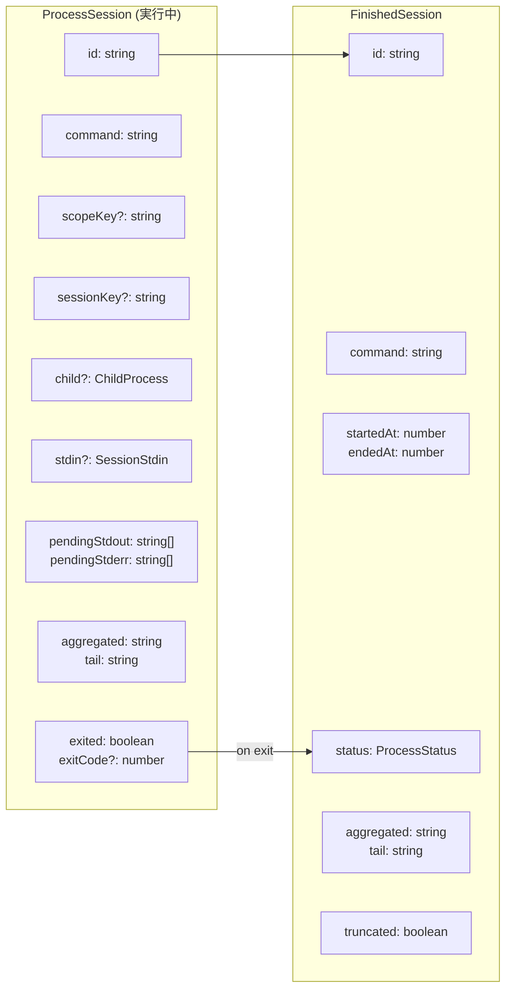
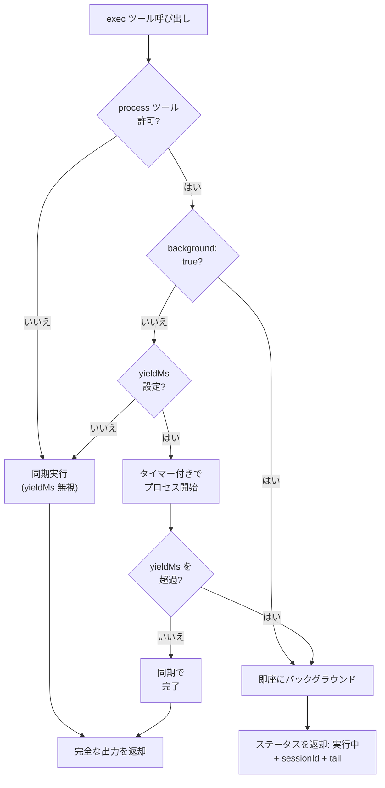
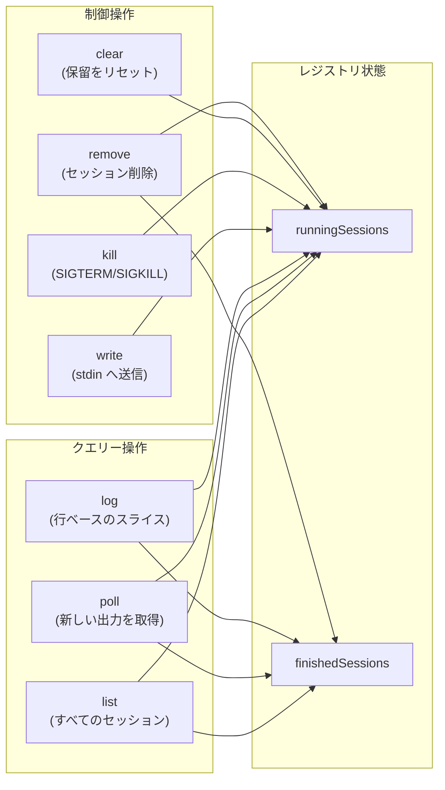
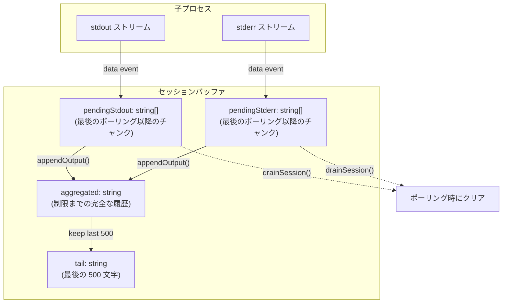
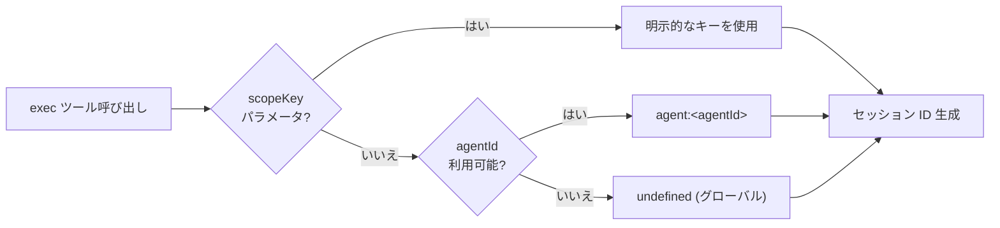
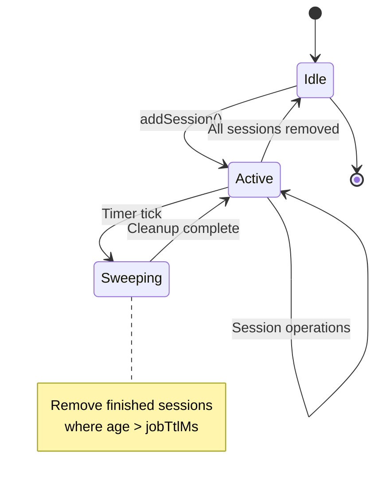
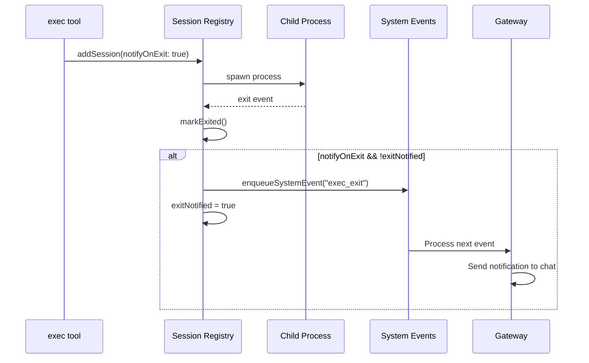

# ページ: バックグラウンドプロセス実行

# バックグラウンドプロセス実行

<details>
<summary>関連ソースファイル</summary>

この Wiki ページ生成のために使用されたファイル：

- [docs/gateway/background-process.md](docs/gateway/background-process.md)
- [src/agents/bash-process-registry.test.ts](src/agents/bash-process-registry.test.ts)
- [src/agents/bash-process-registry.ts](src/agents/bash-process-registry.ts)
- [src/agents/bash-tools.ts](src/agents/bash-tools.ts)
- [src/agents/pi-embedded-helpers.ts](src/agents/pi-embedded-helpers.ts)
- [src/agents/pi-embedded-runner.test.ts](src/agents/pi-embedded-runner.test.ts)
- [src/agents/pi-embedded-runner.ts](src/agents/pi-embedded-runner.ts)
- [src/agents/pi-embedded-subscribe.ts](src/agents/pi-embedded-subscribe.ts)
- [src/agents/pi-tools.ts](src/agents/pi-tools.ts)

</details>


## 目的と範囲

このページは、OpenClaw のバックグラウンドプロセス実行システムを文書化しており、これにより長時間実行されるシェルコマンドが非同期に実行されながらエージェントが継続して機能できるようになります。このシステムは以下で構成されます：

- `yieldMs` タイムアウトまたは明示的な `background` フラグを介する **exec ツール**のバックグラウンド化
- アクティブなバックグラウンドセッションを管理する **process ツール**（poll、log、write、kill、clear）
- メモリ内で実行中および完了したプロセスを追跡する **セッションレジストリ**
- **出力バッファリング**と集戦略
- エージェントごとにプロセスを分離する **セッションスコーピング**

exec ツールのセキュリティとサンドボックス化については、[ツールのセキュリティとサンドボックス](#6.2) を参照してください。完全なツールインベントリとパラメータについては、[ビルトインツール](#6.1) を参照してください。

**ソース:** [docs/gateway/background-process.md:1-47](), [src/agents/bash-tools.ts:1-10]()

---

## アーキテクチャ概要



**図: バックグラウンド実行フロー**

exec ツールは子プロセスを生成し、オプションでセッションレジストリに登録します。バックグラウンド化された場合、process ツールは出力をポーリング、stdin 経由で入力を送信、またはセッションをキルできます。完了したセッションは TTL スイーパーによって削除されるまでメモリに保持されます。

**ソース:** [src/agents/bash-tools.ts:1-10](), [src/agents/bash-process-registry.ts:1-102](), [src/agents/bash-tools.test.ts:70-271]()

---

## セッションレジストリ

セッションレジストリは、実行中および完了したバックグラウンドプロセスの両方を追跡するメモリ内ストアです。[src/agents/bash-process-registry.ts:1-276]() で実装されています。

### データ構造



**図: セッションデータモデル**

| フィールド | 型 | 目的 |
|----------|----|------|
| `id` | `string` | 一意のセッション識別子（スラッグ） |
| `command` | `string` | 元のコマンド文字列（セッション名として使用） |
| `scopeKey` | `string?` | エージェントごとにセッションを分離（形式: `agent:<agentId>`） |
| `sessionKey` | `string?` | 通知用のオプションのチャットセッションコンテキスト |
| `child` | `ChildProcess?` | ライブプロセスハンドル（実行中のみ） |
| `stdin` | `SessionStdin?` | `process write` アクション用の書き込み可能ストリーム |
| `pendingStdout` / `pendingStderr` | `string[]` | 最後のポーリング以降の出力チャンク |
| `aggregated` | `string` | 完全な出力履歴（`maxOutputChars` に従う） |
| `tail` | `string` | クイック表示用の最後の 500 文字 |
| `exitCode` / `exitSignal` | `number?` / `Signal?` | 終了ステータス |
| `truncated` | `boolean` | 出力が `maxOutputChars` を超えたかどうか |

**ソース:** [src/agents/bash-process-registry.ts:18-68]()

### レジストリ操作

レジストリはこれらのコア関数を公開します：

| 関数 | 目的 | ファイル位置 |
|------|------|------------|
| `addSession(session)` | 新しい実行中セッションを登録 | [bash-process-registry.ts:83-86]() |
| `getSession(id)` | ID で実行中セッションを取得 | [bash-process-registry.ts:88-90]() |
| `getFinishedSession(id)` | ID で完了したセッションを取得 | [bash-process-registry.ts:92-94]() |
| `appendOutput(session, stream, chunk)` | stdout/stderr からの出力をバッファリング | [bash-process-registry.ts:101-130]() |
| `drainSession(session)` | 保留中の出力をフラッシュして新しいコンテンツを返す | [bash-process-registry.ts:132-162]() |
| `markExited(session, code, signal)` | セッションを完了状態に移動 | [bash-process-registry.ts:210-235]() |
| `markBackgrounded(session)` | セッションをバックグラウンドとしてフラグ | [bash-process-registry.ts:237-239]() |

**ソース:** [src/agents/bash-process-registry.ts:83-239]()

---

## Exec ツールのバックグラウンド化

exec ツールは2つの方法でコマンドをバックグラウンド化します：

1. **自動 yield**: `yieldMs` が設定され、コマンドがその時間内に完了しない場合、自動的にバックグラウンド化されます。
2. **明示的なバックグラウンド**: `background: true` が渡された場合、コマンドは即座にバックグラウンド化されます。

### バックグラウンド化条件



**図: Exec ツールのバックグラウンド決定フロー**

**ソース:** [src/agents/bash-tools.test.ts:85-117](), [docs/gateway/background-process.md:14-30]()

### 設定

exec ツールは、これらのバックグラウンド化関連パラメータを受け入れます：

| パラメータ | 型 | デフォルト | 説明 |
|-----------|----|-----------|------|
| `yieldMs` | `number` | `10000` | 自動バックグラウンドタイムアウト（ミリ秒） |
| `background` | `boolean` | `false` | 即座にバックグラウンド化 |
| `timeout` | `number` | `1800` | プロセスキルタイムアウト（秒） |
| `allowBackground` | `boolean` | derived | バックグラウンド化が許可されているか（process ツールが必要） |

設定ソース（優先順位順）：

1. ツール呼び出しパラメータ
2. `tools.exec.backgroundMs`（`yieldMs` のグローバルデフォルト）
3. `tools.exec.timeoutSec`（`timeout` のグローバルデフォルト）
4. ハードコードされたデフォルト

**ソース:** [src/agents/bash-tools.ts:1-10](), [docs/gateway/background-process.md:14-30]()

---

## Process ツール操作

process ツールは、バックグラウンドセッションを管理するためのこれらのアクションを提供します：

### アクションリファレンス



**図: Process ツールアクションカテゴリー**

**ソース:** [docs/tools/index.md:212-225]()

### アクション詳細

| アクション | パラメータ | 戻り値 | 備考 |
|----------|-----------|--------|------|
| `list` | `scopeKey?` | セッションサマリーの配列 | スコープが指定された場合、スコープでフィルタリング |
| `poll` | `sessionId` | 新しい出力 + ステータス | 保留中のバッファをドレイン；即座に返却 |
| `log` | `sessionId`, `offset?`, `limit?` | 行ベースの出力スライス | オフセットが省略された場合、最後の N 行をデフォルト |
| `write` | `sessionId`, `input` | 確認 | プロセス stdin に書き込み |
| `kill` | `sessionId`, `signal?` | 確認 | デフォルトシグナルは `SIGTERM` |
| `clear` | `sessionId` | 確認 | 保留中の出力バッファをリセット |
| `remove` | `sessionId` | 確認 | セッションをレジストリから削除 |

**ソース:** [docs/tools/index.md:212-225](), [src/agents/bash-tools.test.ts:206-240]()

### Poll vs Log

**poll** アクション：
- 最後のポーリング以降の**新しい出力**を返す（保留中のバッファ）
- 完了した場合は終了ステータスを含む
 インクリメンタル更新に使用
- 例: [src/agents/bash-tools.test.ts:100-114]()

**log** アクション：
- 行ベースのスライスによる**履歴出力**を返す
- `offset` = 開始行（0 から始まる）
- `limit` = 返す行数
- `offset` が省略された場合、最後の N 行をデフォルト
- 例: [src/agents/bash-tools.test.ts:206-240]()

**ソース:** [src/agents/bash-tools.test.ts:206-240]()

---

## 出力バッファリングと集戦略

バックグラウンドプロセスは、子プロセスにアタッチされたイベントリスナーを介して stdout と stderr をキャプチャします。出力は異なるアクセスパターン用に複数の形式で保存されます。

### バッファタイプ



**図: 出力バッファフロー**

**ソース:** [src/agents/bash-process-registry.ts:101-162]()

### トリミング戦略

出力は2つの制限の対象です：

| 制限 | デフォルト | 環境変数 | 目的 |
|------|-----------|----------|------|
| `maxOutputChars` | 100,000 | `PI_BASH_MAX_OUTPUT_CHARS` | 合計集約出力 |
| `pendingMaxOutputChars` | 30,000 | N/A | 保留バッファサイズ（ポーリングスパム防止） |

出力が `maxOutputChars` を超えた場合：
1. `truncated` フラグが `true` に設定される
2. 最古のコンテンツが破棄される（FIFO）
3. `tail` は常に最後の 500 文字を保持する
4. 行ベースの `log` クエリーは部分的な結果を返す可能性がある

**ソース:** [src/agents/bash-process-registry.ts:7-14](), [src/agents/bash-process-registry.test.ts:18-61]()

### 行ベースのアクセス

`log` アクションは集約された出力の行ベースのスライスを提供します：

```typescript
// 例: セッションから行 10-15 を取得
process.execute("log-call", {
  action: "log",
  sessionId: "abc123",
  offset: 10,
  limit: 5
})
```

[src/agents/bash-process-registry.ts:164-208]() からの実装ノート：
- 行は `\r\n` の正規化後に `\n` で分割される
- `offset` が省略された場合、**最後の N 行**を返す（`tail -n` に相当）
- `totalLines` は応答メタデータに含まれる
- 空行はオフセット/制限にカウントされる

**ソース:** [src/agents/bash-process-registry.ts:164-208](), [src/agents/bash-tools.test.ts:206-240]()

---

## セッションスコーピング

セッションは `scopeKey` で分離され、エージェント間のプロセスアクセスを防ぎます。これにより、マルチエージェント ゲートウェイのエージェントが互いのバックグラウンドプロセスに干渉することを防ぎます。

### スコープ解決



**図: スコープキー解決**

デフォルトのスコープキー形式：`agent:<agentId>`（`sessionKey` または明示的な `agentId` パラメータから導出）。

**ソース:** [src/agents/bash-tools.test.ts:242-270](), [src/agents/pi-tools.ts:215]()

### スコープ分離

process ツールが操作を実行する場合、スコープでセッションをフィルタリングします：

| 操作 | スコープ動作 |
|------|------------|
| `list` | 呼び出し元の `scopeKey` に一致するセッションのみを返す |
| `poll` / `log` / `write` / `kill` | セッションがスコープ外の場合、`status: "failed"` で失敗 |
| `remove` | スコープ内のセッションのみを削除 |

テストからの例 [src/agents/bash-tools.test.ts:242-270]()：

```typescript
// エージェント A がセッションを作成
const bashA = createExecTool({ scopeKey: "agent:alpha" });
const resultA = await bashA.execute("call1", { command: "sleep 1", background: true });

// エージェント B はエージェント A のセッションにアクセスできない
const processB = createProcessTool({ scopeKey: "agent:beta" });
const pollB = await processB.execute("call2", {
  action: "poll",
  sessionId: resultA.details.sessionId
});
expect(pollB.details.status).toBe("failed"); // スコープ外
```

**ソース:** [src/agents/bash-tools.test.ts:242-270]()

---

## クリーンアップと TTL

完了したセッションは、設定可能な TTL（ライブタイム）保持され、その後スイーププロセスによって自動的に削除されます。

### TTL 設定

| 設定 | デフォルト | 最小 | 最大 | 環境変数 |
|------|-----------|------|------|----------|
| ジョブ TTL | 30 分 | 1 分 | 3 時間 | `PI_BASH_JOB_TTL_MS` |
| スイープ間隔 | 5 分 | N/A | N/A | N/A |

スイーパーは定期的に実行され、`Date.now() - endedAt > jobTtlMs` である完了したセッションを削除します。

**ソース:** [src/agents/bash-process-registry.ts:4-16](), [src/agents/bash-process-registry.test.ts:106-127]()

### スイーパー ライフサイクル



**図: セッション スイープ状態マシン**

スイーパーは最初のセッションが追加されたときに自動的に開始され、レジストリが空になると停止します。

**ソース:** [src/agents/bash-process-registry.ts:241-276]()

---

## 終了時の通知

セッションで `notifyOnExit` が有効化されている場合、プロセスが終了したときにシステムは通知イベントをキューに登録します。これは、エージェントランタイムが完了したバックグラウンドタスクについてユーザーに通知するために使用されます。

### 設定

| フィールド | 型 | デフォルト | 説明 |
|----------|----|-----------|------|
| `notifyOnExit` | `boolean` | `false` | 終了時にシステムイベントをキューに登録 |
| `sessionKey` | `string?` | N/A | 通知のルーティング用チャットセッション |
| `exitNotified` | `boolean` | `false` | 重複通知を防止 |

**ソース:** [src/agents/bash-process-registry.ts:30-32](), [docs/gateway/background-process.md:37-39]()

### 通知フロー



**図: 終了通知シーケンス**

通知には以下が含まれます：
- セッション ID
- コマンド
- 終了コード/シグナル
- 最終出力 tail

**ソース:** [src/agents/bash-process-registry.ts:210-235](), [src/agents/bash-tools.test.ts:273-304]()

---

## 環境変数のオーバーライド

バックグラウンドプロセスシステムはこれらの環境変数を尊重します：

| 変数 | 型 | デフォルト | 目的 |
|------|----|-----------|------|
| `PI_BASH_JOB_TTL_MS` | `number` | `1800000` | 完了したセッションの TTL（ミリ秒） |
| `PI_BASH_MAX_OUTPUT_CHARS` | `number` | `100000` | 最大集約出力サイズ |
| `PI_BASH_SWEEPER_INTERVAL_MS` | `number` | `300000` | クリーンアップスイープ間隔（5 分） |

これらはシェルまたは `.env` ファイルで設定できます。完全な優先順位ルールについては、[環境変数](#) を参照してください。

**ソース:** [docs/gateway/background-process.md:37-46](), [src/agents/bash-process-registry.ts:4-16]()

---

## ツールセキュリティとの統合

バックグラウンド実行はツールセキュリティモデルを尊重します：

1. **ツールポリシー**: `process` ツールが拒否された場合、exec は同期実行します（バックグラウンド化は無効化されます）。
2. **サンドボックスモード**: バックグラウンドプロセスは exec 呼び出しのサンドボックスコンテキストを継承します（コンテナまたはホスト）。
3. **昇格モード**: 昇格された exec はサンドボックス化されている場合でもホストでバックグラウンド化できます。
4. **スコープ分離**: エージェントは互いのセッションにアクセスできません。

ツール許可/拒否リストの仕組みの詳細については、[ツールのセキュリティとサンドボックス](#6.2) を参照してください。昇格された実行については、[ビルトインツール](#6.1) を参照してください。

**ソース:** [src/agents/bash-tools.test.ts:85-117](), [src/agents/bash-tools.test.ts:175-202]()

---