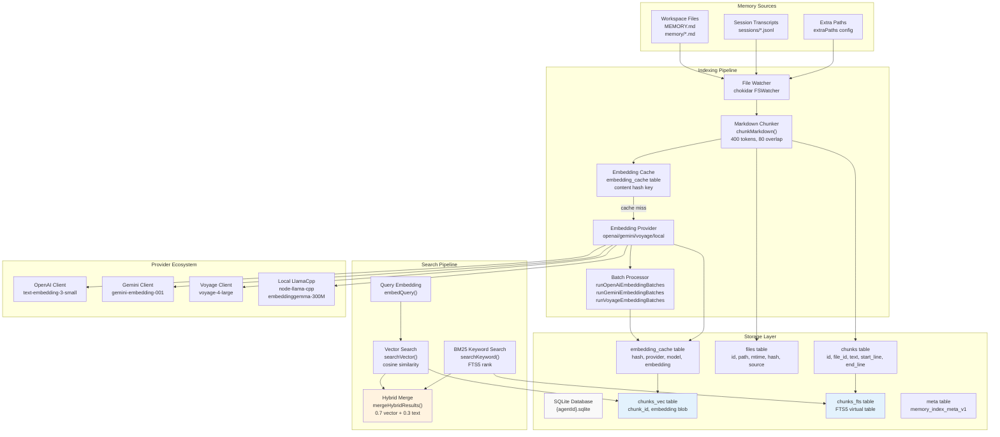
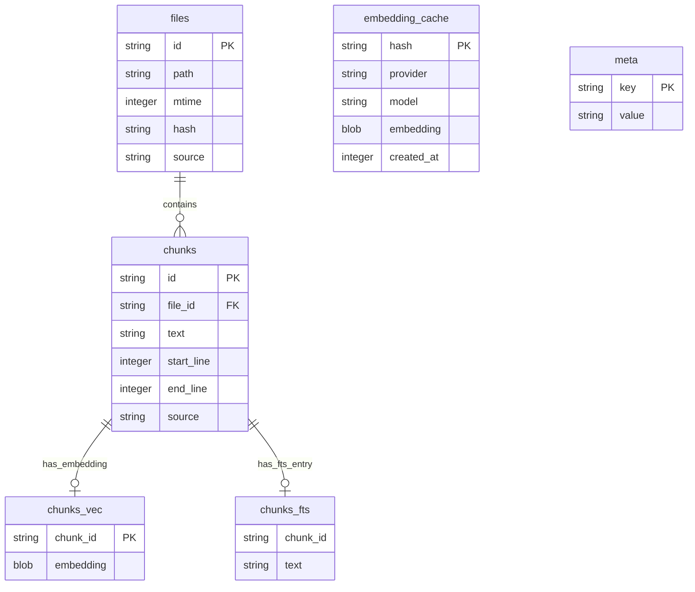
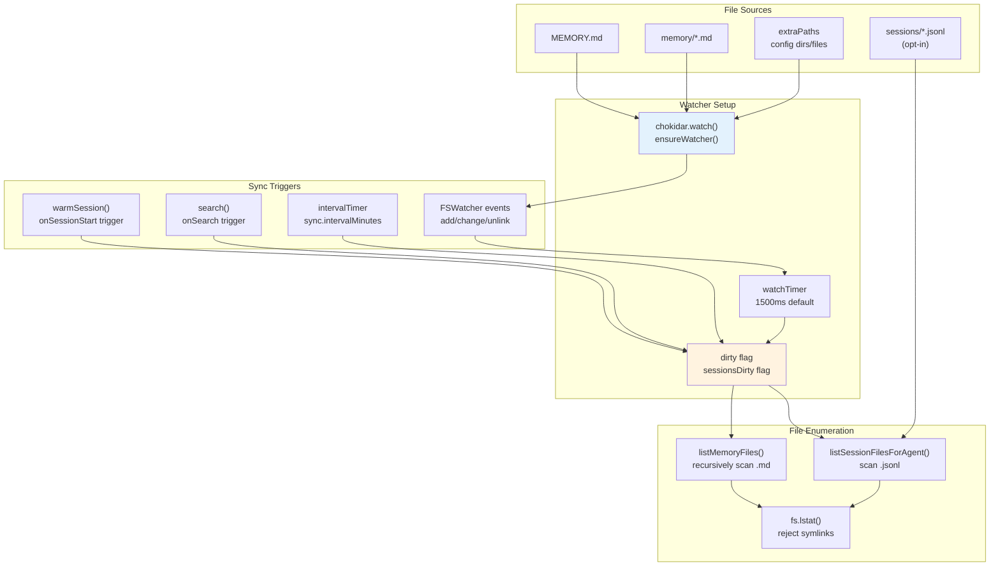
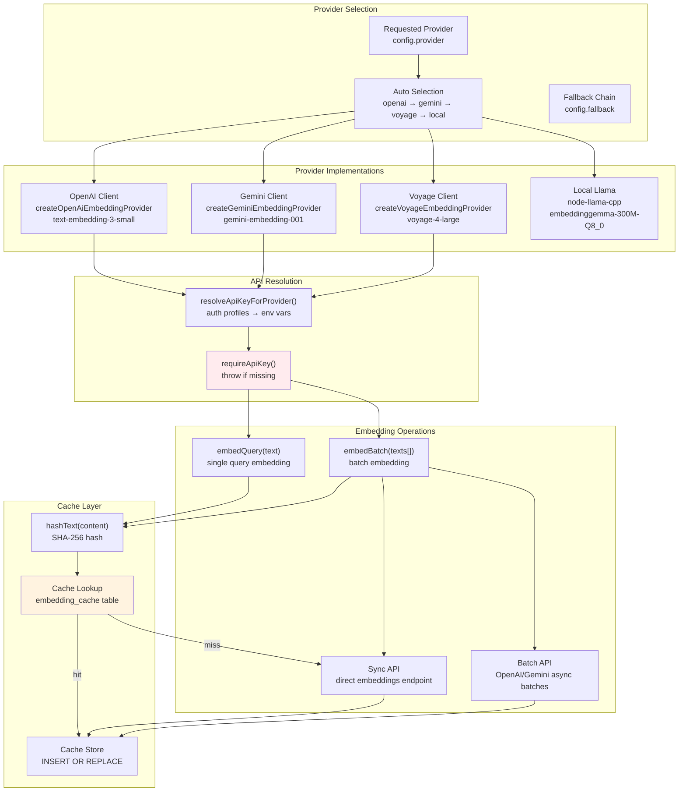
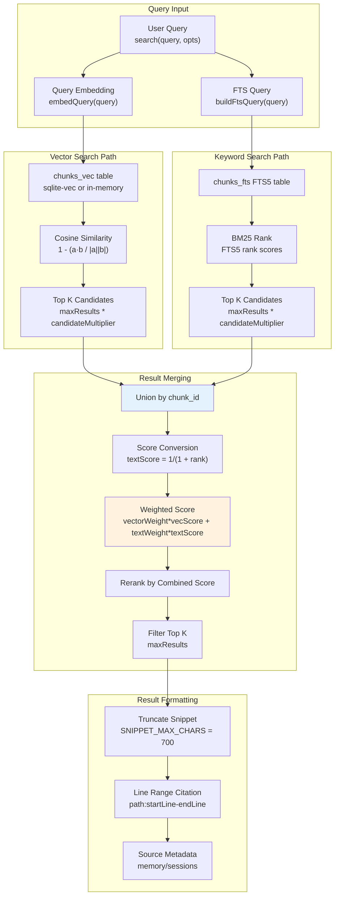
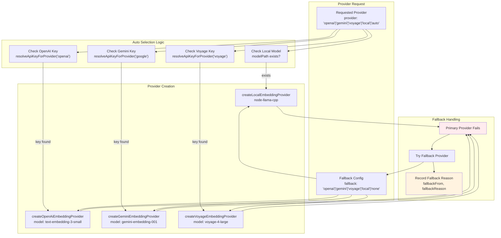
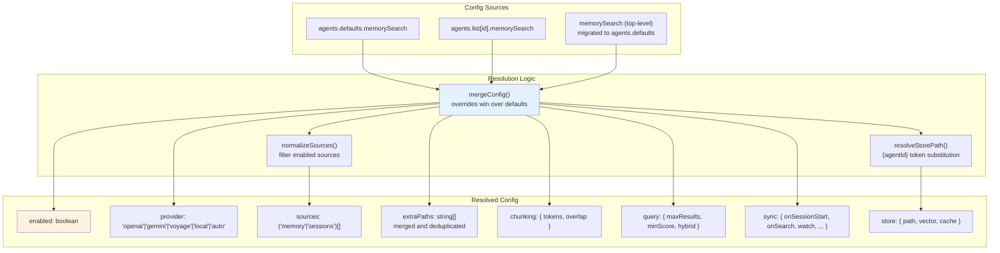

# Page: Memory System

# メモリシステム

<details>
<summary>関連ソースファイル</summary>

この Wiki ページの生成に使用されたコンテキストファイル:

- [CHANGELOG.md](CHANGELOG.md)
- [docs/cli/memory.md](docs/cli/memory.md)
- [docs/cli/sandbox.md](docs/cli/sandbox.md)
- [docs/concepts/memory.md](docs/concepts/memory.md)
- [docs/gateway/configuration.md](docs/gateway/configuration.md)
- [docs/gateway/sandbox-vs-tool-policy-vs-elevated.md](docs/gateway/sandbox-vs-tool-policy-vs-elevated.md)
- [docs/gateway/sandboxing.md](docs/gateway/sandboxing.md)
- [docs/platforms/mac/skills.md](docs/platforms/mac/skills.md)
- [docs/tools/elevated.md](docs/tools/elevated.md)
- [docs/tools/index.md](docs/tools/index.md)
- [docs/tools/skills-config.md](docs/tools/skills-config.md)
- [src/agents/memory-search.test.ts](src/agents/memory-search.test.ts)
- [src/agents/memory-search.ts](src/agents/memory-search.ts)
- [src/agents/sandbox-explain.test.ts](src/agents/sandbox-explain.test.ts)
- [src/agents/sandbox.ts](src/agents/sandbox.ts)
- [src/cli/memory-cli.test.ts](src/cli/memory-cli.test.ts)
- [src/cli/memory-cli.ts](src/cli/memory-cli.ts)
- [src/cli/models-cli.test.ts](src/cli/models-cli.test.ts)
- [src/config/schema.ts](src/config/schema.ts)
- [src/config/types.tools.ts](src/config/types.tools.ts)
- [src/config/types.ts](src/config/types.ts)
- [src/config/zod-schema.agent-runtime.ts](src/config/zod-schema.agent-runtime.ts)
- [src/config/zod-schema.ts](src/config/zod-schema.ts)
- [src/memory/embeddings.test.ts](src/memory/embeddings.test.ts)
- [src/memory/embeddings.ts](src/memory/embeddings.ts)
- [src/memory/manager.ts](src/memory/manager.ts)

</details>

## 目的と範囲

メモリシステムは、ワークスペースの Markdown ファイルとセッションのトランスクリプトに対してセマンティック検索を提供し、エージェントが過去の会話や整理されたノートから関連するコンテキストを取得できるようにします。ベクトルエンベディングとキーワード検索（BM25）を組み合わせたハイブリッド検索、複数のエンベディングプロバイダー（OpenAI、Gemini、Voyage、ローカルモデル）のサポート、自動同期機能を持つ SQLite ベースのインデックスを維持します。

メモリファイルの構成とワークスペースレイアウトについては、[エージェントワークスペース](#6)を参照してください。エージェントでのメモリツールの使用については、[組み込みツール](#6.1)を参照してください。メモリ設定のリファレンスについては、[設定リファレンス](#4.1)を参照してください。

---

## アーキテクチャ概要

メモリシステムは、**インデックス作成**（ファイル監視、チャンキング、エンベディング生成）、**ストレージ**（ベクトルおよび全文検索拡張機能付き SQLite）、**検索**（ハイブリッドベクトル+BM25取得）の3つの主要なサブシステムで構成されています。



**参照元:** [src/memory/manager.ts:1-1133](), [docs/concepts/memory.md:1-568]()

---

## ストレージ層

メモリシステムは、`~/.openclaw/memory/{agentId}.sqlite` に保存されるエージェントごとの SQLite データベースを使用します。データベーススキーマには5つの主要なテーブルが含まれ、拡張機能を通じてベクトル検索と全文検索の両方をサポートしています。

### データベーススキーマ



**テーブルの説明:**

- **`files`** — ソースタイプ（`memory` または `sessions`）、更新時刻、変更検出用のコンテンツハッシュを持つインデックス済み Markdown ファイルを追跡
- **`chunks`** — 引用用の行範囲メタデータを持つチャンク分割されたテキストセグメントを保存
- **`chunks_vec`** — Float32 エンベディングを BLOB として保存する仮想テーブル（sqlite-vec が利用可能な場合は `vec0`）
- **`chunks_fts`** — BM25 キーワード検索用の FTS5 仮想テーブル
- **`embedding_cache`** — 冗長な API 呼び出しを避けるため `(hash, provider, model)` でキー設定されたコンテンツアドレス指定キャッシュ
- **`meta`** — プロバイダー、モデル、チャンキングパラメータ、ベクトル次元数を含むインデックスメタデータを保存

**参照元:** [src/memory/manager.ts:69-106](), [src/memory/memory-schema.ts:1-200]()

### スキーマ初期化

スキーマの作成と検証は `ensureMemoryIndexSchema()` によって処理され、不足している場合はテーブルを作成し、スキーマの整合性を検証します。`meta` テーブルはプロバイダー/モデル/チャンキングのフィンガープリントを持つ `memory_index_meta_v1` を保存し、不一致がある場合は自動的に再インデックスがトリガーされます。

**参照元:** [src/memory/memory-schema.ts:1-200](), [src/memory/manager.ts:227-248]()

---

## インデックス作成パイプライン

### ファイル検出と監視

`MemoryIndexManager` は `chokidar` を使用して、ワークスペースのメモリディレクトリ（`MEMORY.md`、`memory/*.md`）とオプションの `extraPaths` を監視します。ファイルの変更はデバウンスされた同期操作をトリガーします。



**参照元:** [src/memory/manager.ts:243-267](), [src/memory/internal.ts:1-500](), [src/memory/session-files.ts:1-200]()

### チャンキング戦略

Markdown ファイルは、コンテキストの境界を保持するためにオーバーラップするチャンクに分割されます。`chunkMarkdown()` 関数はトークンベースのスライディングウィンドウを使用します。

**パラメータ:**
- `chunkTokens`: ターゲットチャンクサイズ（デフォルト 400 トークン）
- `chunkOverlap`: チャンク間のオーバーラップ（デフォルト 80 トークン）
- トークン推定: 単純な空白分割の近似（約1トークン/単語）

**アルゴリズム:**
1. テキストを行に分割
2. トークンターゲットに達するまで行を蓄積
3. しきい値を超えたら、行範囲を持つチャンクを出力
4. `overlap` トークン分ウィンドウを戻して継続

**参照元:** [src/memory/internal.ts:200-350](), [src/agents/memory-search.ts:76-86]()

### エンベディング生成

エンベディングは、自動フォールバック付きで複数のバックエンドをサポートする `EmbeddingProvider` 抽象化を通じて生成されます。



**参照元:** [src/memory/embeddings.ts:1-300](), [src/memory/embeddings-openai.ts:1-200](), [src/memory/embeddings-gemini.ts:1-200](), [src/memory/embeddings-voyage.ts:1-200]()

### バッチ処理

大規模なインデックス作成操作の場合、メモリシステムは OpenAI、Gemini、Voyage の非同期バッチエンベディング API をサポートしています。バッチ処理はコストを削減し、スループットを向上させます。

**バッチ設定:**
```typescript
remote: {
  batch: {
    enabled: boolean;        // default: false
    wait: boolean;           // default: true (poll until complete)
    concurrency: number;     // default: 2 (parallel batch jobs)
    pollIntervalMs: number;  // default: 2000
    timeoutMinutes: number;  // default: 60
  }
}
```

**バッチワークフロー:**
1. テキストをバッチにチャンク（各バッチ最大 8000 トークン）
2. プロバイダー API を通じてバッチジョブを送信（`runOpenAiEmbeddingBatches`、`runGeminiEmbeddingBatches`、`runVoyageEmbeddingBatches`）
3. 完了するまでバッチステータスをポーリング（または `wait: false` の場合はファイアアンドフォーゲット）
4. 結果を取得し、キャッシュ + ベクターテーブルを更新

**バッチ失敗処理:**
- 失敗回数を追跡（`batchFailureCount`）
- `BATCH_FAILURE_LIMIT`（2回）の失敗後、セッションのバッチ処理を無効化
- 同期 API にフォールバック

**参照元:** [src/memory/manager.ts:900-1100](), [src/memory/batch-openai.ts:1-400](), [src/memory/batch-gemini.ts:1-400](), [src/memory/batch-voyage.ts:1-400]()

### 同期オーケストレーション

`sync()` メソッドは完全なインデックス作成パイプラインをオーケストレーションします:

1. **ファイル検出** — 変更されたファイルをリスト（メモリ + セッション）
2. **データベースクリーンアップ** — 削除/変更されたファイルの古いエントリを削除
3. **チャンキング** — ファイルを行範囲を持つチャンクに分割
4. **エンベディングルックアップ** — 各チャンクのキャッシュをチェック
5. **バッチエンベディング** — キャッシュミスのエンベディングを生成
6. **ストレージ** — チャンク、エンベディング、FTS エントリを挿入
7. **進捗報告** — コールバックを通じて同期進捗更新を発行

**参照元:** [src/memory/manager.ts:390-700]()

---

## 検索システム

### ハイブリッド検索アーキテクチャ

メモリシステムは、ベクトル類似度（セマンティック理解）と BM25 キーワードマッチング（正確なトークン関連性）を組み合わせ、最終的なランキングのために重み付けと統合を行うハイブリッド検索を実装しています。



**参照元:** [src/memory/manager.ts:265-314](), [src/memory/manager-search.ts:1-300](), [src/memory/hybrid.ts:1-200]()

### ベクトル検索の実装

ベクトル検索はコサイン類似度を使用して、セマンティック関連性でチャンクをランク付けします。sqlite-vec 拡張機能が利用可能な場合、クエリはデータベース内で実行され、それ以外の場合はエンベディングが JS ベースの距離計算のためにメモリにロードされます。

**sqlite-vec パス:**
```sql
SELECT c.id, c.text, c.start_line, c.end_line, c.source, f.path,
       vec_distance_cosine(v.embedding, ?) as distance
FROM chunks c
JOIN files f ON c.file_id = f.id
JOIN chunks_vec v ON c.id = v.chunk_id
WHERE 1=1 AND <source_filter>
ORDER BY distance ASC
LIMIT ?
```

**フォールバックパス:**
1. `chunks_vec` からすべてのエンベディングをロード
2. JS でコサイン距離を計算: `1 - dot(a, b) / (norm(a) * norm(b))`
3. 距離でソート（昇順）
4. 上位 K 件を返す

**参照元:** [src/memory/manager-search.ts:50-200](), [src/memory/sqlite-vec.ts:1-100]()

### BM25 キーワード検索

BM25 検索は、トークンベースのランキングに SQLite の FTS5 仮想テーブルを使用します。`buildFtsQuery()` 関数はユーザークエリを FTS5 構文に変換します。

**クエリ変換:**
- 特別な FTS5 演算子を削除（`NEAR`、`AND`、`OR`、`NOT`）
- トークン順序を保持するためにフレーズを引用符で囲む
- `NOT` 演算子で否定を処理

**FTS5 クエリ:**
```sql
SELECT c.id, c.text, c.start_line, c.end_line, c.source, f.path,
       rank as bm25_rank
FROM chunks_fts fts
JOIN chunks c ON fts.chunk_id = c.id
JOIN files f ON c.file_id = f.id
WHERE fts MATCH ? AND <source_filter>
ORDER BY rank
LIMIT ?
```

**スコア変換:**
`textScore = 1 / (1 + max(0, bm25_rank))`

**参照元:** [src/memory/manager-search.ts:200-350](), [src/memory/hybrid.ts:1-100]()

### ハイブリッド結果マージ

ベクトルとキーワードパスからの結果はチャンク ID で統合され、結合スコアが割り当てられます:

```
finalScore = vectorWeight * vectorScore + textWeight * textScore
```

**デフォルトの重み:**
- `vectorWeight`: 0.7（セマンティック関連性）
- `textWeight`: 0.3（キーワードマッチ）

**設定可能:**
```typescript
agents.defaults.memorySearch.query.hybrid: {
  enabled: boolean;
  vectorWeight: number;
  textWeight: number;
  candidateMultiplier: number;  // expand candidates before merge
}
```

**参照元:** [src/memory/hybrid.ts:80-180](), [src/memory/manager.ts:305-314]()

---

## エンベディングプロバイダー

### プロバイダー選択とフォールバック

メモリシステムは、リクエストされたプロバイダーが失敗した場合に自動フォールバックを行う4つのエンベディングプロバイダータイプをサポートしています。



**参照元:** [src/memory/embeddings.ts:75-250](), [src/memory/manager.ts:169-203]()

### OpenAI プロバイダー

**実装:** `createOpenAiEmbeddingProvider()`

**機能:**
- デフォルトモデル: `text-embedding-3-small`（1536 次元）
- `runOpenAiEmbeddingBatches()` による Batch API サポート
- カスタムエンドポイントサポート（`remote.baseUrl`）
- プロキシシナリオ用のヘッダーマージング

**API キー解決:**
1. `remote.apiKey`（明示的なオーバーライド）
2. `models.providers.openai.apiKey`
3. 認証プロファイル（`auth.profiles[].provider=openai`）
4. `OPENAI_API_KEY` 環境変数

**参照元:** [src/memory/embeddings-openai.ts:1-200](), [src/memory/batch-openai.ts:1-400]()

### Gemini プロバイダー

**実装:** `createGeminiEmbeddingProvider()`

**機能:**
- デフォルトモデル: `gemini-embedding-001`（768 次元）
- ネイティブ Gemini エンベディング API（OpenAI 互換ではない）
- `runGeminiEmbeddingBatches()` による Batch API サポート
- タスクタイプサポート（`RETRIEVAL_DOCUMENT`、`RETRIEVAL_QUERY`）

**API キー解決:**
1. `remote.apiKey`
2. `models.providers.google.apiKey`
3. 認証プロファイル（`auth.profiles[].provider=google`）
4. `GEMINI_API_KEY` 環境変数

**参照元:** [src/memory/embeddings-gemini.ts:1-200](), [src/memory/batch-gemini.ts:1-400]()

### Voyage プロバイダー

**実装:** `createVoyageEmbeddingProvider()`

**機能:**
- デフォルトモデル: `voyage-4-large`（1024 次元）
- `runVoyageEmbeddingBatches()` による Batch API サポート
- 入力タイプ指定（`input_type: "document"/"query"`）
- OpenAI 互換エンドポイント

**API キー解決:**
1. `remote.apiKey`
2. `models.providers.voyage.apiKey`
3. 認証プロファイル（`auth.profiles[].provider=voyage`）
4. `VOYAGE_API_KEY` 環境変数

**参照元:** [src/memory/embeddings-voyage.ts:1-200](), [src/memory/batch-voyage.ts:1-400]()

### ローカルプロバイダー (node-llama-cpp)

**実装:** `createLocalEmbeddingProvider()`

**機能:**
- デフォルトモデル: `hf:ggml-org/embeddinggemma-300M-GGUF/embeddinggemma-300M-Q8_0.gguf`
- 初回使用時に HuggingFace から自動ダウンロード
- API キー不要
- 初回ダウンロード後は完全にオフラインで動作

**モデル解決:**
1. `local.modelPath` 設定をチェック
2. `hf:` プレフィックスの場合、`node-llama-cpp` HF ローダーで解決
3. ローカルパスの場合、GGUF ファイルを解決してロード
4. デフォルトモデルにフォールバック

**参照元:** [src/memory/embeddings.ts:82-160](), [src/memory/node-llama.ts:1-100]()

---

## 設定解決

メモリ検索設定は、グローバルデフォルト（`agents.defaults.memorySearch`）とエージェントごとのオーバーライド（`agents.list[].memorySearch`）をマージして解決されます。`resolveMemorySearchConfig()` 関数がこのマージを処理します。



**マージルール:**
- エージェントごとの設定はグローバルデフォルトをオーバーライド
- 配列フィールド（例: `extraPaths`、`sources`）はマージされ重複排除
- ネストされたオブジェクト（例: `chunking`、`query.hybrid`）は再帰的にマージ
- 明示的な `enabled: false` はそのエージェントのメモリ検索を無効化

**デフォルト値:**
```typescript
{
  enabled: true,
  sources: ["memory"],
  provider: "auto",
  fallback: "none",
  chunking: { tokens: 400, overlap: 80 },
  query: {
    maxResults: 6,
    minScore: 0.35,
    hybrid: {
      enabled: true,
      vectorWeight: 0.7,
      textWeight: 0.3,
      candidateMultiplier: 4
    }
  },
  sync: {
    onSessionStart: true,
    onSearch: true,
    watch: true,
    watchDebounceMs: 1500,
    intervalMinutes: 0
  },
  cache: { enabled: true, maxEntries: 50000 },
  store: { vector: { enabled: true } }
}
```

**参照元:** [src/agents/memory-search.ts:1-220](), [src/config/types.tools.ts:224-307]()

---

## CLI インターフェース

メモリシステムは `openclaw memory` を通じて3つの CLI コマンドを公開しています:

### `openclaw memory status`

インデックスステータス、ソース数、プロバイダー情報、オプションの詳細プローブを表示します。

**使用方法:**
```bash
openclaw memory status [--agent <id>] [--deep] [--index] [--verbose] [--json]
```

**フラグ:**
- `--agent <id>`: 単一エージェントにスコープ（デフォルト: 設定されたすべてのエージェント）
- `--deep`: ベクトル可用性とエンベディングプロバイダーの準備状況をプローブ
- `--index`: 完全再インデックスを実行（`--deep` を含意）
- `--verbose`: 詳細なインデックス作成ログを出力
- `--json`: フォーマットされたテキストの代わりに JSON を出力

**出力:**
- ソースごとのインデックス済みファイル/チャンク（memory、sessions）
- バックエンドタイプ（builtin または qmd）
- プロバイダーとモデル
- ベクトルステータス（有効、利用可能、次元数、拡張パス）
- FTS ステータス（有効、利用可能）
- エンベディングキャッシュステータス（エントリ数、最大）
- バッチ処理ステータス（有効、失敗、設定）
- フォールバック理由（該当する場合）

**参照元:** [src/cli/memory-cli.ts:243-370](), [docs/cli/memory.md:1-46]()

### `openclaw memory index`

メモリソースの完全な再インデックスを手動でトリガーします。

**使用方法:**
```bash
openclaw memory index [--agent <id>] [--force] [--verbose]
```

**フラグ:**
- `--agent <id>`: 単一エージェントにスコープ
- `--force`: インデックスがクリーンでも強制再インデックス
- `--verbose`: 詳細なインデックス作成ログを出力

**動作:**
1. `manager.sync({ reason: "cli", force: true })` を呼び出し
2. プログレスバーで進捗を報告
3. インデックス作成失敗時は終了コード 1 で終了

**参照元:** [src/cli/memory-cli.ts:281-310](), [docs/cli/memory.md:22-46]()

### `openclaw memory search`

メモリ検索を実行し結果を表示します。

**使用方法:**
```bash
openclaw memory search "<query>" [--agent <id>] [--max-results <n>] [--json]
```

**フラグ:**
- `--agent <id>`: 単一エージェントにスコープ
- `--max-results <n>`: デフォルトの最大結果数をオーバーライド
- `--json`: フォーマットされたテキストの代わりに JSON を出力

**出力:**
- スニペットテキスト（700 文字に切り捨て）
- ファイルパスと行範囲
- ソースタイプ（memory/sessions）
- 結合スコア
- 使用されたプロバイダーとモデル

**参照元:** [src/cli/memory-cli.ts:450-550](), [docs/cli/memory.md:22-46]()

---

## ツール統合

メモリシステムは2つのツールをエージェントに公開しています: `memory_search` と `memory_get`。

### `memory_search` ツール

**目的:** ワークスペースメモリとセッショントランスクリプトに対するセマンティック検索。

**パラメータ:**
```typescript
{
  query: string;              // required
  maxResults?: number;        // default from config
  minScore?: number;          // default from config
}
```

**戻り値:**
```typescript
{
  results: Array<{
    snippet: string;          // truncated to ~700 chars
    path: string;             // workspace-relative path
    startLine: number;        // citation line range
    endLine: number;
    score: number;            // combined vector+text score
    source: "memory"|"sessions";
    provider: string;         // embedding provider used
    model: string;            // embedding model used
  }>;
  backend: "builtin"|"qmd";
  totalResults: number;
}
```

**認可:** エージェントに対して `memorySearch.enabled` が true と解決される場合にのみ利用可能。

**参照元:** [src/memory/manager.ts:265-314](), [docs/concepts/memory.md:350-362]()

### `memory_get` ツール

**目的:** パスで特定のメモリファイルを読み込む。

**パラメータ:**
```typescript
{
  relPath: string;            // required (workspace-relative)
  from?: number;              // start line (1-indexed)
  lines?: number;             // line count
}
```

**戻り値:**
```typescript
{
  text: string;               // file content (or line slice)
  path: string;               // workspace-relative path
}
```

**パス検証:**
- ワークスペースメモリファイル（`MEMORY.md`、`memory/*.md`）に制限
- `extraPaths` 設定からの追加許可パス
- シンボリックリンクは拒否
- Markdown 以外のファイルは拒否

**参照元:** [src/memory/manager.ts:405-468](), [docs/concepts/memory.md:350-362]()

---

## QMD バックエンド（実験的）

メモリシステムは、組み込みの SQLite インデクサーの代替としてオプションの QMD（Query Memory Database）バックエンドをサポートしています。QMD は、BM25 + ベクトル + リランキングを組み合わせたローカルファーストの検索サイドカーです。

**設定:**
```json5
{
  memory: {
    backend: "qmd",
    citations: "auto",
    qmd: {
      command: "qmd",
      searchMode: "query",
      includeDefaultMemory: true,
      paths: [{ name: "docs", path: "~/notes", pattern: "**/*.md" }],
      update: { interval: "5m", debounceMs: 15000 },
      limits: { maxResults: 6, timeoutMs: 4000 }
    }
  }
}
```

**主な違い:**
- QMD は独立した CLI プロセスとして実行（PATH 上の `qmd` バイナリ）
- ローカルエンベディングに Bun + `node-llama-cpp` を使用
- `~/.openclaw/agents/{agentId}/qmd/` 配下の XDG ディレクトリに状態を保存
- 追加の検索モード（`query`、`search`、`vsearch`）をサポート
- 初回使用時に HuggingFace から GGUF モデルを自動ダウンロード

**フォールバック:** QMD サブプロセスが失敗した場合、メモリシステムは自動的に組み込み SQLite インデクサーにフォールバックします。

**参照元:** [docs/concepts/memory.md:107-243](), [src/config/zod-schema.ts:35-93]()

---

## セッショントランスクリプトのインデックス作成

メモリシステムは、最近の会話に対するセマンティック検索のために、オプションでセッショントランスクリプト（JSONL ファイル）をインデックスできます。

**設定:**
```json5
{
  agents: {
    defaults: {
      memorySearch: {
        experimental: { sessionMemory: true },
        sources: ["memory", "sessions"],
        sync: {
          sessions: {
            deltaBytes: 100000,      // ~100 KB threshold
            deltaMessages: 50        // JSONL line threshold
          }
        }
      }
    }
  }
}
```

**動作:**
- `experimental.sessionMemory` フラグでオプトイン
- トランスクリプトは Markdown ファイルと同様にチャンクおよびエンベディング
- セッション更新はデルタしきい値（バイト + メッセージ数）でデバウンス
- バックグラウンドで非同期にインデックス
- 結果には `source: "sessions"` メタデータを含む

**デルタ追跡:**
- `sessionDeltas` マップはセッションファイルごとの最後のインデックスサイズを追跡
- `sessionsDirtyFiles` セットは変更されたファイルを蓄積
- 集計デルタがしきい値を超えるとバッチインデックス作成をトリガー

**参照元:** [src/memory/manager.ts:850-1000](), [src/memory/session-files.ts:1-200](), [docs/concepts/memory.md:462-503]()

---

## パフォーマンスの考慮事項

### エンベディングキャッシュヒット率

エンベディングキャッシュは、再インデックス時と頻繁な更新時のパフォーマンスに不可欠です。キャッシュの効果は以下に依存します:
- コンテンツの安定性（変更されていないチャンク = キャッシュヒット）
- プロバイダー/モデルの一貫性（両方でキー設定されたキャッシュ）
- キャッシュサイズ制限（`cache.maxEntries`）

**メトリクス:** キャッシュの成長を監視するには `status().cache.entries` をチェック。

### sqlite-vec アクセラレーション

sqlite-vec 拡張機能が利用可能な場合、ベクトル検索は完全に SQLite 内で実行され、エンベディング配列の大きなメモリ割り当てを回避できます。sqlite-vec がない場合、コサイン類似度計算のためにすべてのエンベディングが JS にロードされます。

**検出:** `status().vector.available`（true/false/null）をチェック。

### Batch API スループット

Batch API（OpenAI、Gemini、Voyage）は、大規模コーパスのインデックス作成においてエンベディングコストとレイテンシを大幅に削減します。`remote.batch.enabled: true` で有効化。

**トレードオフ:** バッチジョブは非同期です。`wait: true`（デフォルト）は完了まで同期をブロックし、`wait: false` は即座に復帰しますがエンベディング生成を延期します。

### FTS5 vs No-FTS フォールバック

FTS5 が利用できない場合（`fts5` モジュールがない）、ハイブリッド検索はベクトルのみのモードにフォールバックします。正確なトークンマッチングは低下しますが、セマンティック検索は維持されます。

**検出:** `status().fts.available`（true/false）と `status().fts.loadError` をチェック。

**参照元:** [src/memory/manager.ts:470-565](), [docs/concepts/memory.md:370-423]()
