# Page: Memory Configuration

# メモリ設定

<details>
<summary>関連ソースファイル</summary>

この Wiki ページの生成に使用されたコンテキストファイル:

- [CHANGELOG.md](CHANGELOG.md)
- [docs/cli/memory.md](docs/cli/memory.md)
- [docs/cli/sandbox.md](docs/cli/sandbox.md)
- [docs/concepts/memory.md](docs/concepts/memory.md)
- [docs/gateway/configuration.md](docs/gateway/configuration.md)
- [docs/gateway/sandbox-vs-tool-policy-vs-elevated.md](docs/gateway/sandbox-vs-tool-policy-vs-elevated.md)
- [docs/gateway/sandboxing.md](docs/gateway/sandboxing.md)
- [docs/platforms/mac/skills.md](docs/platforms/mac/skills.md)
- [docs/tools/elevated.md](docs/tools/elevated.md)
- [docs/tools/index.md](docs/tools/index.md)
- [docs/tools/skills-config.md](docs/tools/skills-config.md)
- [src/agents/memory-search.test.ts](src/agents/memory-search.test.ts)
- [src/agents/memory-search.ts](src/agents/memory-search.ts)
- [src/agents/sandbox-explain.test.ts](src/agents/sandbox-explain.test.ts)
- [src/agents/sandbox.ts](src/agents/sandbox.ts)
- [src/cli/memory-cli.test.ts](src/cli/memory-cli.test.ts)
- [src/cli/memory-cli.ts](src/cli/memory-cli.ts)
- [src/cli/models-cli.test.ts](src/cli/models-cli.test.ts)
- [src/config/schema.ts](src/config/schema.ts)
- [src/config/types.tools.ts](src/config/types.tools.ts)
- [src/config/types.ts](src/config/types.ts)
- [src/config/zod-schema.agent-runtime.ts](src/config/zod-schema.agent-runtime.ts)
- [src/config/zod-schema.ts](src/config/zod-schema.ts)
- [src/memory/embeddings.test.ts](src/memory/embeddings.test.ts)
- [src/memory/embeddings.ts](src/memory/embeddings.ts)
- [src/memory/manager.ts](src/memory/manager.ts)

</details>

このページは、メモリシステムの設定サーフェスを文書化しています。メモリ設定は、エンベディングプロバイダー、ストレージバックエンド（組み込み SQLite または QMD サイドカー）、インデックス作成動作、および検索パラメータを制御します。これらの設定は `memory.*`（バックエンド選択）と `agents.defaults.memorySearch.*`（エージェントごとのインデックス作成動作）の下にあります。

ランタイムのメモリ検索動作とメモリファイルレイアウトについては、[メモリ](#7)を参照してください。メモリインデックス作成操作については、[メモリインデックス作成](#7.2)を参照してください。メモリ検索メカニズムについては、[メモリ検索](#7.3)を参照してください。

---

## 設定階層

メモリ設定は、複数のレイヤーから設定をマージします:

1. **グローバルバックエンド設定**（`memory.*`）— バックエンド選択、QMD 設定、引用モード
2. **エージェントデフォルト**（`agents.defaults.memorySearch.*`）— エンベディングプロバイダー、ストレージ、チャンキング、同期、クエリ設定
3. **エージェントごとのオーバーライド**（`agents.list[].memorySearch.*`）— すべての設定に対するエージェント固有のオーバーライド

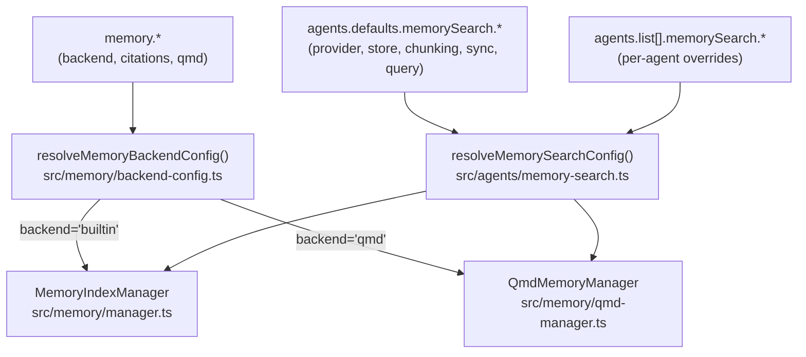

**参照元:** [src/memory/backend-config.ts:1-212](), [src/agents/memory-search.ts:1-241]()

---

## バックエンド選択

グローバル `memory.backend` 設定は、インデックス作成および検索エンジンを選択します:

| バックエンド | 説明 | 設定キー | 実装 |
|---------|-------------|------------|----------------|
| `builtin` | SQLite + sqlite-vec、完全組み込み | `memory.backend = "builtin"` | [src/memory/manager.ts:108-606]() |
| `qmd` | 外部 [QMD](https://github.com/tobi/qmd) サイドカープロセス | `memory.backend = "qmd"` | [src/memory/qmd-manager.ts:51-625]() |

### 設定スキーマ

```json5
{
  memory: {
    backend: "builtin",           // "builtin" or "qmd"
    citations: "auto",            // "auto", "on", "off"
    qmd: { /* QMD-specific config (see below) */ }
  }
}
```

**バックエンド選択フロー:**

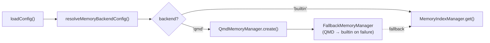

**参照元:** [src/memory/backend-config.ts:57-68](), [src/memory/search-manager.ts:19-65]()

---

## エンベディングプロバイダー設定

`agents.defaults.memorySearch.provider` 設定は、ベクトルインデックス作成に使用するエンベディング API またはローカルモデルを制御します。

### プロバイダーオプション

| プロバイダー | 説明 | デフォルトモデル | 設定キー |
|----------|-------------|---------------|------------|
| `openai` | OpenAI エンベディング API | `text-embedding-3-small` | `provider: "openai"` |
| `gemini` | Google Gemini エンベディング API | `gemini-embedding-001` | `provider: "gemini"` |
| `local` | node-llama-cpp 経由のローカル GGUF | `hf:ggml-org/embeddinggemma-300M-GGUF/...` | `provider: "local"` |
| `auto` | 利用可能なキー/ファイルに基づいて自動選択 | — | `provider: "auto"` (default) |

### プロバイダー解決

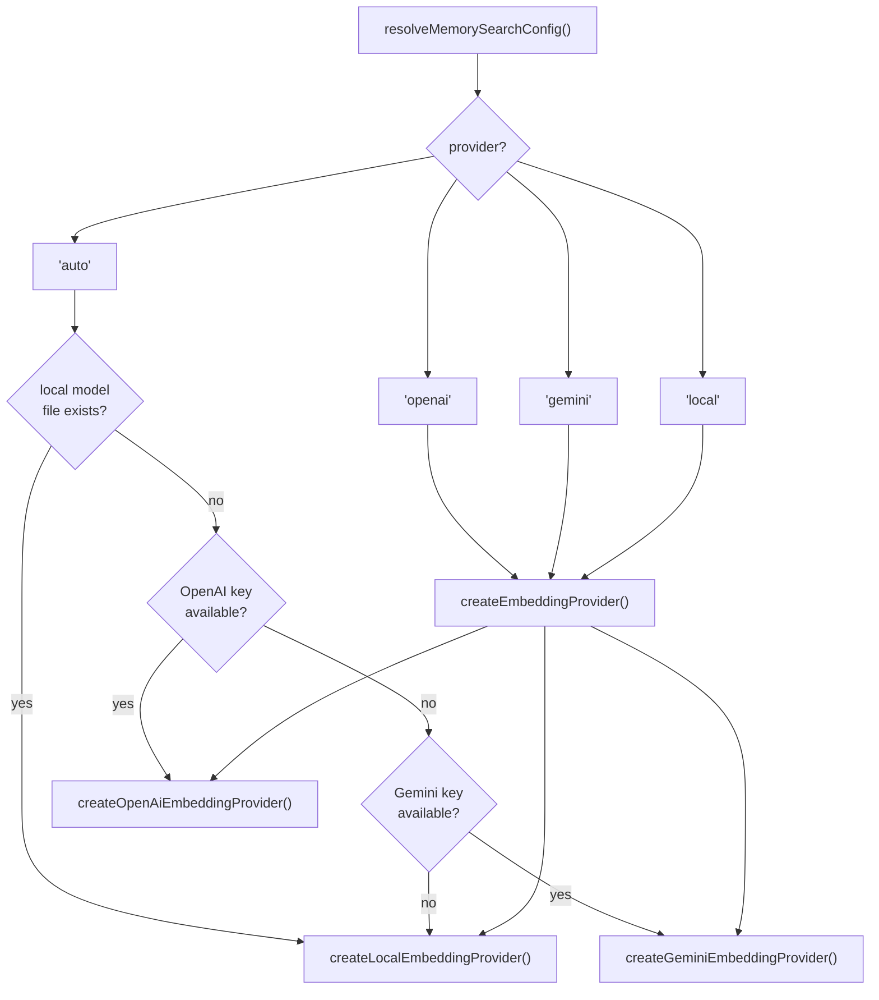

**参照元:** [src/agents/memory-search.ts:73-241](), [src/memory/embeddings.ts:37-183]()

### リモートプロバイダー設定

`openai` および `gemini` プロバイダーの場合、`remote` セクションでカスタムエンドポイントとヘッダーを設定できます:

```json5
{
  agents: {
    defaults: {
      memorySearch: {
        provider: "openai",
        model: "text-embedding-3-small",
        remote: {
          baseUrl: "https://api.openrouter.ai/v1",  // override endpoint
          apiKey: "sk-...",                          // explicit API key
          headers: { "X-Custom": "value" },          // extra headers
          batch: {
            enabled: true,      // use batch API (OpenAI/Gemini)
            wait: true,         // wait for batch completion
            concurrency: 2,     // max concurrent batch jobs
            pollIntervalMs: 2000,
            timeoutMinutes: 60
          }
        }
      }
    }
  }
}
```

**OpenAI Batch API:** `remote.batch.enabled = true` の場合、組み込みバックエンドは大規模なバックフィルに [OpenAI Batch API](https://platform.openai.com/docs/api-reference/batch) を使用し、割引価格と非同期処理を提供します。

**参照元:** [src/memory/manager.ts:120-243](), [src/memory/batch-openai.ts:1-282](), [src/memory/batch-gemini.ts:1-220]()

### ローカルプロバイダー設定

`local` プロバイダーの場合、GGUF モデルパスまたは Hugging Face URI を指定します:

```json5
{
  agents: {
    defaults: {
      memorySearch: {
        provider: "local",
        local: {
          modelPath: "hf:ggml-org/embeddinggemma-300M-GGUF/embeddinggemma-300M-Q8_0.gguf",
          modelCacheDir: "~/.cache/openclaw-llama"  // optional cache dir
        },
        fallback: "openai"  // fallback if local fails
      }
    }
  }
}
```

**自動ダウンロード:** `modelPath` が `hf:` URI の場合、`node-llama-cpp` はモデルをキャッシュに自動的にダウンロードします。ネイティブバインディングには `pnpm approve-builds` が必要です。

**参照元:** [src/memory/embeddings.ts:77-114](), [src/agents/memory-search.ts:168-171]()

---

## ストレージ設定

`memorySearch.store` セクションは、SQLite インデックスの場所とベクトル拡張機能の設定を制御します。

### ストレージスキーマ

```json5
{
  agents: {
    defaults: {
      memorySearch: {
        store: {
          driver: "sqlite",                              // always "sqlite"
          path: "~/.openclaw/memory/{agentId}.sqlite",   // index DB path
          vector: {
            enabled: true,                                // use sqlite-vec extension
            extensionPath: "/opt/homebrew/lib/sqlite-vec.dylib"  // optional override
          }
        }
      }
    }
  }
}
```

### ストレージパス解決

`path` フィールドはエージェントごとのインデックス用に `{agentId}` トークン置換をサポートしています:

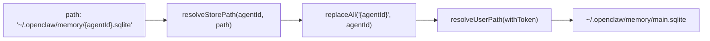

**参照元:** [src/agents/memory-search.ts:109-117]()

### sqlite-vec 拡張機能

`store.vector.enabled = true` の場合、組み込みバックエンドは高速なデータベース内ベクトル検索に [sqlite-vec](https://github.com/asg017/sqlite-vec) を使用します。拡張機能のロードに失敗した場合、マネージャーは JS ベースのコサイン類似度にフォールバックします。

**拡張機能のロード:**

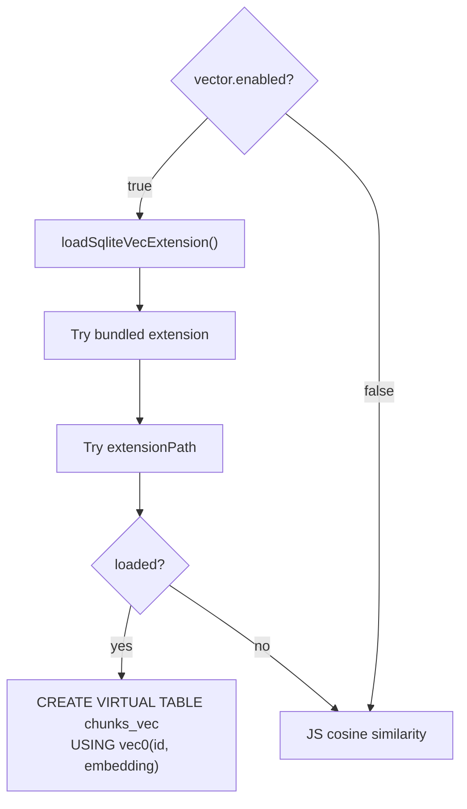

**参照元:** [src/memory/manager.ts:636-688](), [src/memory/sqlite-vec.ts:1-134]()

---

## インデックス作成設定

インデックス作成動作は `memorySearch.sync`（いつ再インデックスするか）、`memorySearch.sources`（何をインデックスするか）、`memorySearch.chunking`（Markdown をどうチャンクするか）で制御されます。

### 同期トリガー

```json5
{
  agents: {
    defaults: {
      memorySearch: {
        sync: {
          onSessionStart: true,       // sync on first message in session
          onSearch: true,             // lazy sync when searching after file changes
          watch: true,                // watch memory files for changes (chokidar)
          watchDebounceMs: 1500,      // debounce file changes before marking dirty
          intervalMinutes: 0,         // periodic sync interval (0 = disabled)
          sessions: {
            deltaBytes: 100000,       // min appended bytes to trigger session reindex
            deltaMessages: 50         // min appended JSONL lines to trigger session reindex
          }
        }
      }
    }
  }
}
```

**同期フロー:**

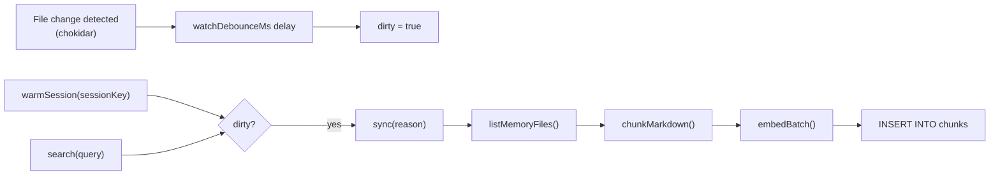

**参照元:** [src/memory/manager.ts:245-259](), [src/memory/manager.ts:807-837](), [src/memory/manager.ts:943-1345]()

### ソース設定

`memorySearch.sources` 配列は何をインデックスするかを制御します:

| ソース | 説明 | インデックスされるファイル |
|--------|-------------|---------------|
| `memory` | デフォルトのワークスペースメモリ | `MEMORY.md`, `memory.md`, `memory/**/*.md` |
| `sessions` | セッショントランスクリプト（実験的） | `~/.openclaw/agents/{agentId}/sessions/*.jsonl` |

**セッションインデックス作成:** `sources` に `"sessions"` が含まれる場合、セッショントランスクリプトはメモリファイルと一緒にチャンクされインデックスされます。`experimental.sessionMemory = true` が必要です。

```json5
{
  agents: {
    defaults: {
      memorySearch: {
        sources: ["memory", "sessions"],
        experimental: { sessionMemory: true }
      }
    }
  }
}
```

**参照元:** [src/config/types.tools.ts:227-228](), [src/agents/memory-search.ts:89-107]()

### チャンキングパラメータ

```json5
{
  agents: {
    defaults: {
      memorySearch: {
        chunking: {
          tokens: 400,    // target chunk size in tokens
          overlap: 80     // overlap between chunks in tokens
        }
      }
    }
  }
}
```

**チャンキングロジック:** Markdown はチャンク境界でコンテキストを保持するために 80 トークンのオーバーラップを持つ約 400 トークンのチャンクに分割されます。`chunkMarkdown()` の実装については [src/memory/internal.ts:155-331]() を参照してください。

**参照元:** [src/memory/internal.ts:155-331](), [src/agents/memory-search.ts:187-190]()

---

## 検索設定

検索動作は `memorySearch.query` 設定で制御されます:

### クエリパラメータ

```json5
{
  agents: {
    defaults: {
      memorySearch: {
        query: {
          maxResults: 6,           // max results returned to agent
          minScore: 0.35,          // min similarity score (0-1)
          hybrid: {
            enabled: true,         // combine vector + BM25
            vectorWeight: 0.7,     // weight for vector similarity (0-1)
            textWeight: 0.3,       // weight for BM25 score (0-1)
            candidateMultiplier: 4 // candidate pool size multiplier
          }
        }
      }
    }
  }
}
```

### ハイブリッド検索

`query.hybrid.enabled = true` の場合、組み込みバックエンドはベクトル類似度（セマンティック）と BM25 全文検索（キーワード）を組み合わせます。これにより、自然言語クエリと正確なトークン（ID、コードシンボル、エラー文字列）の両方の再現率が向上します。

**ハイブリッド検索フロー:**

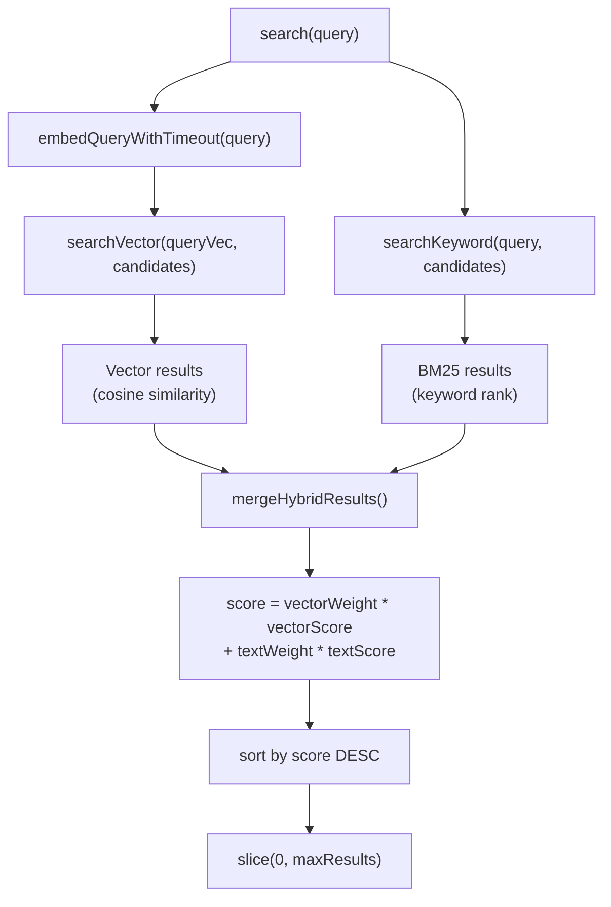

**参照元:** [src/memory/manager.ts:261-309](), [src/memory/hybrid.ts:1-120]()

### エンベディングキャッシュ

`memorySearch.cache` セクションは、再インデックスを高速化するためのチャンクエンベディングキャッシュを制御します:

```json5
{
  agents: {
    defaults: {
      memorySearch: {
        cache: {
          enabled: true,         // cache embeddings in SQLite
          maxEntries: 50000      // optional cap (best-effort)
        }
      }
    }
  }
}
```

**キャッシュキー:** エンベディングは `(provider, model, provider_key, hash(text))` でキャッシュされます。これらのいずれかが変更されると、キャッシュは無効化され再インデックスが行われます。

**参照元:** [src/memory/manager.ts:223-226](), [src/memory/manager.ts:711-759]()

---

## QMD バックエンド設定

`memory.backend = "qmd"` の場合、`memory.qmd` セクションは QMD サイドカープロセスを制御します:

### QMD 設定スキーマ

```json5
{
  memory: {
    backend: "qmd",
    citations: "auto",
    qmd: {
      command: "qmd",                      // qmd binary path
      includeDefaultMemory: true,          // index MEMORY.md + memory/*.md
      paths: [                             // additional paths to index
        {
          path: "~/notes",
          pattern: "**/*.md",              // glob pattern
          name: "notes"                    // stable collection name
        }
      ],
      sessions: {
        enabled: false,                    // index session transcripts
        exportDir: "~/.openclaw/agents/main/qmd/sessions",
        retentionDays: 30                  // prune old exports
      },
      update: {
        interval: "5m",                    // qmd update interval
        debounceMs: 15000,                 // min delay between updates
        onBoot: true,                      // update on gateway start
        embedInterval: "60m"               // qmd embed interval
      },
      limits: {
        maxResults: 6,                     // max results returned
        maxSnippetChars: 700,              // max chars per snippet
        maxInjectedChar: 4000,             // max total chars injected
        timeoutMs: 4000                    // per-query timeout
      },
      scope: {                             // session scope filter
        default: "deny",
        rules: [{ action: "allow", match: { chatType: "direct" } }]
      }
    }
  }
}
```

### QMD マネージャーライフサイクル

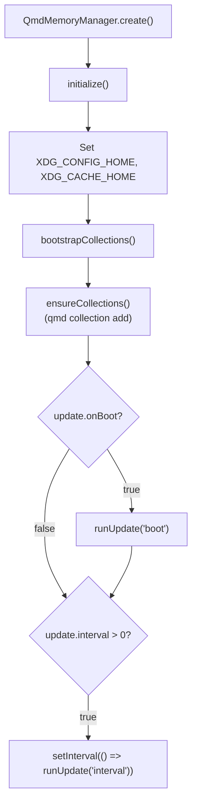

**XDG 環境:** QMD は内部状態に XDG ベースディレクトリを使用します。OpenClaw は `XDG_CONFIG_HOME` と `XDG_CACHE_HOME` を設定して、QMD 状態を `~/.openclaw/agents/{agentId}/qmd/` の下に分離します。

**参照元:** [src/memory/qmd-manager.ts:91-157](), [src/memory/qmd-manager.ts:169-219]()

### QMD コレクション

QMD はインデックスされたパスを「コレクション」として整理します。OpenClaw は `qmd collection add` を通じてコレクションを管理します:

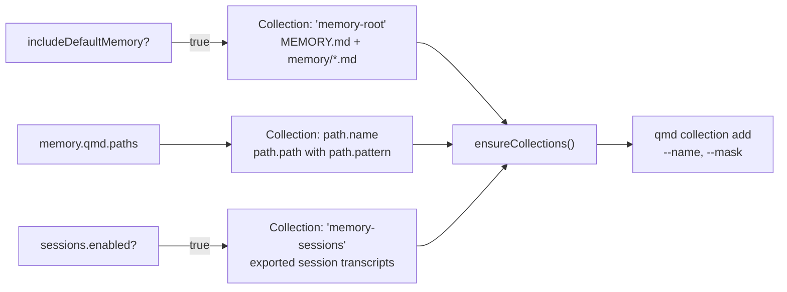

**参照元:** [src/memory/qmd-manager.ts:159-219](), [src/memory/backend-config.ts:135-204]()

### QMD 更新とエンベッド

QMD マネージャーはインターバルで2つのコマンドを実行します:

1. **`qmd update`** — ファイルインデックスを更新（高速、デフォルト: 5m）
2. **`qmd embed`** — エンベディングを再生成（低速、デフォルト: 60m）

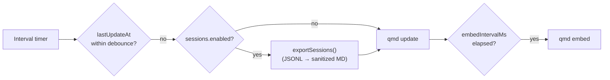

**参照元:** [src/memory/qmd-manager.ts:378-406]()

---

## 設定解決例

### 例 1: OpenAI とバッチインデックス作成

```json5
{
  agents: {
    defaults: {
      memorySearch: {
        provider: "openai",
        model: "text-embedding-3-small",
        remote: {
          batch: { enabled: true, concurrency: 2 }
        },
        store: {
          path: "~/.openclaw/memory/{agentId}.sqlite",
          vector: { enabled: true }
        },
        sync: { watch: true, onSessionStart: true }
      }
    }
  }
}
```

**解決:** 大規模なバックフィルに OpenAI Batch API を使用し、高速検索に sqlite-vec を使用し、メモリファイルの変更を監視します。

**参照元:** [src/agents/memory-search.ts:119-241]()

### 例 2: ローカル GGUF とフォールバック

```json5
{
  agents: {
    defaults: {
      memorySearch: {
        provider: "local",
        local: {
          modelPath: "hf:ggml-org/embeddinggemma-300M-GGUF/embeddinggemma-300M-Q8_0.gguf"
        },
        fallback: "openai",
        store: { vector: { enabled: true } },
        query: { hybrid: { enabled: true } }
      }
    }
  }
}
```

**解決:** 最初にローカル GGUF モデルを試行し、ローカルセットアップが失敗した場合は OpenAI にフォールバックします。最良の結果のためにハイブリッド検索を有効にします。

**参照元:** [src/memory/embeddings.ts:37-183]()

### 例 3: QMD とセッションインデックス作成

```json5
{
  memory: {
    backend: "qmd",
    citations: "on",
    qmd: {
      includeDefaultMemory: true,
      sessions: { enabled: true, retentionDays: 30 },
      update: { interval: "5m", embedInterval: "60m" },
      limits: { maxResults: 8, maxInjectedChars: 6000 },
      scope: {
        default: "deny",
        rules: [
          { action: "allow", match: { chatType: "direct" } }
        ]
      }
    }
  }
}
```

**解決:** QMD サイドカーを使用し、セッショントランスクリプトをインデックスし、ダイレクトチャット（DM ポリシー）でのみ結果を表示します。

**参照元:** [src/memory/backend-config.ts:57-204]()

---

## 設定検証

すべてのメモリ設定はロード時に Zod スキーマに対して検証されます:

| 設定セクション | スキーマ | ファイル |
|----------------|--------|------|
| `agents.defaults.memorySearch` | `MemorySearchSchema` | [src/config/zod-schema.agent-runtime.ts:310-414]() |
| `agents.list[].memorySearch` | `MemorySearchSchema` | [src/config/zod-schema.agent-runtime.ts:310-414]() |
| `memory` | `MemorySchema` | [src/config/zod-schema.ts:1-150]() |

**検証フロー:**

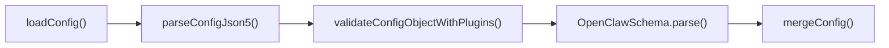

**参照元:** [src/config/validation.ts:1-150](), [src/config/zod-schema.agent-runtime.ts:310-414]()
