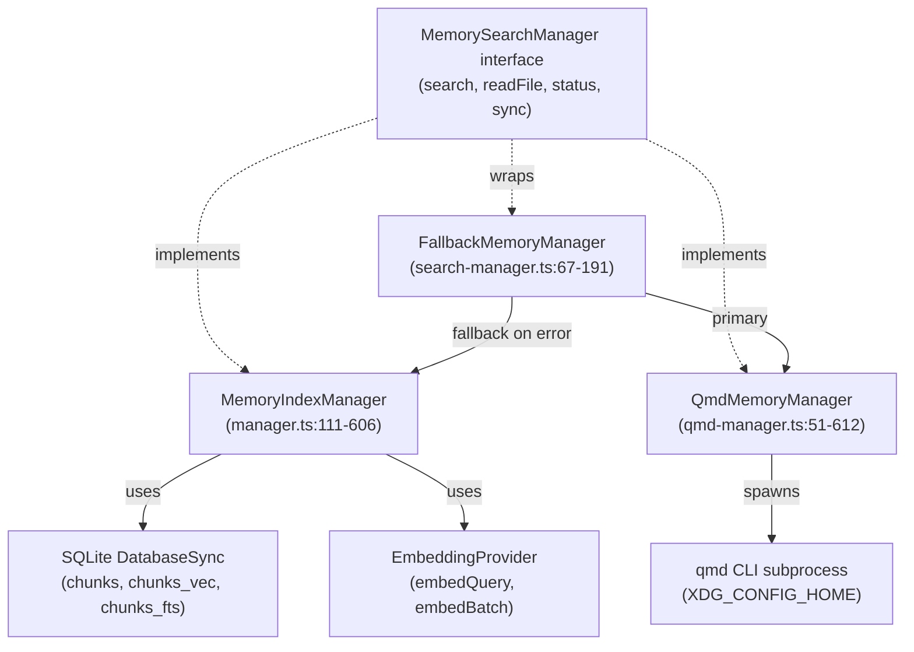
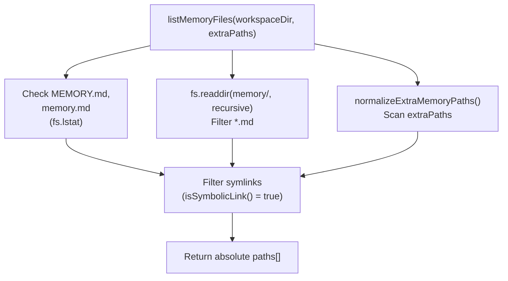
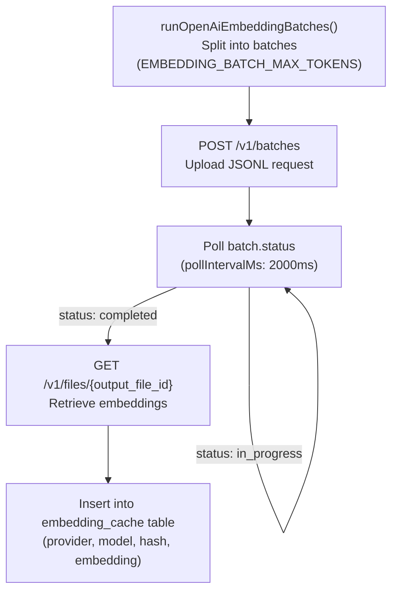
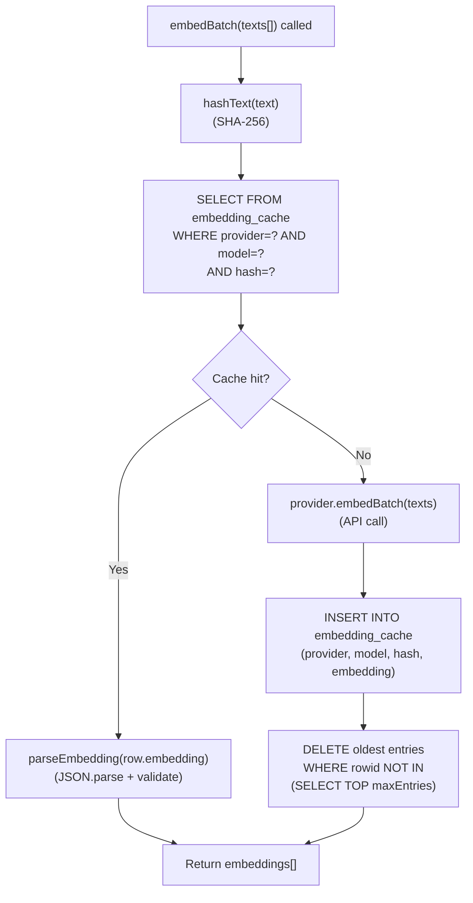
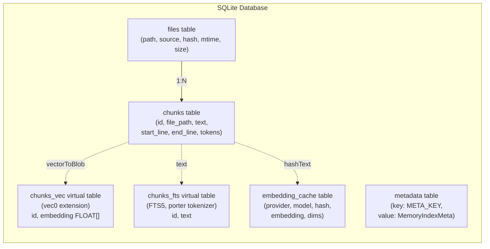
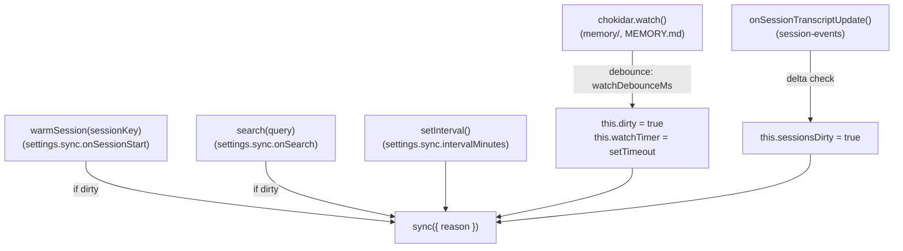
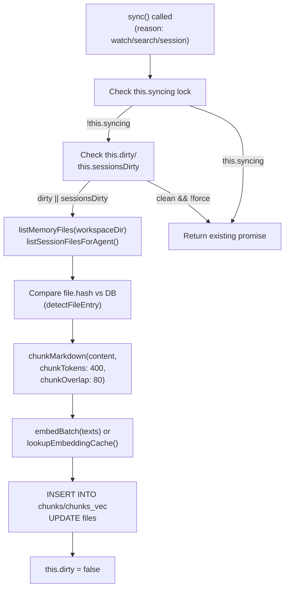
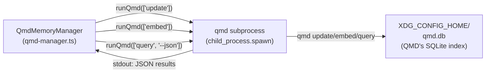

# Page: Memory Indexing

# メモリインデックス作成

<details>
<summary>関連ソースファイル</summary>

この Wiki ページの生成に使用されたコンテキストファイル:

- [CHANGELOG.md](CHANGELOG.md)
- [docs/cli/memory.md](docs/cli/memory.md)
- [docs/cli/sandbox.md](docs/cli/sandbox.md)
- [docs/concepts/memory.md](docs/concepts/memory.md)
- [docs/gateway/configuration.md](docs/gateway/configuration.md)
- [docs/gateway/sandbox-vs-tool-policy-vs-elevated.md](docs/gateway/sandbox-vs-tool-policy-vs-elevated.md)
- [docs/gateway/sandboxing.md](docs/gateway/sandboxing.md)
- [docs/platforms/mac/skills.md](docs/platforms/mac/skills.md)
- [docs/tools/elevated.md](docs/tools/elevated.md)
- [docs/tools/index.md](docs/tools/index.md)
- [docs/tools/skills-config.md](docs/tools/skills-config.md)
- [src/agents/memory-search.test.ts](src/agents/memory-search.test.ts)
- [src/agents/memory-search.ts](src/agents/memory-search.ts)
- [src/agents/sandbox-explain.test.ts](src/agents/sandbox-explain.test.ts)
- [src/agents/sandbox.ts](src/agents/sandbox.ts)
- [src/cli/memory-cli.test.ts](src/cli/memory-cli.test.ts)
- [src/cli/memory-cli.ts](src/cli/memory-cli.ts)
- [src/cli/models-cli.test.ts](src/cli/models-cli.test.ts)
- [src/config/schema.ts](src/config/schema.ts)
- [src/config/types.tools.ts](src/config/types.tools.ts)
- [src/config/types.ts](src/config/types.ts)
- [src/config/zod-schema.agent-runtime.ts](src/config/zod-schema.agent-runtime.ts)
- [src/config/zod-schema.ts](src/config/zod-schema.ts)
- [src/memory/embeddings.test.ts](src/memory/embeddings.test.ts)
- [src/memory/embeddings.ts](src/memory/embeddings.ts)
- [src/memory/manager.ts](src/memory/manager.ts)

</details>

このページでは、OpenClaw がメモリファイルとセッショントランスクリプトをセマンティック検索用にインデックスする方法について説明します。ファイル検出、チャンキング、エンベディング生成、SQLite ストレージ、同期トリガーについて取り上げます。

メモリ検索クエリとツールの使用については、[メモリ検索](#7.3)を参照してください。全体的なメモリ設定については、[メモリ設定](#7.1)を参照してください。

---

## 概要

メモリインデックス作成は、Markdown ファイルをベクトルインデックスと全文インデックスを持つ SQLite に保存された検索可能なチャンクに変換します。インデックス作成パイプライン:

1. **検出** ソースファイル（`MEMORY.md`、`memory/*.md`、オプションのセッショントランスクリプト）
2. **チャンキング** コンテンツを約 400 トークンのセグメントに、80 トークンのオーバーラップで分割
3. **エンベディング生成** OpenAI、Gemini、またはローカル GGUF モデル経由
4. **保存** チャンクを `sqlite-vec`（ベクトル検索）と FTS5（キーワード検索）付きの SQLite に
5. **同期** ファイル変更時、セッション開始時、検索時、またはインターバルで

2つのバックエンドが利用可能:
- **builtin**: `MemoryIndexManager` が管理する SQLite インデックス [src/memory/manager.ts:108-1449]()
- **qmd**: 外部 [QMD サイドカー](https://github.com/tobi/qmd) プロセス [src/memory/qmd-manager.ts:51-612]()

**参照元:**
- [src/memory/manager.ts:1-1449]()
- [src/memory/qmd-manager.ts:1-612]()
- [docs/concepts/memory.md:1-547]()

---

## 主要なクラスとコードエンティティ

メモリインデックス作成システムは主に以下のクラスで実装されています:

| クラス | ファイル | 目的 |
|-------|------|---------|
| `MemoryIndexManager` | [src/memory/manager.ts:111]() | 組み込み SQLite ベースのインデクサー |
| `QmdMemoryManager` | [src/memory/qmd-manager.ts:51]() | QMD サブプロセスラッパー |
| `FallbackMemoryManager` | [src/memory/search-manager.ts:67]() | フェイルオーバーラッパー（QMD → builtin） |
| `EmbeddingProvider` | [src/memory/embeddings.ts:24-30]() | エンベディング生成インターフェース |

**図: メモリマネージャークラス階層**



**参照元:**
- [src/memory/manager.ts:111-606]()
- [src/memory/qmd-manager.ts:51-612]()
- [src/memory/search-manager.ts:67-191]()
- [src/memory/types.ts:11-28]()

---

## インデックスソースとファイル検出

### メモリソース

`sources` 設定は何をインデックスするかを制御します [src/agents/memory-search.ts:87-107]():

```json5
{
  agents: {
    defaults: {
      memorySearch: {
        sources: ["memory", "sessions"]  // default: ["memory"]
      }
    }
  }
}
```

| ソース | 説明 | ファイル |
|--------|-------------|-------|
| `memory` | ワークスペースメモリファイル | `MEMORY.md`, `memory.md`, `memory/**/*.md` |
| `sessions` | セッショントランスクリプト（実験的） | `~/.openclaw/agents/{agentId}/sessions/*.jsonl` |

**参照元:**
- [src/agents/memory-search.ts:87-107]()
- [src/memory/manager.ts:131-133]()

### ファイル検出

**組み込みバックエンド**は `listMemoryFiles` を通じてファイルを検出します [src/memory/internal.ts:260-324]():

```typescript
async function listMemoryFiles(
  workspaceDir: string,
  extraPaths: string[]
): Promise<string[]>
```

**図: ファイル検出フロー (listMemoryFiles)**



検出ルール:
- `MEMORY.md`、`memory.md`、`memory/` ディレクトリを再帰的にスキャン
- シンボリックリンクを無視 [src/memory/internal.ts:314]()
- `.md` ファイルのみインデックス
- 追加ディレクトリ用の `extraPaths` を尊重 [src/memory/internal.ts:306-324]()

**QMD バックエンド**はコレクション定義を使用します [src/memory/qmd-manager.ts:169-219]():

```typescript
type ResolvedQmdCollection = {
  name: string;
  path: string;
  pattern: string;
  kind: "memory" | "custom" | "sessions";
}
```

QMD コレクションは独自のインデックスデータベースに永続化され、`qmd collection add` で作成されます。

**参照元:**
- [src/memory/internal.ts:260-324]()
- [src/memory/manager.ts:808-840]()
- [src/memory/qmd-manager.ts:169-219]()

---

## チャンキングプロセス

### Markdown チャンキング

コンテンツは `chunkMarkdown` でチャンクに分割されます [src/memory/internal.ts:190-258]():

```typescript
function chunkMarkdown(params: {
  content: string;
  chunkTokens: number;   // default: 400
  chunkOverlap: number;  // default: 80
}): MemoryChunk[]
```

チャンキング戦略:
1. コンテンツをダブルニューライン（`\n\n`）で段落に分割
2. トークンバジェット（約 400 トークン）に達するまで段落を蓄積
3. コンテキストの連続性のために前のチャンクからのオーバーラップ（80 トークン）を含める
4. 引用用に行範囲を追跡 [src/memory/internal.ts:228-242]()

**チャンクメタデータ** [src/memory/internal.ts:39-46]():
```typescript
type MemoryChunk = {
  id: string;           // SHA-256 hash of content
  text: string;
  startLine: number;
  endLine: number;
  tokenEstimate: number;
}
```

**参照元:**
- [src/memory/internal.ts:190-258]()
- [src/memory/manager.ts:1086-1132]()

### セッショントランスクリプトのチャンキング

セッショントランスクリプト（`.jsonl` ファイル）は Markdown に変換されてからチャンクされます [src/memory/manager.ts:1198-1296]():

1. **フィルター**: `user`/`assistant` ロールのメッセージのみ保持 [src/memory/manager.ts:1234-1238]()
2. **フォーマット**: ロールプレフィックス付きの Markdown に変換 [src/memory/manager.ts:1242-1248]()
3. **チャンキング**: トークン制限付きの標準チャンキングを適用

セッションインデックス作成は、頻繁な再インデックスを避けるためにデルタしきい値で制御されます:
- `deltaBytes`: 最小追記バイト数（デフォルト: 100,000）
- `deltaMessages`: 最小追記 JSONL 行数（デフォルト: 50）

**参照元:**
- [src/memory/manager.ts:1198-1296]()
- [src/agents/memory-search.ts:78-79]()

---

## エンベディング生成

### プロバイダー選択

エンベディングは3つのプロバイダーのいずれかで生成されます [src/memory/embeddings.ts:21-52]():

| プロバイダー | モデル | 備考 |
|----------|-------|-------|
| `openai` | `text-embedding-3-small` | Batch API サポート、大規模インデックスで高速 |
| `gemini` | `gemini-embedding-001` | Batch API サポート |
| `local` | node-llama-cpp 経由の GGUF | デフォルト: `embeddinggemma-300M-Q8_0.gguf`（約 600 MB） |

**自動選択** [src/memory/embeddings.ts:123-152]():
1. `local.modelPath` がディスクに存在する場合 → ローカルを使用
2. OpenAI API キーが利用可能な場合 → OpenAI を使用
3. Gemini API キーが利用可能な場合 → Gemini を使用
4. それ以外は設定不足で失敗

**参照元:**
- [src/memory/embeddings.ts:123-152]()
- [src/memory/embeddings-openai.ts:1-277]()
- [src/memory/embeddings-gemini.ts:1-180]()

### バッチエンベディング API

OpenAI と Gemini は高速インデックス作成のためにバッチエンベディングをサポートしています [src/memory/batch-openai.ts:1-426]():

**図: OpenAI バッチエンベディングフロー**



**バッチ設定** [src/agents/memory-search.ts:140-151]():
```json5
{
  remote: {
    batch: {
      enabled: true,      // default
      wait: true,         // wait for completion
      concurrency: 2,     // max parallel batch jobs
      pollIntervalMs: 2000,
      timeoutMinutes: 60
    }
  }
}
```

バッチ失敗はカウンターをインクリメントし、2 回失敗後、セッションのバッチモードは無効になります [src/memory/manager.ts:1388-1449]()。

**参照元:**
- [src/memory/batch-openai.ts:1-426]()
- [src/memory/batch-gemini.ts:1-373]()
- [src/memory/manager.ts:1388-1449]()

### エンベディングキャッシュ

エンベディングは再計算を避けるためにコンテンツハッシュでキャッシュされます [src/memory/manager.ts:711-759]():

**キャッシュスキーマ**:
```sql
CREATE TABLE embedding_cache (
  provider TEXT,
  model TEXT,
  provider_key TEXT,
  hash TEXT,            -- SHA-256 of chunk text
  embedding TEXT,       -- JSON-serialized float array
  dims INTEGER,
  updated_at INTEGER,
  PRIMARY KEY (provider, model, provider_key, hash)
)
```

**図: エンベディングキャッシュルックアップ (lookupEmbeddingCache)**



キャッシュルックアップはエンベディング生成前に行われます [src/memory/manager.ts:1309-1337]():
1. `hashText()` でチャンクテキストをハッシュ（SHA-256）
2. provider/model/hash でキャッシュをクエリ
3. ヒットした場合 → `parseEmbedding()` でエンベディングをデシリアライズ
4. ミスした場合 → エンベディングを生成し、キャッシュに挿入

**キャッシュプルーニング**: `maxEntries` が設定されている場合、制限を超えると最も古いエントリが削除されます [src/memory/manager.ts:1349-1376]()。

**参照元:**
- [src/memory/manager.ts:711-759]()
- [src/memory/manager.ts:1309-1376]()
- [src/memory/memory-schema.ts:1-135]()
- [src/memory/internal.ts:178-188]()

---

## インデックスストレージ（SQLite スキーマ）

### スキーマ概要

組み込みバックエンドはチャンクを SQLite に保存します [src/memory/memory-schema.ts:1-135]():

**コアテーブル**:

| テーブル | 目的 |
|-------|---------|
| `files` | ファイルメタデータ（path, hash, mtime, size） |
| `chunks` | 行範囲付きのテキストチャンク |
| `chunks_vec` | ベクトル検索用仮想テーブル（sqlite-vec） |
| `chunks_fts` | 全文検索インデックス（FTS5） |
| `embedding_cache` | コンテンツハッシュによるキャッシュされたエンベディング |
| `metadata` | インデックスメタデータ（provider, model, chunking params） |

**図: 組み込みインデックススキーマ (ensureMemoryIndexSchema)**



**参照元:**
- [src/memory/memory-schema.ts:1-135]()

### ベクターテーブル (sqlite-vec)

`chunks_vec` 仮想テーブルは高速な最近傍検索を可能にします [src/memory/manager.ts:664-678]():

```sql
CREATE VIRTUAL TABLE chunks_vec USING vec0(
  id TEXT PRIMARY KEY,
  embedding FLOAT[1536]  -- dimensions match embedding model
)
```

**Vec0 操作**:
- 挿入: `INSERT INTO chunks_vec (id, embedding) VALUES (?, ?)`
- 検索: `SELECT id FROM chunks_vec WHERE embedding MATCH ? ORDER BY distance LIMIT ?`

ベクトル検索は `searchVector` で実装されています [src/memory/manager-search.ts:1-169]()。

**参照元:**
- [src/memory/manager.ts:664-678]()
- [src/memory/manager-search.ts:1-169]()
- [src/memory/sqlite-vec.ts:1-161]()

### 全文検索 (FTS5)

`chunks_fts` テーブルは BM25 キーワード検索を可能にします [src/memory/memory-schema.ts:91-99]():

```sql
CREATE VIRTUAL TABLE chunks_fts USING fts5(
  id UNINDEXED,
  text,
  content='',
  tokenize='porter unicode61'
)
```

FTS5 クエリ構文は `buildFtsQuery` で自然言語から変換されます [src/memory/hybrid.ts:1-163]():
- 特殊文字を削除
- FTS5 ブール演算子に変換（`AND`、`OR`、`NEAR`）
- フレーズを引用符で囲む

**参照元:**
- [src/memory/memory-schema.ts:91-99]()
- [src/memory/hybrid.ts:1-163]()
- [src/memory/manager-search.ts:171-281]()

---

## 同期トリガーとライフサイクル

### 同期トリガー

インデックス作成は以下によってトリガーされます [src/memory/manager.ts:807-876]():

| トリガー | デフォルト | 設定パス | 実装 |
|---------|---------|-------------|----------------|
| ファイルウォッチャー | `true` | `sync.watch` | メモリディレクトリで `chokidar.watch()` |
| セッション開始 | `true` | `sync.onSessionStart` | セッション作成時に `warmSession()` を呼び出し |
| 検索クエリ | `true` | `sync.onSearch` | `search()` 前に遅延同期 |
| インターバルタイマー | `0`（オフ） | `sync.intervalMinutes` | `setInterval()` で定期同期 |

**ファイルウォッチャー** (chokidar) [src/memory/manager.ts:808-840]():
```typescript
this.watcher = chokidar.watch([...watchPaths], {
  ignoreInitial: true,
  awaitWriteFinish: {
    stabilityThreshold: settings.sync.watchDebounceMs,
    pollInterval: 100
  }
});
```

**図: 同期トリガーソース**



変更は再インデックスをトリガーする前にデバウンスされます（デフォルト: 1500ms）[src/memory/manager.ts:834-837]()。

**参照元:**
- [src/memory/manager.ts:807-876]()
- [src/agents/memory-search.ts:191-199]()
- [src/sessions/transcript-events.ts:1-52]()

### 同期ライフサイクル

**図: MemoryIndexManager.sync() フロー**



同期実装 [src/memory/manager.ts:386-398]():
```typescript
async sync(params?: {
  reason?: string;
  force?: boolean;
  progress?: (update: MemorySyncProgressUpdate) => void;
}): Promise<void> {
  if (this.syncing) {
    return this.syncing;  // return existing promise
  }
  this.syncing = this.runSync(params).finally(() => {
    this.syncing = null;
  });
  return this.syncing;
}
```

**参照元:**
- [src/memory/manager.ts:386-1181]()
- [src/memory/manager.ts:877-1181]()

---

## バックエンド実装

### 組み込みバックエンド

`MemoryIndexManager` クラス [src/memory/manager.ts:108-1449]() はエージェントごとに SQLite インデックスを管理します:

**ライフサイクル**:
1. **初期化** [src/memory/manager.ts:201-243]():
   - `~/.openclaw/memory/{agentId}.sqlite` で SQLite データベースを開く
   - sqlite-vec 拡張機能をロード（有効な場合）
   - スキーマを作成（files, chunks, chunks_vec, chunks_fts, embedding_cache）
   - メモリディレクトリでファイルウォッチャーを開始
   - インターバル同期タイマーを開始（設定されている場合）

2. **検索** [src/memory/manager.ts:261-309]():
   - クエリテキストをエンベッド
   - ハイブリッド検索を実行（有効な場合はベクトル + BM25）
   - 重み付けスコアで結果をマージ
   - 引用付きの上位 N 件のスニペットを返す

3. **クリーンアップ** [src/memory/manager.ts:579-606]():
   - ウォッチャーを停止
   - インターバルタイマーをクリア
   - SQLite 接続を閉じる
   - キャッシュから削除

**キャッシュ**: `(agentId, workspaceDir, settings)` タプルごとに単一の `MemoryIndexManager` インスタンス [src/memory/manager.ts:165-199]()。

**参照元:**
- [src/memory/manager.ts:108-606]()
- [src/memory/search-manager.ts:19-65]()

### QMD バックエンド

`QmdMemoryManager` クラス [src/memory/qmd-manager.ts:51-612]() は QMD バイナリにシェルアウトします:

**図: QmdMemoryManager アーキテクチャ**



**QMD サブプロセスライフサイクル** [src/memory/qmd-manager.ts:408-495]():
1. 分離状態のために `XDG_CONFIG_HOME`、`XDG_CACHE_HOME` 環境変数を設定
2. 引数付きで `qmd` をスポーン（`update`、`embed`、`query`）
3. stdout/stderr をキャプチャ
4. 終了コードを待機、タイムアウトを強制
5. JSON 出力をパース（`query` の場合）

**コレクション管理** [src/memory/qmd-manager.ts:169-219]():
```typescript
await this.runQmd([
  "collection",
  "add",
  collection.path,
  "--name", collection.name,
  "--mask", collection.pattern
]);
```

コレクションは QMD のインデックスデータベースに永続化され、マネージャー初期化時に冪等に作成されます。

**参照元:**
- [src/memory/qmd-manager.ts:51-612]()
- [src/memory/backend-config.ts:1-237]()

### フォールバックラッパー

`FallbackMemoryManager` [src/memory/search-manager.ts:67-191]() は組み込みフォールバック付きで QMD をラップします:

**フェイルオーバーロジック**:
1. QMD 操作を試行（search、readFile）
2. QMD が失敗した場合 → `primaryFailed = true` をマーク
3. QMD マネージャーを閉じる
4. 組み込み `MemoryIndexManager` を遅延初期化
5. 今後のすべてのリクエストを組み込みにルーティング

これにより、QMD がクラッシュまたは欠落している場合でもメモリ検索が利用可能になります。

**参照元:**
- [src/memory/search-manager.ts:67-191]()

---

## セッショントランスクリプトのインデックス作成

### セッションインデックス作成の有効化

セッションインデックス作成は実験的でオプトインです [src/agents/memory-search.ts:125-126]():

```json5
{
  agents: {
    defaults: {
      memorySearch: {
        experimental: { sessionMemory: true },
        sources: ["memory", "sessions"]
      }
    }
  }
}
```

**参照元:**
- [src/agents/memory-search.ts:125-126]()
- [docs/concepts/memory.md:441-465]()

### セッションファイル検出

セッショントランスクリプトは JSONL として保存されます [src/memory/manager.ts:1182-1197]():
- パス: `~/.openclaw/agents/{agentId}/sessions/*.jsonl`
- フォーマット: 1行につき1メッセージ（JSON）
- インデックスされるメッセージ: `role: "user"` または `role: "assistant"`

セッションファイルは `listSessionFilesForAgent` で検出されます [src/memory/session-files.ts:1-106]()。

**参照元:**
- [src/memory/manager.ts:1182-1197]()
- [src/memory/session-files.ts:1-106]()

### デルタしきい値

セッションはデルタがしきい値を超えた場合にのみ再インデックスされます [src/agents/memory-search.ts:78-79]():

```json5
{
  sync: {
    sessions: {
      deltaBytes: 100000,      // ~100 KB
      deltaMessages: 50        // JSONL lines
    }
  }
}
```

**デルタ追跡** [src/memory/manager.ts:1287-1296]():
```typescript
this.sessionDeltas.set(absPath, {
  lastSize: size,
  pendingBytes: size - lastSize,
  pendingMessages: newMessages
});
```

`onSessionTranscriptUpdate` イベントでセッショントランスクリプトが更新されると [src/memory/manager.ts:859-876]()、デルタが蓄積されます。しきい値を超えると、セッションは再インデックス用にマークされます [src/memory/manager.ts:1254-1296]()。

**参照元:**
- [src/memory/manager.ts:859-876]()
- [src/memory/manager.ts:1254-1296]()
- [src/agents/memory-search.ts:78-79]()

---

## インデックスメンテナンス

### 再インデックストリガー

プロバイダーメタデータが変更されると完全な再インデックスが行われます [src/memory/manager.ts:924-1031]():

**メタデータフィンガープリント** [src/memory/manager.ts:56-63]():
```typescript
type MemoryIndexMeta = {
  model: string;
  provider: string;
  providerKey?: string;
  chunkTokens: number;
  chunkOverlap: number;
  vectorDims?: number;
}
```

保存されたメタデータが現在の設定と異なる場合 → すべてのテーブルを削除しインデックスを再構築 [src/memory/manager.ts:989-1007]()。

**参照元:**
- [src/memory/manager.ts:924-1031]()

### 手動再インデックス

`openclaw memory index` コマンドは手動再インデックスをトリガーします [src/cli/memory-cli.ts:508-599]():

```bash
openclaw memory index --force --verbose
```

オプション:
- `--force`: デバウンスをスキップ、完全な再インデックスを強制
- `--verbose`: 進捗更新をログ（経過時間、ETA）

**参照元:**
- [src/cli/memory-cli.ts:508-599]()
- [docs/cli/memory.md:1-42]()

---

**主要な実装ファイル**:
- [src/memory/manager.ts:1-1449]() — `MemoryIndexManager`（組み込みバックエンド）
- [src/memory/qmd-manager.ts:1-612]() — `QmdMemoryManager`（QMD バックエンド）
- [src/memory/embeddings.ts:1-221]() — エンベディングプロバイダー抽象化
- [src/memory/batch-openai.ts:1-426]() — OpenAI Batch API
- [src/memory/batch-gemini.ts:1-373]() — Gemini Batch API
- [src/memory/internal.ts:1-404]() — ファイル検出とチャンキング
- [src/memory/memory-schema.ts:1-135]() — SQLite スキーマ定義
- [src/memory/search-manager.ts:1-213]() — バックエンドルーティングとフォールバック
- [src/cli/memory-cli.ts:1-699]() — CLI コマンド（`status`、`index`、`search`）
