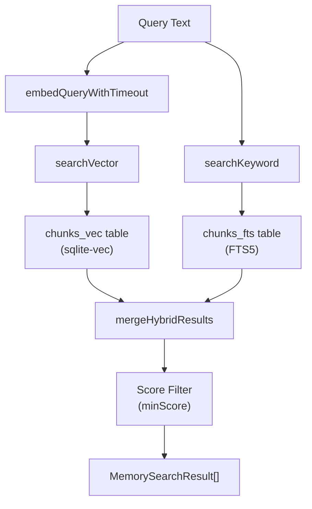

# Page: Memory Search

# メモリ検索

<details>
<summary>関連ソースファイル</summary>

この Wiki ページの生成に使用されたコンテキストファイル:

- [CHANGELOG.md](CHANGELOG.md)
- [docs/cli/memory.md](docs/cli/memory.md)
- [docs/cli/sandbox.md](docs/cli/sandbox.md)
- [docs/concepts/memory.md](docs/concepts/memory.md)
- [docs/gateway/configuration.md](docs/gateway/configuration.md)
- [docs/gateway/sandbox-vs-tool-policy-vs-elevated.md](docs/gateway/sandbox-vs-tool-policy-vs-elevated.md)
- [docs/gateway/sandboxing.md](docs/gateway/sandboxing.md)
- [docs/platforms/mac/skills.md](docs/platforms/mac/skills.md)
- [docs/tools/elevated.md](docs/tools/elevated.md)
- [docs/tools/index.md](docs/tools/index.md)
- [docs/tools/skills-config.md](docs/tools/skills-config.md)
- [src/agents/memory-search.test.ts](src/agents/memory-search.test.ts)
- [src/agents/memory-search.ts](src/agents/memory-search.ts)
- [src/agents/sandbox-explain.test.ts](src/agents/sandbox-explain.test.ts)
- [src/agents/sandbox.ts](src/agents/sandbox.ts)
- [src/cli/memory-cli.test.ts](src/cli/memory-cli.test.ts)
- [src/cli/memory-cli.ts](src/cli/memory-cli.ts)
- [src/cli/models-cli.test.ts](src/cli/models-cli.test.ts)
- [src/config/schema.ts](src/config/schema.ts)
- [src/config/types.tools.ts](src/config/types.tools.ts)
- [src/config/types.ts](src/config/types.ts)
- [src/config/zod-schema.agent-runtime.ts](src/config/zod-schema.agent-runtime.ts)
- [src/config/zod-schema.ts](src/config/zod-schema.ts)
- [src/memory/embeddings.test.ts](src/memory/embeddings.test.ts)
- [src/memory/embeddings.ts](src/memory/embeddings.ts)
- [src/memory/manager.ts](src/memory/manager.ts)

</details>

このドキュメントでは、OpenClaw がインデックスされたメモリファイルに対してセマンティック検索を実行する方法について説明します。ハイブリッド検索アーキテクチャ（ベクトル + BM25）、クエリ処理、スコアマージ、エージェント向けツール、検索動作を制御する設定オプションについて取り上げます。

メモリファイルレイアウトとインデックス作成メカニズムについては、[メモリインデックス作成](#7.2)を参照してください。エンベディングプロバイダーとストレージの設定については、[メモリ設定](#7.1)を参照してください。

---

## 検索アーキテクチャ

OpenClaw は、ベクトル類似度と BM25 キーワードランキングを組み合わせた**ハイブリッド検索**アプローチを使用します。これにより、セマンティックな理解（エンベディング経由）と正確なキーワードマッチングの両方が提供されます。



**参照元:** [src/memory/manager.ts:262-308]()

---

## 検索プロセス

`MemoryIndexManager.search()` メソッドは完全な検索パイプラインをオーケストレーションします:

### ステップ 1: セッションウォーミング

```typescript
async search(query: string, opts?: {
  maxResults?: number;
  minScore?: number;
  sessionKey?: string;
}): Promise<MemorySearchResult[]>
```

`memorySearch.sync.onSessionStart` が有効な場合、セッションからの最初の検索は `warmSession()` をトリガーし、インデックス同期をキューイングします。

**参照元:** [src/memory/manager.ts:252-308]()

### ステップ 2: 遅延同期

`memorySearch.sync.onSearch` が有効でインデックスがダーティな場合、検索はクエリを実行する前にバックグラウンド同期をトリガーします。

**参照元:** [src/memory/manager.ts:271-275]()

### ステップ 3: クエリエンベディング

クエリテキストは設定されたプロバイダー（OpenAI、Gemini、またはローカル）を使用してエンベッドされます。プロバイダータイプに基づいてタイムアウトが適用されます:
- リモートプロバイダー: `EMBEDDING_QUERY_TIMEOUT_REMOTE_MS`（60 秒）
- ローカルプロバイダー: `EMBEDDING_QUERY_TIMEOUT_LOCAL_MS`（5 分）

**参照元:** [src/memory/manager.ts:290](), [src/memory/manager.ts:107-108]()

### ステップ 4: 並列検索実行

ベクトル検索とキーワード検索が並列で実行されます:

| 検索タイプ | メソッド | バックエンド | 出力 |
|------------|--------|---------|--------|
| ベクトル | `searchVector()` | `chunks_vec` テーブル（sqlite-vec） | コサイン類似度スコア |
| キーワード | `searchKeyword()` | `chunks_fts` テーブル（FTS5） | BM25 ランクスコア |

両方の検索は `candidateMultiplier × maxResults` エントリを取得します（デフォルト: 4×）。

**参照元:** [src/memory/manager.ts:287-294]()

### ステップ 5: ハイブリッドマージ

結果は重み付けスコアリングでマージされます:

```
finalScore = (vectorScore × vectorWeight) + (textScore × textWeight)
```

デフォルトの重み:
- `vectorWeight`: 0.7
- `textWeight`: 0.3

**参照元:** [src/memory/manager.ts:300-307](), [src/memory/hybrid.ts]()

### ステップ 6: フィルタリングと制限

`minScore`（デフォルト: 0.35）未満の結果はフィルタリングされ、上位 `maxResults`（デフォルト: 6）件が返されます。

**参照元:** [src/memory/manager.ts:308]()

---

## 検索実装の詳細

### ベクトル検索


[src/memory/manager-search.ts:18-90]() の `searchVector()` 関数:
- `ensureVectorReady()` でベクターテーブルの準備を確認
- 類似度スコアリングに `vec_distance_cosine()` を使用
- 完全なチャンクメタデータを取得するために `chunks` テーブルと結合
- ソースフィルタリング（memory/sessions）を適用
- スニペットを `SNIPPET_MAX_CHARS`（700 文字）に切り詰め

**参照元:** [src/memory/manager-search.ts:18-90](), [src/memory/manager.ts:310-326]()

### キーワード検索

[src/memory/manager-search.ts:92-148]() の `searchKeyword()` 関数:
- `buildFtsQuery()` で FTS5 クエリを構築（引用符、フレーズなどを処理）
- `chunks_fts` で FTS5 `MATCH` クエリを実行
- `bm25RankToScore()` で BM25 ランクを正規化スコアに変換
- スニペットハイライト付きでマッチを返す

**参照元:** [src/memory/manager-search.ts:92-148](), [src/memory/manager.ts:332-350](), [src/memory/hybrid.ts:1-31]()

### ハイブリッド結果マージ

```typescript
type HybridMergeInput = {
  vector: Array<{id: string, vectorScore: number, ...}>;
  keyword: Array<{id: string, textScore: number, ...}>;
  vectorWeight: number;
  textWeight: number;
};
```

[src/memory/hybrid.ts:33-108]() の `mergeHybridResults()` 関数:
- 両方の結果セットからすべての一意のチャンク ID を収集
- 各チャンクについて、重み付けスコアを計算:
  - チャンクが両方に存在する場合: 両方のスコアを使用
  - チャンクが一方にのみ存在する場合: そのスコアを使用し、他方は 0
- 最終スコアでソート（降順）
- 統一されたスコアフィールドを持つマージされた結果を返す

**参照元:** [src/memory/hybrid.ts:33-108](), [src/memory/manager.ts:352-381]()

---

## メモリツール

エージェントは2つのツールを通じてメモリ検索と対話します:

### `memory_search` ツール

```typescript
{
  name: "memory_search",
  description: "Search agent memory files for relevant information",
  parameters: {
    query: string,          // Search query
    maxResults?: number,    // Override default (6)
    source?: "memory" | "sessions" | null  // Filter by source
  }
}
```

このツール:
- `manager.search()` でハイブリッド検索を実行
- ファイルパスと行番号付きの Markdown で結果をフォーマット
- スニペットを返す（結果ごとに最大 700 文字）
- 指定された場合、ソースで自動的にフィルタリング

**参照元:** [src/agents/tools/memory-tool.ts:11-126]()

### `memory_get` ツール

```typescript
{
  name: "memory_get",
  description: "Read specific lines from a memory file",
  parameters: {
    path: string,      // Relative file path
    from?: number,     // Start line (1-indexed)
    lines?: number     // Number of lines to read
  }
}
```

このツール:
- ファイルパスを検証（ワークスペースまたは extraPaths にある必要がある）
- `manager.readFile()` でファイルコンテンツを読み込み
- 完全なコンテンツまたは行ベースのスライスを返す
- `.md` ファイルのみ許可

**参照元:** [src/agents/tools/memory-tool.ts:128-242]()

---

## クエリ設定

設定は `agents.defaults.memorySearch.query`（またはエージェントごとのオーバーライド）の下にあります:

```json5
{
  agents: {
    defaults: {
      memorySearch: {
        query: {
          maxResults: 6,
          minScore: 0.35,
          hybrid: {
            enabled: true,
            vectorWeight: 0.7,
            textWeight: 0.3,
            candidateMultiplier: 4
          }
        }
      }
    }
  }
}
```

| フィールド | デフォルト | 目的 |
|-------|---------|---------|
| `maxResults` | 6 | エージェントに返される結果数 |
| `minScore` | 0.35 | 最小スコアしきい値（0-1） |
| `hybrid.enabled` | true | BM25+ベクトルのハイブリッド検索を有効化 |
| `hybrid.vectorWeight` | 0.7 | ベクトル類似度の重み |
| `hybrid.textWeight` | 0.3 | キーワード関連性の重み |
| `hybrid.candidateMultiplier` | 4 | 候補プールサイズ（maxResults × multiplier） |

**参照元:** [src/memory/manager.ts:278-284](), [src/agents/memory-search.ts:74-87]()

---

## 検索トリガー

### オンデマンド検索

エージェントが `memory_search` を呼び出すと、検索が即座に実行されます。`sync.onSearch` が有効でインデックスがダーティな場合、最初にバックグラウンド同期が実行されます。

**参照元:** [src/memory/manager.ts:271-275]()

### セッションウォーミング

`sync.onSessionStart` が有効な場合、新しい `sessionKey` からの最初の検索は `warmSession()` をトリガーします:

```typescript
async warmSession(sessionKey?: string): Promise<void> {
  if (!this.settings.sync.onSessionStart) return;
  const key = sessionKey?.trim() || "";
  if (key && this.sessionWarm.has(key)) return;
  void this.sync({ reason: "session-start" }).catch((err) => {
    log.warn(`memory sync failed (session-start): ${String(err)}`);
  });
  if (key) this.sessionWarm.add(key);
}
```

これにより、検索をブロックすることなく新しい会話で最新の結果が保証されます。

**参照元:** [src/memory/manager.ts:252-260]()

---

## 検索結果フォーマット

```typescript
type MemorySearchResult = {
  path: string;        // Relative file path
  startLine: number;   // 1-indexed start line
  endLine: number;     // 1-indexed end line
  score: number;       // Final hybrid score (0-1)
  snippet: string;     // Truncated content (max 700 chars)
  source: "memory" | "sessions";  // Source type
};
```

結果には以下が含まれます:
- ファイルパス（ワークスペースからの相対）
- コンテキスト用の行範囲
- 正規化されたスコア（高いほど関連性が高い）
- テキストスニペット（切り詰められる場合がある）
- ソース分類

**参照元:** [src/memory/manager.ts:52-59]()

---

## ソースフィルタリング

検索はソースタイプでフィルタリングできます:

```typescript
private buildSourceFilter(alias?: string): { sql: string; params: (string | number)[] } {
  const sources = Array.from(this.sources);
  if (sources.length === 0 || (sources.includes("memory") && sources.includes("sessions"))) {
    return { sql: "", params: [] };
  }
  const prefix = alias ? `${alias}.` : "";
  return {
    sql: ` AND ${prefix}source = ?`,
    params: [sources[0]]
  };
}
```

これはベクトルとキーワードクエリの両方に適用され、結果が設定されたソースリストに一致することを保証します。

**参照元:** [src/memory/manager.ts:761-776]()

---

## パフォーマンス特性

### ベクトル検索パフォーマンス

- **sqlite-vec**: 近似最近傍検索に HNSW インデックスを使用
- **プローブタイムアウト**: ベクトル拡張機能のロードには 30 秒のタイムアウトがある
- **候補プール**: 再現率を向上させるためにスコアリング前に 4× の結果を取得

**参照元:** [src/memory/manager.ts:106](), [src/memory/manager.ts:283]()

### キーワード検索パフォーマンス

- **FTS5**: BM25 ランキング付き SQLite 全文検索
- **クエリパース**: フレーズ（引用符）、AND/OR 演算子を処理
- **スニペット生成**: 組み込み FTS5 `snippet()` 関数

**参照元:** [src/memory/manager-search.ts:92-148](), [src/memory/hybrid.ts:1-31]()

### エンベディングキャッシュ

`memorySearch.cache.enabled` が true（デフォルト）の場合、チャンクエンベディングは `embedding_cache` テーブルにキャッシュされます:

```sql
CREATE TABLE IF NOT EXISTS embedding_cache (
  provider TEXT NOT NULL,
  model TEXT NOT NULL,
  text_hash TEXT NOT NULL,
  embedding BLOB NOT NULL,
  created_at INTEGER NOT NULL,
  PRIMARY KEY (provider, model, text_hash)
)
```

これにより、同期中に変更されていないチャンクの再エンベディングが回避されます。

**参照元:** [src/memory/manager.ts:231-233](), [src/memory/memory-schema.ts]()

---

## 検索問題のデバッグ

### CLI ステータス

```bash
openclaw memory status
```

以下を表示:
- インデックスされたファイル/チャンク
- プロバイダーとモデル
- ベクトル/FTS 可用性
- キャッシュ統計

**参照元:** [docs/cli/memory.md:1-109](), [src/cli/memory-cli.ts:304-439]()

### CLI 検索

```bash
openclaw memory search "query text" --agent main
```

コマンドラインから直接検索をテストします。

**参照元:** [docs/cli/memory.md:1-109](), [src/cli/memory-cli.ts:441-537]()

### よくある問題

| 問題 | 考えられる原因 | 解決策 |
|-------|--------------|----------|
| 結果なし | インデックスが同期されていない | `openclaw memory index` を実行 |
| 低スコア | クエリの不一致 | ハイブリッドウェイトをチェック |
| ベクトルが利用不可 | sqlite-vec がロードされていない | 拡張パスをチェック |
| FTS が利用不可 | FTS5 が無効 | `query.hybrid.enabled` で有効化 |

**参照元:** [src/cli/memory-cli.ts:304-537]()
