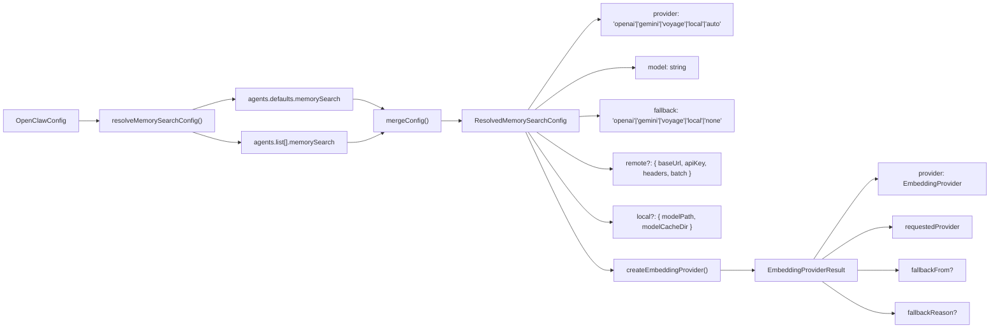
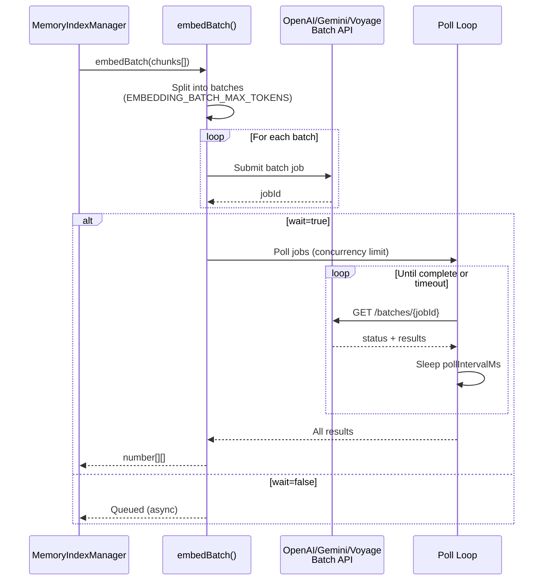

# Page: Embedding Provider Selection

# エンベディングプロバイダー選択

<details>
<summary>関連ソースファイル</summary>

この Wiki ページの生成に使用されたコンテキストファイル:

- [CHANGELOG.md](CHANGELOG.md)
- [docs/cli/memory.md](docs/cli/memory.md)
- [docs/cli/sandbox.md](docs/cli/sandbox.md)
- [docs/concepts/memory.md](docs/concepts/memory.md)
- [docs/gateway/configuration.md](docs/gateway/configuration.md)
- [docs/gateway/sandbox-vs-tool-policy-vs-elevated.md](docs/gateway/sandbox-vs-tool-policy-vs-elevated.md)
- [docs/gateway/sandboxing.md](docs/gateway/sandboxing.md)
- [docs/platforms/mac/skills.md](docs/platforms/mac/skills.md)
- [docs/tools/elevated.md](docs/tools/elevated.md)
- [docs/tools/index.md](docs/tools/index.md)
- [docs/tools/skills-config.md](docs/tools/skills-config.md)
- [src/agents/memory-search.test.ts](src/agents/memory-search.test.ts)
- [src/agents/memory-search.ts](src/agents/memory-search.ts)
- [src/agents/sandbox-explain.test.ts](src/agents/sandbox-explain.test.ts)
- [src/agents/sandbox.ts](src/agents/sandbox.ts)
- [src/cli/memory-cli.test.ts](src/cli/memory-cli.test.ts)
- [src/cli/memory-cli.ts](src/cli/memory-cli.ts)
- [src/cli/models-cli.test.ts](src/cli/models-cli.test.ts)
- [src/config/schema.ts](src/config/schema.ts)
- [src/config/types.tools.ts](src/config/types.tools.ts)
- [src/config/types.ts](src/config/types.ts)
- [src/config/zod-schema.agent-runtime.ts](src/config/zod-schema.agent-runtime.ts)
- [src/config/zod-schema.ts](src/config/zod-schema.ts)
- [src/memory/embeddings.test.ts](src/memory/embeddings.test.ts)
- [src/memory/embeddings.ts](src/memory/embeddings.ts)
- [src/memory/manager.ts](src/memory/manager.ts)

</details>

## 目的と範囲

このドキュメントでは、OpenClaw がセマンティックメモリ検索用のエンベディングプロバイダーを選択する方法について説明します。エンベディングプロバイダーは、ワークスペースファイルからのテキストチャンクのベクトル表現を生成し、`memory_search` ツールを通じたセマンティッククエリを可能にします。

一般的なメモリシステムアーキテクチャとインデックス作成については、[メモリシステム](#7)を参照してください。メモリ検索クエリの動作については、[メモリ検索](#7.3)を参照してください。メモリ設定オプションについては、[メモリ設定](#7.1)を参照してください。

---

## サポートされるプロバイダー

OpenClaw は4つのエンベディングプロバイダータイプをサポートしています:

| プロバイダー | ID | デフォルトモデル | API キー必須 | Batch API | 最大入力トークン |
|----------|----|--------------|--------------------|-----------|------------------|
| **OpenAI** | `openai` | `text-embedding-3-small` | はい | はい | 8191 |
| **Gemini** | `gemini` | `gemini-embedding-001` | はい | はい | 可変 |
| **Voyage** | `voyage` | `voyage-4-large` | はい | はい | 可変 |
| **Local** | `local` | `embeddinggemma-300M-Q8_0.gguf` | いいえ | いいえ | 可変 |

`auto` モードは、成功するまで順番にプロバイダーを試行します。

**参照元:** [src/memory/embeddings.ts:24-30](), [src/memory/embeddings-openai.ts:1-50](), [src/memory/embeddings-gemini.ts:1-50](), [src/memory/embeddings-voyage.ts:1-50](), [src/agents/memory-search.ts:73-76]()

---

## 自動選択フォールバックチェーン

### 選択フロー

```mermaid
flowchart TD
    Start["provider='auto'"] --> CheckLocal{"`local.modelPath`<br/>configured & exists?"}
    CheckLocal -->|Yes| TryLocal["Try Local<br/>(node-llama-cpp)"]
    CheckLocal -->|No| TryOpenAI["Try OpenAI<br/>(text-embedding-3-small)"]

    TryLocal --> LocalOK{Success?}
    LocalOK -->|Yes| UseLocal["Use Local Provider"]
    LocalOK -->|No| TryOpenAI

    TryOpenAI --> OpenAIOK{API Key<br/>Available?}
    OpenAIOK -->|Yes| UseOpenAI["Use OpenAI Provider"]
    OpenAIOK -->|No| TryGemini["Try Gemini<br/>(gemini-embedding-001)"]

    TryGemini --> GeminiOK{API Key<br/>Available?}
    GeminiOK -->|Yes| UseGemini["Use Gemini Provider"]
    GeminiOK -->|No| TryVoyage["Try Voyage<br/>(voyage-4-large)"]

    TryVoyage --> VoyageOK{API Key<br/>Available?}
    VoyageOK -->|Yes| UseVoyage["Use Voyage Provider"]
    VoyageOK -->|No| Disabled["Memory Search Disabled"]

    UseLocal --> Done["Indexing Enabled"]
    UseOpenAI --> Done
    UseGemini --> Done
    UseVoyage --> Done
```

**自動選択ロジック:**

1. **ローカル優先**（`local.modelPath` が読み取り可能なファイルの場合）
2. **OpenAI**（OpenAI API キーが解決される場合）
3. **Gemini**（Gemini API キーが解決される場合）
4. **Voyage**（Voyage API キーが解決される場合）
5. **無効**（プロバイダーが利用不可）

選択は、リクエストされたプロバイダーからフォールバックに切り替える際に `fallbackFrom` と `fallbackReason` を記録します。

**参照元:** [src/memory/embeddings.ts:134-238](), [src/agents/memory-search.ts:88-96]()

---

## プロバイダー設定

### 明示的なプロバイダー選択

```json5
{
  agents: {
    defaults: {
      memorySearch: {
        provider: "openai",  // "openai" | "gemini" | "voyage" | "local" | "auto"
        model: "text-embedding-3-small",
        fallback: "gemini"   // fallback if primary fails
      }
    }
  }
}
```

### 設定解決



**設定の優先順位:** エージェントごとの `memorySearch` オーバーライドは `agents.defaults.memorySearch` デフォルトにマージされます。`provider`、`model`、`fallback`、`remote`、`local` などのフィールドはエージェントごとにオーバーライドできます。

**参照元:** [src/agents/memory-search.ts:120-186](), [src/memory/embeddings.ts:42-57]()

---

## フォールバック動作

### フォールバックトリガー

次のプロバイダーへのフォールバックは以下の場合に発生します:

1. **API キー不足**: `requireApiKey()` がスロー（メッセージに "No API key found for provider" を含む）
2. **プロバイダー作成失敗**: プロバイダー初期化中の例外
3. **フォールバックモード**: `fallback` が特定のプロバイダーに設定されている（`"none"` ではない）

### フォールバック記録

```typescript
type EmbeddingProviderResult = {
  provider: EmbeddingProvider;           // The effective provider
  requestedProvider: "openai" | "local" | "gemini" | "voyage" | "auto";
  fallbackFrom?: "openai" | "local" | "gemini" | "voyage";  // Original attempt
  fallbackReason?: string;               // Error message
  openAi?: OpenAiEmbeddingClient;        // Available clients
  gemini?: GeminiEmbeddingClient;
  voyage?: VoyageEmbeddingClient;
};
```

`status()` メソッドにはフォールバック情報が含まれます:

```json5
{
  provider: "gemini",
  model: "gemini-embedding-001",
  requestedProvider: "openai",
  fallback: {
    from: "openai",
    reason: "No API key found for provider \"openai\" (auth mode: undefined)."
  }
}
```

**参照元:** [src/memory/embeddings.ts:32-40](), [src/memory/manager.ts:543-544]()

---

## プロバイダー固有の設定

### OpenAI

```json5
{
  agents: {
    defaults: {
      memorySearch: {
        provider: "openai",
        model: "text-embedding-3-small",  // or "text-embedding-3-large"
        remote: {
          baseUrl: "https://api.openai.com/v1/",  // optional override
          apiKey: "${OPENAI_API_KEY}",            // or from auth profiles
          headers: { "X-Custom": "value" }        // optional extra headers
        }
      }
    }
  }
}
```

**API キー解決:**
1. `memorySearch.remote.apiKey`
2. `models.providers.openai.apiKey`
3. `openai` プロバイダーにマッチする認証プロファイル
4. 環境変数 `OPENAI_API_KEY`

**参照元:** [src/memory/embeddings-openai.ts:1-100](), [docs/concepts/memory.md:286-303]()

### Gemini

```json5
{
  agents: {
    defaults: {
      memorySearch: {
        provider: "gemini",
        model: "gemini-embedding-001",
        remote: {
          baseUrl: "https://generativelanguage.googleapis.com/v1beta/",
          apiKey: "${GEMINI_API_KEY}",
          headers: {}
        }
      }
    }
  }
}
```

**API キー解決:**
1. `memorySearch.remote.apiKey`
2. `models.providers.google.apiKey`
3. `google` プロバイダーにマッチする認証プロファイル
4. 環境変数 `GEMINI_API_KEY`

**参照元:** [src/memory/embeddings-gemini.ts:1-100](), [docs/concepts/memory.md:262-278]()

### Voyage

```json5
{
  agents: {
    defaults: {
      memorySearch: {
        provider: "voyage",
        model: "voyage-4-large",
        remote: {
          apiKey: "${VOYAGE_API_KEY}"
        }
      }
    }
  }
}
```

**API キー解決:**
1. `memorySearch.remote.apiKey`
2. `models.providers.voyage.apiKey`
3. 環境変数 `VOYAGE_API_KEY`

**参照元:** [src/memory/embeddings-voyage.ts:1-100]()

### ローカル (node-llama-cpp)

```json5
{
  agents: {
    defaults: {
      memorySearch: {
        provider: "local",
        fallback: "none",  // disable remote fallback
        local: {
          modelPath: "hf:ggml-org/embeddinggemma-300M-GGUF/embeddinggemma-300M-Q8_0.gguf",
          modelCacheDir: "~/.openclaw/models"  // optional cache override
        }
      }
    }
  }
}
```

**モデル解決:**
- `hf:` プレフィックス → HuggingFace から自動ダウンロード
- 絶対/相対パス → ファイルシステムからロード
- デフォルト: `hf:ggml-org/embeddinggemma-300M-GGUF/embeddinggemma-300M-Q8_0.gguf`（約 600 MB）

**要件:**
- `pnpm approve-builds` を実行し `node-llama-cpp` を選択
- `pnpm rebuild node-llama-cpp` を実行
- `node-llama-cpp` のネイティブビルド

**参照元:** [src/memory/embeddings.ts:82-132](), [docs/concepts/memory.md:536-542]()

---

## バッチエンベディング

### Batch API サポート

| プロバイダー | Batch API | デフォルト有効 | ポーリング間隔 | タイムアウト |
|----------|-----------|-----------------|---------------|---------|
| OpenAI | ✅ はい | いいえ | 2000 ms | 60 分 |
| Gemini | ✅ はい | いいえ | 2000 ms | 60 分 |
| Voyage | ✅ はい | いいえ | 2000 ms | 60 分 |
| Local | ❌ いいえ | N/A | N/A | N/A |

### バッチ設定

```json5
{
  agents: {
    defaults: {
      memorySearch: {
        provider: "openai",
        remote: {
          batch: {
            enabled: true,             // enable batch API (default: false)
            wait: true,                // wait for completion (default: true)
            concurrency: 2,            // parallel batch jobs (default: 2)
            pollIntervalMs: 2000,      // poll interval (default: 2000)
            timeoutMinutes: 60         // max wait time (default: 60)
          }
        }
      }
    }
  }
}
```

### Batch API ワークフロー



**バッチ失敗処理:**
- バッチ失敗数を追跡（`batchFailureCount`）
- `BATCH_FAILURE_LIMIT`（2回）の連続失敗後、Batch API を無効化
- `batchFailureLastError` と `batchFailureLastProvider` を記録

**参照元:** [src/memory/manager.ts:124-135](), [src/memory/batch-openai.ts:1-100](), [src/memory/batch-gemini.ts:1-100](), [src/memory/batch-voyage.ts:1-100](), [docs/concepts/memory.md:313-327]()

---

## プロバイダー選択のトラブルシューティング

### 診断コマンド

```bash
# メモリステータスを確認（プロバイダー情報を含む）
openclaw memory status
openclaw memory status --deep        # probe embeddings availability
openclaw memory status --agent main --json

# 詳細ログで再インデックス
openclaw memory index --verbose
```

### ステータス出力フィールド

```typescript
{
  backend: "builtin",
  provider: "openai",                    // effective provider
  model: "text-embedding-3-small",       // effective model
  requestedProvider: "auto",             // original config
  fallback?: {
    from: "local",                       // attempted provider
    reason: "Model file not found..."    // fallback reason
  }
}
```

### よくある問題

| 問題 | 原因 | 修正 |
|-------|-------|-----|
| **"Memory search disabled"** | プロバイダーが解決できない | 明示的な `provider` + API キーを設定 |
| **"No API key found for provider"** | リクエストされたプロバイダーの API キーが不足 | `remote.apiKey` を追加または環境変数を設定 |
| **間違ったプロバイダーにフォールバック** | 自動選択が予期しないプロバイダーを選択 | 明示的な `provider` を設定 |
| **Batch API が無効** | `batchFailureCount >= BATCH_FAILURE_LIMIT` | Batch API のクォータ/権限をチェック |
| **ローカルプロバイダーが失敗** | ネイティブビルドまたはモデルファイルが不足 | `pnpm approve-builds` + rebuild を実行 |

### プロバイダー選択のデバッグ

```mermaid
flowchart TD
    Status["openclaw memory status"] --> Check{"`fallback` field present?"}
    Check -->|Yes| Fallback["Provider fell back"]
    Check -->|No| Direct["Using requested provider"]

    Fallback --> Reason["Check `fallback.reason`"]
    Reason --> APIKey["'No API key found'?"]
    Reason --> ModelPath["'Model file not found'?"]
    Reason --> Other["Other error"]

    APIKey --> FixAPI["Add API key:<br/>- memorySearch.remote.apiKey<br/>- models.providers.*.apiKey<br/>- Environment variable"]
    ModelPath --> FixModel["Add local.modelPath<br/>or use remote provider"]
    Other --> FixOther["Check logs with<br/>--verbose"]

    Direct --> Working["Provider working as configured"]
```

**参照元:** [src/cli/memory-cli.ts:243-380](), [src/memory/manager.ts:470-564]()

---

## コードエンティティリファレンス

### コア関数

- **`createEmbeddingProvider()`** [src/memory/embeddings.ts:134-238](): メインのプロバイダー選択ロジック
- **`resolveMemorySearchConfig()`** [src/agents/memory-search.ts:187-202](): エージェント設定をマージ
- **`mergeConfig()`** [src/agents/memory-search.ts:120-186](): 設定解決
- **`canAutoSelectLocal()`** [src/memory/embeddings.ts:61-75](): ローカルモデルの可用性をチェック
- **`isMissingApiKeyError()`** [src/memory/embeddings.ts:77-80](): API キーエラーを検出

### プロバイダー実装

- **`createOpenAiEmbeddingProvider()`** [src/memory/embeddings-openai.ts:50-100]()
- **`createGeminiEmbeddingProvider()`** [src/memory/embeddings-gemini.ts:50-100]()
- **`createVoyageEmbeddingProvider()`** [src/memory/embeddings-voyage.ts:50-100]()
- **`createLocalEmbeddingProvider()`** [src/memory/embeddings.ts:82-132]()

### Batch API

- **`runOpenAiEmbeddingBatches()`** [src/memory/batch-openai.ts:20-200]()
- **`runGeminiEmbeddingBatches()`** [src/memory/batch-gemini.ts:20-200]()
- **`runVoyageEmbeddingBatches()`** [src/memory/batch-voyage.ts:20-200]()

### マネージャー統合

- **`MemoryIndexManager.constructor()`** [src/memory/manager.ts:205-248](): プロバイダーを初期化
- **`MemoryIndexManager.status()`** [src/memory/manager.ts:470-564](): プロバイダーステータスを返す
- **`MemoryIndexManager.resolveBatchConfig()`** [src/memory/manager.ts:671-689](): バッチ設定を解決

**参照元:** [src/memory/embeddings.ts:1-238](), [src/memory/manager.ts:111-248](), [src/agents/memory-search.ts:1-202]()
