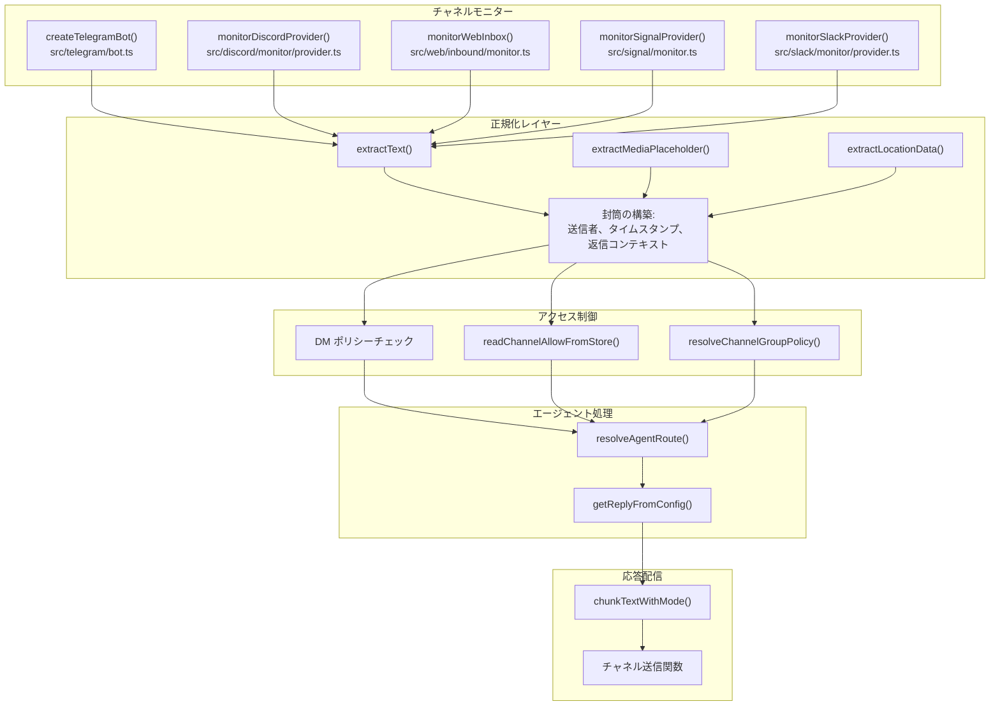
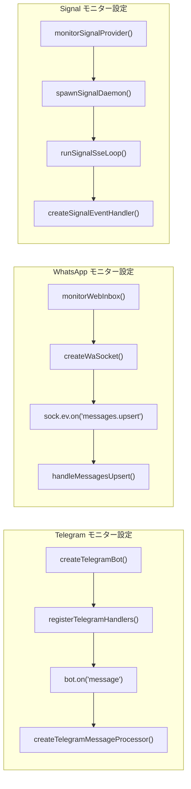
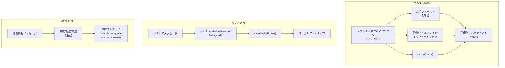
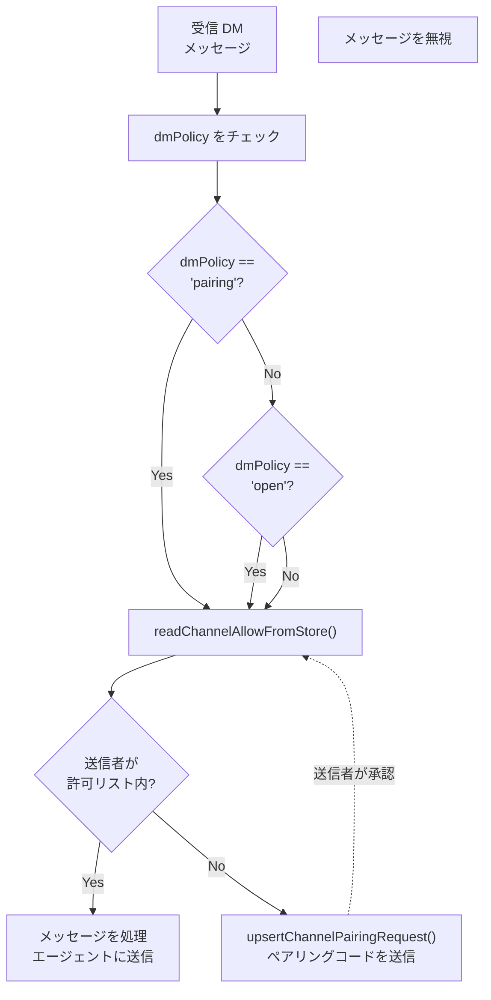
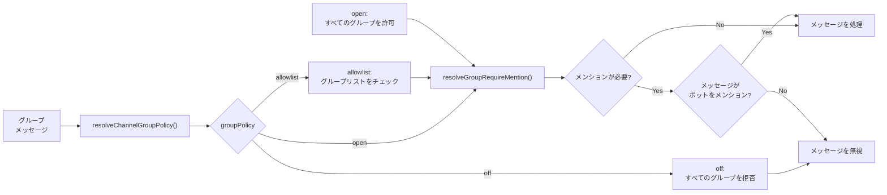
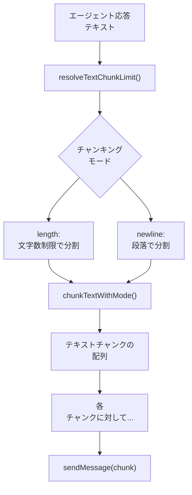
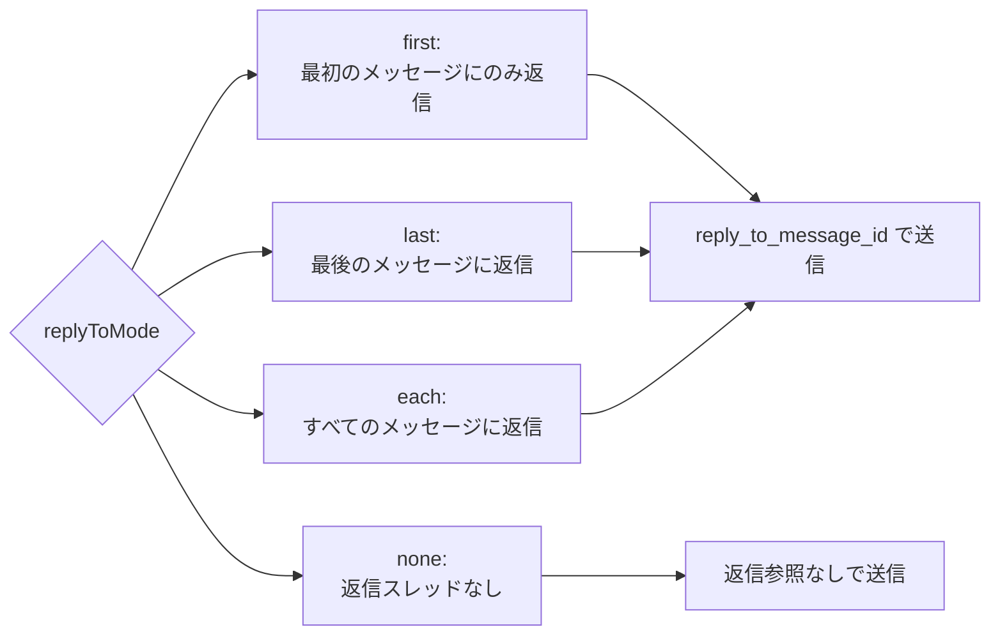
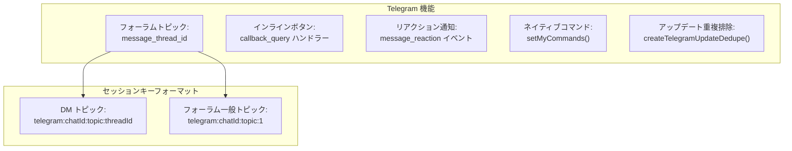

# ページ: チャネル

# チャネル

<details>
<summary>関連ソースファイル</summary>

この Wiki ページの作成に使用されたコンテキストとして、以下のファイルが使用されました：

- [README.md](README.md)
- [assets/avatar-placeholder.svg](assets/avatar-placeholder.svg)
- [docs/channels/zalo.md](docs/channels/zalo.md)
- [docs/channels/zalouser.md](docs/channels/zalouser.md)
- [scripts/clawtributors-map.json](scripts/clawtributors-map.json)
- [scripts/update-clawtributors.ts](scripts/update-clawtributors.ts)
- [scripts/update-clawtributors.types.ts](scripts/update-clawtributors.types.ts)
- [src/config/config.ts](src/config/config.ts)
- [src/discord/monitor.ts](src/discord/monitor.ts)
- [src/imessage/monitor.ts](src/imessage/monitor.ts)
- [src/index.test.ts](src/index.test.ts)
- [src/index.ts](src/index.ts)
- [src/signal/monitor.ts](src/signal/monitor.ts)
- [src/slack/monitor.ts](src/slack/monitor.ts)
- [src/telegram/bot.test.ts](src/telegram/bot.test.ts)
- [src/telegram/bot.ts](src/telegram/bot.ts)
- [src/web/auto-reply.ts](src/web/auto-reply.ts)
- [src/web/inbound.media.test.ts](src/web/inbound.media.test.ts)
- [src/web/inbound.test.ts](src/web/inbound.test.ts)
- [src/web/inbound.ts](src/web/inbound.ts)
- [src/web/test-helpers.ts](src/web/test-helpers.ts)
- [src/web/vcard.ts](src/web/vcard.ts)
- [tsconfig.json](tsconfig.json)
- [ui/src/styles.css](ui/src/styles.css)
- [ui/src/styles/layout.mobile.css](ui/src/styles/layout.mobile.css)

</details>


## 概要

チャネルは OpenClaw を外部メッセージングプラットフォームと統合します。各チャネルは以下のパターンを実装するモニターです：

1. プラットフォーム API から受信メッセージを受け取る
2. メッセージコンテンツを標準的な封筒形式に正規化する
3. アクセス制御ポリシー（DM ペアリング、許可リスト、グループポリシー）を適用する
4. メッセージを `resolveAgentRoute()` 経由でエージェントセッションにルーティングする
5. エージェントの応答をプラットフォームに配信する

ゲートウェイはすべてのチャネルモニターを調整します。詳細は [ゲートウェイ](#3) を参照（制御プレーン）、[エージェントシステム](#5) を参照（ルーティング）、[設定システム](#4) を参照（チャネル設定）。

---

## チャネルアーキテクチャ概要

OpenClaw チャネルは、各プラットフォーム固有の実装が以下を行う**モニターパターン**に従います：

1. **モニター**：メッセージングプラットフォームでの受信イベントを監視
2. **抽出**：メッセージコンテンツ、メディア、メタデータを抽出
3. **適用**：アクセス制御ポリシー（DM ペアリング、許可リスト、グループポリシー）を適用
4. **ルーティング**：適切なエージェントセッションにメッセージをルーティング
5. **配信**：エージェントの応答をプラットフォームに配信



**タイトル：** チャネルモニターアーキテクチャとメッセージ処理パイプライン

**ソース：**
- [src/telegram/bot.ts:112-490]()
- [src/discord/monitor.ts:1-29]()
- [src/web/inbound.ts:1-5]()
- [src/signal/monitor.ts:1-390]()
- [src/slack/monitor.ts:1-6]()
- [src/auto-reply/chunk.ts]()
- [src/routing/resolve-route.ts]()

---

## サポートされているチャネル

OpenClaw は以下のメッセージングプラットフォームと統合されます：

| チャネル | ライブラリ/プロトコル | モジュール | 主な機能 |
|---------|------------------|--------|--------------|
| **WhatsApp** | Baileys (WebSocket) | `src/web/` | QR ログイン、メディア、vCards、位置情報 |
| **Telegram** | grammY (Bot API) | `src/telegram/` | フォーラム、リアクション、インラインボタン、ネイティブコマンド |
| **Discord** | Discord.js | `src/discord/` | スレッド、リアクション、スラッシュコマンド、ギルドポリシー |
| **Slack** | Bolt SDK | `src/slack/` | スラッシュコマンド、ブロック、メンション |
| **Signal** | signal-cli (JSON-RPC) | `src/signal/` | E2EE メッセージ、添付ファイル、リアクション |
| **BlueBubbles** | HTTP API | `extensions/bluebubbles/` | Private API 経由の iMessage |
| **iMessage** | macOS Messages | `extensions/imessage/` | macOS 直接統合（レガシー） |
| **MS Teams** | Bot Framework | `extensions/msteams/` | エンタープライズメッセージ、アダプティブカード |
| **Matrix** | matrix-bot-sdk | `extensions/matrix/` | 分散型 E2EE、ルーム |
| **Zalo** | HTTP API | `extensions/zalo/` | ベトナムのメッセージングプラットフォーム |
| **WebChat** | Gateway WebSocket | `src/web/` | ブラウザベースのチャット UI |
| **Google Chat** | Chat API | `extensions/googlechat/` | ワークスペース統合 |
| **Feishu** | Lark SDK | `extensions/feishu/` | エンタープライズメッセージ（中国） |

**ソース：**
- [README.md:147]()
- [package.json:119-151]()
- [pnpm-workspace.yaml:1-16]()

---

## 受信メッセージ処理

### モニター登録

各チャネルは受信メッセージのイベントリスナーを登録するモニター関数を実装します：



**タイトル：** チャネルモニター初期化とイベント登録

**ソース：**
- [src/telegram/bot.ts:112-490]()
- [src/web/inbound/monitor.ts]()
- [src/signal/monitor.ts:275-390]()

### メッセージ抽出

チャネルはプラットフォーム固有の API を使用してメッセージコンテンツを抽出し、共通の形式に正規化します：



**タイトル：** メッセージコンテンツ抽出と正規化

WhatsApp メッセージ抽出を処理する `extractText` 関数 [src/web/inbound/extract.ts]()：

```typescript
// 会話テキストを優先、キャプションにフォールバック
const text = extractText(message);

// テキストがない場合のメディアプレースホルダー
const mediaPlaceholder = extractMediaPlaceholder(message);

// 座標を含む位置情報データ
const location = extractLocationData(message);
```

**ソース：**
- [src/web/inbound/extract.ts]()
- [src/web/inbound.test.ts:1-238]()
- [src/web/vcard.ts:1-83]()

---

## アクセス制御

### DM ポリシー適用

OpenClaw はチャネルごとに構成できる 3 つの DM ポリシーをサポートします：

| ポリシー | 動作 | 構成 |
|--------|----------|---------------|
| `pairing` | 不明な送信者はペアリングコードを受信 | `channels.telegram.dmPolicy: "pairing"` |
| `open` | すべての送信者を許可（許可リストに `*` が必要） | `dmPolicy: "open"`, `allowFrom: ["*"]` |
| `allowlist` | 明示的に許可された送信者のみ | `allowFrom: ["+15555550123", "alice"]` |



**タイトル：** DM ポリシー決定フローとペアリングプロセス

**ソース：**
- [src/telegram/bot.ts:232]()
- [src/config/group-policy.ts]()
- [src/pairing/pairing-store.ts]()
- [README.md:113-119]()

### グループポリシー

グループメッセージは追加のポリシーを適用します：



**タイトル：** グループポリシーとメンション要件評価

**ソース：**
- [src/telegram/bot.ts:286-337]()
- [src/config/group-policy.ts]()
- [src/discord/monitor/allow-list.ts]()

---

## 応答配信

### テキストチャンキング

長い応答はチャネルの制限に基づいて複数のメッセージに分割されます：



**タイトル：** テキストチャンキングと配信ループ

チャネル別のデフォルトチャンキング制限：

| チャネル | デフォルト制限 | 構成 |
|---------|---------------|---------------|
| Telegram | 4096 文字 | `channels.telegram.textLimit` |
| Discord | 2000 文字 | `channels.discord.textLimit` |
| WhatsApp | 4096 文字 | `channels.whatsapp.textLimit` |
| Signal | 4096 文字 | `channels.signal.textLimit` |
| Slack | 4000 文字 | `channels.slack.textLimit` |

**ソース：**
- [src/auto-reply/chunk.ts]()
- [src/telegram/bot.ts:230]()
- [src/signal/monitor.ts:289-290]()

### 応答モード

チャネルは `replyToMode` で異なる返信スレッド動作をサポートします：



**タイトル：** 返信スレッドモード選択

**ソース：**
- [src/telegram/bot.ts:240]()
- [src/config/types.ts]()

---

## チャネル固有の機能

### Telegram



**タイトル：** Telegram 固有の機能とセッションキー

- **逐次処理**: [src/telegram/bot.ts:145]() - `sequentialize()` を使用してチャットごとに更新を逐次処理
- **アップデート重複排除**: [src/telegram/bot-updates.ts]() - リトライされたアップデートの重複処理を防止
- **フォーラムサポート**: [src/telegram/bot/helpers.ts]() - フォーラムトピックを別々のセッションとして扱う
- **ネイティブコマンド**: [src/telegram/bot-native-commands.ts]() - Telegram API にスラッシュコマンドを登録
- **コールバッククエリ**: [src/telegram/bot.test.ts:364-395]() - イラインボタン押下をメッセージとして処理

**ソース：**
- [src/telegram/bot.ts:1-495]()
- [src/telegram/bot-updates.ts]()
- [src/telegram/bot/helpers.ts]()
- [src/telegram/bot-native-commands.ts]()

### Discord

- **スレッド継承**: [src/discord/monitor/threading.ts]() - 子スレッドが親チャネルバインディングを継承
- **リアクション通知**: [src/discord/monitor/allow-list.ts]() - 構成可能なリアクションイベント処理
- **ギルドポリシー**: ギルド単位とチャネル単位のアクセス制御
- **ユーザー名解決**: [src/discord/monitor/allow-list.ts]() - DM ルーティングのためにユーザー名をユーザー ID に解決

**ソース：**
- [src/discord/monitor.ts:1-29]()
- [CHANGELOG.md:178]()

### WhatsApp

- **vCard 抽出**: [src/web/vcard.ts:1-83]() - 複数の電話番号を含む連絡先カードを解析
- **位置情報メッセージ**: [src/web/inbound.test.ts:196-237]() - 静的ライブ位置情報共有の両方をサポート
- **ワンスビューメッセージ**: [src/web/inbound.test.ts:174-182]() - view-once v2 拡張メッセージをアンラップ
- **メディアパイプライン**: 画像、音声、ビデオ、ドキュメントの自動ダウンロードと保存

**ソース：**
- [src/web/inbound.ts:1-5]()
- [src/web/inbound.test.ts:1-238]()
- [src/web/vcard.ts:1-83]()

### Signal

- **デーモン管理**: [src/signal/monitor.ts:316-349]() - `signal-cli` デーモンの起動と監視
- **添付ファイル取得**: [src/signal/monitor.ts:182-227]() - JSON-RPC 経由で添付ファイルをダウンロード
- **リアクション通知**: [src/signal/monitor.ts:96-139]() - 構成可能なリアクションモード（自身/許可リスト/すべて）
- **E2EE サポート**: 透過的なエンドツーエンド暗号化処理

**ソース：**
- [src/signal/monitor.ts:1-390]()

---

## 構成構造

### チャネル構成スキーマ

チャネルは `openclaw.json` の `channels.<channelName>` で構成されます：

```typescript
{
  channels: {
    telegram: {
      botToken: string;           // Bot API トークン
      dmPolicy: "pairing" | "open" | "allowlist";
      allowFrom: string[];        // DM 許可リスト
      groupAllowFrom: string[];   // グループ許可リスト
      groups: {                   // グループごとの設定
        "*": {                    // デフォルトグループ設定
          requireMention: boolean;
          groupPolicy: "open" | "allowlist" | "off";
        },
        "123456": {               // グループ固有のオーバーライド
          requireMention: false;
        }
      };
      replyToMode: "first" | "last" | "each" | "none";
      textLimit: number;          // メッセージあたりの最大文字数
      mediaMaxMb: number;         // メディアの最大 MB
      historyLimit: number;       // グループ履歴長
      customCommands: Array<{command: string, description: string}>;
    },

    whatsapp: {
      dmPolicy: "pairing" | "open" | "allowlist";
      allowFrom: string[];
      groups: Record<string, {requireMention: boolean}>;
      mediaMaxMb: number;
    },

    discord: {
      token: string;
      dm: {
        policy: "pairing" | "open" | "allowlist";
        allowFrom: string[];
      };
      guilds: Record<string, {
        channels: Record<string, {allowFrom: string[]}>;
      }>;
    }
  }
}
```

**ソース：**
- [src/config/config.ts]()
- [src/config/types.ts]()

### マルチアカウントサポート

一部のチャネルは `accountId` で複数のアカウントをサポートします：

```typescript
{
  channels: {
    telegram: {
      accounts: {
        "main": {
          botToken: "123:ABC",
          allowFrom: ["alice"]
        },
        "secondary": {
          botToken: "456:DEF",
          allowFrom: ["bob"]
        }
      }
    }
  }
}
```

**ソース：**
- [src/telegram/accounts.ts]()
- [src/signal/accounts.ts]()

---

## 主要なコードパス

### Telegram メッセージ処理

1. **イベント受信**: [src/telegram/bot.ts:208-221]() - Bot ミドルウェアがアップデートを受信
2. **重複排除**: [src/telegram/bot.ts:167-180]() - アップデートが既に処理されたかチェック
3. **逐次キー**: [src/telegram/bot.ts:67-110]() - チャットごとのキューにルーティング
4. **ハンドラー登録**: [src/telegram/bot-handlers.ts]() - メッセージ/コールバック/リアクションを処理
5. **メッセージプロセッサ**: [src/telegram/bot-message.ts]() - コンテンツを抽出し封筒を構築
6. **自動返信**: [src/auto-reply/reply.ts]() - エージェント応答を生成
7. **配信**: [src/telegram/send.ts]() - チャンク化された応答を送信

**ソース：**
- [src/telegram/bot.ts:112-490]()
- [src/telegram/bot-handlers.ts]()
- [src/telegram/bot-message.ts]()

### WhatsApp メッセージ処理

1. **ソケット接続**: [src/web/session.ts]() - Baileys WebSocket を作成
2. **イベントリスナー**: [src/web/inbound/monitor.ts]() - `messages.upsert` ハンドラーを登録
3. **メッセージ抽出**: [src/web/inbound/extract.ts]() - テキスト/メディア/位置情報を抽出
4. **メディアダウンロード**: [src/web/inbound.media.test.ts:105-145]() - メディアをダウンロードして保存
5. **アクセス制御**: DM ポリシーと許可リストをチェック
6. **自動返信**: エージェント経由で応答を生成
7. **配信**: [src/web/send.ts]() - Baileys 経由で送信

**ソース：**
- [src/web/inbound.ts:1-5]()
- [src/web/inbound/monitor.ts]()
- [src/web/inbound/extract.ts]()

---

## 拡張チャネル

拡張チャネルは `extensions/` で別のパッケージとして実装されます：

| 拡張 | パッケージ | エントリーポイント |
|-----------|---------|-------------|
| BlueBubbles | `@openclaw/bluebubbles` | `extensions/bluebubbles/plugin.ts` |
| iMessage | `@openclaw/imessage` | `extensions/imessage/plugin.ts` |
| MS Teams | `@openclaw/msteams` | `extensions/msteams/plugin.ts` |
| Matrix | `@openclaw/matrix` | `extensions/matrix/plugin.ts` |
| Zalo | `@openclaw/zalo` | `extensions/zalo/plugin.ts` |
| Google Chat | `@openclaw/googlechat` | `extensions/googlechat/plugin.ts` |
| Feishu | `@openclaw/feishu` | `extensions/feishu/plugin.ts` |

拡張は [拡張とプラグイン](#10) で説明されているプラグインシステム経由で統合されます。

**ソース：**
- [pnpm-workspace.yaml:4-5]()
- [package.json:248-539]()

---