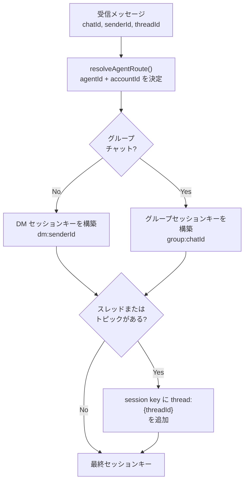
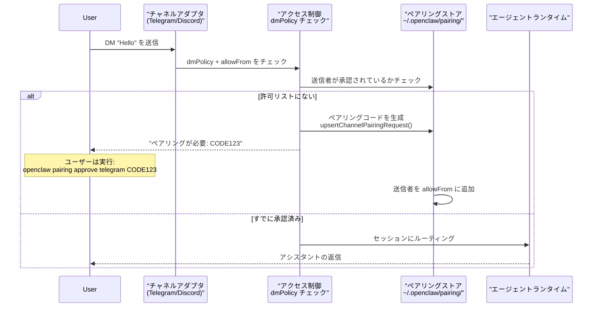
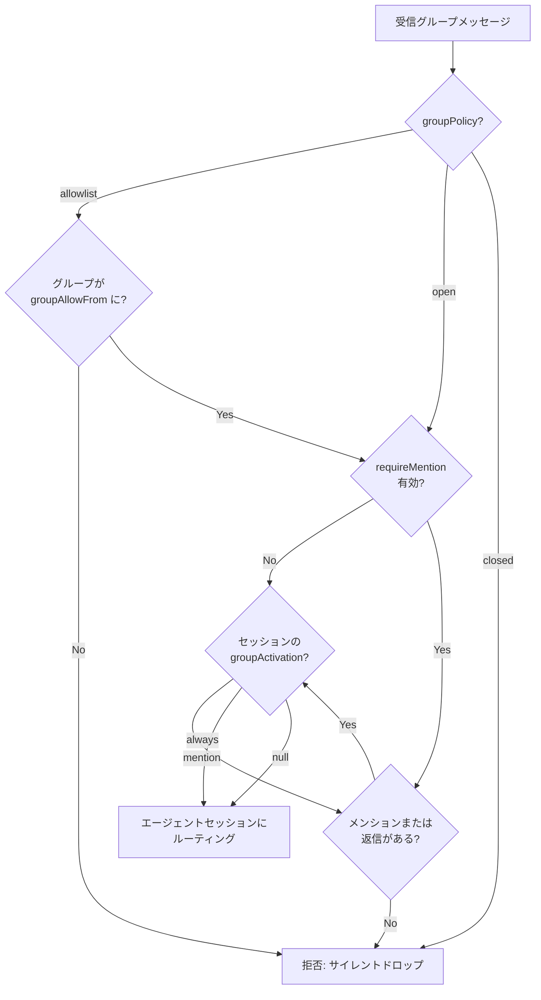
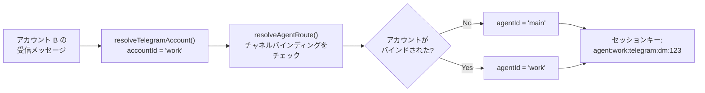

# ページ: チャネルルーティングとアクセス制御

# チャネルルーティングとアクセス制御

<details>
<summary>関連ソースファイル</summary>

この Wiki ページの作成に使用されたコンテキストとして、以下のファイルが使用されました：

- [.github/actions/detect-docs-changes/action.yml](.github/actions/detect-docs-changes/action.yml)
- [.github/actions/setup-node-env/action.yml](.github/actions/setup-node-env/action.yml)
- [.github/workflows/ci.yml](.github/workflows/ci.yml)
- [.gitignore](.gitignore)
- [docs/automation/poll.md](docs/automation/poll.md)
- [docs/ci.md](docs/ci.md)
- [docs/providers/synthetic.md](docs/providers/synthetic.md)
- [docs/zh-CN/vps.md](docs/zh-CN/vps.md)
- [extensions/msteams/src/store-fs.ts](extensions/msteams/src/store-fs.ts)
- [scripts/test-live-gateway-models-docker.sh](scripts/test-live-gateway-models-docker.sh)
- [scripts/test-live-models-docker.sh](scripts/test-live-models-docker.sh)
- [src/agents/live-auth-keys.test.ts](src/agents/live-auth-keys.test.ts)
- [src/agents/live-auth-keys.ts](src/agents/live-auth-keys.ts)
- [src/agents/pi-embedded-helpers.isbillingerrormessage.test.ts](src/agents/pi-embedded-helpers.isbillingerrormessage.test.ts)
- [src/agents/zai.live.test.ts](src/agents/zai.live.test.ts)
- [src/commands/message.ts](src/commands/message.ts)
- [src/discord/monitor.ts](src/discord/monitor.ts)
- [src/gateway/live-image-probe.ts](src/gateway/live-image-probe.ts)
- [src/imessage/monitor.ts](src/imessage/monitor.ts)
- [src/infra/outbound/abort.ts](src/infra/outbound/abort.ts)
- [src/infra/outbound/message.ts](src/infra/outbound/message.ts)
- [src/infra/outbound/outbound-send-service.ts](src/infra/outbound/outbound-send-service.ts)
- [src/media/png-encode.ts](src/media/png-encode.ts)
- [src/pairing/pairing-store.ts](src/pairing/pairing-store.ts)
- [src/signal/monitor.ts](src/signal/monitor.ts)
- [src/slack/monitor.ts](src/slack/monitor.ts)
- [src/telegram/bot.test.ts](src/telegram/bot.test.ts)
- [src/telegram/bot.ts](src/telegram/bot.ts)
- [src/web/auto-reply.ts](src/web/auto-reply.ts)
- [src/web/inbound.media.test.ts](src/web/inbound.media.test.ts)
- [src/web/inbound.test.ts](src/web/inbound.test.ts)
- [src/web/inbound.ts](src/web/inbound.ts)
- [src/web/test-helpers.ts](src/web/test-helpers.ts)
- [src/web/vcard.ts](src/web/vcard.ts)

</details>


## 目的と範囲

このドキュメントでは、OpenClaw がメッセージングチャネルからの受信メッセージをエージェントセッションにルーティングし、アクセス制御ポリシーを適用する方法について説明します。以下の内容をカバーしています：

- **セッションキー解決**: メッセージ識別子がセッションキーにマップされる方法
- **DM アクセスポリシー**: ダイレクトメッセージを送信できるユーザーを制御する方法（ペアリング、許可リスト、オープン）
- **グループアクセスポリシー**: アシスタントがどのグループに応答するかを制御する方法（許可リスト、オープン、メンションゲート）
- **マルチアカウンルーティング**: チャネルアカウントごとにセッションを分離
- **チャネル固有の動作**: プラットフォームごとのルーティングの違い（Telegram トピック、Discord スレッドなど）

チャネル固有のセットアップ手順については、個々のチャネルページを参照してください（WhatsApp は [8.2](#8.2)、Telegram は [8.3](#8.3) など）。セッションライフサイクルとストレージについては [5.3](#5.3) を参照してください。

---

## セッションキー解決

すべての受信メッセージは、メッセージがどの会話スレッドに属するかを決定する**セッションキー**にマッピングされます。セッションキーは階層的なパターンに従います：

```
agent:{agentId}:{channel}:{scope}:{identifier}
```

**コンポーネント：**
- `agentId`: ターゲットエージェント（`resolveAgentRoute` バインディングから）
- `channel`: プラットフォーム識別子（`telegram`、`discord`、`whatsapp`、`signal` など）
- `scope`: `dm` または `group` のいずれか
- `identifier`: 会話の一意の ID（ユーザー ID、グループ ID、スレッド ID）

### スコープ別のセッションキーパターン

| スコープ | パターン | 例 |
|-------|---------|---------|
| ダイレクトメッセージ | `agent:{agentId}:{channel}:dm:{userId}` | `agent:main:telegram:dm:123456789` |
| DM スレッド | `agent:{agentId}:{channel}:dm:{userId}:thread:{threadId}` | `agent:main:telegram:dm:123456789:thread:42` |
| グループチャット | `agent:{agentId}:{channel}:group:{groupId}` | `agent:main:discord:group:987654321` |
| グループスレッド | `agent:{agentId}:{channel}:group:{groupId}:thread:{threadId}` | `agent:main:discord:group:987654321:thread:101` |

### セッションキー解決フロー



**ソース：** [src/telegram/bot.ts:287-295](), [src/routing/session-key.ts]()（Telegram ロジックから推定）、高レベルアーキテクチャの図 2

---

## DM アクセス制御

ダイレクトメッセージアクセスは `dmPolicy` 構成によって制御されます。これはグローバルまたはチャネルアカウントごとに設定できます。

### DM ポリシーモード

| モード | 動作 | 使用例 |
|------|----------|----------|
| `pairing` | 不明な送信者はペアリングコードを受け取り、承認されるまでメッセージは無視される | **デフォルト**；公開時に安全 |
| `allowlist` | `allowFrom` リスト内の送信者のみメッセージを送信できる | 既知の連絡先を持つプライベートアシスタント |
| `open` | すべての送信者にメッセージを送信できる（`allowFrom` に `"*"` が必要） | 公開ボット（明示的なオプトインが必要） |

### 構成

```json5
{
  channels: {
    telegram: {
      dmPolicy: "pairing",  // または "allowlist" または "open"
      allowFrom: [
        "123456789",        // Telegram ユーザー ID
        "987654321",
        "*"                 // open モードには必須
      ]
    }
  }
}
```

### ペアリングフロー



**主要な関数：**
- `upsertChannelPairingRequest()` - ペアリングコードを生成 ([src/pairing/pairing-store.ts]())
- `readChannelAllowFromStore()` - 承認された送信者を読み込み ([src/pairing/pairing-store.ts]())
- `isSignalSenderAllowed()` - 許可リストに対して送信者を検証 ([src/signal/identity.ts]())

**ソース：** [src/telegram/bot.ts:228-236](), [src/signal/monitor.ts:271-273](), README.md セキュリティセクション

---

## グループアクセス制御

グループチャットアクセスは `groupPolicy` と `requireMention` 設定によって制御されます。グループはグローバルポリシーを持つことができ、グループごとまたはスレッドごとのオーバーライドが可能です。

### グループポリシーモード

| モード | 動作 | 構成 |
|------|----------|---------------|
| `allowlist` | 構成内のグループのみ許可 | グループ ID を明示的にリストするか `"*"` を使用する必要がある |
| `open` | すべてのグループを許可（メンションゲートが適用される） | グループリストは不要 |
| `closed` | すべてのグループをブロック | 明示的な拒否 |

### メンションゲート

`requireMention` が有効な場合、アシスタントは以下のメッセージにのみ応答します：
1. ボットを明示的にメンションする（`@botname` または `/command`）
2. 以前のボットメッセージに返信する
3. ボットによって開始されたスレッド内にある（チャネルに依存）

### グループ構成例

```json5
{
  channels: {
    telegram: {
      groupPolicy: "allowlist",
      requireMention: true,
      groupAllowFrom: [
        "123456789",  // 特定のグループ ID
        "*"           // またはすべてのグループを許可
      ],
      groups: {
        "987654321": {
          requireMention: false,  // このグループのオーバーライド
          topics: {
            "42": {
              requireMention: true  // トピック 42 のオーバーライド
            }
          }
        }
      }
    }
  }
}
```

### グループアクセスフロー



**主要な関数：**
- `resolveChannelGroupPolicy()` - グループポリシーを決定 ([src/config/group-policy.ts]())
- `resolveChannelGroupRequireMention()` - メンション要件をチェック ([src/config/group-policy.ts]())
- `resolveGroupActivation()` - セッションレベルのオーバーライドを読み込み ([src/telegram/bot.ts:285-304]())
- `isDiscordGroupAllowedByPolicy()` - Discord 固有のチェック ([src/discord/monitor.ts:8]())
- `isSlackChannelAllowedByPolicy()` - Slack 固有のチェック ([src/slack/monitor.ts:2]())

**ソース：** [src/telegram/bot.ts:278-323](), [src/config/group-policy.ts](), [src/discord/monitor.ts:7-9]()

---

## マルチアカウンルーティング

OpenClaw はチャネルあたり複数のアカウントをサポートします（例: 複数の Telegram ボット、複数の WhatsApp 番号）。各アカウントは分離されたアクセスポリシーを持つことができ、異なるエージェントにルーティングできます。

### アカウント解決



### 構成

```json5
{
  channels: {
    telegram: {
      accounts: {
        personal: {
          botToken: "TOKEN_A",
          dmPolicy: "pairing",
          allowFrom: ["111", "222"]
        },
        work: {
          botToken: "TOKEN_B",
          dmPolicy: "allowlist",
          allowFrom: ["333", "444"]
        }
      }
    }
  },
  agents: {
    routing: {
      bindings: [
        {
          channel: "telegram",
          accountId: "work",
          agentId: "work_agent"
        }
      ]
    }
  }
}
```

**主要な関数：**
- `resolveTelegramAccount()` - アカウント構成を読み込み ([src/telegram/accounts.ts]())
- `resolveSignalAccount()` - Signal アカウントを読み込み ([src/signal/accounts.ts]())
- `resolveAgentRoute()` - バインディングから agentId を決定 ([src/routing/resolve-route.ts]())

**ソース：** [src/telegram/bot.ts:118-122](), [src/signal/monitor.ts:256-259](), CHANGELOG.md:70

---

## チャネル固有のルーティングパターン

異なるチャネルは、特にスレッドとトピックに関して独自のルーティングセマンティクスを持っています。

### ルーティング比較表

| チャネル | DM スコープ | グループスコープ | スレッドサポート | アカウント分離 |
|---------|----------|-------------|----------------|-------------------|
| **Telegram** | `dm:{userId}` | `group:{chatId}` | トピック: `thread:{topicId}` がベースキーに追加<br/>DM スレッド: 別のセッション | ボットトークンごと |
| **Discord** | `dm:{userId}` | `group:{guildId}:{channelId}` | スレッド: `thread:{threadId}` を持つ別のセッション | ボットトークンごと |
| **WhatsApp** | `dm:{jid}` | `group:{jid}` | ネイティブスレッドなし | 電話番号ごと |
| **Signal** | `dm:{e164}` | `group:{groupId}` | ネイティブスレッドなし | 電話番号ごと |
| **Slack** | `dm:{userId}` | `group:{channelId}` | スレッド: `ts` タイムスタンプでスレッドキーを決定 | ワークスペーストークンごと |
| **iMessage** | `dm:{chatId}` | `group:{chatId}` | 明示的なスレッドなし | デバイスアカウントごと |

### Telegram トピック処理

Telegram フォーラムは `message_thread_id` を使用してスーパーグループ内のトピックを分離します。OpenClaw はフォーラムトピックを別のセッションとして扱います：

- **フォーラムグループメッセージ**: `agent:main:telegram:group:123456789`（一般トピック、ID=1）
- **フォーラムトピックメッセージ**: `agent:main:telegram:group:123456789`（他のトピックはほとんどの場合ベースキーに追加されません；実装を確認）
- **DM スレッドメッセージ**: `agent:main:telegram:dm:987654321:thread:42`

**トピック解決ロジック：**
```typescript
// src/telegram/bot.ts:99-106 から
const isGroup = msg?.chat?.type === "group" || msg?.chat?.type === "supergroup";
const messageThreadId = msg?.message_thread_id;
const isForum = (msg?.chat as { is_forum?: boolean })?.is_forum;
const threadId = isGroup
  ? resolveTelegramForumThreadId({ isForum, messageThreadId })
  : messageThreadId;
if (typeof chatId === "number") {
  return threadId != null ? `telegram:${chatId}:topic:${threadId}` : `telegram:${chatId}`;
}
```

### Discord スレッド処理

Discord スレッドは独自の ID を持つ別のチャネルを作成します。OpenClaw は親チャネルのサブキーではなく、異なるセッションとして扱います：

- **親チャネル**: `agent:main:discord:group:guild123:channel456`
- **スレッド**: `agent:main:discord:group:guild123:thread789`

**ソース：** [src/telegram/bot.ts:67-107](), [src/telegram/bot/helpers.ts](), [src/discord/monitor.ts](), [src/slack/monitor.ts]()

---

## リアクション通知

一部のチャネルはメッセージのリアクション通知（絵文字リアクション）をサポートします。これらは `reactionNotifications` モードによって制御されます：

| モード | 動作 |
|------|----------|
| `off` | リアクションを無視 |
| `own` | ボット自身のメッセージへのリアクションのみがシステムイベントとしてキューに追加される |
| `allowlist` | 許可リスト内のユーザーのリアクションのみがキューに追加される |
| `all` | すべてのリアクションがキューに追加される |

**例 (Telegram):**
```json5
{
  channels: {
    telegram: {
      reactionNotifications: "own"  // デフォルト
    }
  }
}
```

リアクションが検出されると、システムは適切なセッションにシステムイベントをキューに追加します：

```typescript
// src/telegram/bot.ts:440-447 から
const text = `Telegram reaction added: ${emoji} by ${senderLabel} on msg ${messageId}`;
enqueueSystemEvent(text, {
  sessionKey: sessionKey,
  contextKey: `telegram:reaction:add:${chatId}:${messageId}:${user?.id}:${emoji}`,
});
```

**主要な関数：**
- `shouldEmitDiscordReactionNotification()` - Discord リアクションチェック ([src/discord/monitor.ts:17]())
- `shouldEmitSignalReactionNotification()` - Signal リアクションチェック ([src/signal/monitor.ts:105-131]())

**ソース：** [src/telegram/bot.ts:369-452](), [src/signal/monitor.ts:19-143](), [src/discord/monitor.ts:17]()

---

## 構成リファレンス

### 完全なアクセス制御構成

```json5
{
  agents: {
    routing: {
      bindings: [
        {
          channel: "telegram",
          accountId: "work",
          peer: { kind: "group", id: "123456" },
          agentId: "work_agent"
        }
      ]
    }
  },
  channels: {
    defaults: {
      groupPolicy: "allowlist"  // グローバルデフォルト
    },
    telegram: {
      // DM アクセス
      dmPolicy: "pairing",        // "pairing" | "allowlist" | "open"
      allowFrom: [
        "123456789",              // ユーザー ID
        "*"                       // ワイルドカード（open には必須）
      ],

      // グループアクセス
      groupPolicy: "allowlist",   // "allowlist" | "open" | "closed"
      requireMention: true,       // グローバルメンションゲート
      groupAllowFrom: [
        "987654321",              // グループ ID
        "*"                       // ワイルドカード
      ],

      // グループごとのオーバーライド
      groups: {
        "987654321": {
          requireMention: false,
          topics: {
            "42": {
              requireMention: true
            }
          }
        }
      },

      // リアクション
      reactionNotifications: "own",  // "off" | "own" | "allowlist" | "all"

      // マルチアカウント
      accounts: {
        work: {
          botToken: "TOKEN",
          dmPolicy: "allowlist",
          allowFrom: ["333"]
        }
      }
    }
  }
}
```

**ソース：** [src/config/types.ts](), [src/telegram/bot.ts:228-256](), [src/signal/monitor.ts:54-57]()

---

## 実装詳細

### コアルーティング関数

| 関数 | 場所 | 目的 |
|----------|----------|---------|
| `resolveAgentRoute()` | `src/routing/resolve-route.ts` | チャネル/アカウント/ピアから agentId を決定 |
| `resolveThreadSessionKeys()` | `src/routing/session-key.ts` | スレッドサフィックス付きでセッションキーを構築 |
| `resolveChannelGroupPolicy()` | `src/config/group-policy.ts` | チャネルのグループポリシーを解決 |
| `resolveChannelGroupRequireMention()` | `src/config/group-policy.ts` | メンション要件をチェック |
| `buildTelegramGroupPeerId()` | `src/telegram/bot/helpers.ts` | Telegram グループ識別子を構築 |
| `resolveTelegramForumThreadId()` | `src/telegram/bot/helpers.ts` | フォーラムトピック ID を抽出 |
| `resolveDiscordChannelConfig()` | `src/discord/monitor.ts` | Discord チャネル構成を解決 |
| `isSlackChannelAllowedByPolicy()` | `src/slack/monitor.ts` | Slack チャネルアクセスをチェック |

### アクセス制御ストア

| ストア | パス | 目的 |
|-------|------|---------|
| ペアリングストア | `~/.openclaw/pairing/{channel}/` | ペアリングコードとタイムスタンプ |
| 許可リストストア | `~/.openclaw/pairing/{channel}/allowlist.json` | 承認された送信者 |
| セッションストア | `~/.openclaw/sessions.json` | セッションメタデータ（`groupActivation` を含む）

**ソース：** [src/routing/](), [src/config/group-policy.ts](), [src/pairing/pairing-store.ts](), [src/telegram/bot.ts](), [src/discord/monitor.ts](), [src/slack/monitor.ts]()

---