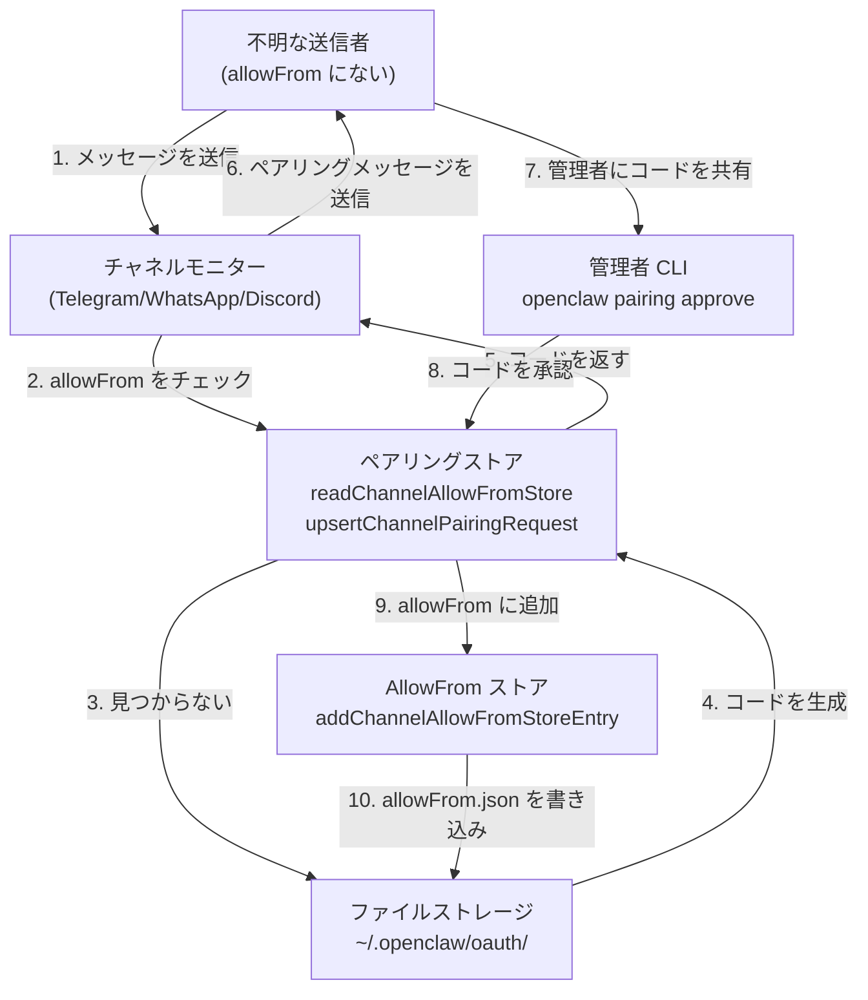

# ページ: ペアリングシステム

# ペアリングシステム

<details>
<summary>関連ソースファイル</summary>

この Wiki ページの作成に使用されたコンテキストとして、以下のファイルが使用されました：

- [.github/actions/detect-docs-changes/action.yml](.github/actions/detect-docs-changes/action.yml)
- [.github/actions/setup-node-env/action.yml](.github/actions/setup-node-env/action.yml)
- [.github/workflows/ci.yml](.github/workflows/ci.yml)
- [.gitignore](.gitignore)
- [docs/automation/poll.md](docs/automation/poll.md)
- [docs/ci.md](docs/ci.md)
- [docs/providers/synthetic.md](docs/providers/synthetic.md)
- [docs/zh-CN/vps.md](docs/zh-CN/vps.md)
- [extensions/msteams/src/store-fs.ts](extensions/msteams/src/store-fs.ts)
- [scripts/test-live-gateway-models-docker.sh](scripts/test-live-gateway-models-docker.sh)
- [scripts/test-live-models-docker.sh](scripts/test-live-models-docker.sh)
- [src/agents/live-auth-keys.test.ts](src/agents/live-auth-keys.test.ts)
- [src/agents/live-auth-keys.ts](src/agents/live-auth-keys.ts)
- [src/agents/pi-embedded-helpers.isbillingerrormessage.test.ts](src/agents/pi-embedded-helpers.isbillingerrormessage.test.ts)
- [src/agents/zai.live.test.ts](src/agents/zai.live.test.ts)
- [src/commands/message.ts](src/commands/message.ts)
- [src/discord/monitor.ts](src/discord/monitor.ts)
- [src/gateway/live-image-probe.ts](src/gateway/live-image-probe.ts)
- [src/imessage/monitor.ts](src/imessage/monitor.ts)
- [src/infra/outbound/abort.ts](src/infra/outbound/abort.ts)
- [src/infra/outbound/message.ts](src/infra/outbound/message.ts)
- [src/infra/outbound/outbound-send-service.ts](src/infra/outbound/outbound-send-service.ts)
- [src/media/png-encode.ts](src/media/png-encode.ts)
- [src/pairing/pairing-store.ts](src/pairing/pairing-store.ts)
- [src/signal/monitor.ts](src/signal/monitor.ts)
- [src/slack/monitor.ts](src/slack/monitor.ts)
- [src/telegram/bot.test.ts](src/telegram/bot.test.ts)
- [src/telegram/bot.ts](src/telegram/bot.ts)
- [src/web/auto-reply.ts](src/web/auto-reply.ts)
- [src/web/inbound.media.test.ts](src/web/inbound.media.test.ts)
- [src/web/inbound.test.ts](src/web/inbound.test.ts)
- [src/web/inbound.ts](src/web/inbound.ts)
- [src/web/test-helpers.ts](src/web/test-helpers.ts)
- [src/web/vcard.ts](src/web/vcard.ts)

</details>


ペアリングシステムは、不明な送信者がメッセージングチャネルを介してエージェントと対話するための安全な承認メカニズムを提供します。チャネルが `dmPolicy: "pairing"` で構成されている場合、不明なダイレクトメッセージ送信者は時間制限付きのペアリングコードを受け取り、CLI で承認されるまでエージェントと通信することはできません。

一般的なチャネルアクセス制御とルーティングについては [チャネルルーティングとアクセス制御](#8.1) を参照してください。ペアリング承認コマンドについては [チャネルコマンド](#12.3) を参照してください。

---

## アーキテクチャ概要

ペアリングシステムは、要求生成と管理者承認の 2 フェーズ承認ワークフローとして動作します：



**ソース：** [src/pairing/pairing-store.ts:1-487](), [src/telegram/bot.ts:562-599]()

---

## ストレージアーキテクチャ

ペアリングシステムは、ファイルベースのロックを使用して OAuth ディレクトリにチャネルごとに 2 種類の JSON ファイルを保持します：


**ソース：** [src/pairing/pairing-store.ts:47-73](), [src/pairing/pairing-store.ts:115-134]()

| ファイルタイプ | 目的 | スキーマ |
|-----------|---------|--------|
| `{channel}-pairing.json` | 保留中のペアリング要求 | `{version: 1, requests: PairingRequest[]}` |
| `{channel}-allowFrom.json` | 承認された送信者 ID | `{version: 1, allowFrom: string[]}` |

### PairingRequest 構造

```typescript
{
  id: string;           // 正規化された送信者 ID
  code: string;         // 8 文字のペアリングコード（A-Z2-9、曖昧な文字なし）
  createdAt: string;    // ISO タイムスタンプ
  lastSeenAt: string;   // ISO タイムスタンプ（再要求時に更新）
  meta?: Record<string, string>; // チャネル固有のメタデータ
}
```

**ソース：** [src/pairing/pairing-store.ts:29-35](), [src/pairing/pairing-store.ts:180-198]()

---

## ペアリング要求ライフサイクル


**ソース：** [src/pairing/pairing-store.ts:343-437](), [src/pairing/pairing-store.ts:155-178]()

### ライフサイクル定数

| 定数 | 値 | 目的 |
|----------|-------|---------|
| `PAIRING_CODE_LENGTH` | 8 | コードの文字数 |
| `PAIRING_CODE_ALPHABET` | `ABCDEFGHJKLMNPQRSTUVWXYZ23456789` | 0/O/1/I の混乱なし |
| `PAIRING_PENDING_TTL_MS` | 3,600,000 (60 分) | 要求の有効期限 |
| `PAIRING_PENDING_MAX` | 3 | チャネルあたりの最大同時要求数 |

**ソース：** [src/pairing/pairing-store.ts:12-15]()

---

## コード生成と一意性

システムはペアリングコードがチャネルのアクティブ要求セット内で一意であることを保証します：


**ソース：** [src/pairing/pairing-store.ts:180-198]()

`randomCode()` 関数は `crypto.randomInt()` を使用してアルファベットから文字を選択し、人間が読みやすいように曖昧なグリフ（0/O, 1/I）を避けます。

**ソース：** [src/pairing/pairing-store.ts:180-188]()

---

## Telegram 統合例

Telegram ボットは `dmPolicy: "pairing"` が構成されている場合、完全なペアリングフローを示します：


**ソース：** [src/telegram/bot.ts:562-599](), [src/telegram/bot.test.ts:562-639]()

### ペアリングメッセージ形式

ボットは以下を含むプレーンテキストメッセージ（マークダウンなし）を送信します：
- 送信者のユーザー ID（管理者参照用）
- ペアリングコード
- 承認するための CLI コマンド

**例：**
```
Your Telegram user id: 999
Pairing code: PAIRME12

To authorize this account, run:
openclaw pairing approve telegram PAIRME12
```

**ソース：** [src/telegram/bot.test.ts:594-599]()

---

## 承認ワークフロー

管理者承認は `approveChannelPairingCode` 関数を使用し、要求を保留中から allowFrom にアトミックに移動します：


**ソース：** [src/pairing/pairing-store.ts:440-487](), [src/pairing/pairing-store.ts:230-263]()

承認プロセスはアトミックです：コードは保留中から削除され、同じファイルロック内で allowFrom に追加され、競合条件を防ぎます。

**ソース：** [src/pairing/pairing-store.ts:451-486]()

---

## AllowFrom リスト管理

allowFrom リストは直接管理とペアリング駆動型更新の両方をサポートします：


**ソース：** [src/pairing/pairing-store.ts:217-228](), [src/pairing/pairing-store.ts:200-215]()

### チャネル固有の正規化

チャネルは `ChannelPairingAdapter` を提供して allowFrom エントリを正規化できます。例えば、電話番号ベースのチャネル（Signal、WhatsApp）は E.164 形式に正規化します：

```typescript
// getPairingAdapter 使用例
const adapter = getPairingAdapter(channel);
const normalized = adapter?.normalizeAllowEntry
  ? adapter.normalizeAllowEntry(trimmed)
  : trimmed;
```

**ソース：** [src/pairing/pairing-store.ts:200-215]()

---

## ファイルロック戦略

すべてのペアリングストア操作は `proper-lockfile` を使用して安全な同時アクセスを保証します：


**ソース：** [src/pairing/pairing-store.ts:115-134]()

### ロック構成

```typescript
const PAIRING_STORE_LOCK_OPTIONS = {
  retries: {
    retries: 10,
    factor: 2,           // 指数バックオフ
    minTimeout: 100,     // 100ms 初期
    maxTimeout: 10_000,  // 10s 最大
    randomize: true,     // ジッター付きリトライ
  },
  stale: 30_000,         // 30s 古いロック自動解放
};
```

**ソース：** [src/pairing/pairing-store.ts:16-25]()

この構成は、ジッター付き指数バックオフで高頻度のペアリング試行（例：複数のユーザーが同時にコードを要求）を処理します。

---

## チャネル統合ポイント

チャネルはメッセージルーティング中にペアリングポリシーをチェックし、必要に応じてペアリングを呼び出します：


**ソース：** [src/telegram/bot.ts:562-599](), [src/config/types.ts]（dmPolicy タイプ）

### DM ポリシー値

| ポリシー | 動作 | ペアリング使用？ |
|--------|----------|---------------|
| `open` | すべての DM を許可 | No |
| `allowlist` | allowFrom にある場合のみ許可 | No |
| `pairing` | 不明な送信者にコードを生成 | Yes |
| `disabled` | すべての DM を拒否 | No |

**ソース：** 構成スキーマドキュメント

---

## プルーニングとメンテナンス

ペアリングストアは読み取り操作中に自動的に期限切れと過剰な要求をプルーニングします：


**ソース：** [src/pairing/pairing-store.ts:155-178](), [src/pairing/pairing-store.ts:172-178]()

プルーニングは読み取り中に機会的に発生し、ストアを境界内に保ち、別のクリーンアッププロセスを不要にします。

---

## 拡張チャネル

拡張チャネル（Matrix、Zalo、MS Teams）は `pairingAdapter` パラメータを渡してグローバルアダプタレジストリをバイパスできます：

```typescript
// upsertChannelPairingRequest シグネチャから
{
  channel: PairingChannel;
  id: string | number;
  meta?: Record<string, string | undefined | null>;
  env?: NodeJS.ProcessEnv;
  pairingAdapter?: ChannelPairingAdapter;  // 拡張用
}
```

**ソース：** [src/pairing/pairing-store.ts:343-350]()

これにより拡張チャネルはコアコードを変更せずに独自の正規化を提供できます。

---

## セキュリティ上の考慮事項

| アスペクト | 実装 |
|--------|----------------|
| コードエントロピー | 8 文字 × log2(32) ≈ 40 ビット |
| 衝突耐性 | 500 試験のユニークチェック |
| 有効期間 | 60 分（ハードリミット） |
| 容量制限 | チャネルあたり 3 つの同時要求 |
| ファイルパーミッション | 0600（所有者読み取り/書き込みのみ） |
| ディレクトリパーミッション | 0700（所有者アクセスのみ） |
| アトミック操作 | リトライ/バックオフ付きファイルロック |

**ソース：** [src/pairing/pairing-store.ts:12-15](), [src/pairing/pairing-store.ts:96-105]()

システムはセキュリティ（推測を防ぐ十分なエントロピー）と使いやすさ（人間が読みやすく、曖昧な文字なし）のバランスを取ります。

---