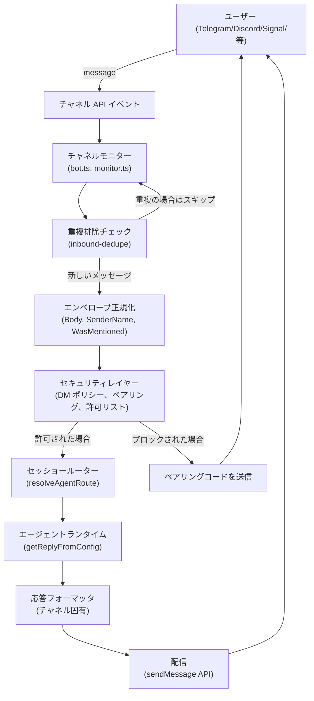
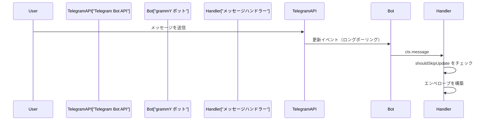
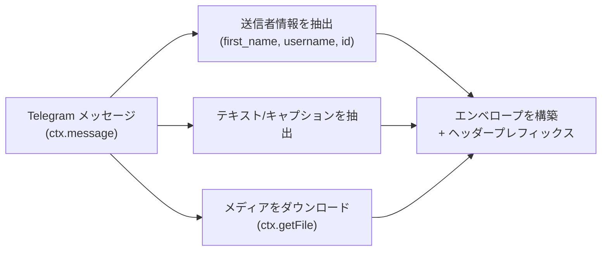
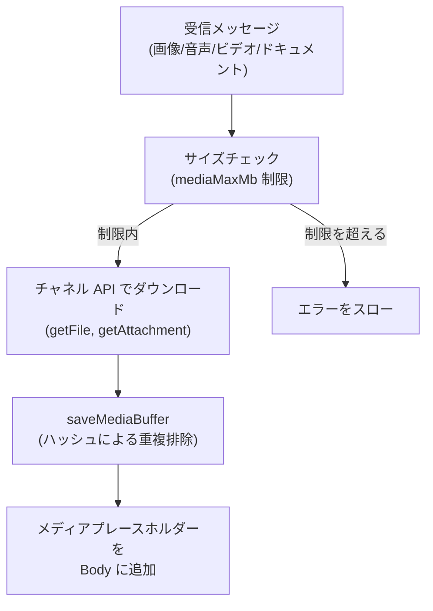
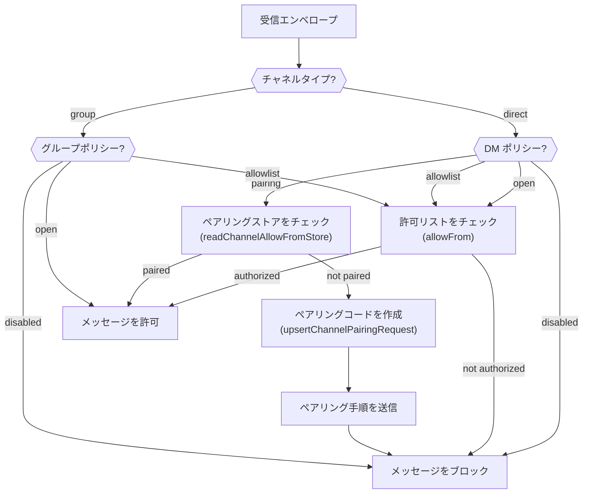
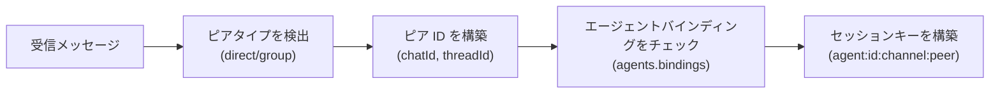
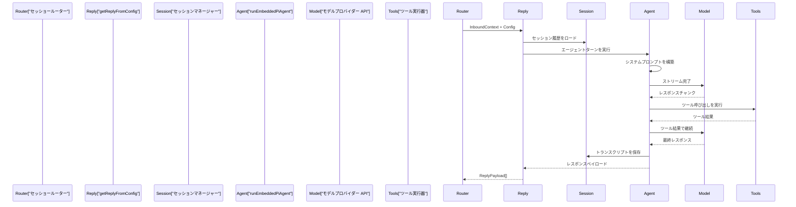
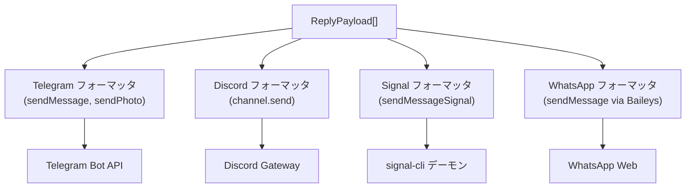
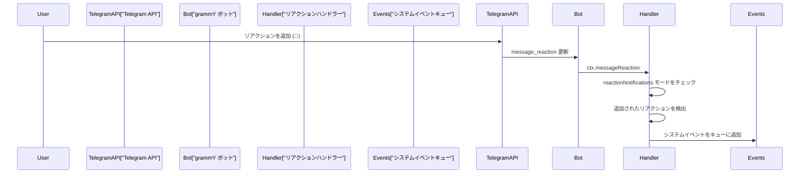

# ページ: チャネルメッセージフロー

# チャネルメッセージフロー

<details>
<summary>関連ソースファイル</summary>

この Wiki ページの作成に使用されたコンテキストとして、以下のファイルが使用されました：

- [README.md](README.md)
- [assets/avatar-placeholder.svg](assets/avatar-placeholder.svg)
- [docs/channels/zalo.md](docs/channels/zalo.md)
- [docs/channels/zalouser.md](docs/channels/zalouser.md)
- [scripts/clawtributors-map.json](scripts/clawtributors-map.json)
- [scripts/update-clawtributors.ts](scripts/update-clawtributors.ts)
- [scripts/update-clawtributors.types.ts](scripts/update-clawtributors.types.ts)
- [src/config/config.ts](src/config/config.ts)
- [src/discord/monitor.ts](src/discord/monitor.ts)
- [src/imessage/monitor.ts](src/imessage/monitor.ts)
- [src/index.test.ts](src/index.test.ts)
- [src/index.ts](src/index.ts)
- [src/signal/monitor.ts](src/signal/monitor.ts)
- [src/slack/monitor.ts](src/slack/monitor.ts)
- [src/telegram/bot.test.ts](src/telegram/bot.test.ts)
- [src/telegram/bot.ts](src/telegram/bot.ts)
- [src/web/auto-reply.ts](src/web/auto-reply.ts)
- [src/web/inbound.media.test.ts](src/web/inbound.media.test.ts)
- [src/web/inbound.test.ts](src/web/inbound.test.ts)
- [src/web/inbound.ts](src/web/inbound.ts)
- [src/web/test-helpers.ts](src/web/test-helpers.ts)
- [src/web/vcard.ts](src/web/vcard.ts)
- [tsconfig.json](tsconfig.json)
- [ui/src/styles.css](ui/src/styles.css)
- [ui/src/styles/layout.mobile.css](ui/src/styles.css)

</details>


このページでは、チャネルイベントからエージェント応答、アウトバウンド配信までの完全なメッセージパイプラインを詳細に説明します。エンベロープ正規化、セキュリティチェック、セッションルーティング、エージェント呼び出し、応答フォーマットをすべてのチャネル実装でカバーします。

チャネル固有のアクセス制御構成については [チャネルルーティングとアクセス制御](#8.1) を参照してください。信頼できない送信者を制限するペアリングワークフローについては [ペアリングシステム](#8.2) を参照してください。個々のチャネル統合の詳細については [8.4](#8.4) から [8.8](#8.8) 節を参照してください。

---

## メッセージフロー概要

メッセージパイプラインは、チャネル固有のイベントを正規化されたエンベロープに変換し、セキュリティポリシーを適用し、適切なエージェントセッションにルーティングし、エージェント応答を処理し、フォーマットされた返信を元のチャネル経由で配信する多段階プロセスです。

### 高レベルパイプライン図



**ソース：** [src/telegram/bot.ts:1-499](), [src/signal/monitor.ts:1-401](), [src/discord/monitor.ts:1-29](), [src/auto-reply/reply/inbound-dedupe.js]()

---

## インバウンドパイプライン

インバウンドパイプラインは、外部チャネル API から到着するメッセージを処理し、エージェント処理の準備をします。

### チャネルリスナー

各チャネル統合は、プラットフォーム API のネイティブイベントをサブスクライブする**チャネルモニター**または**ボットリスナー**を提供します：

| チャネル | リスナー実装 | イベントソース |
|------------|----------------------------------------------|-----------------------------|
| Telegram | `Bot`  grammY を使用、`on("message")` | ロングポーリングまたは Webhook |
| Discord | `Client` discord.js を使用、`on("messageCreate")` | ゲートウェイ WebSocket |
| Signal | `runSignalSseLoop`、SSE ストリーム | signal-cli デーモン HTTP/SSE |
| WhatsApp | `sock.ev.on("messages.upsert")` | Baileys WebSocket |
| Slack | `bolt.App`、Socket モードまたは Webhook | Slack Events API |
| WebChat | `monitorWebInbox`、Gateway WS | 内部 WebSocket |

**Telegram の例：**



**ソース：** [src/telegram/bot.ts:111-149](), [src/signal/monitor.ts:275-401](), [src/web/inbound/monitor.js]()

### 更新重複排除

チャネル更新から安定したキーを構築し、最近の更新キャッシュと照合することでメッセージの重複を排除します：

**Telegram:**
- キー形式: `telegram:<chatId>:<messageId>` または `telegram:<chatId>:topic:<threadId>:<messageId>`
- 重複排除ウィンドウ: 短い TTL（通常は数秒から数分）
- 更新オフセット追跡: `lastUpdateId` で再起動後の再処理を防止

```typescript
// Telegram 重複排除キー構築
const key = buildTelegramUpdateKey(ctx);
const skipped = recentUpdates.check(key);
```

**Signal:**
- キー形式: `signal:<sender>:<timestamp>`
- エンベロープ構築には重複排除用の `envelope.timestamp` が含まれる

**ソース：** [src/telegram/bot/bot-updates.ts](), [src/telegram/bot.ts:154-183](), [src/auto-reply/reply/inbound-dedupe.js]()

### エンベロープ正規化

各チャネルは、ネイティブのメッセージ形式を**標準的なインバウンドエンベロープ**に変換します：

| フィールド | 説明 |
|--------------------|----------------------------------------------------------|
| `Body` | メッセージテキスト、エンベロープヘッダー付き |
| `SenderName` | 送信者の表示名 |
| `SenderId` | 一意の送信者識別子（チャネル固有） |
| `SenderUsername` | ユーザー名（利用可能な場合） |
| `WasMentioned` | ボットがメンション/アドレスされたかを示すブール値 |
| `ChatType` | `"direct"` または `"group"` |
| `MentionedJids` | メンションされたユーザー識別子のリスト |
| `mediaPath` | ダウンロードされたメディアのローカルファイルパス |
| `mediaUrl` | メディアの URL 参照 |
| `replyTo` | 親メッセージへの参照（スレッディング） |

**Telegram エンベロープ構築：**



**エンベロープヘッダー形式：**

```
[Telegram Ada Lovelace (@ada_bot) id:1234 +5m 2025-01-09T00:00:00Z]
<実際のメッセージテキスト>
```

コンポーネント：
- チャネル名: `Telegram`、`Discord`、`Signal` など
- 送信者情報: 名前、ユーザー名、ユーザー ID
- 相対タイムスタンプ: `+5m`、`+2h`、`+3d`（メッセージ送信からの時間）
- 絶対タイムスタンプ: ISO 8601 形式

**ソース：** [src/telegram/bot-message.ts](), [src/signal/monitor/event-handler.ts](), [src/auto-reply/reply/envelope.js](), [src/telegram/bot.ts:518-560]()

### メディア処理

メディア添付ファイルはダウンロード、検証、ローカルに保存されます：

**ダウンロードフロー：**



**サイズ制限（デフォルト）：**
- Telegram: 5 MB (`channels.telegram.mediaMaxMb`)
- Discord: 5 MB (`channels.discord.mediaMaxMb`)
- Signal: 8 MB (`channels.signal.mediaMaxMb`)
- WhatsApp: 5 MB (`channels.whatsapp.mediaMaxMb`)

**メディアプレースホルダー形式：**
- テキスト: `<media:image>`、`<media:audio>`、`<media:video>`、`<media:document>`
- キャプションが存在する場合エンベロープ本文に追加

**ソース：** [src/telegram/bot-message.ts](), [src/signal/monitor.ts:182-227](), [src/media/store.ts](), [src/web/inbound/extract.ts]()

---

## セキュリティチェック

正規化後、メッセージは送信者が承認されているかを決定するセキュリティポリシーを通過します：

### セキュリティレイヤー図



**ソース：** [src/telegram/bot-message.ts](), [src/signal/monitor/event-handler.ts](), [src/discord/monitor/message-handler.ts](), [src/config/group-policy.js]()

### DM ポリシーモード

| モード | 動作 |
|-------------|--------------------------------------------------------------------------|
| `pairing` | 不明な送信者はペアリングコードを受け取り、承認されるまでメッセージはブロックされる |
| `allowlist` | `allowFrom` にある送信者のみが承認される |
| `open` | すべての送信者が承認される（`allowFrom` に `"*"` が必要） |
| `disabled` | すべての DM がブロックされる |

**Telegram ペアリングの例：**

```typescript
// 送信者がペアリングストアにあるかチェック
const allowedSenders = await readChannelAllowFromStore("telegram", accountId);
if (!allowedSenders.includes(senderId)) {
  const { code, created } = await upsertChannelPairingRequest("telegram", senderId);
  if (created) {
    await ctx.reply(`Your Telegram user id: ${senderId}\nPairing code: ${code}\n...`);
  }
  return; // メッセージをブロック
}
```

**ソース：** [src/telegram/bot-message.ts](), [src/pairing/pairing-store.ts](), [src/telegram/bot.ts:562-599]()

### グループアクセス制御

グループは別のポリシー階層に従います：

1. **グループレベルポリシー**: `channels.<channel>.groupPolicy`（または `channels.defaults.groupPolicy`）
2. **グループ固有構成**: `channels.<channel>.groups.<groupId>` で `allow`、`requireMention`
3. **メンション検出**: `requireMention: true` の場合、エンベロープの `WasMentioned` フラグをチェック

**グループメンション検出：**

```typescript
// Telegram メンションチェック
const requireMention = resolveChannelGroupRequireMention({ cfg, channel: "telegram", groupId });
if (requireMention && !wasMentioned) {
  return; // メッセージを無視
}
```

**メンションパターン：**
- ネイティブメンション: `@botUsername`（Telegram、Discord）
- テキストパターン: `messages.groupChat.mentionPatterns` で設定（正規表現）

**ソース：** [src/config/group-policy.js](), [src/telegram/bot.ts:656-703](), [src/auto-reply/reply/mention-detection.js]()

---

## セッショールーティング

セキュリティチェックが通過後、メッセージは適切なエージェントセッションにルーティングされます。

### ルート解決

ゲートウェイは `resolveAgentRoute` を使用して以下を決定します：
- **エージェント ID**: どのエージェントがメッセージを処理すべきか
- **セッションキー**: 会話コンテキストの一意の識別子
- **ワークスペース**: エージェントワークスペースのファイルシステムパス

**ルーティング入力：**
- チャネル名（`telegram`、`discord`、`signal` など）
- アカウント ID（マルチアカウントチャネルの場合）
- ピア情報: `{ kind: "direct" | "group", id: string }`
- 親ピア（スレッドルーティング用）

**セッションキー形式：**
- ダイレクトメッセージ: `agent:main:telegram:123456789`
- グループ: `agent:main:telegram:group:987654321`
- フォーラムスレッド: `agent:main:telegram:group:987654321:topic:42`

### セッションキー構築図



**Telegram セッションキーロジック：**

```typescript
// ダイレクトメッセージ
const sessionKey = `agent:${agentId}:telegram:${chatId}`;

// グループメッセージ
const peerId = buildTelegramGroupPeerId(chatId, messageThreadId);
const sessionKey = `agent:${agentId}:telegram:group:${peerId}`;

// フォーラムスレッド（トピックのあるスーパーグループ）
const threadId = resolveTelegramForumThreadId({ isForum, messageThreadId });
const sessionKey = `agent:${agentId}:telegram:group:${chatId}:topic:${threadId}`;
```

**ソース：** [src/routing/resolve-route.ts](), [src/telegram/bot/helpers.ts](), [src/config/sessions.ts]()

### エージェントバインディング

カスタムルーティングルールは、特定のチャネル/ピアを非デフォルトエージェントにマッピングできます：

```json5
{
  agents: {
    bindings: [
      {
        channel: "telegram",
        accountId: "work",
        peer: { kind: "group", id: "123456789" },
        agentId: "support-bot"
      }
    ]
  }
}
```

**ソース：** [src/config/types.ts](), [src/routing/resolve-route.ts]()

---

## エージェント呼び出し

セッションがルーティングされると、エンベロープは `getReplyFromConfig` を介してエージェントランタイムに渡されます：

### エージェントコールフロー



**主要なエージェントパラメータ：**
- `sessionKey`: セッション履歴と状態を決定
- `Body`: エンベロープヘッダー付きの正規化されたメッセージテキスト
- `SenderName`、`SenderId`、`SenderUsername`: エージェントコンテキスト用の識別情報
- `mediaPath`、`mediaUrl`: エージェント処理用のメディア参照

**ソース：** [src/auto-reply/reply.ts](), [src/agents/run-embedded-agent.ts](), [src/telegram/bot-message.ts]()

### レスポンスストリーミング

チャネルは、エージェント応答が生成されるとチャンクとして送信されるストリーミングレスポンスをサポートする場合があります：

**ストリーミングモード：**
- `"stream"`: 各チャンクをすぐに送信
- `"typing"`: テキスト更新なしで入力中表示を表示
- `"off"`": 完全なレスポンスを待ってから送信

**Telegram ストリーミング：**

```typescript
const streamMode = resolveTelegramStreamMode(telegramCfg);
// "stream" | "typing" | "off"

if (streamMode === "stream") {
  await ctx.sendChatAction(chatId, "typing");
  // メッセージを送信し、各チャンクで編集
}
```

**ソース：** [src/telegram/bot/helpers.ts](), [src/telegram/bot-message.ts](), [src/auto-reply/streaming.js]()

---

## アウトバウンドパイプライン

エージェント処理後、応答はフォーマットされて元のチャネル経由で配信されます。

### レスポンスフォーマット

エージェント応答は内部の `ReplyPayload` 形式からチャネル固有の API 呼び出しに変換されます：

**ReplyPayload 構造：**

```typescript
type ReplyPayload = {
  text?: string;
  mediaUrl?: string;
  mediaUrls?: string[];
  attachmentPath?: string;
  inlineButtons?: Array<{label: string; action: string}>;
};
```

### チャネル固有のフォーマッタ



**ソース：** [src/telegram/send.ts](), [src/discord/send.ts](), [src/signal/send.ts](), [src/web/send.ts]()

### テキストチャンキング

長い応答はチャネルの制限に基づいて複数のメッセージに分割されます：

| チャネル | チャンク制限 | モード |
|-----------|-------------|--------------|
| Telegram | 4096 文字 | `length` |
| Discord | 2000 文字 | `newline` |
| Signal | ~2000 文字 | `newline` |
| WhatsApp | 4096 文字 | `newline` |

**チャンキングモード：**
- `length`: 文字数制限でのハード分割
- `newline`: 可能な場合は改行で分割、フォールバックは length

**Telegram チャンキングの例：**

```typescript
const textLimit = resolveTextChunkLimit(cfg, "telegram", accountId);
const chunkMode = resolveChunkMode(cfg, "telegram", accountId);

for (const chunk of chunkTextWithMode(text, textLimit, chunkMode)) {
  await bot.api.sendMessage(chatId, chunk);
}
```

**ソース：** [src/auto-reply/chunk.ts](), [src/telegram/bot-message.ts](), [src/signal/monitor.ts:229-273]()

### メディア配信

メディア添付ファイルはチャネル固有の API を使用して送信されます：

**Telegram:**
- 画像: `bot.api.sendPhoto(chatId, new InputFile(path), { caption })`
- ドキュメント: `bot.api.sendDocument(...)`
- アニメーション: `bot.api.sendAnimation(...)`

**Signal:**
- すべてのメディア: `sendMessageSignal(target, caption, { mediaUrl: path })`

**Discord:**
- 添付ファイル: `channel.send({ files: [new AttachmentBuilder(path)] })`

**WhatsApp:**
- 画像: `sock.sendMessage(jid, { image: buffer, caption })`

**ソース：** [src/telegram/send.ts](), [src/signal/send.ts](), [src/discord/send.ts](), [src/web/send.ts]()

### 返信スレッディング

スレッドをサポートするチャネルは、元のメッセージに返信することで会話コンテキストを維持します：

**Telegram:**
- `reply_parameters: { message_id: originalMessageId }`
- フォーラムスレッド: チャットコンテキストの `message_thread_id` で自動

**Discord:**
- スレッド: `message.thread.send(...)`
- 返信: `message.reply(...)`

**Signal:**
- 引用: Signal API ペイロードに引用メッセージ参照を含める

**ソース：** [src/telegram/send.ts](), [src/discord/monitor/threading.ts](), [src/signal/send.ts]()

---

## リアクション処理

一部のチャネルはメッセージイベントとは別にリアクションイベントを発行します。

### Telegram リアクションフロー



**リアクションモード：**
- `"off"`: すべてのリアクションを無視
- `"own"`": ボット自身のメッセージへのリアクションのみ通知
- `"allowlist"`: 許可された送信者のリアクションのみ通知
- `"all"`: すべてのリアクションを通知

**システムイベント形式：**

```
Telegram reaction added: 👀 by Ada Lovelace (@ada) on msg 123
```

**ソース：** [src/telegram/bot.ts:386-475](), [src/infra/system-events.ts](), [src/signal/monitor/event-handler.ts]()

---

## エラー処理

各ステージのエラーはログに記録され、オプションでリトライされます：

**一般的なエラーシナリオ：**

| ステージ | エラー型 | 処理 |
|----------------------|---------------------------------|---------------------------------------------|
| チャネル API | ネットワークタイムアウト | 指数バックオフでリトライ |
| メディアダウンロード | サイズ制限超過 | エラーメッセージをユーザーに送信 |
| セキュリティチェック | ペアリングが必要 | ペアリングコードを送信、メッセージをブロック |
| エージェント実行 | モデル API 失敗 | モデルフェイルオーバーをトリガー、リトライ |
| レスポンス配信 | レート制限 | grammY/throttler でスロットル |

**Telegram エラーロギング：**

```typescript
bot.catch((err) => {
  runtime.error?.(danger(`telegram bot error: ${formatUncaughtError(err)}`));
});
```

**ソース：** [src/telegram/bot.ts:149-152](), [src/infra/errors.ts](), [src/telegram/api-logging.ts]()

---

## チャネル固有の詳細

各チャネルはプラットフォーム固有のバリエーションを持つ同じパイプラインを実装します：

### Telegram

- **リスナー**: チャット/スレッドごとの逐次処理を持つ grammY `Bot`
- **重複排除**: `buildTelegramUpdateKey` + オフセット追跡
- **エンベロープ**: `[Telegram Name (@user) id:123 +5m タイムスタンプ]`
- **セキュリティ**: ペアリング + allowFrom + グループポリシー
- **ストリーミング**: 編集可能なメッセージストリーミング
- **リアクション**: `message_reaction` イベントハンドラー
- **インラインボタン**: コールバッククエリルーティング

**ソース：** [src/telegram/bot.ts:1-499](), [src/telegram/bot-message.ts](), [src/telegram/bot-handlers.ts]()

### Discord

- **リスナー**: discord.js `Client` on `messageCreate`
- **エンベロープ**: `[Discord ServerName#channel sender]`
- **セキュリティ**: ギルド/チャネル許可リスト、ロールチェック
- **スレッド**: スレッド作成/検出
- **リアクション**: `messageReactionAdd` イベント
- **コマンド**: スラッシュコマンド登録

**ソース：** [src/discord/monitor/provider.ts](), [src/discord/monitor/message-handler.ts](), [src/discord/monitor/allow-list.ts]()

### Signal

- **リスナー**: signal-cli デーモンからの SSE ストリーム
- **エンベロープ**: `[Signal +15551234567 タイムスタンプ]`
- **セキュリティ**: E.164 電話番号マッチング
- **添付ファイル**: base64 デコード付き RPC `getAttachment`
- **既読リクエスト**: デーモンフラグオプション経由

**ソース：** [src/signal/monitor.ts:1-401](), [src/signal/monitor/event-handler.ts](), [src/signal/sse-reconnect.ts]()

### WhatsApp (Web)

- **リスナー**: Baileys `messages.upsert` イベント
- **エンベロープ**: `[WhatsApp Name (+15551234567) タイムスタンプ]`
- **セキュリティ**: JID 許可リスト、グループ許可リスト
- **メディア**: Baileys からの `downloadMediaMessage`
- **連絡先**: 連絡先カード用 vCard 解析

**ソース：** [src/web/inbound/monitor.ts](), [src/web/inbound/extract.ts](), [src/web/vcard.ts]()

### Slack

- **リスナー**: Socket モードまたは Webhook を使用した Bolt アプリ
- **エンベロープ**: `[Slack #channel-name Name]`
- **スレッド**: `thread_ts` 追跡
- **コマンド**: スラッシュコマンドハンドラー

**ソース：** [src/slack/monitor/provider.ts](), [src/slack/monitor/policy.ts]()

---

## まとめ

チャネルメッセージフローはすべての統合で一貫したパイプラインに従います：

1. **インバウンド**: チャネルリスナー → 重複排除 → エンベロープ正規化 → メディアダウンロード
2. **セキュリティ**: DM ポリシーチェック → ペアリング/許可リスト → グループポリシー → メンション検出
3. **ルーティング**: エージェント ID を解決 → セッションキーを構築 → セッション履歴をロード
4. **エージェント**: エージェントターンを実行 → ストリーム/累積レスポンス → トランスクリプトを保存
5. **アウトバウンド**: レスポンスをフォーマット → テキストをチャンキング → メディアを送信 → チャネル API で配信

このアーキテクチャは以下を可能にします：
- **統一されたエージェントインターフェース**: すべてのチャネルが同じエンベロープ契約を提示
- **プラガブルなセキュリティ**: ポリシーがチャネル間で一貫して適用
- **決定論的ルーティング**: メッセージは常に元のチャネル経由で返信
- **優雅な劣化**: チャネル固有の機能（リアクション、スレッド）はオプション

**ソース：** [src/telegram/bot.ts:1-499](), [src/signal/monitor.ts:1-401](), [src/discord/monitor/provider.ts](), [src/web/inbound/monitor.ts](), [src/auto-reply/reply.ts]()

---