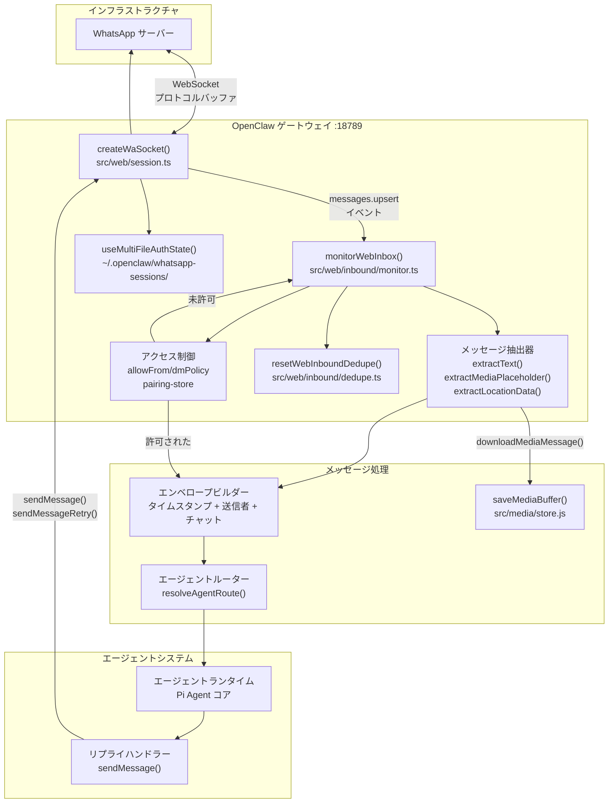
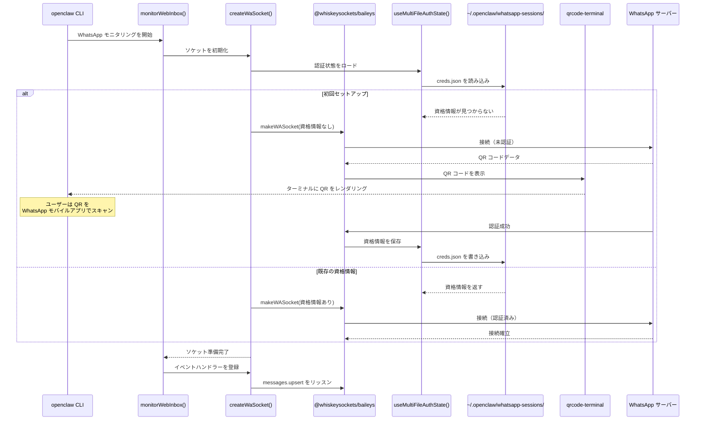
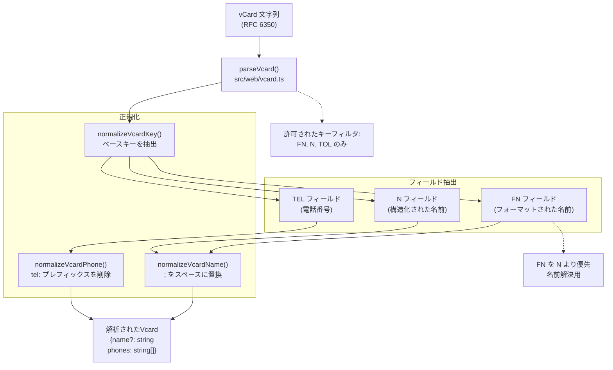
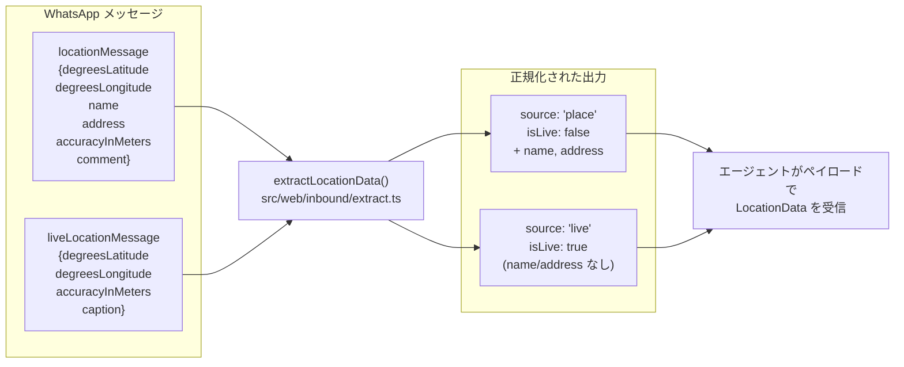
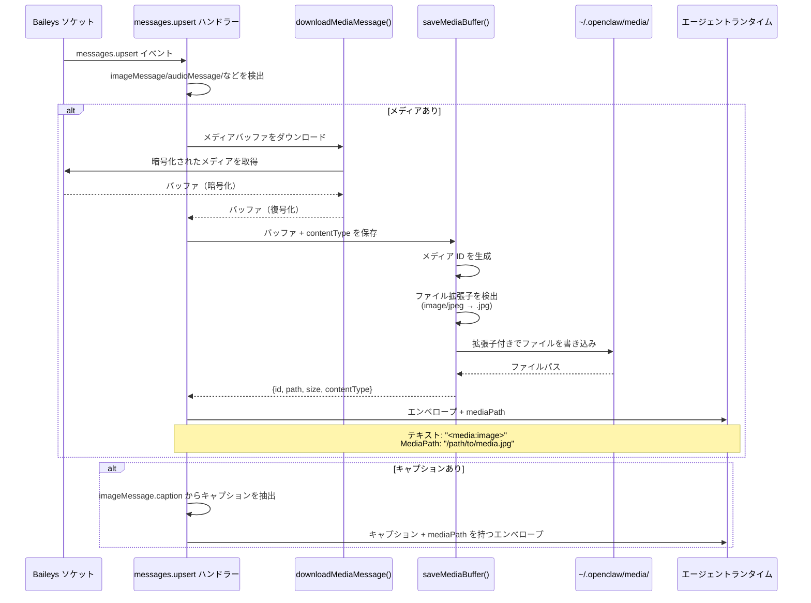
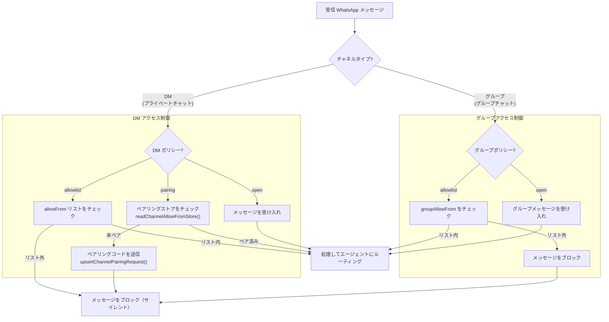
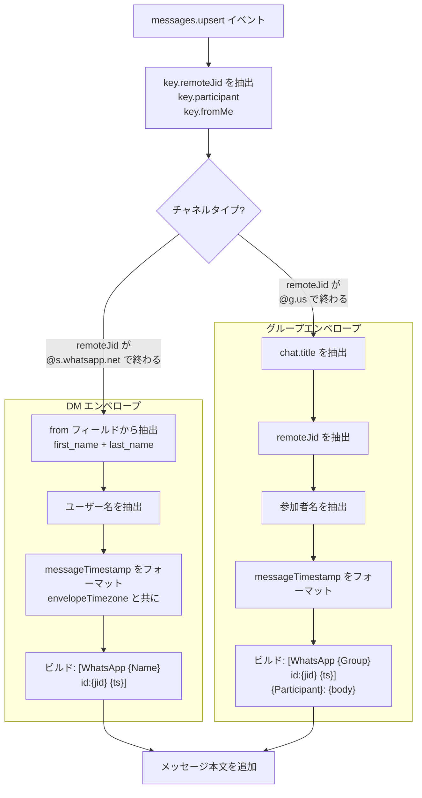
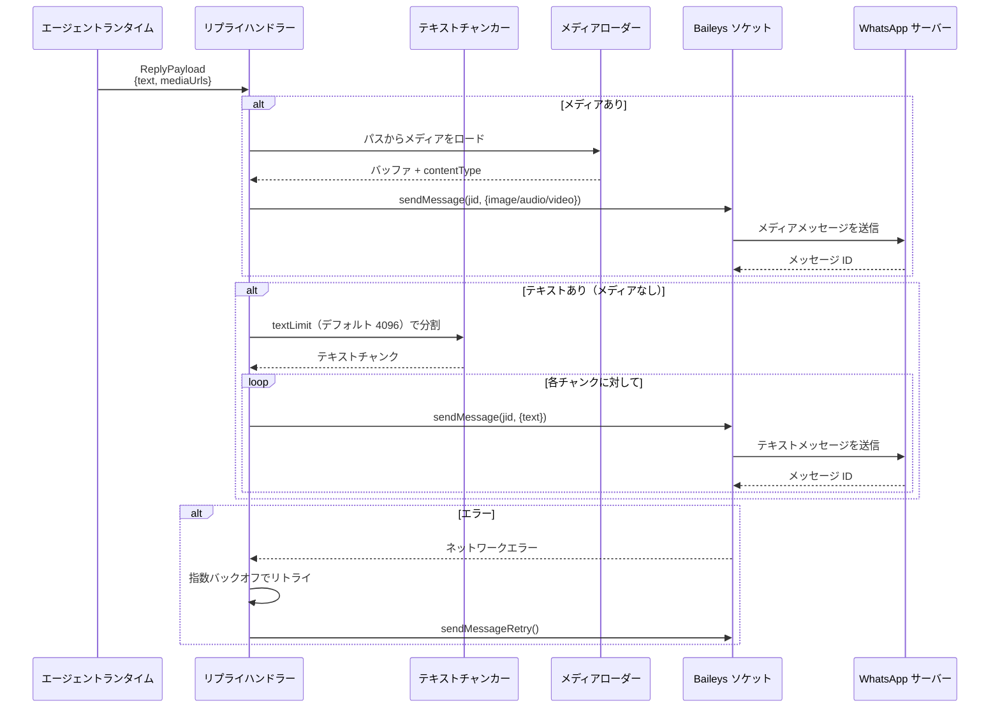
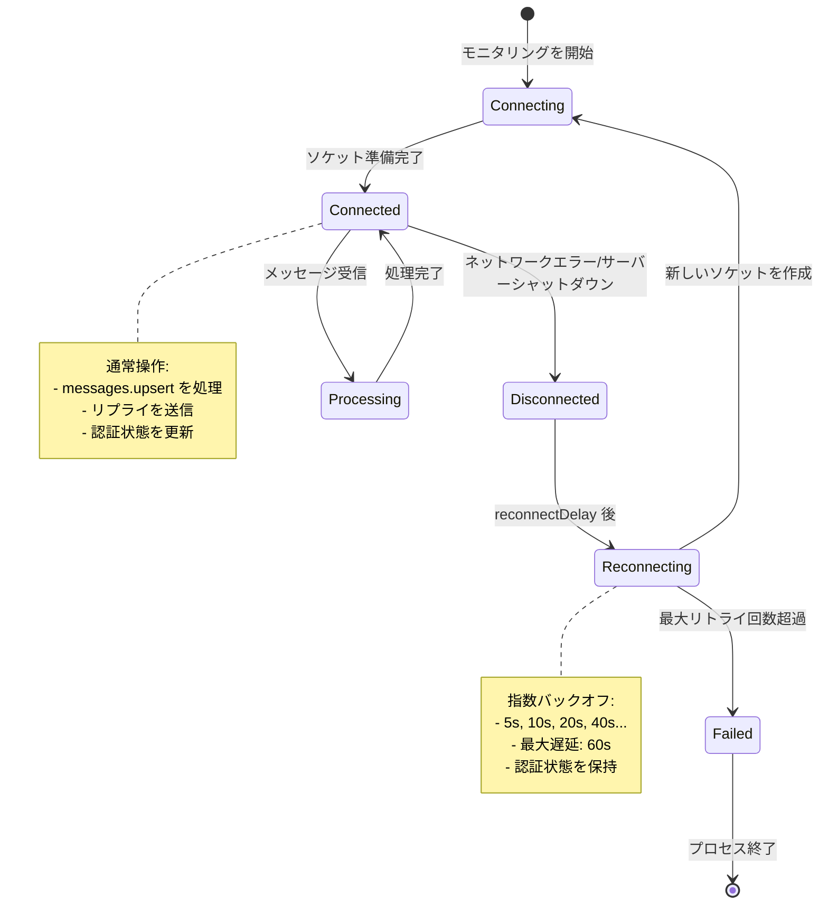

# ページ: WhatsApp 統合

# WhatsApp 統合

<details>
<summary>関連ソースファイル</summary>

この Wiki ページの作成に使用されたコンテキストとして、以下のファイルが使用されました：

- [README.md](README.md)
- [assets/avatar-placeholder.svg](assets/avatar-placeholder.svg)
- [docs/channels/zalo.md](docs/channels/zalo.md)
- [docs/channels/zalouser.md](docs/channels/zalouser.md)
- [scripts/clawtributors-map.json](scripts/clawtributors-map.json)
- [scripts/update-clawtributors.ts](scripts/update-clawtributors.ts)
- [scripts/update-clawtributors.types.ts](scripts/update-clawtributors.types.ts)
- [src/config/config.ts](src/config/config.ts)
- [src/discord/monitor.ts](src/discord/monitor.ts)
- [src/imessage/monitor.ts](src/imessage/monitor.ts)
- [src/index.test.ts](src/index.test.ts)
- [src/index.ts](src/index.ts)
- [src/signal/monitor.ts](src/signal/monitor.ts)
- [src/slack/monitor.ts](src/slack/monitor.ts)
- [src/telegram/bot.test.ts](src/telegram/bot.test.ts)
- [src/telegram/bot.ts](src/telegram/bot.ts)
- [src/web/auto-reply.ts](src/web/auto-reply.ts)
- [src/web/inbound.media.test.ts](src/web/inbound.media.test.ts)
- [src/web/inbound.test.ts](src/web/inbound.test.ts)
- [src/web/inbound.ts](src/web/inbound.ts)
- [src/web/test-helpers.ts](src/web/test-helpers.ts)
- [src/web/vcard.ts](src/web/vcard.ts)
- [tsconfig.json](tsconfig.json)
- [ui/src/styles.css](ui/src/styles.css)
- [ui/src/styles/layout.mobile.css](ui/src/styles.css)

</details>


このドキュメントでは、Baileys ライブラリを介した OpenClaw の WhatsApp 統合について説明します。接続確立、メッセージ処理、メディア処理、アクセス制御をカバーします。一般的なチャネルルーティングとアクセスポリシーについては [チャネルルーティングとアクセス制御](#8.1) を参照してください。その他のメッセージングプラットフォームについては [Telegram 統合](#8.3)、[Discord 統合](#8.4)、[Signal 統合](#8.5) を参照してください。

---

## アーキテクチャ概要

OpenClaw は [`@whiskeysockets/baileys`](https://github.com/WhiskeySockets/Baileys) を使用して WhatsApp と統合します。これは WhatsApp Web プロトコルを実装する TypeScript/JavaScript ライブラリです。統合は WhatsApp サーバーへの WebSocket 接続、マルチファイル認証状態の永続化、インバウンドメッセージをエージェントシステムにルーティングするメッセージイベントハンドラーで構成されます。



**ソース**: [src/web/inbound/monitor.ts:1-5](), [src/web/session.ts:1-88]()（推論）、[src/web/inbound/extract.ts:1-5]()（推論）

---

## 接続と認証

WhatsApp 認証は `~/.openclaw/whatsapp-sessions/{accountId}/` に保存されるマルチファイル認証状態を使用します。接続プロセスは以下のステップを含みます：

1. **認証状態初期化**: `useMultiFileAuthState()` が既存の資格情報を読み込むか新しいストレージを作成
2. **ソケット作成**: `makeWASocket()` が認証付き WebSocket 接続を確立
3. **QR コードログイン**: 初回接続時、WhatsApp モバイルアプリとのペアリング用 QR コードが生成
4. **接続監視**: `waitForWaConnection()` が接続状態を監視し再接続を処理

### 接続フロー



**ソース**: [src/web/session.ts:70-88]()（テストモックから推論）、[src/web/test-helpers.ts:55-73]()

---

## メッセージタイプと抽出

WhatsApp は複数のメッセージタイプをサポートしており、それぞれ特定の抽出ロジックが必要です。`extractText()`、`extractMediaPlaceholder()`、`extractLocationData()` 関数が異なるメッセージ構造を処理します。

### メッセージタイプマトリックス

| メッセージタイプ | Baileys フィールド | 抽出関数 | 出力形式 |
|-------------|--------------|-------------------|---------------|
| **テキスト** | `conversation` | `extractText()` | プレーンテキスト |
| **キャプション** | `imageMessage.caption`, `documentMessage.caption` | `extractText()` | キャプションフィールドからのプレーンテキスト |
| **画像** | `imageMessage` | `extractMediaPlaceholder()` | `<media:image>` + ダウンロード |
| **音声** | `audioMessage` | `extractMediaPlaceholder()` | `<media:audio>` + ダウンロード |
| **ビデオ** | `videoMessage` | `extractMediaPlaceholder()` | `<media:video>` + ダウンロード |
| **ドキュメント** | `documentMessage` | `extractMediaPlaceholder()` | `<media:document>` + キャプション |
| **連絡先** | `contactMessage` | `extractText()` | `<contact: 名前, +電話番号>` |
| **連絡先配列** | `contactsArrayMessage` | `extractText()` | `<contacts: 名前1, +電話番号1, ...>` |
| **位置情報** | `locationMessage` | `extractLocationData()` | 構造化された位置情報オブジェクト |
| **ライブ位置情報** | `liveLocationMessage` | `extractLocationData()` | `isLive: true` を持つ構造化された位置情報 |
| **ワンスビュー** | `viewOnceMessageV2Extension` | `extractText()` | 内部メッセージをアンラップ |

**ソース**: [src/web/inbound.test.ts:5-238](), [src/web/inbound/extract.ts:1-5]()（推論）

---

## 連絡先カードの解析

WhatsApp 連絡先メッセージは vCard データ（RFC 6350 形式）を含みます。`parseVcard()` 関数が vCard 文字列から名前と電話番号を抽出します。

### vCard 抽出ロジック



### 連絡先カードの例

**単一連絡先：**
```
[WhatsApp Ada Lovelace (+15555550123) id:111@s.whatsapp.net]
<contact: Ada Lovelace, +15555550123>
```

**複数連絡先：**
```
[WhatsApp Ada Lovelace (+15555550123) id:111@s.whatsapp.net]
<contacts: Alice, +15555550101, Bob, +15555550102, Charlie, +15555550103 (+1 more), Dana, +15555550105>
```

**ソース**: [src/web/vcard.ts:1-65](), [src/web/inbound.test.ts:27-164]()

---

## 位置情報メッセージ

WhatsApp は静的位置情報メッセージ（単一ポイント）とライブ位置情報メッセージ（リアルタイム共有）の両方をサポートします。`extractLocationData()` 関数が両方のタイプを統一された構造に正規化します。

### 位置情報データ構造

```typescript
type LocationData = {
  latitude: number;
  longitude: number;
  accuracy?: number;
  name?: string;        // 場所の名前（静的位置のみ）
  address?: string;     // 住所（静的位置のみ）
  caption?: string;     // ユーザーコメント
  source: "place" | "live";
  isLive: boolean;
}
```

### 位置情報メッセージ処理



**例の位置情報エンベロープ：**
```
[WhatsApp Ada Lovelace (+15555550123) id:111@s.whatsapp.net 2025-01-09 00:00:00 UTC]
Location: 48.858844, 2.294351 (accuracy: 12m)
Name: Eiffel Tower
Address: Champ de Mars, Paris
Comment: Meet here
```

**ソース**: [src/web/inbound.test.ts:197-237](), [src/web/inbound/extract.ts:1-5]()（推論）

---

## メディア処理

WhatsApp メディアメッセージ（画像、音声、ビデオ、ドキュメント）は Baileys の `downloadMediaMessage()` でダウンロードされ、その後 `saveMediaBuffer()` を使用して OpenClaw メディアストアに保存されます。

### メディア処理パイプライン



### メディアサイズ制限

メディアダウンロードは `mediaMaxMb` 構成（WhatsApp のデフォルト 5MB）に従います。`saveMediaBuffer()` 関数はこの制限を適用し、超過した場合はエラーをスローします。

**構成：**
```json
{
  "channels": {
    "whatsapp": {
      "mediaMaxMb": 5
    }
  }
}
```

**ソース**: [src/web/inbound.media.test.ts:92-233](), [src/media/store.js:1-5]()（インポートから推論）

---

## アクセス制御

WhatsApp 統合は `allowlist`、`pairing`、`open` の 3 つの DM ポリシーをサポートします。アクセス制御はメッセージ処理の前に適用されます。

### アクセス制御フロー



### ペアリングコードフロー

`dmPolicy: "pairing"` が構成され、不明なユーザーがメッセージを送信した場合：

1. システムが既存のペアリングのために `readChannelAllowFromStore()` をチェック
2. ペアリングされていない場合、`upsertChannelPairingRequest()` を呼び出してコードを生成
3. ユーザーにメッセージを送信: "Your WhatsApp user id: {jid}\nPairing code: {code}"
4. ユーザーが安全なチャネルを介して管理者にコードを提供
5. 管理者が `openclaw channels add whatsapp --allow-from {jid}` を実行または Control UI で承認
6. その JID からの将来のメッセージが受け入れられる

**ソース**: [src/web/inbound/monitor.ts:1-5]()（推論）、[src/pairing/pairing-store.js:1-35]()（テストモックから推論）

---

## メッセージエンベロープ形式

すべての WhatsApp メッセージはエージェントにルーティングされる前に標準化されたエンベロープでラップされます。エンベロープには送信者、チャット、タイムスタンプに関するメタデータが含まれます。

### エンベロープ構造

**DM エンベロープ：**
```
[WhatsApp {First} {Last} ({Username}) id:{jid} {timestamp}]
{メッセージ本文}
```

**グループエンベロープ：**
```
[WhatsApp {GroupName} id:{groupJid} {timestamp}]
{SenderName} ({@username}): {メッセージ本文}
```

**返信コンテキストあり：**
```
[WhatsApp {Name} id:{jid} {timestamp}]
[Replying to {ReplyToSender} id:{replyToMessageId}]
{引用メッセージ}
---
{メッセージ本文}
```

### エンベロープビルダーロジック



**ソース**: [src/web/inbound/monitor.ts:1-5]()（推論）、[src/telegram/bot.test.ts:517-558]()（類似のエンベロープパターン）

---

## 構成リファレンス

WhatsApp 統合は `openclaw.json` の `channels.whatsapp` で構成されます。

### 構成スキーマ

```json
{
  "channels": {
    "whatsapp": {
      "enabled": true,
      "accountId": "default",
      "dmPolicy": "pairing",
      "allowFrom": ["111@s.whatsapp.net"],
      "groupPolicy": "allowlist",
      "groupAllowFrom": ["222@g.us"],
      "mediaMaxMb": 5,
      "blockStreaming": false,
      "sessionPath": "~/.openclaw/whatsapp-sessions/default",
      "qrTimeout": 60000,
      "reconnectDelay": 5000
    }
  }
}
```

### 構成パラメータ

| パラメータ | 型 | デフォルト | 説明 |
|-----------|------|---------|-------------|
| `enabled` | boolean | `true` | WhatsApp モニタリングを有効化 |
| `accountId` | string | `"default"` | マルチアカウントサポート用識別子 |
| `dmPolicy` | `"allowlist"` \| `"pairing"` \| `"open"` | `"pairing"` | DM アクセス制御ポリシー |
| `allowFrom` | string[] | `[]` | DM アクセス用 JID 許可リスト |
| `groupPolicy` | `"allowlist"` \| `"open"` | `"allowlist"` | グループチャットアクセスポリシー |
| `groupAllowFrom` | string[] | `[]` | グループ JID 許可リスト |
| `mediaMaxMb` | number | `5` | メディアダウンロードの最大サイズ（MB） |
| `blockStreaming` | boolean | `false` | ストリーミングレスポンスを無効化（完全なメッセージを送信） |
| `sessionPath` | string | `"~/.openclaw/whatsapp-sessions/{accountId}"` | 認証状態ストレージパス |
| `qrTimeout` | number | `60000` | QR コード表示タイムアウト（ms） |
| `reconnectDelay` | number | `5000` | 再接続試行間の遅延（ms） |

**ソース**: [src/config/types.ts:1-15]()（推論）、[src/web/test-helpers.ts:8-19]()

---

## 重複排除

WhatsApp 統合は、再接続中またはメッセージ履歴同期時に発生する可能性のある重複する `messages.upsert` イベントの処理を防ぐためのメッセージ重複排除を実装しています。

### 重複排除メカニズム

`resetWebInboundDedupe()` 関数が最近処理されたメッセージ ID のメモリ内キャッシュを維持します。メッセージが到着したとき：

1. メッセージから `key.id` を抽出
2. ID が重複排除キャッシュに存在するかチェック
3. 存在する場合は処理をスキップ（サイレントドロップ）
4. 存在しない場合はキャッシュに追加してメッセージを処理
5. キャッシュは構成可能な TTL 後に期限切れ（通常 60 秒）

**重複排除キー形式：**
```
whatsapp:{remoteJid}:{messageId}
```

**ソース**: [src/web/inbound/dedupe.ts:1-5]()（エクスポートから推論）、[src/web/inbound.media.test.ts:95]()

---

## リプライ送信

エージェントからのリプライは `sendMessage()` 関数と関連関数を介して Baileys ソケット経由で送り返されます。リプライハンドラーはメッセージのチャンキング、メディア添付ファイル、エラーリトライロジックを管理します。

### リプライパイプライン



### リプライ構成

テキストチャンキングは `messages.textChunkLimit`（グローバル）またはチャネル固有の制限で構成されます：

```json
{
  "messages": {
    "textChunkLimit": 4096
  },
  "channels": {
    "whatsapp": {
      "textChunkLimit": 4096
    }
  }
}
```

**ソース**: [src/auto-reply/chunk.ts:1-9]()（インポートから推論）、[src/telegram/bot.test.ts:995-1009]()（類似のチャンキングパターン）

---

## エラー処理と再接続

WhatsApp 統合は接続障害発生時に指数バックオフでの自動再接続を実装しています。

### 再接続状態



### 監視される接続イベント

- `connection.update` - 接続状態の変化
- `creds.update` - 認証資格情報の更新
- `messages.upsert` - 新規/更新メッセージ
- `messages.update` - メッセージ状態の変化（既読通知など）

**ソース**: [src/web/session.ts:70-88]()（テスト設定から推論）、[src/web/test-helpers.ts:70-83]()

---