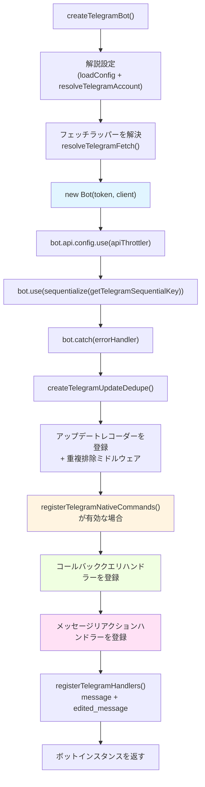
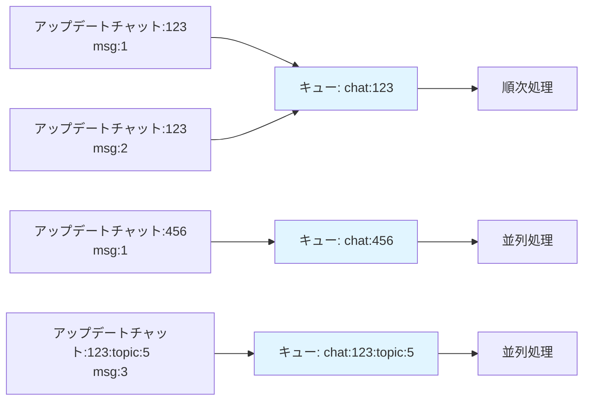
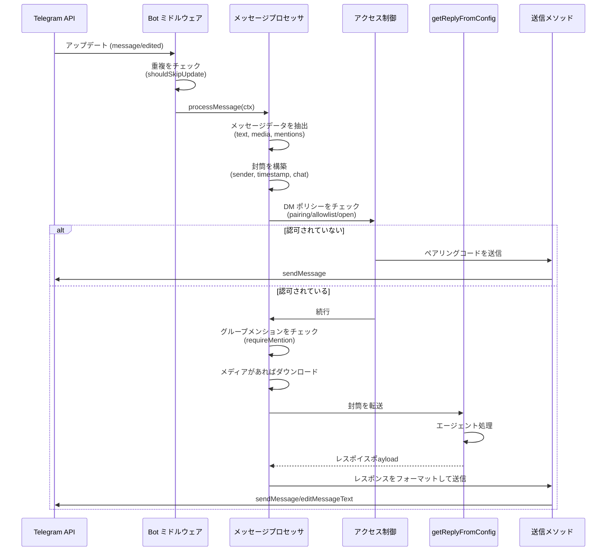
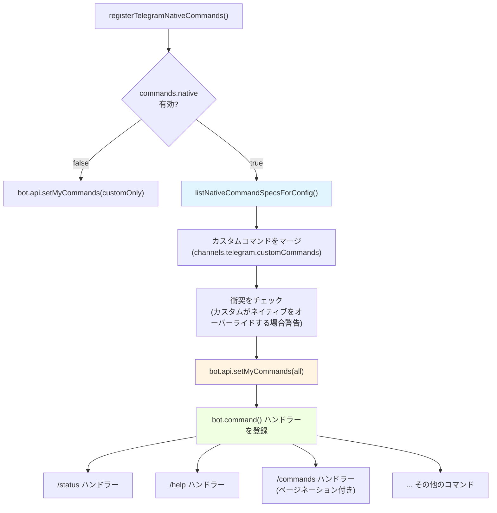
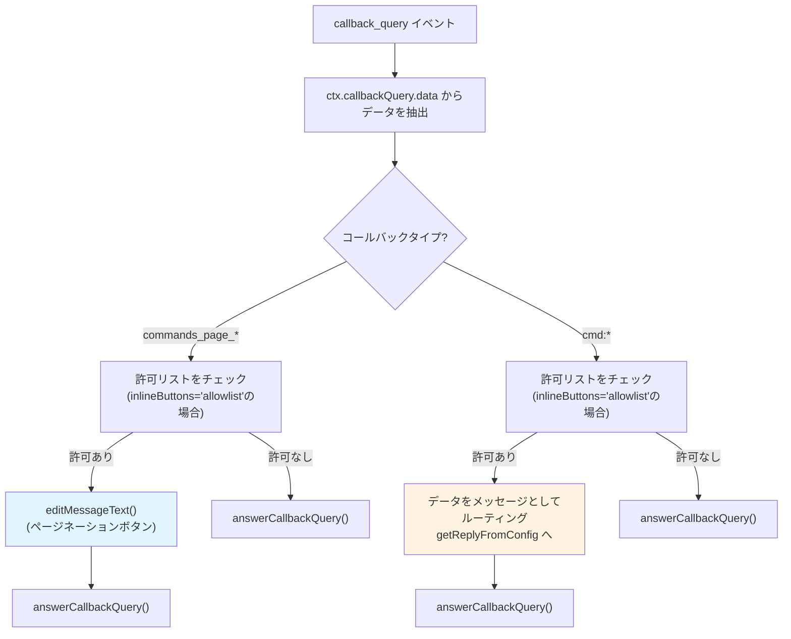
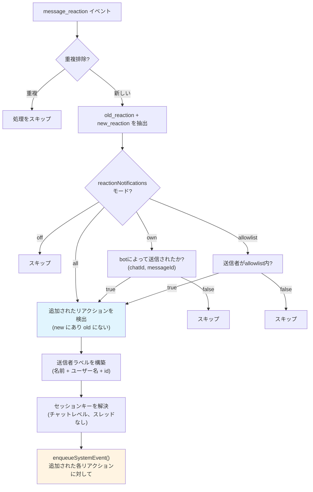
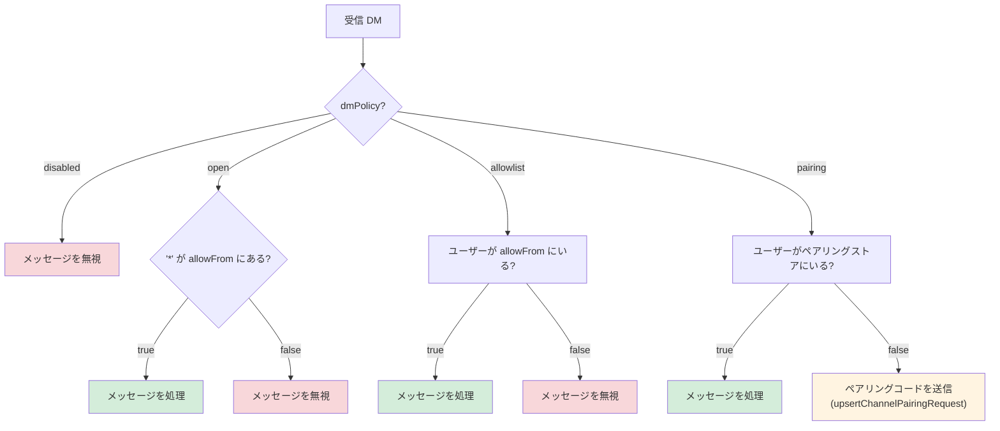

# ページ: Telegram 統合

# Telegram 統合

<details>
<summary>関連ソースファイル</summary>

この Wiki ページの作成に使用されたファイル:

- [README.md](README.md)
- [assets/avatar-placeholder.svg](assets/avatar-placeholder.svg)
- [docs/channels/zalo.md](docs/channels/zalo.md)
- [docs/channels/zalouser.md](docs/channels/zalouser.md)
- [scripts/clawtributors-map.json](scripts/clawtributors-map.json)
- [scripts/update-clawtributors.ts](scripts/update-clawtributors.ts)
- [scripts/update-clawtributors.types.ts](scripts/update-clawtributors.types.ts)
- [src/config/config.ts](src/config/config.ts)
- [src/discord/monitor.ts](src/discord/monitor.ts)
- [src/imessage/monitor.ts](src/imessage/monitor.ts)
- [src/index.test.ts](src/index.test.ts)
- [src/index.ts](src/index.ts)
- [src/signal/monitor.ts](src/signal/monitor.ts)
- [src/slack/monitor.ts](src/slack/monitor.ts)
- [src/telegram/bot.test.ts](src/telegram/bot.test.ts)
- [src/telegram/bot.ts](src/telegram/bot.ts)
- [src/web/auto-reply.ts](src/web/auto-reply.ts)
- [src/web/inbound.media.test.ts](src/web/inbound.media.test.ts)
- [src/web/inbound.test.ts](src/web/inbound.test.ts)
- [src/web/test-helpers.ts](src/web/test-helpers.ts)
- [src/web/vcard.ts](src/web/vcard.ts)
- [tsconfig.json](tsconfig.json)
- [ui/src/styles.css](ui/src/styles.css)
- [ui/src/styles/layout.mobile.css](ui/src/styles.layout.mobile.css)

</details>


このページでは、OpenClaw の Telegram 統合について説明します。これは grammY ライブラリを使用したフル機能のボットインターフェースを提供し、ダイレクトメッセージ、グループチャット、フォーラムトピック、ネイティブコマンド、インラインボタン、リアクション、そしてポーリングと Webhook の両モードをサポートしています。

一般的なチャネルの概念（ペアリング、ルーティング、アクセス制御）については、[チャネルルーティングとアクセス制御](#8.1) を参照してください。ペアリングワークフローについては、[ペアリングシステム](#8.2) を参照してください。メッセージフローの詳細については、[チャネルメッセージフロー](#8.3) を参照してください。

## アーキテクチャ概要

Telegram 統合は、メッセージを標準的なチャネル封筒形式に変換する grammY を基盤として構築されています。

**主要コンポーネント:**
- **ボットインスタンス**: grammY `Bot` クラスが Telegram Bot API をラップ
- **メッセージプロセッサ**: Telegram のアップデートを OpenClaw の封筒形式に変換
- **ネイティブコマンド**: BotCommand 登録を伴う Telegram `/command` ハンドラー
- **コールバックハンドラー**: インラインボタンとページネーションハンドラー
- **リアクションモニター**: 構成可能な通知モードで絵文字リアクションを追跡
- **アップデート重複排除**: 再接続中の重複処理を防止

ソース: [src/telegram/bot.ts:1-499]()

## ボット初期化フロー



**ボットコンストラクタパラメータ:**
- `token`: BotFather からの Bot API トークン
- `client`: カスタムフェッチとタイムアウトを含むオプションの API クライアント設定

**ミドルウェアチェーン:**
1. **API スロットラー**: Telegram の制限に基づくアウトバウンド API 呼び出しのレート制限
2. **Sequentialize**: 同じチャットからのアップデートが順次処理されることを保証
3. **エラーハンドラー**: ボットクラッシュを防止するためのすべてのエラーをキャッチ
4. **アップデートロガー**: 詳細モードでの生のアップデートのログ
5. **アップデートレコーダー**: オフセット管理用に `update_id` を追跡

ソース: [src/telegram/bot.ts:112-224]()

## 順次アップデート処理



**順次キー解決** ([src/telegram/bot.ts:67-110]()):
- **制御コマンド**: `telegram:<chatId>:control` (優先度高)
- **プライベートチャット**: `telegram:<chatId>`
- **グループ**: `telegram:<chatId>` (デフォルトではトピック分離なし)
- **フォーラムトピック**: `telegram:<chatId>:topic:<threadId>`
- **リアクション**: `telegram:<chatId>`

`getTelegramSequentialKey` 関数は、同じチャットからのメッセージが順序通りに処理されることを保証し、セッション状態における競合状態を防ぎます。

ソース: [src/telegram/bot.ts:67-110]()

## メッセージ処理パイプライン



**メッセージプロセッサ** ([src/telegram/bot.ts:342-363]()):
- 送信者ID (ユーザー名、ファースト/ラストネーム、ユーザーID) を解決
- テキスト、キャプション、メディア添付ファイルを抽出
- メンション (`@botUsername` またはパターンベース) を検出
- `mediaMaxBytes` 制限内でメディアをダウンロード
- チャットタイプ (DM vs グループ vs トピック) に基づくセッションへのルーティング

**封筒形式** ([src/telegram/bot.test.ts:518-560]() でテスト済み):
```
[Telegram <ChatName> (@<username>) id:<chatId> (<相対時間>) <タイムスタンプ>]
<SenderName> (@<senderUsername>): <メッセージテキスト>
```

ソース: [src/telegram/bot.ts:342-492](), [src/telegram/bot.test.ts:518-560]()

## ネイティブコマンドシステム



**ネイティブコマンド登録** ([src/telegram/bot-native-commands.ts]() は [src/telegram/bot.ts:365-383]() で参照):
1. `listNativeCommandSpecsForConfig` からネイティブコマンドスペックをロード
2. `channels.telegram.customCommands` からカスタムコマンドをロード
3. カスタムコマンドを正規化 (小文字先頭 `/` を削除)
4. 衝突を検出 (ネイティブコマンドが優先、カスタムは警告付きで無視)
5. `bot.api.setMyCommands()` 経由で登録
6. `bot.command(name, handler)` 経由でハンドラーを登録

**カスタムコマンド** ([src/telegram/bot.test.ts:217-246]() でテスト済み):
```json5
{
  channels: {
    telegram: {
      customCommands: [
        { command: "custom_backup", description: "Git バックアップ" },
        { command: "/Custom_Generate", description: "画像を作成" }
      ]
    }
  }
}
```

コマンドは小文字に正規化され、先頭の `/` が削除されます。ネイティブコマンドが優先されます。

ソース: [src/telegram/bot.ts:365-383](), [src/telegram/bot.test.ts:217-316]()

## インラインボタンとコールバークエリ



**コールバークエリ処理** ([src/telegram/bot.ts]() は [src/telegram/bot.test.ts:364-516]() でテスト済み):

1. **ページネーションコールバック**: パターン `commands_page_<N>[:<sessionKey>]`
   - 指定されたページの `/commands` リストを再レンダリング
   - `editMessageText` でメッセージインラインボタンを更新
   - 常に `answerCallbackQuery` を呼び出してローディング状態を解除

2. **コマンドコールバック**: パターン `cmd:<payload>`
   - ペイロードを新しいメッセージとしてエージェントにルーティング
   - 送信者は通常のメッセージと同じアクセス制御を通過する必要あり
   - 完全なレスポンスパイプラインをトリガー

3. **アクセス制御**: `channels.telegram.capabilities.inlineButtons`
   - `"open"` (デフォルト): 誰でもボタンをクリック可能
   - `"allowlist"`: `allowFrom` のユーザーのみが相互作用可能

**テストケース**: [src/telegram/bot.test.ts:364-435]() がコールバックルーティングとアクセス制御を示しています。

ソース: [src/telegram/bot.test.ts:364-516]()

## リアクション通知



**リアクションモード** ([src/telegram/bot.ts:386-475]()):

| モード | 動作 |
|------|----------|
| `"off"` | リアクション通知なし |
| `"own"` | ボットが送信したメッセージへのリアクションのみ (送信メッセージキャッシュで追跡) |
| `"all"` | 許可されたチャット内のすべてのリアクション |
| `"allowlist"` | `channels.telegram.allowFrom` のユーザーからのリアクション |

**リアクションイベント形式**:
```
Telegram reaction added: <emoji> by <senderLabel> on msg <messageId>
```

コンテキストキー `telegram:reaction:add:<chatId>:<messageId>:<userId>:<emoji>` でシステムイベントとしてエンキューされます。

**注意**: Telegram の `MessageReactionUpdated` には `message_thread_id` が含まれないため、リアクションは常にチャットレベルのセッションにルーティングされます (フォーラムトピック分離はリアクションには利用不可)。

ソース: [src/telegram/bot.ts:386-475]()

## アクセス制御

**DM ポリシーデシジョンツリー**:



**グループアクセス** ([src/telegram/bot.ts:289-340]()):
- `channels.telegram.groups`: グループ許可リスト (キーは数値チャットID)
- `channels.telegram.groups["*"]`: すべてのグループ用ワイルドカード
- 各グループの `requireMention`: メンション要件のオーバーライド
- 各トピックの設定: `channels.telegram.groups[<id>].topics[<threadId>]`

**メンション検出**:
1. 明示的: メッセージテキスト内の `@botUsername`
2. パターン: `messages.groupChat.mentionPatterns` (正規表現、大文字小文字不問)
3. ボットへの返信: ボットメッセージへの返信 (TODO: 実装を検証)

ソース: [src/telegram/bot.ts:226-340]()

## 設定リファレンス

**コア設定**:

| 設定 | タイプ | デフォルト | 説明 |
|---------|------|---------|-------------|
| `channels.telegram.enabled` | boolean | `true` | チャネルの有効/無効化 |
| `channels.telegram.botToken` | string | `TELEGRAM_BOT_TOKEN` | Bot API トークン (環境変数が優先) |
| `channels.telegram.dmPolicy` | string | `"pairing"` | DM アクセス: `pairing\|allowlist\|open\|disabled` |
| `channels.telegram.allowFrom` | array | `[]` | DM 許可リスト (数値ユーザーIDまたはユーザー名) |
| `channels.telegram.groupAllowFrom` | array | `allowFrom` | グループ許可リスト (`allowFrom` にフォールバック) |
| `channels.telegram.groupPolicy` | string | `"open"` | グルーポリシー: `open\|allowlist\|disabled` |
| `channels.telegram.mediaMaxMb` | number | `5` | メディア最大サイズ (MB) |
| `channels.telegram.replyToMode` | string | `"first"` | 返信先: `first\|all\|none` |

**高度な設定**:

| 設定 | タイプ | デフォルト | 説明 |
|---------|------|---------|-------------|
| `channels.telegram.webhookUrl` | string | `undefined` | Webhook URL (ポーリングと排他的) |
| `channels.telegram.webhookSecret` | string | `undefined` | Webhook シークレットトークン |
| `channels.telegram.historyLimit` | number | `20` | グループ履歴サイズ |
| `channels.telegram.timeoutSeconds` | number | `undefined` | API リクエストタイムアウト |
| `channels.telegram.blockStreaming` | boolean | `false` | ストリーミングモードを無効化 |
| `channels.telegram.reactionNotifications` | string | `"own"` | リアクションモード: `off\|own\|all\|allowlist` |
| `channels.telegram.network.ipv4` | boolean | `true` | IPv4 を有効化 |
| `channels.telegram.network.ipv6` | boolean | `false` | IPv6 を有効化 |

**ネイティブコマンド**:

| 設定 | タイプ | デフォルト | 説明 |
|---------|------|---------|-------------|
| `commands.native` | boolean/string | `true` | ネイティブコマンドをグローバルに有効化 |
| `channels.telegram.commands.native` | boolean/string | inherit | チャネルごとにオーバーライド |
| `channels.telegram.commands.nativeSkills` | boolean | `true` | スキルコマンドを含む |
| `channels.telegram.customCommands` | array | `[]` | カスタムコマンド定義 |

カスタムコマンド形式:
```json5
{
  command: "backup",         // 小文字、先頭の / なし
  description: "Run backup"  // Telegram コマンドリストに表示
}
```

ソース: [src/telegram/bot.ts:112-147](), [src/telegram/bot.ts:226-263](), [src/telegram/bot.test.ts:217-316]()

## マルチアカウント設定

Telegram は `channels.telegram.accounts` で複数のボットアカウントをサポート:

```json5
{
  channels: {
    telegram: {
      enabled: true,
      defaultAccount: "main",
      accounts: {
        main: {
          botToken: "123456:ABC-DEF",
          dmPolicy: "pairing"
        },
        support: {
          botToken: "789012:GHI-JKL",
          dmPolicy: "allowlist",
          allowFrom: ["@supportteam"]
        }
      }
    }
  }
}
```

各アカウント:
- 独立したボットインスタンスを実行
- 自身の許可リストとポリシーを持つ
- ユニークなセッション名前空間にルーティング: `agent:<agentId>:telegram:<accountId>:<peerId>`

ソース: [src/telegram/accounts.ts] (は [src/telegram/bot.ts:120-125]() で参照)

## Webhook vs ポーリング

**ポーリングモード** (デフォルト):
- `bot.api.getUpdates()` とロングポーリングを使用
- パブリック URL 不要
- `update_id` オフセットをメモリ内で追跡 (`updateOffset.onUpdateId` で永続化可)
- 開発とシングルインスタンスデプロイに適した

**Webhook モード**:
- が `channels.telegram.webhookUrl` にアップデートを POST
- Gateway HTTP サーバーが `webhookPath` (デフォルトは URL パス) でリクエストを処理
- 有効な証明書付き HTTPS 必須
- 検証のため `channels.telegram.webhookSecret` を設定する必要あり
- ロードバランサー付きのプロダクションに適した

**Webhook 設定**:
```typescript
const { path, handler } = createTelegramWebhookCallback(bot, "/telegram-webhook");
app.post(path, handler);
```

Telegram が `X-Telegram-Bot-Api-Secret-Token` ヘッダーを送信し、Gateway が `webhookSecret` と一致することを検証します。

ソース: [src/telegram/bot.ts:496-498](), [README.md:342-354]()

## 配信先 (CLI/Cron)

CLI でメッセージを送信:
```bash
# 数値チャット ID
openclaw message send --channel telegram --target 123456789 --message "こんにちは"

# ユーザー名 (ディレクトリ経由で ID に解決)
openclaw message send --channel telegram --target @username --message "こんにちは"

# トピック付きグループ
openclaw message send --channel telegram --target 123456789:topic:5 --message "こんにちは"
```

ターゲット形式:
- `<chatId>`: プライベートチャットまたはグループ
- `<chatId>:topic:<threadId>`: フォーラムトピック
- `@<username>`: ディレクトリ経由で解決

ソース: [README.md:69-74](), [src/telegram/bot.ts:42-48]()

## ネットワーク設定

**IPv4/IPv6 選択** ([src/telegram/fetch.ts]() は [src/telegram/bot.ts:127-129]() で参照):
- `channels.telegram.network.ipv4`: IPv4 を有効化 (デフォルト `true`)
- `channels.telegram.network.ipv6`: IPv6 を有効化 (デフォルト `false`)

フェッチラッパー (`resolveTelegramFetch`) は、デュアルスタック環境の問題向けにネットワークファミリ選択をサポートします。

**プロキシサポート**:
カスタムフェッチ実装は `createTelegramBot({ proxyFetch })` 経由で SOCKS/HTTP プロキシに渡すことができます。

ソース: [src/telegram/bot.ts:127-144](), [src/telegram/fetch.ts]()

## エラーハンドリングとログ

**エラーバウンダリー**:
1. ボットレベル: `bot.catch(err => ...)` がすべてのミドルウェアエラーをキャッチ
2. ハンドラーレベル: 個別のハンドラーが try-catch でラップ
3. API エラー: `withTelegramApiErrorLogging` で構造化ログにラップ

**詳細ログ** ([src/telegram/bot.ts:186-224]()):
- 生のアップデート JSON (8000文字にトリム)
- アップデート重複排除の決定
- ペアリングコードの送信
- リアクションイベントの詳細

`--verbose` フラグまたは `agents.defaults.verboseLevel` で有効化。

**一般的なエラー**:
- `401 Unauthorized`: 無効なボットトークン
- `409 Conflict`: Webhook とポーリングの両方がアクティブ
- `429 Too Many Requests`: レート制限 (apiThrottler が自動的に処理)

ソース: [src/telegram/bot.ts:149-224](), [src/telegram/api-logging.ts]()

---