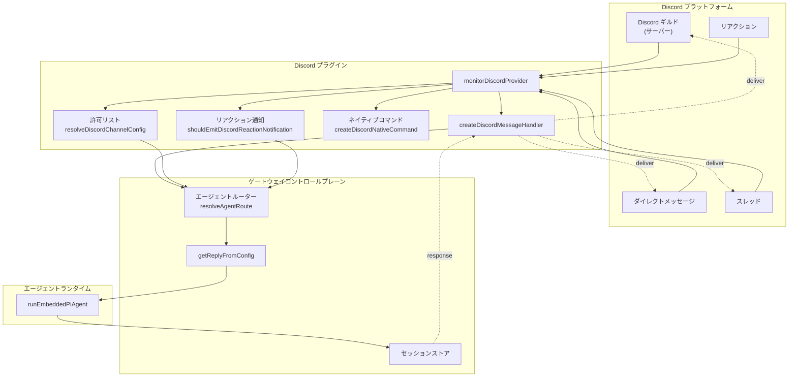
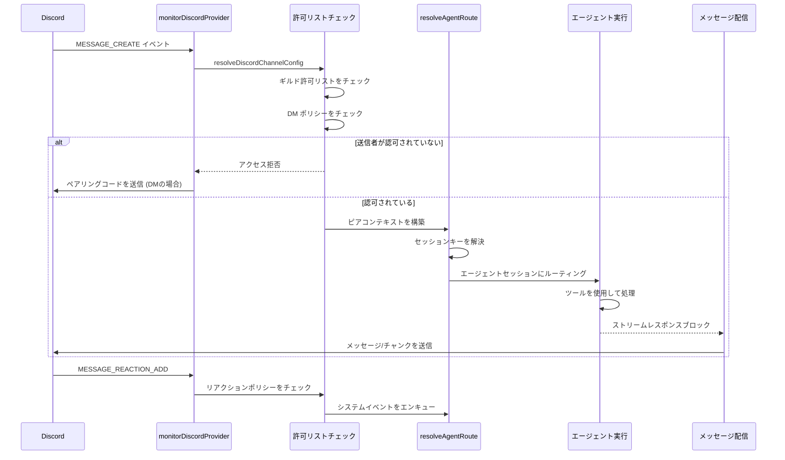
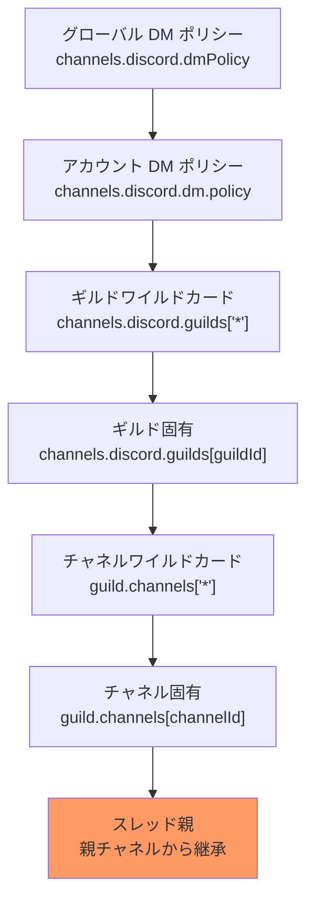

# ページ: Discord 統合

# Discord 統合

<details>
<summary>関連ソースファイル</summary>

この Wiki ページの作成に使用されたファイル:

- [README.md](README.md)
- [assets/avatar-placeholder.svg](assets/avatar-placeholder.svg)
- [docs/channels/zalo.md](docs/channels/zalo.md)
- [docs/channels/zalouser.md](docs/channels/zalouser.md)
- [scripts/clawtributors-map.json](scripts/clawtributors-map.json)
- [scripts/update-clawtributors.ts](scripts/update-clawtributors.ts)
- [scripts/update-clawtributors.types.ts](scripts/update-clawtributors.types.ts)
- [src/config/config.ts](src/config/config.ts)
- [src/discord/monitor.ts](src/discord/monitor.ts)
- [src/imessage/monitor.ts](src/imessage/monitor.ts)
- [src/index.test.ts](src/index.test.ts)
- [src/index.ts](src/index.ts)
- [src/signal/monitor.ts](src/signal/monitor.ts)
- [src/slack/monitor.ts](src/slack/monitor.ts)
- [src/telegram/bot.test.ts](src/telegram/bot.test.ts)
- [src/telegram/bot.ts](src/telegram/bot.ts)
- [src/web/auto-reply.ts](src/web/auto-reply.ts)
- [src/web/inbound.media.test.ts](src/web/inbound.media.test.ts)
- [src/web/inbound.test.ts](src/web/inbound.test.ts)
- [src/web/test-helpers.ts](src/web/test-helpers.ts)
- [src/web/vcard.ts](src/web/vcard.ts)
- [tsconfig.json](tsconfig.json)
- [ui/src/styles.css](ui/src/styles.css)
- [ui/src/styles/layout.mobile.css](ui/src/styles/layout.mobile.css)

</details>


**目的**: このドキュメントでは OpenClaw の Discord チャネル統合について説明します。ボット設定、メッセージ処理、アクセス制御ポリシー、ネイティブコマンド、ギルド/チャネル設定、スレッド管理、およびリアクション通知をカバーします。

**範囲**: このページは Discord 特定の実装に焦点を当てます。一般的なチャネルの概念とルーティングについては [チャネルルーティングとアクセス制御](#8.1) を参照してください。チャネル間で共有されるメッセージ処理パターンについては [マルチチャネルメッセージ処理](#1.3) を参照してください。

---

## 概要

Discord 統合により、OpenClaw エージェントは Discord ギルド（サーバー）、チャネル、ダイレクトメッセージ、およびスレッドを介して通信できます。この統合は以下を実行するプラグインとして実装されています:

- Discord メッセージ、リアクション、相互作用を監視
- ギルド/チャネル/スレッドコンテキストに基づいてメッセージを適切なエージェントセッションにルーティング
- DM ペアリングポリシーとギルドレベルの許可リストを適用
- ネイティブスラッシュコマンドを登録し、カスタムコマンドを処理
- 親チャネルバインディングの継承によるスレッドベースの会話を管理
- テキストチャンキング、メディア添付、オプショナルブロックストリーミングを使用してエージェントレスポンスを配信

Discord プラグインは `discord.js` ライブラリ（経由 `@buape/carbon` と `discord-api-types`）を使用して Discord API とインターフェースし、ゲートウェイイベントを処理します。

**ソース**: [src/discord/monitor.ts:1-29](), [CHANGELOG.md:322](), [CHANGELOG.md:156-159]()

---

## アーキテクチャ



**主要コンポーネント**:

- **monitorDiscordProvider**: Discord ボットを開始しイベントリスナーを登録するメインエントリーポイント ([src/discord/monitor.ts:26]())
- **createDiscordMessageHandler**: 受信 Discord メッセージを処理、許可リストをチェック、コンテキストを構築し、エージェントレスポンスをトリガー ([src/discord/monitor.ts:22]())
- **resolveDiscordChannelConfig**: ギルド、チャネル、DM のアクセス許可とポリシーを決定 ([src/discord/monitor.ts:11-17]())
- **createDiscordNativeCommand**: エージェント制御用の Discord スラッシュコマンドを登録 ([src/discord/monitor.ts:24]())

**ソース**: [src/discord/monitor.ts:1-29](), [CHANGELOG.md:156-159](), [CHANGELOG.md:322]()

---

## メッセージフロー



**フロー手順**:

1. **イベント受信**: Discord ボットが `MESSAGE_CREATE`、`MESSAGE_UPDATE`、または `MESSAGE_REACTION_ADD` イベントを受信
2. **アクセス制御**: `resolveDiscordChannelConfig` がギルド許可リスト、チャネル許可リスト、DM ポリシーをチェック
3. **ルーティング**: `resolveAgentRoute` がギルド/チャネル/スレッドコンテキストに基づいてターゲットエージェントとセッションキーを決定
4. **エージェント実行**: メッセージが完全なコンテキスト（送信者、スレッド、メンション、メディア）でエージェントランタイムに渡される
5. **レスポンス配信**: エージェントレスポンスが Discord 制限に基づいてチャンキングされ、元のコンテキストに送り返される

**ソース**: [src/discord/monitor.ts:19-24](), [CHANGELOG.md:156-159]()

---

## 設定

Discord 統合は `openclaw.json` の `channels.discord` セクションで設定されます:

| フィールド | タイプ | 説明 |
|-------|------|-------------|
| `token` | `string` | Discord ボットトークン (または `DISCORD_BOT_TOKEN` 環境変数) |
| `dmPolicy` | `"pairing" \| "open" \| "allowlist"` | DM アクセス制御モード (デフォルト: `"pairing"`) |
| `dm.allowFrom` | `string[]` | ボットに DM を許可するユーザーIDのリスト |
| `dm.policy` | `"pairing" \| "open" \| "allowlist"` | アカウントごとの DM ポリシーオーバーライド |
| `guilds` | `Record<string, GuildConfig>` | ギルド固有の設定 (ギルドIDまたは `"*"` のデフォルトでキー設定) |
| `intents` | `{ presences?: boolean, members?: boolean }` | 特権ゲートウェイインテント |
| `mediaMaxMb` | `number` | メディアファイルサイズの最大 MB (デフォルト: 8) |
| `reactionNotifications` | `"off" \| "own" \| "all"` | リアクション通知モード |
| `commands.native` | `boolean` | ネイティブスラッシュコマンドを有効化 |
| `commands.nativeSkills` | `boolean` | スキルコマンドを自動登録 |

**ギルド設定** (`GuildConfig`):

| フィールド | タイプ | 説明 |
|-------|------|-------------|
| `allowFrom` | `string[]` | このギルドで許可されるユーザーID |
| `channels` | `Record<string, ChannelConfig>` | チャネル固有のポリシー |
| `groupPolicy` | `"open" \| "allowlist"` | ギルドレベルのアクセスモード |
| `requireMention` | `boolean` | ボットがメンションされてレスポンスが必要かどうか |

**設定例**:

```json5
{
  channels: {
    discord: {
      token: "YOUR_BOT_TOKEN",
      dmPolicy: "pairing",
      guilds: {
        "123456789012345678": {
          allowFrom: ["user1", "user2"],
          requireMention: true,
          channels: {
            "987654321098765432": {
              allowFrom: ["*"],
              requireMention: false
            }
          }
        }
      },
      intents: {
        presences: false,
        members: false
      },
      reactionNotifications: "own"
    }
  }
}
```

**ソース**: [README.md:359-373](), [CHANGELOG.md:322]()

---

## アクセス制御階層



**アクセス制御関数**:

- **resolveDiscordChannelConfig**: 階層をたどってギルド/チャネルの有効な設定を解決 ([src/discord/monitor.ts:11]())
- **isDiscordGroupAllowedByPolicy**: ポリシーと許可リストに基づいてギルドが許可されているかチェック ([src/discord/monitor.ts:8]())
- **resolveDiscordCommandAuthorized**: ユーザーがコマンドを実行できるか決定 ([src/discord/monitor.ts:13]())
- **resolveDiscordShouldRequireMention**: チャネルでボットがメンションされている必要があるかチェック ([src/discord/monitor.ts:15]())

**スレッド継承**: スレッドは親チャネルからアクセス設定を継承します。これは [CHANGELOG.md:156()] でフォーラムトピックバインディング継承に適切に `parentPeer` を渡すために修正されました。

**ソース**: [src/discord/monitor.ts:1-18](), [CHANGELOG.md:42](), [CHANGELOG.md:156]()

---

## コマンド

### ネイティブコマンド

`commands.native` が有効な場合、ネイティブコマンドとして Discord スラッシュコマンドが登録されます:

- `/status` - セッションステータスを表示 (モデル、トークン、コスト)
- `/new` または `/reset` - 会話セッションをリセット
- `/compact` - セッション履歴をコンパクト化
- `/think <level>` - 思考レベルを設定 (off|minimal|low|medium|high|xhigh)
- `/verbose on|off` - 詳細モードを切り替え
- `/usage off|tokens|full` - 使用量表示を設定
- `/activation mention|always` - グループアクティベーションモードを切り替え (オーナーのみ)
- `/restart` - ゲートウェイを再起動 (オーナーのみ)

ネイティブコマンドは `createDiscordNativeCommand` で作成され、Discord API に登録されます ([src/discord/monitor.ts:24]())。

**ソース**: [src/discord/monitor.ts:24](), [README.md:266-276]()

### カスタムコマンド

カスタムコマンドは `channels.discord.customCommands` で追加できます:

```json5
{
  channels: {
    discord: {
      customCommands: [
        { command: "deploy", description: "本番環境にデプロイ" },
        { command: "logs", description: "最近のログを表示" }
      ]
    }
  }
}
```

カスタムコマンドは登録中にネイティブコマンドとマージされます。ネイティブコマンド名と衝突するコマンドはエラーで拒否されます ([CHANGELOG.md:253-256]())。

**コマンド認証**: `commands.useAccessGroups` を使用してコマンドを認可ユーザーに制限します。`resolveDiscordCommandAuthorized` 関数がユーザーが権限を持っているかチェックします ([src/discord/monitor.ts:13]())。

**ソース**: [src/discord/monitor.ts:13](), [CHANGELOG.md:253-256]()

---

## ギルドとチャネル

### ギルド設定

ギルド（Discord サーバー）は `channels.discord.guilds` で設定されます。各ギルドには以下を持つことができます:

- **allowFrom**: ボットと対話を許可されるユーザーIDのリスト
- **groupPolicy**: `"open"` (誰でも対話可能) または `"allowlist"` (allowFrom ユーザーのみ)
- **requireMention**: ボットが @メンションされてレスポンスが必要かどうか
- **channels**: チャネルごとのオーバーライド

デフォルト設定のために `"*"` をワイルドカードキーとして使用:

```json5
{
  guilds: {
    "*": {
      requireMention: true,
      groupPolicy: "allowlist"
    }
  }
}
```

**ソース**: [CHANGELOG.md:359-362]()

### チャネル設定

ギルド内のチャネルはギルド設定をオーバーライドできます:

```json5
{
  guilds: {
    "123456789": {
      requireMention: true,
      channels: {
        "987654321": {
          requireMention: false,
          allowFrom: ["*"]
        }
      }
    }
  }
}
```

**チャネル許可リストマッチング**: `allowListMatches` 関数がユーザーIDが許可リストにあるかチェックし、ワイルドカードをサポートします ([src/discord/monitor.ts:7]())。

**ソース**: [src/discord/monitor.ts:7](), [src/discord/monitor.ts:11]()

---

## スレッド

### スレッドルーティング

Discord スレッドは個別のセッションコンテキストとして扱われます。スレッドのセッションキー形式は以下の通りです:

```
agent:{agentId}:discord:thread:{guildId}:{threadId}
```

スレッドは `buildDiscordParentPeer` ロジックを介して親チャネルからアクセス設定を継承します。これにより、チャネルレベルの許可リストとポリシーがそのチャネル内のすべてのスレッドに適用されます ([CHANGELOG.md:156]())。

**スレッド関数**:

- **resolveDiscordReplyTarget**: スレッドまたは親チャネルで返信すべきか決定 ([src/discord/monitor.ts:28]())
- **sanitizeDiscordThreadName**: 安全な表示のためのスレッド名をクリーン化 ([src/discord/monitor.ts:28]())

**ソース**: [src/discord/monitor.ts:28](), [CHANGELOG.md:156]()

---

## リアクション

### リアクション通知

Discord リアクションは、`reactionNotifications` 設定で詳細なフィルタリングを介してシステムイベントをトリガーできます:

- **`"off"`**: リアクション通知なし
- **`"own"`**: ボット自身のメッセージへのリアクションのみ通知 (デフォルト)
- **`"all"`**: すべてのリアクションを通知

リアクションイベントは絵文字、ユーザー、メッセージに関するコンテキストでシステムイベントとしてエンキューされます ([CHANGELOG.md:156-159]())。

**リアクション関数**:

- **shouldEmitDiscordReactionNotification**: ポリシーに基づいてリアクションイベントが発行されるべきか決定 ([src/discord/monitor.ts:17]())

**システムイベント例**:

```
Discord reaction added: 👍 by @user on msg 987654321
```

**ソース**: [src/discord/monitor.ts:17](), [CHANGELOG.md:156-159]()

---

## 高度な機能

### PluralKit サポート

OpenClaw は許可リストとラベルのために PluralKit プロキシ送信者を解決します。メッセージが PluralKit 経由で送信される場合、システムは実際のユーザーを特定し、アクセス制御を正しく適用します ([CHANGELOG.md:178]())。

**ユーザー名解決**: `resolveDiscordTarget` 関数がディレクトリルックアップとユーザー名解決を正しく処理します ([CHANGELOG.md:373-374]())。

**ソース**: [CHANGELOG.md:178](), [CHANGELOG.md:373-387]()

### 特権インテント

プレゼンスとメンバーデータのための特権ゲートウェイインテントを設定:

```json5
{
  channels: {
    discord: {
      intents: {
        presences: true,
        members: true
      }
    }
  }
}
```

これらのインテントは Discord デベロッパーポータルで承認が必要です ([CHANGELOG.md:322]())。

**ソース**: [CHANGELOG.md:322]()

### メディア処理

Discord メディアはダウンロードされ、`mediaMaxMb` 制限で検証され、ローカルに保存されます。メディアパスは `buildDiscordMediaPayload` 経由でエージェントコンテキストに含まれます ([src/discord/monitor.ts:23]())。

**ソース**: [src/discord/monitor.ts:23]()

### セキュリティ

Discord チャネルは信頼されない入力として扱われます。主なセキュリティ機能:

- **DM ペアリング**: 不明な DM 送信者はデフォルトでペアリングコードを受け取ります (`dmPolicy: "pairing"`)
- **許可リストゲート**: ギルド/チャネル許可リストが未承認アクセスを防止
- **信頼されないメタデータ**: チャネルトピックとメタデータはシステムプロンプトに注入されません ([CHANGELOG.md:56-58]())
- **オーナーIDヒント**: 許可された送信者はシステムプロンプトIDヒントのためにオーナーとして扱われますが、チャネルトピックは信頼されません ([CHANGELOG.md:58]())

**ソース**: [CHANGELOG.md:56-58](), [README.md:112-119]()

---

## 他のチャネルとの統合

Discord は他のチャネルとインフラを共有:

- **セッション管理**: Telegram、Slack などと同じセッションストアとルーティングを使用 ([セッション管理](#5.3) 参照)
- **ツールポリシー**: Discord セッションはグローバルとエージェントレベルのツールポリシーを継承 ([ツールセキュリティとサンドボックス](#6.2) 参照)
- **コマンド**: ネイティブコマンド登録は Telegram と同じパターンに従う ([コマンドとディレクティブ](#9) 参照)

**ソース**: [src/discord/monitor.ts:1-29](), [CHANGELOG.md:156-159]()

---