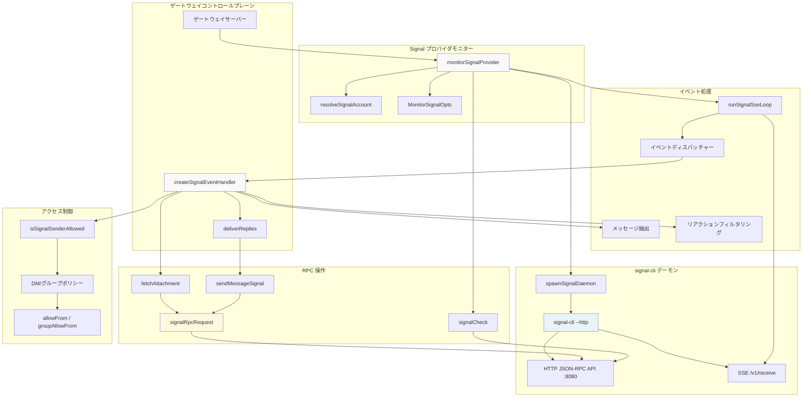
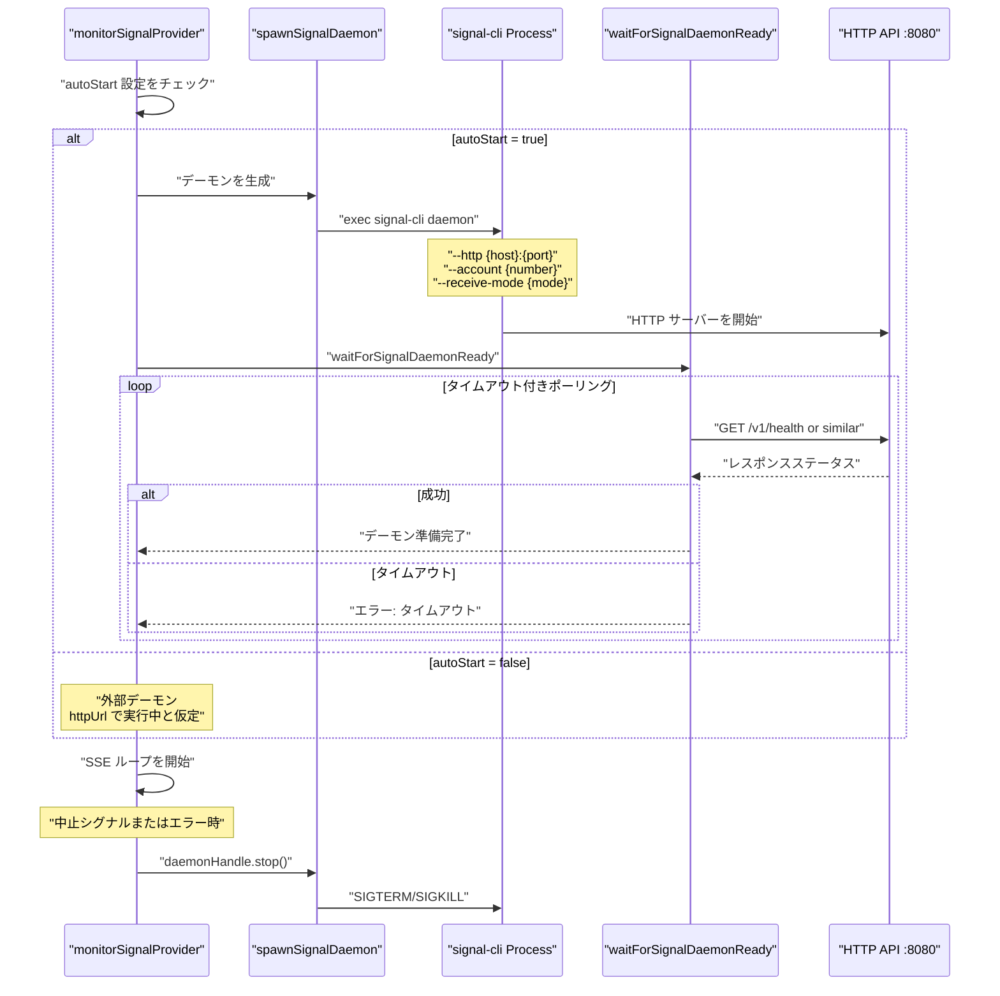
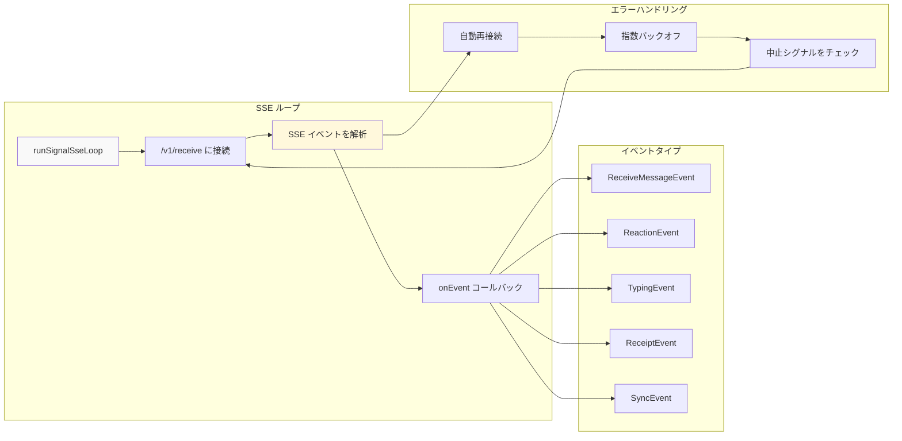
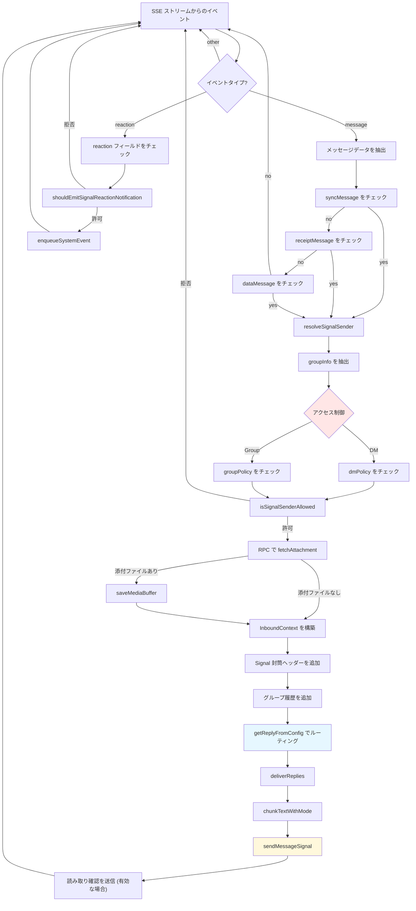
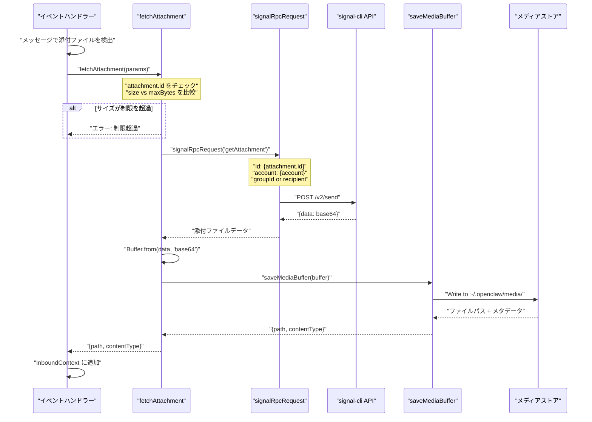
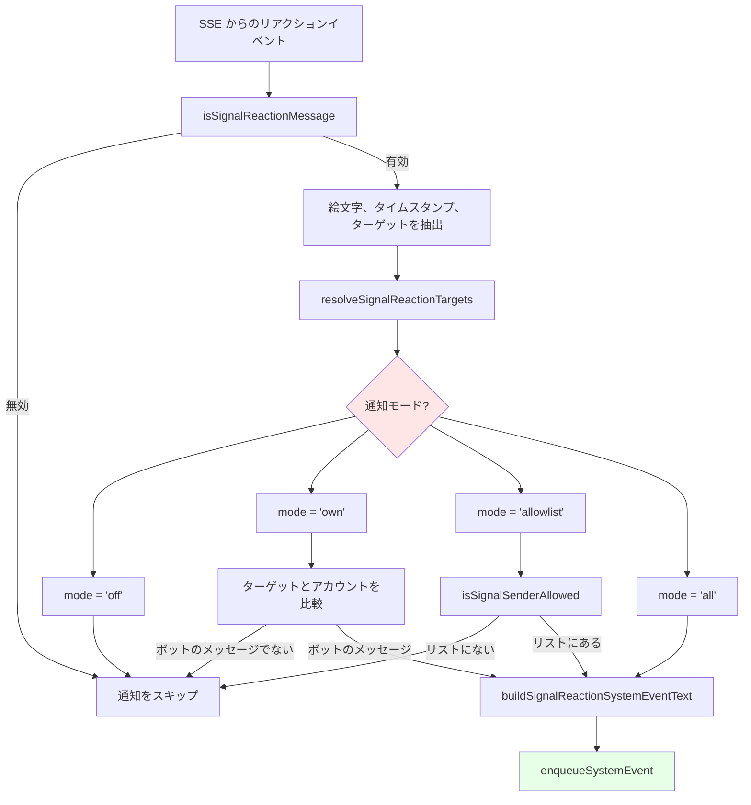
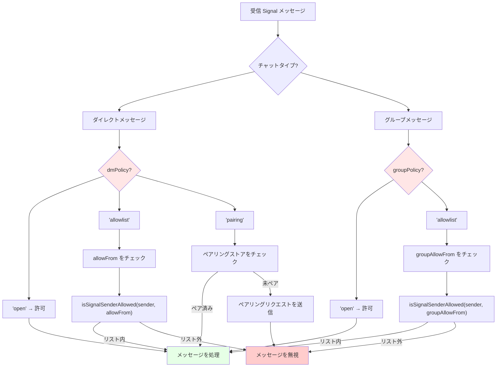
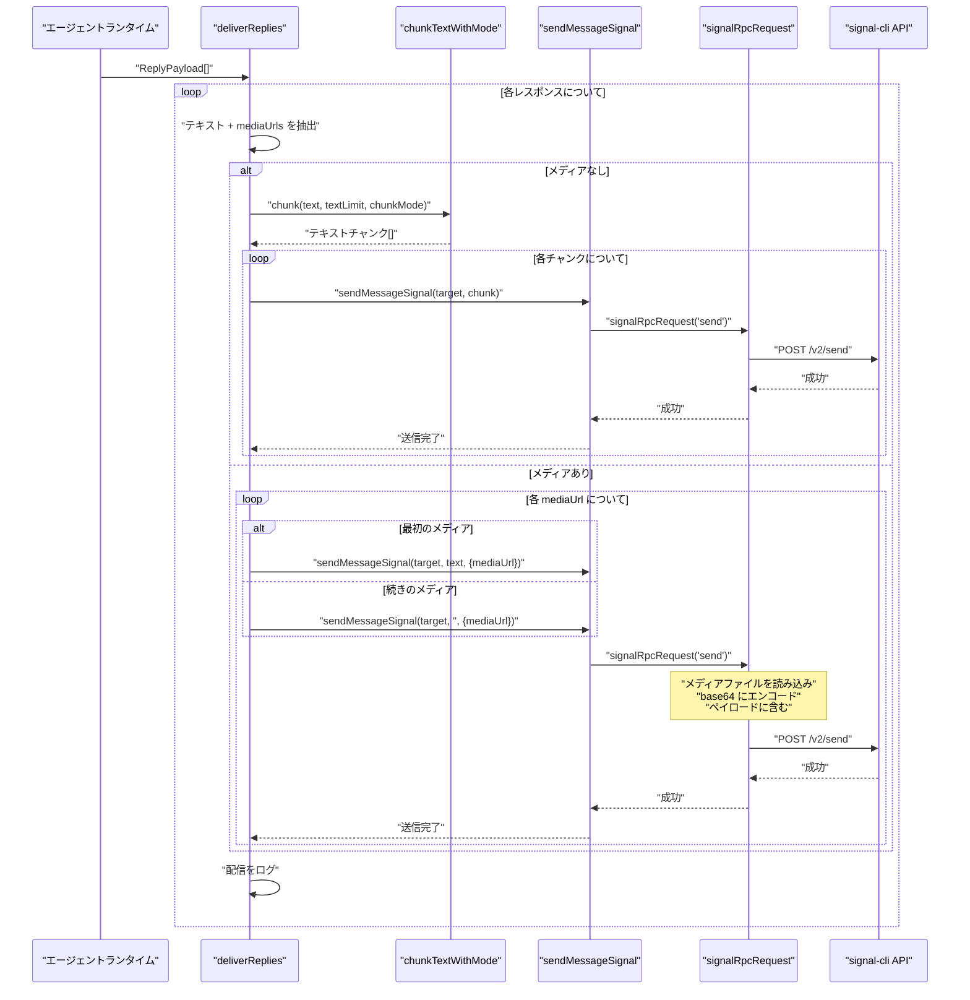

# ページ: Signal 統合

# Signal 統合

<details>
<summary>関連ソースファイル</summary>

この Wiki ページの作成に使用されたファイル:

- [README.md](README.md)
- [assets/avatar-placeholder.svg](assets/avatar-placeholder.svg)
- [docs/channels/zalo.md](docs/channels/zalo.md)
- [docs/channels/zalouser.md](docs/channels/zalouser.md)
- [scripts/clawtributors-map.json](scripts/clawtributors-map.json)
- [scripts/update-clawtributors.ts](scripts/update-clawtributors.ts)
- [scripts/update-clawtributors.types.ts](scripts/update-clawtributors.types.ts)
- [src/config/config.ts](src/config/config.ts)
- [src/discord/monitor.ts](src/discord/monitor.ts)
- [src/imessage/monitor.ts](src/imessage/monitor.ts)
- [src/index.test.ts](src/index.test.ts)
- [src/index.ts](src/index.ts)
- [src/signal/monitor.ts](src/signal/monitor.ts)
- [src/slack/monitor.ts](src/slack/monitor.ts)
- [src/telegram/bot.test.ts](src/telegram/bot.test.ts)
- [src/telegram/bot.ts](src/telegram/bot.ts)
- [src/web/auto-reply.ts](src/web/auto-reply.ts)
- [src/web/inbound.media.test.ts](src/web/inbound.media.test.ts)
- [src/web/inbound.test.ts](src/web/inbound.test.ts)
- [src/web/test-helpers.ts](src/web/test-helpers.ts)
- [src/web/vcard.ts](src/web/vcard.ts)
- [tsconfig.json](tsconfig.json)
- [ui/src/styles.css](ui/src/styles.css)
- [ui/src/styles/layout.mobile.css](ui/src/styles/layout.mobile.css)

</details>


このドキュメントでは、OpenClaw の Signal メッセージ統合について説明します。これは `signal-cli` を基盤トランスポートとして使用します。統合は signal-cli デーモンを生成および管理し、その Server-Sent Events (SSE) ストリームで受信メッセージを消費し、JSON-RPC API を使用してメッセージを送信し添付ファイルを取得します。

一般的なチャネルの概念（ルーティング、アクセス制御、セッションキー）については [チャネルルーティングとアクセス制御](#8.1) を参照してください。その他のメッセージングプラットフォームについては [WhatsApp 統合](#8.2)、[Telegram 統合](#8.3)、[Discord 統合](#8.4)、[その他チャネル](#8.6) を参照してください。

---

## アーキテクチャ概要

**Signal 統合コンポーネントアーキテクチャ**



**ソース:** [src/signal/monitor.ts:1-377]()

Signal 統合はデーモンベースのアーキテクチャに従っており、`monitorSignalProvider` がライフサイクル全体を調整します。オプションで `autoStart` が有効な場合は signal-cli デーモンプロセスを生成し、HTTP API が準備できるのを待ってから SSE 接続を開いてイベントを受信します。受信イベントは `createSignalEventHandler` にディスパッチされ、これはアクセス制御を適用し、JSON-RPC 経由で添付ファイルを取得し、メッセージをエージェントシステムにルーティングし、レスポンスを signal-cli API 経てで送り返します。

---

## 設定

**Signal アカウント設定構造**

Signal 統合は `openclaw.json` の `channels.signal` セクションで設定され、`accounts` マップを介してアカウントごとのオーバーライドがサポートされます:

| 設定キー | タイプ | デフォルト | 説明 |
|-------------------|------|---------|-------------|
| `account` | `string` | 必須 | Signal アカウント電話番号 (E.164 形式) |
| `accountId` | `string` | 自動生成 | マルチアカウントセットアップ用の内部識別子 |
| `httpUrl` | `string` | `http://127.0.0.1:8080` | signal-cli HTTP API のベース URL |
| `autoStart` | `boolean` | `true` (if no `httpUrl`) | signal-cli デーモンを生成するかどうか |
| `cliPath` | `string` | `"signal-cli"` | signal-cli 実行ファイルへのパス |
| `httpHost` | `string` | `"127.0.0.1"` | デーモン HTTP バインドアドレス |
| `httpPort` | `number` | `8080` | デーモン HTTP ポート |
| `receiveMode` | `"on-start" \| "manual"` | `undefined` | signal-cli 受信モード |
| `startupTimeoutMs` | `number` | `30000` | デーモン起動の最大待機時間 (1s-120s でクランプ) |
| `dmPolicy` | `"open" \| "allowlist" \| "pairing"` | `"pairing"` | DM アクセスポリシー |
| `groupPolicy` | `"open" \| "allowlist"` | `"allowlist"` | グループアクセスポリシー |
| `allowFrom` | `string[]` | `[]` | DM 用の電話番号または UUID |
| `groupAllowFrom` | `string[]` | `allowFrom` | グループ内の電話番号/UUID |
| `reactionNotifications` | `"off" \| "own" \| "allowlist" \| "all"` | `"own"` | リアクション通知モード |
| `reactionAllowlist` | `string[]` | `[]` | 通知をトリガーするユーザー (mode=`"allowlist"` 時) |
| `ignoreAttachments` | `boolean` | `false` | 添付ファイルのダウンロードをスキップ |
| `ignoreStories` | `boolean` | `false` | ストーリーメッセージをスキップ |
| `sendReadReceipts` | `boolean` | `false` | デーモン経由で読み取り確認を送信 |
| `mediaMaxMb` | `number` | `8` | 添付ファイル最大サイズ (MB) |
| `blockStreaming` | `boolean` | `false` | ストリーミングレスポンスを無効化 |
| `historyLimit` | `number` | from `messages.groupChat.historyLimit` | グループ履歴エントリの最大数 |

**ソース:** [src/signal/monitor.ts:38-57](), [src/signal/monitor.ts:253-286]()

`resolveSignalAccount` 関数がアカウント固有のオーバーライドをチャネルレベルのデフォルトとマージし、グローバルフォールバックを適用します。アクセスリスト内の電話番号は `normalizeE164` によって自動的に E.164 形式に正規化されます。

---

## デーモン管理

**Signal デーモンライフサイクル**



**ソース:** [src/signal/monitor.ts:288-311](), [src/signal/monitor.ts:318-328](), [src/signal/monitor.ts:145-170]()

`autoStart` が有効な場合（デフォルトで `httpUrl` が提供されない場合）、`monitorSignalProvider` は `spawnSignalDaemon` を呼び出して signal-cli デーモンプロセスをフォークします。デーモンは以下で呼び出されます:
- `--http {httpHost}:{httpPort}` - HTTP API バインディング
- `--account {account}` - Signal アカウント番号
- `--receive-mode {receiveMode}` - メッセージ取得モード (`on-start` または `manual`)
- `--ignore-attachments` - 設定されている場合
- `--ignore-stories` - 設定されている場合
- `--send-read-receipts` - 設定されている場合

`waitForSignalDaemonReady` 関数は `signalCheck` (ヘルスチェックリクエストを実行) を使用して HTTP API を指数バックオフでポーリングし、デーモンが正常に応答するか `startupTimeoutMs` が超過するまで待ちます。タイムアウトは 1 秒と 120 秒の間でクランプされます。

中止またはエラー時、デーモンハンドルの `stop()` メソッドが呼び出され、プロセスがクリーンに終了しない場合は SIGTERM に続いて SIGKILL が送信されます。

**ソース:** [src/signal/monitor.ts:312-328](), [src/signal/monitor.ts:372-375]()

---

## イベントストリーム

**SSE 接続とイベントディスパッチ**



**ソース:** [src/signal/monitor.ts:358-368]()

`runSignalSseLoop` 関数は signal-cli デーモンの `/v1/receive` エンドポイントへの永続的 SSE 接続を確立します。それは継続的に Server-Sent Events を読み込み、提供された `onEvent` コールバックにディスパッチします。ループは以下を処理します:

- **接続失敗**: 指数バックオフでの自動再接続
- **中止シグナル**: `abortSignal` がトリガーされた場合のクリーンシャットダウン
- **イベント解析**: SSE データフレームからの JSON ペイロードの抽出
- **エラーアイソレーション**: 個別のイベントハンドラーの失敗がストリームを破壊しない

signal-cli から受信した各イベントは `createSignalEventHandler` に渡されます。これはコアメッセージ処理ロジックをラップします。ハンドラーは非同期で呼び出され、エラーはイベントストリームを妨げることなくキャッチされログに記録されます。

**ソース:** [src/signal/monitor.ts:363-367]()

---

## メッセージ処理

**Signal イベントハンドラーフロー**



**ソース:** [src/signal/monitor.ts:330-356]()

`createSignalEventHandler` 関数は完全なメッセージ処理パイプラインを調整します:

1. **イベント分類**: イベントペイロードを調べて、それがメッセージ、リアクション、タイピングインジケーター、またはレシートであるか決定
2. **送信者解決**: `source` または `sourceUuid` フィールドから `resolveSignalSender` 経由で送信者電話番号/UUID を抽出
3. **グループ検出**: `groupInfo` をチェックして DM とグループメッセージを区別
4. **アクセス制御**: `isSignalSenderAllowed` を `allowFrom` (DM) または `groupAllowFrom` (グループ) に基づいて適用
5. **添付ファイル取得**: 添付ファイルのあるメッセージの場合、`fetchAttachment` を呼び出し:
   - `getAttachment` RPC で attachment ID でリクエスト
   - base64 エンコードされたデータを受信
   - `saveMediaBuffer` でデコードして保存
   - ローカルファイルパスを返す
6. **コンテキスト構築**: `InboundContext` を以下で構築:
   - Signal 封筒ヘッダー: `[Signal {name} {phone/uuid} {timestamp}]`
   - メッセージテキストまたは添付ファイルプレースホルダー
   - 送信者メタデータ
   - グループ履歴 (適用可能な場合)
7. **エージェントルーティング**: 適切なエージェントとセッションにルーティングする `getReplyFromConfig` を呼び出す
8. **レスポンス配信**: `deliverReplies` がテキストを (必要に応じて) チャンキングし `sendMessageSignal` で送信
9. **読み取り確認**: `sendReadReceipts` が有効でデーモンがサポートしている場合、メッセージを読みとしてマーク

**ソース:** [src/signal/monitor.ts:209-251](), [src/signal/monitor.ts:172-207]()

---

## 添付ファイル

**Signal 添付ファイル取得アーキテクチャ**



**ソース:** [src/signal/monitor.ts:172-207]()

`fetchAttachment` 関数は Signal 添付ファイル取得を実装します:

**パラメータ**:
- `baseUrl`: signal-cli HTTP API ベース URL
- `account`: Signal アカウント番号 (オプション、設定から推論)
- `attachment`: `id`、`contentType`、`filename`、`size` を含む添付ファイルメタデータオブジェクト
- `sender`: DM 添付ファイル用の送信者電話番号/UUID
- `groupId`: グループ添付ファイル用のグループID
- `maxBytes`: サイズ制限 (`mediaMaxMb * 1024 * 1024` から)

**プロセス**:
1. `attachment.id` が存在することを検証
2. `attachment.size` を `maxBytes` と比較、超過すればスロー
3. `groupId` (グループ用) または `recipient` (DM 用) で RPC パラメータを構築
4. `signalRpcRequest("getAttachment", params)` を呼び出し:
   - signal-cli の JSON-RPC エンドポイントに POST
   - base64 エンコードされた `data` フィールドを含む応答を受信
5. base64 を Buffer にデコード
6. `saveMediaBuffer(buffer, contentType, "inbound", maxBytes)` を呼び出し:
   - `~/.openclaw/media/inbound/` に書き込み
   - コンテントタイプからの拡張子付きで一意のファイル名を生成
   - `{id, path, size, contentType}` を返す
7. 呼び出し元に `{path, contentType}` を返す

添付ファイルパスはその後 `InboundContext` に含まれ、エージェントによる処理に利用可能になります。

**ソース:** [src/signal/monitor.ts:172-207]()

---

## リアクション

**Signal リアクション通知システム**

Signal 統合は `reactionNotifications` 設定で詳細なフィルタリングを使用してリアクション通知をサポートします:

| モード | 動作 |
|------|----------|
| `"off"` | リアクション通知なし |
| `"own"` | ボット自身のメッセージへのリアクションのみ通知 (デフォルト) |
| `"allowlist"` | `reactionAllowlist` のユーザーからのリアクションのみ通知 |
| `"all"` | すべてのリアクションを通知 |

**リアクション処理フロー**:



**ソース:** [src/signal/monitor.ts:95-103](), [src/signal/monitor.ts:105-131](), [src/signal/monitor.ts:133-143]()

**リアクション検証** (`isSignalReactionMessage`):
- 空でない `emoji` 文字列が必要
- 有効な `targetSentTimestamp` (数値 > 0) が必要
- 少なくとも1つのターゲット識別子 (`targetAuthor` または `targetAuthorUuid`) が必要

**ターゲット解決** (`resolveSignalReactionTargets`):
- UUID と電話番号の両方のターゲットを抽出
- `{kind: "phone" | "uuid", id: string, display: string}` の配列を返す
- 電話番号を E.164 形式に正規化

**通知フィルタリング** (`shouldEmitSignalReactionNotification`):
- **"off"**: すぐに `false` を返す
- **"own"**: `account` (ボット番号) とリアクションターゲットを比較。電話番号と UUID の両方の形式で一致
- **"allowlist"**: `isSignalSenderAllowed(sender, reactionAllowlist)` を呼び出してリアクターが認可されているかチェック
- **"all"**: すべての場合に `true` を返す

**イベント生成** (`buildSignalReactionSystemEventText`):
```
Signal reaction added: {emoji} by {actor} msg {messageId} [from {target}] [in {group}]
```

イベントは `enqueueSystemEvent` を介してセッションのシステムイベントストリームにエンキューされ、エージェントがコンテキスト情報として利用できるようになります。

**ソース:** [src/signal/monitor.ts:81-143]()

---

## アクセス制御

**Signal アクセス制御デシジョンツリー**



**ソース:** [src/signal/monitor.ts:256-286]()

Signal 統合は2つの独立したポリシーシステムを通じてアクセス制御を適用します:

**DM ポリシー** (`dmPolicy`):
- **"open"**: すべての DM を許可
- **"allowlist"**: `allowFrom` 内の番号/UUID からの DM のみ許可
- **"pairing"**: ペアリングコードによる明示的なペアリングが必要 (Telegram/WhatsApp のペアリングに類似)

**グループポリシー** (`groupPolicy`):
- **"open"**: すべてのグループメッセージを許可
- **"allowlist"**: `groupAllowFrom` 内の番号/UUID からのグループメッセージのみ許可

**送信者検証** (`isSignalSenderAllowed`):
この関数は送信者識別子を許可リストと照合し、以下の両方をサポート:
- **電話番号**: E.164 形式 (`+15551234567`) に正規化
- **UUIDs**: Signal UUID 形式 (`uuid:...` または生の UUID)

`groupAllowFrom` リストは明示的に設定されていない場合 `allowFrom` にデフォルト設定され、単一の統合許可リストを提供します。両方のリストは `normalizeAllowList` で正規化され:
1. すべてのエントリを文字列に変換
2. ホワイトスペースをトリム
3. 空のエントリをフィルタリング

**ソース:** [src/signal/monitor.ts:71-73](), [src/signal/monitor.ts:270-279]()

---

## レスポンス配信

**Signal レスポンスチャンキングと配信**



**ソース:** [src/signal/monitor.ts:209-251]()

`deliverReplies` 関数は自動テキストチャンキングとメディア添付サポートを使用してレスポンス配信を処理します:

**パラメータ**:
- `replies`: エージェントからの `ReplyPayload` オブジェクトの配列
- `target`: 受信者電話番号またはグループID
- `baseUrl`: signal-cli API URL
- `account`: Signal アカウント番号
- `accountId`: 内部アカウント識別子
- `textLimit`: メッセージあたりの最大テキスト長 (設定から)
- `chunkMode`: `"length"` または `"newline"` チャンキング戦略
- `maxBytes`: メディアサイズ制限

**テキストのみメッセージ**:
1. `chunkTextWithMode(text, textLimit, chunkMode)` を呼び出し:
   - **"length" モード**: `textLimit` 文字で分割
   - **"newline" モード**: 改行で分割、`textLimit` を尊重
2. 各チャンクを `sendMessageSignal(target, chunk, {...})` で送信
3. 各チャンクの配信をログ

**メディアありメッセージ**:
1. `mediaUrls` 配列を反復
2. 最初のメディアをキャプション付き (完全なテキスト) で送信
3. 続きのメディアをキャプションなし (空文字列) で送信
4. `mediaUrl` パラメータでの各 `sendMessageSignal` 呼び出し:
   - `mediaUrl` からローカルメディアファイルを読み込み
   - base64 にエンコード
   - RPC ペイロードの `base64Attachments` フィールドに含める
5. 各メディアアイテムの配信をログ

チャンキングモードは `resolveChunkMode(cfg, "signal", accountId)` で解決され:
1. Signal 固有の `channels.signal.chunkMode`
2. グローバル `messages.chunkMode`
3. デフォルトは `"length"`

**ソース:** [src/signal/monitor.ts:209-251](), [src/signal/monitor.ts:268]()

---

## エラーハンドリングと再接続

Signal 統合は複数レベルで堅牢なエラーハンドリングを実装します:

**デーモン起動失敗**:
- `waitForSignalDaemonReady` が指数バックオフで `startupTimeoutMs` までポーリング
- 10秒後およびそれ以降10秒ごとに進捗をログ
- タイムアウト超過時にスロー、呼び出し元に伝播

**SSE 接続失敗**:
- `runSignalSseLoop` が接続ドロップで自動再接続
- 再接続試行間で指数バックオフを実装
- `abortSignal` をクリーンシャットダウンに尊重
- 個別のイベント解析エラーはログされるがストリームを壊さない

**RPC 失敗**:
- `signalRpcRequest` にタイムアウト処理を含む
- 接続エラーがコンテキスト付きでログ
- 再試行ロジックは呼び出し側によって処理 (例: 一時的な失敗時の添付ファイル取得再試行)

**イベントハンドラー失敗**:
- イベントハンドラーは `monitorSignalProvider` 内で try-catch でラップ
- エラーは `runtime.error` でログされるがイベントストリームを妨げない
- 1つの失敗メッセージが後続メッセージの処理を防止しないように保証

**クリーンアップ**:
```typescript
try {
  // ... デーモン起動、SSE ループ
} catch (err) {
  if (opts.abortSignal?.aborted) return;
  throw err;
} finally {
  opts.abortSignal?.removeEventListener("abort", onAbort);
  daemonHandle?.stop();
}
```

**ソース:** [src/signal/monitor.ts:318-376]()

---

## チャネルルーティングとの統合

Signal 統合は OpenClaw のチャネルルーティングシステムとシームレスに統合されます:

**セッションキー解決**:
- **DM セッション**: `agent:{agentId}:signal:dm:{phone}`
- **グループセッション**: `agent:{agentId}:signal:group:{groupId}`

セッションキーは (レスポンスフロー内で呼び出される) `resolveAgentRoute` で解決され:
1. `routing.bindings` 設定に基づいてエージェントバインディングを決定
2. バインディングが一致しない場合はデフォルトエージェントを適用
3. Signal 固有のピア識別子でセッションキーを構築

**メッセージルーティング**:
イベントハンドラーで構築される `InboundContext` には以下が含まれます:
- `Channel: "signal"`
- `ChannelAccountId: accountId`
- `PeerId`: 電話番号 (DM) またはグループID (グループ)
- `SenderId`: 送信者電話番号/UUID
- `SenderName`: 連絡先情報からの表示名
- `ChatType: "dm" | "group"`
- `WasMentioned`: Signal には不適用 (@メンションなし)

このコンテキストは `getReplyFromConfig` に渡され、適切なエージェントとセッションマネージャーにルーティングされます。

**ソース:** [src/signal/monitor.ts:330-356]()

---