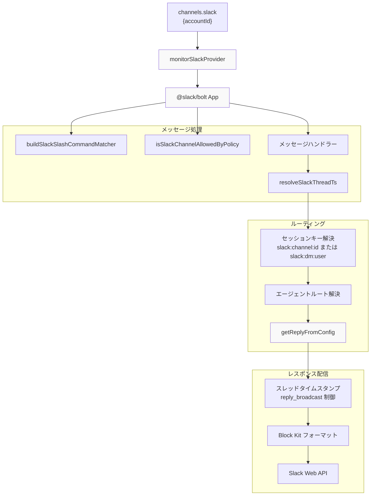
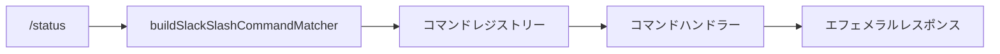
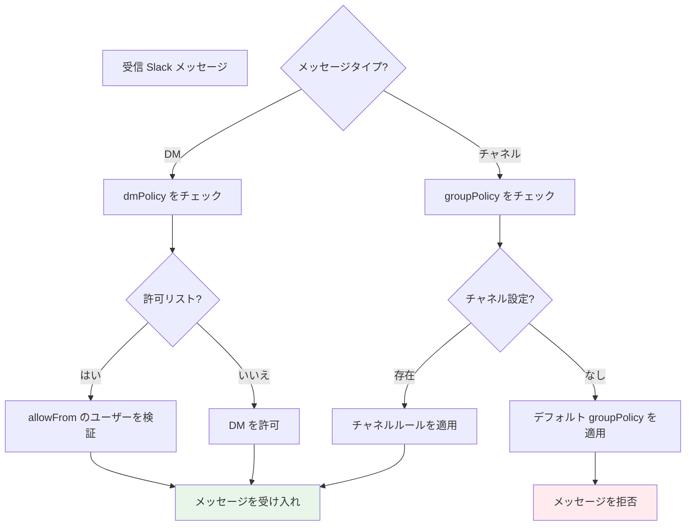
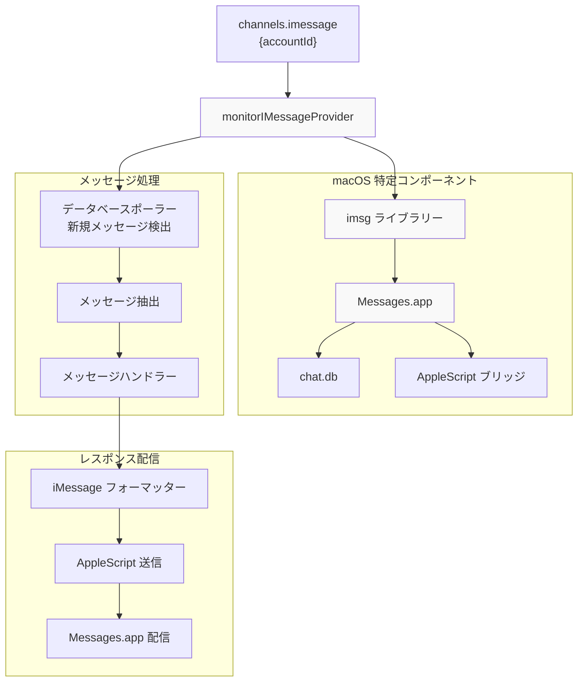
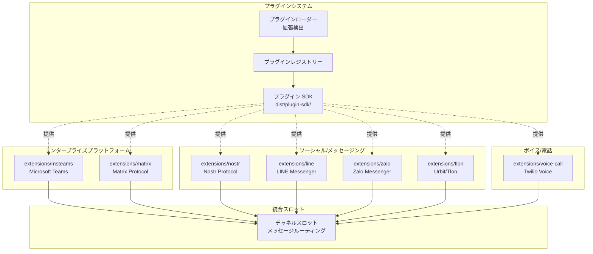
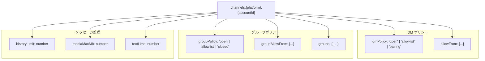

# ページ: その他のチャネル

# その他のチャネル

<details>
<summary>関連ソースファイル</summary>

この Wiki ページの作成に使用されたファイル:

- [README.md](README.md)
- [assets/avatar-placeholder.svg](assets/avatar-placeholder.svg)
- [docs/channels/zalo.md](docs/channels/zalo.md)
- [docs/channels/zalouser.md](docs/channels/zalouser.md)
- [scripts/clawtributors-map.json](scripts/clawtributors-map.json)
- [scripts/update-clawtributors.ts](scripts/update-clawtributors.ts)
- [scripts/update-clawtributors.types.ts](scripts/update-clawtributors.types.ts)
- [src/config/config.ts](src/config/config.ts)
- [src/discord/monitor.ts](src/discord/monitor.ts)
- [src/imessage/monitor.ts](src/imessage/monitor.ts)
- [src/index.test.ts](src/index.test.ts)
- [src/index.ts](src/index.ts)
- [src/signal/monitor.ts](src/signal/monitor.ts)
- [src/slack/monitor.ts](src/slack/monitor.ts)
- [src/telegram/bot.test.ts](src/telegram/bot.test.ts)
- [src/telegram/bot.ts](src/telegram/bot.ts)
- [src/web/auto-reply.ts](src/web/auto-reply.ts)
- [src/web/inbound.media.test.ts](src/web/inbound.media.test.ts)
- [src/web/inbound.test.ts](src/web/inbound.test.ts)
- [src/web/test-helpers.ts](src/web/test-helpers.ts)
- [src/web/vcard.ts](src/web/vcard.ts)
- [tsconfig.json](tsconfig.json)
- [ui/src/styles.css](ui/src/styles.css)
- [ui/src/styles/layout.mobile.css](ui/src/styles/layout.mobile.css)

</details>


このドキュメントでは OpenClaw の Slack、iMessage、ベース拡張メッセージングプラットフォーム統合について説明します。WhatsApp、Telegram、Discord、Signal 統合についてはそれぞれ専用ページを参照してください ([8.2](#8.2)、[8.3](#8.3)、[8.4](#8.4)、[8.5](#8.5))。一般的なチャネルルーティングとアクセス制御の概念については [8.1](#8.1) を参照してください。ベース拡張ベースのチャネルを可能にするプラグインアーキテクチャについては [10.1](#10.1) を参照してください。

---

## Slack 統合

OpenClaw は Bolt フレームワークを介してネイティブ Slack 統合を提供し、スラッシュコマンド、スレッド化された会話、ワークスペースベースのルーティングをサポートします。

### Slack チャネルアーキテクチャ



**ソース**: [src/slack/monitor.ts:1-6]()

### Slack 設定

Slack チャネルは `channels.slack` でアカウント固有の設定で設定されます:

```json
{
  "channels": {
    "slack": {
      "main": {
        "botToken": "xoxb-...",
        "appToken": "xapp-...",
        "signingSecret": "...",
        "dmPolicy": "pairing",
        "allowFrom": ["U12345", "U67890"],
        "groupPolicy": "allowlist",
        "channels": {
          "C12345": { "requireMention": false },
          "C67890": { "requireMention": true }
        }
      }
    }
  }
}
```

| 設定フィールド | タイプ | 説明 |
|-------------------|------|-------------|
| `botToken` | string | Slack ボットトークン (xoxb-...) |
| `appToken` | string | Socket Mode 用の Slack アプリレベルトークン (xapp-...) |
| `signingSecret` | string | Webhook 検証用リクエスト署名シークレット |
| `dmPolicy` | string | DM アクセス制御: "open", "allowlist", または "pairing" |
| `allowFrom` | array | DM で許可されるユーザーID (allowlist/pairing 使用時) |
| `groupPolicy` | string | グループ/チャネルアクセス制御ポリシー |
| `channels` | object | チャネルごとの設定オーバーライド |
| `channels.*.requireMention` | boolean | チャネルでボットメンションが必要かどうか |

**ソース**: [src/slack/monitor.ts:1-6](), [src/config/config.ts:1-15]()

### Slack スラッシュコマンド

Slack は OpenClaw のコマンドシステムにマッピングされるネイティブスラッシュコマンドをサポートします。コマンドは `buildSlackSlashCommandMatcher` を使用して登録されます:



コマンドは:
- **グローバルコマンド**: すべての会話で利用可能 (例: `/status`, `/help`)
- **チャネルスコープ**: アクセスグループに基づいて特定チャネルに制限
- **エフェメラル**: 呼び出しユーザーのみに表示されるレスポンス

**ソース**: [src/slack/monitor.ts:1]()

### Slack スレッド動作

Slack 会話はスレッドタイムスタンプ (`ts`) を使用してメッセージスレッド化されます。`resolveSlackThreadTs` 関数は、レスポンスが以下のどちらを行うかを決定します:

1. **新しいスレッドを開始**: 元のメッセージに `thread_ts` で返信
2. **スレッドを継続**: 同じ `thread_ts` を使用して既存スレッド内で返信
3. **チャネルにブロードキャスト**: `reply_broadcast: true` でメインチャネルに表示

スレッド動作は `replyToMode` 設定を尊重します (同様の Telegram 動作については [8.3](#8.3) 参照)。

**ソース**: [src/slack/monitor.ts:4]()

### Slack アクセス制御

`isSlackChannelAllowedByPolicy` 関数はチャネルレベルのアクセス制御を適用します:



**ソース**: [src/slack/monitor.ts:2]()

---

## iMessage 統合

OpenClaw は macOS 専用に `imsg` ライブラリを介して iMessage 統合を提供し、ネイティブ Messages.app データベースと AppleScript とインターフェースします。

### iMessage アーキテクチャ



**ソース**: [src/imessage/monitor.ts:1-2]()

### iMessage 設定

iMessage は macOS と Messages.app の設定とログインが必要:

```json
{
  "channels": {
    "imessage": {
      "main": {
        "dmPolicy": "pairing",
        "allowFrom": ["+15555551234", "user@icloud.com"],
        "groupPolicy": "allowlist",
        "groups": {
          "chat123456": { "requireMention": false }
        },
        "pollIntervalMs": 1000,
        "historyLimit": 50
      }
    }
  }
}
```

| 設定フィールド | タイプ | 説明 |
|-------------------|------|-------------|
| `dmPolicy` | string | DM アクセス制御ポリシー |
| `allowFrom` | array | 許可リスト用の電話番号またはメールアドレス |
| `groupPolicy` | string | グループチャットアクセス制御ポリシー |
| `groups` | object | グループ固有設定 (チャット識別子でキー設定) |
| `pollIntervalMs` | number | データベースポーリング間隔 (デフォルト: 1000ms) |
| `historyLimit` | number | グループチャット履歴から読み込む最大メッセージ数 |

### iMessage 実装詳細

`monitorIMessageProvider` 関数は以下のワークフローを実装します:

1. **データベース監視**: `~/Library/Messages/chat.db` で新規メッセージをポーリング
2. **ID 解決**: 電話番号とメールアドレスを連絡先にマッピング
3. **グループチャット検出**: `chat` テーブルレコード経由でグループチャットを特定
4. **メッセージ抽出**: メッセージ内容、添付ファイル、メタデータを読み取り
5. **セッションルーティング**: 送信者/チャットに基づいて適切なエージェントセッションにルーティング
6. **レスポンス配信**: AppleScript 経由で Messages.app に返信を送信

**制限**:
- macOS 専用 (Messages.app 必須)
- メディアアップロードサポートなし (テキストレスポンスのみ)
- ポーリングベース (リアルタイムプッシュなし)
- `chat.db` の Full Disk Access 権限が必要

**ソース**: [src/imessage/monitor.ts:1-2]()

---

## ベース拡張チャネル

OpenClaw はプラグインアーキテクチャを介して 20 以上の追加メッセージングプラットフォームをサポートします。これらのチャネルは `extensions/` ディレクトリに拡張として実装され、設定時に自動ロードされます。

### 利用可能な拡張チャネル



**ソース**: コンテキスト内の高レベルアーキテクチャ図 (図 5)

### 拡張チャネルリスト

| 拡張 | プラットフォーム | NPM パッケージ | 状態 |
|-----------|----------|-------------|--------|
| `msteams` | Microsoft Teams | `@microsoft/agents-hosting` | プロダクション |
| `matrix` | Matrix Protocol | `@vector-im/matrix-bot-sdk` | プロダクション |
| `nostr` | Nostr Protocol | `nostr-tools` | ベータ |
| `line` | LINE Messenger | `@line/bot-sdk` | プロダクション |
| `tlon` | Urbit/Tlon | `@urbit/http-api` | ベータ |
| `zalo` | Zalo Messenger | カスタム実装 | ベータ |
| `voice-call` | Twilio Voice | `twilio` | プロダクション |

追加拡張 (15+) にはカスタム統合、ワークフローツール、実験的プロトコルが含まれます。

**ソース**: コンテキスト内の高レベルアーキテクチャ図 (図 5)

### 拡張設定パターン

すべての拡張ベースチャネルは一貫した設定パターンに従います:

```json
{
  "channels": {
    "{extensionName}": {
      "{accountId}": {
        // 拡張固有の認証
        "credentials": { ... },

        // 標準チャネルポリシー
        "dmPolicy": "pairing",
        "allowFrom": [...],
        "groupPolicy": "allowlist",

        // 拡張固有オプション
        "extensionOptions": { ... }
      }
    }
  }
}
```

Gateway は `extensions/` で `package.json` ファイルをスキャンして `openclaw.extensions` マニフェストフィールドを持つものを検出することで拡張を自動的に発見してロードします (プラグインアーキテクチャの詳細については [10.1](#10.1) 参照)。

---

## Microsoft Teams

`extensions/msteams` 統合は `@microsoft/agents-hosting` パッケージを介して Microsoft Teams ボット機能を提供します。

### Teams 設定

```json
{
  "channels": {
    "msteams": {
      "main": {
        "appId": "...",
        "appPassword": "...",
        "dmPolicy": "allowlist",
        "allowFrom": ["user@contoso.com"],
        "groupPolicy": "allowlist",
        "teams": {
          "team-id-123": {
            "channels": {
              "channel-id-456": { "requireMention": true }
            }
          }
        }
      }
    }
  }
}
```

Teams 固有機能:
- **Adaptive Cards**: リッチカードベースレスポンスのサポート
- **Team/Channel 階層**: チームとチャネルを介むマルチレベルルーティング
- **Activity feed**: Teams アクティビティ通知との統合
- **Meeting integration**: ボットが会議に参加して応答可能

**ソース**: コンテキスト内の高レベルアーキテクチャ図 (図 5)

---

## Matrix Protocol

`extensions/matrix` 統合は `@vector-im/matrix-bot-sdk` を介して Matrix プロトコルサポートを提供します。

### Matrix 設定

```json
{
  "channels": {
    "matrix": {
      "main": {
        "homeserverUrl": "https://matrix.org",
        "accessToken": "...",
        "dmPolicy": "pairing",
        "allowFrom": ["@user:matrix.org"],
        "groupPolicy": "allowlist",
        "rooms": {
          "!roomId:matrix.org": { "requireMention": false }
        }
      }
    }
  }
}
```

Matrix 固有機能:
- **End-to-end encryption**: セキュアメッセージ用のオプション E2EE サポート
- **Federation**: Matrix フェデレーションを介けるクロスサーバーメッセージング
- **Rich media**: ファイル、画像、フォーマット済みメッセージのサポート
- **Room threading**: スレッド対応メッセージルーティング

**ソース**: コンテキスト内の高レベルアーキテクチャ図 (図 5)

---

## LINE Messenger

`extensions/line` 統合は `@line/bot-sdk` を介して LINE メッセージングプラットフォームをサポートします。

### LINE 設定

```json
{
  "channels": {
    "line": {
      "main": {
        "channelAccessToken": "...",
        "channelSecret": "...",
        "dmPolicy": "open",
        "groupPolicy": "allowlist",
        "groups": {
          "C1234567890abcdef": { "requireMention": true }
        }
      }
    }
  }
}
```

LINE 固有機能:
- **Rich messages**: LINE のリッチメッセージテンプレートのサポート
- **Quick replies**: ボタンベースのクイックリプライオプション
- **Flex messages**: カスタムカードベースのレイアウト
- **LINE Pay integration**: オプショナル決済処理

**ソース**: コンテキスト内の高レベルアーキテクチャ図 (図 5)

---

## Nostr Protocol

`extensions/nostr` 統合は `nostr-tools` を介して Nostr プロトコルサポートを提供します。

### Nostr 設定

```json
{
  "channels": {
    "nostr": {
      "main": {
        "privateKey": "nsec1...",
        "relays": [
          "wss://relay.damus.io",
          "wss://relay.nostr.band"
        ],
        "dmPolicy": "pairing",
        "allowFrom": ["npub1..."]
      }
    }
  }
}
```

Nostr 固有機能:
- **Decentralized**: 中央サーバーなし、メッセージをリレーにブロードキャスト
- **Cryptographic identity**: 認証用 npub/nsec キーペア
- **Relay selection**: 構成可能なリレーエンドポイント
- **Note kind filtering**: 異なる Nostr イベント種のサポート

**ソース**: コンテキスト内の高レベルアーキテクチャ図 (図 5)

---

## Tlon/Urbit

`extensions/tlon` 統合は `@urbit/http-api` を介して Urbit メッセージングを提供します。

### Tlon 設定

```json
{
  "channels": {
    "tlon": {
      "main": {
        "url": "http://localhost:8080",
        "code": "lidlut-tabwed-pillex-ridrup",
        "ship": "~sampel-palnet",
        "dmPolicy": "allowlist",
        "allowFrom": ["~zod", "~bus"]
      }
    }
  }
}
```

Tlon 固有機能:
- **Ship-based identity**: Urbit シップをユーザーIDとして
- **Graph store**: Urbit のグラフベースメッセージストレージ
- **Groups integration**: ネイティブ Urbit グループサポート
- **Local-first**: 通常はローカル Urbit シップに対して実行

**ソース**: コンテキスト内の高レベルアーキテクチャ図 (図 5)

---

## Zalo Messenger

`extensions/zalo` 統合は Zalo メッセージングプラットフォームサポートを提供します。

### Zalo 設定

```json
{
  "channels": {
    "zalo": {
      "main": {
        "appId": "...",
        "secretKey": "...",
        "oaId": "...",
        "dmPolicy": "open",
        "groupPolicy": "allowlist"
      }
    }
  }
}
```

Zalo 固有機能:
- **Official Accounts**: Zalo OA (Official Account) との統合
- **Mini apps**: Zalo Mini App エコシステムのサポート
- **ZNS notifications**: Zalo Notification Service 統合
- **Regional focus**: ベトナムおよび東南アジアで人気

**ソース**: コンテキスト内の高レベルアーキテクチャ図 (図 5)

---

## ボイスコール統合

`extensions/voice-call` 統合は Twilio を介して電話サポートを提供します。

### ボイスコール設定

```json
{
  "channels": {
    "voice-call": {
      "main": {
        "accountSid": "AC...",
        "authToken": "...",
        "phoneNumber": "+15555551234",
        "dmPolicy": "allowlist",
        "allowFrom": ["+15555555678"],
        "voiceModel": "eleven-labs",
        "transcriptionProvider": "deepgram"
      }
    }
  }
}
```

ボイス固有機能:
- **Inbound calls**: エージェントレスポンスで着信電話に応答
- **Outbound calls**: プログラムで電話を発信
- **Speech-to-text**: Deepgram または Whisper を使用した呼び出し者音声の文字化
- **Text-to-speech**: ElevenLabs またはその他 TTS を使用したエージェントレスポンスの合成
- **Call routing**: 呼び出し者または時間に基づいて電話を転送

**ソース**: コンテキスト内の高レベルアーキテクチャ図 (図 5)

---

## チャネル間の設定パターン

すべてのチャネル (ネイティブと拡張ベース) は共通の設定パターンを共有:

### 共通アクセス制御フィールド



### 共通設定スキーマ

| フィールド | タイプ | デフォルト | 説明 |
|-------|------|---------|-------------|
| `dmPolicy` | enum | `"pairing"` | DM アクセス制御: open, allowlist, pairing |
| `allowFrom` | array | `[]` | 許可される DM 送信者のリスト |
| `groupPolicy` | enum | `"allowlist"` | グループアクセス制御: open, allowlist, closed |
| `groupAllowFrom` | array | `[]` | 許可されるグループメンバーのリスト |
| `groups` | object | `{}` | グループ固有設定オーバーライド |
| `historyLimit` | number | `50` | コンテキスト用にロードするグループメッセージの最大数 |
| `mediaMaxMb` | number | `5` | メディアファイルの最大サイズ (MB) |
| `textLimit` | number | `4000` | レスポンス用の最大テキストチャンクサイズ |
| `blockStreaming` | boolean | `false` | ストリーミングを無効化、完全なレスポンスを送信 |
| `replyToMode` | enum | `"first"` | スレッド動作: first, all, none |

**ソース**: [src/config/config.ts:1-15](), [src/telegram/bot.ts:50-65](), [src/signal/monitor.ts:38-57]()

---

## カスタムチャネル拡張の追加

新しいチャネル拡張を作成するには、チャネルスロットインターフェースを実装し、プラグインマニフェスト経由で登録します。詳細なプラグイン開発ガイドについては [10.3](#10.3) を参照してください。

### 最小チャネル拡張構造

```
extensions/my-channel/
├── package.json          # openclaw.extensions を含むプラグインマニフェスト
├── src/
│   ├── monitor.ts       # チャネル監視ループ
│   ├── send.ts          # メッセージ送信
│   └── types.ts         # 型定義
└── README.md
```

`package.json` は拡張を宣言する必要があります:

```json
{
  "name": "@openclaw/channel-my-platform",
  "openclaw": {
    "extensions": [
      {
        "type": "channel",
        "id": "my-platform",
        "config": {
          "schema": { /* TypeBox schema */ }
        }
      }
    ]
  }
}
```

チャネル拡張は以下を実装する必要があります:
- **監視関数**: メッセージ受信用の長期存続ループ
- **送信関数**: 外部レスポンスをプラットフォームに配信
- **アクセス制御**: OpenClaw のポリシーシステムとの統合
- **セッションルーティング**: プラットフォーム会話をセッションキーにマッピング

**ソース**: コンテキスト内の高レベルアーキテクチャ図 (図 5)、[10.1](#10.1) プラグインシステム概览

---