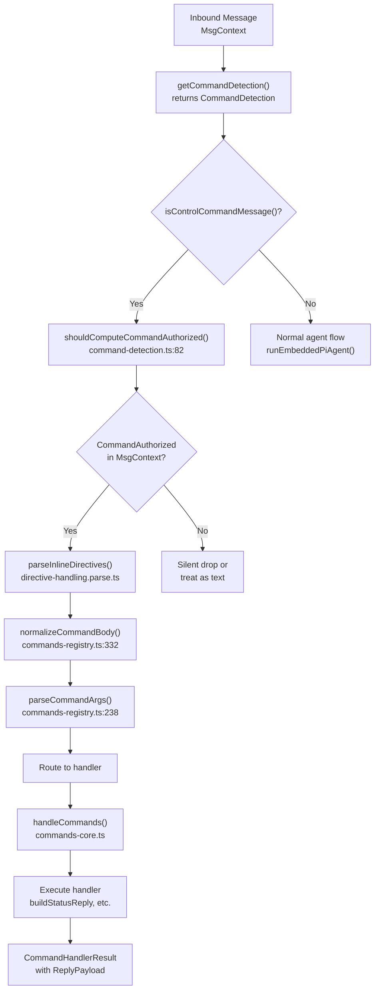
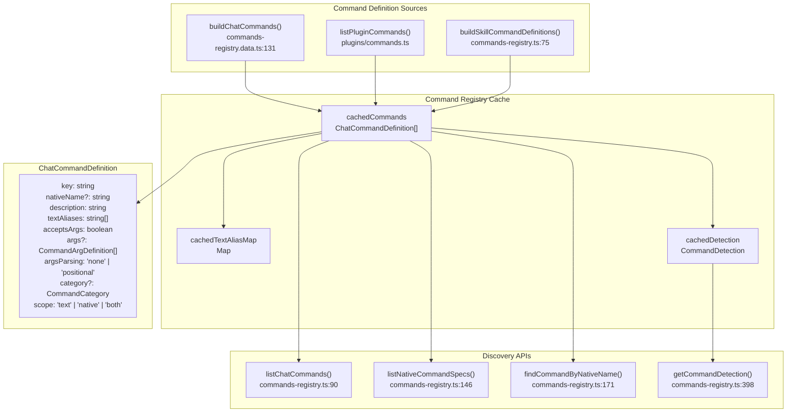
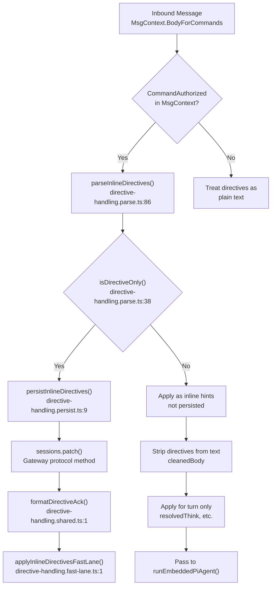
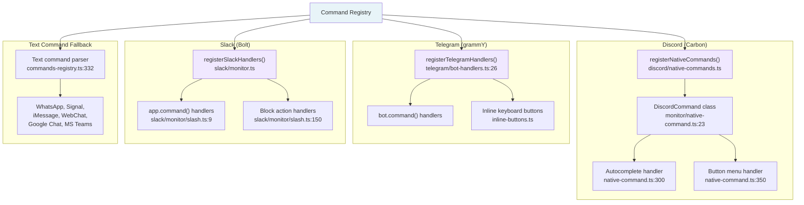
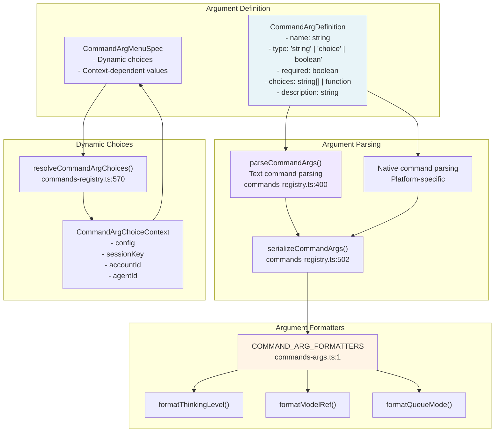
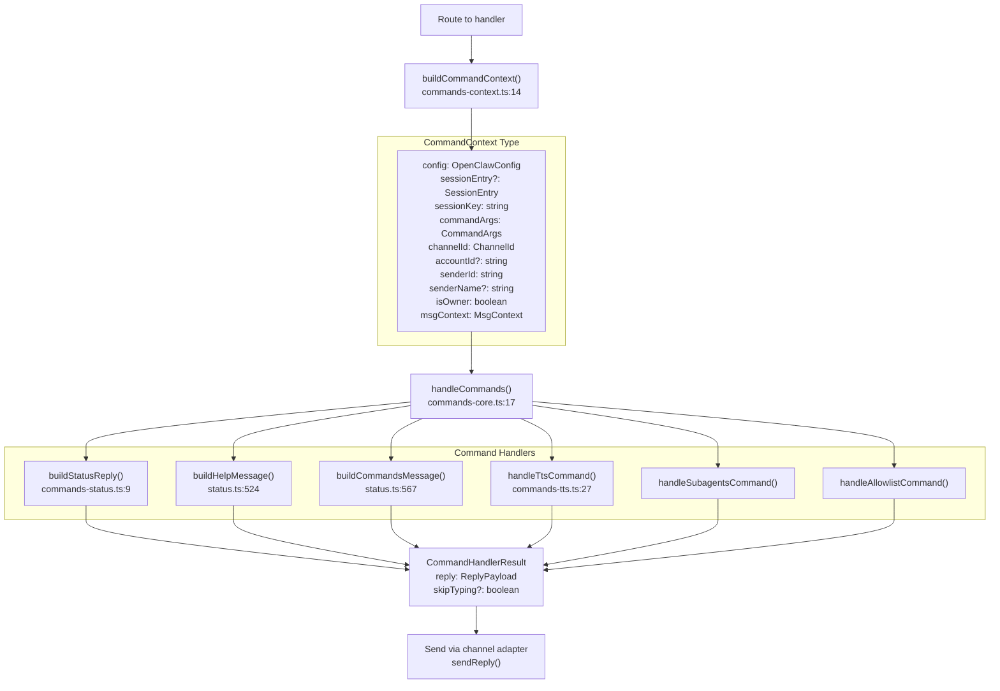
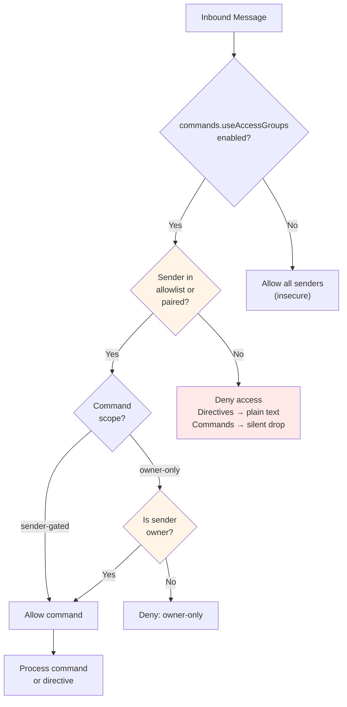

# Page: Commands and Directives

# コマンドとディレクティブ

<details>
<summary>関連ソースファイル</summary>

この Wiki ページの生成に使用されたコンテキストファイル:

- [docs/tools/slash-commands.md](docs/tools/slash-commands.md)
- [src/auto-reply/command-detection.ts](src/auto-reply/command-detection.ts)
- [src/auto-reply/commands-args.ts](src/auto-reply/commands-args.ts)
- [src/auto-reply/commands-registry.data.ts](src/auto-reply/commands-registry.data.ts)
- [src/auto-reply/commands-registry.test.ts](src/auto-reply/commands-registry.test.ts)
- [src/auto-reply/commands-registry.ts](src/auto-reply/commands-registry.ts)
- [src/auto-reply/commands-registry.types.ts](src/auto-reply/commands-registry.types.ts)
- [src/auto-reply/group-activation.ts](src/auto-reply/group-activation.ts)
- [src/auto-reply/reply.ts](src/auto-reply/reply.ts)
- [src/auto-reply/reply/commands-core.ts](src/auto-reply/reply/commands-core.ts)
- [src/auto-reply/reply/commands-status.ts](src/auto-reply/reply/commands-status.ts)
- [src/auto-reply/reply/commands-subagents.ts](src/auto-reply/reply/commands-subagents.ts)
- [src/auto-reply/reply/commands.test.ts](src/auto-reply/reply/commands.test.ts)
- [src/auto-reply/reply/commands.ts](src/auto-reply/reply/commands.ts)
- [src/auto-reply/reply/directive-handling.ts](src/auto-reply/reply/directive-handling.ts)
- [src/auto-reply/reply/subagents-utils.test.ts](src/auto-reply/reply/subagents-utils.test.ts)
- [src/auto-reply/reply/subagents-utils.ts](src/auto-reply/reply/subagents-utils.ts)
- [src/auto-reply/send-policy.ts](src/auto-reply/send-policy.ts)
- [src/auto-reply/status.test.ts](src/auto-reply/status.test.ts)
- [src/auto-reply/status.ts](src/auto-reply/status.ts)
- [src/auto-reply/templating.ts](src/auto-reply/templating.ts)

</details>


このページでは、OpenClaw のコマンドとディレクティブシステムについて説明します。コマンドは、特定のアクションをトリガーするユーザー向けの操作（`/status`、`/help`、`/model` など）です。ディレクティブは、エージェントの動作を制御する特別な修飾子（`/think`、`/verbose`、`/reasoning` など）で、インラインヒントまたは永続的なセッション設定として機能します。

詳細なコマンドリファレンスと使用例については、[Command Reference](#9.1) を参照してください。プラットフォーム固有のコマンド実装については、[Platform-Specific Commands](#9.2) を参照してください。ディレクティブの動作詳細については、[Directives](#9.3) を参照してください。

## コマンドとディレクティブの概念

OpenClaw は **コマンド** と **ディレクティブ** を区別します:

### コマンド
特定のアクションをトリガーするスタンドアロンの `/...` メッセージ:
- `/status` - セッションとモデルのステータスを表示
- `/help` - ヘルプ情報を表示
- `/reset` - 現在のセッションをリセット
- `/compact` - セッション履歴をコンパクション
- `/model` - モデル選択を変更

コマンドは通常、スタンドアロンメッセージとして送信する必要があります（メッセージが `/` で始まる）。`/help`、`/status`、`/commands`、`/whoami` などの一部のコマンドは、通常のメッセージに埋め込まれた場合に **インラインショートカット** としても機能します。

### ディレクティブ
エージェントの動作を制御する修飾子で、モデルが見る前にメッセージから削除されます:
- `/think <level>` - 思考レベルを設定
- `/verbose on|off` - 詳細度を制御
- `/reasoning on|off` - 推論出力を制御
- `/elevated on|off` - 昇格アクセスを制御
- `/exec host=... security=...` - exec ツールの動作を設定
- `/model <name>` - モデルを変更
- `/queue <mode>` - キュー動作を設定

ディレクティブはメッセージの内容に基づいて異なる動作をします:
- **インラインヒント**（通常のテキストと混在する場合）: そのターンのみ適用され、永続化されない
- **ディレクティブのみのメッセージ**（メッセージにディレクティブのみが含まれる場合）: セッションに永続化され、確認応答付きで承認される

Sources: [docs/tools/slash-commands.md:1-20](), [src/auto-reply/reply/directives.ts:1-12]()

## コマンド処理アーキテクチャ



**コマンド検出フロー**

コマンド検出フローは、受信メッセージがコマンドかどうかを判断し、適切にルーティングします:

1. **検出**: `getCommandDetection()` は正確なコマンド一致と正規表現パターンを含む `CommandDetection` オブジェクトを返します。`isControlCommandMessage()` はメッセージが `/` で始まり、登録されたコマンドエイリアスに一致するかどうかを確認します
2. **アクセス制御**: `shouldComputeCommandAuthorized()` は `commands.useAccessGroups` 設定とコマンドの存在に基づいて認可を確認する必要があるかどうかを判断します
3. **ディレクティブ抽出**: `parseInlineDirectives()` はメッセージテキストからディレクティブを識別して削除し、`InlineDirectives` オブジェクトを返します
4. **正規化**: `normalizeCommandBody()` は Telegram スタイルの `@botname` サフィックスを削除し、コマンドエイリアスを正規化します（例: `/dock_telegram` → `/dock-telegram`）
5. **引数解析**: `parseCommandArgs()` はコマンドの `args` 定義配列に基づいてコマンド引数を抽出し、`raw` と `values` フィールドを持つ `CommandArgs` を返します
6. **ルーティング**: 一致したコマンドは `handleCommands()` にルーティングされ、コマンドキーに基づいて特定のハンドラーにディスパッチされます

Sources: [src/auto-reply/commands-registry.ts:332-397](), [src/auto-reply/commands-registry.ts:238-273](), [src/auto-reply/command-detection.ts:49-88](), [src/auto-reply/reply/commands-core.ts:1-100]()

## コマンドレジストリシステム



**コマンドレジストリコンポーネント**

コマンドレジストリは複数のソースからコマンドを集約し、ルックアップインターフェースを提供します:

- **`buildChatCommands()`**: `defineChatCommand()` ヘルパーを使用してビルトインコマンドを定義します。help、status、model、reset、compact、activation、tts、dock コマンドの仕様を作成します。`ChatCommandDefinition` オブジェクトの配列を返します
- **`listPluginCommands()`**: プラグイン提供のコマンドについて `getActivePluginRegistry()` 経由でアクティブなプラグインレジストリにクエリします
- **`buildSkillCommandDefinitions()`**: ユーザーが呼び出し可能なスキルの `SkillCommandSpec[]` を `ChatCommandDefinition[]` に変換します
- **テキストエイリアスマップ**: `getTextAliasMap()` によって構築され、コマンドのテキストエイリアス（例: `/status`、`/whoami`、`/id`）を正規形と `acceptsArgs` フラグを持つ `TextAliasSpec` にマッピングします
- **ネイティブコマンド仕様**: `listNativeCommandSpecs()` は `scope !== "text"` かつ `nativeName` が定義されたコマンドをフィルタリングし、プラットフォーム登録用の `NativeCommandSpec[]` を返します
- **コマンド検出**: `getCommandDetection()` は高速なコマンド検出のためのキャッシュされた正規表現パターンと完全一致セットを構築します
- **`ChatCommandDefinition`**: [src/auto-reply/commands-registry.types.ts:52-64]() で定義されたコアコマンドメタデータ型

コマンドキーは内部識別子（例: `dock:telegram`）で、テキストエイリアスはユーザー向け（例: `/dock-telegram`）です。[src/auto-reply/commands-registry.ts:124-128]() の `NATIVE_NAME_OVERRIDES` マップは、プラットフォーム固有の名前マッピングを提供します（例: Discord は `/tts` の代わりに `/voice` を使用）。

Sources: [src/auto-reply/commands-registry.ts:39-169](), [src/auto-reply/commands-registry.data.ts:131-379](), [src/auto-reply/commands-registry.types.ts:52-64]()

## ディレクティブ処理フロー



**ディレクティブ処理動作**

ディレクティブ処理はメッセージの内容と送信者の認可に基づいて異なります:

1. **認可チェック**: ディレクティブは `MsgContext` の `CommandAuthorized: true` の場合にのみ処理されます（許可リスト/ペアリングチェックによって設定）。未認証の送信者にはディレクティブがプレーンテキストとして表示されます
2. **抽出**: `parseInlineDirectives()` は `BodyForCommands` をスキャンしてディレクティブトークンを抽出し、以下を含む `InlineDirectives` オブジェクトを返します:
   - `thinkOverride?: ThinkLevel` - `extractThinkDirective()` から [src/auto-reply/reply/directives.ts:52-85]()
   - `verboseOverride?: VerboseLevel` - `extractVerboseDirective()` から [src/auto-reply/reply/directives.ts:87-108]()
   - `reasoningOverride?: ReasoningLevel` - `extractReasoningDirective()` から [src/auto-reply/reply/directives.ts:110-131]()
   - `elevatedOverride?: ElevatedLevel` - `extractElevatedDirective()` から [src/auto-reply/reply/directives.ts:133-154]()
   - `execOverride?: ExecDirective` - `extractExecDirective()` から [src/auto-reply/reply/exec.ts:8]()
   - `queueOverride?: QueueDirective` - `extractQueueDirective()` から [src/auto-reply/reply/queue.ts:9]()
3. **ディレクティブのみの検出**: `isDirectiveOnly()` はメッセージにディレクティブのみが含まれているか（他のテキストがないか）を確認します。`cleanedBody.trim().length === 0` の場合 `true` を返します
4. **永続化パス**: `persistInlineDirectives()` は `sessions.patch()` を呼び出して、新しい思考レベル、詳細レベル、モデルオーバーライドなどでセッションストアを更新します。フォーマットされた確認文字列を返します
5. **高速レーン**: `applyInlineDirectivesFastLane()` はディレクティブのみのメッセージを同期的に処理し、キューとエージェント実行をバイパスし、チャネルアダプターを介して即座に返信を送信します

サポートされているディレクティブエクストラクター:
- `extractThinkDirective()` - `/think <level>` を抽出（off, minimal, low, medium, high, xhigh, ultra）
- `extractVerboseDirective()` - `/verbose on|off|full` または `/v on|off|full` を抽出
- `extractReasoningDirective()` - `/reasoning on|off|stream` または `/reason on|off|stream` を抽出
- `extractElevatedDirective()` - `/elevated on|off|ask|full` または `/elev on|off|ask|full` を抽出
- `extractExecDirective()` - `/exec host=... security=... ask=... node=...` を抽出
- `extractQueueDirective()` - `/queue <mode> [debounce:Xms] [cap:N] [drop:policy]` を抽出

Sources: [src/auto-reply/reply/directive-handling.ts:1-6](), [src/auto-reply/reply/directive-handling.parse.ts:38-148](), [src/auto-reply/reply/directive-handling.persist.ts:9-178](), [src/auto-reply/reply/directives.ts:1-6]()

## プラットフォーム固有のコマンド実装



**ネイティブコマンド登録**

ネイティブコマンドは、拡張された UX を提供するプラットフォーム固有のスラッシュコマンドです:

### Discord コマンド
- コマンド登録に `@buape/carbon` ライブラリを使用
- `DiscordCommand` クラスは `Command` 基本クラスを拡張
- 動的オプション値（モデル、思考レベルなど）のオートコンプリート
- 必須引数が省略された場合のボタンメニュー
- `commands.native` が有効な場合、`registerNativeCommands()` で登録

### Telegram コマンド
- `grammY` ボットフレームワークを使用
- `bot.command()` ハンドラーでコマンドを登録
- オプション選択用のインラインキーボードボタン
- フォーラムスレッドサポート（トピック ID がコマンドで保持される）
- `registerTelegramHandlers()` で登録

### Slack コマンド
- `@slack/bolt` フレームワークを使用
- `app.command()` ハンドラーでコマンドを登録
- ボタンインタラクション用のブロックアクションハンドラー
- Slack アプリ設定で手動のスラッシュコマンド作成が必要
- 簡単なセットアップ用に `/slack-commands` エンドポイントでコマンドリストを提供

### テキストコマンドフォールバック
すべてのプラットフォームがテキストコマンドをフォールバックとしてサポートします。ネイティブコマンドサポートのないチャネル（WhatsApp、Signal、iMessage、WebChat、Google Chat、MS Teams）は、テキストコマンド解析のみに依存しています。

設定:
- `commands.native: "auto"` - Discord/Telegram では自動有効、Slack ではオフ
- `commands.text: true` - テキストコマンド解析を有効化（デフォルト）
- チャネルごとのオーバーライド: `channels.discord.commands.native` など

Sources: [src/discord/monitor/native-command.ts:1-10](), [src/telegram/bot-handlers.ts:26-35](), [src/slack/monitor/slash.ts:1-15]()

## コマンド引数システム



**引数処理**

コマンド引数は構造化されたシステムを通じて定義、解析、検証されます:

1. **引数定義**: 各コマンドは `CommandArgDefinition` を介して引数を宣言します:
   - `name`: 引数識別子
   - `type`: string、choice（enum）、または boolean
   - `required`: 引数が必須かどうか
   - `choices`: 静的配列または利用可能な値を返す動的関数
   - `description`: 引数のヘルプテキスト

2. **テキスト解析**: `parseCommandArgs()` はテキストコマンドから引数を抽出します:
   - 単純なスペース区切り値: `/model gpt-5`
   - キーバリューペア: `/exec host=gateway security=full`
   - 引用符付き値: `/message send --message "Hello world"`

3. **ネイティブ解析**: ネイティブコマンドインタラクションからのプラットフォーム固有の解析:
   - Discord: オートコンプリートオプションとセレクトメニュー
   - Telegram: インラインキーボードボタン
   - Slack: Block Kit セレクトメニュー

4. **シリアライゼーション**: `serializeCommandArgs()` は解析された引数を保存/表示用の正規テキスト形式に変換します

5. **動的選択肢**: `resolveCommandArgChoices()` はコンテキスト対応のオプションリストを提供します:
   - 設定されたプロバイダーに基づく利用可能なモデル
   - モデル/プロバイダーのサポートでフィルタリングされた思考レベル
   - キューモードとそのパラメーター

6. **フォーマッター**: `COMMAND_ARG_FORMATTERS` は表示用のドメイン固有の引数フォーマットを提供します

Sources: [src/auto-reply/commands-registry.ts:400-502](), [src/auto-reply/commands-registry.types.ts:1-20](), [src/auto-reply/commands-args.ts:1-15]()

## コマンド実行フロー



**コマンドハンドラー実行**

コマンドハンドラーは設定とセッション状態にアクセスできる構造化されたコンテキストで実行されます:

1. **コンテキスト構築**: [src/auto-reply/reply/commands-context.ts:14-70]() の `buildCommandContext()` が `CommandContext` を組み立てます:
   - `config`: コンフィグローダーからの現在の `OpenClawConfig`
   - `sessionEntry`: 履歴メタデータ、トークン数、コンパクション数を持つオプションの `SessionEntry`
   - `sessionKey`: セッション識別子文字列（例: `agent:main:whatsapp:1234567890`）
   - `commandArgs`: `raw` 文字列と `values` マップを持つ解析された `CommandArgs`
   - `channelId`: `normalizeChannelId()` からの正規化されたチャネル識別子
   - `accountId`: マルチアカウントチャネル用のオプションのアカウント ID
   - `senderId`: 送信者の一意識別子
   - `isOwner`: 送信者が最初の許可リストエントリかどうかを示すブール値
   - `msgContext`: 完全なメッセージエンベロープを持つ元の `MsgContext`

2. **ハンドラーディスパッチ**: [src/auto-reply/reply/commands-core.ts:17-359]() の `handleCommands()` はコマンドキーに基づいてハンドラーにルーティングします:
   - **Status**: `buildStatusReply()` が `buildStatusMessage()` [src/auto-reply/status.ts:327-486]() でステータスを生成
   - **Help**: `buildHelpMessage()` がグループ化されたコマンドリストをフォーマット [src/auto-reply/status.ts:524-565]()
   - **Commands**: Telegram 用のページネーションサポート付き `buildCommandsMessagePaginated()` による `buildCommandsMessage()` [src/auto-reply/status.ts:567-647]()
   - **TTS**: `handleTtsCommand()` が TTS アクション（status, off, always, provider, limit など）を解析 [src/auto-reply/reply/commands-tts.ts:27-225]()
   - **Subagents**: サブエージェント実行を管理（list, stop, log, info, send）
   - **Allowlist**: 許可リストエントリをリスト/追加/削除（`commands.config: true` が必要）

3. **レスポンス構造**: ハンドラーは [src/auto-reply/reply/commands-types.ts:39-42]() の `CommandHandlerResult` を返します:
   - `reply: ReplyPayload` - テキスト、添付ファイル、ルーティング情報を持つ構造化された返信
   - `skipTyping?: boolean` - タイピングインジケーターを抑制するフラグ

4. **配信**: レスポンスは、元のチャネルへの適切なルーティングでチャネルアダプターの `sendReply()` 関数を介して送信されます

Sources: [src/auto-reply/reply/commands.ts:1-8](), [src/auto-reply/reply/commands-context.ts:14-70](), [src/auto-reply/reply/commands-core.ts:17-359](), [src/auto-reply/reply/commands-status.ts:1-130](), [src/auto-reply/status.ts:327-647]()

## 設定

コマンドとディレクティブは `openclaw.json` の `commands` セクションで設定されます:

| 設定キー | 型 | デフォルト | 説明 |
|----------|------|---------|-------------|
| `commands.native` | `boolean \| "auto"` | `"auto"` | ネイティブスラッシュコマンドを有効化。Auto: Discord/Telegram でオン、Slack でオフ |
| `commands.nativeSkills` | `boolean \| "auto"` | `"auto"` | スキルコマンドをネイティブスラッシュコマンドとして登録。Auto: Discord/Telegram でオン、Slack でオフ |
| `commands.text` | `boolean` | `true` | テキストコマンド解析（メッセージ内の `/...`）を有効化 |
| `commands.bash` | `boolean` | `false` | ホストシェルコマンド用の `! <cmd>` と `/bash <cmd>` を有効化（`tools.elevated` 許可リストが必要） |
| `commands.bashForegroundMs` | `number` | `2000` | bash コマンドをバックグラウンド化する前に待機するミリ秒（`0` ですぐにバックグラウンド化） |
| `commands.config` | `boolean` | `false` | `openclaw.json` へのディスク書き込み用の `/config` コマンドを有効化 |
| `commands.debug` | `boolean` | `false` | ランタイムのみの設定オーバーライド用の `/debug` コマンドを有効化（メモリ、ディスクではない） |
| `commands.restart` | `boolean` | `false` | ゲートウェイ再起動用の `/restart` コマンドを有効化 |
| `commands.useAccessGroups` | `boolean` | `true` | コマンドとディレクティブの許可リスト/ペアリングチェックを強制 |

設定検証は [src/config/config.ts:1-50]() で Zod で定義された `OpenClawSchema` を使用します。コマンド設定は [src/auto-reply/commands-registry.ts:100-111]() の `isCommandEnabled()` と [src/auto-reply/commands-registry.ts:556-585]() の `shouldHandleTextCommands()` で読み取られます。

### チャネルごとのオーバーライド

チャネル固有のコマンド設定はグローバルデフォルトをオーバーライドします。チャネル設定スキーマで定義されます:

```json5
{
  channels: {
    discord: {
      commands: {
        native: true,          // グローバルの commands.native をオーバーライド
        nativeSkills: false    // Discord でスキルコマンドを無効化
      }
    },
    telegram: {
      commands: {
        native: true,          // ネイティブコマンドを有効化
        nativeSkills: true     // スキルコマンドを有効化
      }
    },
    slack: {
      commands: {
        native: false          // Slack はアプリで手動のスラッシュコマンド設定が必要
      }
    }
  }
}
```

チャネルオーバーライドは [src/auto-reply/commands-registry.data.ts:496-541]() の `getNativeCommandSurfaces()` で解決されます。テキストコマンド処理は `shouldHandleTextCommands()` を介してチャネル固有の `native` 設定を尊重します。

### アクセス制御

`commands.useAccessGroups: true`（デフォルト）の場合、コマンドとディレクティブは認証された送信者に対してのみ処理されます:
- **許可リストユーザー**: `channels.*.allowFrom`、`channels.*.dm.allowFrom`、または `channels.*.groups.*.allowFrom` にリストされている
- **ペアリング済みユーザー**: `openclaw pairing approve <channel> <code>` コマンドで承認済み
- **オーナー**: 許可リストの最初のエントリ（オーナー専用コマンドの追加権限）

認可は [src/auto-reply/command-detection.ts:82-88]() の `shouldComputeCommandAuthorized()` でチェックされます。結果は `MsgContext.CommandAuthorized` フィールドに保存されます。

未認証の動作:
- コマンドのみのメッセージ: サイレントに無視（エラーは送信されない）
- 混合メッセージ内のインラインコマンド: プレーンテキストとして扱われ、モデルに渡される
- ディレクティブ: `parseInlineDirectives()` で抽出されず、通常のメッセージコンテンツとして扱われる

Sources: [docs/tools/slash-commands.md:26-59](), [src/auto-reply/commands-registry.ts:100-111](), [src/auto-reply/commands-registry.ts:556-585](), [src/auto-reply/command-detection.ts:82-88]()

## セキュリティと認可



**コマンド認可モデル**

コマンドとディレクティブの認可は、多層アクセス制御モデルに従います:

1. **グローバルトグル**: `commands.useAccessGroups` はすべての認可チェックを有効/無効にします
   - `false` の場合: すべての送信者がコマンドを使用可能（安全ではない、推奨されない）
   - `true` の場合（デフォルト）: 許可リスト/ペアリングチェックを強制

2. **送信者認可**:
   - **許可リスト済み**: ユーザーが `channels.*.allowFrom` または `channels.*.dm.allowFrom` に表示される
   - **ペアリング済み**: ユーザーが `openclaw pairing approve` でペアリングフローを完了
   - **オーナー**: 許可リストの最初のエントリ（追加権限）

3. **コマンドスコープ**:
   - **owner-only**: 送信者がオーナーである必要がある（例: `/config`、`/debug`、`/restart`、`/send`）
   - **sender-gated**: 認証された送信者は誰でも使用可能

4. **未認証の動作**:
   - コマンドのみのメッセージ: サイレントにドロップ（エラーは送信されない）
   - インラインコマンド: プレーンテキストとして扱われ、モデルに渡される
   - ディレクティブ: 抽出されず、通常のメッセージコンテンツとして扱われる

5. **グループコマンドゲーティング**:
   - 許可リスト済み送信者からのコマンドのみのメッセージはメンション要件をバイパス
   - メンションゲートされたグループでも認証されたユーザーが常にコマンドを実行できるようにする

6. **特殊なケース**:
   - インラインショートカット（`/help`、`/status`、`/commands`、`/whoami`）は混合メッセージで機能
   - 高速パス: コマンドのみのメッセージはキューとモデルをバイパスして即座に応答

Sources: [docs/tools/slash-commands.md:19-20](), [src/auto-reply/commands-registry.ts:140-173](), [src/auto-reply/reply/directive-handling.parse.ts:54-85]()

## コマンドカテゴリとスコープ

コマンドはアクセス制御と整理のためにカテゴリとスコープで整理されます:

| カテゴリ | コマンド | 説明 |
|----------|----------|-------------|
| **status** | `/status`, `/health`, `/context`, `/whoami` | システムとセッションのステータスクエリ |
| **configuration** | `/config`, `/debug`, `/allowlist` | 設定管理（昇格アクセスが必要） |
| **agent** | `/model`, `/think`, `/verbose`, `/reasoning`, `/elevated` | エージェント動作制御 |
| **session** | `/reset`, `/new`, `/compact`, `/usage`, `/tts` | セッションライフサイクル管理 |
| **system** | `/restart`, `/stop`, `/send` | ゲートウェイ制御（オーナーのみ） |
| **help** | `/help`, `/commands`, `/skill` | ドキュメントとコマンド発見 |

| スコープ | 説明 | コマンド例 |
|-------|-------------|------------------|
| **sender-gated** | 認証された送信者なら誰でも | `/status`, `/help`, `/model` |
| **owner-only** | オーナーのみ（最初の許可リストエントリ） | `/config`, `/debug`, `/restart`, `/send` |

スキルコマンド（ユーザー呼び出し可能スキル）は動的に登録され、デフォルトで sender-gated として扱われます。スキルは `command-dispatch: tool` でオーバーライドして、モデル呼び出しなしでツールに直接ルーティングできます。

Sources: [src/auto-reply/commands-registry.data.ts:10-50](), [src/auto-reply/commands-registry.types.ts:1-10]()

---
