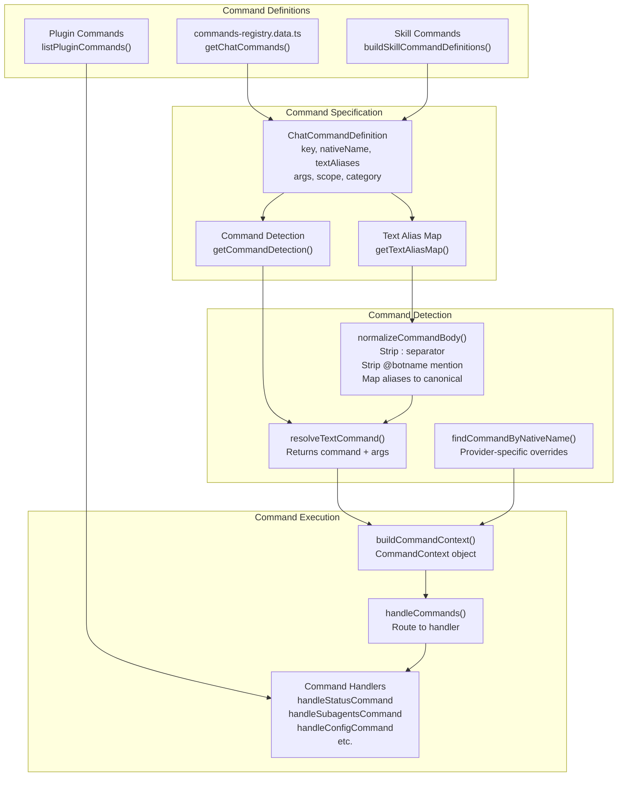
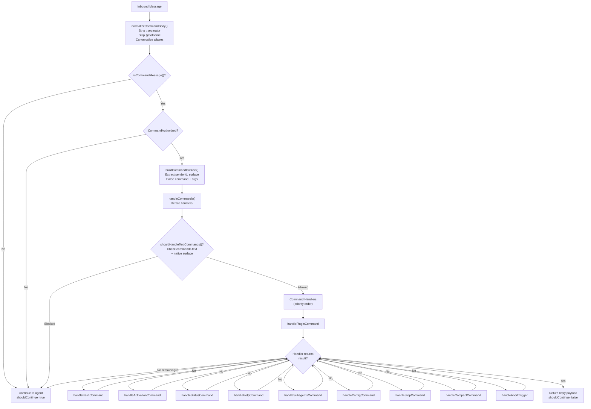
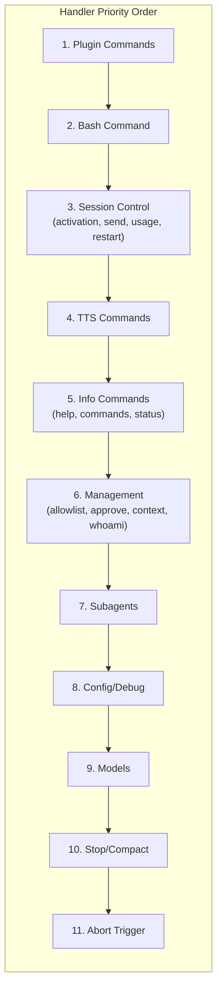
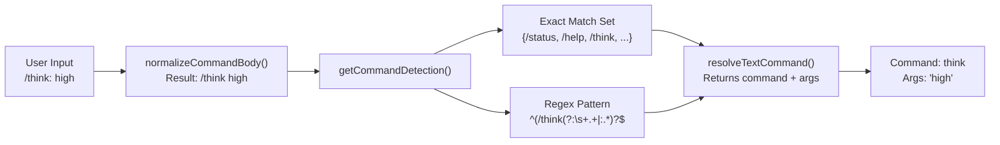

# Page: Command Reference

# コマンドリファレンス

<details>
<summary>関連ソースファイル</summary>

この Wiki ページの生成に使用されたコンテキストファイル:

- [docs/tools/slash-commands.md](docs/tools/slash-commands.md)
- [src/auto-reply/command-detection.ts](src/auto-reply/command-detection.ts)
- [src/auto-reply/commands-args.ts](src/auto-reply/commands-args.ts)
- [src/auto-reply/commands-registry.data.ts](src/auto-reply/commands-registry.data.ts)
- [src/auto-reply/commands-registry.test.ts](src/auto-reply/commands-registry.test.ts)
- [src/auto-reply/commands-registry.ts](src/auto-reply/commands-registry.ts)
- [src/auto-reply/commands-registry.types.ts](src/auto-reply/commands-registry.types.ts)
- [src/auto-reply/group-activation.ts](src/auto-reply/group-activation.ts)
- [src/auto-reply/reply.ts](src/auto-reply/reply.ts)
- [src/auto-reply/reply/commands-core.ts](src/auto-reply/reply/commands-core.ts)
- [src/auto-reply/reply/commands-status.ts](src/auto-reply/reply/commands-status.ts)
- [src/auto-reply/reply/commands-subagents.ts](src/auto-reply/reply/commands-subagents.ts)
- [src/auto-reply/reply/commands.test.ts](src/auto-reply/reply/commands.test.ts)
- [src/auto-reply/reply/commands.ts](src/auto-reply/reply/commands.ts)
- [src/auto-reply/reply/directive-handling.ts](src/auto-reply/reply/directive-handling.ts)
- [src/auto-reply/reply/subagents-utils.test.ts](src/auto-reply/reply/subagents-utils.test.ts)
- [src/auto-reply/reply/subagents-utils.ts](src/auto-reply/reply/subagents-utils.ts)
- [src/auto-reply/send-policy.ts](src/auto-reply/send-policy.ts)
- [src/auto-reply/status.test.ts](src/auto-reply/status.test.ts)
- [src/auto-reply/status.ts](src/auto-reply/status.ts)
- [src/auto-reply/templating.ts](src/auto-reply/templating.ts)

</details>


このドキュメントでは、OpenClaw で利用可能なすべてのビルトインコマンドの完全なリファレンスを提供します。コマンドは、AI モデルを呼び出すことなく、ユーザーがエージェントの動作を制御し、システム状態を検査し、セッションを管理するためのテキストベースの制御メッセージです。モデルの動作を変更するインラインディレクティブ（`:think`、`:model` など）については、[Directives](#9.4) を参照してください。コマンド認可ポリシーについては、[Command Authorization](#9.2) を参照してください。

---

## コマンドタイプ

OpenClaw は2つのコマンドサーフェスをサポートしています:

**テキストコマンド**: `/` で始まるメッセージ（例: `/status`、`/help`）で、チャットテキストから解析されます。すべてのチャネルで利用可能です。

**ネイティブコマンド**: メッセージングプラットフォームに登録されたプラットフォーム固有のコマンドインターフェース（Discord スラッシュコマンド、Telegram ボットコマンド）。これらをサポートするプラットフォーム（Discord、Telegram、Slack）でのみ利用可能です。

### コマンドとディレクティブ

| 機能 | コマンド | ディレクティブ |
|---------|----------|------------|
| プレフィックス | `/command` | `/directive` または `:directive` |
| 実行 | ハンドラー関数、モデル呼び出しなし | 解析されモデルリクエストに適用 |
| 永続性 | 即座、一度きりのアクション | セッションに永続化される可能性あり（ディレクティブのみのメッセージ） |
| 例 | `/status`, `/help`, `/compact` | `/think`, `/model`, `/verbose` |

**重要な違い**: コマンド（例: `/status`、`/stop`）は専用のハンドラー関数で処理され、AI モデルには到達しません。ディレクティブ（例: `/think high`、`/model gpt-5`）はエージェントのシステムプロンプトやツールの可用性を変更し、モデルが見る前にメッセージから削除されます。

**インラインショートカット**: コマンドのサブセット（`/help`、`/commands`、`/status`、`/whoami`）はインラインショートカットとして機能します - メッセージに埋め込まれると即座に実行され、残りのテキストはモデルに続きます。例: `"hey /status what's the weather?"` はステータス返信をトリガーし、その後 `"what's the weather?"` を処理します。

**Sources**: [docs/tools/slash-commands.md:9-26](), [src/auto-reply/reply/commands-core.ts:38-135]()

---

## コマンドレジストリアーキテクチャ



**Sources**: [src/auto-reply/commands-registry.ts:45-518](), [src/auto-reply/commands-registry.data.ts:131-614]()

---

## コマンドカテゴリ

コマンドは7つの機能カテゴリに整理されています:

| カテゴリ | 目的 | コマンド例 |
|----------|---------|-----------------|
| **Session** | セッションライフサイクル制御 | `/new`, `/reset`, `/compact`, `/stop` |
| **Options** | エージェント動作設定 | `/think`, `/model`, `/verbose`, `/queue` |
| **Status** | 情報表示 | `/status`, `/help`, `/commands`, `/context` |
| **Management** | アクセス制御と設定 | `/allowlist`, `/config`, `/debug`, `/subagents` |
| **Media** | 音声とメディア機能 | `/tts` |
| **Tools** | 機能管理 | `/skill`, `/bash`, `/restart` |
| **Docks** | 返信ルーティング | `/dock-telegram`, `/dock-discord` |

**Sources**: [src/auto-reply/status.ts:470-488](), [src/auto-reply/commands-registry.types.ts:5-12]()

---

## 完全コマンドリファレンス

### セッションコマンド

#### `/new [model_hint]`
**エイリアス**: `/reset`
**スコープ**: Both (text and native)
**説明**: 新しいセッションを開始し、会話履歴をクリアします。
**パラメーター**:
- `model_hint` (オプション): 新しいセッションのモデル名またはプロバイダーヒント
**認可**: 認可が必要
**注意**: 認識されないモデルヒントの後のテキストは最初のメッセージ本文として扱われます。`command:new` 内部フックをトリガーします。

#### `/compact [instructions]`
**スコープ**: Text only
**説明**: 会話履歴を要約してセッションコンテキストをコンパクションします。
**パラメーター**:
- `instructions` (オプション): モデル用の追加のコンパクション指示
**認可**: 認可が必要
**注意**: モデルを呼び出して履歴を要約し、コンテキストトークン使用量を削減します。[Context Overflow and Auto-Compaction](#5.5) を参照してください。

#### `/stop`
**スコープ**: Both
**説明**: 現在実行中のエージェント実行を停止します。
**認可**: 認可が必要
**注意**: アクティブなモデルリクエストを中止し、保留中のキューアイテムをクリアします。

**Sources**: [src/auto-reply/commands-registry.data.ts:394-425](), [docs/tools/slash-commands.md:86-109]()

---

### オプションコマンド

#### `/think <level>`
**エイリアス**: `/thinking`, `/t`
**スコープ**: Both
**説明**: 思考レベルを設定（推論モデル用の拡張思考）。
**パラメーター**:
- `level`: `off`, `minimal`, `low`, `medium`, `high`, `xhigh`（プロバイダー/モデルによって選択肢が異なる）
**認可**: ディレクティブ認可が必要
**注意**: ディレクティブとして実装。ディレクティブのみのメッセージとして送信されるとセッションに永続化されます。

#### `/verbose <mode>`
**エイリアス**: `/v`
**スコープ**: Both
**説明**: 詳細モードを切り替え（ツール実行詳細を表示）。
**パラメーター**:
- `mode`: `on`, `full`, `off`
**認可**: ディレクティブ認可が必要
**注意**: `full` モードはすべてのツール出力を表示。グループでは危険（機密データが公開される可能性）。

#### `/reasoning <mode>`
**エイリアス**: `/reason`
**スコープ**: Both
**説明**: 構造化推論をサポートするモデルの推論可視性を切り替え。
**パラメーター**:
- `mode`: `on`, `off`, `stream`
**認可**: ディレクティブ認可が必要
**注意**: `stream` モード（Telegram のみ）は下書きメッセージで推論を表示。`on` は推論を別のメッセージとして送信。

#### `/elevated <mode>`
**エイリアス**: `/elev`
**スコープ**: Both
**説明**: 昇格モードを切り替え（ツール実行承認を制御）。
**パラメーター**:
- `mode`: `on`, `off`, `ask`, `full`
**認可**: ディレクティブ認可が必要
**注意**: `full` は exec 承認をスキップ。`ask` は各実行でプロンプトを表示。`tools.elevated.allowFrom` 許可リストが必要。

#### `/exec [options]`
**スコープ**: Both
**説明**: セッションの exec デフォルトを設定（host, security, approval）。
**パラメーター**:
- `options`: `host=gateway security=full ask=off node=<id>` のようなキーバリューペア
**認可**: ディレクティブ認可が必要
**注意**: 引数なしで現在の設定を表示。

#### `/model [model_spec]`
**エイリアス**: `/models`
**スコープ**: Both
**説明**: このセッションのモデルを表示または設定。
**パラメーター**:
- `model_spec` (オプション): モデル識別子（`provider/model`）、エイリアス、またはピッカーからの番号
- 特殊: `list`, `status`
**認可**: ディレクティブ認可が必要
**注意**:
- `/model` または `/model list`: 番号付きモデルピッカーを表示
- `/model <#>`: ピッカーから選択
- `/model status`: 詳細なプロバイダー/認証情報を表示
- `/model openai/gpt-5.2`: 直接モデル選択

#### `/queue <mode> [options]`
**スコープ**: Both
**説明**: メッセージ処理のキュー設定を調整。
**パラメーター**:
- `mode`: `steer`, `interrupt`, `followup`, `collect`, `steer-backlog`
- `options`: スペース区切りの key:value ペア
  - `debounce:<duration>` (例: `500ms`, `2s`)
  - `cap:<number>` (最大キューデプス)
  - `drop:<policy>` (`old`, `new`, `summarize`)
**認可**: ディレクティブ認可が必要
**注意**: 引数なしで現在のキュー設定を表示。[Queue System](#9.4) を参照してください。

#### `/usage <mode>`
**スコープ**: Both
**説明**: レスポンスごとの使用量フッター表示を制御。
**パラメーター**:
- `mode`: `off`, `tokens`, `full`, `cost`
**認可**: 認可が必要
**注意**: `cost` はセッションログからローカルコストサマリーを表示。

**Sources**: [src/auto-reply/commands-registry.data.ts:427-559](), [docs/tools/slash-commands.md:94-101]()

---

### ステータスコマンド

#### `/status`
**スコープ**: Both
**説明**: 現在のセッションステータスを表示（モデル、コンテキスト使用量、キューモード、ランタイムモードなど）。
**認可**: 認可が必要
**出力に含まれるもの**:
- OpenClaw バージョンとコミットハッシュ
- モデルプロバイダー/モデルと認証モード
- トークン使用量（入力/出力）とコスト見積もり（API キーモードの場合）
- コンテキストトークン（使用済み/利用可能）とコンパクション回数
- セッションキーと最終アクティビティタイムスタンプ
- ランタイムモード（direct/docker、サンドボックスモード）
- Think/verbose/reasoning/elevated レベル
- キューモードとデプス
- グループアクティベーションモード（グループチャット用）
- サブエージェント数（アクティブな場合）
- プロバイダー使用量/クォータ（利用可能な場合）

#### `/help`
**スコープ**: Both
**説明**: 省略されたコマンドヘルプを表示。
**認可**: なし（公開）
**注意**: カテゴリ別にグループ化された一般的なコマンドを表示。インラインショートカット。

#### `/commands [page]`
**スコープ**: Both
**説明**: 利用可能なすべてのスラッシュコマンドを一覧表示。
**パラメーター**:
- `page` (オプション、Telegram のみ): ページネーションリストのページ番号
**認可**: なし（公開）
**注意**: Telegram サーフェスはコマンドをページネーション（1ページ8個）。インラインショートカット。

#### `/context [mode]`
**スコープ**: Both
**説明**: コンテキストがどのように構築され、トークン使用量に何が貢献するかを説明。
**パラメーター**:
- `mode` (オプション): `list`, `detail`, `json`
**認可**: 認可が必要
**出力**:
- デフォルト: 使用法ヘルプとインラインショートカットの通知
- `list`: ワークスペースファイルのファイルごとの内訳
- `detail`: 詳細な内訳（ファイル、ツール、スキル、システムプロンプト）
- `json`: 機械可読 JSON 形式

#### `/whoami`
**エイリアス**: `/id`
**スコープ**: Both
**説明**: 送信者識別情報を表示。
**認可**: なし（公開）
**出力に含まれるもの**:
- チャネル/プロバイダー
- ユーザー ID
- ユーザー名（利用可能な場合）
- チャットタイプ（直接/グループ）
- 送信者許可リスト形式

**Sources**: [src/auto-reply/commands-registry.data.ts:133-248](), [src/auto-reply/status.ts:309-468](), [src/auto-reply/reply/commands-status.ts:103-249]()

---

### 管理コマンド

#### `/allowlist [action] [entries]`
**スコープ**: Text only
**説明**: チャネル許可リストエントリを管理。
**パラメーター**:
- `action`: `list`, `add`, `remove`
- `entries`: カンマまたはスペース区切りの送信者 ID
**認可**: `commands.config=true` が必要、`configWrites` チャネルポリシーを尊重
**例**:
```
/allowlist list
/allowlist add +15551234567
/allowlist remove user:12345
```

#### `/approve <id> <action>`
**スコープ**: Both
**説明**: 保留中の exec 承認リクエストを承認または拒否。
**パラメーター**:
- `id`: 承認リクエスト ID
- `action`: `allow-once`, `allow-always`, `deny`
**認可**: 認可が必要

#### `/config <action> [path] [value]`
**スコープ**: Both
**説明**: `openclaw.json` 設定を読み取りまたは書き込み。
**パラメーター**:
- `action`: `show`, `get`, `set`, `unset`
- `path`: 設定パス（ドット記法）
- `value`: `set` アクション用の値
**認可**: `commands.config=true` が必要（デフォルトでオーナーのみ）
**例**:
```
/config show
/config get messages.responsePrefix
/config set messages.responsePrefix="[openclaw]"
/config unset messages.responsePrefix
```
**注意**: 変更は検証されディスクに書き込まれます。再起動後も維持されます。

#### `/debug <action> [path] [value]`
**スコープ**: Both
**説明**: ランタイムのみの設定オーバーライドを設定（メモリ、ディスクではない）。
**パラメーター**:
- `action`: `show`, `reset`, `set`, `unset`
- `path`: 設定パス（ドット記法）
- `value`: `set` アクション用の値
**認可**: `commands.debug=true` が必要（デフォルトでオーナーのみ）
**例**:
```
/debug show
/debug set channels.whatsapp.allowFrom=["+1555"]
/debug reset
```
**注意**: オーバーライドは即座に適用されますが、ディスクには永続化されません。

#### `/activation <mode>`
**スコープ**: Both
**説明**: グループアクティベーションモードを設定（グループのみ）。
**パラメーター**:
- `mode`: `mention`, `always`
**認可**: 認可が必要
**注意**: エージェントがすべてのメッセージに応答するか（`always`）、メンションされたときのみか（`mention`）を制御。

#### `/send <mode>`
**スコープ**: Both
**説明**: 送信ポリシーオーバーライドを設定。
**パラメーター**:
- `mode`: `on`, `off`, `inherit`
**認可**: オーナーのみ
**注意**: エージェントが返信を送信するかどうかを制御。`inherit` はグローバルポリシーを使用。

#### `/subagents <action> [target] [args]`
**スコープ**: Both
**説明**: 長時間実行されるサブエージェントプロセスを管理。
**パラメーター**:
- `action`: `list`, `stop`, `log`, `info`, `send`
- `target`: サブエージェント識別子（インデックス `#`、runId プレフィックス、またはセッションキー）
- `args`: アクション固有の引数
**認可**: 認可が必要
**例**:
```
/subagents list
/subagents stop 1
/subagents log 2 50 tools
/subagents info abc123
/subagents send 1 status update please
```
**注意**: 詳細な使用法は [Subagent Management](#9.6) を参照してください。

**Sources**: [src/auto-reply/commands-registry.data.ts:176-393](), [docs/tools/slash-commands.md:76-82]()

---

### メディアコマンド

#### `/tts [action] [value]`
**エイリアス**: `/voice` (Discord ネイティブコマンドのみ)
**スコープ**: Both
**説明**: レスポンスのテキスト読み上げ（TTS）を制御。
**パラメーター**:
- `action`: `on`, `off`, `always`, `inbound`, `tagged`, `status`, `provider`, `limit`, `summary`, `audio`, `help`
- `value`: プロバイダー名、文字制限、またはカスタムテキスト（アクション依存）
**認可**: 認可が必要
**例**:
```
/tts status
/tts on
/tts provider edge
/tts limit 2000
/tts summary on
/tts audio Custom text to synthesize
```
**注意**: 詳細は [TTS Documentation](/tts) を参照。Discord はネイティブに `/tts` を予約しているため、ネイティブコマンドは `/voice` です。

**Sources**: [src/auto-reply/commands-registry.data.ts:199-241](), [docs/tools/slash-commands.md:84-85]()

---

### ツールコマンド

#### `/skill <name> [input]`
**スコープ**: Both
**説明**: 名前でスキルを実行。
**パラメーター**:
- `name`: スキル識別子
- `input` (オプション): スキル入力引数
**認可**: 認可が必要（スキル固有の許可リストが適用）
**注意**: ユーザー呼び出し可能スキルは個別のネイティブコマンドとしても登録されます（例: OpenProse 用の `/prose`）。

#### `/bash <command>`
**エイリアス**: `! <command>` (text only)
**スコープ**: Text only
**説明**: ホストシェルコマンドを直接実行（ホストのみ）。
**パラメーター**:
- `command`: 実行するシェルコマンド
**認可**: `commands.bash=true` AND `tools.elevated` 許可リストが必要
**特殊コマンド**:
- `!poll` または `/bash poll [sessionId]`: 実行中のジョブの出力/ステータスを確認
- `!stop` または `/bash stop [sessionId]`: 実行中のジョブを停止
**注意**: セッションごとに1つの bash ジョブ。長時間実行コマンドには `!poll` を使用。[Background Process Execution](#6.5) を参照してください。

#### `/restart`
**スコープ**: Both
**説明**: OpenClaw ゲートウェイを再起動。
**認可**: `commands.restart=true` が必要（デフォルトで無効）
**注意**: グレースフルシャットダウンをトリガーし、プロセススーパーバイザーが再起動することを期待。

**Sources**: [src/auto-reply/commands-registry.data.ts:147-167,355-574](), [docs/tools/slash-commands.md:101-109]()

---

### ドックコマンド

ドックコマンドは、セッション内の後続のメッセージの返信先を切り替えます。設定された各チャネルドックで利用可能です。

#### `/dock-<channel>`
**エイリアス**: `/dock_<channel>`
**例**: `/dock-telegram`, `/dock-discord`, `/dock-slack`
**スコープ**: Both
**説明**: 指定されたチャネルに返信を切り替え。
**認可**: 認可が必要
**注意**: ネイティブコマンド名はアンダースコアを使用（`dock_telegram`）。テキストエイリアスはハイフンとアンダースコアの両方をサポート。

**Sources**: [src/auto-reply/commands-registry.data.ts:51-78,575-578](), [docs/tools/slash-commands.md:88-90]()

---

## コマンド実行フロー



**Sources**: [src/auto-reply/reply/commands-core.ts:38-135](), [src/auto-reply/commands-registry.ts:415-518]()

---

## コマンドハンドラー登録

コマンドハンドラーはチェーンオブレスポンシビリティパターンに従い、次のハンドラーに制御を渡すために `null` を返します:



**ハンドラーシグネチャ**:
```typescript
type CommandHandler = (
  params: HandleCommandsParams,
  allowTextCommands: boolean
) => Promise<CommandHandlerResult | null>
```

**戻り値**:
- `null`: 処理されず、次のハンドラーに渡す
- `{ shouldContinue: false }`: 処理済み、モデル呼び出しを抑制、返信なし
- `{ shouldContinue: false, reply: {...} }`: 処理済み、返信を送信、モデルを抑制
- `{ shouldContinue: true }`: 処理済み、モデルに継続（例: ディレクティブ、引数付き `/new`）

**Sources**: [src/auto-reply/reply/commands-core.ts:36-64](), [src/auto-reply/reply/commands-types.ts:1-54]()

---

## コマンド検出と正規化

### テキストコマンド検出

コマンド検出は2フェーズのアプローチを使用します:

1. **完全一致**: 正規化されたコマンド本文が既知のエイリアスに完全に一致
2. **正規表現一致**: コマンドプレフィックスが一致し、引数検証がパス



**正規化ルール**:
1. コロンセパレーターを削除: `/think: high` → `/think high`
2. ボットユーザー名メンションを削除（Telegram）: `/status@openclaw` → `/status`
3. エイリアスを正規形にマップ: `/thinking` → `/think`, `/t` → `/think`
4. コマンドが引数を受け入れる場合、引数を検証

**Sources**: [src/auto-reply/commands-registry.ts:365-500](), [src/auto-reply/command-detection.ts:10-88]()

---

## プラットフォーム固有のコマンド処理

### ネイティブコマンドサーフェス

ネイティブコマンドはこれらをサポートするプラットフォームに登録されます:

| プラットフォーム | ネイティブサポート | 注意 |
|----------|---------------|-------|
| Discord | あり | オートコンプリート付きスラッシュコマンド |
| Telegram | あり | ボタンメニュー付きボットコマンド |
| Slack | 一部 | コマンドごとに手動のスラッシュコマンド作成が必要 |
| WhatsApp | なし | テキストコマンドのみ |
| Signal | なし | テキストコマンドのみ |
| iMessage | なし | テキストコマンドのみ |

**設定**:
```json
{
  "commands": {
    "native": "auto",
    "nativeSkills": "auto",
    "text": true
  }
}
```

- `native: "auto"`: Discord/Telegram に登録、Slack ではコマンドが追加されるまでオフ
- `native: true`: 強制登録
- `native: false`: 以前に登録されたコマンドをクリア

**プロバイダー固有のオーバーライド**:
```json
{
  "channels": {
    "discord": {
      "commands": {
        "native": true,
        "nativeSkills": false
      }
    }
  }
}
```

**ネイティブコマンド名オーバーライド**:
- Discord: `/tts` → `/voice` （Discord は `/tts` を予約）

**Sources**: [docs/tools/slash-commands.md:28-67](), [src/auto-reply/commands-registry.data.ts:121-138]()

---

## コマンド引数とメニュー

コマンドは型検証と選択メニュー付きの構造化された引数を定義できます:

### 引数定義

```typescript
type CommandArgDefinition = {
  name: string;
  description: string;
  type: "string" | "number" | "boolean";
  required?: boolean;
  choices?: string[] | ((context) => string[]);
  captureRemaining?: boolean; // 残りのすべてのテキストをキャプチャ
}
```

### 引数メニュー

選択ベースの引数を持つコマンドは、サポートされるプラットフォームでインタラクティブメニューを表示できます:

**設定**:
```typescript
{
  key: "usage",
  args: [
    {
      name: "mode",
      choices: ["off", "tokens", "full", "cost"]
    }
  ],
  argsMenu: "auto" // 引数が不足している場合にメニューを表示
}
```

**メニュー表示**:
- **Discord**: オートコンプリートドロップダウン（ネイティブコマンドのみ）
- **Telegram**: インラインボタンメニュー（引数が省略された場合）
- **Slack**: 一時的な Block Kit ボタン（引数が省略された場合）

**Sources**: [src/auto-reply/commands-registry.ts:295-363](), [src/auto-reply/commands-registry.types.ts:14-63]()

---

## 高速パスコマンド処理

特定のコマンドはキューをバイパスして即座に実行されます:

**対象コマンド**:
- `/help`, `/commands`, `/status`, `/whoami` （インラインショートカット）
- 認証された送信者からのコマンドのみのメッセージ

**条件**:
1. メッセージにコマンドのみが含まれる（追加のテキストなし）
2. 送信者が認証されている（`CommandAuthorized=true`）
3. コマンドが高速パス許可リストにある

**利点**:
- キュー待機時間なし
- モデル呼び出しオーバーヘッドなし
- ステータスチェックの即座の応答

**グループ動作**: 認証された送信者からのコマンドのみのメッセージは、グループ内のメンション要件をバイパスします。

**Sources**: [docs/tools/slash-commands.md:120-125]()

---

## コマンド認可

詳細な認可ルールとアクセス制御については、[Command Authorization](#9.2) を参照してください。

---

## エラー処理とヘルプメッセージ

### コマンドが見つからない

不明なコマンドはサイレントに無視されます（通常のテキストとして扱われる）。ただし、認証された送信者からのコマンドのみのメッセージの場合を除きます。

### 引数不足

必須引数を持つコマンドは使用法ヘルプを返します:
```
⚙️ Usage: /subagents stop <id|#|all>
```

### 権限拒否

未認証のコマンド試行:
- **コマンドのみのメッセージ**: サイレントに無視
- **インラインコマンド**: プレーンテキストとして扱われ、実行なし

### 設定ゲーティング

設定フラグを必要とするコマンドは、無効な場合にエラーを返します:
```
⚠️ /config is disabled. Set commands.config: true to enable.
```

**Sources**: [src/auto-reply/reply/commands-core.ts:66-135](), [src/auto-reply/reply/commands-subagents.ts:186-197]()

---
