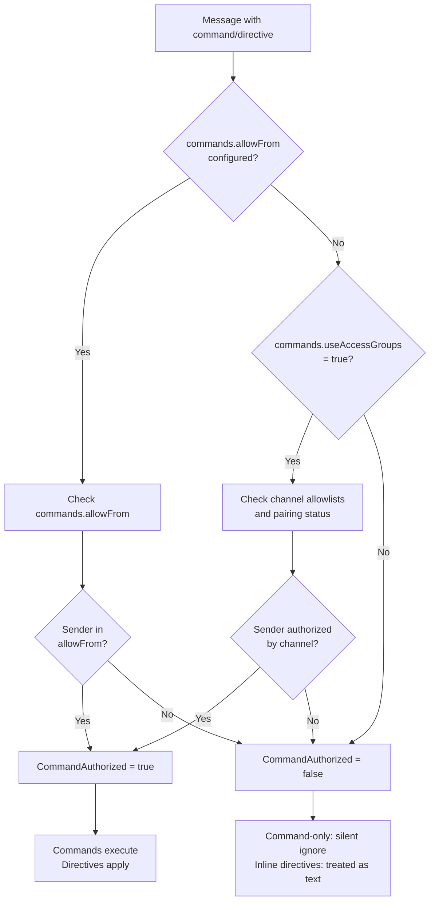
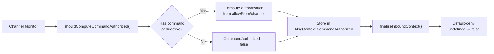
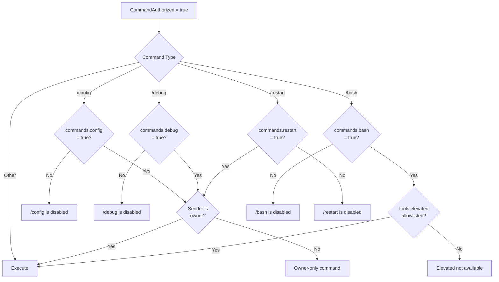
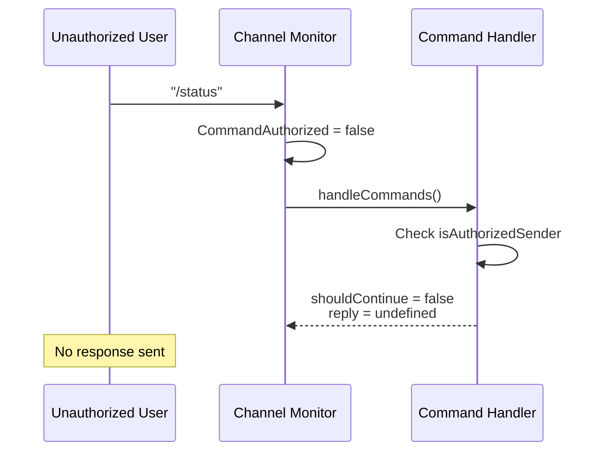
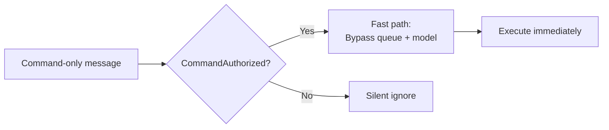

# Page: Command Authorization

# コマンド認可

<details>
<summary>関連ソースファイル</summary>

この Wiki ページの生成に使用されたコンテキストファイル:

- [docs/tools/slash-commands.md](docs/tools/slash-commands.md)
- [src/auto-reply/command-detection.ts](src/auto-reply/command-detection.ts)
- [src/auto-reply/commands-args.ts](src/auto-reply/commands-args.ts)
- [src/auto-reply/commands-registry.data.ts](src/auto-reply/commands-registry.data.ts)
- [src/auto-reply/commands-registry.test.ts](src/auto-reply/commands-registry.test.ts)
- [src/auto-reply/commands-registry.ts](src/auto-reply/commands-registry.ts)
- [src/auto-reply/commands-registry.types.ts](src/auto-reply/commands-registry.types.ts)
- [src/auto-reply/group-activation.ts](src/auto-reply/group-activation.ts)
- [src/auto-reply/reply.ts](src/auto-reply/reply.ts)
- [src/auto-reply/reply/commands-core.ts](src/auto-reply/reply/commands-core.ts)
- [src/auto-reply/reply/commands-status.ts](src/auto-reply/reply/commands-status.ts)
- [src/auto-reply/reply/commands-subagents.ts](src/auto-reply/reply/commands-subagents.ts)
- [src/auto-reply/reply/commands.test.ts](src/auto-reply/reply/commands.test.ts)
- [src/auto-reply/reply/commands.ts](src/auto-reply/reply/commands.ts)
- [src/auto-reply/reply/directive-handling.ts](src/auto-reply/reply/directive-handling.ts)
- [src/auto-reply/reply/subagents-utils.test.ts](src/auto-reply/reply/subagents-utils.test.ts)
- [src/auto-reply/reply/subagents-utils.ts](src/auto-reply/reply/subagents-utils.ts)
- [src/auto-reply/send-policy.ts](src/auto-reply/send-policy.ts)
- [src/auto-reply/status.test.ts](src/auto-reply/status.test.ts)
- [src/auto-reply/status.ts](src/auto-reply/status.ts)
- [src/auto-reply/templating.ts](src/auto-reply/templating.ts)

</details>


**目的**: コマンド認可は、どの送信者がスラッシュコマンドとインラインディレクティブを実行できるかを制御します。このゲーティングメカニズムは、未認証ユーザーによる制御コマンドの発行、セッション設定の変更、機密操作へのアクセスを防ぎます。認可はメッセージごとに計算され、`CommandAuthorized` コンテキストフィールドに保存されます。

コマンド構文と利用可能なコマンドについては、[Command Reference](#9.1) を参照してください。プラットフォーム固有のコマンドサーフェスについては、[Platform-Specific Commands](#9.3) を参照してください。

---

## 認可ソース

コマンド認可は複数のソースから解決され、設定されている場合 `commands.allowFrom` が優先されます。

### 優先チェーン



**Sources**: [docs/tools/slash-commands.md:21-23](), [docs/tools/slash-commands.md:63-66]()

### 設定オプション

| オプション | 型 | デフォルト | 説明 |
|--------|------|---------|-------------|
| `commands.allowFrom` | `Record<string, string[]>` | `undefined` | プロバイダーごとの許可リスト。設定すると、排他的な認可ソースになります。グローバルデフォルトには `"*"` を使用。 |
| `commands.useAccessGroups` | `boolean` | `true` | `commands.allowFrom` が設定されていない場合、チャネル許可リストとペアリングを強制。 |

**Sources**: [docs/tools/slash-commands.md:63-66]()

---

## 認可フロー

### コンテキストフィールド: `CommandAuthorized`

`CommandAuthorized` フィールドは、メッセージにコマンドトークンまたはディレクティブが含まれている場合、チャネルモニターによって計算されます。



**実装**: [src/auto-reply/command-detection.ts:82-88]()

**主要関数**:
- `shouldComputeCommandAuthorized()`: メッセージ内容に基づいて認可を計算するべきかどうかを判断
- `isControlCommandMessage()`: コマンドのみのメッセージを検出
- `hasInlineCommandTokens()`: インラインディレクティブ/ショートカットを検出（例: "hey /status"）

**Sources**: [src/auto-reply/command-detection.ts:82-88](), [src/auto-reply/command-detection.ts:67-80](), [src/auto-reply/templating.ts:143-149]()

### コマンドコンテキスト: `isAuthorizedSender`

コマンドハンドラーは `command.isAuthorizedSender` をチェックして実行をゲートします。

```typescript
// /status ハンドラーからの例
if (!command.isAuthorizedSender) {
  logVerbose(`Ignoring /status from unauthorized sender: ${command.senderId || "<unknown>"}`);
  return undefined;
}
```

**Sources**: [src/auto-reply/reply/commands-status.ts:138-141](), [src/auto-reply/reply/commands-subagents.ts:176-181]()

---

## 認可決定マトリックス

| シナリオ | `commands.allowFrom` 設定済み? | `commands.useAccessGroups` | チャネル許可リスト | 結果 |
|----------|---------------------------|----------------------------|-------------------|--------|
| 送信者が `allowFrom["*"]` にいる | ✅ | N/A | N/A | ✅ 認可済み |
| 送信者が `allowFrom["telegram"]` にいる（Telegram 上） | ✅ | N/A | N/A | ✅ 認可済み |
| 送信者が `allowFrom` にいない | ✅ | N/A | N/A | ❌ 拒否 |
| 未設定 | ❌ | `true` | 送信者がペアリング/許可リスト済み | ✅ 認可済み |
| 未設定 | ❌ | `true` | 送信者がペアリング/許可リスト未登録 | ❌ 拒否 |
| 未設定 | ❌ | `false` | N/A | ❌ 拒否 |

**Sources**: [docs/tools/slash-commands.md:63-66]()

---

## コマンド固有の認可ゲート

基本的なコマンド認可以外に、特定のコマンドには追加のゲートが必要な場合があります。

### 有効化フラグ

一部のコマンドはデフォルトで無効になっており、明示的な有効化が必要です:



**Sources**: [src/auto-reply/reply/commands.test.ts:110-130](), [docs/tools/slash-commands.md:61-62](), [docs/tools/slash-commands.md:59]()

### オーナー専用コマンド

以下のコマンドは、送信者がオーナーである必要があります（チャネル固有の所有権ルールによって決定）:

- `/config`: `openclaw.json` の読み取り/書き込み（`commands.config: true` が必要）
- `/debug`: ランタイムオーバーライドの設定（`commands.debug: true` が必要）
- `/restart`: OpenClaw の再起動（`commands.restart: true` が必要）
- `/send`: 送信ポリシーの制御（オーナーのみ）

**Sources**: [docs/tools/slash-commands.md:82](), [docs/tools/slash-commands.md:92]()

### 昇格ツール要件

`/bash` コマンドには以下が必要です:
1. `commands.bash: true` （有効化フラグ）
2. `CommandAuthorized: true` （送信者が認可済み）
3. `tools.elevated` 許可リスト（送信者が昇格ツールの使用を許可されている）

**Sources**: [src/auto-reply/reply/commands.test.ts:93-108](), [docs/tools/slash-commands.md:59]()

---

## 未認証送信者の動作

### コマンドのみのメッセージ

未認証送信者からのコマンドのみのメッセージはサイレントに無視されます:



**Sources**: [src/auto-reply/reply/commands-status.ts:138-141](), [docs/tools/slash-commands.md:125]()

### インラインディレクティブ

未認証送信者からのインラインディレクティブ（例: `/think`、`/verbose`、`/model`）はプレーンテキストとして扱われ、モデルに渡されます:

```
Unauthorized: "let's /think about this problem"
→ Model sees: "let's /think about this problem"

Authorized: "let's /think about this problem"
→ Model sees: "let's about this problem" (with thinking enabled)
```

**Sources**: [docs/tools/slash-commands.md:21-23]()

### インラインショートカット

特定のコマンド（`/help`、`/commands`、`/status`、`/whoami`）は認証された送信者に対してはインラインショートカットとして機能しますが、未認証送信者には機能しません:

```
Authorized: "hey /status"
→ Status reply sent immediately
→ Remaining text ("hey") continues through normal flow

Unauthorized: "hey /status"
→ Entire message "hey /status" continues through normal flow
```

**Sources**: [docs/tools/slash-commands.md:122-124]()

---

## 認証済み送信者用の高速パス

認証された送信者からのコマンドのみのメッセージは、キューとモデル推論をバイパスします:



さらに、グループチャットでは、認証された送信者からのコマンドのみのメッセージはメンション要件をバイパスします。

**Sources**: [docs/tools/slash-commands.md:120-121]()

---

## 設定例

### グローバル許可リスト

```json
{
  "commands": {
    "allowFrom": {
      "*": ["user123", "+1234567890"]
    },
    "useAccessGroups": true
  }
}
```

`commands.allowFrom` が設定されている場合、チャネル許可リストやペアリングステータスに関係なく、指定されたユーザーのみがコマンドを実行できます。

### プロバイダーごとの許可リスト

```json
{
  "commands": {
    "allowFrom": {
      "*": ["owner"],
      "telegram": ["user:123456", "user:789012"],
      "discord": ["user:987654321012345678"]
    }
  }
}
```

プロバイダー固有のエントリは、そのプロバイダーのグローバルな `"*"` デフォルトをオーバーライドします。

### チャネル許可リストのみ

```json
{
  "commands": {
    "useAccessGroups": true
  },
  "channels": {
    "whatsapp": {
      "allowFrom": ["+1234567890", "+4477123456"]
    },
    "telegram": {
      "dmPolicy": "pairing"
    }
  }
}
```

`commands.allowFrom` が設定されていない場合、認可はチャネル固有の許可リストとペアリングから取得されます。`useAccessGroups: false` に設定すると、すべてのコマンド認可が拒否されます。

### 機密コマンドの有効化

```json
{
  "commands": {
    "allowFrom": {
      "*": ["owner"]
    },
    "config": true,
    "debug": true,
    "bash": true,
    "restart": true
  },
  "tools": {
    "elevated": {
      "allowFrom": {
        "whatsapp": ["owner"]
      }
    }
  }
}
```

コマンド認可があっても、機密コマンドには明示的な有効化フラグが必要で、追加の要件（オーナーステータス、昇格ツールアクセス）がある場合があります。

**Sources**: [docs/tools/slash-commands.md:28-67]()

---

## まとめ

コマンド認可は複数のゲートを持つデフォルト拒否システムです:

1. **基本認可**: `commands.allowFrom` （排他）またはチャネル許可リスト/ペアリング（`useAccessGroups: true` の場合）
2. **コマンド有効化**: 機密コマンドの機能フラグ（`config`、`debug`、`bash`、`restart`）
3. **オーナーチェック**: オーナー専用コマンドは送信者がオーナーである必要がある
4. **ツール要件**: 一部のコマンドは特定のツールアクセスが必要（例: `/bash` には `tools.elevated`）

未認証送信者はサイレントに拒否されるか（コマンドのみのメッセージ）、ディレクティブがプレーンテキストとして扱われます（インラインディレクティブ）。認証された送信者は、コマンドのみのメッセージに対して高速パス実行とグループメンションバイパスの恩恵を受けます。

**Sources**: [docs/tools/slash-commands.md:21-23](), [docs/tools/slash-commands.md:63-66](), [docs/tools/slash-commands.md:120-125](), [src/auto-reply/command-detection.ts:82-88](), [src/auto-reply/templating.ts:143-149]()

---
