# Page: Platform-Specific Commands

# プラットフォーム固有のコマンド

<details>
<summary>関連ソースファイル</summary>

この Wiki ページの生成に使用されたコンテキストファイル:

- [docs/tools/slash-commands.md](docs/tools/slash-commands.md)
- [src/auto-reply/command-detection.ts](src/auto-reply/command-detection.ts)
- [src/auto-reply/commands-args.ts](src/auto-reply/commands-args.ts)
- [src/auto-reply/commands-registry.data.ts](src/auto-reply/commands-registry.data.ts)
- [src/auto-reply/commands-registry.test.ts](src/auto-reply/commands-registry.test.ts)
- [src/auto-reply/commands-registry.ts](src/auto-reply/commands-registry.ts)
- [src/auto-reply/commands-registry.types.ts](src/auto-reply/commands-registry.types.ts)
- [src/auto-reply/group-activation.ts](src/auto-reply/group-activation.ts)
- [src/auto-reply/reply.ts](src/auto-reply/reply.ts)
- [src/auto-reply/reply/commands-core.ts](src/auto-reply/reply/commands-core.ts)
- [src/auto-reply/reply/commands-status.ts](src/auto-reply/reply/commands-status.ts)
- [src/auto-reply/reply/commands-subagents.ts](src/auto-reply/reply/commands-subagents.ts)
- [src/auto-reply/reply/commands.test.ts](src/auto-reply/reply/commands.test.ts)
- [src/auto-reply/reply/commands.ts](src/auto-reply/reply/commands.ts)
- [src/auto-reply/reply/directive-handling.ts](src/auto-reply/reply/directive-handling.ts)
- [src/auto-reply/reply/subagents-utils.test.ts](src/auto-reply/reply/subagents-utils.test.ts)
- [src/auto-reply/reply/subagents-utils.ts](src/auto-reply/reply/subagents-utils.ts)
- [src/auto-reply/send-policy.ts](src/auto-reply/send-policy.ts)
- [src/auto-reply/status.test.ts](src/auto-reply/status.test.ts)
- [src/auto-reply/status.ts](src/auto-reply/status.ts)
- [src/auto-reply/templating.ts](src/auto-reply/templating.ts)
- [src/discord/monitor.ts](src/discord/monitor.ts)
- [src/imessage/monitor.ts](src/imessage/monitor.ts)
- [src/signal/monitor.ts](src/signal/monitor.ts)
- [src/slack/monitor.ts](src/slack/monitor.ts)
- [src/telegram/bot.test.ts](src/telegram/bot.test.ts)
- [src/telegram/bot.ts](src/telegram/bot.ts)
- [src/web/auto-reply.ts](src/web/auto-reply.ts)
- [src/web/inbound.media.test.ts](src/web/inbound.media.test.ts)
- [src/web/inbound.test.ts](src/web/inbound.test.ts)
- [src/web/inbound.ts](src/web/inbound.ts)
- [src/web/test-helpers.ts](src/web/test-helpers.ts)
- [src/web/vcard.ts](src/web/vcard.ts)

</details>


このページでは、OpenClaw がネイティブスラッシュコマンドをサポートするプラットフォーム（Discord、Telegram、Slack）でどのように実装しているかを説明します。ネイティブコマンドは、オートコンプリート、引数メニュー、プラットフォーム固有の UI コンポーネントを通じて拡張されたユーザー体験を提供します。

テキストコマンド解析とディレクティブ（インライン `/think`、`/model` など）については、[Directives](#9.3) を参照してください。利用可能なコマンドの完全なリストについては、[Command Reference](#9.1) を参照してください。

---

## コマンドレジストリアーキテクチャ

OpenClaw は統一されたコマンドレジストリを使用し、コマンドを一度定義してプラットフォーム固有の形式に適応させます。コマンドはスコープで分類されます: `text`（テキスト解析のみ）、`native`（プラットフォームネイティブのみ）、または `both`。

### コマンド定義構造

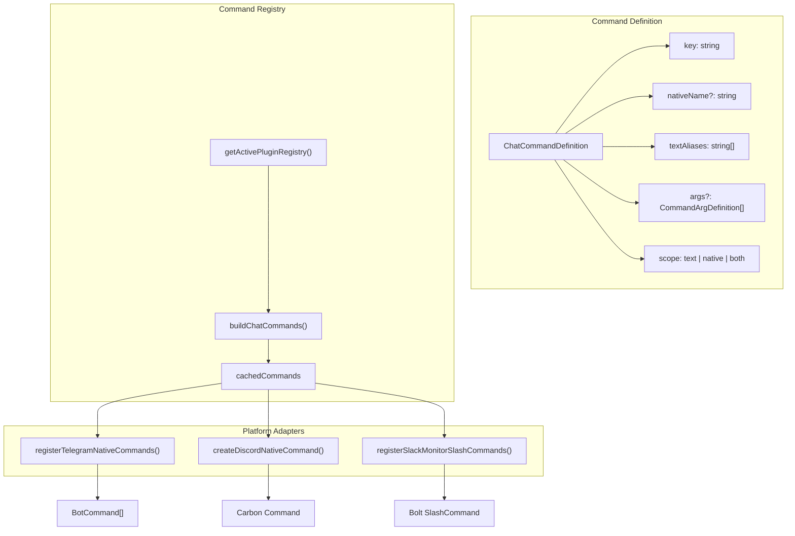

**Sources**: [src/auto-reply/commands-registry.ts:71-149](), [src/auto-reply/commands-registry.data.ts:26-46]()

### コマンド解決フロー

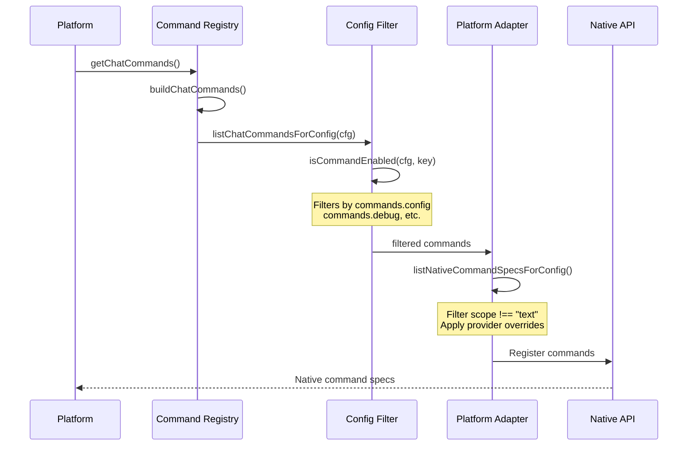

**Sources**: [src/auto-reply/commands-registry.ts:92-149](), [src/auto-reply/commands-registry.data.ts:122-149]()

---

## Telegram ネイティブコマンド

Telegram コマンドは Bot API の `setMyCommands` エンドポイントを介して登録されます。実装はレート制限と順序付きメッセージ処理のために grammY のスロットラーとシーケンシャライゼーションを使用します。

### 登録プロセス

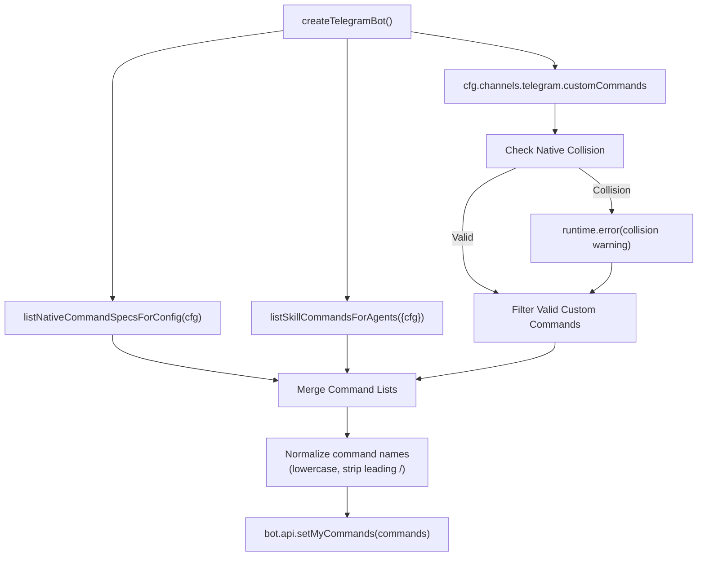

**Sources**: [src/telegram/bot-native-commands.ts:22-119](), [src/telegram/bot.test.ts:217-288]()

Telegram コマンドはボット起動時に設定されます:

1. **ネイティブコマンド** - `listNativeCommandSpecsForConfig()` が有効なビルトインコマンドをすべて取得
2. **スキルコマンド** - `listSkillCommandsForAgents()` がユーザー呼び出し可能スキルのコマンドを生成
3. **カスタムコマンド** - `channels.telegram.customCommands` で追加コマンドを許可
4. **コリジョン検出** - ネイティブコマンドと衝突するカスタムコマンドはフィルタリングされ、エラーとしてログに記録
5. **正規化** - コマンド名を正規化: 小文字化、先頭の `/` を削除
6. **登録** - 最終コマンドリストを `bot.api.setMyCommands()` 経由で Telegram に送信

**カスタムコマンド検証**:
- コマンドは先頭の `/` を削除して小文字に正規化: `/Custom_Backup` → `custom_backup`
- 予約されたネイティブコマンド名との衝突は `runtime.error()` をトリガーし、無視される
- 衝突しないカスタムコマンドはネイティブコマンドリストに追加される

### コマンド処理

Telegram ネイティブコマンドは `bot.command()` ハンドラーをトリガーし、統一されたコマンドプロセッサーにルーティングされます:

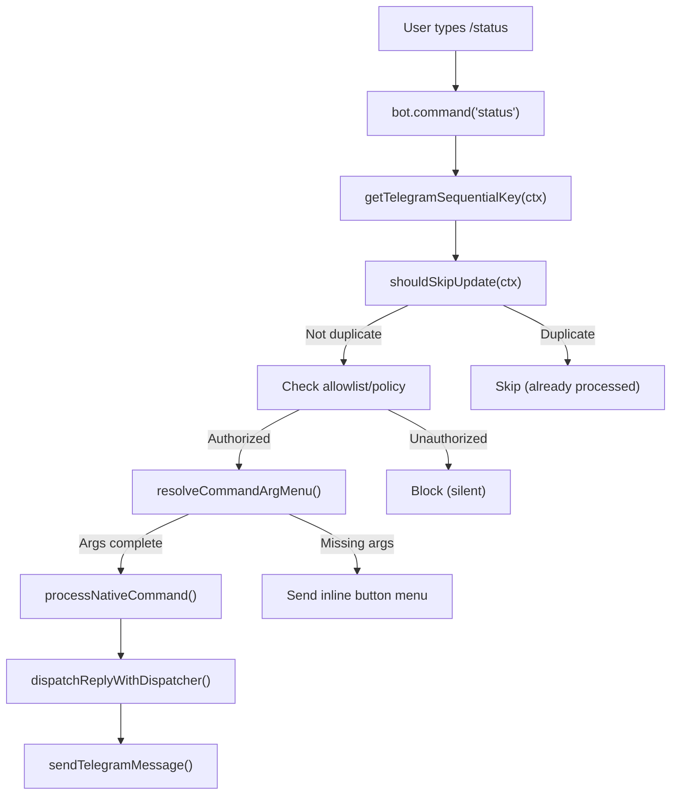

**主要な実装詳細**:

| 機能 | 実装 | コード参照 |
|---------|---------------|----------------|
| **シーケンシャル処理** | `sequentialize(getTelegramSequentialKey)` は同じチャットからのメッセージが順番に処理されることを保証 | [src/telegram/bot.ts:148]() |
| **シーケンシャルキーパターン** | DM の場合は `telegram:{chatId}`、フォーラムトピックの場合は `telegram:{chatId}:topic:{threadId}` | [src/telegram/bot.ts:67-110]() |
| **重複排除** | `createTelegramUpdateDedupe()` は `updateId` トラッキングで重複更新処理を防止 | [src/telegram/bot.ts:154-183]() |
| **引数解析** | 引数のあるコマンドは、引数が不足している場合にインラインボタンメニューを使用 | [src/telegram/bot-native-commands.ts:154-298]() |
| **コールバッククエリ** | ボタンクリックは `bot.on("callback_query")` ハンドラーをトリガーし、コマンド実行に再ルーティング | [src/telegram/bot.ts:364-476]() |

**特殊なコールバックハンドラー**:
- **ページネーションコールバック**: 多くのコマンドを持つ `/commands` は `commands_page_{N}` コールバックデータでページネーションリストを表示
- **引数メニューコールバック**: コールバック形式 `{commandKey}:{argValue}` の汎用引数選択ボタン

**Sources**: [src/telegram/bot.ts:67-110](), [src/telegram/bot.ts:148-224](), [src/telegram/bot-native-commands.ts:1-298]()

### 引数メニュー

コマンドが引数を必要とし、何も提供されない場合、Telegram はインラインボタンメニューを表示します:

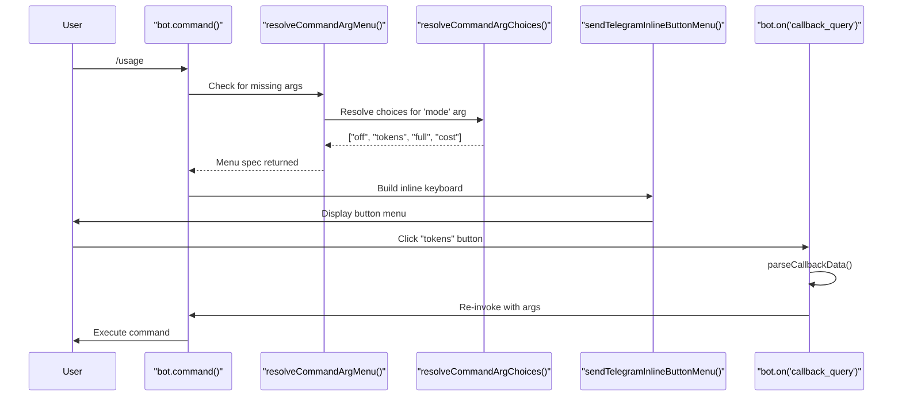

**例**: 引数なしの `/usage` コマンドはボタンを表示: `off | tokens | full | cost`

**ボタンレイアウト**:
- 1行あたり最大3ボタン（設定可能）
- コールバックデータ形式: `{commandKey}:{argValue}` （例: `usage:tokens`）
- ボタンクリックは `callback_query` イベントをトリガーし、コマンドハンドラーを通じて再ルーティング

**Sources**: [src/telegram/bot-native-commands.ts:154-298](), [src/telegram/send.ts:320-402]()

---

## Discord ネイティブコマンド

Discord コマンドは `@buape/carbon` ライブラリを使用し、Discord のスラッシュコマンド API のより高レベルな抽象化を提供します。コマンドはオートコンプリート、選択リスト、ボタンインタラクションをサポートします。

### コマンド登録

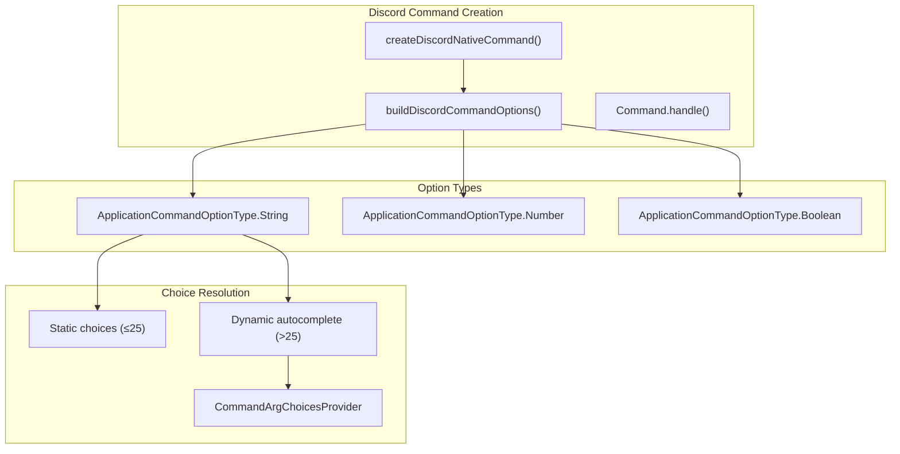

**Sources**: [src/discord/monitor/native-command.ts:60-118]()

Discord コマンドは Carbon `Command` インスタンスとして作成されます:

```typescript
// src/discord/monitor/native-command.ts からの簡略化された構造
class DiscordNativeCommand extends Command {
  name = command.nativeName;
  description = command.description;
  options = buildDiscordCommandOptions({ command, cfg });

  async run(interaction: CommandInteraction) {
    // アクセス制御チェック
    // 引数解析
    // コマンドディスパッチ
  }
}
```

### 引数オートコンプリート

大きな選択リスト（>25項目）を持つコマンドの場合、Discord はオートコンプリートを提供します:

**オートコンプリートフロー**:

1. ユーザーがコマンドを入力 → Discord がオートコンプリートを表示
2. ユーザーが部分一致を入力 → `AutocompleteInteraction` が発火
3. コンテキストで `resolveCommandArgChoices()` が呼び出される
4. フィルタリングされた選択肢が返される（最大25）

**例**: `/model` コマンドは利用可能なモデルのオートコンプリートを提供し、ユーザー入力でフィルタリングされます。

**Sources**: [src/discord/monitor/native-command.ts:86-102]()

### 引数メニュー用のボタンインタラクション

コマンドが引数メニューをサポートし、引数が提供されない場合、Discord は一時的なボタンメニューを表示します:

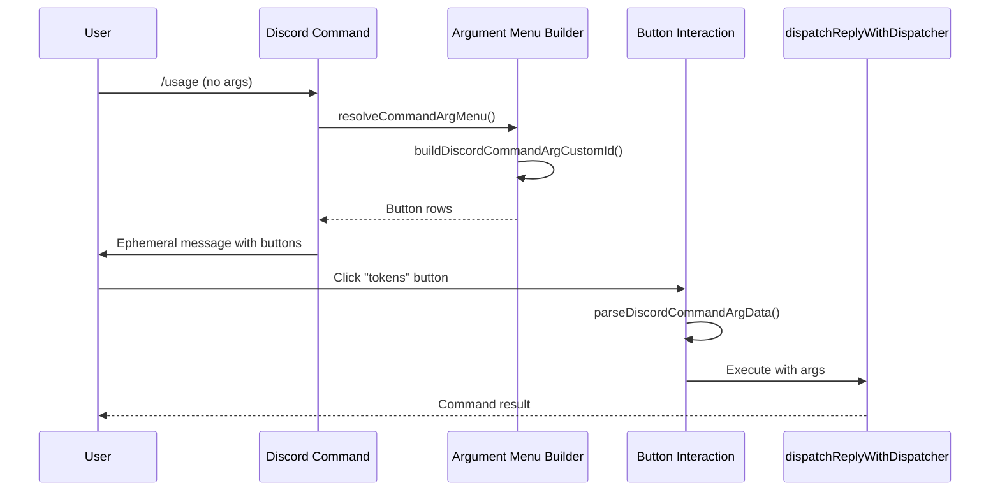

**ボタンカスタム ID 形式**: `cmdarg:command={cmd};arg={name};value={val};user={id}`

**Sources**: [src/discord/monitor/native-command.ts:199-230](), [src/discord/monitor/native-command.ts:450-550]()

### プロバイダー固有の名前オーバーライド

Discord は特定のコマンド名を予約しています。OpenClaw は `NATIVE_NAME_OVERRIDES` でオーバーライドを適用します:

| コマンドキー | デフォルト名 | Discord オーバーライド |
|-------------|--------------|------------------|
| `tts` | `/tts` | `/voice` |

**実装**: [src/auto-reply/commands-registry.ts:108-121]()

---

## Slack スラッシュコマンド

Slack は2つのモードをサポートしています: **レガシー単一コマンド**（`/openclaw`）と **ネイティブコマンドごと**のスラッシュコマンド。ネイティブモードでは、Slack アプリ設定で各コマンドを手動で作成する必要があります。

### 設定モード

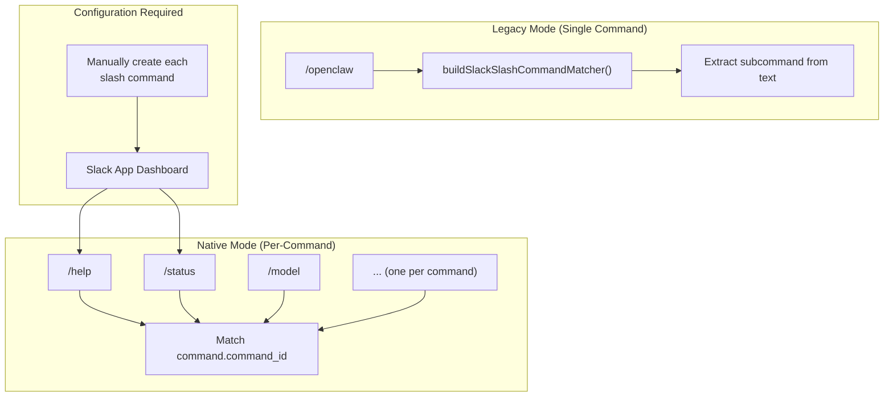

**設定**:

- **レガシー**: `channels.slack.slashCommand.command = "/openclaw"` （デフォルト）
- **ネイティブ**: `commands.native = true` または `channels.slack.commands.native = true`
  - **重要**: ネイティブモードでは Slack アプリダッシュボードで各コマンドを作成する必要があります
  - Slack はプログラムによるコマンド登録の API を提供していません

**コマンドマッチング**:
- **レガシー**: `buildSlackSlashCommandMatcher()` を使用してテキストからサブコマンドを解析（例: `/openclaw status` → `status` コマンド）
- **ネイティブ**: `command.command_id` をコマンド名に直接マッチング

**Sources**: [src/slack/monitor/slash.ts:132-180](), [src/slack/monitor/commands.ts:1-48](), [docs/tools/slash-commands.md:52-56]()

### 引数メニュー実装

Slack は引数選択に Block Kit ボタンを使用します:

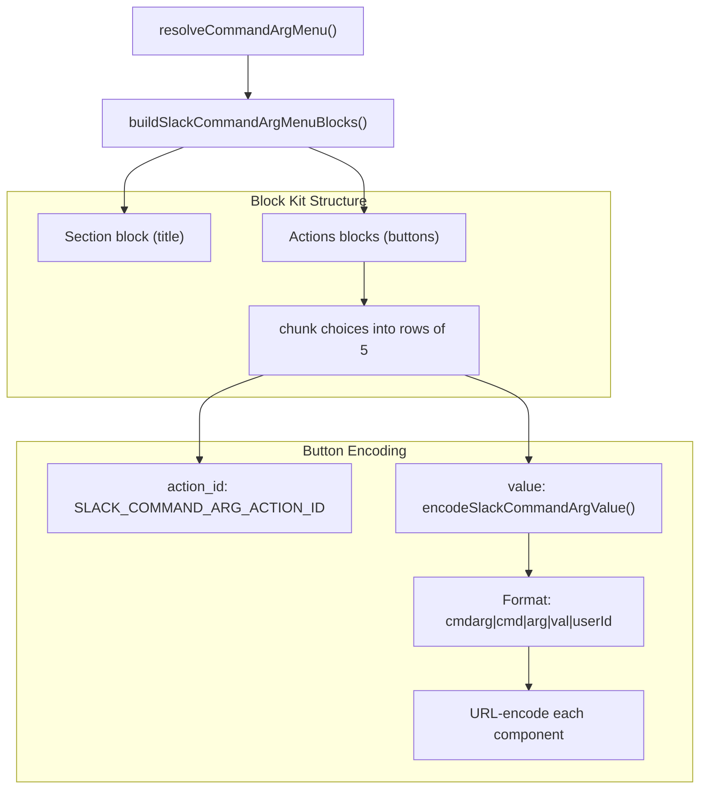

**実装詳細**:

```typescript
// src/slack/monitor/slash.ts:46-92 から
const SLACK_COMMAND_ARG_ACTION_ID = "openclaw_command_arg_select";

function encodeSlackCommandArgValue(params: {
  command: string;
  arg: string;
  value: string;
  userId: string;
}): string {
  const components = [
    "cmdarg",
    encodeURIComponent(params.command),
    encodeURIComponent(params.arg),
    encodeURIComponent(params.value),
    encodeURIComponent(params.userId),
  ];
  return components.join("|");
}
```

**ボタンレイアウト**:
- アクションブロックあたり最大5ボタン（Slack Block Kit の制限）
- `chunkItems(choices, 5)` を使用してボタンを行にチャンク
- 各ボタンの `value` はコールバックルーティング用のコマンドコンテキストをエンコード

**コールバック時のデコード**:
- ボタンクリックで `block_actions` イベントがトリガー
- `action_id` を `SLACK_COMMAND_ARG_ACTION_ID` にマッチング
- `parseSlackCommandArgData()` を使用して `value` をデコード
- 選択された引数でコマンドを再実行

**Sources**: [src/slack/monitor/slash.ts:46-130](), [src/slack/monitor/slash.ts:279-383]()

### スラッシュコマンドハンドラーフロー

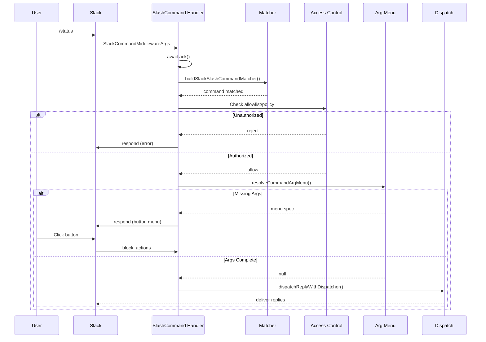

**Sources**: [src/slack/monitor/slash.ts:147-400]()

---

## コマンド引数システム

すべてのプラットフォームはコマンドレジストリを通じて共通の引数定義と解決システムを共有しています。

### 引数定義構造

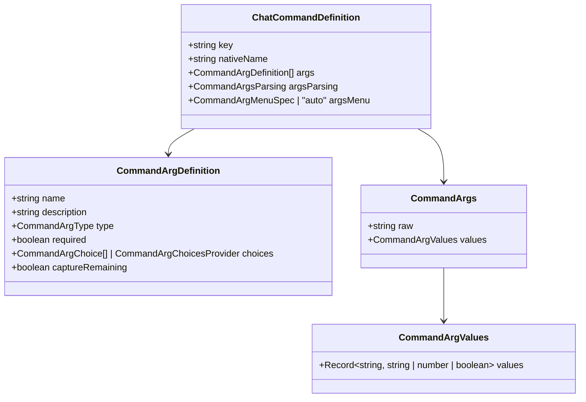

**コア型**:

| 型 | 値 | 目的 |
|------|--------|---------|
| `CommandArgType` | `"string"` \| `"number"` \| `"boolean"` | 引数データ型 |
| `CommandArgsParsing` | `"none"` \| `"positional"` | 解析戦略 |
| `CommandArgMenuSpec` | `{ arg: string; title?: string }` \| `"auto"` | メニュー設定 |

**Sources**: [src/auto-reply/commands-registry.types.ts:1-82]()

### 引数解析モード

| モード | 説明 | 実装 | 例 |
|------|-------------|----------------|---------|
| `none` | 構造化解析なし、`args.raw` のみ | `parseCommandArgs()` が `{ raw }` を返す | `/compact [instructions]` |
| `positional` | 位置で引数を解析 | `parsePositionalArgs()` は空白で分割 | `/debug set tools.bash=true` |

**解析パイプライン**:

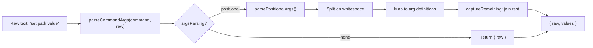

**主要関数**:

- **`parseCommandArgs()`** - エントリーポイント: [src/auto-reply/commands-registry.ts:235-250]()
- **`parsePositionalArgs()`** - 位置パーサー: [src/auto-reply/commands-registry.ts:185-206]()
- **`serializeCommandArgs()`** - 逆変換: [src/auto-reply/commands-registry.ts:252-270]()
- **`resolveCommandArgChoices()`** - 静的または動的選択肢を解決: [src/auto-reply/commands-registry.ts:297-325]()
- **`resolveCommandArgMenu()`** - 引数メニューを表示するかどうかを判断: [src/auto-reply/commands-registry.ts:327-363]()

**Sources**: [src/auto-reply/commands-registry.ts:185-363]()

### 動的選択肢プロバイダー

コマンドはコンテキストに基づいて動的な選択肢を提供できます:

```typescript
// commands-registry.data.ts からの例
{
  name: "level",
  type: "string",
  choices: ({ provider, model }) => {
    return listThinkingLevels({ provider, model });
  }
}
```

**選択肢解決コンテキスト**:

- `cfg` - 現在の OpenClawConfig
- `provider` - 現在のモデルプロバイダー
- `model` - 現在のモデル
- `command` - コマンド定義
- `arg` - 引数定義

**Sources**: [src/auto-reply/commands-registry.ts:259-286](), [src/auto-reply/commands-registry.data.ts:1-300]()

---

## プラットフォーム機能比較

| 機能 | Discord | Telegram | Slack |
|---------|---------|----------|-------|
| **ネイティブ登録** | Automatic (Carbon) | `bot.api.setMyCommands()` | Manual Slack App config |
| **登録タイミング** | On client ready | On bot startup | Pre-configured (manual) |
| **オートコンプリート** | Yes (>25 choices) | No | No |
| **引数メニュー** | Ephemeral buttons | Inline buttons | Block Kit buttons |
| **メニューボタンレイアウト** | Up to 5 columns | Up to 3 per row | Up to 5 per row |
| **マルチエージェントサポート** | Session per user | Targets chat session | Session per user |
| **カスタムコマンド** | Via Carbon Command class | Via `customCommands` config | Via Slack App |
| **選択肢制限** | 25 per autocomplete | Unlimited inline buttons | 25 per action block |
| **コマンドスコープ** | Guild/Global | Bot-wide | Workspace-wide |
| **ページネーションサポート** | No | Yes (via callback_query) | No |
| **セッションキーパターン** | `discord:slash:{userId}` | `CommandTargetSessionKey` | `slack:slash:{userId}` |

**実装参照**:

| プラットフォーム | 登録コード | ハンドラーコード |
|----------|------------------|--------------|
| Discord | [src/discord/monitor/native-command.ts:60-118]() | [src/discord/monitor/native-command.ts:199-450]() |
| Telegram | [src/telegram/bot-native-commands.ts:22-119]() | [src/telegram/bot-native-commands.ts:154-298]() |
| Slack | Manual (Slack App UI) | [src/slack/monitor/slash.ts:147-400]() |

**Sources**: [src/discord/monitor/native-command.ts:60-450](), [src/telegram/bot-native-commands.ts:22-298](), [src/slack/monitor/slash.ts:147-400]()

---

## 設定リファレンス

### ネイティブコマンドの有効化

```json5
{
  commands: {
    // Global setting
    native: "auto",  // "auto" | true | false

    // Per-provider overrides
  },
  channels: {
    discord: {
      commands: {
        native: true,        // Override global
        nativeSkills: true   // Register skill commands
      }
    },
    telegram: {
      commands: {
        native: "auto"
      },
      customCommands: [
        { command: "backup", description: "Backup data" }
      ]
    },
    slack: {
      commands: {
        native: false  // Use legacy /openclaw mode
      },
      slashCommand: {
        command: "/openclaw",
        sessionPrefix: "slack:slash"
      }
    }
  }
}
```

**Auto の動作**:

- **Discord**: デフォルトでオン
- **Telegram**: デフォルトでオン
- **Slack**: デフォルトでオフ（Slack アプリの手動設定が必要）

**Sources**: [docs/tools/slash-commands.md:26-51](), [src/config/commands.ts:1-100]()

### ネイティブスキルコマンド

`user-invocable: true` で宣言されたスキルはネイティブコマンドとして自動的に登録されます:

```json5
{
  commands: {
    nativeSkills: "auto"  // "auto" | true | false
  }
}
```

**スキルコマンド生成**:

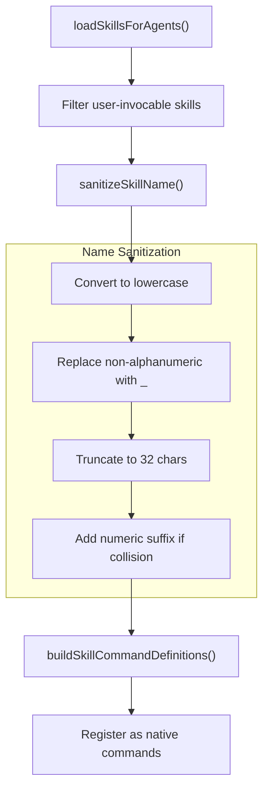

**スキルコマンド命名**:

1. **サニタイゼーション**: スキル名を `[a-z0-9_]` に変換（最大32文字）
2. **コリジョンハンドリング**: 数値サフィックスを追加: `skill_name`, `skill_name_2`, `skill_name_3` など
3. **コマンドルーティング**:
   - デフォルト: 通常のリクエストとしてモデルに転送
   - `command-dispatch: tool`: スキルツールに直接ルーティング（モデルなし）

**例**: スキル `my-skill-name` → コマンド `/my_skill_name`

**Sources**: [docs/tools/slash-commands.md:52-59](), [src/auto-reply/skill-commands.ts:1-137](), [src/auto-reply/commands-registry.ts:72-84]()

---

## 実装ノート

### プラットフォーム別セッションキー

ネイティブコマンドはテキストチャットセッションとの競合を避けるために分離されたセッションキーを使用します:

| プラットフォーム | セッションキーパターン | 目的 |
|----------|---------------------|---------|
| Discord | `agent:{agentId}:discord:slash:{userId}` | ユーザーごとのスラッシュコマンドセッション |
| Telegram | `telegram:slash:{userId}` + CommandTargetSessionKey | チャットセッションにルーティング |
| Slack | `agent:{agentId}:slack:slash:{userId}` | ユーザーごとのスラッシュコマンドセッション |

**例外**: `/stop` コマンドは現在の実行を中止するためにアクティブなチャットセッションをターゲットにします。

**Sources**: [docs/tools/slash-commands.md:183-190]()

### アクセス制御

ネイティブコマンドはテキストコマンドと同じアクセス制御を尊重します:

1. **許可リスト/ポリシーチェック** - `resolveCommandAuthorizedFromAuthorizers()`
2. **グループポリシー** - `isDiscordGroupAllowedByPolicy()`, `isSlackChannelAllowedByPolicy()`
3. **DM ポリシー** - `dmPolicy: "pairing" | "allowlist" | "open" | "disabled"`

未認証のコマンド呼び出しはサイレントに無視されます。

**Sources**: [src/discord/monitor/native-command.ts:200-250](), [src/slack/monitor/slash.ts:200-300](), [src/telegram/bot-native-commands.ts:50-150]()

### エラー処理

**Discord**: 不明なインタラクションエラー（10062）はキャッチされ、警告としてログに記録されます（インタラクションが期限切れ）。

**Telegram**: レート制限は `apiThrottler()` ミドルウェアで処理されます。

**Slack**: 早期の `await ack()` で ack タイムアウト処理。

**Sources**: [src/discord/monitor/native-command.ts:170-197](), [src/telegram/bot.ts:142-147](), [src/slack/monitor/slash.ts:155-160]()

---
