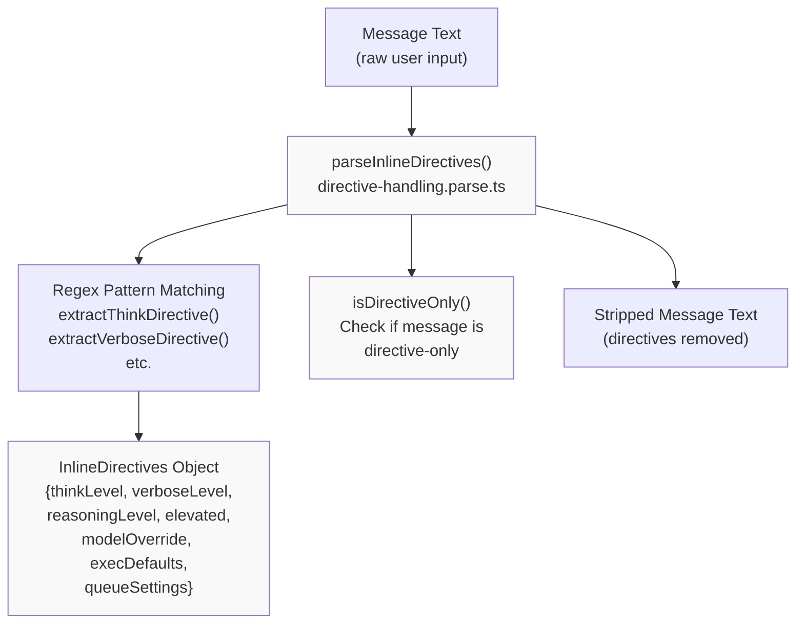
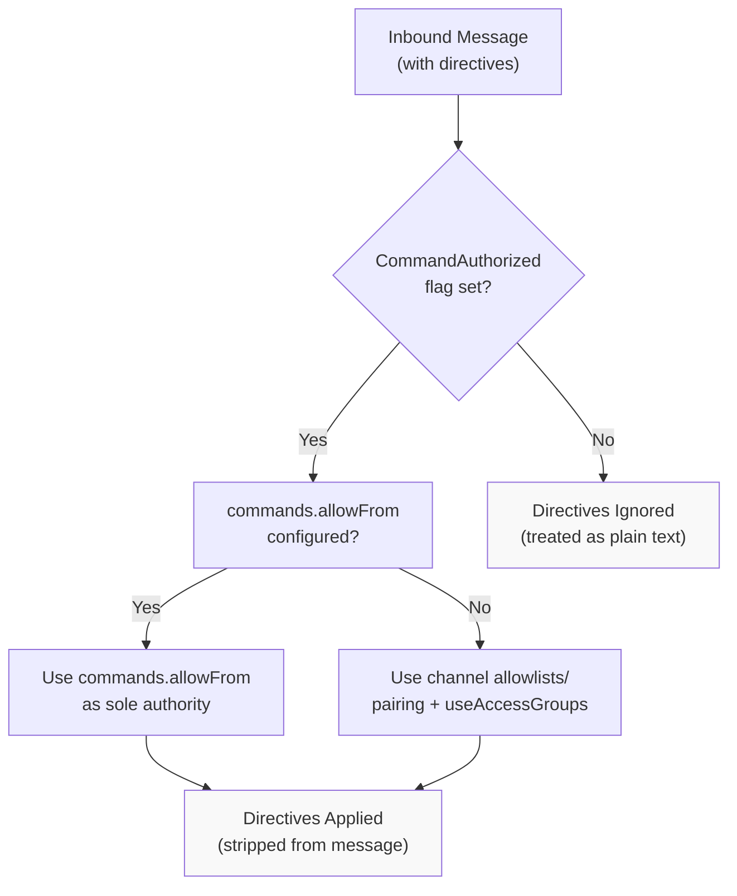
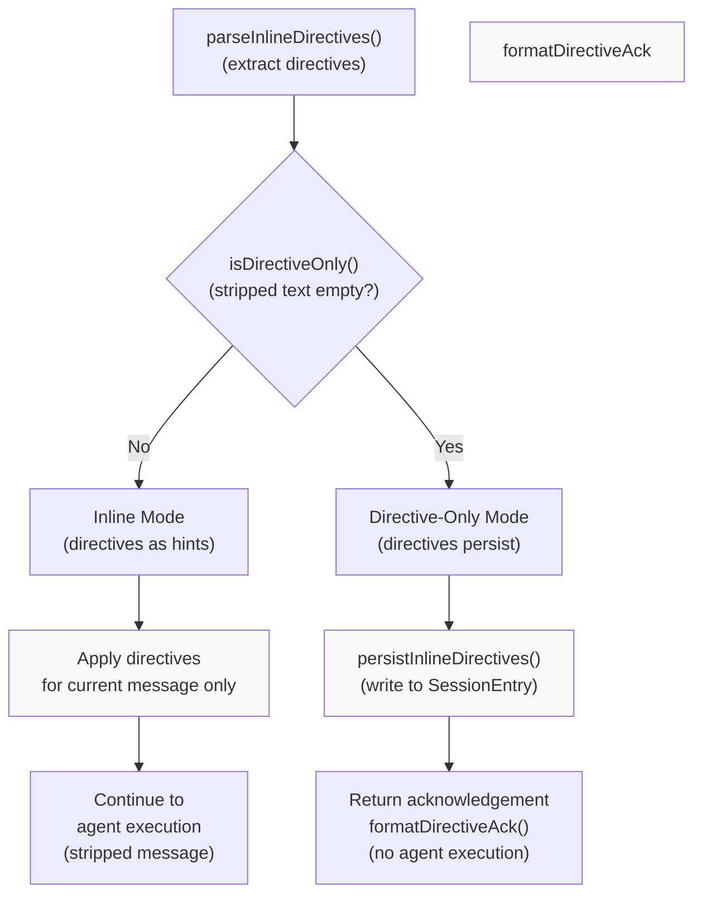
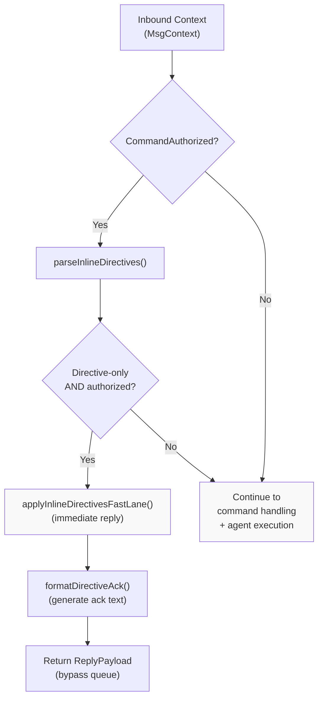

# Page: Directives

# ディレクティブ

<details>
<summary>関連ソースファイル</summary>

この Wiki ページの生成に使用されたコンテキストファイル:

- [docs/tools/slash-commands.md](docs/tools/slash-commands.md)
- [src/auto-reply/command-detection.ts](src/auto-reply/command-detection.ts)
- [src/auto-reply/commands-args.ts](src/auto-reply/commands-args.ts)
- [src/auto-reply/commands-registry.data.ts](src/auto-reply/commands-registry.data.ts)
- [src/auto-reply/commands-registry.test.ts](src/auto-reply/commands-registry.test.ts)
- [src/auto-reply/commands-registry.ts](src/auto-reply/commands-registry.ts)
- [src/auto-reply/commands-registry.types.ts](src/auto-reply/commands-registry.types.ts)
- [src/auto-reply/group-activation.ts](src/auto-reply/group-activation.ts)
- [src/auto-reply/reply.ts](src/auto-reply/reply.ts)
- [src/auto-reply/reply/commands-core.ts](src/auto-reply/reply/commands-core.ts)
- [src/auto-reply/reply/commands-status.ts](src/auto-reply/reply/commands-status.ts)
- [src/auto-reply/reply/commands-subagents.ts](src/auto-reply/reply/commands-subagents.ts)
- [src/auto-reply/reply/commands.test.ts](src/auto-reply/reply/commands.test.ts)
- [src/auto-reply/reply/commands.ts](src/auto-reply/reply/commands.ts)
- [src/auto-reply/reply/directive-handling.ts](src/auto-reply/reply/directive-handling.ts)
- [src/auto-reply/reply/subagents-utils.test.ts](src/auto-reply/reply/subagents-utils.test.ts)
- [src/auto-reply/reply/subagents-utils.ts](src/auto-reply/reply/subagents-utils.ts)
- [src/auto-reply/send-policy.ts](src/auto-reply/send-policy.ts)
- [src/auto-reply/status.test.ts](src/auto-reply/status.test.ts)
- [src/auto-reply/status.ts](src/auto-reply/status.ts)
- [src/auto-reply/templating.ts](src/auto-reply/templating.ts)

</details>


## 目的とスコープ

ディレクティブは、ユーザーメッセージに埋め込まれたインラインヒントで、モデルに見えることなくエージェントの動作を制御します。コロンプレフィックス構文（`:think`、`:verbose`、`:reasoning` など）を使用し、コンテキストに応じて単一のメッセージに一時的に適用されるか、セッションに永続化されます。このページでは、ディレクティブの構文、解析、認可、永続化、エージェント実行との統合について説明します。

スタンドアロン制御コマンド（`/status`、`/reset`、`/config` など）については、[Command Reference](#9.1) を参照してください。コマンド認可ポリシーについては、[Command Authorization](#9.2) を参照してください。

---

## ディレクティブタイプと構文

OpenClaw は7つのディレクティブタイプをサポートし、それぞれがエージェント実行の特定の側面を制御します:

| ディレクティブ | 構文 | 効果 | セッションフィールド |
|-----------|--------|--------|---------------|
| `:think` | `:think <level>` | 思考/拡張思考レベルを設定 | `thinkingLevel` |
| `:verbose` | `:verbose` または `:verbose on\|off\|full` | 詳細ツール出力を制御 | `verboseLevel` |
| `:reasoning` | `:reasoning` または `:reasoning on\|off\|stream` | 推論可視性を制御 | `reasoningLevel` |
| `:elevated` | `:elevated` または `:elevated on\|off\|ask\|full` | 昇格ツールアクセスを制御 | `elevatedLevel` |
| `:model` | `:model <name>` | モデル選択をオーバーライド | `modelOverride`, `providerOverride` |
| `:exec` | `:exec host=<...> security=<...> ask=<...>` | exec ツールデフォルトを設定 | `execDefaults` |
| `:queue` | `:queue <mode> [options]` | キュー動作を調整 | `queueDebounceMs`, `queueCap`, `queueDrop` |

ディレクティブは大文字小文字を区別せず、メッセージテキストのどこにでも配置できます。複数のディレクティブを1つのメッセージで組み合わせることができます。

**Sources**: [docs/tools/slash-commands.md:15-20](), [src/auto-reply/status.ts:6]()

---

## 解析と検出

### 解析パイプライン



**図: ディレクティブ解析フロー**

`parseInlineDirectives()` 関数はメッセージテキストからディレクティブを抽出し、解析されたディレクティブと削除されたメッセージ本文の両方を返します。各ディレクティブタイプには専用の抽出関数があります。

**Sources**: [src/auto-reply/reply/directive-handling.parse.ts](), [src/auto-reply/reply/directives.ts:1-12]()

### 抽出関数

各ディレクティブタイプは正規表現パターンマッチングを使用する特定の関数によって抽出されます:

- `extractThinkDirective()` - `:think <level>` または `:thinking <level>` または `:t <level>` にマッチ
- `extractVerboseDirective()` - `:verbose` (on/off/full) または `:v` にマッチ
- `extractReasoningDirective()` - `:reasoning` (on/off/stream) または `:reason` にマッチ
- `extractElevatedDirective()` - `:elevated` (on/off/ask/full) または `:elev` にマッチ
- `extractExecDirective()` - `:exec host=... security=... ask=...` にマッチ
- `extractQueueDirective()` - `:queue <mode> [options]` にマッチ
- Model ディレクティブ - パターン `/:model\s+([^\s]+)/i` を使用して `parseInlineDirectives()` 内で抽出

**Sources**: [src/auto-reply/reply/directives.ts:1-10]()

### ディレクティブのみの検出

ディレクティブと空白を削除した後、実質的なコンテンツが残っていない場合、メッセージは「ディレクティブのみ」と見なされます:

```typescript
function isDirectiveOnly(text: string, stripped: string): boolean {
  // ディレクティブ削除後、削除されたテキストが空または空白のみの場合
  // メッセージはディレクティブのみと見なされる
}
```

ディレクティブのみのメッセージは特別な処理を受けます:
- ディレクティブはセッションに永続化される
- 確認応答が生成される
- メッセージはエージェント実行に進まない

**Sources**: [src/auto-reply/reply/directive-handling.parse.ts](), [docs/tools/slash-commands.md:17-21]()

---

## 認可とセキュリティ

### 認可要件



**図: ディレクティブ認可フロー**

ディレクティブは認証された送信者に対してのみ処理されます。認可は以下によって決定されます:

1. **`commands.allowFrom`** （設定されている場合）: ディレクティブ認可の唯一の権限として機能。プロバイダー固有のキーは `"*"` デフォルトをオーバーライド。
2. **チャネル許可リスト + `commands.useAccessGroups`** （デフォルト）: チャネル固有の許可リスト（`channels.<provider>.allowFrom`）とペアリングおよびアクセスグループポリシーを組み合わせて使用。

未認証の送信者には、ディレクティブトークンがモデルに送信されるメッセージ本文内のプレーンテキストとして表示されます。

**Sources**: [docs/tools/slash-commands.md:21-23](), [docs/tools/slash-commands.md:63-66]()

### CommandAuthorized の計算

`MsgContext` の `CommandAuthorized` フラグはディレクティブが処理されるかどうかを制御します。チャネルモニターはディレクティブ解析の前にこのフラグを計算する必要があります:

```typescript
// ディレクティブ検出（高速パス、偽陽性の可能性あり）
const hasDirectives = hasInlineCommandTokens(messageBody);
if (hasDirectives) {
  ctx.CommandAuthorized = await checkAuthorization(...);
}
```

`hasInlineCommandTokens()` 関数は、ディレクティブのようなパターンのないメッセージに対する高価な認可チェックを避けるために、正規表現 `/(?:^|\s)[/!][a-z]/i` を使用した大まかな検出を提供します。

**Sources**: [src/auto-reply/command-detection.ts:74-80](), [src/auto-reply/command-detection.ts:82-88]()

---

## 永続化動作

### インライン vs ディレクティブのみのメッセージ



**図: ディレクティブ永続化決定フロー**

**インラインモード（ディレクティブを含む通常のメッセージ）**

メッセージにディレクティブと実質的なコンテンツの両方が含まれている場合、ディレクティブはそのメッセージのみの一時的なヒントとして適用されます。`SessionEntry` には永続化されず、後続のメッセージには影響しません。

例:
```
User: "explain the codebase :verbose :think high"
→ ディレクティブはこのメッセージにのみ適用
→ 次のメッセージはデフォルトのセッション設定を使用
```

**ディレクティブのみのモード（スタンドアロンディレクティブメッセージ）**

メッセージにディレクティブのみが含まれている場合（空白を削除した後）、ディレクティブはセッションに永続化され、確認応答が返されます。メッセージはエージェント実行に進みません。

例:
```
User: ":think high :verbose on"
→ SessionEntry 更新 (thinkingLevel="high", verboseLevel="on")
→ 返信: "⚙️ think high · verbose on"
→ エージェント実行なし
```

**Sources**: [docs/tools/slash-commands.md:17-21](), [src/auto-reply/reply/directive-handling.persist.ts](), [src/auto-reply/reply/directive-handling.shared.ts]()

### 永続化実装

`persistInlineDirectives()` 関数はディレクティブ値をセッションストアに書き込みます:

```typescript
async function persistInlineDirectives(params: {
  directives: InlineDirectives;
  sessionEntry: SessionEntry;
  storePath: string;
  cfg: OpenClawConfig;
}): Promise<void>
```

`SessionEntry` で更新されるフィールド:
- `thinkingLevel` - `:think` ディレクティブ値
- `verboseLevel` - `:verbose` ディレクティブ値
- `reasoningLevel` - `:reasoning` ディレクティブ値
- `elevatedLevel` - `:elevated` ディレクティブ値
- `modelOverride` - `:model` ディレクティブからのモデル名
- `providerOverride` - `:model` ディレクティブからのプロバイダー名
- `execDefaults` - `:exec` から解析された exec 設定
- `queueDebounceMs`, `queueCap`, `queueDrop` - `:queue` からのキュー設定
- `updatedAt` - 最終更新のタイムスタンプ

**Sources**: [src/auto-reply/reply/directive-handling.persist.ts]()

---

## ディレクティブ処理パイプライン

### 高速レーン処理



**図: ディレクティブ高速レーン処理**

高速レーンは、キューまたはエージェント実行パイプラインに入ることなく、ディレクティブのみのメッセージに即座に確認応答を提供します。これは `applyInlineDirectivesFastLane()` によって実装され、以下を行います:

1. メッセージテキストからディレクティブを解析
2. メッセージがディレクティブのみで認証されているかを確認
3. ディレクティブをセッションに永続化
4. 確認応答を生成して返す
5. キューとモデル実行をバイパス

**Sources**: [src/auto-reply/reply/directive-handling.fast-lane.ts](), [src/auto-reply/reply/directive-handling.impl.ts]()

### 統合ポイント

ディレクティブは複数のポイントでリプライフローと統合されます:

1. **コマンド検出** - `shouldComputeCommandAuthorized()` がディレクティブパターンをチェック
2. **高速レーン** - `applyInlineDirectivesFastLane()` がキューイング前にディレクティブのみのメッセージを処理
3. **エージェント実行** - インラインディレクティブは現在の実行のデフォルトセッション設定をオーバーライド
4. **ステータス表示** - `/status` コマンドは現在のディレクティブ設定を表示

**Sources**: [src/auto-reply/command-detection.ts:82-88](), [src/auto-reply/reply/directive-handling.fast-lane.ts]()

---

## エージェント実行へのディレクティブの影響

### Think ディレクティブ (`:think`)

モデルプロバイダーに渡される思考/拡張思考レベルを制御します。有効なレベルはプロバイダーとモデルによって異なります:

- **Anthropic Claude**: `off`, `minimal`, `low`, `medium`, `high`, `xhigh`
- **OpenAI/Gemini**: `off`, `low`, `medium`, `high`

ディレクティブはエージェント実行の `thinking` パラメーターにマップされ、拡張思考のトークンバジェットに影響します。

**セッションフィールド**: `thinkingLevel`

**Sources**: [src/auto-reply/thinking.ts](), [src/agents/thinking.js]()

### Verbose ディレクティブ (`:verbose`)

ツール呼び出し/結果のペアがチャットコンテキストに含まれるかどうかを制御します。オプション:

- `on` - ツール呼び出しと結果を含める
- `off` - ツール呼び出し/結果を除外（デフォルト）
- `full` - 詳細なツール出力を含める

有効な場合、ユーザーはレスポンスまたは別のメッセージ（チャネル機能による）でツール実行詳細を確認できます。

**セッションフィールド**: `verboseLevel`

**Sources**: [src/auto-reply/status.ts:6]()

### Reasoning ディレクティブ (`:reasoning`)

推論トークンの可視性を制御します（拡張思考をサポートするモデル用）:

- `on` - "Reasoning:" プレフィックス付きの別メッセージとして推論を送信
- `off` - 推論を非表示（デフォルト）
- `stream` - 推論を Telegram 下書きにストリーミング（Telegram のみ）

**セッションフィールド**: `reasoningLevel`

**Sources**: [docs/tools/slash-commands.md:96]()

### Elevated ディレクティブ (`:elevated`)

昇格ツールアクセスと exec 承認動作を制御します:

- `on` - 昇格ツールを有効化、承認を要求（デフォルト）
- `off` - 昇格ツールを無効化
- `ask` - 常に承認をプロンプト
- `full` - すべての承認プロンプトをスキップ（危険）

昇格ツールには、任意のコードを実行できる `exec`、`process`、`bash` が含まれます。

**セッションフィールド**: `elevatedLevel`

**Sources**: [docs/tools/slash-commands.md:97]()

### Model ディレクティブ (`:model`)

セッションのモデル選択をオーバーライドします。以下を受け入れます:

- プロバイダー/モデル形式: `:model anthropic/claude-opus-4-5`
- エイリアス: `:model opus` （設定されている場合）
- 短い形式: `:model openai/gpt-5.2`

ディレクティブはセッションの `modelOverride` および `providerOverride` フィールドに解決されます。

**セッションフィールド**: `modelOverride`, `providerOverride`

**Sources**: [src/auto-reply/reply/directive-handling.persist.ts](), [docs/tools/slash-commands.md:148-151]()

### Exec ディレクティブ (`:exec`)

`exec` ツールのデフォルトパラメーターを設定します:

- `host=<sandbox|gateway|node>` - 実行環境
- `security=<deny|allowlist|full>` - セキュリティレベル
- `ask=<off|on-miss|always>` - 承認モード
- `node=<id>` - ターゲットノード識別子

例: `:exec host=gateway security=full ask=off`

**セッションフィールド**: `execDefaults` （host, security, ask, node キーを持つオブジェクト）

**Sources**: [docs/tools/slash-commands.md:98]()

### Queue ディレクティブ (`:queue`)

セッションのメッセージキュー動作を調整します:

- `<mode>` - キューモード: `steer`, `interrupt`, `followup`, `collect`, `steer-backlog`
- `debounce:<duration>` - デバウンス間隔（例: `2s`, `500ms`）
- `cap:<number>` - 最大キューデプス
- `drop:<policy>` - ドロップポリシー: `old`, `new`, `summarize`

例: `:queue collect debounce:2s cap:10 drop:old`

**セッションフィールド**: `queueDebounceMs`, `queueCap`, `queueDrop`

**Sources**: [docs/tools/slash-commands.md:100](), [src/auto-reply/reply/queue.ts]()

---

## ディレクティブ確認応答形式

### 確認応答の生成

ディレクティブのみのメッセージが処理されると、`formatDirectiveAck()` によって確認応答が生成されます。形式はディレクティブタイプによって異なります:

```
⚙️ think high · verbose on
⚙️ Model: anthropic/claude-opus-4-5
⚙️ Queue: collect (debounce 2s · cap 10)
⚙️ elevated on
```

確認応答は新しいセッション設定を確認し、エージェント実行なしで即座に送信されます。

**Sources**: [src/auto-reply/reply/directive-handling.shared.ts]()

---

## 使用例

### 例 1: 一時的な詳細モード

```
User: "explain the codebase :verbose"
→ エージェントはこのメッセージのみ verbose=on で実行
→ 次のメッセージはデフォルトの verbose=off を使用
```

### 例 2: 永続設定

```
User: ":think high :verbose on"
→ セッション更新 (thinkingLevel="high", verboseLevel="on")
→ 返信: "⚙️ think high · verbose on"
→ 以降のすべてのメッセージはこれらの設定を使用
```

### 例 3: 複合ディレクティブ

```
User: "review this code :model opus :think high :elevated full"
→ 3つすべてのディレクティブが現在のメッセージに適用
→ 永続化なし（メッセージに実質的なコンテンツがある）
```

### 例 4: モデル切り替え

```
User: ":model openai/gpt-5.2"
→ セッション更新 (modelOverride="gpt-5.2", providerOverride="openai")
→ 返信: "⚙️ Model: openai/gpt-5.2"
```

### 例 5: キュー設定

```
User: ":queue collect debounce:2s cap:5 drop:summarize"
→ キュー設定でセッション更新
→ 返信: "⚙️ Queue: collect (debounce 2s · cap 5 · drop summarize)"
```

**Sources**: [docs/tools/slash-commands.md:15-23]()

---

## 実装詳細

### 主要ファイルと関数

| ファイル | 主要関数 | 目的 |
|------|---------------|---------|
| `directive-handling.parse.ts` | `parseInlineDirectives()`, `isDirectiveOnly()` | テキストからディレクティブを抽出 |
| `directive-handling.persist.ts` | `persistInlineDirectives()`, `resolveDefaultModel()` | ディレクティブをセッションに書き込み |
| `directive-handling.impl.ts` | 実装ヘルパー | コアディレクティブロジック |
| `directive-handling.fast-lane.ts` | `applyInlineDirectivesFastLane()` | ディレクティブのみ用の高速パス |
| `directive-handling.shared.ts` | `formatDirectiveAck()` | 確認応答を生成 |
| `directives.ts` | `extractThinkDirective()`, `extractVerboseDirective()`, etc. | 個別の抽出関数 |

**Sources**: [src/auto-reply/reply/directive-handling.ts:1-7](), [src/auto-reply/reply/directives.ts:1-12]()

### 関連設定

ディレクティブ認可は以下によって制御されます:

```json5
{
  commands: {
    allowFrom: {
      "*": ["user1"],           // グローバルディレクティブ認可
      discord: ["user:123"],    // プロバイダー固有のオーバーライド
    },
    useAccessGroups: true,      // allowFrom が未設定の場合はチャネル許可リストを使用
  }
}
```

**Sources**: [docs/tools/slash-commands.md:63-66]()

---

## セキュリティ考慮事項

1. **認証が必要**: 未認証ユーザーはディレクティブを使用できません。ディレクティブトークンはモデルにプレーンテキストとして表示されます。

2. **Elevated ディレクティブのリスク**: `:elevated full` はすべての exec 承認を無効にします。これはグループ設定や信頼できないユーザーとの環境では危険です。

3. **Verbose/Reasoning リークリスク**: これらのディレクティブはグループチャットでツール出力や内部推論を公開する可能性があります。共有コンテキストでは注意して使用してください。

4. **モデルオーバーライドの悪用**: `:model` は、許可リストが高価なモデルを許可している場合、コスト制御をオーバーライドできます。信頼できないユーザーにはモデル許可リストを制限することを検討してください。

5. **グループ設定**: ディレクティブの永続化はセッション内のすべての後続メッセージに影響します。グループチャットでは、これは他のユーザーの体験に影響を与える可能性があります。

**Sources**: [docs/tools/slash-commands.md:119-120]()

---

## コマンドとの違い

| 側面 | ディレクティブ | コマンド |
|--------|-----------|----------|
| 構文 | `:think`, `:verbose`, `:model` | `/status`, `/reset`, `/help` |
| 目的 | エージェント動作を変更 | アクションをトリガー |
| 可視性 | モデル入力から削除 | スタンドアロンレスポンスをトリガーする可能性 |
| 永続性 | コンテキスト依存（インライン vs スタンドアロン） | N/A（アクションは即座） |
| 認可 | `CommandAuthorized` が必要 | `CommandAuthorized` が必要 |
| 例 | `:think high`, `:model opus` | `/status`, `/new`, `/config` |

ディレクティブは実行パラメーターを変更するヒントです。コマンドは特定の動作（ステータス表示、セッションリセットなど）をトリガーするアクションです。一部のコマンド（`/model` など）は一貫性のためにディレクティブラッパーとして実装されています。

**Sources**: [docs/tools/slash-commands.md:15-23]()

---
