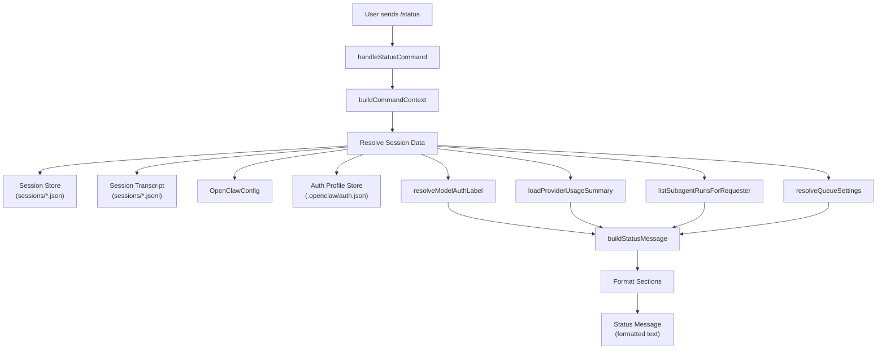
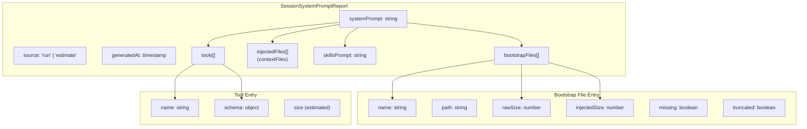
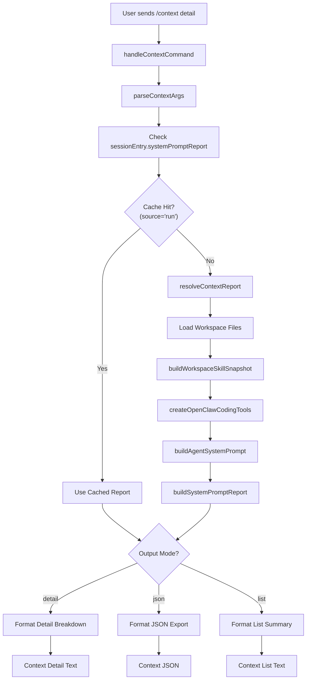

# Page: Status and Context Reporting

# ステータスとコンテキストレポート

<details>
<summary>関連ソースファイル</summary>

この Wiki ページの生成に使用されたコンテキストファイル:

- [docs/concepts/system-prompt.md](docs/concepts/system-prompt.md)
- [docs/gateway/cli-backends.md](docs/gateway/cli-backends.md)
- [docs/reference/token-use.md](docs/reference/token-use.md)
- [docs/tools/slash-commands.md](docs/tools/slash-commands.md)
- [src/agents/auth-profiles/oauth.fallback-to-main-agent.test.ts](src/agents/auth-profiles/oauth.fallback-to-main-agent.test.ts)
- [src/agents/auth-profiles/oauth.ts](src/agents/auth-profiles/oauth.ts)
- [src/agents/cli-backends.ts](src/agents/cli-backends.ts)
- [src/agents/cli-runner.test.ts](src/agents/cli-runner.test.ts)
- [src/agents/cli-runner.ts](src/agents/cli-runner.ts)
- [src/agents/cli-runner/helpers.ts](src/agents/cli-runner/helpers.ts)
- [src/agents/pi-embedded-runner/compact.ts](src/agents/pi-embedded-runner/compact.ts)
- [src/agents/pi-embedded-runner/run/attempt.ts](src/agents/pi-embedded-runner/run/attempt.ts)
- [src/agents/pi-embedded-runner/system-prompt.ts](src/agents/pi-embedded-runner/system-prompt.ts)
- [src/agents/system-prompt-params.ts](src/agents/system-prompt-params.ts)
- [src/agents/system-prompt-report.ts](src/agents/system-prompt-report.ts)
- [src/agents/system-prompt.test.ts](src/agents/system-prompt.test.ts)
- [src/agents/system-prompt.ts](src/agents/system-prompt.ts)
- [src/auto-reply/command-detection.ts](src/auto-reply/command-detection.ts)
- [src/auto-reply/commands-args.ts](src/auto-reply/commands-args.ts)
- [src/auto-reply/commands-registry.data.ts](src/auto-reply/commands-registry.data.ts)
- [src/auto-reply/commands-registry.test.ts](src/auto-reply/commands-registry.test.ts)
- [src/auto-reply/commands-registry.ts](src/auto-reply/commands-registry.ts)
- [src/auto-reply/commands-registry.types.ts](src/auto-reply/commands-registry.types.ts)
- [src/auto-reply/group-activation.ts](src/auto-reply/group-activation.ts)
- [src/auto-reply/reply.ts](src/auto-reply/reply.ts)
- [src/auto-reply/reply/agent-runner.heartbeat-typing.runreplyagent-typing-heartbeat.retries-after-compaction-failure-by-resetting-session.test.ts](src/auto-reply/reply/agent-runner.heartbeat-typing.runreplyagent-typing-heartbeat.retries-after-compaction-failure-by-resetting-session.test.ts)
- [src/auto-reply/reply/commands-context-report.ts](src/auto-reply/reply/commands-context-report.ts)
- [src/auto-reply/reply/commands-core.ts](src/auto-reply/reply/commands-core.ts)
- [src/auto-reply/reply/commands-status.ts](src/auto-reply/reply/commands-status.ts)
- [src/auto-reply/reply/commands-subagents.ts](src/auto-reply/reply/commands-subagents.ts)
- [src/auto-reply/reply/commands.test.ts](src/auto-reply/reply/commands.test.ts)
- [src/auto-reply/reply/commands.ts](src/auto-reply/reply/commands.ts)
- [src/auto-reply/reply/directive-handling.ts](src/auto-reply/reply/directive-handling.ts)
- [src/auto-reply/reply/subagents-utils.test.ts](src/auto-reply/reply/subagents-utils.test.ts)
- [src/auto-reply/reply/subagents-utils.ts](src/auto-reply/reply/subagents-utils.ts)
- [src/auto-reply/send-policy.ts](src/auto-reply/send-policy.ts)
- [src/auto-reply/status.test.ts](src/auto-reply/status.test.ts)
- [src/auto-reply/status.ts](src/auto-reply/status.ts)
- [src/auto-reply/templating.ts](src/auto-reply/templating.ts)
- [src/gateway/gateway-cli-backend.live.test.ts](src/gateway/gateway-cli-backend.live.test.ts)
- [src/telegram/group-migration.test.ts](src/telegram/group-migration.test.ts)
- [src/telegram/group-migration.ts](src/telegram/group-migration.ts)

</details>


このドキュメントでは、エージェントセッション状態、トークン使用量、コスト見積もり、コンテキストウィンドウ消費の可視性を提供する `/status` と `/context` コマンドについて説明します。

他のスラッシュコマンドについては、[Commands and Directives](#9) を参照してください。セッション管理とコンパクションについては、[Session Management](#5.3) と [Context Overflow and Auto-Compaction](#5.5) を参照してください。

---

## 概要

OpenClaw はエージェントランタイム状態を監視するための2つの主要なコマンドを提供します:

- **`/status`**: 現在のセッション状態、トークン使用量、コスト見積もり、モデル設定、ランタイムオプションを表示
- **`/context`**: コンテキストウィンドウスペースを消費しているものを説明し、オプションでファイル、ツール、スキルの詳細な内訳を表示

両方のコマンドは「高速パス」です - キューイングやモデル呼び出しなしで即座に実行され、インラインショートカットとして機能します（例: `hey /status what model are we using?` はステータス出力をトリガーし、残りをモデルに渡します）。

Sources: [src/auto-reply/status.ts:309-468](), [src/auto-reply/reply/commands-context-report.ts:181-299](), [docs/tools/slash-commands.md:69-80]()

---

## ステータスコマンド (`/status`)

### ステータスメッセージ構造

`/status` コマンドは以下のセクションを持つ複数行のレポートを返します:

| セクション | コンテンツ | 例 |
|---------|---------|---------|
| Version | OpenClaw バージョンとコミットハッシュ | `🦞 OpenClaw 2025.1.3 (a1b2c3d)` |
| Time | 現在のタイムスタンプ（利用可能な場合） | `🕐 Monday, Jan 6, 2025 — 3:26 PM` |
| Model | プロバイダー/モデルと認証モード | `🧠 Model: anthropic/claude-opus-4-5 · 🔑 api-key` |
| Usage | 入力/出力トークン数とコスト | `🧮 Tokens: 1.2k in / 800 out · 💵 Cost: $0.0020` |
| Context | 合計トークン vs コンテキスト制限 | `📚 Context: 16k/32k (50%) · 🧹 Compactions: 2` |
| Media | メディア理解結果 | `📎 Media: image ok (openai/gpt-5.2)` |
| Provider Usage | プロバイダークォータ/使用量（追跡時） | `📊 Usage: Claude 80% left (5h)` |
| Session | セッションキーと最終更新時刻 | `🧵 Session: agent:main:main · updated 10m ago` |
| Subagents | アクティブなサブエージェント数 | `🤖 Subagents: 2 active` |
| Options | ランタイムモードとトグル | `⚙️ Runtime: direct · Think: medium · elevated` |
| Voice | TTS 設定 | `🔊 Voice: inbound · provider=openai · limit=500` |
| Activation | グループアクティベーションモード | `👥 Activation: mention · 🪢 Queue: collect (depth 3)` |

Sources: [src/auto-reply/status.ts:309-468](), [src/auto-reply/reply/commands-status.ts:110-173]()

---

### ステータスコマンドデータフロー



**ステータスコマンドデータフロー**

ステータスコマンドは複数のソースからデータを集約します: キャッシュされた状態用のセッションストア、実際のトークン使用量用のトランスクリプトログ、認証メタデータ用の認証ストア、サブエージェント数とキューデプス用のライブレジストリ。

Sources: [src/auto-reply/reply/commands-status.ts:110-173](), [src/auto-reply/status.ts:309-468]()

---

### トークンとコスト計算

#### トークン解決戦略

トークン数は以下の優先順位で解決されます:

1. **トランスクリプトログ** (`readUsageFromSessionLog`): セッション JSONL ファイルを読み取り、最新のメッセージから `usage.cacheRead`、`usage.input`、`usage.output` を合計
2. **セッションストアキャッシュ** (`sessionEntry.inputTokens`, `sessionEntry.outputTokens`, `sessionEntry.totalTokens`): トランスクリプトが利用できない場合のフォールバック
3. **推定トークン**: 両方のソースが欠落している場合、コンテキストトークンは4文字/トークンで推定

`/status` コマンドは、セッションストアがキャッシュされたプロンプトトークンを正確にキャプチャしない可能性があるため、`includeTranscriptUsage: true` が設定されている場合、トランスクリプト使用量を優先します。

Sources: [src/auto-reply/status.ts:165-232](), [src/auto-reply/reply/commands-status.ts:110-173]()

#### コスト見積もり

以下の場合にコストが計算されます:
- 認証モードが `api-key` または `mixed`（OAuth/AWS SDK 使用量は OpenClaw によって計測されない）
- モデルコスト設定が定義されている（`models.providers[provider].models[].cost`）

コスト計算式:
```
cost = (inputTokens * costConfig.input / 1M) +
       (outputTokens * costConfig.output / 1M) +
       (cacheReadTokens * costConfig.cacheRead / 1M) +
       (cacheWriteTokens * costConfig.cacheWrite / 1M)
```

Sources: [src/auto-reply/status.ts:418-438](), [src/utils/usage-format.ts:1-50]()

---

### プロバイダー使用量追跡

プロバイダー使用量追跡が有効な場合（例: Anthropic API 経由の Claude 用）、ステータスメッセージには使用量サマリー行が含まれます:

```
📊 Usage: Claude 80% left (5h)
```

このデータは `loadProviderUsageSummary` から取得され、以下を行います:
1. プロバイダー使用量 ID を解決（例: デフォルトの Anthropic 認証プロファイル用の `anthropic:default`）
2. `~/.openclaw/usage/<providerId>.json` からキャッシュされた使用量データを読み取る
3. 残りクォータパーセンテージとタイムウィンドウをフォーマット

プロバイダー使用量は個別に追跡され、モデルが呼び出されたときに更新されます。詳細は [Model Selection and Failover](#5.4) を参照してください。

Sources: [src/auto-reply/reply/commands-status.ts:124-144](), [src/infra/provider-usage.ts:1-300]()

---

## コンテキストコマンド (`/context`)

### コンテキスト内訳モード

`/context` コマンドは複数の出力モードをサポートしています:

| モード | コマンド | 出力 |
|------|---------|--------|
| Help | `/context` または `/context help` | 使用法の説明 |
| List | `/context list` | カテゴリ別のコンパクトな内訳 |
| Detail | `/context detail` | ファイル、ツール、スキルごとのサイズ |
| JSON | `/context json` | 機械可読 JSON エクスポート |

Sources: [src/auto-reply/reply/commands-context-report.ts:181-299](), [docs/tools/slash-commands.md:78]()

---

### コンテキストレポートデータ構造



**コンテキストレポートデータ構造**

`SessionSystemPromptReport` は、生のサイズと注入されたサイズを含む、コンテキストウィンドウスペースを消費するすべてのコンポーネントをキャプチャします。ブートストラップファイルはトランケーションを追跡し、ツールはスキーマオーバーヘッドを追跡します。

Sources: [src/config/sessions/types.ts:1-100](), [src/agents/system-prompt-report.ts:1-200]()

---

### コンテキスト内訳カテゴリ

`/context detail` 出力はコンテキストコンシューマーをカテゴリ別にグループ化します:

#### システムプロンプトセクション

- コアプロンプトテキスト（アイデンティティ、ツール、安全性、ランタイム）
- スキルガイダンス（スキルが利用可能な場合）
- メモリーリコール指示（`memory_search` ツールが有効な場合）
- ドキュメント参照
- ハートビートとサイレントリプライ指示
- 時間/タイムゾーン情報
- サンドボックス情報（サンドボックス化されている場合）

#### ブートストラップファイル

すべてのプロンプトに注入されるワークスペースファイル:
- `AGENTS.md`, `SOUL.md`, `TOOLS.md`, `IDENTITY.md`, `USER.md`, `HEARTBEAT.md`
- `MEMORY.md` および/または `memory.md` （存在する場合）
- `BOOTSTRAP.md` （新しいワークスペースのみ）

各ファイルは以下を表示:
- 生のサイズ（トランケーション前）
- 注入されたサイズ（トランケーションとマークダウンラッピング後）
- トランケーションステータス（`agents.defaults.bootstrapMaxChars` でトランケートされた場合）

#### ツールスキーマ

各ツールはパラメーター定義に基づいてスキーマオーバーヘッドを提供します。コンテキストレポートはツール定義をシリアライズして文字数をカウントすることでツールスキーマサイズを推定します。

スキーマサイズ上位のツールがリストされます（デフォルト: 上位10）。

#### スキル

スキルプロンプト（`formatSkillsForPrompt`）は説明とファイルパス付きの利用可能なスキルをリストします。合計サイズが報告され、詳細モードではスキルごとの内訳が表示されます。

Sources: [src/auto-reply/reply/commands-context-report.ts:181-299](), [src/agents/system-prompt-report.ts:1-200]()

---

### コンテキストコマンドフロー



**コンテキストコマンドフロー**

コンテキストコマンドは、利用可能な場合、最後の実行からのキャッシュされた `systemPromptReport` を再利用し、ワークスペースファイルの読み込み、スキルスナップショットの構築、ツール定義の作成、システムプロンプトの組み立てによってレポートを再構築することにフォールバックします。

Sources: [src/auto-reply/reply/commands-context-report.ts:52-179](), [src/agents/system-prompt-report.ts:1-200]()

---

## データソース

### セッションストア

セッションストア（`~/.openclaw/agents/<agentId>/sessions/<sessionId>.json`）はセッションごとのメタデータをキャッシュします:

```typescript
type SessionEntry = {
  sessionId: string;
  updatedAt: number;
  inputTokens?: number;
  outputTokens?: number;
  totalTokens?: number;
  contextTokens?: number;
  compactionCount: number;
  providerOverride?: string;
  modelOverride?: string;
  elevatedLevel?: "on" | "off" | "ask" | "full";
  thinkingLevel?: ThinkLevel;
  verboseLevel?: VerboseLevel;
  groupActivation?: "mention" | "always";
  systemPromptReport?: SessionSystemPromptReport;
  // ... その他のフィールド
};
```

`systemPromptReport` は各実行後に投入され、`/context` によって高価な再計算を避けるために再利用されます。

Sources: [src/config/sessions/types.ts:1-200](), [src/auto-reply/reply/commands-context-report.ts:52-179]()

---

### セッショントランスクリプトログ

セッショントランスクリプト（`~/.openclaw/agents/<agentId>/sessions/<sessionId>.jsonl`）は、完全な使用量メタデータを持つすべてのターンを記録します:

```json
{"type":"message","message":{"role":"assistant","model":"claude-opus-4-5","usage":{"input":1200,"output":800,"cacheRead":14000,"cacheWrite":0,"totalTokens":16000}}}
```

ステータスコマンドは最後の行を解析して正確なトークン数を抽出します。これには、セッションストアに表示されない可能性があるキャッシュされたプロンプトトークンが含まれます。

Sources: [src/auto-reply/status.ts:165-232]()

---

### 設定データ

ステータスとコンテキストレポートは `OpenClawConfig` からランタイム設定を読み取ります:

- `agents.defaults.model`: デフォルトモデル選択
- `agents.defaults.contextTokens`: コンテキストウィンドウサイズオーバーライド
- `agents.defaults.bootstrapMaxChars`: ファイルごとのトランケーション制限（デフォルト: 20000）
- `models.providers[].models[].cost`: 100万トークンあたりのコスト
- `agents.defaults.userTimezone`: 時間表示用のユーザータイムゾーン
- `agents.defaults.timeFormat`: 時間形式（`12` | `24` | `auto`）

Sources: [src/auto-reply/status.ts:309-468](), [src/agents/system-prompt-params.ts:1-100]()

---

## トークン推定

トークン推定は大まかなヒューリスティックとして4:1の文字対トークン比率を使用します:

```typescript
function estimateTokensFromChars(chars: number): number {
  return Math.ceil(Math.max(0, chars) / 4);
}
```

これは以下の場合に使用されます:
- コンテキスト内訳に推定トークン数を表示する場合
- 生のサイズと注入されたファイルサイズを比較する場合
- ツールスキーマオーバーヘッドを推定する場合

モデルレスポンスからの実際のトークン数は、利用可能な場合、常に優先されます。

Sources: [src/auto-reply/reply/commands-context-report.ts:19-29]()

---

## ステータスコマンド実装詳細

### モデル認証表示

ステータスコマンドは以下によって認証モードラベルを解決します:

1. 認証ストアで OAuth プロファイルをチェック
2. API キープロファイルをチェック
3. 環境変数 API キーをチェック
4. カスタムプロバイダー設定をチェック
5. 何も見つからない場合は `unknown` にフォールバック

OAuth プロファイルは利用可能な場合、有効期限時刻を表示します。API キーは編集されたスニペット（最初の6文字 + 最後の6文字）を表示します。

Sources: [src/auto-reply/reply/commands-status.ts:35-75]()

---

### サブエージェントステータス

サブエージェントがアクティブな場合、ステータスメッセージにはサブエージェント行が含まれます:

```
🤖 Subagents: 2 active (1 running, 1 idle)
```

このデータは `listSubagentRunsForRequester` から取得され、現在のセッションで生成された実行に対してグローバルサブエージェントレジストリをフィルタリングします。

Sources: [src/auto-reply/reply/commands-status.ts:150-160](), [src/agents/subagent-registry.ts:1-200]()

---

### キューステータス表示

キュー設定は以下から解決されます:
1. セッション固有のオーバーライド（`/queue` が使用された場合）
2. エージェント設定デフォルト
3. グローバルデフォルト

ステータス行は以下を表示:
- キューモード（`none`、`collect`、`summarize`）
- 現在のデプス（キューに入れられたメッセージ数）
- デバウンス遅延（非ゼロの場合）
- キャップとドロップポリシー（オーバーライドされた場合）

例: `🪢 Queue: collect (depth 3 · debounce 2s · cap 5 · drop old)`

Sources: [src/auto-reply/status.ts:138-163](), [src/auto-reply/reply/queue.ts:1-500]()

---

## コンテキスト内訳出力例

### `/context list`

```
🧠 Context Breakdown

System prompt: 2,431 chars (~608 tok)

Injected workspace files:
- AGENTS.md: 412 chars (~103 tok)
- IDENTITY.md: 287 chars (~72 tok)
- MEMORY.md: 1,205 chars (~302 tok) ⚠️ Consumes tokens on every turn

Skills: 1,843 chars (~461 tok)

Top 10 tools (schema size):
- exec: 524 chars (~131 tok)
- read: 318 chars (~80 tok)
- write: 289 chars (~73 tok)
(7 more tools omitted)

Total estimated context: ~6,500 tokens (20% of 32k limit)
```

Sources: [src/auto-reply/reply/commands-context-report.ts:200-250]()

---

### `/context detail`

詳細モードはすべてのセクションを展開し、以下を表示:
- ブートストラップファイルの完全なリスト（生のサイズ → 注入されたサイズ）
- スキーマサイズ付きのツールの完全なリスト
- プロンプト貢献付きのスキルの完全なリスト
- システムプロンプトセクションの内訳
- `bootstrapMaxChars` を超えるファイルのトランケーション警告

Sources: [src/auto-reply/reply/commands-context-report.ts:250-299]()

---

### `/context json`

JSON エクスポートには、プログラムによる分析に適した完全な `SessionSystemPromptReport` 構造が含まれます:

```json
{
  "source": "run",
  "generatedAt": 1704571200000,
  "sessionId": "abc123",
  "provider": "anthropic",
  "model": "claude-opus-4-5",
  "systemPrompt": "...",
  "bootstrapFiles": [...],
  "injectedFiles": [...],
  "skillsPrompt": "...",
  "tools": [...]
}
```

Sources: [src/auto-reply/reply/commands-context-report.ts:270-280]()

---

## 認可とアクセス制御

`/status` と `/context` はどちらも認証された送信者に常に利用可能です（`commands.allowFrom` 制限をバイパス）。これにより、オペレーターはコマンド認可ポリシーに関係なく常にセッション状態を確認できます。

コマンド認可の詳細については、[Command Authorization](#9.2) を参照してください。

Sources: [docs/tools/slash-commands.md:69-125](), [src/auto-reply/reply/commands-core.ts:1-200]()

---
