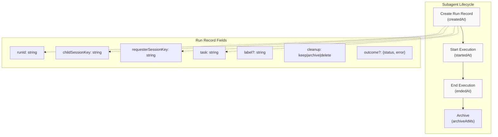
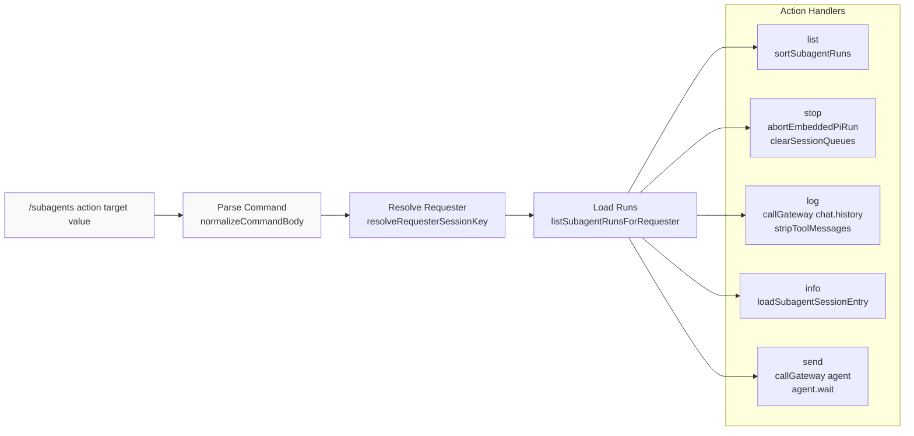
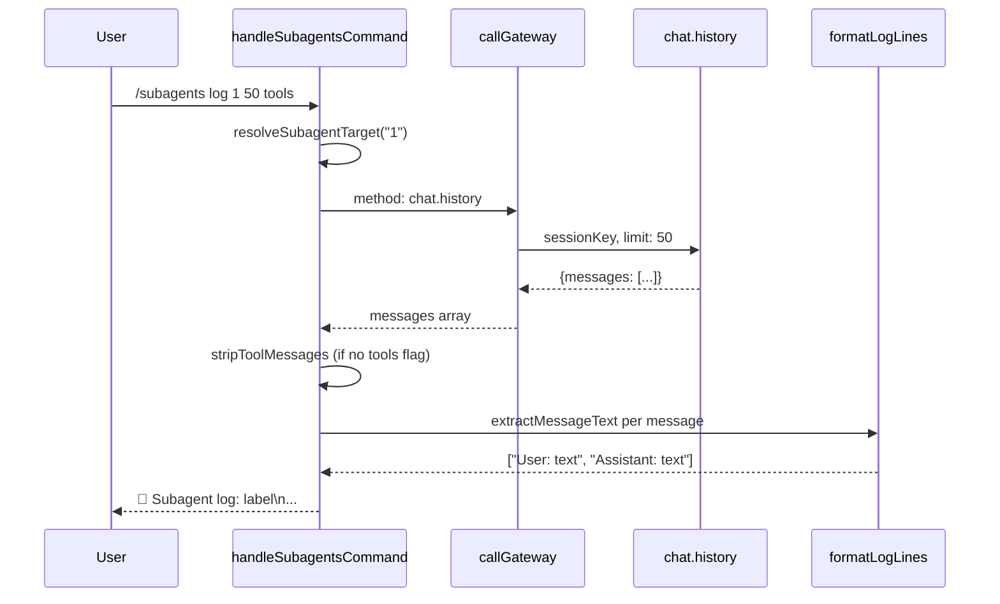
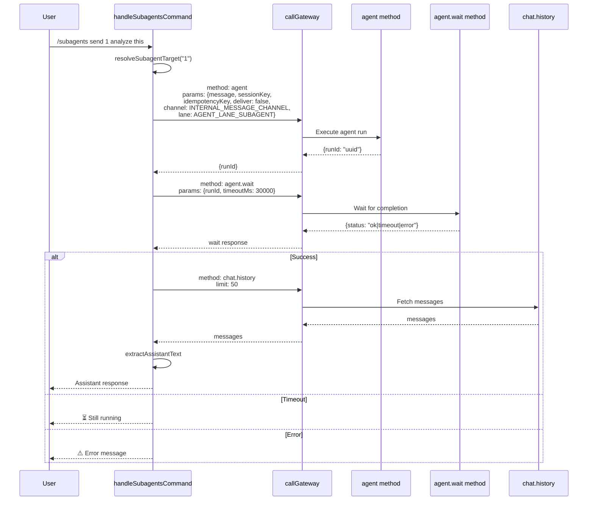
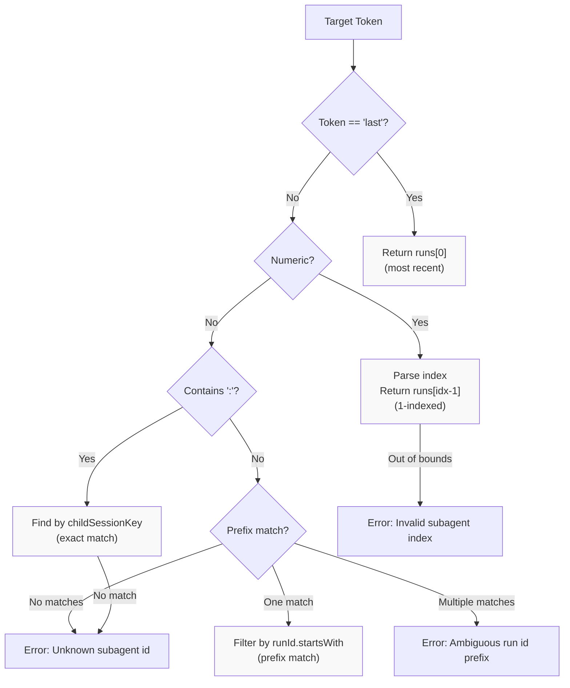
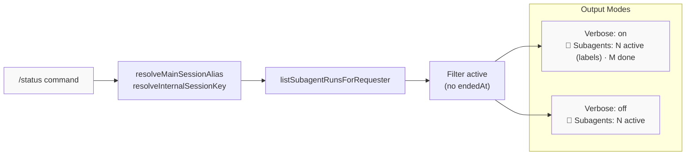
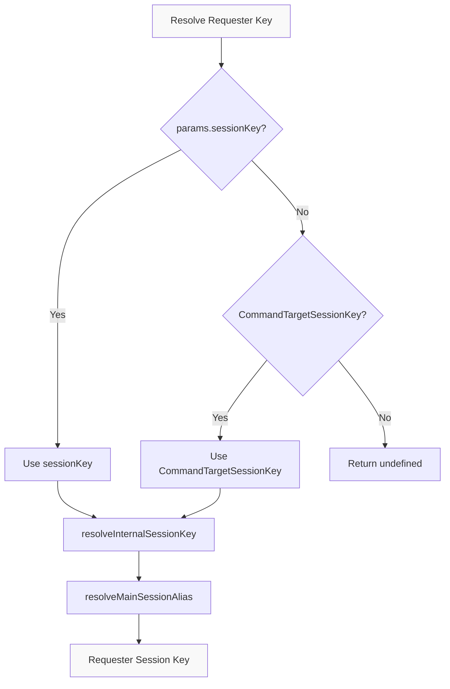

# Page: Subagent Management

# サブエージェント管理

<details>
<summary>関連ソースファイル</summary>

この Wiki ページの生成に使用されたコンテキストファイル:

- [docs/tools/slash-commands.md](docs/tools/slash-commands.md)
- [src/auto-reply/command-detection.ts](src/auto-reply/command-detection.ts)
- [src/auto-reply/commands-args.ts](src/auto-reply/commands-args.ts)
- [src/auto-reply/commands-registry.data.ts](src/auto-reply/commands-registry.data.ts)
- [src/auto-reply/commands-registry.test.ts](src/auto-reply/commands-registry.test.ts)
- [src/auto-reply/commands-registry.ts](src/auto-reply/commands-registry.ts)
- [src/auto-reply/commands-registry.types.ts](src/auto-reply/commands-registry.types.ts)
- [src/auto-reply/group-activation.ts](src/auto-reply/group-activation.ts)
- [src/auto-reply/reply.ts](src/auto-reply/reply.ts)
- [src/auto-reply/reply/commands-core.ts](src/auto-reply/reply/commands-core.ts)
- [src/auto-reply/reply/commands-status.ts](src/auto-reply/reply/commands-status.ts)
- [src/auto-reply/reply/commands-subagents.ts](src/auto-reply/reply/commands-subagents.ts)
- [src/auto-reply/reply/commands.test.ts](src/auto-reply/reply/commands.test.ts)
- [src/auto-reply/reply/commands.ts](src/auto-reply/reply/commands.ts)
- [src/auto-reply/reply/directive-handling.ts](src/auto-reply/reply/directive-handling.ts)
- [src/auto-reply/reply/subagents-utils.test.ts](src/auto-reply/reply/subagents-utils.test.ts)
- [src/auto-reply/reply/subagents-utils.ts](src/auto-reply/reply/subagents-utils.ts)
- [src/auto-reply/send-policy.ts](src/auto-reply/send-policy.ts)
- [src/auto-reply/status.test.ts](src/auto-reply/status.test.ts)
- [src/auto-reply/status.ts](src/auto-reply/status.ts)
- [src/auto-reply/templating.ts](src/auto-reply/templating.ts)

</details>


このページでは、長時間実行されるサブエージェントプロセスを管理するための `/subagents` コマンドシステムについて説明します。サブエージェントは、特定のタスクを独立して処理するためにメインエージェントによって生成されるバックグラウンドエージェントセッションです。`/subagents` コマンドは、これらのプロセスをリスト、停止、ログ検査、詳細表示、メッセージ送信するアクションを提供します。

サブエージェントの生成とツール呼び出しシステムについては、[Tools and Skills](#6) を参照してください。一般的なコマンド認可については、[Command Authorization](#9.2) を参照してください。

## コマンド概要

`/subagents` コマンドは、コマンドレジストリを通じてネイティブサポートが有効になったテキストのみのコマンドです。「management」カテゴリのコマンドとして分類され、送信者の認可が必要です。

**コマンド定義:**

| プロパティ | 値 |
|----------|-------|
| Text alias | `/subagents` |
| Native name | `subagents` |
| Scope | `both` (text and native) |
| Category | `management` |
| Args parsing | `positional` |
| Menu support | `auto` |

コマンドは3つの位置引数を受け付けます:

1. **action** - `list | stop | log | info | send` （選択メニュー付き）
2. **target** - 実行 ID、インデックス、またはセッションキー
3. **value** - 追加入力（log の制限、send のメッセージ、captureRemaining）

**Sources:** [src/auto-reply/commands-registry.data.ts:249-275]()

## サブエージェント実行レジストリ

サブエージェント実行は `subagent-registry` モジュールによって維持されるグローバルレジストリで追跡されます。各実行はライフサイクルタイムスタンプとメタデータを持つ `SubagentRunRecord` で表されます。



**主要なレジストリ関数:**

- `listSubagentRunsForRequester(requesterSessionKey)` - リクエスターによって生成されたすべての実行を返す
- `resolveInternalSessionKey()` - レジストリルックアップ用にセッションキーを正規化
- `resolveMainSessionAlias()` - メインセッションキーエイリアスを解決

**Sources:** [src/auto-reply/reply/commands-subagents.ts:5-23](), [src/agents/subagent-registry.js]()

## コマンドアクション

`/subagents` コマンドは5つのコアアクションを実装し、それぞれ `handleSubagentsCommand` 関数を通じて処理されます。



**Sources:** [src/auto-reply/reply/commands-subagents.ts:168-421]()

### List アクション

現在のセッションのすべてのサブエージェント実行をステータス（アクティブ vs 完了）別にグループ化してリストします。

**使用法:** `/subagents list`

**出力形式:**
- アクティブ/完了数のヘッダー
- ステータス、ラベル、実行時間、runId プレフィックス、セッションキー付きの番号付きリスト
- 最新の開始/作成時刻でソート（`sortSubagentRuns` 経由）

**出力例:**
```
🧭 Subagents (current session)
Active: 2 · Done: 1
1) running · Process logs · 5m · run 12ab34cd · agent:main:subagent:abc
2) running · Analyze data · 3m · run 56ef78gh · agent:main:subagent:def
3) done · Generate report · 2m · run 90ij12kl · agent:main:subagent:xyz
```

**Sources:** [src/auto-reply/reply/commands-subagents.ts:200-221]()

### Stop アクション

実行を中止してキューに入れられたメッセージをクリアすることで、実行中のサブエージェントを停止します。

**使用法:** `/subagents stop <id|#|all>`

**停止メカニズム:**
1. `abortEmbeddedPiRun(sessionId)` を呼び出してエージェントランタイムを中止
2. `clearSessionQueues([childKey, sessionId])` を呼び出してフォローアップとレーンキューをクリア
3. セッションストアで `entry.abortedLastRun = true` を設定
4. `entry.updatedAt` タイムスタンプを更新

**特殊なターゲット:**
- `all` または `*` - `stopSubagentsForRequester` 経由でリクエスターのすべてのアクティブなサブエージェントを停止

**Sources:** [src/auto-reply/reply/commands-subagents.ts:223-277]()

### Info アクション

特定のサブエージェント実行の詳細なメタデータを表示します。

**使用法:** `/subagents info <id|#>`

**表示される情報:**

| フィールド | ソース | 形式 |
|-------|--------|--------|
| Status | `formatRunStatus(run)` | `running | done | timeout | error` |
| Label | `formatRunLabel(run)` | トランケートされたタスク/ラベル |
| Task | `run.task` | 完全なタスク説明 |
| Run | `run.runId` | 完全な UUID |
| Session | `run.childSessionKey` | 完全なセッションキー |
| SessionId | `sessionEntry?.sessionId` | JSONL トランスクリプト ID |
| Transcript | `sessionEntry?.sessionFile` | ファイルパス |
| Runtime | `formatDurationCompact(endedAt - startedAt)` | `45s | 2m30s` |
| Created | `formatTimestampWithAge(run.createdAt)` | ISO + 相対時間 |
| Started | `formatTimestampWithAge(run.startedAt)` | ISO + 相対時間 |
| Ended | `formatTimestampWithAge(run.endedAt)` | ISO + 相対時間 |
| Cleanup | `run.cleanup` | `keep | archive | delete` |
| Archive | `formatTimestampWithAge(run.archiveAtMs)` | クリーンアップ予定時刻 |
| Outcome | `run.outcome.status + error` | ステータスとオプションのエラー |

**Sources:** [src/auto-reply/reply/commands-subagents.ts:279-319]()

### Log アクション

サブエージェントのセッショントランスクリプトから会話履歴を取得して表示します。

**使用法:** `/subagents log <id|#> [limit] [tools]`

**パラメーター:**
- **limit** - 取得するメッセージ数（デフォルト: 20、最大: 200）
- **tools** - ツールメッセージを含める（デフォルトでは `stripToolMessages` 経由で削除）

**フロー:**



**メッセージ抽出:**
- コンテンツを正規化するために `extractMessageText(message)` を呼び出す
- `sanitizeTextContent` 経由でアシスタントメッセージをサニタイズ（thinking/tool マーカーを削除）
- 文字列コンテンツとコンテンツブロック配列の両方を処理
- 空または非テキストブロックをフィルタリング

**Sources:** [src/auto-reply/reply/commands-subagents.ts:321-348](), [src/auto-reply/reply/commands-subagents.ts:104-159]()

### Send アクション

サブエージェントにメッセージを送信し、完了を待機します。

**使用法:** `/subagents send <id|#> <message>`

**フロー:**



**主要なパラメーター:**
- `deliver: false` - レスポンスはチャネルに送信されず、返信のみ
- `channel: INTERNAL_MESSAGE_CHANNEL` - 内部通信としてマーク
- `lane: AGENT_LANE_SUBAGENT` - サブエージェント実行レーンにルーティング
- `idempotencyKey` - 再試行時の重複実行を防止

**待機タイムアウト:** 30秒（30000ms）

**Sources:** [src/auto-reply/reply/commands-subagents.ts:350-421]()

## ターゲット解決

サブエージェントターゲットは3つの方法で指定でき、`resolveSubagentTarget` によって解決されます:



**解決例:**

| 入力 | 解決方法 | 例の一致 |
|-------|------------------|---------------|
| `1`, `2`, `3` | リストインデックス（1始まり） | ソート済みリストから |
| `last` | 最新の実行 | ソート後の `runs[0]` |
| `agent:main:subagent:abc` | 完全セッションキー（完全一致） | `childSessionKey` に一致 |
| `12ab34cd` | RunId プレフィックス | `runId.startsWith("12ab34cd")` に一致 |

**エラーケース:**
- ターゲット不足: `"Missing subagent id."`
- 無効なインデックス: `"Invalid subagent index: {token}"`
- 不明なセッション: `"Unknown subagent session: {token}"`
- 曖昧なプレフィックス: `"Ambiguous run id prefix: {token}"`
- 不明な ID: `"Unknown subagent id: {token}"`

**Sources:** [src/auto-reply/reply/commands-subagents.ts:56-88]()

## ステータス統合

サブエージェント数は、詳細モードが有効な場合、またはサブエージェントがアクティブな場合、`/status` コマンド出力に表示されます。

**ステータス行の構築:**



**ステータス行形式:**

| 詳細レベル | 形式 | 例 |
|---------------|--------|---------|
| `off` | `🤖 Subagents: {active} active` | `🤖 Subagents: 2 active` |
| `on` | `🤖 Subagents: {active} active ({labels}) · {done} done` | `🤖 Subagents: 2 active (Process logs, Analyze data) · 3 done` |

**ラベルのトランケーション:**
- 詳細モードで表示されるラベルは最大3つ
- `resolveSubagentLabel(entry, "")` でラベルを解決
- 空のラベルはフィルタリング

**省略ルール:**
- `runs.length === 0` の場合、ステータス行なし
- `verbose === "off"` で `active.length > 0` の場合、アクティブ数のみ表示

**Sources:** [src/auto-reply/reply/commands-status.ts:187-207](), [src/auto-reply/status.ts:461]()

## リクエスターセッションキー解決

コマンドは、リクエスターセッションキーを解決することで、どのセッションのサブエージェントをリストするかを決定します。

**解決優先順位:**



**キーの正規化:**
- `resolveMainSessionAlias(cfg)` 経由で設定から `mainKey` と `alias` を解決
- `resolveInternalSessionKey({key, alias, mainKey})` を呼び出してセッションスコープエイリアスを処理
- レジストリルックアップ用に一貫したキー形式を保証

**使用されるコンテキストフィールド:**
- `params.sessionKey` - 現在のコマンド実行セッション
- `params.ctx.CommandTargetSessionKey` - ネイティブコマンド用のターゲットセッション（例: Slack スラッシュコマンド）

**ネイティブコマンドルーティング:**
- ネイティブコマンドは分離されたセッションで実行（例: `agent:main:slack:slash:userId`）
- `CommandTargetSessionKey` は実際のチャットセッションを指す（例: `agent:main:main`）
- これにより、ネイティブコマンドはコマンドセッションではなくターゲットセッションのサブエージェントをリストできる

**Sources:** [src/auto-reply/reply/commands-subagents.ts:47-54]()

## ユーティリティ関数

### ラベルフォーマット

**`resolveSubagentLabel(entry, fallback)`** - 表示ラベルを抽出
- 優先順位: `entry.label?.trim()` → `entry.task?.trim()` → `fallback`
- デフォルトフォールバック: `"subagent"`

**`formatRunLabel(entry, options)`** - トランケーション付きでラベルをフォーマット
- デフォルト最大長: 72文字
- `truncateUtf16Safe` 経由でトランケートし、`…` を追加
- UTF-16 セーフ（絵文字/サロゲートペアの破損を回避）

**Sources:** [src/auto-reply/reply/subagents-utils.ts:4-16]()

### ステータスフォーマット

**`formatRunStatus(entry)`** - 実行状態をステータス文字列に変換

| 条件 | 戻り値 |
|-----------|-------------|
| `!entry.endedAt` | `"running"` |
| `entry.outcome?.status === "ok"` | `"done"` |
| `entry.outcome?.status === "timeout"` | `"timeout"` |
| `entry.outcome?.status === "error"` | `"error"` |
| `entry.outcome?.status` (その他) | 生のステータス値 |

**Sources:** [src/auto-reply/reply/subagents-utils.ts:18-24]()

### 実行ソート

**`sortSubagentRuns(runs)`** - 最新順でソート

```javascript
return [...runs].toSorted((a, b) => {
  const aTime = a.startedAt ?? a.createdAt ?? 0;
  const bTime = b.startedAt ?? b.createdAt ?? 0;
  return bTime - aTime;
});
```

- 利用可能な場合は `startedAt` を使用、そうでなければ `createdAt`
- 降順（最新が最初）
- 新しいソート済み配列を作成（イミュータブル）

**Sources:** [src/auto-reply/reply/subagents-utils.ts:26-32]()

## 認可

`/subagents` コマンドは認証された送信者が必要です。未認証の試行はログに警告が記録され、サイレントに無視されます。

**認可チェック:**

```javascript
if (!params.command.isAuthorizedSender) {
  logVerbose(`Ignoring /subagents from unauthorized sender: ${params.command.senderId || "<unknown>"}`);
  return { shouldContinue: false };
}
```

認可は以下から派生:
1. `commands.allowFrom` 設定（設定されている場合、排他的許可リスト）
2. チャネル許可リスト + ペアリング（`commands.allowFrom` が未設定の場合）
3. `commands.useAccessGroups` フラグ（デフォルト: true）

コマンド認可の詳細については、[Command Authorization](#9.2) を参照してください。

**Sources:** [src/auto-reply/reply/commands-subagents.ts:176-181]()

---
