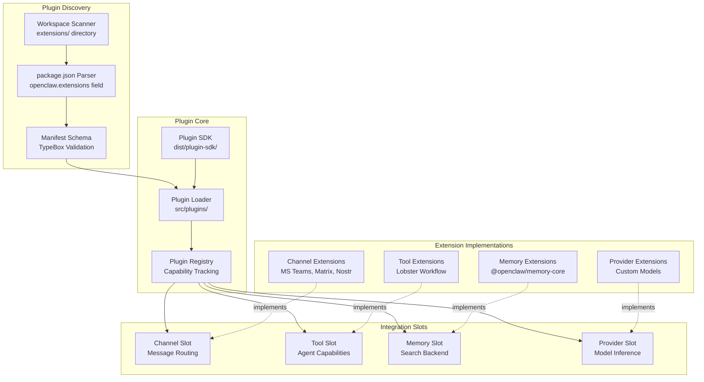
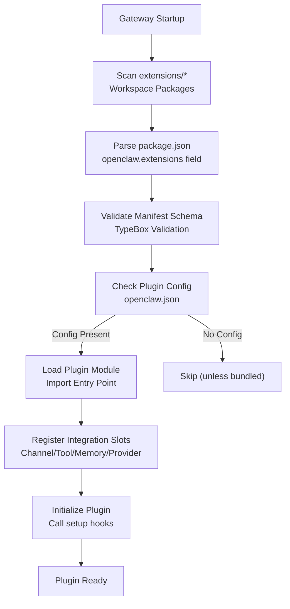
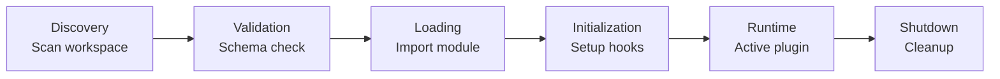

# 拡張機能とプラグイン

<details>
<summary>関連ソースファイル</summary>

この Wiki ページの生成に使用されたコンテキストファイル:

- [extensions/copilot-proxy/package.json](extensions/copilot-proxy/package.json)
- [extensions/google-antigravity-auth/package.json](extensions/google-antigravity-auth/package.json)
- [extensions/google-gemini-cli-auth/package.json](extensions/google-gemini-cli-auth/package.json)
- [extensions/matrix/CHANGELOG.md](extensions/matrix/CHANGELOG.md)
- [extensions/matrix/package.json](extensions/matrix/package.json)
- [extensions/memory-lancedb/package.json](extensions/memory-lancedb/package.json)
- [extensions/msteams/CHANGELOG.md](extensions/msteams/CHANGELOG.md)
- [extensions/msteams/package.json](extensions/msteams/package.json)
- [extensions/voice-call/CHANGELOG.md](extensions/voice-call/CHANGELOG.md)
- [extensions/voice-call/package.json](extensions/voice-call/package.json)
- [extensions/zalo/CHANGELOG.md](extensions/zalo/CHANGELOG.md)
- [extensions/zalo/package.json](extensions/zalo/package.json)
- [extensions/zalouser/package.json](extensions/zalouser/package.json)
- [package.json](package.json)
- [pnpm-lock.yaml](pnpm-lock.yaml)

</details>

## 目的と範囲

このドキュメントでは、OpenClaw のプラグインアーキテクチャについて説明します。プラグインアーキテクチャは、4 つの主要な統合タイプを通じて拡張性を提供します：**チャネル**（メッセージングプラットフォーム統合）、**ツール**（エージェント機能）、**プロバイダー**（AI モデル推論）、**メモリ**（検索バックエンド）です。このページでは、プラグインシステムのアーキテクチャ、マニフェスト構造、組み込み拡張機能、およびカスタムプラグインの作成方法について説明します。

個々のチャネル統合の設定については、チャネル固有のドキュメントを参照してください。エージェントツールの設定については、[ツールとスキル](#6)を参照してください。モデルプロバイダーの設定については、[モデル選択とフェイルオーバー](#5.4)を参照してください。

---

## プラグインシステムアーキテクチャ

プラグインシステムは、拡張機能を発見、検証、ゲートウェイに統合するために連携する 4 つのコアコンポーネントで構成されています。

### アーキテクチャ図



**ソース**: [CHANGELOG.md:1-430](), 高レベルアーキテクチャ概要の図 5

### プラグインローダー

プラグインローダーは `extensions/` ワークスペースディレクトリをスキャンし、`package.json` マニフェストファイルを読み込んで拡張機能を発見します。拡張機能は `openclaw.extensions` フィールドによって識別され、このフィールドはプラグインのエントリポイントとメタデータを宣言します。

**主な責任**:
- `extensions/*` ディレクトリ内のワークスペースパッケージをスキャン
- プラグインマニフェストの解析と検証
- 適切なコンテキストでプラグインを初期化
- 型安全性のための Plugin SDK を拡張機能に提供

**ソース**: [CHANGELOG.md:395-408](), [pnpm-workspace.yaml:1-15]()

### プラグインレジストリ

プラグインレジストリは、読み込まれたプラグインとその機能のカタログを維持します。プラグインを統合スロット（チャネル、ツール、メモリ、プロバイダー）にマッピングし、適切なゲートウェイサブシステムに公開します。

**主な責任**:
- 読み込まれたプラグイン機能の追跡
- プラグインフックのゲートウェイコンポーネントへのルーティング
- プラグインライフサイクルの管理（有効化/無効化）
- スロット割り当ての調整

**ソース**: [CHANGELOG.md:406-408](), 高レベルアーキテクチャ概要の図 5

### Plugin SDK

Plugin SDK（`dist/plugin-sdk/`）は、プラグイン開発のための TypeScript 型、検証ユーティリティ、ヘルパー関数を提供します。これはメインパッケージエントリポイントとは別にエクスポートされ、`openclaw/plugin-sdk` 経由でプラグインにインポートできます。

**主なエクスポート**:
- プラグインコントラクトの TypeScript インターフェース
- スキーマ検証ヘルパー（TypeBox）
- ゲートウェイ RPC メソッド型
- 設定ユーティリティ

**ソース**: [package.json:9-10](), [CHANGELOG.md:400-408]()

---

## プラグインタイプと統合スロット

OpenClaw は 4 つの統合スロットタイプを定義します。各プラグインは 1 つ以上のスロットを実装して、特定のゲートウェイ機能を拡張します。

### 統合スロット概要

| スロットタイプ | 目的 | 例 |
|--------------|------|-----|
| **Channel** | メッセージングプラットフォーム統合 | MS Teams, Matrix, Nostr, LINE, Tlon, Zalo |
| **Tool** | エージェント機能とアクション | Lobster ワークフロー, LLM タスク |
| **Memory** | 検索バックエンドプロバイダー | @openclaw/memory-core, LanceDB |
| **Provider** | AI モデル推論 | カスタムモデルエンドポイント |

**ソース**: [CHANGELOG.md:395-408](), 高レベルアーキテクチャ概要の図 5

### チャネル拡張機能

チャネル拡張機能は、メッセージングプラットフォームを OpenClaw のメッセージルーティングと自動応答システムに統合します。プラットフォーム固有の認証、メッセージ送受信、メディア処理を実装します。

**実装要件**:
- メッセージ受信ハンドラー
- メッセージ送信
- 認証フロー
- メディアアップロード/ダウンロード
- オプション: ネイティブコマンド、リアクション、スレッド

**組み込みチャネル拡張機能**:
- `extensions/msteams` - Microsoft Teams（Bot Framework + Graph API）
- `extensions/matrix` - Matrix プロトコル（matrix-bot-sdk, E2EE サポート）
- `extensions/nostr` - Nostr プロトコル（nostr-tools）
- `extensions/line` - LINE Messaging API
- `extensions/tlon` - Tlon/Urbit（http-api）
- `extensions/zalo` - Zalo メッセージング
- `extensions/bluebubbles` - BlueBubbles（iMessage リレー）

**ソース**: [CHANGELOG.md:147-154](), [CHANGELOG.md:389-404](), [README.md:19-23](), [extensions/memory-core/package.json:1-17]()

### ツール拡張機能

ツール拡張機能は、エージェントが実行中に呼び出せる新しい機能を追加します。これらはエージェントのツールレジストリに表示され、組み込みツールと同様に許可リスト/拒否リストで管理できます。

**実装要件**:
- ツールスキーマ定義（パラメータ、説明）
- 実行ハンドラー
- オプション: 承認要件、セキュリティポリシー

**組み込みツール拡張機能**:
- `extensions/lobster` - 承認ゲート付き型付きワークフローツール
- `extensions/llm-task` - JSON 専用タスク実行

**ソース**: [CHANGELOG.md:232-233](), [CHANGELOG.md:405-406]()

### メモリ拡張機能

メモリ拡張機能は、メモリシステムの代替検索バックエンドを提供します。インデックス作成、エンベディング生成、ハイブリッド検索を実装します。

**実装要件**:
- インデックス作成 API（ドキュメントの追加/更新/削除）
- 検索 API（ベクトル + キーワードハイブリッド）
- エンベディング生成
- ストレージバックエンド

**組み込みメモリ拡張機能**:
- `extensions/memory-core` - コア SQLite + FTS5 + ベクトル検索
- `extensions/memory-lancedb` - LanceDB バックエンド（オプション）

**ソース**: [CHANGELOG.md:379-385](), [extensions/memory-core/package.json:1-17]()

### プロバイダー拡張機能

プロバイダー拡張機能は、pi-ai に組み込まれていないカスタム AI モデルエンドポイントのサポートを追加します。ストリーミング推論プロトコルを実装し、プロバイダー固有の認証を処理します。

**実装要件**:
- モデルカタログ宣言
- ストリーミング推論ハンドラー
- 認証フロー
- オプション: 使用量追跡、レート制限

**ソース**: [CHANGELOG.md:400-408](), 高レベルアーキテクチャ概要の図 5

---

## プラグインマニフェストシステム

プラグインは `package.json` の `openclaw.extensions` フィールドを通じて自身を宣言します。マニフェストはエントリポイント、設定スキーマ、機能メタデータを指定します。

### マニフェスト構造例

```json
{
  "name": "@openclaw/memory-core",
  "version": "2026.1.27-beta.1",
  "type": "module",
  "openclaw": {
    "extensions": [
      "./index.ts"
    ]
  },
  "peerDependencies": {
    "openclaw": ">=2026.1.26"
  }
}
```

**ソース**: [extensions/memory-core/package.json:1-17]()

### マニフェストフィールド

| フィールド | 型 | 必須 | 説明 |
|-----------|-----|------|------|
| `openclaw.extensions` | `string[]` | はい | エントリポイントファイルパスの配列 |
| `openclaw.configSchema` | `object` | いいえ | プラグイン設定用の TypeBox スキーマ |
| `openclaw.slots` | `string[]` | いいえ | 統合スロットタイプ（channel, tool, memory, provider） |
| `openclaw.catalog` | `object` | いいえ | チャネル/ツール/プロバイダーカタログメタデータ |

**検証**: すべてのマニフェストはプラグイン読み込み中にスキーマ検証を受けます。無効なマニフェストは警告をトリガーし、プラグインの初期化を妨げます。

**ソース**: [CHANGELOG.md:395-397](), [extensions/memory-core/package.json:1-17]()

### 設定スキーマ

プラグインは設定セクション用の TypeBox スキーマを宣言できます。これにより、`openclaw.json` のプラグイン設定に対する型安全な設定検証と IDE オートコンプリートが有効になります。

**スキーマ宣言例**:
```typescript
export const configSchema = Type.Object({
  enabled: Type.Boolean({ default: true }),
  apiKey: Type.Optional(Type.String()),
  endpoint: Type.Optional(Type.String())
});
```

ゲートウェイは、初期化前にプラグイン設定を宣言されたスキーマに対して検証します。必須フィールドの欠落や型の不一致は設定エラーをトリガーします。

**ソース**: [CHANGELOG.md:395-397]()

---

## プラグイン発見と読み込み

プラグインシステムはワークスペース内の拡張機能を自動的に発見し、設定の存在に基づいて読み込みます。

### 発見フロー



**ソース**: [CHANGELOG.md:395-408]()

### 自動有効化の動作

**バンドルされたプラグイン**（`extensions/` 内のチャネルおよびプロバイダー拡張機能）は、設定セクションが `openclaw.json` に存在すると自動的に有効になります。例えば、`channels.matrix` が設定に存在する場合、Matrix プラグインは自動的に読み込まれます。

**カスタムプラグイン**（npm 経由でインストール）は、プラグイン許可リストに追加するか、設定が存在することで明示的に有効にする必要があります。

**ソース**: [CHANGELOG.md:406-407]()

### プラグイン同期

ゲートウェイは特定の操作中にプラグインソースを同期します：

- チャネル切り替えがプラグインソース同期をトリガー
- `openclaw update` が npm インストールされたプラグインを更新
- `openclaw plugins update` がすべてのプラグインを手動で更新

**ソース**: [CHANGELOG.md:407-408]()

---

## 組み込み拡張機能カタログ

OpenClaw には、メッセージングプラットフォーム、ワークフロー、高度な機能をカバーする 20 以上のバンドルされた拡張機能が同梱されています。

### メッセージングプラットフォーム拡張機能

| 拡張機能 | プラットフォーム | 主な機能 | パッケージ |
|---------|----------------|---------|-----------|
| MS Teams | Microsoft Teams | Bot Framework, Graph API, アダプティブカード, ファイルアップロード | `extensions/msteams` |
| Matrix | Matrix プロトコル | E2EE（matrix-sdk-crypto）, DM, グループ, メディア | `extensions/matrix` |
| Nostr | Nostr | プロファイル管理, DM, グループメンション | `extensions/nostr` |
| LINE | LINE Messaging | リッチ返信, クイック返信, メディア | `extensions/line` |
| Tlon | Urbit/Tlon | DM, グループメンション, スレッド返信 | `extensions/tlon` |
| Zalo | Zalo | メッセージングプラットフォーム統合 | `extensions/zalo` |
| BlueBubbles | iMessage（リレー） | BlueBubbles サーバー経由の iMessage | `extensions/bluebubbles` |
| Voice Call | Twilio | 音声会話自動化 | `extensions/voice-call` |

**ソース**: [CHANGELOG.md:147-154](), [CHANGELOG.md:223-224](), [CHANGELOG.md:389-394](), [README.md:19-23]()

### ツール拡張機能

| 拡張機能 | 目的 | 主な機能 | パッケージ |
|---------|------|---------|-----------|
| Lobster | ワークフロー自動化 | 型付きワークフロー, 承認ゲート, ファイル引数 | `extensions/lobster` |
| LLM Task | 構造化出力 | JSON 専用タスク実行 | `extensions/llm-task` |

**ソース**: [CHANGELOG.md:232-233](), [CHANGELOG.md:321-322]()

### メモリ拡張機能

| 拡張機能 | バックエンド | 主な機能 | パッケージ |
|---------|------------|---------|-----------|
| Memory Core | SQLite + FTS5 | ハイブリッド BM25 + ベクトル検索, エンベディングキャッシュ, OpenAI バッチインデックス作成 | `extensions/memory-core` |
| LanceDB | LanceDB | 代替ベクトルストアバックエンド | `extensions/memory-lancedb` |

**ソース**: [CHANGELOG.md:379-385](), [extensions/memory-core/package.json:1-17]()

### 追加の拡張機能

その他のバンドルされた拡張機能には以下が含まれます：

- `extensions/diagnostics-otel` - OpenTelemetry オブザーバビリティ
- `extensions/google-antigravity-auth` - Antigravity OAuth
- `extensions/google-gemini-cli-auth` - Gemini CLI 認証
- `extensions/copilot-proxy` - GitHub Copilot プロキシ
- `extensions/open-prose` - Prose 出力フォーマット
- `extensions/mattermost` - Mattermost 統合
- `extensions/nextcloud-talk` - Nextcloud Talk
- `extensions/twitch` - Twitch チャット統合

**ソース**: [pnpm-lock.yaml:265-458]()

---

## カスタムプラグインの作成

カスタムプラグインは、個別の npm パッケージまたはワークスペース拡張機能として開発できます。プラグインマニフェスト構造に従い、適切なスロットインターフェースを実装する必要があります。

### 基本的なプラグイン構造

```
my-plugin/
├── package.json           # openclaw.extensions を含むマニフェスト
├── index.ts              # エントリポイント
├── config-schema.ts      # 設定スキーマ（オプション）
└── implementation.ts     # スロット実装
```

### 最小限のチャネルプラグイン例

**package.json**:
```json
{
  "name": "@my-org/openclaw-custom-channel",
  "version": "1.0.0",
  "type": "module",
  "openclaw": {
    "extensions": ["./index.ts"],
    "slots": ["channel"]
  },
  "peerDependencies": {
    "openclaw": ">=2026.1.26"
  }
}
```

**index.ts**:
```typescript
import type { ChannelPlugin } from "openclaw/plugin-sdk";

export const plugin: ChannelPlugin = {
  id: "custom-channel",
  name: "Custom Channel",

  async init(context) {
    // チャネル接続のセットアップ
  },

  async sendMessage(target, text, options) {
    // プラットフォームへメッセージを送信
  },

  async onInbound(handler) {
    // 受信メッセージハンドラーの登録
  }
};
```

**ソース**: [extensions/memory-core/package.json:1-17](), [CHANGELOG.md:405-408]()

### 開発ワークフロー

1. **プラグインパッケージの作成**: `extensions/` に新しいパッケージを初期化するか、スタンドアロンの npm パッケージとして作成
2. **マニフェストの定義**: `package.json` に `openclaw.extensions` フィールドを追加
3. **スロットインターフェースの実装**: 型安全性のために Plugin SDK 型を使用
4. **設定スキーマの追加**: 設定検証用の TypeBox スキーマを定義（オプション）
5. **プラグインのテスト**: ワークスペースに追加し、`openclaw.json` で設定
6. **公開**: npm に公開するか、ワークスペースローカルプラグインとして使用

**ソース**: [CHANGELOG.md:405-408](), [pnpm-workspace.yaml:1-15]()

### Plugin SDK の使用

Plugin SDK は、プラグイン開発のための TypeScript 型とユーティリティを提供します：

```typescript
import type {
  ChannelPlugin,
  ToolPlugin,
  MemoryPlugin,
  ProviderPlugin
} from "openclaw/plugin-sdk";

import { validateConfig } from "openclaw/plugin-sdk";
```

**主な SDK エクスポート**:
- プラグインインターフェース型（ChannelPlugin, ToolPlugin 等）
- 設定検証ヘルパー
- ゲートウェイ RPC メソッド型
- 共有ユーティリティ関数

**ソース**: [package.json:9-10](), [CHANGELOG.md:400-408]()

### ベストプラクティス

1. **ピア依存関係を使用**: バージョン競合を避けるために `openclaw` をピア依存関係として指定
2. **設定を検証**: 設定検証用の TypeBox スキーマを提供
3. **エラーを適切に処理**: プラグインエラーでゲートウェイをクラッシュさせない
4. **要件を文書化**: 外部依存関係（API キー、サービス）を README に記載
5. **命名規則に従う**: 公開プラグインには `@org/openclaw-*` 命名パターンを使用
6. **ゲートウェイでテスト**: 完全なゲートウェイコンテキスト内でプラグインの読み込みと実行をテスト

**ソース**: [extensions/memory-core/package.json:1-17](), [CHANGELOG.md:395-408]()

---

## プラグイン設定の統合

プラグイン設定はメインの `openclaw.json` 設定ファイルと統合されます。各プラグインは独自の設定セクションを定義でき、ゲートウェイはそれをプラグインの宣言されたスキーマに対して検証します。

### 設定例

```json5
{
  // Core Gateway config
  gateway: {
    port: 18789
  },

  // Built-in channel configs (auto-enable plugins)
  channels: {
    matrix: {
      homeserverUrl: "https://matrix.org",
      accessToken: "...",
      userId: "@bot:matrix.org"
    }
  },

  // Custom plugin config sections
  plugins: {
    "my-custom-plugin": {
      enabled: true,
      apiKey: "...",
      endpoint: "https://api.example.com"
    }
  }
}
```

**自動有効化**: バンドルされたプラグイン（チャネル、プロバイダー）は、設定セクションが存在すると自動的に有効になります。カスタムプラグインは `plugins` セクションでの明示的な設定が必要です。

**ソース**: [CHANGELOG.md:406-408]()

---

## プラグインライフサイクル管理

ゲートウェイは、発見、検証、読み込み、初期化、ランタイムという複数のフェーズを通じてプラグインライフサイクルを管理します。

### ライフサイクルフェーズ



**発見**: `extensions/*` 内のワークスペースパッケージが `openclaw.extensions` マニフェストフィールドについてスキャンされます

**検証**: マニフェストスキーマが検証され、設定がプラグインの宣言されたスキーマに対してチェックされます

**読み込み**: プラグインモジュールがインポートされ、SDK がプラグインコンテキストに提供されます

**初期化**: プラグインセットアップフックが呼び出され、統合スロットが登録されます

**ランタイム**: プラグインがアクティブになり、ゲートウェイサブシステムと統合されます

**シャットダウン**: ゲートウェイシャットダウン時にプラグインクリーンアップフックが呼び出されます

**ソース**: [CHANGELOG.md:395-408](), [pnpm-workspace.yaml:1-15]()

---

## プラグインの更新とメンテナンス

プラグインはメインの OpenClaw インストールとは独立して更新できます。更新戦略はプラグインがバンドルされているか外部かによって異なります。

### バンドルされたプラグインの更新

バンドルされたプラグイン（`extensions/` 内）はメインの OpenClaw リリースと共に更新されます：

```bash
openclaw update
```

**ソース**: [CHANGELOG.md:407-408]()

### 外部プラグインの更新

外部プラグイン（npm 経由でインストール）は個別に更新できます：

```bash
openclaw plugins update
```

このコマンドは、npm インストールされたすべてのプラグインを最新の互換バージョンに更新します。

**ソース**: [CHANGELOG.md:407-408]()

### ワークスペースプラグイン開発

開発中、`extensions/` 内のワークスペースプラグインは自動的に同期されます：

```bash
pnpm install  # ワークスペース依存関係を同期
pnpm build    # すべてのワークスペースパッケージを再ビルド
```

**ソース**: [pnpm-workspace.yaml:1-15]()
