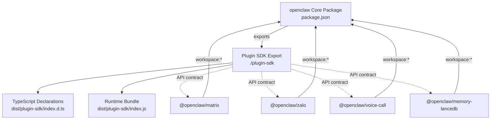
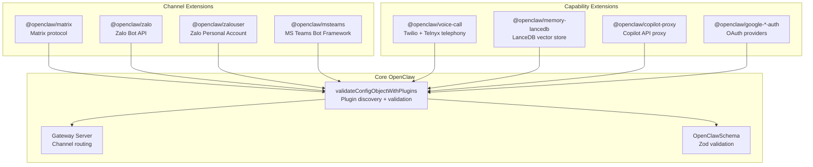
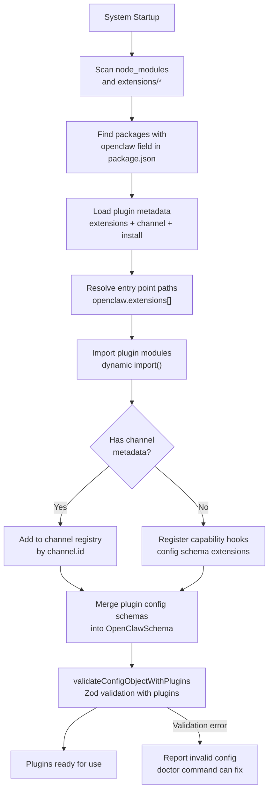
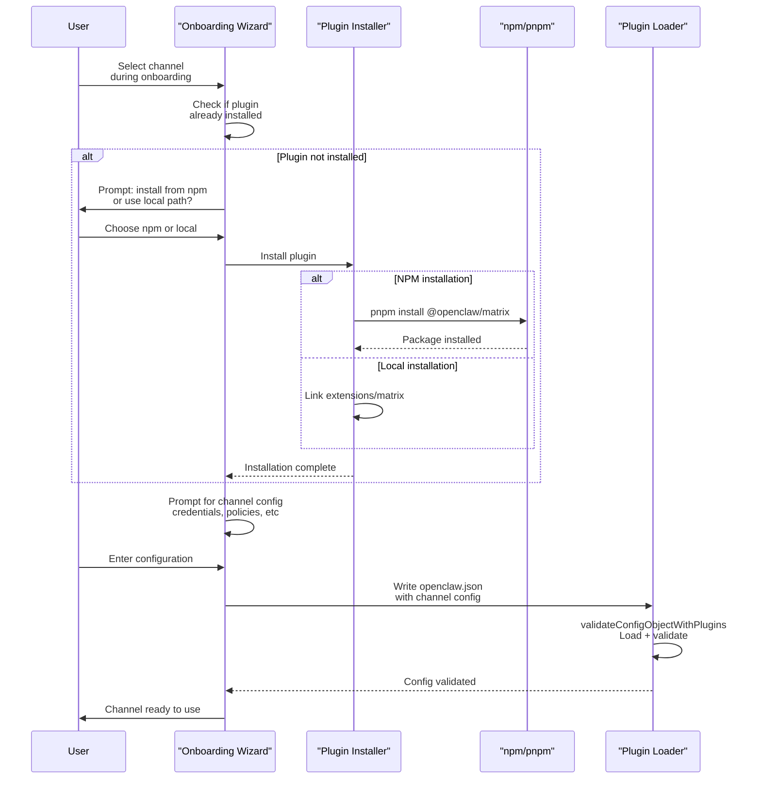
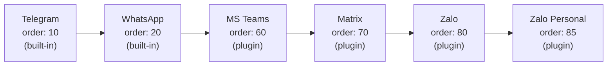
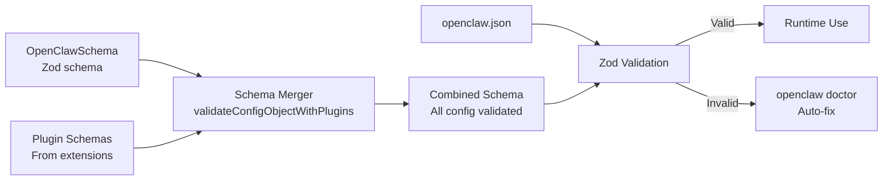

# プラグインシステム概要

<details>
<summary>関連ソースファイル</summary>

この Wiki ページの生成に使用されたコンテキストファイル:

- [extensions/copilot-proxy/package.json](extensions/copilot-proxy/package.json)
- [extensions/google-antigravity-auth/package.json](extensions/google-antigravity-auth/package.json)
- [extensions/google-gemini-cli-auth/package.json](extensions/google-gemini-cli-auth/package.json)
- [extensions/matrix/CHANGELOG.md](extensions/matrix/CHANGELOG.md)
- [extensions/matrix/package.json](extensions/matrix/package.json)
- [extensions/memory-lancedb/package.json](extensions/memory-lancedb/package.json)
- [extensions/msteams/CHANGELOG.md](extensions/msteams/CHANGELOG.md)
- [extensions/msteams/package.json](extensions/msteams/package.json)
- [extensions/voice-call/CHANGELOG.md](extensions/voice-call/CHANGELOG.md)
- [extensions/voice-call/package.json](extensions/voice-call/package.json)
- [extensions/zalo/CHANGELOG.md](extensions/zalo/CHANGELOG.md)
- [extensions/zalo/package.json](extensions/zalo/package.json)
- [extensions/zalouser/package.json](extensions/zalouser/package.json)
- [package.json](package.json)
- [pnpm-lock.yaml](pnpm-lock.yaml)

</details>

プラグインシステムは、コアコードを変更せずに OpenClaw をモジュール式に拡張することを可能にします。プラグインはメッセージングチャネル（Matrix、Zalo、MS Teams）や機能（音声通話、代替メモリバックエンド、認証プロバイダー）を追加できます。すべてのプラグインは Plugin SDK API コントラクトを使用し、`package.json` でメタデータを宣言することで、コアシステムが自動的に発見、検証、統合できるようにします。

カスタムプラグインの作成については、[カスタムプラグインの作成](#10.3)を参照してください。特定の組み込み拡張機能の詳細については、[組み込み拡張機能](#10.2)を参照してください。

---

## Plugin SDK エクスポート

OpenClaw は `./plugin-sdk` で Plugin SDK をエクスポートし、すべての拡張機能が従うべき API コントラクトを提供します。SDK は TypeScript 宣言ファイルと共に個別にビルドされ、安定したインターフェースとしてバンドルされます。

[package.json:25-32]()



**ソース:** [package.json:25-32]()

---

## プラグインパッケージ構造

すべてのプラグインは npm パッケージであり、`package.json` にメタデータとエントリポイントを宣言する `openclaw` フィールドを持ちます。構造はチャネルプラグインと機能プラグインで異なります。

### チャネルプラグインメタデータ

チャネルプラグインはメッセージングプラットフォームのサポートを追加し、`openclaw.channel` メタデータを宣言する必要があります：

| フィールド | 型 | 目的 |
|----------|-----|------|
| `id` | string | 一意のチャネル識別子（例: `"matrix"`, `"zalo"`） |
| `label` | string | 表示名（例: `"Matrix"`, `"Zalo"`） |
| `selectionLabel` | string | オンボーディングウィザードで表示されるラベル |
| `docsPath` | string | ドキュメントパス（例: `"/channels/matrix"`） |
| `docsLabel` | string | ドキュメントリンクのラベル |
| `blurb` | string | 選択 UI 用の簡潔な説明 |
| `order` | number | 選択優先度（低い = 高優先度） |
| `aliases` | string[] | オプションの短いエイリアス（例: `["zl"]`） |
| `quickstartAllowFrom` | boolean | クイックスタートで allowFrom 設定を表示するかどうか |

[extensions/matrix/package.json:16-35]()

```json
{
  "openclaw": {
    "extensions": ["./index.ts"],
    "channel": {
      "id": "matrix",
      "label": "Matrix",
      "selectionLabel": "Matrix (plugin)",
      "docsPath": "/channels/matrix",
      "docsLabel": "matrix",
      "blurb": "open protocol; install the plugin to enable.",
      "order": 70,
      "quickstartAllowFrom": true
    },
    "install": {
      "npmSpec": "@openclaw/matrix",
      "localPath": "extensions/matrix",
      "defaultChoice": "npm"
    }
  }
}
```

### 機能プラグインメタデータ

機能プラグイン（音声、メモリバックエンド、認証プロバイダー）は `channel` フィールドなしのシンプルなメタデータを宣言します：

[extensions/voice-call/package.json:14-19]()

```json
{
  "openclaw": {
    "extensions": ["./index.ts"]
  }
}
```

**ソース:** [extensions/matrix/package.json:16-35](), [extensions/zalo/package.json:12-35](), [extensions/msteams/package.json:16-38](), [extensions/voice-call/package.json:14-19](), [extensions/memory-lancedb/package.json:15-20]()

---

## プラグインタイプ



### チャネル拡張機能

チャネル拡張機能はメッセージングプラットフォームのサポートを追加します。それぞれが一意の `channel.id` と選択メタデータを宣言します。例：

- **@openclaw/matrix**: ホームサーバー認証付きのオープン Matrix プロトコル
- **@openclaw/zalo**: ベトナム市場向けの Zalo Bot API
- **@openclaw/zalouser**: QR ログイン経由の Zalo 個人アカウント
- **@openclaw/msteams**: Microsoft Teams Bot Framework

### 機能拡張機能

機能拡張機能はチャネル UI なしで機能を追加します：

- **@openclaw/voice-call**: Twilio/Telnyx 経由のテレフォニー
- **@openclaw/memory-lancedb**: LanceDB ベクトルメモリバックエンド
- **@openclaw/copilot-proxy**: GitHub Copilot API プロキシ
- **@openclaw/google-*-auth**: OAuth 認証プロバイダー

**ソース:** [extensions/matrix/package.json:1-36](), [extensions/zalo/package.json:1-35](), [extensions/zalouser/package.json:1-35](), [extensions/msteams/package.json:1-38](), [extensions/voice-call/package.json:1-19](), [extensions/memory-lancedb/package.json:1-20]()

---

## プラグイン発見と読み込み



`validateConfigObjectWithPlugins` 関数がプラグイン読み込みを調整します：

1. **発見**: `openclaw` フィールドを持つパッケージの `node_modules/@openclaw/*` と `extensions/*` をスキャン
2. **メタデータ抽出**: `package.json` から `extensions`、`channel`、`install` フィールドを読み取る
3. **エントリポイント解決**: `openclaw.extensions[]` 配列内のパスを解決
4. **モジュールインポート**: プラグインエントリポイントを動的にインポート
5. **スキーママージ**: プラグイン Zod スキーマをコア OpenClawSchema と結合
6. **検証**: 完全な設定をマージされたスキーマに対して検証
7. **登録**: チャネルと機能フックをランタイム用に登録

**ソース:** 高レベルアーキテクチャ図から参照、プラグインメタデータ構造から推測

---

## インストールフロー



プラグインは以下の方法でインストールできます：

1. **npm/pnpm**: `pnpm install @openclaw/matrix` で npm レジストリからインストール
2. **ローカル開発**: モノレポ開発用に `extensions/matrix` をリンク
3. **オンボーディング中の自動インストール**: ウィザードがチャネル選択時にインストールを促す

`openclaw.install` メタデータはインストールオプションを宣言します：

```json
{
  "install": {
    "npmSpec": "@openclaw/matrix",
    "localPath": "extensions/matrix",
    "defaultChoice": "npm"
  }
}
```

**ソース:** [extensions/matrix/package.json:30-35](), [extensions/zalo/package.json:29-34]()

---

## ワークスペース依存関係

すべての公式プラグインはコア `openclaw` パッケージへの `workspace:*` 依存関係を使用し、モノレポ開発を可能にします：

[extensions/matrix/package.json:13-15]()

```json
{
  "devDependencies": {
    "openclaw": "workspace:*"
  }
}
```

このパターンの利点：
- **開発**: コアとプラグインを同時に編集可能
- **型安全性**: プラグインが現在の Plugin SDK 型を使用することを保証
- **テスト**: コアとプラグイン間の統合テストが可能
- **公開**: pnpm は公開時に `workspace:*` を正確なバージョンに解決

[pnpm-lock.yaml:243-247]() はワークスペース解決を示しています：

```yaml
extensions/bluebubbles:
  devDependencies:
    openclaw:
      specifier: workspace:*
      version: link:../..
```

**ソース:** [extensions/matrix/package.json:13-15](), [extensions/zalo/package.json:9-11](), [extensions/msteams/package.json:13-15](), [pnpm-lock.yaml:243-247]()

---

## チャネルメタデータプロパティ

`openclaw.channel` オブジェクトは、チャネルが選択 UI とドキュメントにどのように表示されるかを制御します：

### 選択順序

チャネルは昇順の `order` で表示されます：



低い `order` 値が以下で最初に表示されます：
- オンボーディングウィザードのチャネル選択
- CLI チャネル一覧
- ドキュメントのチャネルテーブル

### ラベルと表示

| フィールド | 例 | 使用法 |
|----------|-----|-------|
| `label` | `"Matrix"` | UI 用の短い名前 |
| `selectionLabel` | `"Matrix (plugin)"` | オンボーディングウィザードのオプション |
| `blurb` | `"open protocol; install the plugin to enable."` | 選択時のヘルプテキスト |
| `docsLabel` | `"matrix"` | ドキュメントパス用の小文字 |

### エイリアス

`aliases` 配列は短いコマンド代替を提供します：

[extensions/zalo/package.json:23-25]()

```json
{
  "aliases": ["zl"]
}
```

`openclaw channels add zalo` の代わりに `openclaw channels add zl` が使用できます。

**ソース:** [extensions/matrix/package.json:20-28](), [extensions/zalo/package.json:16-27](), [extensions/msteams/package.json:20-30]()

---

## 拡張機能エントリポイント

`openclaw.extensions` 配列はモジュールエントリポイントを宣言します：

[extensions/matrix/package.json:17-19]()

```json
{
  "extensions": ["./index.ts"]
}
```

エントリポイントは以下をエクスポートする必要があります：
- **チャネルモニター**: チャネルプラグインの場合、チャネル実装をエクスポート
- **設定スキーマ**: プラグイン固有の設定セクション用の Zod スキーマ
- **フック**: 初期化、シャットダウン等のライフサイクルフック

複数のエントリポイントがサポートされています：

```json
{
  "extensions": [
    "./channels/primary.ts",
    "./capabilities/secondary.ts"
  ]
}
```

**ソース:** [extensions/matrix/package.json:17-19](), [extensions/voice-call/package.json:15-17]()

---

## プラグイン検証

プラグインローダーは、プラグインスキーマをコアスキーマとマージすることで設定を検証します：



これにより以下が保証されます：
1. **型安全性**: すべてのプラグイン設定セクションが検証される
2. **スキーマ進化**: プラグインは検証ルールを拡張できる
3. **エラー報告**: 正確なエラーメッセージがプラグインスキーマを引用
4. **自動修復**: `openclaw doctor` がプラグイン設定を移行/修正できる

**ソース:** 高レベルアーキテクチャ図とプラグイン構造から参照

---

## プラグインタイプ概要

| プラグインタイプ | `channel` メタデータあり | UI 選択を追加 | 例 |
|---------------|------------------------|--------------|-----|
| **チャネル拡張機能** | はい | はい | Matrix, Zalo, MS Teams |
| **機能拡張機能** | いいえ | いいえ | Voice Call, Memory LanceDB |
| **認証プロバイダー** | いいえ | いいえ | Google OAuth プラグイン |
| **メモリバックエンド** | いいえ | いいえ | LanceDB 代替 |

**ソース:** [extensions/matrix/package.json:16-35](), [extensions/voice-call/package.json:14-19](), [extensions/memory-lancedb/package.json:15-20](), [extensions/copilot-proxy/package.json:10-15]()
