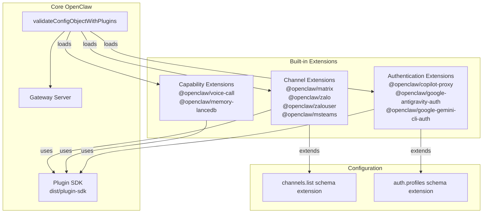
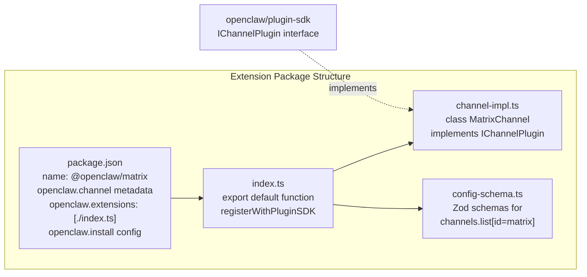
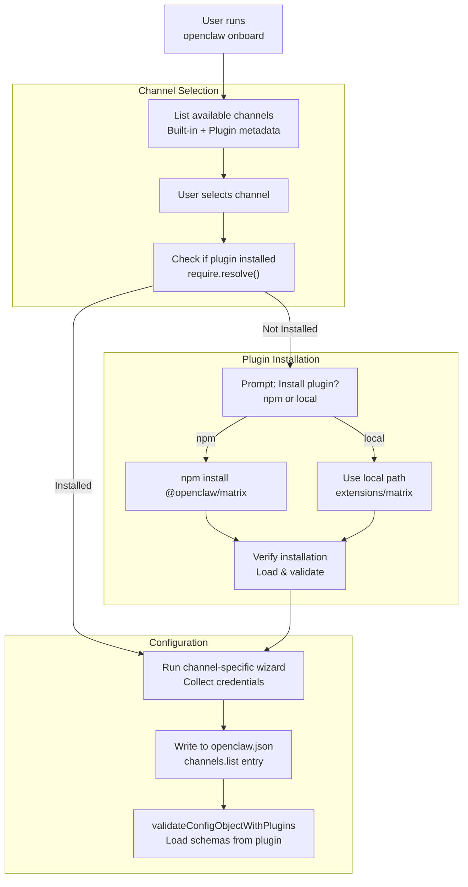
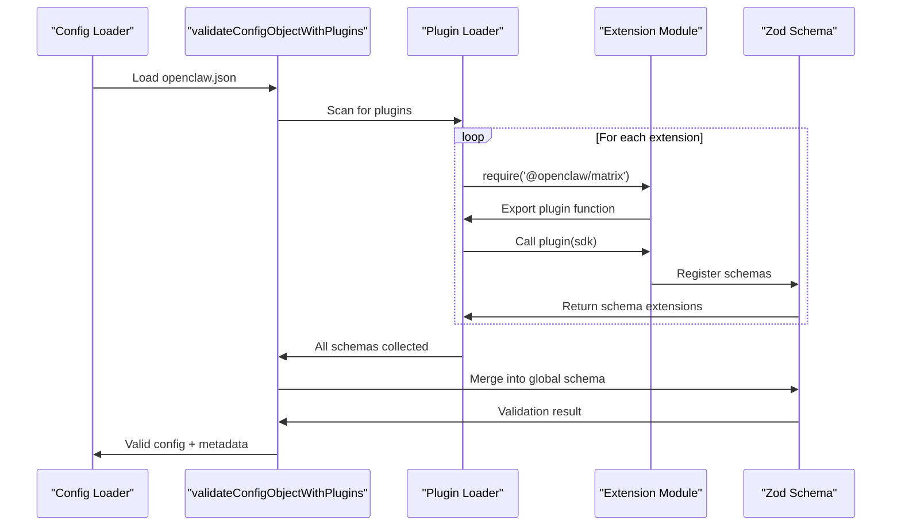

# 組み込み拡張機能

<details>
<summary>関連ソースファイル</summary>

この Wiki ページの生成に使用されたコンテキストファイル:

- [extensions/copilot-proxy/package.json](extensions/copilot-proxy/package.json)
- [extensions/google-antigravity-auth/package.json](extensions/google-antigravity-auth/package.json)
- [extensions/google-gemini-cli-auth/package.json](extensions/google-gemini-cli-auth/package.json)
- [extensions/matrix/CHANGELOG.md](extensions/matrix/CHANGELOG.md)
- [extensions/matrix/package.json](extensions/matrix/package.json)
- [extensions/memory-lancedb/package.json](extensions/memory-lancedb/package.json)
- [extensions/msteams/CHANGELOG.md](extensions/msteams/CHANGELOG.md)
- [extensions/msteams/package.json](extensions/msteams/package.json)
- [extensions/voice-call/CHANGELOG.md](extensions/voice-call/CHANGELOG.md)
- [extensions/voice-call/package.json](extensions/voice-call/package.json)
- [extensions/zalo/CHANGELOG.md](extensions/zalo/CHANGELOG.md)
- [extensions/zalo/package.json](extensions/zalo/package.json)
- [extensions/zalouser/package.json](extensions/zalouser/package.json)
- [package.json](package.json)
- [pnpm-lock.yaml](pnpm-lock.yaml)

</details>

このページでは、コア組み込みチャネル以外のチャネル統合と拡張機能を追加する、OpenClaw と共に配布される公式拡張機能について説明します。これらの拡張機能は `@openclaw/` 名前空間の下で別々の npm パッケージとして公開され、npm 経由でインストールするか、開発中にローカルモノレポから使用できます。

プラグインシステムのアーキテクチャ、SDK、拡張機能の読み込み方法については、[プラグインシステム概要](#10.1)を参照してください。独自のカスタムプラグインを作成するためのガイダンスについては、[カスタムプラグインの作成](#10.3)を参照してください。

---

## 拡張機能カテゴリ

OpenClaw 拡張機能は 3 つの機能カテゴリに分類されます：

| カテゴリ | 目的 | 例 |
|--------|------|-----|
| **チャネル拡張機能** | メッセージングプラットフォーム統合を追加 | Matrix, Zalo, MS Teams, Zalo Personal |
| **機能拡張機能** | システム機能を拡張 | Voice Call, Memory LanceDB |
| **認証拡張機能** | AI プロバイダー用の OAuth または認証フローを提供 | Google Antigravity Auth, Gemini CLI Auth, Copilot Proxy |

**拡張機能タクソノミー**



ソース: [package.json:1-217](), [extensions/matrix/package.json:1-37](), [extensions/zalo/package.json:1-36](), [extensions/msteams/package.json:1-39](), [extensions/voice-call/package.json:1-20]()

---

## チャネル拡張機能

チャネル拡張機能は OpenClaw のコアに含まれていないメッセージングプラットフォームのサポートを追加します。チャネルルーティングシステムに統合され、組み込みチャネルと共にオンボーディングウィザードに表示されます。

### 拡張機能メタデータ構造

チャネル拡張機能は `openclaw.channel` フィールドを使用して `package.json` でメタデータを宣言します：

| フィールド | 型 | 説明 |
|----------|-----|------|
| `id` | string | 一意のチャネル識別子（例: `"matrix"`） |
| `label` | string | UI に表示される名前 |
| `selectionLabel` | string | オンボーディングチャネル選択で表示されるラベル |
| `docsPath` | string | ドキュメントページへのパス |
| `docsLabel` | string | ドキュメントリンク用のラベル |
| `blurb` | string | ウィザードで表示される短い説明 |
| `aliases` | string[] | CLI コマンド用の代替短縮名 |
| `order` | number | 選択リストのソート順（高い = 後） |
| `quickstartAllowFrom` | boolean | クイックスタートで allowFrom 設定を表示するかどうか |

**チャネル拡張機能パッケージ構造**



ソース: [extensions/matrix/package.json:16-35](), [extensions/zalo/package.json:12-35](), [extensions/msteams/package.json:16-38]()

### Matrix

**パッケージ:** `@openclaw/matrix`
**チャネル ID:** `matrix`
**選択順序:** 70

Matrix はオープンソースのフェデレーテッドメッセージングプロトコルです。この拡張機能はアクセストークンまたはパスワード認証によるホームサーバー接続をサポートします。

**機能:**
- ペアリング/許可リスト/オープン/無効ポリシー付きダイレクトメッセージサポート
- ルームごとの設定オーバーライド付きグループ/ルームサポート
- 設定可能な返信モード（`off`/`inbound`/`always`）付きスレッド処理
- テキストメッセージチャンキング（Matrix メッセージサイズ制限）
- サイズ上限付きメディアアップロード/ダウンロード
- リアクション（追加、削除、一覧）
- メッセージ編集と削除
- 入力インジケーター
- 投票（作成、投票）
- ルームアクション: メッセージのピン留め/解除、メンバー情報、ルーム情報
- 許可リストサポート付き自動参加招待

**設定要件:**
```typescript
{
  channels: {
    list: [
      {
        id: "matrix",
        homeserver: "https://matrix.org",
        userId: "@bot:matrix.org",
        // Either:
        accessToken: "syt_...",
        // Or:
        password: "...",
        deviceName: "OpenClaw Bot"
      }
    ]
  }
}
```

**依存関係:**
- `@vector-im/matrix-bot-sdk`: Matrix クライアントライブラリ
- `@matrix-org/matrix-sdk-crypto-nodejs`: E2E 暗号化サポート
- `markdown-it`: Markdown フォーマット
- `music-metadata`: オーディオファイルメタデータ抽出

ソース: [extensions/matrix/package.json:1-37](), [extensions/matrix/CHANGELOG.md:101-112]()

### Zalo (Bot API)

**パッケージ:** `@openclaw/zalo`
**チャネル ID:** `zalo`
**エイリアス:** `zl`
**選択順序:** 80

Zalo はベトナム向けのメッセージングプラットフォームです。この拡張機能は公式ビジネスボットアカウント用の Zalo Bot API を使用します。

**機能:**
- ダイレクトメッセージのみサポート（DM）
- セキュリティポリシー: ペアリング、許可リスト、オープン、無効
- ポーリングとウェブフック配信モード
- 2000 文字チャンキング付きテキストメッセージング
- サイズ上限付き画像アップロード
- マルチアカウントサポート（複数のボットアカウント）

**設定要件:**
```typescript
{
  channels: {
    list: [
      {
        id: "zalo",
        appId: "...",
        accessToken: "...", // or from env/file
        // Optional:
        deliveryMode: "polling", // or "webhook"
        pollingInterval: 3000
      }
    ]
  }
}
```

**トークンソース:**
この拡張機能は以下の優先順位でトークンを検索します：
1. 設定内の `accessToken` フィールド
2. `ZALO_ACCESS_TOKEN` 環境変数
3. `~/.openclaw/.zalo-token` ファイル

ソース: [extensions/zalo/package.json:1-36](), [extensions/zalo/CHANGELOG.md:106-113]()

### Zalo Personal

**パッケージ:** `@openclaw/zalouser`
**チャネル ID:** `zalouser`
**エイリアス:** `zlu`
**選択順序:** 85

Zalo Personal Account 拡張機能は `zca-cli` ツールを介して QR コード認証を使用して個人の Zalo アカウントに接続します。

**機能:**
- QR コード経由の個人アカウントログイン
- Zalo Bot API と同様の DM ポリシー
- ダイレクトメッセージサポート

**前提条件:**
`zca-cli` が別途インストールされている必要があります（バンドルされていません）。

**設定要件:**
```typescript
{
  channels: {
    list: [
      {
        id: "zalouser",
        // QR authentication flow during login
      }
    ]
  }
}
```

ソース: [extensions/zalouser/package.json:1-36]()

### Microsoft Teams

**パッケージ:** `@openclaw/msteams`
**チャネル ID:** `msteams`
**エイリアス:** `teams`
**選択順序:** 60

Microsoft Teams 統合は Azure Bot Framework を使用します。完全なウェブフックインフラストラクチャでエンタープライズ Teams デプロイをサポートします。

**機能:**
- ダイレクトメッセージ、グループチャット、チャネル、スレッド
- Express サーバーと JWT 認証付き Bot Framework ゲートウェイ
- `/api/messages` フォールバック付き設定可能なウェブフックパス/ポート
- DM ペアリング/許可リスト強制
- チーム/チャネルごとのオーバーライド付きグループポリシー
- グループメッセージ用のメンションゲーティング
- 履歴コンテキスト付き受信デバウンス
- 保存された会話参照経由のプロアクティブメッセージング（TTL/サイズプルーニング付きファイルストア）
- Markdown テキストチャンキング（4k 文字制限）
- メディア処理: 分割/インラインメディア、添付プレースホルダー、HTML 要約
- Adaptive Card 投票: カード構築、投票解析、投票状態永続化
- ホスト許可リストと認証スコープフォールバック付きメディアダウンロード
- `hostedContents` と `attachments` 用 Graph API 統合
- 一時的/スロットル送信時のリトライ/バックオフとエラー分類

**設定要件:**
```typescript
{
  channels: {
    list: [
      {
        id: "msteams",
        appId: "...",          // Azure Bot app ID
        appPassword: "...",    // Azure Bot app password
        // Optional webhook config:
        webhookPath: "/api/messages",
        webhookPort: 3978
      }
    ]
  }
}
```

**Azure Bot セットアップ:**
1. Azure Portal で Azure Bot を作成
2. OpenClaw ウェブフックを指すようにメッセージングエンドポイントを設定
3. メディアアクセス用に必要な Graph API 権限を付与

ソース: [extensions/msteams/package.json:1-39](), [extensions/msteams/CHANGELOG.md:94-108]()

---

## 機能拡張機能

機能拡張機能は特定のメッセージングチャネルに依存しない新しい機能を OpenClaw に追加します。

### Voice Call

**パッケージ:** `@openclaw/voice-call`
**プライベート:** いいえ

Voice Call 拡張機能は、テレフォニープロバイダーとリアルタイム音声処理を使用して、エージェントとの電話ベースの対話を可能にします。

**サポートされるプロバイダー:**
- **Twilio:** Programmable Voice + Media Streams
- **Telnyx:** Call Control v2
- **Mock Provider:** ローカル開発/テスト用

**機能:**

**通話フロー:**
- アウトバウンド通知モード（一方向のアナウンス）
- アウトバウンド会話モード（マルチターンダイアログ）
- ポリシー制御付きインバウンド処理（無効/許可リスト/オープン）
- 設定可能な自動切断タイムアウト
- マルチターン継続

**音声処理:**
- メディア WebSocket 経由のストリーミング STT 用 OpenAI Realtime API
- 部分および最終トランスクリプト処理
- OpenAI TTS（モデル/音声/指示が設定可能）
- 基本的な TTS 用 Twilio `<Say>` フォールバック
- ElevenLabs TTS サポート
- Edge TTS はテレフォニーでは無視される（ループバックのみ）

**インフラストラクチャ:**
- 設定可能なバインド/ポート/パス付きビルトインウェブフックサーバー
- カスタムリバースプロキシ用 `publicUrl` オーバーライド
- 公開ヘルパー: ngrok と Tailscale serve/funnel
- ngrok 無料枠用開発専用署名バイパス（ループバックのみ）

**ツール:**
- アクション付き `voice_call` ツール: `initiate`, `continue`, `speak`, `end`, `status`
- ゲートウェイ RPC メソッド: `voicecall.initiate|continue|speak|end|status`
- CLI コマンド: `openclaw voicecall call/start/continue/speak/end/status/tail/expose`

**オブザーバビリティ:**
- 各通話の JSONL 通話ログ
- ライブ検査用 `voicecall tail` コマンド
- アクティブな通話のステータス報告

**応答制御:**
```typescript
{
  voiceCall: {
    provider: "twilio", // or "telnyx" or "mock"
    twilio: {
      accountSid: "...",
      authToken: "...",
      phoneNumber: "+1234567890"
    },
    webhook: {
      bind: "0.0.0.0",
      port: 5050,
      path: "/voice"
    },
    inbound: {
      policy: "allowlist", // or "open" or "disabled"
      allowFrom: ["+1234567890"],
      greeting: "Hello, this is OpenClaw."
    },
    responseModel: "gpt-4o",
    responseSystemPrompt: "You are a helpful voice assistant.",
    responseTimeoutMs: 30000
  }
}
```

**TTS 設定:**
Voice Call TTS はコア `messages.tts` 設定を使用するようになりました。プラグイン固有の TTS 設定はコア設定とディープマージされます。テレフォニーでは OpenAI と ElevenLabs がサポートされています。Edge TTS は通話では無視されます。

ソース: [extensions/voice-call/package.json:1-20](), [extensions/voice-call/CHANGELOG.md:114-133]()

### Memory LanceDB

**パッケージ:** `@openclaw/memory-lancedb`
**プライベート:** はい（内部拡張機能）

組み込みの SQLite ベースのメモリシステムの代わりに LanceDB を使用する代替メモリバックエンド。自動リコールとキャプチャ機能付きのベクトルデータベース機能を提供します。

**機能:**
- LanceDB ベクトルデータベースストレージ
- 自動リコール: 関連するメモリを自動的に検索してコンテキストに注入
- 自動キャプチャ: 会話から重要な情報を自動的に抽出して保存
- OpenAI エンベディング統合

**依存関係:**
- `@lancedb/lancedb`: ベクトルデータベースライブラリ
- `openai`: エンベディング API クライアント

**注意:** この拡張機能はプライベートとしてマークされており、主に代替メモリバックエンドの内部実験用です。コアメモリシステム（[7](#7) ページ）はほとんどのデプロイで SQLite と sqlite-vec を使用します。

ソース: [extensions/memory-lancedb/package.json:1-20]()

---

## 認証拡張機能

認証拡張機能は、単純な API キー以外の複雑な認証を必要とする AI モデルプロバイダー用の OAuth フローと認証メカニズムを提供します。

### Copilot Proxy

**パッケージ:** `@openclaw/copilot-proxy`
**プライベート:** はい

GitHub Copilot API アクセスを AI プロバイダーバックエンドとして使用できるようにします。Copilot の認証レイヤーを通じてリクエストをプロキシします。

**使用例:** GitHub Copilot サブスクリプションを持つ開発者がエージェント対話に Copilot モデルを使用できるようにします。

ソース: [extensions/copilot-proxy/package.json:1-16]()

### Google Antigravity Auth

**パッケージ:** `@openclaw/google-antigravity-auth`
**プライベート:** はい

Google の Antigravity AI プラットフォーム用の OAuth 認証フローを提供します。

**目的:** Google Antigravity モデルにアクセスするための OAuth トークン取得とリフレッシュを処理します。

ソース: [extensions/google-antigravity-auth/package.json:1-16]()

### Google Gemini CLI Auth

**パッケージ:** `@openclaw/google-gemini-cli-auth`
**プライベート:** はい

Google Gemini API アクセス用の CLI ベースの OAuth 認証を提供します。

**目的:** API キーが利用できないまたは推奨されない場合に、Gemini モデル用の対話型 OAuth フローを有効にします。

ソース: [extensions/google-gemini-cli-auth/package.json:1-16]()

---

## インストールと発見

**インストールフロー**



ソース: [extensions/matrix/package.json:29-35](), [extensions/zalo/package.json:28-34]()

### インストール方法

**1. NPM インストール（本番環境）**

拡張機能は npm に公開され、通常のパッケージのようにインストールできます：

```bash
npm install @openclaw/matrix
# or
pnpm add @openclaw/matrix
```

各拡張機能の `package.json` の `openclaw.install.npmSpec` フィールドが npm パッケージ名を指定します。

**2. ローカル開発（モノレポ）**

開発中、拡張機能はモノレポから使用できます：

```bash
# Extensions already linked via workspace:* dependencies
pnpm install
```

`openclaw.install.localPath` フィールドはモノレポ内の相対パスを指定します（例: `extensions/matrix`）。

**3. オンボーディングウィザード自動インストール**

オンボーディングウィザードは、選択したチャネルがプラグインを必要とする場合にインストールを促します：

```
? Matrix requires plugin @openclaw/matrix. Install it?
  › npm (recommended)
    local (development)
    skip
```

ソース: [extensions/matrix/package.json:30-35](), [extensions/zalo/package.json:29-34](), [extensions/msteams/package.json:32-37]()

### プラグイン発見

OpenClaw は 2 つのメカニズムを通じてインストールされたプラグインを発見します：

**1. パッケージスキャン**

設定ローダーは `node_modules` ツリーからパッケージ名を `require()` しようとします。拡張機能は `openclaw.install.npmSpec` でパッケージ名を宣言します。

**2. ワークスペースプロトコル**

モノレポでは、すべての拡張機能が `workspace:*` 依存関係を使用し、開発中に pnpm がローカルパスに解決します。

```typescript
{
  "devDependencies": {
    "openclaw": "workspace:*"
  }
}
```

これにより、拡張機能は常にコア OpenClaw の現在の開発バージョンを使用することが保証されます。

ソース: [extensions/matrix/package.json:14-15](), [extensions/zalo/package.json:10-11](), [pnpm-lock.yaml:245-247]()

---

## 拡張機能パッケージ構造

すべての組み込み拡張機能は一貫したパッケージ構造に従います：

**共通パッケージフィールド**

| フィールド | 目的 | 例 |
|----------|------|-----|
| `name` | npm パッケージ名 | `"@openclaw/matrix"` |
| `version` | コア OpenClaw と同期 | `"2026.2.12"` |
| `type` | モジュールタイプ | `"module"` |
| `dependencies` | ランタイム依存関係 | プロバイダー SDK、スキーマライブラリ |
| `devDependencies` | コア OpenClaw 参照 | `"openclaw": "workspace:*"` |
| `openclaw.extensions` | エントリポイントパス | `["./index.ts"]` |

**チャネル固有フィールド**

チャネル拡張機能は上記のドキュメント通りに `openclaw.channel` と `openclaw.install` メタデータを追加します。

**バージョン整列**

拡張機能バージョンはコア OpenClaw リリースと同期されます。`pnpm plugins:sync` スクリプトはすべての拡張機能バージョンをコアパッケージに合わせて更新します。

ソース: [extensions/matrix/package.json:1-37](), [extensions/voice-call/package.json:1-20](), [package.json:74]()

---

## 拡張機能の読み込みと検証

**プラグイン読み込みフロー**



**主要関数:**

- `validateConfigObjectWithPlugins`: [src/config/validation.ts]() - プラグインを発見して読み込むメイン検証エントリポイント
- Plugin SDK エクスポート: [src/plugin-sdk/index.ts]() - `IChannelPlugin` とその他のインターフェースを提供
- チャネルメタデータ登録: 各拡張機能の `index.ts` - スキーマと機能を登録

**スキーマ拡張:**

拡張機能はグローバル `OpenClawSchema` にマージされる Zod スキーマを提供します。チャネルプラグインの場合、これは通常、新しいチャネルタイプを受け入れるために `channels.list` 配列スキーマを拡張します。

```typescript
// スキーマ拡張を示す擬似コード
const baseChannelsSchema = z.array(z.union([
  TelegramChannelSchema,
  WhatsAppChannelSchema,
  // ... built-in channels
]));

// Matrix プラグイン読み込み後:
const extendedChannelsSchema = z.array(z.union([
  TelegramChannelSchema,
  WhatsAppChannelSchema,
  MatrixChannelSchema, // Added by plugin
  // ... other channels
]));
```

ソース: [package.json:28-30](), [extensions/matrix/package.json:17-19]()

---

## 拡張機能開発ガイドライン

**ワークスペース依存関係:**

すべての拡張機能はコア `openclaw` 依存関係に `workspace:*` を使用する必要があります：

```json
{
  "devDependencies": {
    "openclaw": "workspace:*"
  }
}
```

これにより、開発中の型互換性が保証され、モノレポがローカルビルドを使用できるようになります。

**バージョン同期:**

拡張機能バージョンは `pnpm plugins:sync` スクリプトによってコア OpenClaw と自動的に同期されます。リリースを作成する際は、以下を実行します：

```bash
pnpm plugins:sync
```

これにより、すべての `extensions/*/package.json` バージョンがルートパッケージバージョンに一致するように更新されます。

**公開:**

チャネル拡張機能（`matrix`、`zalo`、`msteams`、`zalouser`）は npm に公開され、ユーザーがインストールできます。`private: true` とマークされた認証と機能拡張機能は公開されません。

ソース: [package.json:74](), [extensions/matrix/package.json:14-15](), [extensions/memory-lancedb/package.json:4]()
