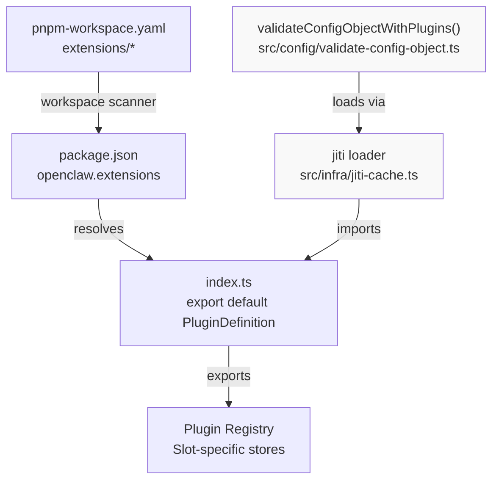
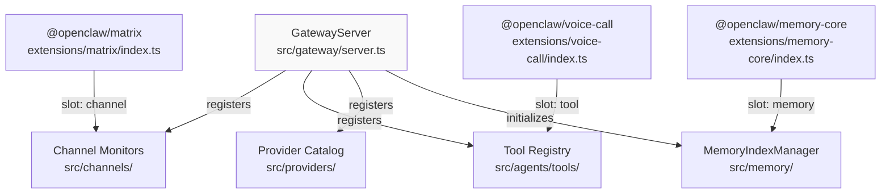
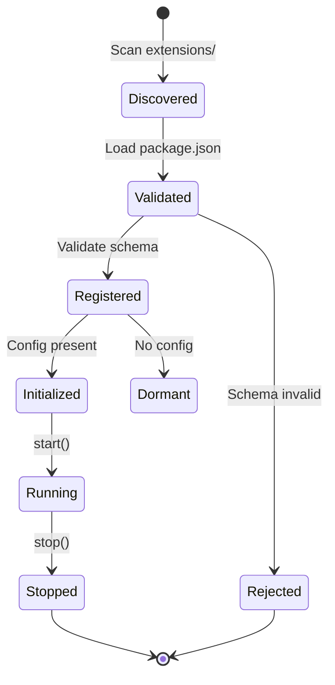

# カスタムプラグインの作成

<details>
<summary>関連ソースファイル</summary>

この Wiki ページの生成に使用されたコンテキストファイル:

- [.agents/skills/mintlify/SKILL.md](.agents/skills/mintlify/SKILL.md)
- [.github/ISSUE_TEMPLATE/bug_report.md](.github/ISSUE_TEMPLATE/bug_report.md)
- [.github/ISSUE_TEMPLATE/config.yml](.github/ISSUE_TEMPLATE/config.yml)
- [.github/ISSUE_TEMPLATE/feature_request.md](.github/ISSUE_TEMPLATE/feature_request.md)
- [.github/labeler.yml](.github/labeler.yml)
- [.github/workflows/auto-response.yml](.github/workflows/auto-response.yml)
- [.github/workflows/labeler.yml](.github/workflows/labeler.yml)
- [.github/workflows/stale.yml](.github/workflows/stale.yml)
- [AGENTS.md](AGENTS.md)
- [docs/channels/index.md](docs/channels/index.md)
- [docs/zh-CN/channels/index.md](docs/zh-CN/channels/index.md)
- [extensions/copilot-proxy/package.json](extensions/copilot-proxy/package.json)
- [extensions/google-antigravity-auth/package.json](extensions/google-antigravity-auth/package.json)
- [extensions/google-gemini-cli-auth/package.json](extensions/google-gemini-cli-auth/package.json)
- [extensions/matrix/CHANGELOG.md](extensions/matrix/CHANGELOG.md)
- [extensions/matrix/package.json](extensions/matrix/package.json)
- [extensions/memory-lancedb/package.json](extensions/memory-lancedb/package.json)
- [extensions/msteams/CHANGELOG.md](extensions/msteams/CHANGELOG.md)
- [extensions/msteams/package.json](extensions/msteams/package.json)
- [extensions/voice-call/CHANGELOG.md](extensions/voice-call/CHANGELOG.md)
- [extensions/voice-call/package.json](extensions/voice-call/package.json)
- [extensions/zalo/CHANGELOG.md](extensions/zalo/CHANGELOG.md)
- [extensions/zalo/package.json](extensions/zalo/package.json)
- [extensions/zalouser/package.json](extensions/zalouser/package.json)
- [package.json](package.json)
- [pnpm-lock.yaml](pnpm-lock.yaml)
- [scripts/sync-labels.ts](scripts/sync-labels.ts)

</details>

このページでは、カスタム OpenClaw プラグインを構築するためのステップバイステップガイドを提供します。パッケージ構造、SDK インポート、4 つのプラグインスロットタイプ（Channel、Tool、Provider、Memory）の実装パターンについて説明します。

プラグインがゲートウェイに統合される仕組みのアーキテクチャ詳細については、10.1 ページを参照してください。バンドルされた拡張機能の例については、10.2 ページを参照してください。

---

## プラグインパッケージ構造

OpenClaw は `package.json` ファイルの `openclaw.extensions` フィールドをスキャンしてプラグインを発見します。プラグインローダーはワークスペースパスまたは node_modules ルックアップを使用してエントリポイントを解決します。

### 最小限のパッケージマニフェスト

プラグインにはエントリポイント宣言付きの `package.json` が必要です：

```json
{
  "name": "@openclaw/my-plugin",
  "version": "2026.2.12",
  "type": "module",
  "openclaw": {
    "extensions": ["./index.ts"]
  }
}
```

エントリポイントファイル（`./index.ts`）は、スロットタイプ、設定スキーマ、初期化関数を宣言するプラグイン定義オブジェクトをエクスポートする必要があります。

**ソース:** [extensions/memory-core/package.json:1-17](), [extensions/matrix/package.json:1-36]()

### 依存関係管理

プラグインの依存関係は、モノレポ開発と npm インストールの両方で動作するために以下のルールに従う必要があります：

| 依存関係タイプ | 場所 | 目的 |
|--------------|------|------|
| ランタイム依存関係 | `dependencies` | ランタイムで必要なライブラリ（TypeBox、HTTP クライアント） |
| OpenClaw SDK 型 | `devDependencies` または `peerDependencies` | `openclaw/plugin-sdk` からの型インポート |
| ワークスペース参照 | `devDependencies` のみ | モノレポでのローカル開発用 |

**重要なルール:** `openclaw` を `dependencies` に配置したり、`dependencies` で `workspace:*` を使用しないでください。これはモノレポ外での `npm install` を壊します。ランタイムは jiti エイリアスを介して `openclaw/plugin-sdk` を解決します。

依存関係設定例：

```json
{
  "dependencies": {
    "@sinclair/typebox": "0.34.48",
    "ws": "^8.19.0"
  },
  "devDependencies": {
    "openclaw": "workspace:*"
  }
}
```

**ソース:** [AGENTS.md:11-12](), [extensions/voice-call/package.json:1-19](), [extensions/matrix/package.json:1-36]()

### チャネルプラグインメタデータ

チャネルプラグインはオンボーディングと UI 表示用に `openclaw.channel` フィールドで追加のメタデータを宣言します：

```json
{
  "openclaw": {
    "extensions": ["./index.ts"],
    "channel": {
      "id": "matrix",
      "label": "Matrix",
      "selectionLabel": "Matrix (plugin)",
      "docsPath": "/channels/matrix",
      "docsLabel": "matrix",
      "blurb": "open protocol; install the plugin to enable.",
      "order": 70,
      "quickstartAllowFrom": true
    },
    "install": {
      "npmSpec": "@openclaw/matrix",
      "localPath": "extensions/matrix",
      "defaultChoice": "npm"
    }
  }
}
```

| フィールド | 目的 |
|----------|------|
| `id` | チャネル識別子（設定キーと一致する必要がある） |
| `label` | UI での表示名 |
| `docsPath` | チャネルドキュメントへのパス |
| `order` | 選択リストのソート順 |
| `quickstartAllowFrom` | オンボーディングで allowFrom 設定を表示するかどうか |

**ソース:** [extensions/matrix/package.json:16-35](), [extensions/zalo/package.json:12-34]()

### プラグイン発見フロー



**ソース:** [pnpm-workspace.yaml:1-15](), [package.json:1-217]()

---

## Plugin SDK インポート

Plugin SDK は `openclaw/plugin-sdk` でエクスポートされ、プラグイン定義用の TypeScript 型を提供します。SDK はメイン OpenClaw パッケージから別のエントリポイントとしてビルドされます。

### SDK エクスポート設定

SDK エクスポートはルート `package.json` で設定されます：

```json
{
  "exports": {
    ".": "./dist/index.js",
    "./plugin-sdk": {
      "types": "./dist/plugin-sdk/index.d.ts",
      "default": "./dist/plugin-sdk/index.js"
    }
  }
}
```

プラグインは以下を使用して型をインポートします：

```typescript
import type { PluginDefinition } from "openclaw/plugin-sdk";
```

ランタイムはプラグインを動的に読み込む際に jiti エイリアスを介してこのインポートを解決します。これにより、プラグインは OpenClaw ディストリビューション全体をバンドルせずに型を参照できます。

**ソース:** [package.json:25-32](), [AGENTS.md:11-12]()

## プラグイン定義オブジェクト

すべてのプラグインエントリポイントは `PluginDefinition` インターフェースに準拠するデフォルトオブジェクトをエクスポートします。このオブジェクトはプラグインのスロットタイプ、設定スキーマ、初期化関数を宣言します。

### 定義構造

```typescript
import { Type } from "@sinclair/typebox";
import type { PluginDefinition } from "openclaw/plugin-sdk";

export default {
  slot: "channel",
  id: "my-channel",
  schema: Type.Object({
    token: Type.String(),
    enabled: Type.Optional(Type.Boolean())
  }),
  metadata: {
    name: "My Channel",
    description: "Channel description"
  },
  async init(config, deps) {
    // Return slot-specific implementation
    return {
      start: async () => { /* ... */ },
      stop: async () => { /* ... */ }
    };
  }
} satisfies PluginDefinition;
```

### 定義フィールド

| フィールド | 型 | 必須 | 目的 |
|----------|-----|------|------|
| `slot` | `"channel" \| "tool" \| "provider" \| "memory"` | はい | どのサブシステムがプラグインを読み込むかを決定 |
| `id` | `string` | はい | 一意の識別子（設定キーと一致） |
| `schema` | TypeBox スキーマ | はい | 設定検証スキーマ |
| `metadata` | `object` | いいえ | 表示メタデータ（名前、アイコン、説明） |
| `init` | `async function` | はい | スロット固有の実装を返す |

`init` 関数は以下を受け取ります：
- `config`: 検証済みの設定オブジェクト（スキーマに一致）
- `deps`: 依存性注入コンテキスト（ロガー、パス、RPC クライアント）

**ソース:** [extensions/voice-call/package.json:1-19](), [extensions/matrix/package.json:1-36]()

### TypeBox スキーマ要件

すべてのプラグインは設定検証用の TypeBox スキーマを埋め込む必要があります。スキーマが欠落している場合、プラグイン読み込み中に警告が生成されます。スキーマは `openclaw.json` 内のプラグイン設定セクションの構造を定義します。

トークン認証付きチャネルの例：

```typescript
import { Type } from "@sinclair/typebox";

const schema = Type.Object({
  token: Type.String(),
  allowFrom: Type.Optional(Type.Array(Type.String())),
  port: Type.Optional(Type.Number())
});
```

**ソース:** [extensions/matrix/package.json:1-36](), [extensions/zalo/package.json:1-35]()

---

## プラグインスロットタイプ

OpenClaw は 4 つのプラグインスロットタイプをサポートしています。各スロットタイプは異なるゲートウェイサブシステムと統合され、特定のインターフェースを実装します。

### スロットタイプ概要

| スロット | サブシステム | 目的 | 例のプラグイン |
|-------|------------|------|--------------|
| `channel` | メッセージルーティング | メッセージングプラットフォームを統合 | Matrix, MS Teams, Zalo |
| `tool` | エージェントツール | エージェント機能を追加 | Lobster ワークフロー, voice-call |
| `provider` | モデル推論 | AI モデルバックエンドを追加 | Google Antigravity, Copilot Proxy |
| `memory` | コンテキスト検索 | メモリバックエンドを追加 | memory-core (SQLite), memory-lancedb |

各スロットタイプの詳細なアーキテクチャ情報は 10.1 ページで説明されています。

**ソース:** [docs/channels/index.md:14-37](), [extensions/matrix/package.json:1-36](), [extensions/voice-call/package.json:1-19]()

### ゲートウェイ統合ポイント



**ソース:** [extensions/matrix/package.json:16-29](), [extensions/voice-call/package.json:14-18](), [extensions/memory-core/package.json:1-17]()

---

## ステップバイステップ: チャネルプラグインの作成

このセクションでは、チャネルプラグインをゼロから作成する手順を説明します。チャネルプラグインはメッセージングプラットフォームを統合し、受信/送信メッセージを処理します。

### ステップ 1: プラグインディレクトリの作成

`extensions/` の下に基本構造で新しいディレクトリを作成します：

```
extensions/my-channel/
├── package.json
├── index.ts
├── README.md
└── CHANGELOG.md
```

### ステップ 2: package.json の作成

プラグインメタデータ付きの `package.json` を作成します：

```json
{
  "name": "@openclaw/my-channel",
  "version": "2026.2.12",
  "description": "OpenClaw My Channel plugin",
  "type": "module",
  "dependencies": {
    "@sinclair/typebox": "0.34.48",
    "ws": "^8.19.0"
  },
  "devDependencies": {
    "openclaw": "workspace:*"
  },
  "openclaw": {
    "extensions": ["./index.ts"],
    "channel": {
      "id": "my-channel",
      "label": "My Channel",
      "selectionLabel": "My Channel (plugin)",
      "docsPath": "/channels/my-channel",
      "docsLabel": "my-channel",
      "blurb": "Example channel plugin.",
      "order": 90,
      "quickstartAllowFrom": true
    }
  }
}
```

**ソース:** [extensions/matrix/package.json:1-36](), [extensions/zalo/package.json:1-35]()

### ステップ 3: プラグインエントリポイントの実装

プラグイン定義付きの `index.ts` を作成します：

```typescript
import { Type } from "@sinclair/typebox";
import type { PluginDefinition } from "openclaw/plugin-sdk";

export default {
  slot: "channel",
  id: "my-channel",

  schema: Type.Object({
    token: Type.String(),
    allowFrom: Type.Optional(Type.Array(Type.String())),
    enabled: Type.Optional(Type.Boolean({ default: true }))
  }),

  metadata: {
    name: "My Channel",
    description: "Example channel plugin"
  },

  async init(config, deps) {
    const { logger } = deps;

    logger.info("Initializing My Channel plugin");

    return {
      async start() {
        // Start listening for messages
        logger.info("My Channel started");
      },

      async stop() {
        // Clean up connections
        logger.info("My Channel stopped");
      },

      async send(target, message) {
        // Send message to target
        logger.info({ target, message }, "Sending message");
      }
    };
  }
} satisfies PluginDefinition;
```

**ソース:** [extensions/matrix/package.json:1-36](), [extensions/voice-call/package.json:1-19]()

### ステップ 4: ローカルテスト

OpenClaw をビルドし、開発モードでゲートウェイを起動します：

```bash
pnpm build
pnpm gateway:dev
```

プラグインローダーはプラグインを自動的に発見します。初期化メッセージのログを確認してください。

### ステップ 5: 設定の追加

`~/.openclaw/openclaw.json` にプラグインの設定を追加します：

```json
{
  "channels": {
    "my-channel": {
      "token": "your-token-here",
      "enabled": true
    }
  }
}
```

設定が存在すると、ゲートウェイはチャネルプラグインを自動的に有効にします。

**ソース:** [extensions/matrix/package.json:1-36](), [pnpm-workspace.yaml:1-15]()

---

## プラグインライフサイクル

プラグインシステムは発見 → 検証 → 登録 → 初期化のフローに従います。設定が存在するとプラグインは自動的に有効になります。



### 発見フェーズ

プラグインローダーは `openclaw.extensions` フィールドを持つ `package.json` を含むディレクトリの `extensions/` をスキャンします。エントリポイントはパッケージディレクトリからの相対パスで解決されます。

**ファイル:** [pnpm-workspace.yaml:1-15]()

### 検証フェーズ

各プラグインの設定スキーマは TypeBox を使用して検証されます。スキーマが欠落している場合は警告が生成され、無効なスキーマはプラグインを拒否します。

**プロセス:**
1. エントリポイントモジュールを読み込み
2. プラグイン定義から TypeBox スキーマを抽出
3. 設定セクションに対して検証（存在する場合）
4. 機能メタデータを Plugin Registry に登録

### 初期化フェーズ

プラグインの `id` に対して設定が存在する場合、ゲートウェイは `init(config, deps)` を以下の引数で呼び出します：

- **config**: 検証済みの設定オブジェクト
- **deps**: 依存性注入コンテキスト（ロガー、ストレージパス、RPC クライアント）

プラグインはスロット固有の実装を返し、ゲートウェイはそれを適切なサブシステム（チャネルルーター、ツールレジストリ、モデルカタログ、またはメモリ検索）に登録します。

### 自動有効化の動作

設定キーが存在すると、バンドルされたチャネルおよびプロバイダープラグインは自動的に有効になります：

| プラグインタイプ | 設定キー | 自動有効化 |
|---------------|---------|----------|
| Channel | `channels.<id>.*` | はい |
| Provider | `providers.<id>.*` または環境変数 | はい |
| Tool | `tools.allowlist` にプラグインツールが含まれる | オプトイン |
| Memory | `memorySearch.provider` が `id` と一致 | はい |

**ソース:** [CHANGELOG.md:406-407](), [src/plugins/loader.ts]()

---

## 他のプラグインタイプの作成

同じ開発ワークフローがすべてのプラグインスロットタイプに適用されます。主な違いは：

### ツールプラグイン

ツールプラグインはツール定義と実行ハンドラーをエクスポートします：

```typescript
{
  slot: "tool",
  id: "my-tool",
  schema: Type.Object({
    enabled: Type.Optional(Type.Boolean())
  }),
  async init(config, deps) {
    return {
      tool: {
        name: "my_tool",
        description: "Tool description",
        inputSchema: {
          type: "object",
          properties: {
            param: { type: "string" }
          }
        }
      },
      execute: async (input, context) => {
        return { result: "..." };
      }
    };
  }
}
```

ツールプラグインはエージェントが利用できるように `tools.allowlist` または `tools.allow` に追加する必要があります。

### プロバイダープラグイン

プロバイダープラグインはモデル推論と認証を実装します：

```typescript
{
  slot: "provider",
  id: "my-provider",
  schema: Type.Object({
    apiKey: Type.Optional(Type.String())
  }),
  async init(config, deps) {
    return {
      models: [{ id: "model-1", provider: "my-provider" }],
      stream: async (model, messages, auth) => {
        // Return AsyncIterable of events
      }
    };
  }
}
```

### メモリプラグイン

メモリプラグインは検索バックエンドを提供します：

```typescript
{
  slot: "memory",
  id: "my-memory",
  schema: Type.Object({
    storagePath: Type.Optional(Type.String())
  }),
  async init(config, deps) {
    return {
      index: async (files) => { /* ... */ },
      search: async (query) => { /* ... */ }
    };
  }
}
```

メモリプラグインは `memorySearch.provider` をプラグインの `id` に設定することでアクティブになります。

**ソース:** [extensions/memory-core/package.json:1-17](), [extensions/voice-call/package.json:1-19]()

---

## 依存性注入コンテキスト

`init` 関数は以下のプロパティを持つ `deps` パラメータを受け取ります：

| プロパティ | 型 | 目的 |
|----------|-----|------|
| `logger` | `Logger` | 構造化ログ（tslog） |
| `configDir` | `string` | `~/.openclaw/` へのパス |
| `workspaceDir` | `string` | エージェントワークスペースパス |
| `rpc` | `RPCClient` | 内部通信用のゲートウェイ RPC クライアント |

使用例：

```typescript
async init(config, deps) {
  const { logger, configDir } = deps;

  logger.info("Plugin initializing", { configDir });

  // Use logger for structured output
  logger.debug({ config }, "Loaded configuration");

  return { /* implementation */ };
}
```

**ソース:** [package.json:25-32]()

---

## プラグインのテスト

### ローカルテスト

ゲートウェイ開発サーバーを使用して開発中にプラグインをテストします：

```bash
# Build TypeScript
pnpm build

# Start Gateway with plugin auto-discovery
pnpm gateway:dev
```

プラグインローダーは初期化ステータスをログに記録します。以下を確認してください：
- Plugin discovered: `Loading plugin from extensions/my-plugin`
- Schema validated: `Validated plugin config for my-plugin`
- Plugin initialized: `Plugin my-plugin initialized`

### ユニットテスト

Vitest を使用してユニットテストを作成します。外部依存関係をモックしてプラグインを分離してテストします：

```typescript
import { describe, expect, it, vi, beforeEach } from "vitest";

describe("my plugin", () => {
  beforeEach(() => {
    vi.resetModules();
    vi.clearAllMocks();
  });

  it("initializes correctly", async () => {
    const { default: plugin } = await import("./index.js");

    const deps = {
      logger: { info: vi.fn(), debug: vi.fn() },
      configDir: "/tmp/test",
      workspaceDir: "/tmp/test/workspace",
      rpc: { send: vi.fn() }
    };

    const impl = await plugin.init({ token: "test" }, deps);

    expect(impl.start).toBeDefined();
    expect(impl.stop).toBeDefined();
  });
});
```

クロステスト汚染を避けるため、外部依存関係（ファイルシステム、ネットワーク）をモックしてください。テスト間でモジュール状態をリセットするには動的インポートを使用します。

**ソース:** [extensions/google-gemini-cli-auth/oauth.test.ts:1-240]()

---

## バンドルされたプラグイン例

### チャネルプラグイン

| プラグイン | プラットフォーム | 機能 |
|----------|---------------|------|
| `msteams` | Microsoft Teams | Bot Framework, アダプティブカード, ファイルアップロード |
| `matrix` | Matrix | E2EE, DM 解決, グループ許可リスト |
| `nostr` | Nostr | プロファイル管理, リレー処理 |
| `line` | LINE | リッチ返信, クイック返信, HTTP レジストリ |
| `tlon` | Tlon/Urbit | DM, グループメンション, スレッド返信 |

### ツールプラグイン

| プラグイン | 目的 | 機能 |
|----------|------|------|
| `lobster` | 型付きワークフロー | 承認ゲート, JSON 専用, ファイル引数 |
| `llm-task` | JSON ワークフロー | サブタスク用のオプション JSON 専用ツール |

### メモリプラグイン

| プラグイン | バックエンド | 機能 |
|----------|------------|------|
| `memory-core` | SQLite | ハイブリッド BM25+ベクトル, バッチインデックス作成, FTS5 |
| `memory-lancedb` | LanceDB | ベクトルのみ, Apache Arrow ストレージ |

**ソース:** [README.md:140](), [CHANGELOG.md:153-154,223-224,321,389-398](), [extensions/]()

---

## プラグインテスト

### ユニットテスト

Vitest を使用してプラグインを分離してテストします。CI パイプラインは Linux、Windows、macOS でプラグインテストを実行します：

```typescript
import { describe, expect, it, vi, beforeEach, afterEach } from "vitest";

describe("my plugin", () => {
  beforeEach(async () => {
    vi.resetModules();
    vi.clearAllMocks();
  });

  afterEach(() => {
    // Cleanup
  });

  it("extracts credentials correctly", async () => {
    // Mock filesystem/network calls
    const { extractCredentials } = await import("./oauth.js");
    const result = extractCredentials();

    expect(result).toEqual({
      clientId: "expected-id",
      clientSecret: "expected-secret"
    });
  });
});
```

テストセットアップは外部依存関係（ファイルシステム、ネットワーク）をモックし、クロステスト汚染を避けるために動的インポートを使用する必要があります。認証情報抽出テスト用の `node:fs` と `node:path` のモックの完全な例については、Google Gemini CLI Auth プラグインテストを参照してください。

**ソース:** [extensions/google-gemini-cli-auth/oauth.test.ts:1-240](), [.github/workflows/ci.yml:68-158]()

### 統合テスト

OpenClaw は Docker ベースのインストーラースモークテストを使用して、現実的な環境でプラグインの動作を検証します。E2E インストーラーテストは以下をカバーします：

1. **新規インストール**: `openclaw.ai/install.sh` からのインストーラースクリプト
2. **アップグレードパス**: 以前のバージョンをプレインストールしてからアップグレード
3. **ツール実行**: エージェントが `read`, `write`, `exec`, `image` ツールを使用できることを確認
4. **セッション永続性**: セッション JSONL トランスクリプトに予期されるツール呼び出しが含まれていることを確認

```bash
# Run installer smoke tests (root + non-root)
pnpm test:install:smoke

# Run full E2E with live model providers
OPENAI_API_KEY=... pnpm test:install:e2e:openai
ANTHROPIC_API_KEY=... pnpm test:install:e2e:anthropic
```

E2E テストはゲートウェイを起動し、オンボーディングを実行し、ツール呼び出しでエージェントターンを実行し、エージェントの応答とセッショントランスクリプトの内容の両方を検証します。

**ソース:** [scripts/docker/install-sh-e2e/run.sh:1-536](), [scripts/test-install-sh-docker.sh:1-71](), [scripts/test-install-sh-e2e-docker.sh:1-30](), [.github/workflows/install-smoke.yml:1-42]()

---

## プラグインの公開

### NPM 公開

配布のためにプラグインを npm に公開します：

```bash
cd extensions/my-plugin

# Use 1Password CLI for OTP (in fresh tmux session)
eval "$(op signin --account my.1password.com)"
OTP=$(op read 'op://Private/Npmjs/one-time password?attribute=otp')

npm publish --access public --otp="$OTP"
```

公開を確認：

```bash
# Check published version (avoid local npmrc side effects)
npm view @openclaw/my-plugin version --userconfig "$(mktemp)"
```

ユーザーは `npm install -g @openclaw/my-plugin` でプラグインをインストールします。プラグインローダーは `node_modules/@openclaw/*` でインストールされたプラグインを発見します。

**ソース:** [AGENTS.md:180-187]()

### バンドルされたプラグイン

以下のプラグインは OpenClaw リリース時に npm に公開されます：

- `@openclaw/bluebubbles`
- `@openclaw/diagnostics-otel`
- `@openclaw/discord`
- `@openclaw/feishu`
- `@openclaw/lobster`
- `@openclaw/matrix`
- `@openclaw/msteams`
- `@openclaw/nextcloud-talk`
- `@openclaw/nostr`
- `@openclaw/voice-call`
- `@openclaw/zalo`
- `@openclaw/zalouser`

npm にないプラグイン（例: `tlon`, `twitch`, `irc`）は OpenClaw ディストリビューションに含まれますが、個別には公開されません。

**ソース:** [docs/reference/RELEASING.md:92-121]()

### ワークスペース開発

npm 公開なしのローカル開発の場合、`extensions/` にプラグインを配置し、`pnpm-workspace.yaml` に登録します：

```yaml
packages:
  - "extensions/*"
```

ワークスペーススキャナーは `pnpm build` 中にプラグインパッケージを自動的に発見します。

**ソース:** [pnpm-workspace.yaml:1-15]()

---

## トラブルシューティング

### プラグインが発見されない

**症状:** プラグインが `openclaw plugins list` に表示されない

**解決策:**
1. `package.json` に `openclaw.extensions` フィールドがあることを確認
2. エントリポイントパスがパッケージディレクトリからの相対パスであることを確認
3. プラグインが `extensions/` にあるか、グローバルにインストールされていることを確認

### スキーマ検証が失敗する

**症状:** 警告: "Plugin X missing config schema"

**解決策:**
1. プラグイン定義に TypeBox スキーマを埋め込む
2. スキーマが設定構造と一致することを確認
3. 必須フィールドとオプションフィールドを確認

### プラグインが自動的に有効にならない

**症状:** プラグインは存在するが初期化されない

**解決策:**
1. プラグインの `id` に一致する設定セクションを追加
2. ツールプラグインの場合、`tools.allowlist` に追加
3. メモリプラグインの場合、`memorySearch.provider` を設定

**ソース:** [CHANGELOG.md:396,467]()
