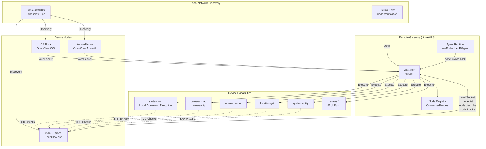
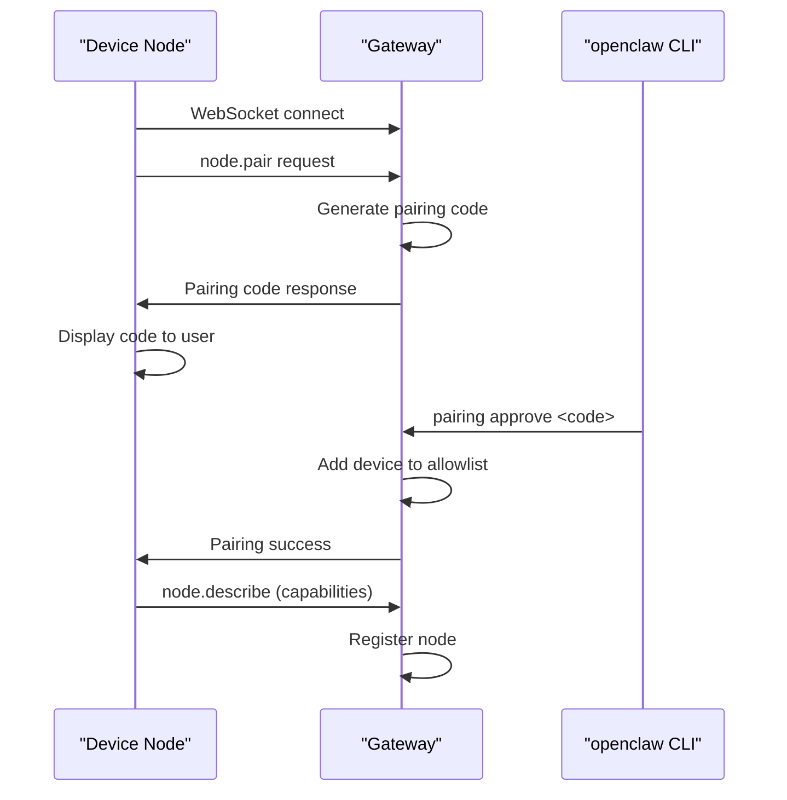
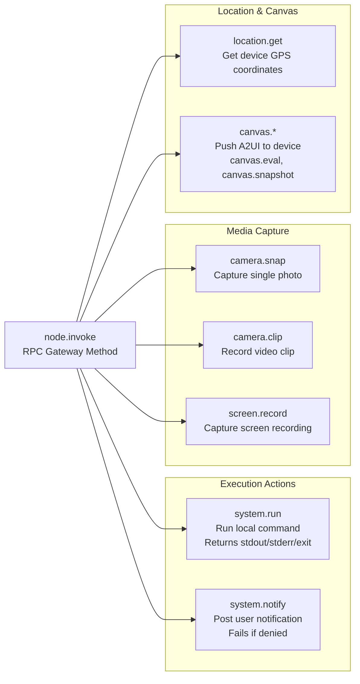
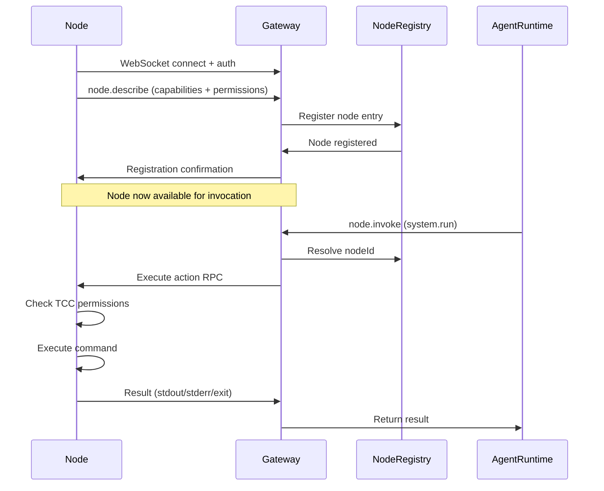
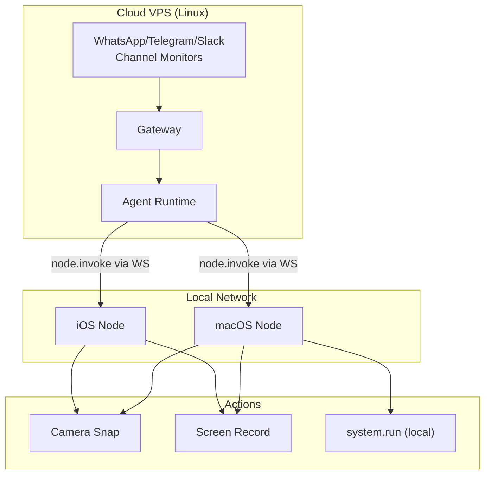

# Page: Device Nodes

# デバイスノード

<details>
<summary>関連ソースファイル</summary>

この Wiki ページの生成に使用されたコンテキストファイル:

- [README.md](README.md)
- [assets/avatar-placeholder.svg](assets/avatar-placeholder.svg)
- [docs/channels/zalo.md](docs/channels/zalo.md)
- [docs/channels/zalouser.md](docs/channels/zalouser.md)
- [scripts/clawtributors-map.json](scripts/clawtributors-map.json)
- [scripts/update-clawtributors.ts](scripts/update-clawtributors.ts)
- [scripts/update-clawtributors.types.ts](scripts/update-clawtributors.types.ts)
- [src/cli/nodes-cli.ts](src/cli/nodes-cli.ts)
- [src/cli/nodes-screen.test.ts](src/cli/nodes-screen.test.ts)
- [src/cli/nodes-screen.ts](src/cli/nodes-screen.ts)
- [src/cli/program.ts](src/cli/program.ts)
- [src/config/config.ts](src/config/config.ts)
- [src/index.test.ts](src/index.test.ts)
- [src/index.ts](src/index.ts)
- [tsconfig.json](tsconfig.json)
- [ui/src/styles.css](ui/src/styles.css)
- [ui/src/styles/layout.mobile.css](ui/src/styles/layout.mobile.css)

</details>


## 目的と範囲

デバイスノードは、macOS、iOS、Android 向けのコンパニオンアプリケーションで、OpenClaw をデバイスローカルの機能で拡張します。ゲートウェイをリモートサーバー（Linux VPS など）で実行しながら、カメラキャプチャ、画面録画、ローカルコマンド実行、システム通知などのデバイス固有のアクションにアクセスできます。ノードは WebSocket 経由でゲートウェイに接続し、プロトコルを通じてその機能と権限を通知します。

ゲートウェイ WebSocket プロトコル自体については、[ゲートウェイプロトコル](#3.2)を参照してください。リモートゲートウェイのデプロイパターンについては、[リモートアクセス](#3.4)を参照してください。

---

## アーキテクチャ概要

デバイスノードは、ゲートウェイコントロールプレーンに接続する WebSocket クライアントとして動作し、`node.invoke` プロトコルメソッドを通じてデバイスローカルのアクションを公開します。ゲートウェイは引き続き中央のオーケストレーションポイントですが、実行はノードが実行されるデバイス上で行われます。



**参照:** [README.md:224-248](), [README.md:150-156]()

---

## 検出とペアリング

### Bonjour/mDNS アドバタイズメント

デバイスノードは、Bonjour（mDNS）サービス検出を使用してローカルネットワーク上で存在を通知します。ゲートウェイは、ノードが自動的に検出する `_openclaw._tcp` サービスを公開します。これにより、ゲートウェイとノードが同じネットワーク上にある場合にゼロ設定で検出が可能になります。

検出システムは情報開示を削減するように設定可能です:

| 検出モード | 動作 |
|---|---|
| `minimal`（デフォルト） | ループバックとローカルサブネットでのみ通知 |
| `full` | すべてのネットワークインターフェースで通知 |

**参照:** [README.md:412](), [CHANGELOG.md:412]()

### ペアリングフロー

ノードがゲートウェイを検出すると、信頼を確立するためにペアリングフローを開始します:

1. ノードがゲートウェイ WebSocket エンドポイントに接続
2. ゲートウェイが短いペアリングコードを生成
3. ユーザーが CLI 経由でペアリングコードを承認: `openclaw pairing approve <channel> <code>`
4. ゲートウェイがノードのデバイス ID を許可リストに追加
5. ノードが確認を受け取り、その機能を登録



**参照:** [README.md:431]()

### プロトコルメソッド

ノードは 3 つの主要なプロトコルメソッドを使用します:

| メソッド | 目的 | パラメータ |
|---|---|---|
| `node.list` | 接続されているすべてのノードを照会 | なし |
| `node.describe` | 特定のノードの機能と権限を取得 | `nodeId` |
| `node.invoke` | ノードでアクションを実行 | `nodeId`, `action`, `params` |

**参照:** [README.md:236-240]()

---

## ノード機能

### 利用可能なアクション

デバイスノードは `node.invoke` を通じて以下のアクションを公開します:



**参照:** [README.md:236-240]()

#### system.run

デバイス上でローカルシェルコマンドを実行し、stdout、stderr、終了コードを返します。macOS では、このアクションには明示的な権限設定が必要で、TCC（Transparency, Consent, and Control）要件に従います:

- 画面録画権限を必要とする場合は `needsScreenRecording: true` を設定
- 必要な権限が付与されていない場合は `PERMISSION_MISSING` を返す
- ゲートウェイの `exec` ツール（ゲートウェイホスト上で実行）とは独立して動作

**参照:** [README.md:236-240]()

#### system.notify

デバイスにユーザー通知を投稿します。通知権限が拒否されている場合は即座に失敗します。これはゲートウェイ自体の通知機能とは別物です。

#### camera.snap / camera.clip

デバイスカメラを使用して単一の写真（`camera.snap`）またはビデオクリップ（`camera.clip`）をキャプチャします。iOS/Android ではカメラ権限、macOS では TCC カメラアクセスが必要です。

#### screen.record

デバイス上で画面録画をキャプチャします。画面録画権限（macOS では TCC、Android ではアクセシビリティ権限）が必要です。

#### location.get

デバイスの現在の GPS 座標を取得します。位置情報権限が必要です。

#### canvas.*

A2UI（Agent-to-UI）ビジュアルコンテンツをデバイスの Canvas サーフェスにプッシュします。利用可能なアクション:

- `canvas.push` — 新しい UI コンテンツをレンダリング
- `canvas.reset` — 現在のコンテンツをクリア
- `canvas.eval` — Canvas コンテキストでスクリプトを評価
- `canvas.snapshot` — 現在の Canvas 状態をキャプチャ

**参照:** [README.md:126-127](), [README.md:153-154]()

---

## 権限システム

### macOS TCC 連携

macOS ノードは TCC（Transparency, Consent, and Control）と連携して、機密性の高い機能へのアクセスを制御します:

| 機能 | 必要な TCC 権限 |
|---|---|
| `system.run`（画面データ付き） | 画面録画 |
| `system.notify` | 通知 |
| `camera.*` | カメラ |
| `screen.record` | 画面録画 |
| `location.get` | 位置情報サービス |

ノードはアクションを実行する前に権限ステータスを照会し、権限が不足している場合は明示的なエラーコードを返します。

**参照:** [README.md:236-240]()

### 権限ステータスレスポンス

`node.describe` を呼び出すと、ゲートウェイは各機能の現在のステータスを示す権限マップを受け取ります:

```json
{
  "nodeId": "macos-primary",
  "capabilities": ["system.run", "camera.snap", "screen.record"],
  "permissions": {
    "screenRecording": true,
    "camera": true,
    "notifications": false
  }
}
```

---

## プラットフォーム実装

### macOS ノードモード

macOS アプリ（`OpenClaw.app`）は**ノードモード**で実行でき、ゲートウェイが別の場所で実行されている間にデバイス機能を公開します。macOS 実装には以下が含まれます:

- **検出:** `OpenClawDiscovery` ターゲットが Bonjour/mDNS アドバタイズメントを提供 [apps/macos/Package.swift:33-41]()
- **IPC:** `OpenClawIPC` ターゲットが WebSocket 通信を処理 [apps/macos/Package.swift:27-32]()
- **実行可能ファイル:** メインアプリターゲットがノードとして登録 [apps/macos/Package.swift:42-67]()

macOS アプリには、ヘッドレスノード操作用の `openclaw-mac` CLI ツールも含まれています [apps/macos/Package.swift:68-78]()。

**参照:** [apps/macos/Package.swift](), [README.md:283-290]()

### iOS ノード

iOS コンパニオンアプリは Bonjour 経由でペアリングし、以下を公開します:

- Voice Wake（音声トリガーの転送）
- A2UI レンダリング用 Canvas サーフェス
- カメラキャプチャ（snap/clip）
- 画面録画
- 位置情報サービス

**参照:** [README.md:292-298]()

### Android ノード

Android コンパニオンアプリは iOS と同様の機能を提供します:

- Canvas サーフェス
- カメラキャプチャ
- 画面録画
- オプションの SMS 連携（追加の権限が必要）

**参照:** [README.md:300-305]()

---

## プロトコル連携

### ノード登録フロー

ノードがゲートウェイに接続すると、以下の登録シーケンスに従います:



**参照:** [README.md:236-240]()

### WebSocket トランスポート

ノードはゲートウェイへの永続的な WebSocket 接続を維持します。この接続は以下をサポートします:

- 接続監視用のハートビート/キープアライブ
- 双方向 RPC（ゲートウェイはアクションを呼び出し可能、ノードはイベントを送信可能）
- マルチノード並行性（ゲートウェイは複数の接続ノードを追跡）

ゲートウェイは、ツール定義を通じてノードアクションをエージェントランタイムに公開し、エージェントが実行フローの一部としてノード機能を呼び出せるようにします。

**参照:** [README.md:224-232]()

---

## ユースケース

### ローカルデバイスアクセス付きリモートゲートウェイ

デバイスノードの主なユースケースは、ゲートウェイをリモートサーバーで実行しながらローカルデバイス機能を維持することです:



このアーキテクチャにより以下が可能になります:

- 信頼性の高いゲートウェイ稼働時間（良好な接続性を持つ VPS）
- 24/7 で稼働するチャネルモニター
- 必要な時のみ実行されるデバイスローカルアクション
- iMessage/BlueBubbles のために macOS でゲートウェイを実行する必要がない

**参照:** [README.md:224-232]()

### 昇格実行 vs ノード実行

OpenClaw は**ホスト実行**（ゲートウェイマシン上）と**ノード実行**（デバイスノード上）を分離しています:

| 実行タイプ | 場所 | 方法 | ユースケース |
|---|---|---|---|
| ホスト `exec` ツール | ゲートウェイマシン | ゲートウェイホスト上で直接またはサンドボックス内 | サーバーサイドスクリプト、git 操作 |
| ノード `system.run` | デバイスノード | `node.invoke` RPC 経由 | ローカルファイル操作、アプリを開く、デバイス固有のコマンド |
| 昇格モード | ゲートウェイマシン | ホスト権限、許可リストでゲート | 特権ゲートウェイ操作 |

**参照:** [README.md:242-246]()

---

## 設定

デバイスノードはゲートウェイの設定変更を必要としません — 動的に自動検出およびペアリングを行います。ただし、ゲートウェイはノード関連の設定をサポートしています:

```json5
{
  "gateway": {
    "discovery": {
      "mode": "minimal"  // "minimal" (デフォルト) または "full"
    }
  }
}
```

**参照:** [CHANGELOG.md:412]()

---

## CLI 操作

### 接続ノード一覧

```bash
openclaw nodes list
```

### ノード機能の詳細表示

```bash
openclaw nodes describe <nodeId>
```

### ノードペアリングの承認

```bash
openclaw pairing approve node <code>
```

**参照:** [README.md:236-240]()

---
