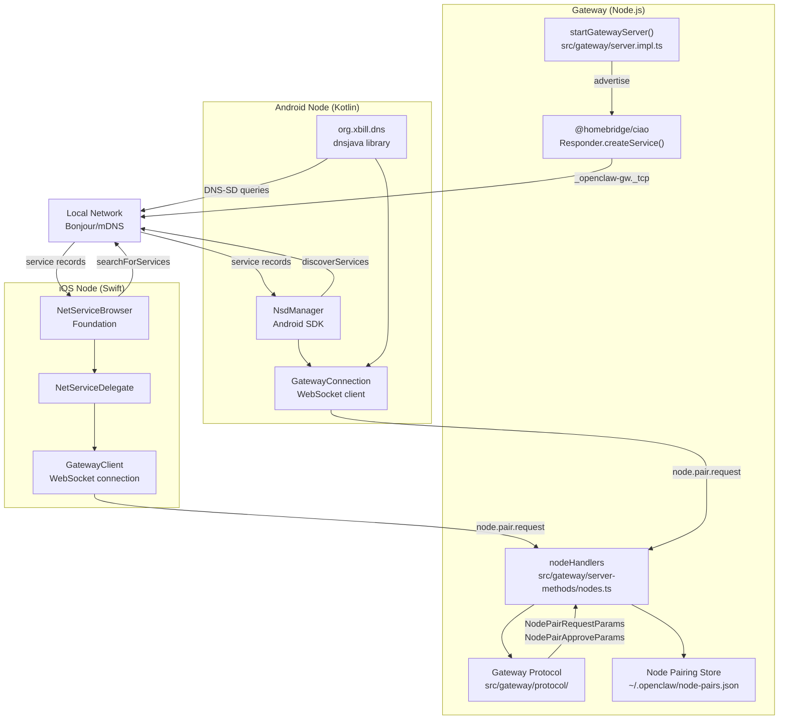
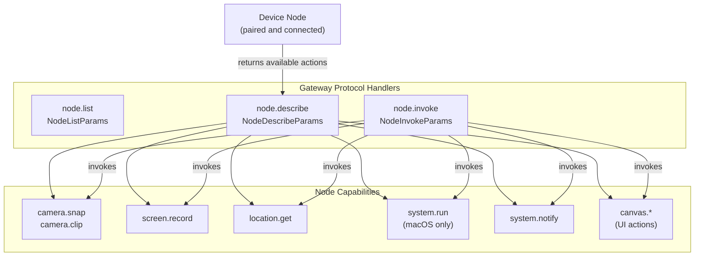

# Page: Node Pairing and Discovery

# ノードペアリングと検出

<details>
<summary>関連ソースファイル</summary>

この Wiki ページの生成に使用されたコンテキストファイル:

- [src/cli/nodes-cli.ts](src/cli/nodes-cli.ts)
- [src/cli/nodes-screen.test.ts](src/cli/nodes-screen.test.ts)
- [src/cli/nodes-screen.ts](src/cli/nodes-screen.ts)
- [src/cli/program.ts](src/cli/program.ts)

</details>


**目的:** このページでは、デバイスノード（iOS、Android、macOS）がネットワーク上で OpenClaw ゲートウェイを検出し、認証済み接続を確立する方法について説明します。ノード機能およびノードが実行できるアクションについては、[ノード機能](#11.2)を参照してください。ゲートウェイの設定とネットワークバインディングについては、[ゲートウェイ設定](#3.1)を参照してください。

---

## 概要

デバイスノード（iOS、Android、macOS）は、**Bonjour/mDNS** と **DNS-SD**（DNS-based Service Discovery）を使用してローカルネットワーク上の OpenClaw ゲートウェイを検出します。検出されると、ノードはゲートウェイへの WebSocket 接続を確立し、ゲートウェイのプロトコルメソッドを使用してペアリングフローを完了します。ペアリング承認後、ノードはその機能を登録し、`node.invoke` を介してデバイスローカルアクションを実行するために接続を維持します。

**サービス検出:**
- サービスタイプ: `_openclaw-gw._tcp`
- デフォルトポート: `18789`（`gateway.port` で設定可能）
- プラットフォーム: iOS（ネイティブ Bonjour）、Android（dnsjava/NsdManager）、macOS（ネイティブ Bonjour）

**ペアリングプロトコルメソッド:**
- `node.pair.request` - ノードからペアリングを開始
- `node.pair.approve` - オペレーターがペアリングを承認（CLI/UI）
- `node.pair.reject` - オペレーターがペアリングを拒否
- `node.pair.verify` - ノードがペアリングステータスを確認
- `node.pair.list` - 保留中/承認済みペアリングを一覧表示

**ノード管理メソッド:**
- `node.list` - 登録されているすべてのノードを一覧表示
- `node.describe` - ノードの機能とステータスを取得
- `node.rename` - ノードの表示名を更新
- `node.invoke` - ノードでアクションを実行
- `node.invoke.result` - ノードがアクション結果を返す
- `node.event` - ノード開始イベント（ウェイクトリガーなど）

**参照:**
[src/gateway/protocol/schema/nodes.ts:1-111]()
[src/gateway/server-methods-list.ts:54-69]()
[package.json:163]()

---

## 検出フロー

### mDNS サービスアドバタイズメント

**タイトル:** Bonjour/mDNS によるゲートウェイ検出

```mermaid
sequenceDiagram
    participant GW["startGatewayServer()<br/>src/gateway/server.impl.ts"]
    participant Ciao["@homebridge/ciao<br/>Responder"]
    participant Network["Local Network<br/>_openclaw-gw._tcp"]
    participant Node["Device Node<br/>NSNetServiceBrowser (iOS)<br/>NsdManager (Android)"]

    GW->>GW: "Bind to gateway.port (18789)"
    GW->>Ciao: "createService(_openclaw-gw._tcp)"
    Ciao->>Network: "Advertise service"
    Note over Network: "TXT records:<br/>- host<br/>- port<br/>- version"

    Node->>Network: "Browse for _openclaw-gw._tcp"
    Network-->>Node: "Service found event"
    Node->>Network: "Resolve service details"
    Network-->>Node: "IP, port, TXT records"

    Node->>Node: "Display in gateway picker UI"
```

ゲートウェイは `@homebridge/ciao`（Bonjour/mDNS レスポンダー）を使用して、ローカルネットワーク上で `_openclaw-gw._tcp` サービスをアドバタイズします。ノードはプラットフォームネイティブ API を使用してこのサービスをブラウズします:

| プラットフォーム | 検出 API | 実装 |
|----------|---------------|----------------|
| iOS | `NetServiceBrowser`（Foundation） | ネイティブ Bonjour ブラウザー |
| Android | `NsdManager`（Android SDK） | Android ネットワークサービス検出 |
| Android | `dnsjava` ライブラリ | Tailscale ネットワーク用 DNS-SD |
| macOS | `NetServiceBrowser`（Foundation） | ネイティブ Bonjour ブラウザー |

**参照:**
[package.json:163]()
[apps/android/app/build.gradle.kts:115-116]()
[README.md:223-229]()

---

### Tailscale ネットワークでの DNS-SD

Tailscale ネットワークでは、DNS-SD クエリはマルチキャスト mDNS ではなくユニキャスト DNS を使用します。これにより、従来の mDNS ブロードキャストパケットが伝播しない Tailscale テールネット間での検出が可能になります。

**Android 実装:** Tailscale DNS サーバーに対するユニキャスト DNS-SD クエリに `dnsjava` ライブラリを使用します。

**参照:**
[apps/android/app/build.gradle.kts:115-116]()

---

## ペアリングフロー

### ペアリングプロトコルフロー

**タイトル:** ゲートウェイ WebSocket プロトコルによるノードペアリング

```mermaid
sequenceDiagram
    participant User
    participant Node["Device Node<br/>(iOS/Android/macOS)"]
    participant WS["Gateway WebSocket<br/>startGatewayServer()"]
    participant Handler["nodeHandlers<br/>server-methods/nodes.ts"]
    participant Store["Pairing Store<br/>~/.openclaw/node-pairs.json"]

    User->>Node: "Select gateway from discovery"
    Node->>WS: "WebSocket connect(ws://IP:18789)"
    WS-->>Node: "Connection established"

    Node->>WS: "RequestFrame(method=node.pair.request)"
    Note over Node,WS: "NodePairRequestParams:<br/>- deviceId<br/>- deviceName<br/>- platform<br/>- capabilities[]"

    WS->>Handler: "handleNodePairRequest()"
    Handler->>Store: "Generate pairing code + expiry"
    Store-->>Handler: "Pairing pending"
    Handler-->>WS: "ResponseFrame(ok=true)"
    Handler->>User: "EventFrame(event=node.pair.requested)"

    User->>WS: "openclaw nodes approve <code>"
    WS->>Handler: "node.pair.approve"
    Handler->>Store: "Mark approved + generate token"
    Handler-->>WS: "ResponseFrame(ok=true)"
    Handler->>Node: "EventFrame(event=node.pair.resolved)"

    Note over Node: "Store credentials in Keychain/<br/>EncryptedSharedPreferences"

    Node->>WS: "node.list (verify connection)"
    WS-->>Node: "ResponseFrame(nodes=[])"

    Note over Node,WS: "Connection persists for node.invoke calls"
```

**主要なプロトコルメソッド:**

| メソッド | 方向 | スキーマ | 役割 |
|--------|-----------|--------|------|
| `node.pair.request` | ノード → ゲートウェイ | `NodePairRequestParams` | ペアリング開始 |
| `node.pair.list` | オペレーター → ゲートウェイ | `NodePairListParams` | 保留中/承認済みペアリングの一覧表示 |
| `node.pair.approve` | オペレーター → ゲートウェイ | `NodePairApproveParams` | 保留中ペアリングの承認 |
| `node.pair.reject` | オペレーター → ゲートウェイ | `NodePairRejectParams` | 保留中ペアリングの拒否 |
| `node.pair.verify` | ノード → ゲートウェイ | `NodePairVerifyParams` | ペアリングステータスの確認 |
| `node.rename` | オペレーター → ゲートウェイ | `NodeRenameParams` | ノード表示名の更新 |

**イベント通知:**

| イベント | トリガー | ペイロード |
|-------|---------|---------|
| `node.pair.requested` | 新しいペアリングリクエスト受信 | ペアリングコード、デバイス情報 |
| `node.pair.resolved` | ペアリングが承認/拒否された | デバイス ID、承認ステータス |

**参照:**
[src/gateway/protocol/schema/nodes.ts:1-111]()
[src/gateway/protocol/index.ts:236-249]()
[src/gateway/server-methods-list.ts:54-64]()

---

## コードエンティティ

### コードエンティティマップ: 検出とペアリング

**タイトル:** ノード検出とペアリングのコードコンポーネント



**主要なコードエンティティ:**

| エンティティ | 場所 | 役割 |
|--------|----------|------|
| `startGatewayServer()` | [src/gateway/server.impl.ts]() | ゲートウェイ WebSocket サーバー初期化 |
| `@homebridge/ciao` | [package.json:163]() | Bonjour/mDNS レスポンダーライブラリ |
| `nodeHandlers` | [src/gateway/server-methods/nodes.ts]() | ノードプロトコルメソッドハンドラー |
| `NodePairRequestParams` | [src/gateway/protocol/schema/nodes.ts:8-14]() | ペアリングリクエストスキーマ |
| `NodePairApproveParams` | [src/gateway/protocol/schema/nodes.ts:28-32]() | ペアリング承認スキーマ |
| `validateNodePairRequestParams` | [src/gateway/protocol/index.ts:236-238]() | リクエスト検証 |
| `NetServiceBrowser` | iOS Foundation | iOS Bonjour 検出 API |
| `NsdManager` | Android SDK | Android ネットワークサービス検出 |
| `dnsjava` | [apps/android/app/build.gradle.kts:116]() | Tailscale 用 DNS-SD リゾルバー |

**参照:**
[src/gateway/server.impl.ts]()
[src/gateway/server-methods/nodes.ts]()
[src/gateway/protocol/schema/nodes.ts:1-111]()
[src/gateway/protocol/index.ts:236-249]()
[package.json:163]()
[apps/android/app/build.gradle.kts:115-116]()

---

## ノード登録

ペアリング成功後、ノードはゲートウェイに登録し、利用可能な機能を通知します。

### ノード機能登録

**タイトル:** `node.describe` によるノード機能通知



ペアリング後、ノードは接続を維持し、`node.describe` リクエストにその機能マップで応答します。各機能には以下が含まれます:

**機能メタデータ:**

| フィールド | タイプ | 説明 |
|-------|------|-------------|
| `action` | `string` | アクション識別子（例: `camera.snap`、`system.run`） |
| `available` | `boolean` | アクションが現在利用可能かどうか |
| `permissionStatus` | `string` | `"granted"` / `"denied"` / `"not-determined"` |
| `platform` | `string` | プラットフォーム制約（例: `"macOS"`、`"iOS"`） |

**機能検出用プロトコルメソッド:**

| メソッド | パラメータ | 戻り値 | 用途 |
|--------|------------|---------|-------|
| `node.list` | `NodeListParams` | 接続ノードの配列 | ペアリングされた全ノードを一覧表示 |
| `node.describe` | `NodeDescribeParams` | ノード詳細 + 機能マップ | ノード機能を照会 |
| `node.invoke` | `NodeInvokeParams` | 呼び出し ID | ノードでアクションを実行 |
| `node.invoke.result` | `NodeInvokeResultParams` | アクション結果 | ノードがゲートウェイに結果を返す |

**参照:**
[src/gateway/protocol/schema/nodes.ts:50-111]()
[src/gateway/server-methods-list.ts:65-68]()
[README.md:223-229]()

---

## CLI でノードを管理

### 登録ノードの一覧表示

```bash
openclaw nodes list
```

ゲートウェイに `node.list` を送信し、ペアリングされたすべてのノードを接続状態、プラットフォーム、デバイス名とともに表示します。

**ゲートウェイメソッド:** `node.list` → `NodeListParams`

### ノード機能の詳細表示

```bash
openclaw nodes describe <node-id>
```

`node.describe` を送信して、特定のノードの機能マップ、権限ステータス、利用可能なアクションを照会します。

**ゲートウェイメソッド:** `node.describe` → `NodeDescribeParams`

### ペアリングの承認/拒否

```bash
# 保留中のペアリングを承認
openclaw nodes approve <pairing-code>

# 保留中のペアリングを拒否
openclaw nodes reject <pairing-code>

# 保留中のペアリングを一覧表示
openclaw nodes list --pending
```

これらのコマンドはペアリングストアと対話して、着信ペアリングリクエストを承認または拒否します。

**ゲートウェイメソッド:**
- `node.pair.approve` → `NodePairApproveParams`
- `node.pair.reject` → `NodePairRejectParams`
- `node.pair.list` → `NodePairListParams`

### ノード名の変更

```bash
openclaw nodes rename <node-id> --name "Living Room iPad"
```

ペアリングされたノードの表示名を更新します。

**ゲートウェイメソッド:** `node.rename` → `NodeRenameParams`

**参照:**
[src/gateway/protocol/schema/nodes.ts:1-111]()
[src/gateway/server-methods-list.ts:54-69]()
[README.md:223-229]()

---

## セキュリティと認証

### ペアリング承認フロー

ペアリングには CLI または Control UI を通じた明示的なオペレーター承認が必要です。ゲートウェイは短命のペアリングコードを生成し、ノードが永続的にペアリングされる前にオペレーターが承認する必要があります。

**セキュリティプロパティ:**
- ペアリングコードは 5 分後に期限切れ（設定可能）
- オペレーターは `openclaw nodes approve <code>` で各デバイスを明示的に承認する必要がある
- 承認されたペアリングは `~/.openclaw/node-pairs.json` に保存
- ノード認証情報は安全に保存:
  - **iOS:** Keychain Services
  - **Android:** EncryptedSharedPreferences
  - **macOS:** Keychain Services
- ノードは保存された認証情報を使用して再接続時に認証

**ペアリングストア形式:**

```json
{
  "version": 1,
  "pairs": {
    "<device-id>": {
      "deviceId": "...",
      "deviceName": "...",
      "platform": "iOS",
      "approvedAt": 1234567890000,
      "token": "..."
    }
  }
}
```

**参照:**
[src/gateway/protocol/schema/nodes.ts:8-32]()
[README.md:197-210]()

### ゲートウェイバインディングモード

ノード検出はゲートウェイバインディング設定に従います:

| バインドモード | 検出範囲 |
|-----------|----------------|
| `loopback` | ノードは検出不可（ゲートウェイは 127.0.0.1 にバインド） |
| `lan` | mDNS によるローカルネットワーク検出 |
| `tailnet` | DNS-SD による Tailscale ネットワーク検出 |
| `auto` | `loopback` を優先、Tailscale/リモートの場合は `lan` にフォールバック |

**推奨:** 安全なリモートアクセスには、SSH トンネルまたは Tailscale Serve とともに `bind: loopback` を使用してください。デバイスノードがゲートウェイを直接検出する必要がある場合のみ `bind: lan` または `bind: tailnet` を有効にしてください。

**参照:**
[README.md:197-210]()
[docs/platforms/fly.md:40-88]()

---

## 検出のトラブルシューティング

### ノードがゲートウェイを見つけられない

**確認事項:**
1. **ゲートウェイバインディングモード:** `gateway.bind` が `lan` または `tailnet` に設定されていることを確認（`loopback` ではない）
   - `loopback` は mDNS アドバタイズメントを防止
   - `lan` はローカルネットワークでアドバタイズ
   - `tailnet` は Tailscale ネットワークでアドバタイズ
2. **ファイアウォールルール:** ポート 18789（またはカスタム `gateway.port`）でインバウンド TCP を許可
3. **mDNS トラフィック:** mDNS がネットワークポリシーでブロックされていないことを確認（企業ネットワークで一般的）
4. **iOS 権限:** ローカルネットワーク権限が付与されていることを確認
   - Info.plist で宣言: `NSLocalNetworkUsageDescription`
5. **Android 権限:** ローカルネットワーク使用権限を確認（Android 14+）
6. **ゲートウェイ実行中:** `openclaw gateway status` でゲートウェイがアクティブであることを確認

**参照:**
[README.md:197-210]()
[docs/platforms/fly.md:40-88]()

### Tailscale ネットワークでの検出

Tailscale ネットワークは mDNS（マルチキャスト）の代わりに DNS-SD（ユニキャスト DNS）を使用します。Tailscale でノード検出を有効にするには:

**ゲートウェイ設定:**
- `gateway.tailscale.mode` を `serve`（テールネットのみ）または `funnel`（パブリック）に設定
- または、`gateway.bind` を `tailnet` に設定

**ノードの動作:**
- **Android:** Tailscale DNS サーバーへのユニキャスト DNS-SD クエリに `dnsjava` を使用
- **iOS/macOS:** Tailscale DNS 統合でネイティブ Bonjour を使用

**Tailscale DNS-SD アドバタイズメント:**
```
_openclaw-gw._tcp.local
→ _openclaw-gw._tcp.<tailnet-name>.ts.net
```

**参照:**
[apps/android/app/build.gradle.kts:115-116]()
[README.md:197-210]()
[docs/platforms/fly.md:235-248]()

### ペアリングコードの期限切れ

ペアリングコードがオペレーター承認前に期限切れになる場合:
- **デフォルトタイムアウト:** 300 秒（5 分）
- **設定:** `gateway.pairing.timeout` を設定してタイムアウトを延長
- **ログを確認:** ゲートウェイログにデバイス情報付きの `node.pair.request` イベントが表示される
- **接続性を確認:** ノードは承認中も WebSocket 接続を維持する必要がある
- **ペアリングを再試行:** ノードは切断と再接続で再試行可能

**プロトコルイベントシーケンス:**
1. ノードが `node.pair.request` を送信
2. ゲートウェイが `node.pair.requested` イベントを発行（ログ/UI で表示可能）
3. オペレーターがタイムアウト内に `openclaw nodes approve <code>` を実行
4. ゲートウェイが `node.pair.resolved` イベントを発行
5. ノードが認証情報を保存し接続を維持

**参照:**
[src/gateway/protocol/schema/nodes.ts:8-32]()
[docs/platforms/fly.md:235-248]()

**参照:**
[docs/platforms/fly.md:235-248]()
[README.md:197-210]()

---

## プラットフォーム固有の注意事項

### iOS

- mDNS 検出にネイティブ `NetServiceBrowser` を使用
- ローカルネットワーク権限が必要（Info.plist で宣言）
- 認証情報は Keychain に保存

**参照:**
[apps/ios/Sources/Info.plist:30-37]()

### Android

- DNS-SD 解決に `dnsjava` ライブラリを使用
- mDNS とユニキャスト DNS-SD（Tailscale）の両方をサポート
- 認証情報は EncryptedSharedPreferences に保存

**参照:**
[apps/android/app/build.gradle.kts:115-116]()

### macOS

- メニューバーアプリはゲートウェイと並行して「ノードモード」で実行可能
- ゲートウェイがリモートの場合にノード機能をアドバタイズ
- ネイティブ Bonjour API を使用

**参照:**
[README.md:273-277]()
[AGENTS.md:120-129]()

---

## 関連トピック

- **[ノード機能](#11.2):** ノードが実行できるアクション（カメラ、画面、位置情報、システムコマンド）
- **[ゲートウェイ設定](#3.1):** バインディングモード、ポート、ネットワーク設定
- **[ゲートウェイプロトコル](#3.2):** WebSocket RPC プロトコルと Bridge Protocol の詳細
- **[リモートアクセス](#3.4):** リモートゲートウェイアクセス用の SSH トンネルと Tailscale Serve

---
