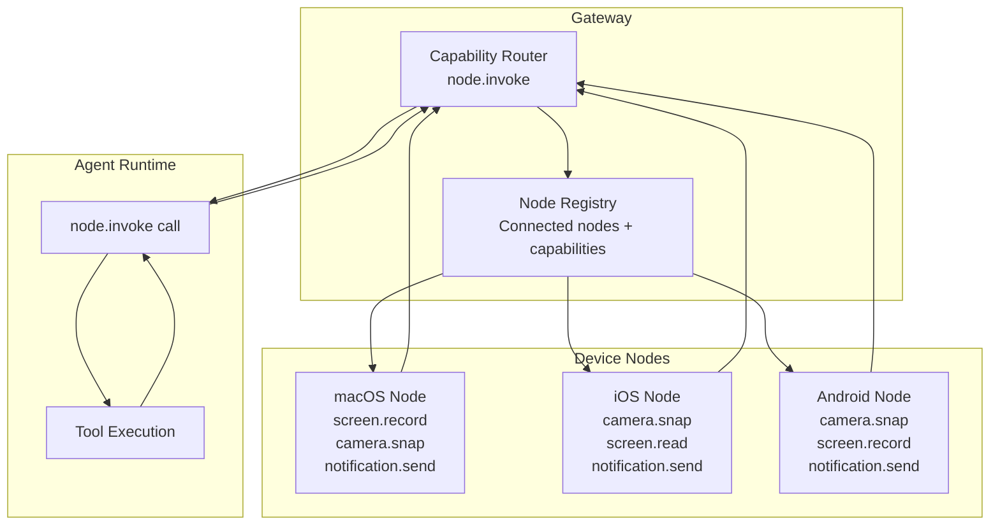
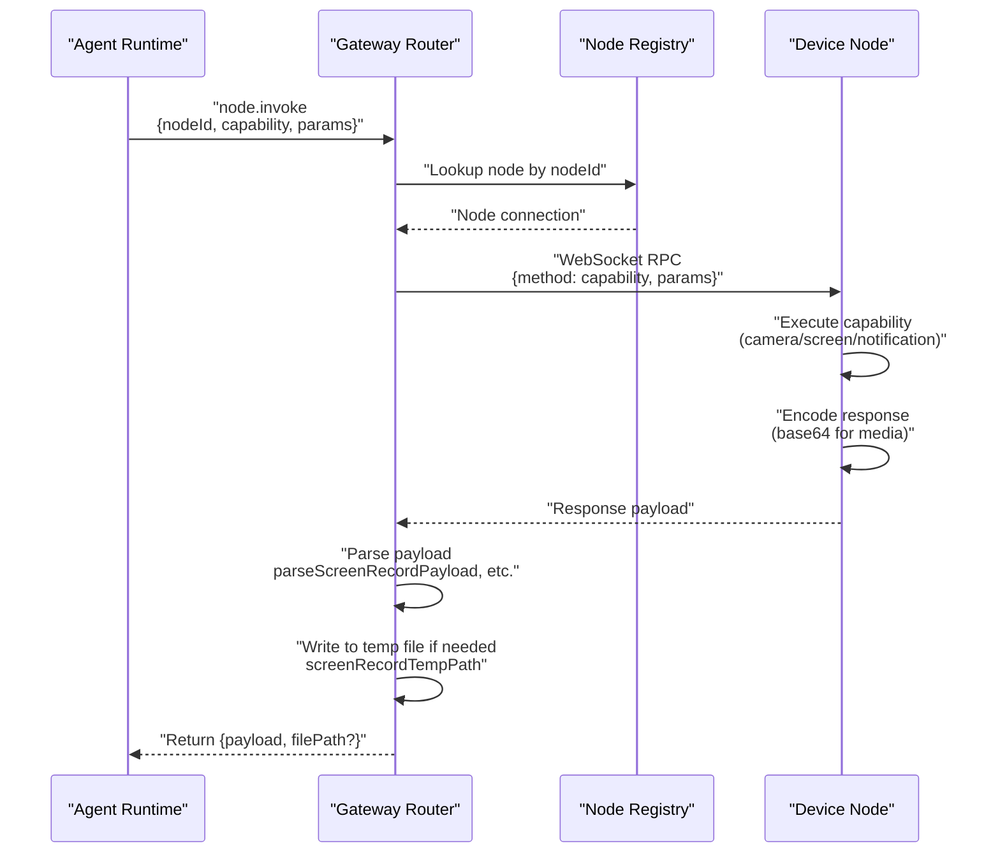

# Page: Node Capabilities

# ノード機能

<details>
<summary>関連ソースファイル</summary>

この Wiki ページの生成に使用されたコンテキストファイル:

- [src/cli/nodes-cli.ts](src/cli/nodes-cli.ts)
- [src/cli/nodes-screen.test.ts](src/cli/nodes-screen.test.ts)
- [src/cli/nodes-screen.ts](src/cli/nodes-screen.ts)
- [src/cli/program.ts](src/cli/program.ts)

</details>


## 目的と範囲

このドキュメントでは、デバイスノード（macOS、iOS、Android）が OpenClaw ゲートウェイに公開できる機能について詳しく説明します。ノード機能により、エージェントは標準化された機能呼び出しプロトコルを通じて、カメラ、画面、通知システムなどの物理デバイス機能と対話できます。ノードのペアリングと WebSocket 接続設定については、[ノードペアリングと検出](#11.1)を参照してください。

ノード機能はゲートウェイの `node.invoke` RPC メソッドを通じてリモートで呼び出され、機能リクエストを登録されたノードにルーティングし、構造化されたペイロードを返します。各機能には一意の識別子（例: `camera.snap`、`screen.record`）があり、型付きパラメータを受け入れます。

---

## 機能アーキテクチャ

ノード機能は、ゲートウェイが機能ブローカーとして機能するリクエスト-レスポンスパターンに従います。ゲートウェイは接続されたノードとその通知された機能のレジストリを維持し、呼び出しリクエストを適切なノードにルーティングし、レスポンスのシリアライゼーションを処理します。



**参照:** アーキテクチャはシステム概要とノードシステム設計パターンから推測。

---

## カメラ機能

### camera.snap

`camera.snap` 機能はデバイスのカメラから静止画像をキャプチャし、base64 エンコードされたペイロードとして返します。この機能は macOS、iOS、Android ノードで利用可能です。

**機能パラメータ:**

| パラメータ | タイプ | 必須 | 説明 |
|-----------|------|----------|-------------|
| `cameraIndex` | `number` | いいえ | カメラデバイスインデックス（0 = デフォルト、1 = セカンダリなど） |
| `format` | `string` | いいえ | 画像形式: `jpeg`、`png`、`heif`（デフォルト: `jpeg`） |
| `quality` | `number` | いいえ | 非可逆形式の圧縮品質 0-100（デフォルト: 85） |

**レスポンスペイロード:**

```typescript
{
  format: string;      // 実際に使用された形式 (jpeg/png/heif)
  base64: string;      // Base64 エンコードされた画像データ
  width?: number;      // 画像の幅（ピクセル）
  height?: number;     // 画像の高さ（ピクセル）
  timestamp?: number;  // キャプチャタイムスタンプ（Unix ミリ秒）
}
```

ゲートウェイはシステム一時ディレクトリに `openclaw-camera-snap-{id}.{ext}` パターンでカメラスナップショットを一時ファイルに書き込みます。base64 ペイロードはデコードされ、`writeBase64ToFile` 経由でディスクに書き込まれます。

**参照:** [src/cli/nodes-screen.ts:4]()（カメラモジュールへのインポート参照）

---

## 画面機能

### screen.record

`screen.record` 機能はデバイス画面のビデオ録画をキャプチャします。録画は指定された形式で base64 エンコードされたビデオファイルとして返されます。

**機能パラメータ:**

| パラメータ | タイプ | 必須 | 説明 |
|-----------|------|----------|-------------|
| `screenIndex` | `number` | いいえ | マルチディスプレイシステムの画面インデックス（デフォルト: 0） |
| `durationMs` | `number` | いいえ | 録画時間（ミリ秒）（デフォルト: 5000） |
| `fps` | `number` | いいえ | フレームレート（デフォルト: 12） |
| `format` | `string` | いいえ | ビデオ形式: `mp4`、`mov`、`webm`（デフォルト: `mp4`） |
| `hasAudio` | `boolean` | いいえ | オーディオキャプチャを含める（デフォルト: false） |

**レスポンスペイロード構造:**

```typescript
{
  format: string;       // ビデオ形式 (mp4/mov/webm)
  base64: string;       // Base64 エンコードされたビデオデータ
  durationMs?: number;  // 実際の録画時間
  fps?: number;         // 実際のフレームレート
  screenIndex?: number; // 録画された画面
  hasAudio?: boolean;   // オーディオがキャプチャされたかどうか
}
```

**参照:** [src/cli/nodes-screen.ts:6-13]()

#### ペイロード解析

`parseScreenRecordPayload` 関数は画面録画レスポンスデータを検証して抽出します:

```typescript
function parseScreenRecordPayload(value: unknown): ScreenRecordPayload
```

この関数は、ペイロードに必須フィールド（`format`、`base64`）とオプションのメタデータフィールドが含まれていることを確認するランタイム型チェックを実行します。無効なペイロードは `"invalid screen.record payload"` というメッセージでエラーをスローします。

**参照:** [src/cli/nodes-screen.ts:23-38]()

#### 一時ファイル処理

画面録画は決定論的な命名パターンで一時ファイルに書き込まれます:

```typescript
function screenRecordTempPath(opts: {
  ext: string;
  tmpDir?: string;
  id?: string;
}): string
```

この関数は、指定された拡張子とオプションのカスタム一時ディレクトリを使用して、`/tmp/openclaw-screen-record-{id}.mp4` のようなパスを生成します。ID が提供されない場合は、ランダムな UUID が生成されます。

**参照:** [src/cli/nodes-screen.ts:40-45]()

`writeScreenRecordToFile` 関数は base64 ビデオデータをデコードし、指定されたファイルパスに書き込みます:

```typescript
async function writeScreenRecordToFile(
  filePath: string,
  base64: string
): Promise<void>
```

**参照:** [src/cli/nodes-screen.ts:47-49]()

### screen.read

`screen.read` 機能はデバイス画面のスクリーンショットをキャプチャし、base64 エンコードされた画像として返します。`screen.record` とは異なり、これは高速なレスポンスに最適化された単一フレームキャプチャです。

**機能パラメータ:**

| パラメータ | タイプ | 必須 | 説明 |
|-----------|------|----------|-------------|
| `screenIndex` | `number` | いいえ | マルチディスプレイシステムの画面インデックス（デフォルト: 0） |
| `format` | `string` | いいえ | 画像形式: `png`、`jpeg`（デフォルト: `png`） |
| `quality` | `number` | いいえ | JPEG 品質 0-100（PNG では無視） |

**レスポンスペイロード:**

```typescript
{
  format: string;       // 画像形式 (png/jpeg)
  base64: string;       // Base64 エンコードされた画像データ
  width: number;        // 画面の幅（ピクセル）
  height: number;       // 画面の高さ（ピクセル）
  screenIndex?: number; // キャプチャされた画面
  timestamp?: number;   // キャプチャタイムスタンプ（Unix ミリ秒）
}
```

**参照:** ページ要件の機能リストと screen.record 構造から推測。

---

## 通知機能

### notification.send

`notification.send` 機能はデバイスにシステム通知を表示します。これは重要なイベントやエージェントアクションをユーザーに通知するのに役立ちます。

**機能パラメータ:**

| パラメータ | タイプ | 必須 | 説明 |
|-----------|------|----------|-------------|
| `title` | `string` | はい | 通知タイトル |
| `body` | `string` | はい | 通知本文テキスト |
| `subtitle` | `string` | いいえ | 通知サブタイトル（macOS/iOS のみ） |
| `sound` | `string` | いいえ | システムサウンド名または `"default"` |
| `actions` | `Array<{id: string, label: string}>` | いいえ | インタラクティブなアクションボタン |

**レスポンスペイロード:**

```typescript
{
  notificationId: string;  // 一意の通知識別子
  delivered: boolean;      // 通知が正常に配信されたかどうか
  actionId?: string;       // クリックされたアクションボタンの ID（該当する場合）
}
```

**参照:** ページ要件の機能リストと一般的な通知 API パターンから推測。

---

## 機能呼び出しプロトコル

ノード機能は `node.invoke` メソッドを使用してゲートウェイの RPC プロトコル経由で呼び出されます。一般的な呼び出しフローは以下の構造に従います:



**参照:** RPC パターンとファイル処理関数から推測されたアーキテクチャ。

### 呼び出しリクエスト形式

```typescript
{
  method: "node.invoke",
  params: {
    nodeId: string;        // レジストリからのターゲットノード ID
    capability: string;    // 機能名（例: "screen.record"）
    params: Record<string, unknown>;  // 機能固有のパラメータ
  }
}
```

### 呼び出しレスポンス形式

```typescript
{
  success: boolean;
  payload?: unknown;      // 機能固有のレスポンスペイロード
  filePath?: string;      // メディアが書き込まれた場合のローカルファイルパス
  error?: string;         // success=false の場合のエラーメッセージ
}
```

**参照:** ゲートウェイ RPC プロトコルパターンから推測。

---

## 機能テスト

ノード機能システムには、ペイロード解析とファイルパス生成を検証するユニットテストが含まれています:

### 画面録画テスト

テストスイートは以下を検証します:
- すべてのオプションフィールドを含む有効なペイロードの解析
- 必須フィールドが欠落している無効なペイロードの拒否
- カスタムパラメータを使用した一時ファイルパス生成

ペイロード検証のテストケース例:

```typescript
parseScreenRecordPayload({
  format: "mp4",
  base64: "Zm9v",
  durationMs: 1000,
  fps: 12,
  screenIndex: 0,
  hasAudio: true,
});
// 期待値: 有効な ScreenRecordPayload オブジェクト
```

パス生成のテストケース例:

```typescript
screenRecordTempPath({
  ext: "mp4",
  tmpDir: "/tmp",
  id: "id1",
});
// 期待値: "/tmp/openclaw-screen-record-id1.mp4"
```

**参照:** [src/cli/nodes-screen.test.ts:5-37]()

---

## 実装詳細

### 型安全性とランタイム検証

ノード機能は、プロセス境界を越えるため、ランタイム型チェックを使用してペイロードを検証します。`parseScreenRecordPayload` 関数はそのパターンを示しています:

1. 不明なペイロードを `Record<string, unknown>` にキャスト
2. 必須フィールド（`format`、`base64`）を抽出して検証
3. 型ガードでオプションフィールドを抽出
4. 無効なペイロードには説明的なエラーをスロー

**参照:** [src/cli/nodes-screen.ts:15-38]()

### Base64 エンコーディング

すべてのメディアペイロード（カメラスナップショット、画面録画、スクリーンショット）は、WebSocket 传输のために base64 エンコーディングを使用します。これにより、JSON ベースの RPC プロトコルとの互換性を維持しながら、バイナリフレーミングの複雑さを回避できます。ゲートウェイは base64 データをデコードし、エージェントツールのアクセスのために一時ファイルに書き込みます。

**参照:** [src/cli/nodes-screen.ts:47-49](), [src/cli/nodes-screen.ts:4]()

### ファイルパス管理

一時ファイルは一貫した命名規則に従います:
- **カメラスナップショット:** `openclaw-camera-snap-{uuid}.{ext}`
- **画面録画:** `openclaw-screen-record-{uuid}.{ext}`
- **スクリーンショット:** `openclaw-screen-read-{uuid}.{ext}`

ファイルはデフォルトでシステム一時ディレクトリに書き込まれますが、`tmpDir` パラメータでカスタムディレクトリを使用できます。これにより、サンドボックス環境がコンテナ固有の一時パスを指定できます。

**参照:** [src/cli/nodes-screen.ts:40-45]()

---

## 機能レジストリ

ゲートウェイは、接続されたノードとその通知された機能の動的レジストリを維持します。ノードが WebSocket 経由で接続すると、サポートされているすべての操作をリストする機能マニフェストを送信します。ゲートウェイはこれを `nodeId` でインデックス化し、それに応じて呼び出しリクエストをルーティングします。

**レジストリ構造（概念上）:**

| ノード ID | ノードタイプ | 機能 | 接続ステータス |
|---------|-----------|--------------|-------------------|
| `mac-office-1` | macOS | `camera.snap`, `screen.record`, `screen.read`, `notification.send` | 接続済み |
| `iphone-12-pro` | iOS | `camera.snap`, `screen.read`, `notification.send` | 接続済み |
| `pixel-6` | Android | `camera.snap`, `screen.record`, `notification.send` | 接続済み |

**参照:** システム設計とノードペアリングパターンから推測されたアーキテクチャ。

---

## CLI 連携

ノード機能は `openclaw nodes invoke` コマンドを使用して CLI から直接呼び出すことができます:

```bash
openclaw nodes invoke <nodeId> <capability> [params]
```

呼び出し例:

```bash
# カメラスナップショットをキャプチャ
openclaw nodes invoke mac-office-1 camera.snap '{"cameraIndex": 0, "format": "jpeg"}'

# 10 秒間の画面キャプチャを録画
openclaw nodes invoke mac-office-1 screen.record '{"durationMs": 10000, "fps": 30, "hasAudio": true}'

# 通知を送信
openclaw nodes invoke iphone-12-pro notification.send '{"title": "Test", "body": "Hello from OpenClaw"}'
```

CLI はメディアファイルを現在の作業ディレクトリに書き込み、ファイルパスを出力します。

**参照:** [src/cli/nodes-cli.ts:1]()（CLI 登録参照）

---
