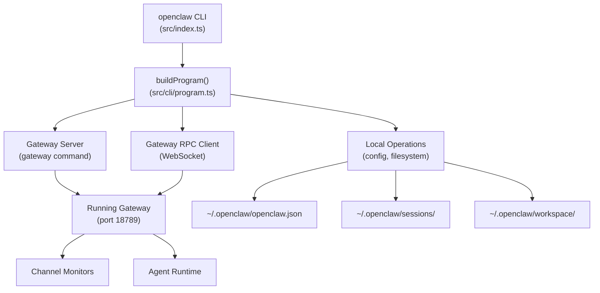
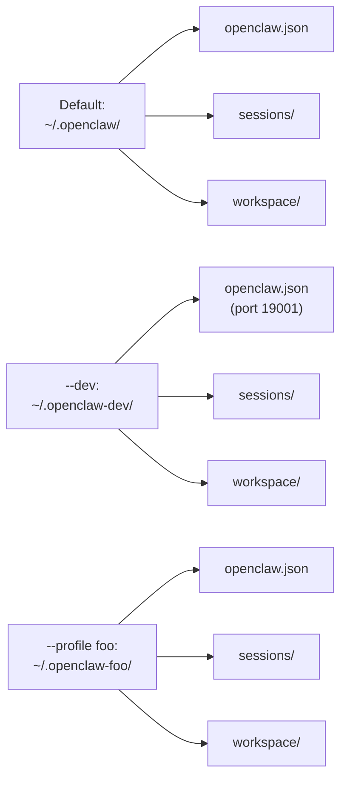
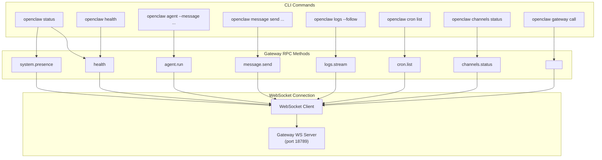
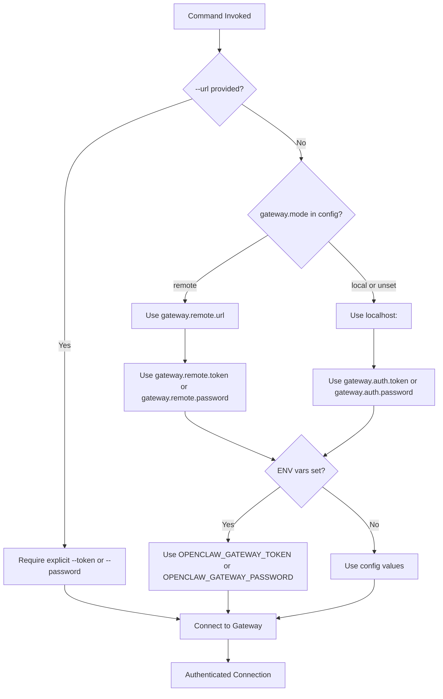
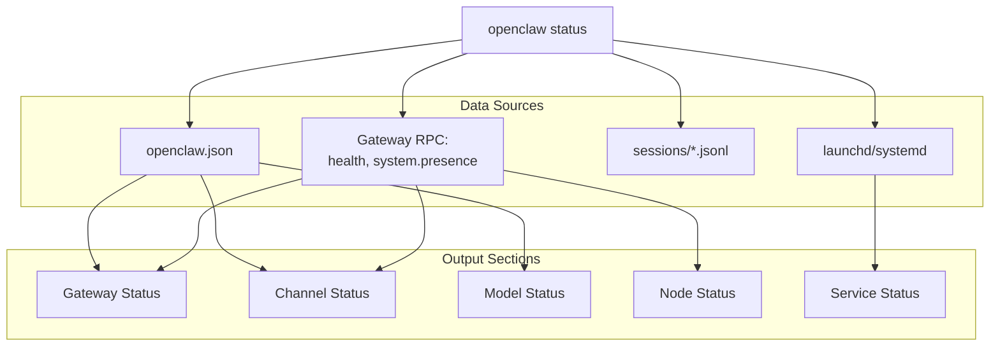

# CLI リファレンス

<details>
<summary>関連ソースファイル</summary>

この wiki ページの生成に使用されたファイル:

- [README.md](README.md)
- [assets/avatar-placeholder.svg](assets/avatar-placeholder.svg)
- [docs/channels/zalo.md](docs/channels/zalo.md)
- [docs/channels/zalouser.md](docs/channels/zalouser.md)
- [docs/cli/index.md](docs/cli/index.md)
- [docs/docs.json](docs/docs.json)
- [docs/gateway/index.md](docs/gateway/index.md)
- [docs/gateway/troubleshooting.md](docs/gateway/troubleshooting.md)
- [docs/index.md](docs/index.md)
- [docs/start/getting-started.md](docs/start/getting-started.md)
- [docs/start/hubs.md](docs/start/hubs.md)
- [docs/start/onboarding.md](docs/start/onboarding.md)
- [docs/start/wizard.md](docs/start/wizard.md)
- [scripts/clawtributors-map.json](scripts/clawtributors-map.json)
- [scripts/update-clawtributors.ts](scripts/update-clawtributors.ts)
- [scripts/update-clawtributors.types.ts](scripts/update-clawtributors.types.ts)
- [src/config/config.ts](src/config/config.ts)
- [src/index.test.ts](src/index.test.ts)
- [src/index.ts](src/index.ts)
- [tsconfig.json](tsconfig.json)
- [ui/src/styles.css](ui/src/styles.css)
- [ui/src/styles/layout.mobile.css](ui/src/styles/layout.mobile.css)

</details>


OpenClaw CLI は、ゲートウェイとすべてのサブシステムへのコマンドラインインターフェースを提供します。コマンドは機能カテゴリ別に整理されています: ゲートウェイライフサイクル、エージェント実行、チャネル管理、モデル設定、診断、オートメーション、メモリ操作です。

特定のコマンドグループの詳細なドキュメントについては、以下を参照してください:
- ゲートウェイコマンド: [Gateway Commands](#12.1)
- エージェントコマンド: [Agent Commands](#12.2)
- チャネルコマンド: [Channel Commands](#12.3)
- モデルコマンド: [Model Commands](#12.4)
- 設定コマンド: [Configuration Commands](#12.5)
- 診断コマンド: [Diagnostic Commands](#12.6)
- メモリコマンド: [Memory Commands](#12.7)
- オートメーションコマンド: [Automation Commands](#12.8)

ゲートウェイ自体に関連する概念については、[Gateway](#3) を参照してください。

---

## CLI アーキテクチャ

CLI は OpenClaw の主要なオペレーターインターフェースです。すべてのコマンドは Node.js プロセスとして実行され、以下のいずれかを行います:
1. 長時間実行されるゲートウェイサーバーを起動
2. ローカルファイルシステム操作（設定、セッション、ワークスペース）
3. WebSocket 経由でゲートウェイ RPC メソッドを呼び出し



**コマンドディスパッチフロー**

Sources: [src/index.ts:1-94](), [src/cli/program.ts](), [docs/cli/index.md:1-54]()

---

## グローバルフラグと環境

すべてのコマンドは、ランタイム動作を変更するグローバルフラグをサポートしています:

| Flag | Purpose | Default |
|------|---------|---------|
| `--dev` | 状態を `~/.openclaw-dev/` に分離し、ポートを 1000 シフト | disabled |
| `--profile <name>` | 状態を `~/.openclaw-<name>/` に分離 | none |
| `--no-color` | ANSI 色出力を無効化 | enabled in TTY |
| `--json` | 構造化 JSON 出力（サポートされている場合） | human-readable |
| `--verbose` | 詳細ログを有効化 | disabled |
| `-V`, `--version`, `-v` | バージョンを表示して終了 | - |

### 状態分離

`--dev` と `--profile` フラグは、すべての状態ファイルのベースディレクトリを変更します:



**状態ディレクトリ解決**

Sources: [src/config/paths.ts](), [src/infra/env.ts:19-21](), [docs/cli/index.md:56-61]()

---

## コマンド構造と階層

コマンドは機能グループに整理されています。各グループは特定の操作のためのサブコマンドを提供します。

### ルートコマンド

| Command | Purpose | Type |
|---------|---------|------|
| `setup` | 設定とワークスペースを初期化 | Local |
| `onboard` | 初回セットアップ用のインタラクティブウィザード | Local + RPC |
| `configure` | インタラクティブ設定エディター | Local + RPC |
| `gateway` | ゲートウェイサーバーを起動またはサービスを管理 | Server/Service |
| `agent` | 単一エージェントターンを実行 | RPC |
| `message` | チャネル経由でメッセージを送信 | RPC |
| `status` | システムヘルスと診断を表示 | RPC |
| `health` | ゲートウェイヘルスエンドポイントをクエリ | RPC |
| `doctor` | 設定/状態の問題を診断して修復 | Local |

### サービス管理コマンド

| Command | Purpose | Supervisor |
|---------|---------|------------|
| `gateway install` | ゲートウェイをシステムサービスとしてインストール | launchd/systemd/schtasks |
| `gateway start` | サービスを開始 | launchd/systemd/schtasks |
| `gateway stop` | サービスを停止 | launchd/systemd/schtasks |
| `gateway restart` | サービスを再起動 | launchd/systemd/schtasks |
| `gateway status` | サービスとランタイム状態を表示 | launchd/systemd/schtasks |
| `gateway uninstall` | サービスを削除 | launchd/systemd/schtasks |

Sources: [docs/cli/index.md:88-238](), [docs/gateway/index.md:90-99]()

---

## コマンドから RPC メソッドへのマッピング

多くの CLI コマンドは、WebSocket 経由でゲートウェイ RPC メソッドを呼び出します。以下の図は、CLI コマンドと RPC メソッド間のマッピングを示しています:



**CLI からゲートウェイ RPC レイヤーへ**

`gateway call` コマンドは、任意の RPC メソッドへの直接アクセスを提供します:

```bash
# Query config
openclaw gateway call config.get

# Apply config update
openclaw gateway call config.apply --params '{"config": {...}, "baseHash": "..."}'

# Trigger update
openclaw gateway call update.run --params '{"channel": "stable"}'
```

Sources: [docs/cli/index.md:720-735](), [docs/gateway/protocol.md](), [docs/gateway/index.md:196-207]()

---

## 認証と接続

ゲートウェイと対話するコマンドは認証が必要です。CLI は以下の順序で認証情報と接続詳細を解決します:



**認証解決フロー**

### 明示的 URL オーバーライド

`--url` が指定された場合、自動的な認証情報解決は行われません:

```bash
# Must provide explicit auth
openclaw health --url ws://192.168.1.10:18789 --token abc123

# Error: missing credentials
openclaw health --url ws://192.168.1.10:18789
```

### 環境変数

| Variable | Purpose |
|----------|---------|
| `OPENCLAW_GATEWAY_TOKEN` | ゲートウェイトークンをオーバーライド |
| `OPENCLAW_GATEWAY_PASSWORD` | ゲートウェイパスワードをオーバーライド |
| `OPENCLAW_GATEWAY_PORT` | ゲートウェイポートをオーバーライド |
| `OPENCLAW_CONFIG_PATH` | 設定ファイルパスをオーバーライド |
| `OPENCLAW_STATE_DIR` | 状態ディレクトリをオーバーライド |
| `OPENCLAW_HOME` | ホームディレクトリ解決をオーバーライド |

Sources: [docs/cli/index.md:654-724](), [docs/gateway/authentication.md](), [docs/help/environment.md]()

---

## 出力フォーマット

コマンドは異なるユースケースに最適化された複数の出力フォーマットをサポートしています:

### ヒューマンリーダブル（デフォルト）

TTY セッションは ANSI 色、プログレスインジケーター、OSC-8 ハイパーリンク（サポートされている場合）を含むスタイル付き出力を受け取ります:

```bash
$ openclaw status
✓ Gateway: running (ws://127.0.0.1:18789)
  Uptime: 2h 34m
  Config: ~/.openclaw/openclaw.json
  Workspace: ~/.openclaw/workspace

✓ Channels
  whatsapp: connected (default)
  telegram: connected (default)

✓ Model: anthropic/claude-opus-4-6
  Provider: anthropic
  Auth: OAuth (expires in 89d)
```

### JSON 出力

スクリプティングとオートメーションのための機械可読 JSON:

```bash
$ openclaw status --json
{
  "gateway": {
    "status": "running",
    "url": "ws://127.0.0.1:18789",
    "uptime": 9240000,
    "config": "/Users/user/.openclaw/openclaw.json"
  },
  "channels": {
    "whatsapp": { "status": "connected", "account": "default" },
    "telegram": { "status": "connected", "account": "default" }
  },
  "model": {
    "id": "anthropic/claude-opus-4-6",
    "provider": "anthropic"
  }
}
```

### プレーンテキスト

パイピングとスクリプティングのための最小限の出力:

```bash
$ openclaw models list --plain
anthropic/claude-opus-4-6
anthropic/claude-sonnet-4
openai/gpt-4.5-turbo
openai/o1
```

Sources: [docs/cli/index.md:63-70](), [src/terminal/palette.ts]()

---

## コマンドカテゴリ

### 設定管理

`~/.openclaw/openclaw.json` を管理するコマンド:

| Command | Purpose | Examples |
|---------|---------|----------|
| `config get <path>` | 設定値を読み取り | `openclaw config get gateway.port` |
| `config set <path> <value>` | 設定値を書き込み | `openclaw config set gateway.port 18790` |
| `config unset <path>` | 設定値を削除 | `openclaw config unset channels.telegram` |
| `configure` | インタラクティブ設定ウィザード | `openclaw configure --section channels` |

Sources: [docs/cli/index.md:349-359](), [src/config/config.ts:1-15]()

### セッション管理

会話セッションを検査するコマンド:

| Command | Purpose |
|---------|---------|
| `sessions` | アクティビティ付きの全セッションを一覧表示 |
| `sessions --active 60` | 過去 60 分以内にアクティブなセッション |
| `sessions --store <path>` | 代替セッションストアを使用 |

セッションは `~/.openclaw/sessions/` に JSONL トランスクリプトとして保存されます:

```bash
$ ls ~/.openclaw/sessions/
main.jsonl
group-discord-guild-123456.jsonl
whatsapp:+15555550123.jsonl
```

Sources: [docs/cli/index.md:605-615](), [docs/concepts/session.md](), [src/config/sessions.ts]()

### ゲートウェイ操作

ゲートウェイライフサイクルと診断のコマンド:

| Command | Purpose | Output |
|---------|---------|--------|
| `gateway status` | サービスとランタイム状態 | Service state, RPC probe, config paths |
| `gateway status --deep` | 拡張診断 | + System service scan |
| `gateway status --no-probe` | RPC プローブをスキップ | Service state only |
| `gateway install` | サービスをインストール | Service label, plist/unit path |
| `gateway restart` | サービスを再起動 | Action confirmation |

Sources: [docs/cli/index.md:654-699](), [docs/gateway/index.md:56-99]()

### エージェント実行

CLI から直接エージェントターンを実行:

```bash
# Single turn, print to stdout
openclaw agent --message "List open PRs" --thinking high

# Execute and deliver to channel
openclaw agent --message "Deploy status?" --to +15555550123 --deliver

# Use specific session
openclaw agent --message "Continue" --session-id "project-review"

# Local execution (no Gateway)
openclaw agent --message "Summarize CHANGELOG" --local
```

Sources: [docs/cli/index.md:499-515](), [docs/tools/agent-send.md]()

### メッセージング

メッセージを送信し、チャネルアクションを実行:

```bash
# Send text message
openclaw message send --target +15555550123 --message "Hello"

# React to message
openclaw message react --channel discord --target channel:123 --message-id 456 --emoji "👍"

# Create thread
openclaw message thread create --channel discord --target channel:123 --name "Bug Discussion"

# Poll
openclaw message poll --channel discord --target channel:123 \
  --poll-question "Lunch?" \
  --poll-option "Pizza" \
  --poll-option "Sushi"
```

Sources: [docs/cli/index.md:474-496](), [docs/cli/message.md]()

---

## 診断コマンド

### ステータスコマンド

`status` コマンドは包括的なシステム概要を提供します:



**ステータスコマンドデータフロー**

オプション:
- `--json`: 機械可読出力
- `--all`: 完全診断（サービススキャンを含む）
- `--deep`: ライブチェックでチャネルをプローブ
- `--usage`: プロバイダー使用量/クォータを含める
- `--verbose`: 拡張診断出力

Sources: [docs/cli/index.md:562-593](), [docs/gateway/health.md]()

### ドクターコマンド

`doctor` コマンドは自動診断と修復を実行します:

```bash
# Basic health check
openclaw doctor

# Deep scan (includes service audit)
openclaw doctor --deep

# Auto-fix without prompts
openclaw doctor --yes --non-interactive

# Skip workspace suggestions
openclaw doctor --no-workspace-suggestions
```

Doctor checks:
- 設定ファイルの有効性とスキーマ準拠
- レガシー設定の移行
- ゲートウェイサービス設定
- ポート競合
- 認証設定
- チャネル認証情報の整合性
- セッションストアの整合性

Sources: [docs/cli/index.md:360-370](), [docs/gateway/doctor.md]()

---

## モデルとプロバイダーコマンド

### モデル選択

```bash
# Set primary model
openclaw models set anthropic/claude-opus-4-6

# Set image model
openclaw models set-image openai/gpt-4.5-turbo

# List available models
openclaw models list --provider anthropic

# Status with auth check
openclaw models status --probe
```

### 認証管理

```bash
# Interactive auth setup
openclaw models auth add

# Setup OAuth token (recommended for Anthropic)
openclaw models auth setup-token --provider anthropic

# Paste manual token
openclaw models auth paste-token --provider anthropic --profile-id manual --expires-in 90d

# Profile ordering
openclaw models auth order get --provider anthropic
openclaw models auth order set --provider anthropic profile1 profile2
```

Sources: [docs/cli/index.md:747-859](), [docs/concepts/models.md](), [docs/concepts/oauth.md]()

---

## オートメーションコマンド

### Cron ジョブ

定期的なエージェント実行をスケジュール:

```bash
# List jobs
openclaw cron list

# Add job
openclaw cron add --name "morning-brief" \
  --at "08:00" \
  --message "Daily briefing" \
  --target +15555550123

# Run job immediately
openclaw cron run <id> --force

# View run history
openclaw cron runs --id <id> --limit 20
```

Sources: [docs/cli/index.md:895-910](), [docs/automation/cron-jobs.md]()

### Webhooks

```bash
# Setup Gmail Pub/Sub
openclaw webhooks gmail setup \
  --account user@example.com \
  --project my-project \
  --topic openclaw-gmail

# Run webhook listener
openclaw webhooks gmail run --port 8080
```

Sources: [docs/cli/index.md:455-463](), [docs/automation/webhook.md](), [docs/automation/gmail-pubsub.md]()

---

## チャネルコマンド

### チャネル管理

```bash
# List configured channels
openclaw channels list

# Status with live probes
openclaw channels status --probe

# Add channel (interactive)
openclaw channels add

# Add channel (non-interactive)
openclaw channels add --channel telegram --token $BOT_TOKEN

# Login (WhatsApp QR)
openclaw channels login --channel whatsapp

# View logs
openclaw channels logs --channel telegram --lines 100
```

Sources: [docs/cli/index.md:373-427](), [docs/channels/index.md]()

### ペアリング承認

`dmPolicy: "pairing"` を持つチャネルの場合:

```bash
# List pending approvals
openclaw pairing list whatsapp

# Approve sender
openclaw pairing approve whatsapp ABC123 --notify
```

Sources: [docs/cli/index.md:446-454](), [docs/channels/pairing.md]()

---

## メモリコマンド

ワークスペースメモリファイルに対するベクトル検索:

```bash
# Index memory files
openclaw memory index

# Search
openclaw memory search "authentication implementation"

# Status
openclaw memory status
```

メモリファイル:
- `~/.openclaw/workspace/MEMORY.md`
- `~/.openclaw/workspace/memory/*.md`

Sources: [docs/cli/index.md:260-267](), [docs/concepts/memory.md]()

---

## ノードコマンド

デバイスノード（macOS/iOS/Android）を管理:

```bash
# List paired nodes
openclaw nodes status

# Node capabilities
openclaw nodes describe --node <id>

# Invoke node capability
openclaw nodes invoke --node <id> --capability camera.snap

# Approvals
openclaw approvals get --node <id>
openclaw approvals set --node <id> --exec-policy prompt
```

Sources: [docs/cli/index.md:913-920](), [docs/nodes/index.md]()

---

## ブラウザコマンド

OpenClaw ブラウザインスタンスを制御:

```bash
# Start browser
openclaw browser start --profile openclaw

# Status
openclaw browser status

# List tabs
openclaw browser tabs

# Navigate
openclaw browser navigate --url https://example.com

# Screenshot
openclaw browser screenshot --output screenshot.png
```

Sources: [docs/cli/index.md:192-221](), [docs/tools/browser.md]()

---

## 例と一般的なパターン

### 完全セットアップフロー

```bash
# 1. Install
npm install -g openclaw@latest

# 2. Onboard
openclaw onboard --install-daemon

# 3. Verify
openclaw gateway status
openclaw status --deep

# 4. Send test message
openclaw agent --message "System check" --verbose
```

### リモートゲートウェイアクセス

```bash
# Configure remote mode
openclaw config set gateway.mode remote
openclaw config set gateway.remote.url ws://192.168.1.10:18789
openclaw config set gateway.remote.token abc123

# Verify connection
openclaw health
openclaw status
```

### マルチエージェントセットアップ

```bash
# Add isolated agent
openclaw agents add work-assistant \
  --workspace ~/.openclaw/workspace-work \
  --model anthropic/claude-opus-4-6 \
  --bind whatsapp:work

# List agents
openclaw agents list --bindings
```

### 診断ワークフロー

```bash
# 1. Quick check
openclaw status

# 2. Channel probe
openclaw channels status --probe

# 3. Deep diagnosis
openclaw doctor --deep

# 4. View logs
openclaw logs --follow
```

Sources: [docs/cli/index.md:1-240](), [docs/start/getting-started.md:30-77](), [README.md:58-76]()

---

## プラグインコマンド

拡張機能はトップレベルコマンドを追加できます:

```bash
# Example: voice-call plugin
openclaw voicecall status
openclaw voicecall dial --number +15555550123

# Plugin management
openclaw plugins list
openclaw plugins install @openclaw/voice-call
openclaw plugins enable voice-call
```

Sources: [docs/cli/index.md:249-259](), [docs/tools/plugin.md]()

---

## 終了コード

CLI は標準的な終了コードを使用します:

| Code | Meaning |
|------|---------|
| `0` | 成功 |
| `1` | 一般エラー |
| `2` | 無効な引数または設定 |

スクリプティングの場合、`--json` 出力を使用し、終了コードをチェックします:

```bash
if openclaw health --json > /dev/null 2>&1; then
  echo "Gateway is healthy"
else
  echo "Gateway is down"
  exit 1
fi
```

Sources: [src/index.ts:84-92]()

---
