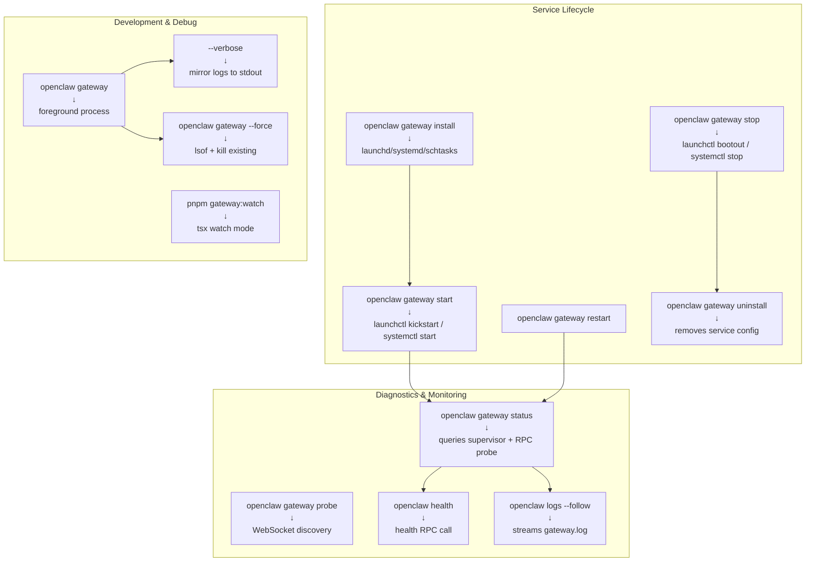
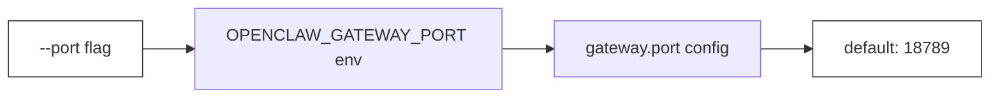
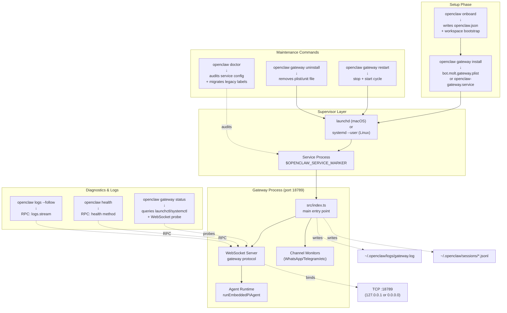
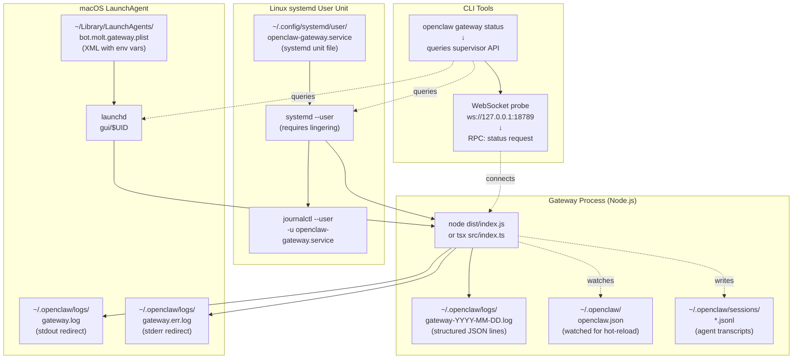
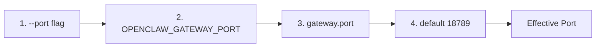
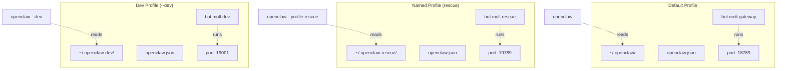

# ゲートウェイコマンド

<details>
<summary>関連ソースファイル</summary>

この wiki ページの生成に使用されたファイル:

- [README.md](README.md)
- [assets/avatar-placeholder.svg](assets/avatar-placeholder.svg)
- [docs/channels/zalo.md](docs/channels/zalo.md)
- [docs/channels/zalouser.md](docs/channels/zalouser.md)
- [docs/cli/index.md](docs/cli/index.md)
- [docs/docs.json](docs/docs.json)
- [docs/gateway/index.md](docs/gateway/index.md)
- [docs/gateway/troubleshooting.md](docs/gateway/troubleshooting.md)
- [docs/index.md](docs/index.md)
- [docs/start/getting-started.md](docs/start/getting-started.md)
- [docs/start/hubs.md](docs/start/hubs.md)
- [docs/start/onboarding.md](docs/start/onboarding.md)
- [docs/start/wizard.md](docs/start/wizard.md)
- [scripts/clawtributors-map.json](scripts/clawtributors-map.json)
- [scripts/update-clawtributors.ts](scripts/update-clawtributors.ts)
- [scripts/update-clawtributors.types.ts](scripts/update-clawtributors.types.ts)
- [src/config/config.ts](src/config/config.ts)
- [src/index.test.ts](src/index.test.ts)
- [src/index.ts](src/index.ts)
- [tsconfig.json](tsconfig.json)
- [ui/src/styles.css](ui/src/styles.css)
- [ui/src/styles/layout.mobile.css](ui/src/styles/layout.mobile.css)

</details>


このページでは、ゲートウェイサービスのライフサイクル管理（インストール、監視、ステータスチェック、デバッグを含む）のための `openclaw gateway` サブコマンドについて説明します。ゲートウェイサーバーの内部構造とプロトコルの詳細については、[Gateway Configuration](#3.1) と [Gateway Protocol](#3.2) を参照してください。一般的な診断コマンドについては、[Diagnostic Commands](#12.6) を参照してください。

## コマンド概要

`openclaw gateway` コマンドグループは、ゲートウェイプロセスを管理します。これは、チャネル、エージェント、コントロールプレーンの常時稼働ハブです。ゲートウェイは WebSocket/HTTP ポート（デフォルト 18789）にバインドし、すべてのメッセージングチャネル接続、エージェント実行リクエスト、コントロール UI アクセスを処理します。

**主な責任:**
- サービスのインストールと監視（launchd/systemd/schtasks）
- プロセスライフサイクル管理（start、stop、restart）
- ヘルスモニタリングと診断
- ネットワークバインディングと認証検証

関連コマンドグループ:
- **セッション/エージェントランタイム**: [Agent Commands](#12.2)
- **チャネルセットアップ**: [Channel Commands](#12.3)
- **設定編集**: [Configuration Commands](#12.5)

## コマンドカテゴリ



**コマンドとコードのマッピング:**

| Command | Code Entry Points | Config Keys |
|---------|------------------|-------------|
| `gateway install` | [src/cli/program.ts]() service setup | `gateway.port`, `gateway.bind` |
| `gateway start/stop/restart` | [src/cli/program.ts]() supervisor calls | Service metadata env vars |
| `gateway status` | [src/cli/program.ts]() → status RPC | `gateway.mode`, `gateway.remote.url` |
| `gateway` (foreground) | [src/index.ts:75-93]() main entry | `gateway.reload.mode` |
| `logs --follow` | [src/cli/program.ts]() → logs RPC | Log file paths in state dir |

Sources: [docs/gateway/index.md:88-100](), [src/index.ts:75-93](), [docs/cli/index.md:136-147]()

## サービスライフサイクルコマンド

### `openclaw gateway install`

ゲートウェイを監視付きサービスとしてインストールします。プラットフォーム固有のサービス定義を作成し、障害時の自動再起動を設定します。

**プラットフォーム別の動作:**
- **macOS**: `~/Library/LaunchAgents/bot.molt.<profile>.plist` を書き込み（デフォルトプロファイルの場合は `bot.molt.gateway`）。レガシー `com.openclaw.*` ラベルは自動的に移行されます。
- **Linux/WSL2**: `~/.config/systemd/user/openclaw-gateway[-<profile>].service` を書き込み、ユーザーリンガリングを有効化。
- **Windows**: スケジュールタスク `OpenClaw Gateway (<profile>)` を作成。

**オプション:**
| Flag | Purpose | Notes |
|------|---------|-------|
| `--force` | サービスを再インストール | 現在のデフォルトでサービス設定を再書き込み |
| `--profile <name>` | 名前付きプロファイル用にインストール | プロファイル固有の状態ディレクトリとサービスタイプを使用 |
| `--dev` | 開発インスタンスをインストール | `~/.openclaw-dev` 状態とポート 19001 を使用 |

**サービスメタデータ**（サービス設定に埋め込まれる）:
- `OPENCLAW_SERVICE_MARKER=openclaw`
- `OPENCLAW_SERVICE_KIND=gateway`
- `OPENCLAW_SERVICE_VERSION=<version>`

**例:**
```bash
# Default install (main profile)
openclaw gateway install

# Named profile install
openclaw --profile rescue gateway install

# Force reinstall after config changes
openclaw gateway install --force

# Dev profile
openclaw --dev gateway install
```

**インストール後の手順:**
1. サービス状態を確認: `openclaw gateway status`
2. ログをチェック: `openclaw logs --follow`
3. ゲートウェイ RPC を確認: `openclaw health`

**リンガリング（Linux のみ）:**
インストーラーは systemd リンガリング（`loginctl enable-linger`）を有効にし、ユーザーサービスがログアウト後も存続するようにします。sudo が必要な場合があります。これは、ユーザーがログアウトした後もユーザーサービスがアクティブなままになるために必要です。

**サービスマーカー:**
インストーラーは診断用のメタデータをサービス設定に埋め込みます:
- `OPENCLAW_SERVICE_MARKER=openclaw`（OpenClaw サービスとして識別）
- `OPENCLAW_SERVICE_KIND=gateway`（ノードサービスと区別）
- `OPENCLAW_SERVICE_VERSION=<version>`（インストールバージョンを追跡）

`openclaw doctor` コマンドはこれらのマーカーを使用して、サービス設定のドリフトを検出して修復します。

Sources: [docs/gateway/index.md:122-149](), [docs/gateway/index.md:198-245]()

---

### `openclaw gateway start`

監視されたゲートウェイサービスを開始します。既に実行中の場合は何もしません。CLI はプラットフォーム固有のスーパーバイザーに委任します。

**プラットフォーム別の実装:**

| Platform | Supervisor | Command | Notes |
|----------|------------|---------|-------|
| macOS | launchd | `launchctl kickstart -k gui/$UID/bot.molt.gateway` | `-k` フラグは既にロードされている場合に強制再起動 |
| Linux/WSL2 | systemd | `systemctl --user start openclaw-gateway.service` | ユーザーサービスにはリンガリングが必要 |
| Windows | Task Scheduler | `schtasks /Run /TN "OpenClaw Gateway (main)"` | スケジュールタスクを即座に実行 |

**検証動作:**
このコマンドは、スーパーバイザーがプロセス状態を「running」と報告するまでブロックします。ゲートウェイ WebSocket が到達可能になるまで待機し**ません**。RPC 接続を確認するには `openclaw gateway status` を使用してください。

**起動シーケンス:**
1. CLI がプロファイルからサービスタイプを解決（デフォルトの場合 `bot.molt.gateway` など）
2. CLI がプラットフォームスーパーバイザー API を呼び出してサービスを開始
3. スーパーバイザーがサービス環境変数付きでプロセスを起動
4. ゲートウェイプロセスが設定されたポートにバインド
5. ゲートウェイがチャネルを初期化してモニタリングを開始

起動が失敗した場合は、以下を確認:
- バインドエラーや設定問題は `openclaw logs --follow`
- スーパーバイザー状態と RPC プローブの不一致は `openclaw gateway status`
- サービス設定のドリフトは `openclaw doctor`

Sources: [docs/gateway/index.md:122-149](), [docs/gateway/troubleshooting.md:95-120]()

---

### `openclaw gateway stop`

監視されたゲートウェイサービスを停止します。プロセスに `SIGTERM` を送信し、クリーンシャットダウンを待機します。

**プラットフォームコマンド（参考）:**
```bash
# macOS
launchctl bootout gui/$UID/bot.molt.gateway

# Linux
systemctl --user stop openclaw-gateway.service

# Windows
schtasks /End /TN "OpenClaw Gateway (main)"
```

**シャットダウン動作:**
- ゲートウェイは接続されたクライアントに `reason` とオプションの `restartExpectedMs` を含む `shutdown` イベントを送信
- アクティブなエージェント実行は中止シグナルを受信
- WebSocket 接続は正常にクローズ

**強制停止（手動）:**
サービスが応答しない場合、PID を見つけて `SIGKILL` を送信:
```bash
lsof -nP -iTCP:18789 -sTCP:LISTEN
kill -9 <PID>
```

Sources: [docs/gateway/index.md:636-658](), [docs/gateway/index.md:213-223]()

---

### `openclaw gateway restart`

監視されたゲートウェイサービスを再起動します。`stop` に続いて `start` を実行するのと同等です。

**ユースケース:**
- 完全な再起動が必要な設定変更を適用（バインドアドレス、ポート、認証モード）
- ハング状態からの回復
- すべてのチャネルの強制再接続

**プロセス内再起動の代替:**
設定のホットリロード用に、ゲートウェイは認証時に `SIGUSR1` によるプロセス内再起動をサポートします。`gateway.reload.mode="hybrid"`（デフォルト）の場合、安全な設定変更に対してサービスは自動的にこれをトリガーします。

Sources: [docs/gateway/index.md:213-223](), [docs/gateway/index.md:27-33]()

---

### `openclaw gateway uninstall`

監視されたサービスを削除します。プロセスを停止し、サービス設定ファイルを削除します。ワークスペース、セッション、認証情報は削除し**ません**。

**プラットフォーム別のクリーンアップ:**
- **macOS**: `~/Library/LaunchAgents/bot.molt.<profile>.plist` を削除
- **Linux**: `openclaw-gateway[-<profile>].service` を無効化して削除
- **Windows**: スケジュールタスクを削除

**手動クリーンアップ（必要な場合）:**
```bash
# macOS - remove all OpenClaw LaunchAgents
launchctl bootout gui/$UID/bot.molt.gateway
rm ~/Library/LaunchAgents/bot.molt.*.plist

# Linux - remove all OpenClaw user services
systemctl --user stop openclaw-gateway*.service
systemctl --user disable openclaw-gateway*.service
rm ~/.config/systemd/user/openclaw-gateway*.service
```

Sources: [docs/gateway/index.md:213-237]()

## 診断コマンド

### `openclaw gateway status`

ゲートウェイサービス状態、RPC 到達可能性、設定/プローブターゲットを報告します。これはゲートウェイヘルスチェックの**主要な診断コマンド**です。

**出力セクション:**

| Section | Content | Purpose | Source |
|---------|---------|---------|--------|
| **Runtime** | スーパーバイザー状態（running/stopped/not installed）、PID、終了コード | サービスプロセスが稼働していることを確認 | launchd/systemd クエリ |
| **Config (cli)** | CLI が解決したポート、バインドモード、認証、状態ディレクトリ | CLI が期待するものを表示 | `~/.openclaw/openclaw.json` からの設定解決 |
| **Config (service)** | サービスが使用するポート、バインドモード、認証、状態ディレクトリ | サービスが実際に使用するものを表示 | サービス環境変数（plist/unit ファイル） |
| **Probe target** | CLI がプローブした URL | localhost と LAN IP を明確化 | `gateway.bind` + `gateway.port` から導出 |
| **RPC probe** | `status` RPC 呼び出しの成功/失敗 | ゲートウェイ WebSocket が到達可能か確認 | WebSocket 接続 + RPC 応答 |
| **Last gateway error** | ゲートウェイからの最後にログされたエラー（ポートが閉じているがサービスが実行中の場合） | バインド失敗の根本原因 | `gateway.log` または `gateway.err.log` の末尾 |

**フラグ:**

| Flag | Purpose | Behavior |
|------|---------|----------|
| `--deep` | ヘルスチェックを実行 | `health` RPC を呼び出し、プロバイダープローブを含める |
| `--no-probe` | RPC プローブをスキップ | ネットワークがダウンしている場合に有用 |
| `--json` | 安定した JSON 出力 | スクリプトとオートメーション用 |
| `--url <url>` | プローブターゲットをオーバーライド | 特定のゲートウェイインスタンスをテスト |
| `--profile <name>` | 名前付きプロファイルをチェック | プロファイル固有のサービスをターゲット |

**出力例:**
```
Runtime: running (PID 12345)
Config (cli):    port=18789 bind=loopback auth=token stateDir=~/.openclaw
Config (service): port=18789 bind=loopback auth=token stateDir=~/.openclaw
Probe target: ws://127.0.0.1:18789
RPC probe: ok (status call succeeded)
```

**検出される一般的な問題:**
- **設定不一致**: CLI とサービスが異なるポート/状態ディレクトリを使用（プロファイルの混同）
- **ポートクローズ、サービス実行中**: 最後のゲートウェイエラーがバインド失敗または認証拒否を表示
- **スーパーバイザーの問題**: サービス設定が古い（`openclaw doctor` を実行して修復）

**診断ワークフロー:**
```mermaid
sequenceDiagram
    participant CLI["CLI<br/>(src/cli/program.ts)"]
    participant Supervisor["Supervisor<br/>(launchctl/systemctl)"]
    participant Gateway["Gateway Process<br/>(port 18789)"]
    participant LogFile["~/.openclaw/logs/<br/>gateway.log"]

    CLI->>Supervisor: "Query service state"
    Supervisor-->>CLI: "PID 12345, running"

    CLI->>CLI: "Resolve config paths<br/>~/.openclaw/openclaw.json"
    CLI->>CLI: "Parse service env vars<br/>from plist/unit file"

    CLI->>Gateway: "WebSocket connect<br/>ws://127.0.0.1:18789"
    CLI->>Gateway: "RPC: status request"

    alt "RPC success"
        Gateway-->>CLI: "{ ok: true, uptime: 3600 }"
        CLI->>CLI: "Display: RPC probe: ok"
    else "RPC failure (ECONNREFUSED)"
        CLI->>LogFile: "tail -n 1 gateway.log"
        LogFile-->>CLI: "refusing to bind gateway ... without auth"
        CLI->>CLI: "Display: Last error +<br/>diagnosis hint"
    end

    CLI->>CLI: "Compare cli vs service config"
    alt "Mismatch detected"
        CLI->>CLI: "Warn: profile mismatch<br/>or stale service config"
    end
```

**終了コード動作:**
- **0**: すべてのチェック合格（サービス実行中、RPC 到達可能）
- **1**: サービス停止または RPC 到達不能（エラー詳細は stderr に）
- **JSON モード** (`--json`): 常に 0 で終了、出力の `status` フィールドをチェック

Sources: [docs/gateway/index.md:213-237](), [docs/gateway/troubleshooting.md:16-32](), [docs/gateway/troubleshooting.md:196-230]()

---

### `openclaw gateway probe`

ネットワーク上のゲートウェイインスタンスを検出してプローブします。ローカルとリモートターゲットの到達可能性を報告します。

**検出メカニズム:**
- **Loopback**: `127.0.0.1:<port>` をチェック（設定またはデフォルト 18789 から）
- **LAN**: バインドアドレスを解決（`lan`/`tailnet`/`custom` モード）
- **Remote**: 設定された `gateway.remote.url` をテスト
- **Bonjour (macOS)**: `_openclaw._tcp` mDNS サービスを検出

**プローブフロー:**
1. 設定から潜在的なゲートウェイ URL を解決
2. 各ターゲットへの WebSocket 接続を試行
3. プロトコル互換性を検証するために `status` RPC を呼び出し
4. 到達可能なインスタンスのレイテンシーとバージョンを報告

**出力フォーマット:**
```
Target                          | Status | Latency | Version
ws://127.0.0.1:18789            | ok     | 2ms     | 0.5.0
ws://192.168.1.100:18789        | fail   | -       | -
ws://gateway.example.com        | ok     | 45ms    | 0.5.0
```

**ユースケース:**
- **マルチインスタンスセットアップ**: CLI がターゲットとしているゲートウェイを確認
- **リモートデバッグ**: トンネルまたは Tailscale 接続を検証
- **プロファイルの混同**: 重複するゲートウェイポートを区別

Sources: [docs/gateway/troubleshooting.md:25](), [docs/gateway/index.md:103-109]()

## 開発コマンド

### `openclaw gateway [options]`

ゲートウェイをフォアグラウンドモードで実行します（スーパーバイザーなし）。開発、デバッグ、サービスをインストールせずにクイックテストに便利です。これはメインのゲートウェイエントリーポイント [src/index.ts:75-93]() を呼び出します。

**プロセスライフサイクル:**
1. `~/.openclaw/openclaw.json`（または `OPENCLAW_CONFIG_PATH`）から設定をロード
2. 設定 + 環境変数 + フラグからポート/バインド/認証を解決
3. `gateway.mode=local` を検証（`--allow-unconfigured` がない場合）
4. 解決されたポートで WebSocket サーバーを開始
5. チャネルモニターを初期化
6. イベントループに入る（SIGTERM/SIGINT までブロック）

**オプション:**

| Flag | Purpose | Precedence/Behavior | Code Reference |
|------|---------|---------------------|----------------|
| `--port <port>` | リスニングポートをオーバーライド | `--port` > `OPENCLAW_GATEWAY_PORT` > `gateway.port` > 18789 | [src/index.ts]() port resolution |
| `--verbose` | デバッグログを stdout にミラー | `gateway.log` をリアルタイムでコンソールにストリーム | [src/logging.ts]() console capture |
| `--force` | 既存のリスナーをキル | `lsof -nP -iTCP:<port>` + 見つかった PID に SIGTERM を実行 | [src/infra/ports.ts]() |
| `--allow-unconfigured` | `gateway.mode` チェックをスキップ | ローカルモード検証をバイパス（開発/テストのみ） | Config validation |
| `--bind <mode>` | バインドモードをオーバーライド | `loopback` \| `lan` \| `tailnet` \| `custom` | [src/config/types.ts]() |
| `--token <token>` | 認証トークンをオーバーライド | ランタイムで `gateway.auth.token` を設定 | Auth override |
| `--tailscale <mode>` | Tailscale 公開 | `off` \| `serve` \| `funnel` | [docs/gateway/tailscale.md]() |

**ポート優先順位の階層:**


**例:**
```bash
# Default foreground run
openclaw gateway --port 18789

# Verbose debug output
openclaw gateway --verbose

# Force kill listeners and start
openclaw gateway --force

# Dev mode (bypass mode check)
openclaw --dev gateway --allow-unconfigured
```

**シグナルハンドリング:**

| Signal | Handler | Behavior | Exit Code |
|--------|---------|----------|-----------|
| **SIGTERM** | グレースフルシャットダウン | `shutdown` WS イベントを送信、チャネルをクローズ、処理中のリクエストを待機 | 143 (normal) |
| **SIGINT** | グレースフルシャットダウン | SIGTERM と同等（フォアグラウンドで Ctrl-C でトリガー） | 130 |
| **SIGUSR1** | プロセス内再起動 | `gateway.reload.mode` が許可する場合に設定をホットリロード（ポート再バインドなし） | N/A (continues) |
| **SIGHUP** | 無視 | 何もしない（シェル切断時の誤終了を防止） | N/A |

**シャットダウンシーケンス:**
1. 新しい WebSocket 接続の受け入れを停止
2. `reason` と `restartExpectedMs` を含む `shutdown` イベントを接続されたクライアントにブロードキャスト
3. 進行中のエージェント実行をキャンセル（`status:"cancelled"` で `agent` イベントを送信）
4. チャネルモニターをクローズ（WhatsApp/Telegram/Discord グレースフル切断）
5. ログをフラッシュ
6. コード 0（クリーン）または 1（シャットダウン中のエラー）で終了

**終了コード 143** は SIGTERM の標準的な終了コード（128 + 15）であり、**クラッシュではありません**。スーパーバイザー（launchd/systemd）は停止時にこれを期待します。

Sources: [docs/gateway/index.md:18-47](), [src/index.ts:84-92]()

---

### `openclaw gateway --force`

開始前にゲートウェイポートでリッスンしている既存のプロセスを終了します。古いプロセスがポートをブロックしている場合や、迅速な開発イテレーション中に便利です。

**実装:**
1. `lsof -nP -iTCP:<port> -sTCP:LISTEN` を実行してターゲットポート上の PID を列挙
2. 見つかった各 PID について:
   - プロセス名と PID をログ
   - PID に `SIGTERM`（グレースフル）を送信
   - プロセスが終了するまで 2 秒待機
   - まだ生きている場合、`SIGKILL`（強制）を送信
3. `ensurePortAvailable()` でポートが空いていることを確認
4. 通常のゲートウェイ起動を続行

**コードパス:** [src/infra/ports.ts]() `handlePortError()` and `ensurePortAvailable()`

**失敗モード:**

| Condition | Behavior | Exit Code |
|-----------|----------|-----------|
| `lsof` が見つからない | エラーを表示 + フォールバック指示 | 1 |
| 複数のリスナー | すべて終了（カウント > 1 の場合は警告） | 継続 |
| 権限拒否（他のユーザー） | キル不可、`sudo lsof` + 手動キルを提案 | 1 |
| キル後もポートがブロックされたまま | `EADDRINUSE` エラーを表示 + 再試行を提案 | 1 |

**安全性に関する注意:**
- ポート上の**任意の**プロセスを終了（OpenClaw だけではない）（`lsof` 出力でターゲットを確認）
- 監視されたサービス（launchd/systemd）はキルされたプロセスを再起動（まず `openclaw gateway stop` でサービスを停止）
- 監視されたインスタンスには `openclaw gateway stop` を優先（よりクリーンなシャットダウン）

**一般的なユースケース:**
- 開発ワークフロー: クラッシュ後にポートが開いたままの場合に `openclaw gateway --force`
- ハングしたプロセス: `stop` コマンドがタイムアウトした場合に `openclaw gateway --force`
- ポート競合: 別のアプリがポートを取得した場合に `openclaw gateway --force`

Sources: [docs/gateway/index.md:41-43](), [src/infra/ports.ts:24-51]()

---

### `pnpm gateway:watch`

TypeScript 変更時に自動リロードでゲートウェイを実行します。サービスを再インストールせずに迅速なイテレーションを行うための開発専用ワークフローです。

**要件:**
- `pnpm install` が完了したリポジトリクローン
- TypeScript ビルドツールが利用可能（`tsx`, `tsc`）

**実装:**
`tsx watch` を使用して `src/**/*.ts` ファイルを監視。変更時:
1. 現在のゲートウェイプロセスに SIGTERM を送信
2. クリーンシャットダウンを待機
3. TypeScript をリビルド（ウォッチモード設定時）
4. 同じフラグでゲートウェイを再起動

**動作:**
- `src/**/*.ts` の変更を監視（300ms デバウンス）
- ファイル保存時にゲートウェイをリビルドして再起動
- WebSocket 接続は保持**されない**（完全な再起動）
- セッション状態は保持（JSONL トランスクリプトは変更されない）

**クイック再起動の代替手段:**

| Approach | Command | Pros | Cons |
|----------|---------|------|------|
| Manual kill + restart | `pkill -TERM -f "openclaw gateway" && openclaw gateway --verbose` | 完全制御 | 手動 |
| SIGUSR1 in-process reload | `kill -USR1 <gateway-pid>` | WS 接続を保持 | コードではなく設定のみリロード |
| Supervisor restart | `openclaw gateway restart` | サービス管理を使用 | 手動より遅い |

**開発ワークフロー例:**
```bash
# Terminal 1: Watch mode
pnpm gateway:watch

# Terminal 2: Test changes
openclaw health
openclaw message send --target +15555550123 --message "test"

# Edit src/index.ts → auto-restarts in Terminal 1
```

Sources: [docs/gateway/index.md:101-102](), [package.json]() scripts section

## コマンドフロー図

**ライフサイクル: セットアップ → ランタイム → メンテナンス**



Sources: [docs/gateway/index.md:18-298](), [src/index.ts:75-93]()

## サービス管理アーキテクチャ

**プラットフォーム固有のスーパーバイザー統合**



**サービス設定キー:**

| Platform | Config Path | Environment Variables | Restart Behavior |
|----------|-------------|----------------------|------------------|
| macOS | `~/Library/LaunchAgents/bot.molt.gateway.plist` | `OPENCLAW_SERVICE_MARKER=openclaw`<br/>`OPENCLAW_SERVICE_KIND=gateway` | KeepAlive + ThrottleInterval |
| Linux | `~/.config/systemd/user/openclaw-gateway.service` | `Environment="OPENCLAW_SERVICE_MARKER=openclaw"`<br/>`Environment="OPENCLAW_SERVICE_KIND=gateway"` | Restart=on-failure<br/>RestartSec=5 |
| Windows | Task Scheduler entry | Embedded in task XML | On failure, restart delay 1 min |

Sources: [docs/gateway/index.md:198-298](), [docs/gateway/index.md:122-149]()

## 環境と設定

### ポート解決

ゲートウェイはこの優先順位チェーンを使用してリスニングポートを解決します:



Sources: [docs/gateway/index.md:47]()

### プロファイル分離



**プロファイル選択:**
- **Default**: フラグなし、`~/.openclaw/` を使用
- **Named**: `--profile <name>` は `~/.openclaw-<name>/` を使用
- **Dev**: `--dev` はポート 19001 で `~/.openclaw-dev/` へのショートカット

**サービスネーミング:**
- macOS: `bot.molt.<profile>`（レガシー: `com.openclaw.<profile>`）
- Linux: `openclaw-gateway-<profile>.service`
- Windows: `OpenClaw Gateway (<profile>)`

Sources: [docs/gateway/index.md:59-127]()

## 一般的なワークフロー

### 初期セットアップ

```bash
# 1. Install OpenClaw
npm install -g openclaw

# 2. Run onboarding (creates config + installs service)
openclaw onboard --install-daemon

# 3. Verify service is running
openclaw gateway status

# 4. Check Gateway health
openclaw health
```

### 応答しないサービスのトラブルシューティング

```bash
# 1. Check service state + last error
openclaw gateway status

# 2. Read recent logs
openclaw logs --limit 100

# 3. If config mismatch detected, run doctor
openclaw doctor

# 4. Force reinstall service with current config
openclaw gateway install --force

# 5. Restart service
openclaw gateway restart

# 6. Confirm RPC reachability
openclaw gateway status
```

### 開発インスタンスセットアップ

```bash
# 1. Create isolated dev profile
openclaw --dev setup

# 2. Install dev service (port 19001)
openclaw --dev gateway install

# 3. Start dev Gateway in foreground for debugging
openclaw --dev gateway --verbose

# 4. Check dev status
openclaw --dev status
```

### レスキューボットパターン

メインインスタンスと並行して実行するセカンドゲートウェイインスタンス用:

```bash
# 1. Create rescue profile
openclaw --profile rescue onboard

# 2. Edit config: use port 19789, separate workspace
openclaw --profile rescue config set gateway.port 19789
openclaw --profile rescue config set agents.defaults.workspace ~/.openclaw/workspace-rescue

# 3. Install rescue service
openclaw --profile rescue gateway install

# 4. Verify both instances
openclaw gateway status
openclaw --profile rescue gateway status

# 5. Test rescue via control UI
open http://127.0.0.1:19789/
```

Sources: [docs/gateway/index.md:59-127]()

## 終了コードとシグナル

| Exit Code | Meaning | Action |
|-----------|---------|--------|
| 0 | クリーンシャットダウン | アクション不要 |
| 1 | 一般エラー | 詳細はログを確認 |
| 143 | SIGTERM 受信 | 通常のスーパーバイザー停止、クラッシュではない |

| Signal | Behavior | Use Case |
|--------|----------|----------|
| SIGTERM | グレースフルシャットダウン | スーパーバイザー停止、手動キル |
| SIGINT | グレースフルシャットダウン | フォアグラウンドで Ctrl-C |
| SIGUSR1 | プロセス内再起動 | 設定リロード（認証時） |

Sources: [docs/gateway/index.md:43-45]()

## プラットフォーム固有の注意事項

### macOS

**LaunchAgent location:** `~/Library/LaunchAgents/bot.molt.<profile>.plist`

**サービス制御:**
```bash
# Load/start
launchctl load ~/Library/LaunchAgents/bot.molt.gateway.plist
launchctl kickstart -k gui/$UID/bot.molt.gateway

# Unload/stop
launchctl bootout gui/$UID/bot.molt.gateway

# Check if loaded
launchctl list | grep bot.molt
```

**ログ:**
- **stdout**: `~/.openclaw/logs/gateway.log`
- **stderr**: `~/.openclaw/logs/gateway.err.log`
- **File log**: `/tmp/openclaw/openclaw-YYYY-MM-DD.log`

**レガシーラベルの移行:**
古い `com.openclaw.*` ラベルでインストールされたサービスは、`openclaw doctor` によって自動的に `bot.molt.*` に移行されます。

Sources: [docs/gateway/index.md:198-245]()

### Linux/WSL2

**systemd user unit location:** `~/.config/systemd/user/openclaw-gateway[-<profile>].service`

**サービス制御:**
```bash
# Enable and start
systemctl --user enable --now openclaw-gateway.service

# Stop
systemctl --user stop openclaw-gateway.service

# Restart
systemctl --user restart openclaw-gateway.service

# Status
systemctl --user status openclaw-gateway.service
```

**ログ:**
```bash
# Live tail
journalctl --user -u openclaw-gateway.service -f

# Last 200 lines
journalctl --user -u openclaw-gateway.service -n 200 --no-pager
```

**リンガリング要件:**
ユーザーサービスがログアウト後も存続するにはリンガリングが必要です:
```bash
sudo loginctl enable-linger $USER
```

インストーラーはオンボーディング中にこれを自動的に実行します（sudo のプロンプトが表示される場合があります）。

**システムサービスの代替:**
常時稼働またはマルチユーザーサーバーの場合、ユーザーユニットの代わりに `/etc/systemd/system/` にシステムユニットを作成:
```bash
sudo systemctl enable --now openclaw-gateway.service
```

Sources: [docs/gateway/index.md:246-298]()

### Windows (WSL2)

**推奨:** WSL2 を実行し、上記の Linux の指示に従ってください。

**ネイティブ Windows:** インストーラーによって作成されるスケジュールタスク `OpenClaw Gateway (<profile>)`。`schtasks` で制御:
```powershell
# Query status
schtasks /Query /TN "OpenClaw Gateway (main)" /V /FO LIST

# Run manually
schtasks /Run /TN "OpenClaw Gateway (main)"

# End
schtasks /End /TN "OpenClaw Gateway (main)"
```

Sources: [docs/gateway/index.md:301](), [docs/gateway/troubleshooting.md:118]()

## 関連コマンド

- **`openclaw logs`**: ゲートウェイログをストリームまたはテール（[Diagnostic Commands](#12.6)）
- **`openclaw health`**: ゲートウェイヘルスチェックを実行（[Diagnostic Commands](#12.6)）
- **`openclaw status`**: ゲートウェイを含むシステム全体のステータス（[Diagnostic Commands](#12.6)）
- **`openclaw doctor`**: サービス設定を監査して修復（[Diagnostic Commands](#12.6)）
- **`openclaw onboard`**: インタラクティブセットアップウィザード（[Configuration Commands](#12.5)）
- **`openclaw configure`**: ゲートウェイ設定を再設定（[Configuration Commands](#12.5)）

Sources: [docs/gateway/index.md:213-323]()

---
