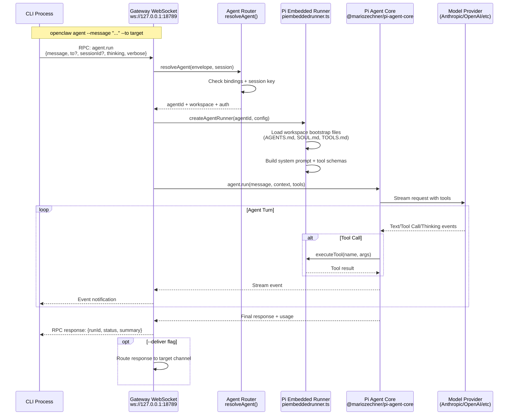
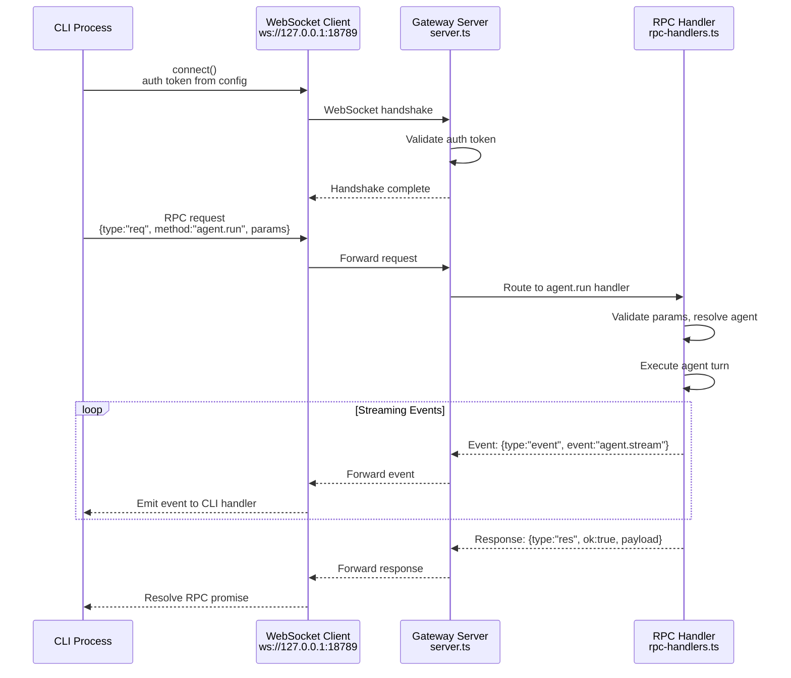

# エージェントコマンド

<details>
<summary>関連ソースファイル</summary>

この wiki ページの生成に使用されたファイル:

- [README.md](README.md)
- [assets/avatar-placeholder.svg](assets/avatar-placeholder.svg)
- [docs/channels/zalo.md](docs/channels/zalo.md)
- [docs/channels/zalouser.md](docs/channels/zalouser.md)
- [scripts/clawtributors-map.json](scripts/clawtributors-map.json)
- [scripts/update-clawtributors.ts](scripts/update-clawtributors.ts)
- [scripts/update-clawtributors.types.ts](scripts/update-clawtributors.types.ts)
- [src/commands/agent.test.ts](src/commands/agent.test.ts)
- [src/commands/agent.ts](src/commands/agent.ts)
- [src/config/config.ts](src/config/config.ts)
- [src/cron/isolated-agent.ts](src/cron/isolated-agent.ts)
- [src/cron/run-log.test.ts](src/cron/run-log.test.ts)
- [src/cron/run-log.ts](src/cron/run-log.ts)
- [src/cron/store.ts](src/cron/store.ts)
- [src/gateway/protocol/index.ts](src/gateway/protocol/index.ts)
- [src/gateway/protocol/schema.ts](src/gateway/protocol/schema.ts)
- [src/gateway/protocol/schema/agents-models-skills.ts](src/gateway/protocol/schema/agents-models-skills.ts)
- [src/gateway/protocol/schema/protocol-schemas.ts](src/gateway/protocol/schema/protocol-schemas.ts)
- [src/gateway/protocol/schema/types.ts](src/gateway/protocol/schema/types.ts)
- [src/gateway/server-methods-list.ts](src/gateway/server-methods-list.ts)
- [src/gateway/server-methods.ts](src/gateway/server-methods.ts)
- [src/gateway/server-methods/agents.ts](src/gateway/server-methods/agents.ts)
- [src/gateway/server.ts](src/gateway/server.ts)
- [src/index.test.ts](src/index.test.ts)
- [src/index.ts](src/index.ts)
- [tsconfig.json](tsconfig.json)
- [ui/src/styles.css](ui/src/styles.css)
- [ui/src/styles/layout.mobile.css](ui/src/styles/layout.mobile.css)

</details>


## 目的と範囲

このページでは、エージェント操作のための CLI コマンドについて説明します: エージェントターンの実行（`openclaw agent`）、マルチエージェント設定の管理（`openclaw agents`）、ダイレクトメッセージの送信（`openclaw message send`）、セッション状態の表示（`openclaw sessions`）。これらのコマンドは、エージェント実行とルーティングの直接制御を提供します。

エージェント実行の内部構造と Pi エージェントランタイムアーキテクチャについては、[Agent System](#5) を参照してください。エージェントの動作、モデル選択、マルチエージェントルーティングポリシーの設定については、[Multi-Agent Configuration](#4.3) を参照してください。

## 概要

エージェントコマンドはゲートウェイコントロールプレーンと対話して、エージェントターンを実行、分離されたエージェント設定を管理、メッセージルーティングを制御します。ゲートウェイはチャネルバインディングとセッションキーに基づいてインバウンドメッセージをエージェントにルーティングし、CLI コマンドはエージェント実行と設定管理への直接的なプログラムアクセスを提供します。

**コマンドカテゴリ:**

| Command | Purpose |
|---------|---------|
| `openclaw agent` | 単一エージェントターンを実行（即時実行） |
| `openclaw agents list/add/delete` | 専用ワークスペースと認証を持つ分離されたエージェント設定を管理 |
| `openclaw message send` | チャネルに直接メッセージを送信（エージェント実行をバイパス） |
| `openclaw sessions` | 保存された会話状態を表示してクエリ |

Sources: [docs/cli/index.md:438-510](), [README.md:438-480]()

---

## エージェントコマンドフロー



**実行モード:**
- **ゲートウェイモード（デフォルト）**: CLI は RPC リクエストをゲートウェイに送信; ゲートウェイが実行を調整
- **ローカルモード**（`--local`）: CLI はゲートウェイなしで埋め込みエージェントを直接実行（開発/テスト）
- **埋め込みランナー**: [src/agents/piembeddedrunner.ts]() は OpenClaw 統合用に Pi Agent Core をラップ

Sources: [docs/cli/index.md:438-480](), [src/agents/piembeddedrunner.ts:1-500]()

---

## `openclaw agent` - エージェントターンを実行

### 目的

ゲートウェイ経由（またはローカルに埋め込み）で単一エージェントターンを実行します。エージェントはメッセージを処理し、必要に応じてツールを呼び出し、応答を返します。オプションで、応答をメッセージングチャネルに配信し戻します。

### コマンド構文

```bash
openclaw agent --message <text> [options]
```

### 必須引数

| Argument | Description |
|----------|-------------|
| `--message <text>` | エージェントが処理する入力メッセージ |

### オプション

| Option | Description | Default |
|--------|-------------|---------|
| `--to <dest>` | セッションキー導出とオプションの配信のターゲット | `main` session |
| `--session-id <id>` | 明示的なセッション ID（`--to` 導出をオーバーライド） | Derived from `--to` |
| `--thinking <level>` | 拡張思考レベル: `off\|minimal\|low\|medium\|high\|xhigh` | Per-session default |
| `--verbose <mode>` | 詳細モード: `on\|full\|off` | Per-session default |
| `--channel <name>` | セッションキー導出用チャネル: `whatsapp\|telegram\|discord\|slack\|signal\|imessage` | `whatsapp` |
| `--local` | ゲートウェイなしでローカルに埋め込みエージェントを実行 | `false` (use Gateway) |
| `--deliver` | 実行後、ターゲットチャネルに応答を配信 | `false` (return only) |
| `--json` | JSON 応答を出力 | `false` (human-readable) |
| `--timeout <seconds>` | ゲートウェイ呼び出しの RPC タイムアウト | `120` |

### セッションキー解決

`--to` フラグは、コンテキスト分離のためのセッションキーを決定します:

```bash
# DM session (main key by default)
openclaw agent --message "Hello" --to +15555550123

# Group session (isolated from DM sessions)
openclaw agent --message "Status check" --to whatsapp:group:12345@g.us --channel whatsapp

# Explicit session ID (advanced)
openclaw agent --message "Continue" --session-id "main"
```

**セッションキーパターン**（[Session Management](#5.3) を参照）:
- `main` - デフォルトの直接対話セッション
- `dm:<channel>:<id>` - チャネル固有の DM セッション（`session.dmScope` が有効な場合）
- `group:<channel>:<id>` - グループチャットセッション

Sources: [docs/cli/index.md:462-477](), [src/config/sessions.ts:1-100]()

### 例

**基本的なエージェント実行:**

```bash
# Simple query (no delivery)
openclaw agent --message "What's the current time?"

# With extended thinking (GPT-5.2/Codex models)
openclaw agent --message "Analyze this codebase" --thinking high

# Verbose output with full tool traces
openclaw agent --message "Debug the gateway" --verbose full
```

**配信付き実行:**

```bash
# Execute and send response to WhatsApp contact
openclaw agent --message "Send status report" --to +15555550123 --deliver

# Execute in group context and reply back
openclaw agent --message "Summarize discussion" \
  --to whatsapp:group:12345@g.us \
  --channel whatsapp \
  --deliver
```

**ローカル埋め込み実行（開発）:**

```bash
# Run without Gateway (uses local config + embedded Pi runtime)
openclaw agent --local --message "Test agent response"
```

**JSON 出力（オートメーション）:**

```bash
# Machine-readable response
openclaw agent --message "List files" --json
```

Sources: [docs/cli/index.md:462-477](), [docs/start/getting-started.md:186-194]()

### ローカルとゲートウェイ実行の比較

| Mode | Gateway Connection | Use Case |
|------|-------------------|----------|
| **Gateway (default)** | WebSocket 経由で実行中のゲートウェイに接続 | 本番環境での使用、マルチチャネルルーティング、セッション永続化 |
| **Local** (`--local`) | 埋め込み Pi ランタイム、ゲートウェイなし | 開発、テスト、オフライン実行 |

**ゲートウェイ実行:**
- 実行中のゲートウェイが必要: `openclaw gateway status`
- ゲートウェイのエージェントルーティングとセッション管理を使用
- マルチエージェントバインディングとワークスペース分離を尊重
- チャネルへの配信をサポート（`--deliver`）

**ローカル実行:**
- ゲートウェイ不要
- CLI プロセス環境と設定を使用
- 単一エージェントに制限（マルチエージェントルーティングなし）
- チャネル配信サポートなし

Sources: [docs/cli/index.md:462-477](), [src/agents/piembeddedrunner.ts:1-100]()

---

## `openclaw agents` - マルチエージェント管理

### 目的

専用ワークスペース、認証プロファイル、チャネルバインディングを持つ分離されたエージェント設定を管理します。各エージェントは独自の以下を持ちます:
- **ワークスペースディレクトリ**（`agents.list[].workspace`）に `AGENTS.md`, `SOUL.md`, `TOOLS.md`, スキルを含む
- **認証プロファイル**（`~/.openclaw/agents/<agentId>/agent/auth-profiles.json`）に OAuth トークンと API キーを含む
- **セッションストア**（`~/.openclaw/agents/<agentId>/sessions/`）に会話履歴を含む
- **チャネルバインディング**（`agents.bindings[]`）にインバウンドメッセージのルーティング先を含む

マルチエージェントルーティングは以下のようなシナリオを可能にします:
- 仕事用と個人用エージェントの分離
- 顧客ごとのエージェントインスタンス
- 専用レスキュー/フォールバックエージェント

Sources: [docs/cli/index.md:479-510](), [docs/start/wizard.md:162-180]()

### エージェント設定構造

```mermaid
graph TB
    subgraph "Gateway Agent Router"
        Envelope[Inbound Message Envelope<br/>channel + accountId + sender]
        Router[resolveAgent<br/>routing/agents.ts]
        Bindings[agents.bindings[]<br/>channel:account patterns]
        Fallback[Fallback to 'main' agent]
    end

    subgraph "Agent 'main'"
        MainWorkspace[Workspace<br/>~/.openclaw/workspace]
        MainAuth[Auth Profiles<br/>agents/main/agent/auth-profiles.json]
        MainSessions[Sessions<br/>agents/main/sessions/]
        MainConfig[Agent Config<br/>agents.defaults.*]
    end

    subgraph "Agent 'work'"
        WorkWorkspace[Workspace<br/>~/.openclaw/workspace-work]
        WorkAuth[Auth Profiles<br/>agents/work/agent/auth-profiles.json]
        WorkSessions[Sessions<br/>agents/work/sessions/]
        WorkConfig[Agent Override<br/>agents.list[id=work].*]
    end

    Envelope --> Router
    Router --> Bindings
    Bindings -->|"Match: whatsapp:biz"| WorkWorkspace
    Bindings -->|"No match"| Fallback
    Fallback --> MainWorkspace

    WorkWorkspace --> WorkAuth
    WorkWorkspace --> WorkSessions
    WorkWorkspace --> WorkConfig

    MainWorkspace --> MainAuth
    MainWorkspace --> MainSessions
    MainWorkspace --> MainConfig
```

**バインディング解決:**
1. ゲートウェイはインバウンドエンベロープから `channel` + `accountId` を抽出
2. `agents.bindings[].bind` パターンにマッチ（例: `whatsapp:biz`）
3. マッチしたエージェントにルーティングするか、`main` にフォールバック
4. エージェント固有のワークスペースと認証がロードされる

Sources: [docs/start/wizard.md:162-180](), [src/routing/agents.ts:1-200]()

---

## `openclaw agents list` - 設定されたエージェントを一覧表示

### 目的

設定されたすべてのエージェントをワークスペースパス、バインディング、設定オーバーライドとともに表示します。

### コマンド構文

```bash
openclaw agents list [options]
```

### オプション

| Option | Description |
|--------|-------------|
| `--json` | JSON 出力（完全な設定詳細を含む） |
| `--bindings` | 各エージェントのチャネルバインディングを表示 |

### 出力フィールド

| Field | Description |
|-------|-------------|
| Agent ID | 一意識別子（例: `main`, `work`, `personal`） |
| Workspace | ワークスペースディレクトリパス |
| Model | 設定されたモデル（デフォルトからオーバーライドされている場合） |
| Bindings | チャネルルーティングパターン（`--bindings` が設定されている場合） |

### 例

```bash
# List all agents (human-readable)
openclaw agents list

# Show with channel bindings
openclaw agents list --bindings

# JSON output (for automation)
openclaw agents list --json
```

**出力例:**

```
Agents:
  main
    Workspace: ~/.openclaw/workspace
    Model: anthropic/claude-opus-4-5

  work
    Workspace: ~/.openclaw/workspace-work
    Model: openai/gpt-5.2
    Bindings: whatsapp:biz, telegram:work
```

Sources: [docs/cli/index.md:479-488]()

---

## `openclaw agents add` - 新しいエージェントを作成

### 目的

専用ワークスペース、オプションのモデル設定、チャネルバインディングを持つ新しい分離エージェントを作成します。非対話型フラグが指定されない限り、コマンドはインタラクティブウィザードを実行します。

### コマンド構文

```bash
openclaw agents add [name] [options]
```

### 引数

| Argument | Description |
|----------|-------------|
| `[name]` | エージェント識別子（例: `work`, `personal`） |

### オプション

| Option | Required (non-interactive) | Description |
|--------|----------------------------|-------------|
| `--workspace <dir>` | Yes | ワークスペースディレクトリパス |
| `--model <id>` | No | デフォルトモデルをオーバーライド（例: `openai/gpt-5.2`） |
| `--agent-dir <dir>` | No | エージェント状態ディレクトリ（デフォルト: `~/.openclaw/agents/<name>`） |
| `--bind <pattern>` | No | チャネルバインディング（繰り返し可能） |
| `--non-interactive` | No | ウィザードをスキップ（`--workspace` が必要） |
| `--json` | No | JSON 結果を出力 |

### チャネルバインディングパターン

バインディングは `channel[:accountId]` フォーマットを使用します:

| Pattern | Matches |
|---------|---------|
| `whatsapp` | デフォルト WhatsApp アカウント |
| `whatsapp:biz` | ID `biz` の WhatsApp アカウント |
| `telegram:alerts` | ID `alerts` の Telegram アカウント |
| `discord:work` | ID `work` の Discord ボット |

**複数のバインディング:**
- `--bind` を複数回使用: `--bind whatsapp:biz --bind telegram:work`
- エージェントはマッチしたチャネルからのすべてのインバウンドメッセージを受信

Sources: [docs/cli/index.md:489-502](), [docs/start/wizard.md:162-180]()

### 例

**インタラクティブウィザード（初回セットアップに推奨）:**

```bash
# Guided setup with prompts
openclaw agents add work
```

ウィザードは以下をプロンプトします:
1. ワークスペースの場所（デフォルト: `~/.openclaw/workspace-<name>`）
2. モデルオーバーライド（またはデフォルトから継承）
3. チャネルバインディング（オプション）
4. 確認

**非対話型（オートメーション/スクリプト）:**

```bash
# Minimal agent with workspace only
openclaw agents add work \
  --workspace ~/.openclaw/workspace-work \
  --non-interactive

# Agent with model override
openclaw agents add personal \
  --workspace ~/agents/personal \
  --model anthropic/claude-opus-4-5 \
  --non-interactive

# Agent with channel bindings
openclaw agents add work \
  --workspace ~/.openclaw/workspace-work \
  --model openai/gpt-5.2 \
  --bind whatsapp:biz \
  --bind telegram:work \
  --non-interactive \
  --json
```

**書き込まれる設定:**

コマンドは `~/.openclaw/openclaw.json` に書き込みます:

```json
{
  "agents": {
    "list": [
      {
        "id": "work",
        "workspace": "~/.openclaw/workspace-work",
        "model": "openai/gpt-5.2"
      }
    ],
    "bindings": [
      {
        "bind": "whatsapp:biz",
        "agent": "work"
      },
      {
        "bind": "telegram:work",
        "agent": "work"
      }
    ]
  }
}
```

Sources: [docs/cli/index.md:489-502](), [docs/start/wizard.md:162-180]()

### ワークスペース初期化

エージェント作成時、ワークスペースにはブートストラップファイルがシードされます:

| File | Purpose |
|------|---------|
| `AGENTS.md` | エージェントのアイデンティティと動作ガイドライン |
| `SOUL.md` | 性格とトーンの指示 |
| `TOOLS.md` | 利用可能なツールの説明と使用例 |
| `skills/` | オプションのスキルモジュール（別途インストール） |

これらのファイルは、エージェント実行中に Pi Embedded Runner によってシステムプロンプトに注入されます。

Sources: [src/agents/piembeddedrunner.ts:100-200](), [docs/reference/templates/AGENTS]()

---

## `openclaw agents delete` - エージェントを削除

### 目的

エージェント設定を削除し、オプションでワークスペースと状態ディレクトリを削除します。

### コマンド構文

```bash
openclaw agents delete <id> [options]
```

### 引数

| Argument | Required | Description |
|----------|----------|-------------|
| `<id>` | Yes | 削除するエージェント識別子 |

### オプション

| Option | Description |
|--------|-------------|
| `--force` | 確認プロンプトをスキップ |
| `--json` | JSON 結果を出力 |

### 削除範囲

**設定クリーンアップ:**
- `agents.list[]` からエージェントを削除
- `agents.bindings[]` から関連バインディングを削除
- デフォルトではワークスペースと状態ディレクトリを保持

**オプションのワークスペース/状態削除:**
- コマンドはワークスペースとエージェント状態を削除するかどうかをプロンプト
- プロンプトなしで自動確認するには `--force` を使用

### 例

```bash
# Delete agent (interactive confirmation)
openclaw agents delete work

# Force delete without prompt
openclaw agents delete work --force

# JSON output
openclaw agents delete work --force --json
```

**対話例:**

```
Delete agent 'work'?
  Config: ~/.openclaw/openclaw.json
  Workspace: ~/.openclaw/workspace-work
  State: ~/.openclaw/agents/work

Remove workspace and state? [y/N]: y
Agent 'work' deleted.
```

Sources: [docs/cli/index.md:504-510]()

---

## マルチエージェントバインディング解決

```mermaid
flowchart TD
    Start[Inbound Message Envelope] --> Extract[Extract channel + accountId<br/>from envelope]
    Extract --> LoadBindings[Load agents.bindings[]]
    LoadBindings --> MatchLoop{For each binding}

    MatchLoop -->|bind pattern| CheckPattern{Pattern matches<br/>channel:accountId?}
    CheckPattern -->|Yes| AgentMatch[Agent: binding.agent]
    CheckPattern -->|No| NextBinding[Try next binding]
    NextBinding --> MatchLoop

    MatchLoop -->|No bindings left| FallbackMain[Agent: 'main'<br/>default fallback]

    AgentMatch --> LoadAgent[Load agent config<br/>agents.list or agents.defaults]
    FallbackMain --> LoadAgent

    LoadAgent --> Workspace[Resolve workspace path<br/>~/.openclaw/workspace-*]
    LoadAgent --> Auth[Load auth profiles<br/>~/.openclaw/agents/*/agent/auth-profiles.json]
    LoadAgent --> Sessions[Load session store<br/>~/.openclaw/agents/*/sessions/]

    Workspace --> Execute[Execute agent turn]
    Auth --> Execute
    Sessions --> Execute
```

**バインディング優先順位:**
1. **完全一致**: `whatsapp:biz` はチャネル `whatsapp`、アカウント ID `biz` にマッチ
2. **チャネルのみのマッチ**: `telegram` は任意の Telegram アカウントにマッチ
3. **フォールバック**: マッチなし → `main` エージェントを使用

**ルーティングテーブル例:**

| Inbound Message | Binding Match | Agent |
|-----------------|---------------|-------|
| WhatsApp account `default` from +1234567890 | No explicit binding | `main` |
| WhatsApp account `biz` from +0987654321 | `whatsapp:biz` → `work` | `work` |
| Telegram bot `alerts` from user 12345 | `telegram:alerts` → `personal` | `personal` |
| Discord bot `work` from guild 67890 | `discord:work` → `work` | `work` |

Sources: [src/routing/agents.ts:1-200](), [docs/start/wizard.md:162-180]()

---

## `openclaw message send` - ダイレクトメッセージング

### 目的

エージェント実行を呼び出さずにチャネルに直接メッセージを送信します。以下に便利です:
- チャネル接続のテスト
- 通知/アラートの送信
- 事前にフォーマットされたコンテンツの配信
- エージェント処理のバイパス

これは、最初にエージェントを実行してから応答を配信する `openclaw agent --deliver` とは異なります。

### コマンド構文

```bash
openclaw message send --target <target> --message <text> [options]
```

### 必須引数

| Argument | Description |
|----------|-------------|
| `--target <target>` | 宛先識別子（電話番号、チャネル ID、ユーザー名） |
| `--message <text>` | 送信するメッセージテキスト |

### オプション

詳細オプションについては、[Message Commands](#12.3) の完全な `openclaw message` コマンドリファレンスを参照してください。リアクション、編集、添付、チャネル固有のアクションなどの高度なオプションが含まれます。

### 例

```bash
# Send to WhatsApp contact
openclaw message send --target +15555550123 --message "Hello from OpenClaw"

# Send to Telegram chat
openclaw message send --channel telegram --target 123456789 --message "Alert: Service restarted"

# Send to Discord channel
openclaw message send --channel discord --target channel:1234567890 --message "Status update"
```

Sources: [docs/cli/index.md:438-460](), [README.md:189-194]()

---

## `openclaw sessions` - セッション管理

### 目的

アクティビティ、エージェント、セッションタイプでフィルタリングして、保存された会話セッションを一覧表示してクエリします。

### コマンド構文

```bash
openclaw sessions [options]
```

### オプション

| Option | Description | Default |
|--------|-------------|---------|
| `--json` | JSON 出力 | Human-readable |
| `--verbose` | 完全なセッションメタデータを含める | Summary only |
| `--store <path>` | 明示的なセッションストアパス | Per-agent default |
| `--active <minutes>` | 過去 N 分以内にアクティブなセッションにフィルタリング | All sessions |

### 出力フィールド

| Field | Description |
|-------|-------------|
| Session Key | セッション識別子（例: `main`, `dm:whatsapp:+1234567890`, `group:telegram:12345`） |
| Agent | 関連するエージェント ID |
| Last Activity | 最新メッセージのタイムスタンプ |
| Message Count | セッション内の総メッセージ数 |
| Context Size | おおよそのトークン数（利用可能な場合） |

### セッションキーパターン

| Pattern | Description | Example |
|---------|-------------|---------|
| `main` | デフォルトの直接対話セッション | `main` |
| `dm:<channel>:<id>` | チャネル固有の DM セッション | `dm:telegram:123456789` |
| `group:<channel>:<id>` | グループチャットセッション | `group:whatsapp:12345@g.us` |

**セッション分離:**
- 各エージェントは個別のセッションストアを持つ
- DM とグループセッションはチャネルと識別子で分離
- セッションはゲートウェイ再起動後も保持

Sources: [docs/cli/index.md:551-558](), [src/config/sessions.ts:1-100]()

### 例

```bash
# List all sessions
openclaw sessions

# Show verbose session details
openclaw sessions --verbose

# Filter to recently active sessions (last 60 minutes)
openclaw sessions --active 60

# JSON output for automation
openclaw sessions --json
```

**出力例:**

```
Sessions:
  main (agent: main)
    Last activity: 2 minutes ago
    Messages: 45
    Context: ~12K tokens

  dm:telegram:123456789 (agent: personal)
    Last activity: 1 hour ago
    Messages: 23
    Context: ~8K tokens

  group:whatsapp:12345@g.us (agent: work)
    Last activity: 5 hours ago
    Messages: 78
    Context: ~24K tokens (compacted)
```

Sources: [docs/cli/index.md:551-558]()

### セッションストアの場所

セッションは `~/.openclaw/agents/<agentId>/sessions/` にエージェントごとに保存されます:

```
~/.openclaw/agents/
├── main/
│   └── sessions/
│       ├── main.json
│       ├── dm_telegram_123456789.json
│       └── group_whatsapp_12345@g.us.json
└── work/
    └── sessions/
        ├── main.json
        └── group_discord_67890.json
```

**セッション永続化:**
- JSON ファイルにはメッセージ履歴、コンテキスト状態、メタデータが含まれる
- セッションはエージェント実行中にオンデマンドでロード
- コンテキストがモデル制限を超えると自動コンパクション

Sources: [src/config/sessions.ts:1-100](), [docs/concepts/session.md]()

---

## ゲートウェイ RPC との統合

すべてのエージェントコマンドは、ゲートウェイモードが使用される場合（デフォルト）、WebSocket RPC 経由でゲートウェイと通信します。CLI は接続を確立し、リクエストを送信し、応答/イベントを受信します。



**認証:**
- ゲートウェイ認証トークン: `gateway.auth.token` または `OPENCLAW_GATEWAY_TOKEN`
- CLI は設定または環境変数からトークンをロード
- Tailscale Serve アイデンティティバイパス: `gateway.auth.allowTailscale`

**使用される RPC メソッド:**
- `agent.run` - エージェントターンを実行
- `agents.list` - 設定されたエージェントを一覧表示
- `agents.add` - 新しいエージェントを作成
- `agents.delete` - エージェントを削除
- `message.send` - ダイレクトメッセージを送信
- `sessions.list` - セッションをクエリ

Sources: [src/gateway/server.ts:1-200](), [docs/gateway/protocol.md]()

---

## エラー処理とトラブルシューティング

### 一般的な問題

| Issue | Cause | Solution |
|-------|-------|----------|
| "No auth configured for provider" | エージェントの認証ストアに API キーまたは OAuth トークンがない | `openclaw models auth setup-token` を実行するか、オンボーディングを再実行 |
| "Gateway not responding" | ゲートウェイが実行されていないか、接続失敗 | `openclaw gateway status` をチェック、ポートとトークンを確認 |
| "Session not found" | 無効なセッション ID またはキー | `openclaw sessions` を使用して有効なセッションを一覧表示 |
| "Agent 'work' not found" | エージェント ID が設定に存在しない | `openclaw agents list` で確認 |
| "Binding pattern already exists" | `agents.bindings[]` に重複したバインディング | 重複を削除するか、パターンを変更 |

### 診断コマンド

```bash
# Check Gateway connectivity
openclaw gateway status
openclaw gateway probe

# Verify agent configuration
openclaw agents list --bindings --json

# Check session state
openclaw sessions --verbose

# View recent logs
openclaw logs --follow

# Full system status
openclaw status --all
```

Sources: [docs/gateway/troubleshooting.md:1-100](), [docs/cli/index.md:514-527]()

---

## 関連項目

- [Gateway Commands](#12.1) - ゲートウェイサービス管理と制御
- [Channel Commands](#12.3) - チャネルセットアップとメッセージルーティング
- [Agent System](#5) - エージェント実行フローと内部構造
- [Multi-Agent Configuration](#4.3) - 分離されたエージェントの設定
- [Session Management](#5.3) - セッションライフサイクルとコンテキスト処理

---
