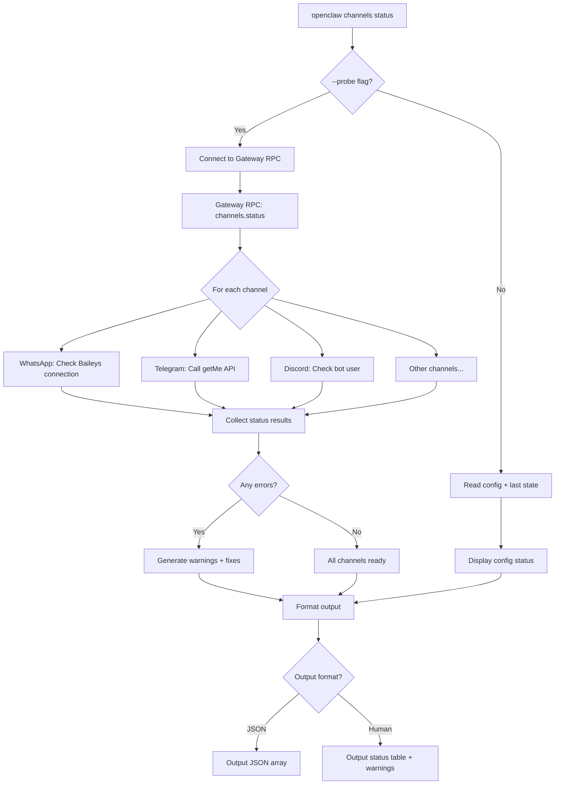
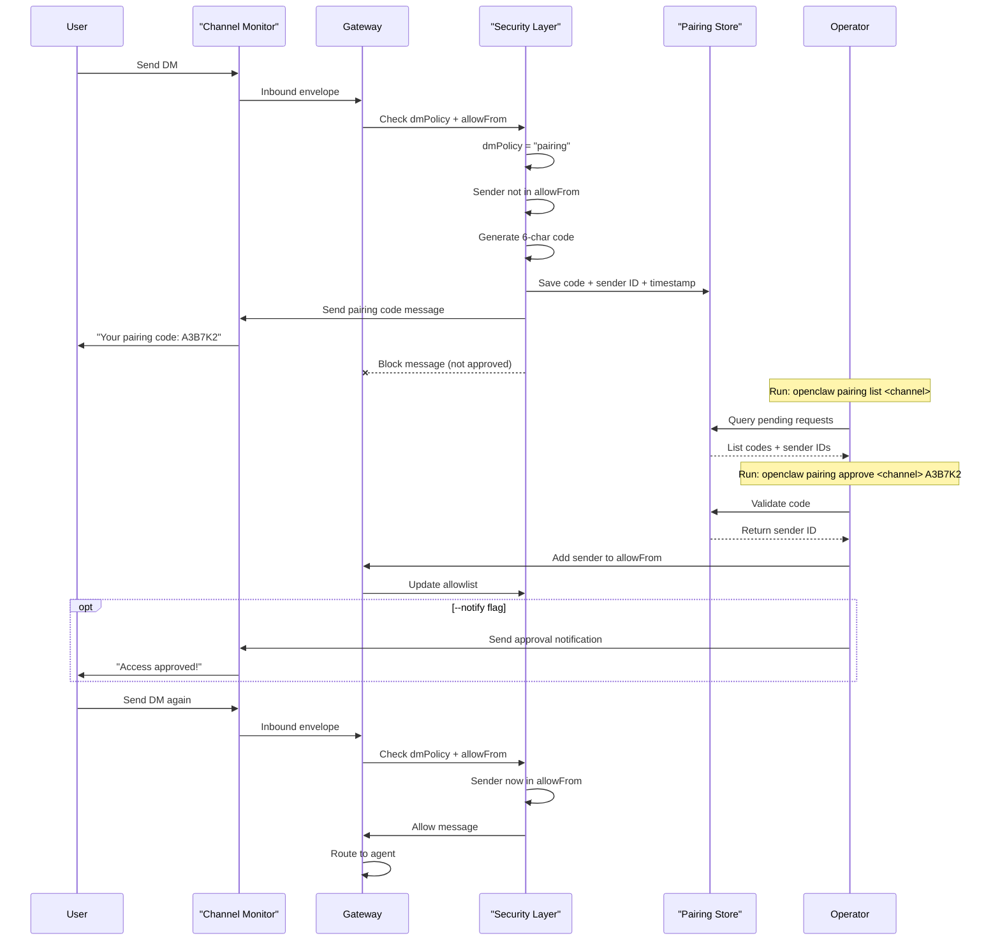
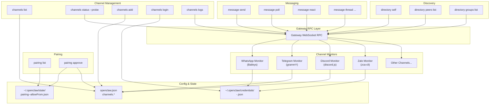

# チャネルコマンド

<details>
<summary>関連ソースファイル</summary>

この wiki ページの生成に使用されたファイル:

- [README.md](README.md)
- [assets/avatar-placeholder.svg](assets/avatar-placeholder.svg)
- [docs/channels/zalo.md](docs/channels/zalo.md)
- [docs/channels/zalouser.md](docs/channels/zalouser.md)
- [docs/cli/index.md](docs/cli/index.md)
- [docs/docs.json](docs/docs.json)
- [docs/gateway/index.md](docs/gateway/index.md)
- [docs/gateway/troubleshooting.md](docs/gateway/troubleshooting.md)
- [docs/index.md](docs/index.md)
- [docs/start/getting-started.md](docs/start/getting-started.md)
- [docs/start/hubs.md](docs/start/hubs.md)
- [docs/start/onboarding.md](docs/start/onboarding.md)
- [docs/start/wizard.md](docs/start/wizard.md)
- [scripts/clawtributors-map.json](scripts/clawtributors-map.json)
- [scripts/update-clawtributors.ts](scripts/update-clawtributors.ts)
- [scripts/update-clawtributors.types.ts](scripts/update-clawtributors.types.ts)
- [src/config/config.ts](src/config/config.ts)
- [src/index.test.ts](src/index.test.ts)
- [src/index.ts](src/index.ts)
- [tsconfig.json](tsconfig.json)
- [ui/src/styles.css](ui/src/styles.css)
- [ui/src/styles/layout.mobile.css](ui/src/styles/layout.mobile.css)

</details>


このページでは、メッセージングチャネルの管理、ペアリング承認の処理、メッセージの送信、チャネルエンティティの検出のための CLI コマンドについて説明します。一般的な CLI リファレンスについては、[CLI Reference](#12) を参照してください。チャネルの設定とセットアップガイドについては、[Channels](/channels) を参照してください。

関連ページ:
- ゲートウェイコマンド: [Gateway Commands](#12.1)
- エージェントコマンド: [Agent Commands](#12.2)
- チャネル設定: [Configuration](/gateway/configuration)
- チャネルペアリングシステム: [Pairing](/channels/pairing)

---

## コマンドカテゴリ

OpenClaw は 4 つのカテゴリのチャネル関連コマンドを提供します:

| Category | Commands | Purpose |
|----------|----------|---------|
| **Channel Management** | `channels list`, `channels status`, `channels add`, `channels remove`, `channels login`, `channels logout`, `channels logs` | チャネル接続の設定と監視 |
| **Pairing** | `pairing list`, `pairing approve` | ペアリングコードによる DM アクセス制御の管理 |
| **Messaging** | `message send`, `message poll`, `message react`, `message thread`, etc. | メッセージの送信とチャネル固有のアクションの実行 |
| **Directory** | `directory self`, `directory peers`, `directory groups` | チャネルエンティティ（ユーザー、グループ）とその ID の検出 |

**Sources:** [docs/cli/index.md:372-456]()

---

## チャネル管理コマンド

### `channels list`

設定されたすべてのチャネルとそのアカウント詳細を表示します。

```bash
openclaw channels list
openclaw channels list --json
openclaw channels list --no-usage
```

**オプション:**

| Option | Description |
|--------|-------------|
| `--json` | 構造化 JSON 出力（`--no-usage` が設定されない限り使用量を含む） |
| `--no-usage` | OAuth/API 使用量スナップショットのルックアップをスキップ |

**出力に含まれるもの:**
- チャネル名とアカウント ID
- 表示名
- 接続状態
- トークン/認証情報の要約
- OAuth プロファイルの有効期限（該当する場合）

**出力例:**
```
Channels:
  whatsapp:default (enabled)
  telegram:default (enabled, token configured)
  discord:work (enabled, bot token configured)

OAuth profiles:
  anthropic:main (expires in 3d 4h)
```

**Sources:** [docs/cli/index.md:405-409]()

---

### `channels status`

ゲートウェイ到達可能性とチャネルヘルスをチェックします。このコマンドはゲートウェイ RPC エンドポイントをプローブし、オプションでライブチャネルチェックを実行します。

```bash
openclaw channels status
openclaw channels status --probe
openclaw channels status --json
```

**オプション:**

| Option | Description |
|--------|-------------|
| `--probe` | 各チャネルのライブ接続チェックを実行 |
| `--json` | 構造化 JSON 出力 |

**状態インジケーター:**
- `ready` — チャネルが接続され、動作可能
- `disabled` — チャネルが設定で有効化されていない
- `not_configured` — 必要な認証情報が不足
- `error` — 接続失敗または認証情報が無効

**動作:**
- `--probe` なし: 設定状態と最後の既知の状態を報告
- `--probe` あり: 各チャネルの API 接続性をアクティブにテスト
- 一般的な設定ミスに対する修正提案付きの警告を出力
- 自動修復のために `openclaw doctor` を指摘

**例:**
```bash
$ openclaw channels status --probe
Gateway: running (ws://127.0.0.1:18789)

Channels:
  whatsapp:default   ready (connected)
  telegram:default   ready (bot active)
  discord:work       error (invalid token)

Warnings:
  - discord:work token appears invalid; run: openclaw channels add --channel discord --account work
```

**Sources:** [docs/cli/index.md:380-382](), [docs/gateway/troubleshooting.md:122-151]()

---

#### チャネルステータスフロー図



**Sources:** [docs/cli/index.md:380-382](), [docs/gateway/troubleshooting.md:122-151]()

---

### `channels logs`

ゲートウェイログファイルから最近のチャネル関連ログエントリを表示します。

```bash
openclaw channels logs
openclaw channels logs --channel telegram
openclaw channels logs --lines 500
openclaw channels logs --json
```

**オプション:**

| Option | Description |
|--------|-------------|
| `--channel <name\|all>` | チャネル名でフィルタリング（デフォルト: `all`） |
| `--lines <n>` | 取得する最近の行数（デフォルト: `200`） |
| `--json` | 行区切り JSON 出力 |

**サポートされるチャネル:** `whatsapp`, `telegram`, `discord`, `slack`, `googlechat`, `mattermost`, `signal`, `imessage`, `msteams`, `matrix`, `zalo`, `zalouser`, `bluebubbles`, `web`

**例:**
```bash
$ openclaw channels logs --channel telegram --lines 50
[2025-01-15 14:32:10] [telegram] bot connected: @mybot
[2025-01-15 14:32:15] [telegram] received message from user 123456789
[2025-01-15 14:32:16] [telegram] sent reply to user 123456789
```

**Sources:** [docs/cli/index.md:410-413]()

---

### `channels add`

チャネルアカウントを追加または設定します。フラグなしで実行するとインタラクティブウィザードを起動します; フラグは非対話モードを有効にします。

```bash
# Interactive mode (wizard)
openclaw channels add

# Non-interactive mode
openclaw channels add --channel telegram --account alerts \
  --name "Alerts Bot" --token $TELEGRAM_BOT_TOKEN

openclaw channels add --channel discord --account work \
  --name "Work Bot" --token $DISCORD_BOT_TOKEN
```

**共通オプション:**

| Option | Description |
|--------|-------------|
| `--channel <name>` | チャネルタイプ（非対話では必須） |
| `--account <id>` | アカウント識別子（デフォルト: `default`） |
| `--name <label>` | アカウントの表示名 |
| `--token <token>` | ボットトークンまたは API キー（チャネル固有） |

**チャネル固有のオプション:**

| Channel | Additional Options |
|---------|-------------------|
| **WhatsApp** | `--allow-from <phone>` (repeatable) |
| **Telegram** | `--webhook-url <url>`, `--webhook-secret <secret>` |
| **Discord** | `--guilds <id>` (repeatable), `--dm-policy <pairing\|allowlist\|open>` |
| **Slack** | `--app-token <token>`, `--signing-secret <secret>` |

**動作:**
- フラグなし: プロンプト付きのガイド付きセットアップを起動
- フラグあり: 設定に直接適用
- 可能な場合は認証情報を検証
- `channels.<channel>.accounts.<account>` またはトップレベルのチャネル設定に書き込み

**対話例:**
```bash
$ openclaw channels add
? Select channel type: Telegram
? Account ID [default]: alerts
? Display name: Alerts Bot
? Bot token: ****************************************
? Enable webhook mode? No
✓ Added telegram:alerts
```

**Sources:** [docs/cli/index.md:384-385](), [docs/cli/index.md:418-426](), [README.md:335-397]()

---

### `channels remove`

チャネルアカウントを無効化または削除します。

```bash
# Disable (default)
openclaw channels remove --channel discord --account work

# Delete from config
openclaw channels remove --channel discord --account work --delete
```

**オプション:**

| Option | Description |
|--------|-------------|
| `--channel <name>` | チャネルタイプ |
| `--account <id>` | アカウント識別子（デフォルト: `default`） |
| `--delete` | 無効化ではなく、設定エントリを削除 |

**動作:**
- デフォルト: アカウントの `enabled: false` を設定
- `--delete` あり: 設定からアカウントエントリを完全に削除
- `--yes` が渡されない限り確認をプロンプト

**Sources:** [docs/cli/index.md:385]()

---

### `channels login`

QR コードまたは OAuth フローを必要とするチャネル（現在は WhatsApp と Zalo Personal）のインタラクティブログインを実行します。

```bash
# WhatsApp Web QR login
openclaw channels login
openclaw channels login --channel whatsapp --account default

# Zalo Personal QR login (requires zca-cli)
openclaw channels login --channel zalouser
```

**オプション:**

| Option | Description |
|--------|-------------|
| `--channel <name>` | チャネルタイプ（デフォルト: `whatsapp`） |
| `--account <id>` | アカウント識別子（デフォルト: `default`） |
| `--verbose` | 詳細な接続ログを表示 |

**サポートされるチャネル:**
- `whatsapp` / `web` — Baileys QR コードフロー
- `zalouser` — zca-cli QR コードフロー（プラグインが必要）

**ログインプロセス:**
1. コマンドが QR コードを生成またはリクエスト
2. ユーザーがモバイルアプリで QR コードをスキャン
3. 認証情報が `~/.openclaw/credentials/<channel>-<account>.json` に保存
4. ゲートウェイは保存された認証情報を使用して再接続可能

**例:**
```bash
$ openclaw channels login --channel whatsapp
Connecting to WhatsApp Web...
Scan this QR code with your phone:

█████████████████████████████
█████████████████████████████
████ ▄▄▄▄▄ █▀ █▀▀██ ▄▄▄▄▄ ████
████ █   █ █▀ █  ▀█ █   █ ████
[QR code displayed]

✓ Connected as +1234567890
Credentials saved to ~/.openclaw/credentials/whatsapp-default.json
```

**Sources:** [docs/cli/index.md:395-399](), [docs/channels/whatsapp.md](), [docs/channels/zalouser.md:32-34]()

---

### `channels logout`

チャネルセッションからログアウトします（ログアウトをサポートするチャネルの認証情報を削除）。

```bash
openclaw channels logout --channel whatsapp
openclaw channels logout --channel zalouser --account personal
```

**オプション:**

| Option | Description |
|--------|-------------|
| `--channel <name>` | チャネルタイプ（デフォルト: `whatsapp`） |
| `--account <id>` | アカウント識別子（デフォルト: `default`） |

**動作:**
- アクティブなセッションを切断
- `~/.openclaw/credentials/` から認証情報ファイルを削除
- チャネルが再び使用できるようになるには再ログインが必要

**Sources:** [docs/cli/index.md:400-403]()

---

## ペアリングコマンド

ペアリングコマンドは、`dmPolicy: "pairing"` が設定されている場合の DM アクセス制御を管理します。不明な送信者には短いペアリングコードが送信されます; コードが承認されるまでメッセージはブロックされます。

ペアリングシステムの詳細なドキュメントについては、[Pairing](/channels/pairing) を参照してください。

---

### `pairing list`

チャネルの保留中のペアリングリクエストを表示します。

```bash
openclaw pairing list telegram
openclaw pairing list whatsapp --json
```

**出力に含まれるもの:**
- 送信者識別子（電話番号、ユーザー ID、ユーザー名）
- 生成されたペアリングコード
- リクエストタイムスタンプ
- 有効期限（コードは 1 時間後に期限切れ）

**例:**
```bash
$ openclaw pairing list telegram
Pending pairing requests:

  User: @alice (ID: 123456789)
  Code: A3B7K2
  Requested: 2 minutes ago
  Expires: in 58 minutes

  User: @bob (ID: 987654321)
  Code: F8L2M9
  Requested: 15 minutes ago
  Expires: in 45 minutes
```

**Sources:** [docs/cli/index.md:451-453](), [README.md:113-119]()

---

### `pairing approve`

保留中のペアリングリクエストを承認し、送信者をチャネルの許可リストに追加します。

```bash
openclaw pairing approve telegram A3B7K2
openclaw pairing approve whatsapp F8L2M9 --notify
```

**オプション:**

| Option | Description |
|--------|-------------|
| `--notify` | 送信者に承認通知を送信 |

**動作:**
1. ペアリングコードを検証
2. 送信者 ID を設定の `channels.<channel>.allowFrom` に追加
3. ペアリングを `~/.openclaw/state/pairing-<channel>-allowFrom.json` に永続化
4. オプションで送信者に確認メッセージを送信

**例:**
```bash
$ openclaw pairing approve telegram A3B7K2 --notify
✓ Approved @alice (ID: 123456789)
✓ Added to telegram allowlist
✓ Sent approval notification
```

**Sources:** [docs/cli/index.md:453](), [README.md:113-119](), [docs/channels/pairing.md]()

---

#### ペアリングワークフロー図



**Sources:** [docs/channels/pairing.md](), [docs/cli/index.md:446-453]()

---

## メッセージコマンド

`message` コマンドツリーは、統一されたアウトバウンドメッセージングとチャネル固有のアクションを提供します。完全なドキュメントについては、[Message CLI](/cli/message) を参照してください。

### コアメッセージ操作

#### `message send`

チャネルターゲットにテキストまたはメディアメッセージを送信します。

```bash
openclaw message send --target +15555550123 --message "Hello"
openclaw message send --channel telegram --target 123456789 --message "Hi"
openclaw message send --channel discord --target channel:987654321 \
  --message "Deployment complete" --thread-id 111222333
```

**オプション:**

| Option | Description |
|--------|-------------|
| `--target <id>` | ターゲット識別子（電話、ユーザー ID、チャネル ID） |
| `--message <text>` | メッセージ内容 |
| `--channel <name>` | チャネルタイプ（可能な場合はターゲットから自動検出） |
| `--account <id>` | チャネルアカウント（デフォルト: `default`） |
| `--thread-id <id>` | 特定のスレッドに送信（Discord, Slack） |
| `--image <path>` | 画像ファイルを添付 |
| `--file <path>` | ファイルを添付 |

**チャネル別のターゲットフォーマット:**

| Channel | Target Format | Examples |
|---------|--------------|----------|
| **WhatsApp** | E.164 電話番号 | `+15555550123` |
| **Telegram** | 数値のユーザー/チャット ID | `123456789`, `-1001234567890` |
| **Discord** | `channel:ID` または `user:ID` | `channel:987654321`, `user:123` |
| **Slack** | チャネル ID またはユーザー ID | `C01234ABCD`, `U56789EFGH` |
| **Google Chat** | スペース名 | `spaces/AAAA` |

**Sources:** [docs/cli/index.md:474-495](), [README.md:69-73]()

---

#### `message poll`

ポールをサポートするチャネル（Discord, Telegram, Slack）でポールを作成します。

```bash
openclaw message poll --channel discord --target channel:123 \
  --poll-question "Lunch choice?" \
  --poll-option Pizza \
  --poll-option Sushi \
  --poll-option Tacos
```

**オプション:**

| Option | Description |
|--------|-------------|
| `--poll-question <text>` | ポールの質問 |
| `--poll-option <text>` | ポールの選択肢（繰り返し可能） |
| `--poll-multiple` | 複数選択を許可 |
| `--poll-anonymous` | 投票者の ID を非表示 |
| `--poll-duration <minutes>` | 指定時間後に自動クローズ |

**Sources:** [docs/cli/index.md:496]()

---

#### `message react`

メッセージにリアクションを追加します。

```bash
openclaw message react --channel telegram --target 123456789 \
  --message-id 42 --emoji "👍"

openclaw message react --channel discord --target channel:987 \
  --message-id 111222333444 --emoji "🎉"
```

**Sources:** [docs/cli/index.md:482]()

---

### スレッド操作

```bash
# Create thread
openclaw message thread create --channel discord --target channel:123 \
  --name "Bug Discussion" --message-id 987654

# List threads
openclaw message thread list --channel discord --target channel:123

# Reply to thread
openclaw message thread reply --channel discord --target channel:123 \
  --thread-id 111222 --message "Fixed in PR #42"
```

**Sources:** [docs/cli/index.md:483]()

---

### チャネル管理アクション

```bash
# Get channel info
openclaw message channel info --channel discord --target channel:123

# List channels
openclaw message channel list --channel discord

# Get member info
openclaw message member info --channel discord --target user:456 --context channel:123

# Timeout member (Discord, Slack)
openclaw message timeout --channel discord --target channel:123 \
  --user 456 --duration 60

# Kick member
openclaw message kick --channel discord --target channel:123 --user 456

# Ban member
openclaw message ban --channel discord --target channel:123 --user 456 \
  --reason "Spam"
```

**Sources:** [docs/cli/index.md:482-490]()

---

## ディレクトリコマンド

ディレクトリコマンドはチャネルエンティティ（ユーザー、グループ）とその ID を検出して一覧表示します。これは、許可リストの設定やメッセージ配信のターゲットを見つけるために不可欠です。

利用可能なチャネル: `zalouser`, `whatsapp`（サポートされている場合）

---

### `directory self`

ボット自身の ID 情報を表示します。

```bash
openclaw directory self --channel zalouser
openclaw directory self --channel whatsapp --account default
```

**出力:**
- ユーザー ID
- 表示名
- 電話番号（該当する場合）
- アカウントメタデータ

**例:**
```bash
$ openclaw directory self --channel zalouser
Account: zalouser:default
User ID: 123456789012
Name: OpenClaw Bot
Phone: +1234567890
```

**Sources:** [docs/channels/zalouser.md:64-70]()

---

### `directory peers list`

ダイレクトメッセージの連絡先（友人、最近の DM パートナー）を一覧表示します。

```bash
openclaw directory peers list --channel zalouser
openclaw directory peers list --channel zalouser --query "alice"
openclaw directory peers list --channel zalouser --json
```

**オプション:**

| Option | Description |
|--------|-------------|
| `--query <text>` | 名前または ID でフィルタリング |
| `--json` | 構造化 JSON 出力 |
| `--limit <n>` | 最大結果数 |

**出力に含まれるもの:**
- ユーザー ID
- 表示名
- 最後の対話タイムスタンプ（利用可能な場合）

**例:**
```bash
$ openclaw directory peers list --channel zalouser --query "work"
Peers:

  alice_work
  ID: 1234567890
  Name: Alice (Work)

  bob_workplace
  ID: 9876543210
  Name: Bob from Workplace
```

**Sources:** [docs/channels/zalouser.md:64-70]()

---

### `directory groups list`

アカウントがメンバーであるグループチャットを一覧表示します。

```bash
openclaw directory groups list --channel zalouser
openclaw directory groups list --channel zalouser --query "team"
openclaw directory groups list --channel zalouser --json
```

**オプション:**

| Option | Description |
|--------|-------------|
| `--query <text>` | グループ名でフィルタリング |
| `--json` | 構造化 JSON 出力 |
| `--limit <n>` | 最大結果数 |

**出力に含まれるもの:**
- グループ ID
- グループ名
- メンバー数（利用可能な場合）
- 管理者状態

**例:**
```bash
$ openclaw directory groups list --channel zalouser --query "dev"
Groups:

  Dev Team
  ID: 123-456-789
  Members: 12
  Role: member

  DevOps Squad
  ID: 987-654-321
  Members: 8
  Role: admin
```

**使用方法:** 発見したグループ ID を `channels.<channel>.groups` 許可リストで使用します。

**Sources:** [docs/channels/zalouser.md:64-70]()

---

## コマンド相互作用フロー



**Sources:** [docs/cli/index.md:372-495](), [docs/gateway/protocol.md](), [docs/channels/]()

---

## 一般的なワークフロー

### 初回チャネルセットアップ

```bash
# 1. Add channel with wizard
openclaw channels add

# OR add non-interactively
openclaw channels add --channel telegram --account default \
  --name "Main Bot" --token "$TELEGRAM_BOT_TOKEN"

# 2. Check status
openclaw channels status --probe

# 3. View logs if issues arise
openclaw channels logs --channel telegram
```

---

### ペアリングによる DM アクセス管理

```bash
# 1. Configure pairing mode (in openclaw.json)
# channels.telegram.dmPolicy: "pairing"

# 2. Wait for inbound DM (sender gets pairing code)

# 3. List pending requests
openclaw pairing list telegram

# 4. Approve sender
openclaw pairing approve telegram A3B7K2 --notify
```

---

### 許可リスト用のグループ ID 検出

```bash
# 1. List groups
openclaw directory groups list --channel zalouser

# Output:
# Dev Team
# ID: 123-456-789

# 2. Add to config
# channels.zalouser.groups:
#   "123-456-789": { allow: true }
```

---

### Cron 経由でのスケジュールメッセージ送信

```bash
# 1. Discover target ID
openclaw directory peers list --channel telegram --query "alice"

# Output: User ID: 123456789

# 2. Create cron job
openclaw cron add --name "daily-standup" --every "0 9 * * 1-5" \
  --message-channel telegram --message-target 123456789 \
  --message-text "Daily standup starts in 15 minutes!"
```

**Sources:** [docs/automation/cron-jobs.md](), [docs/cli/index.md:896-908]()

---

## 設定例

### マルチアカウント Telegram

```json5
{
  channels: {
    telegram: {
      enabled: true,
      defaultAccount: "main",
      accounts: {
        main: {
          botToken: "123456:ABC-DEF",
          name: "Main Bot",
          dmPolicy: "pairing",
        },
        alerts: {
          botToken: "789012:GHI-JKL",
          name: "Alert Bot",
          dmPolicy: "allowlist",
          allowFrom: ["alice_id", "bob_id"],
        },
      },
    },
  },
}
```

---

### 許可リスト付き WhatsApp

```json5
{
  channels: {
    whatsapp: {
      enabled: true,
      dmPolicy: "allowlist",
      allowFrom: ["+15555550123", "+15555550124"],
      groups: {
        "*": { requireMention: true },
      },
    },
  },
}
```

**Sources:** [README.md:335-373](), [docs/gateway/configuration.md]()

---

## トラブルシューティング

### `channels list` にチャネルが表示されない

**原因:** チャネルが有効化されていないか、認証情報が不足。

**修正:**
```bash
openclaw channels status --probe
openclaw doctor
openclaw channels add --channel <name>
```

---

### `channels status --probe` がエラーを表示

**一般的な原因:**
- トークン/認証情報が無効
- ネットワーク接続の問題
- チャネル API のダウンタイム
- 必要な設定フィールドの不足

**診断手順:**
```bash
# 1. Check detailed logs
openclaw channels logs --channel <name> --lines 500

# 2. Verify config
openclaw config get channels.<channel>

# 3. Re-authenticate
openclaw channels login --channel <name>

# 4. Run doctor
openclaw doctor
```

**Sources:** [docs/gateway/troubleshooting.md:122-151]()

---

### ペアリングコードが動作しない

**原因:** コードが期限切れ（1 時間 TTL）または無効。

**修正:**
```bash
# 1. List pending requests
openclaw pairing list <channel>

# 2. Check expiration time in output

# 3. Request new code (ask sender to message again)

# 4. Approve promptly
openclaw pairing approve <channel> <code>
```

---

### メッセージ送信が "target not found" で失敗

**原因:** ターゲット ID またはフォーマットが無効。

**修正:**
```bash
# 1. Discover correct ID
openclaw directory peers list --channel <name> --query <name>
openclaw directory groups list --channel <name> --query <name>

# 2. Verify target format for channel type
# WhatsApp: +15555550123
# Telegram: 123456789 (numeric)
# Discord: channel:987654321 or user:123

# 3. Test with correct format
openclaw message send --channel <name> --target <correct-id> --message "test"
```

**Sources:** [docs/cli/index.md:474-495]()

---

## まとめ

チャネルコマンドは、メッセージングプラットフォーム統合の包括的な制御を提供します:

- **管理:** チャネル接続の設定、監視、トラブルシューティング
- **セキュリティ:** ペアリングシステムは認証情報を公開せずに DM アクセス制御を実施
- **検出:** ディレクトリコマンドは人間が読める名前を技術的な ID にマッピング
- **オートメーション:** メッセージコマンドはスクリプト化されたアウトバウンドメッセージングと cron 統合を可能に

すべてのコマンドは RPC 経由または設定/状態ファイルと直接対話してゲートウェイと通信し、ローカルとリモートのゲートウェイデプロイメント全体で一貫した動作を保証します。

**Sources:** [docs/cli/index.md:372-495](), [docs/channels/](), [docs/gateway/protocol.md]()

---
