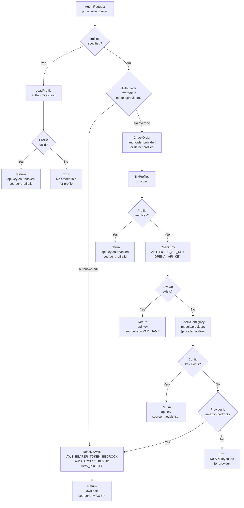
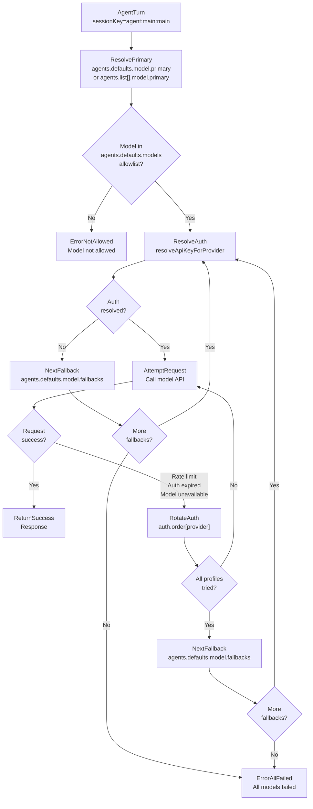
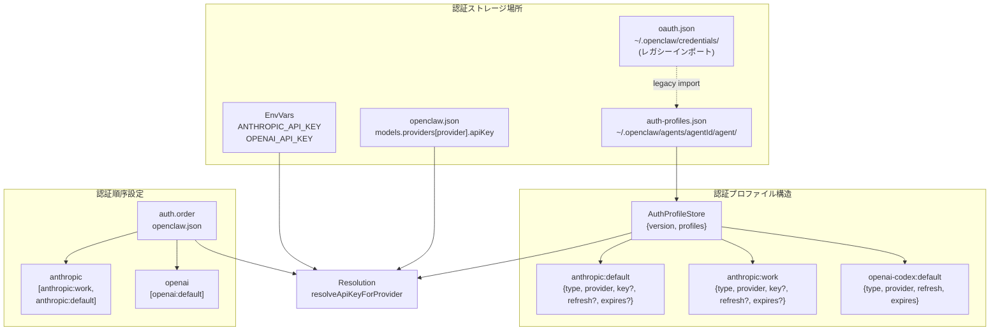

# モデルコマンド

<details>
<summary>関連ソースファイル</summary>

この wiki ページの生成に使用されたファイル:

- [README.md](README.md)
- [assets/avatar-placeholder.svg](assets/avatar-placeholder.svg)
- [docs/channels/zalo.md](docs/channels/zalo.md)
- [docs/channels/zalouser.md](docs/channels/zalouser.md)
- [docs/cli/index.md](docs/cli/index.md)
- [docs/docs.json](docs/docs.json)
- [docs/gateway/index.md](docs/gateway/index.md)
- [docs/gateway/troubleshooting.md](docs/gateway/troubleshooting.md)
- [docs/index.md](docs/index.md)
- [docs/start/getting-started.md](docs/start/getting-started.md)
- [docs/start/hubs.md](docs/start/hubs.md)
- [docs/start/onboarding.md](docs/start/onboarding.md)
- [docs/start/wizard.md](docs/start/wizard.md)
- [scripts/clawtributors-map.json](scripts/clawtributors-map.json)
- [scripts/update-clawtributors.ts](scripts/update-clawtributors.ts)
- [scripts/update-clawtributors.types.ts](scripts/update-clawtributors.types.ts)
- [src/config/config.ts](src/config/config.ts)
- [src/index.test.ts](src/index.test.ts)
- [src/index.ts](src/index.ts)
- [tsconfig.json](tsconfig.json)
- [ui/src/styles.css](ui/src/styles.css)
- [ui/src/styles/layout.mobile.css](ui/src/styles/layout.mobile.css)

</details>


## 目的と範囲

このページでは、AI モデルプロバイダー、認証プロファイル、モデル選択、エイリアス、フォールバックチェーンを管理するための `openclaw models` CLI コマンドについて説明します。これらのコマンドは、エージェントがテキスト生成と画像理解タスクに使用するモデルと、複数のプロバイダー間で認証情報がどのように解決されるかを制御します。

エージェントレベルのモデル設定（エージェントごとのオーバーライド）については、[Agent Commands](#12.2) を参照してください。設定ファイルの構造については、[Configuration File Structure](#4.1) を参照してください。モデルプロバイダーの概念とフェイルオーバー動作については、システムアーキテクチャ図を参照してください。

---

## コマンド概要

`openclaw models` コマンドファミリーはモデルプロバイダーと認証を管理します:

| Command | Purpose | Config Key Modified |
|---------|---------|---------------------|
| `models` または `models status` | 認証ステータスと現在のモデル設定を表示 | *(読み取り専用)* |
| `models list` | カタログから利用可能なモデルを一覧表示 | *(読み取り専用)* |
| `models set <model>` | プライマリテキストモデルを設定 | `agents.defaults.model.primary` |
| `models set-image <model>` | プライマリ画像モデルを設定 | `agents.defaults.imageModel.primary` |
| `models aliases list\|add\|remove` | モデルのショートハンドエイリアスを管理 | `agents.defaults.models.<ref>.alias` |
| `models fallbacks list\|add\|remove\|clear` | テキストモデルのフォールバックを管理 | `agents.defaults.model.fallbacks` |
| `models image-fallbacks list\|add\|remove\|clear` | 画像モデルのフォールバックを管理 | `agents.defaults.imageModel.fallbacks` |
| `models scan` | プロバイダーをプローブして最適なモデルを選択 | `agents.defaults.model.primary` |
| `models auth add\|setup-token\|paste-token` | 認証情報を追加 | Auth profiles |
| `models auth order get\|set\|clear` | 認証プロファイルのローテーション順序を管理 | `auth.order.<provider>` |

**Sources:** [docs/cli/index.md:746-860](), [README.md:40-44]()

---

## モデル認証解決フロー



**図:** 明示的なプロファイル ID → 認証順序 → 環境変数 → 設定ファイル → プロバイダー固有のフォールバック（AWS SDK）へのカスケードを示すモデル認証解決フロー。

**Sources:** [src/config/config.ts:1-15](), [README.md:40-44]()

---

## モデル選択とフォールバックカスケード



**図:** プライマリモデルの試行 → 認証プロファイルのローテーション → フォールバックカスケード → 消耗を示すモデル選択フロー。

**Sources:** [src/config/config.ts:1-15](), [README.md:40-44]()

---

## `openclaw models` / `openclaw models status`

現在のモデル設定、認証ステータス、OAuth トークンの有効期限を表示します。

### 使用方法

```bash
openclaw models
openclaw models status
openclaw models status --json
openclaw models status --plain
openclaw models status --check
```

### オプション

| Flag | Description |
|------|-------------|
| `--json` | 構造化 JSON 出力（`--no-usage` が設定されない限り使用量を含む） |
| `--plain` | プレーンテキスト出力（スタイリングなし、スクリプト用に安全） |
| `--check` | 認証が期限切れまたは不足している場合は非ゼロコードで終了（exit 1=期限切れ/不足、2=間もなく期限切れ） |
| `--probe` | 認証を検証するライブリクエストを実行（トークンを消費し、レート制限をトリガーする可能性があります） |
| `--probe-provider <name>` | プロービングを特定のプロバイダーに制限 |
| `--probe-profile <id>` | プロービングを特定のプロファイルに制限（カンマ区切りまたはフラグを繰り返し） |
| `--probe-timeout <ms>` | プローブリクエストごとのタイムアウト（プロバイダーによってデフォルトが異なります） |
| `--probe-concurrency <n>` | 同時プローブリクエストの最大数 |
| `--probe-max-tokens <n>` | プローブリクエストごとの最大トークン数 |

### 出力セクション

`models status` コマンドは以下を表示します:

1. **プライマリモデル:** `agents.defaults.model.primary`（定義されている場合はエイリアス付き）
2. **画像モデル:** `agents.defaults.imageModel.primary`（設定されている場合）
3. **フォールバック:** `agents.defaults.model.fallbacks` 配列
4. **画像フォールバック:** `agents.defaults.imageModel.fallbacks` 配列
5. **認証プロファイル:** プロバイダーごとの認証プロファイルリスト:
   - プロファイル ID
   - 認証モード（api-key、oauth、token、aws-sdk）
   - 有効期限タイムスタンプ（OAuth/token のみ）
   - ステータス: active、expired、expiring、disabled
6. **認証順序:** プロファイルローテーション順序を示す `auth.order.<provider>` 配列

### 終了コード（`--check` 付き）

| Code | Meaning |
|------|---------|
| 0 | すべての認証プロファイルが有効 |
| 1 | 認証が期限切れまたは不足 |
| 2 | 認証がしきい値内で期限切れ（デフォルト 7 日） |

### 例

```bash
# 基本的なステータス概要
openclaw models status

# 認証が有効かチェック（スクリプトフレンドリー）
openclaw models status --check || echo "Auth needs refresh"

# 解析用の JSON 出力
openclaw models status --json | jq '.authProfiles.anthropic[]'

# ライブ認証情報をプローブ（トークンを消費）
openclaw models status --probe --probe-provider anthropic

# 特定のプロファイルをチェック
openclaw models status --probe --probe-profile "anthropic:work"
```

**Sources:** [docs/cli/index.md:776-791](), [README.md:40-44]()

---

## `openclaw models list`

フィルタリングとフォーマットオプション付きでモデルカタログから利用可能なモデルを一覧表示します。

### 使用方法

```bash
openclaw models list
openclaw models list --all
openclaw models list --provider anthropic
openclaw models list --json
```

### オプション

| Flag | Description |
|------|-------------|
| `--all` | すべてのカタログモデルを含める（デフォルトは推奨/最近のもののみ表示） |
| `--local` | ローカルで利用可能なモデルにフィルタリング（Ollama、LM Studio） |
| `--provider <name>` | 特定のプロバイダーにフィルタリング（anthropic、openai、google など） |
| `--json` | モデルオブジェクトの JSON 配列を出力 |
| `--plain` | プレーンテキスト出力（ANSI スタイリングなし） |

### 出力フィールド

各モデルエントリには以下が含まれます:
- **モデル参照:** `provider/model-id`（例: `anthropic/claude-opus-4-5`）
- **名前:** 人間が読めるモデル名
- **コンテキストウィンドウ:** 入力コンテキストのトークン制限
- **最大出力:** 最大出力トークン
- **コスト:** 百万トークンあたりの入力/出力/キャッシュ読み取り/キャッシュ書き込みコスト
- **推論:** モデルが拡張思考/推論をサポートするかどうか
- **入力タイプ:** サポートされる入力モダリティ（text、image、audio、video）

### 例

```bash
# Anthropic モデルを一覧表示
openclaw models list --provider anthropic

# JSON 出力ですべてのモデルを一覧表示
openclaw models list --all --json

# ローカルモデルのみを一覧表示
openclaw models list --local

# jq にパイプしてフィルタリング
openclaw models list --json | jq '.[] | select(.reasoning == true)'
```

**Sources:** [docs/cli/index.md:767-775]()

---

## `openclaw models set <model>`

エージェント応答のプライマリテキストモデルを設定します。設定ファイルの `agents.defaults.model.primary` に書き込みます。

### 使用方法

```bash
openclaw models set anthropic/claude-opus-4-5
openclaw models set openai/gpt-5.2
openclaw models set minimax/MiniMax-M2.1
```

### 引数

| Argument | Description |
|----------|-------------|
| `<model>` | `provider/model-id` フォーマットまたはエイリアスのモデル参照 |

### 動作

1. モデルがカタログまたは許可リストに存在することを検証
2. `~/.openclaw/openclaw.json` に `agents.defaults.model.primary` を書き込み
3. ゲートウェイを自動的に再起動し**ません**（`openclaw gateway restart` を使用）

### エージェントごとのオーバーライド

特定のエージェントにモデルを設定するには、以下を使用します:
```bash
openclaw config set agents.list[<index>].model.primary "provider/model-id"
```

または設定を直接編集:
```json
{
  "agents": {
    "list": [
      {
        "id": "work",
        "model": {
          "primary": "openai/gpt-5.2",
          "fallbacks": ["anthropic/claude-opus-4-5"]
        }
      }
    ]
  }
}
```

### 例

```bash
# Claude Opus 4.5 をプライマリとして設定
openclaw models set anthropic/claude-opus-4-5

# エイリアスを使用して設定（定義されている場合）
openclaw models set opus

# 適用するためにゲートウェイを再起動
openclaw gateway restart
```

**Sources:** [docs/cli/index.md:793-795]()

---

## `openclaw models set-image <model>`

ビジョンタスク（画像分析、OCR など）のプライマリ画像モデルを設定します。`agents.defaults.imageModel.primary` に書き込みます。

### 使用方法

```bash
openclaw models set-image anthropic/claude-sonnet-4
openclaw models set-image openai/gpt-5.2-vision
openclaw models set-image google/gemini-2.5-flash
```

### 引数

| Argument | Description |
|----------|-------------|
| `<model>` | 画像入力をサポートするモデル参照（`input` 配列に `"image"` があるもの） |

### 動作

1. モデルが画像入力をサポートすることを検証
2. 設定に `agents.defaults.imageModel.primary` を書き込み
3. 画像モデルが失敗した場合はプライマリテキストモデルにフォールバック

### 例

```bash
# 画像用に Claude Sonnet 4 を設定
openclaw models set-image anthropic/claude-sonnet-4

# テキストと画像に同じモデルを使用
openclaw models set anthropic/claude-opus-4-5
openclaw models set-image anthropic/claude-opus-4-5
```

**Sources:** [docs/cli/index.md:797-799]()

---

## モデルエイリアス

モデルエイリアスは、頻繁に使用されるモデルのショートハンド参照を提供します。エイリアスは `agents.defaults.models.<model-ref>.alias` に保存されます。

### `openclaw models aliases list`

設定されたすべてのエイリアスを一覧表示します。

```bash
openclaw models aliases list
openclaw models aliases list --json
openclaw models aliases list --plain
```

**出力:**
```
opus     → anthropic/claude-opus-4-5
sonnet   → anthropic/claude-sonnet-4
gpt      → openai/gpt-5.2
```

### `openclaw models aliases add <alias> <model>`

エイリアスを追加または更新します。

```bash
openclaw models aliases add opus anthropic/claude-opus-4-5
openclaw models aliases add fast google/gemini-2.5-flash
```

**書き込まれる設定:**
```json
{
  "agents": {
    "defaults": {
      "models": {
        "anthropic/claude-opus-4-5": {
          "alias": "opus"
        }
      }
    }
  }
}
```

### `openclaw models aliases remove <alias>`

エイリアスを削除します。

```bash
openclaw models aliases remove opus
```

### エイリアス解決

エイリアスはモデル参照が受け入れられる場所であればどこでも使用できます:
- `openclaw models set opus` → `anthropic/claude-opus-4-5` に解決
- `/model opus`（チャットコマンド）→ エイリアスされたモデルに切り替え
- 設定: `"primary": "opus"` → 実行時に解決

**Sources:** [docs/cli/index.md:801-808]()

---

## モデルフォールバック

フォールバックチェーンは、プライマリモデルが失敗した場合（レート制限、認証期限切れ、モデル利用不可）のモデル再試行動作を定義します。エージェントはモデルを順番に試行し、成功するかすべて失敗するまで続けます。

### `openclaw models fallbacks list`

現在のフォールバックチェーンを一覧表示します。

```bash
openclaw models fallbacks list
openclaw models fallbacks list --json
```

**出力:**
```
Primary:   anthropic/claude-opus-4-5
Fallbacks: openai/gpt-5.2
           google/gemini-2.5-pro
```

### `openclaw models fallbacks add <model>`

フォールバックチェーンにモデルを追加します。

```bash
openclaw models fallbacks add openai/gpt-5.2
openclaw models fallbacks add google/gemini-2.5-pro
```

**書き込まれる設定:**
```json
{
  "agents": {
    "defaults": {
      "model": {
        "primary": "anthropic/claude-opus-4-5",
        "fallbacks": ["openai/gpt-5.2", "google/gemini-2.5-pro"]
      }
    }
  }
}
```

### `openclaw models fallbacks remove <model>`

フォールバックチェーンからモデルを削除します。

```bash
openclaw models fallbacks remove openai/gpt-5.2
```

### `openclaw models fallbacks clear`

すべてのフォールバックを削除します（プライマリのみモード）。

```bash
openclaw models fallbacks clear
```

### フォールバック動作

1. **プライマリ試行:** [認証解決フロー](#モデル認証解決フロー)経由で認証を解決
2. **認証プロファイルのローテーション:** プライマリ認証が失敗した場合、`auth.order[provider]` の次のプロファイルを試行
3. **フォールバックカスケード:** プライマリのすべての認証プロファイルが失敗した場合、最初のフォールバックモデルを試行
4. **消耗:** すべてのフォールバックが失敗した場合、ユーザーにエラーを返す

### エージェントごとのフォールバックオーバーライド

特定のエージェントのフォールバックを無効にするには:
```json
{
  "agents": {
    "list": [
      {
        "id": "work",
        "model": {
          "primary": "openai/gpt-5.2",
          "fallbacks": []
        }
      }
    ]
  }
}
```

**重要:** 明示的に空の `fallbacks` 配列は、そのエージェントの**グローバルフォールバックを無効**にします。`fallbacks` を省略するとグローバルチェーンを継承します。

**Sources:** [docs/cli/index.md:810-816]()

---

## 画像モデルフォールバック

画像モデルフォールバックはテキストフォールバックと同様に動作しますが、ビジョンタスクに適用されます。`agents.defaults.imageModel.fallbacks` に保存されます。

### コマンド

```bash
openclaw models image-fallbacks list [--json] [--plain]
openclaw models image-fallbacks add <model>
openclaw models image-fallbacks remove <model>
openclaw models image-fallbacks clear
```

### 設定例

```json
{
  "agents": {
    "defaults": {
      "imageModel": {
        "primary": "anthropic/claude-sonnet-4",
        "fallbacks": ["openai/gpt-5.2-vision", "google/gemini-2.5-flash"]
      }
    }
  }
}
```

**Sources:** [docs/cli/index.md:818-826]()

---

## `openclaw models scan`

利用可能なプロバイダーをスキャンし、認証をプローブし、設定可能な基準（パラメータ数、新しさ、コスト、パフォーマンス）に基づいて最適な利用可能なモデルを選択します。

### 使用方法

```bash
openclaw models scan
openclaw models scan --yes
openclaw models scan --set-default
openclaw models scan --set-image
```

### オプション

| Flag | Description |
|------|-------------|
| `--min-params <b>` | 最小パラメータ数（単位: 十億）（例: 70B+ の場合は `70`） |
| `--max-age-days <days>` | モデルの最大経過日数（例: 過去 6 か月にリリースされたモデルの場合 `180`） |
| `--provider <name>` | スキャンを特定のプロバイダーに制限 |
| `--max-candidates <n>` | 表示する候補数を制限（デフォルトは可変） |
| `--timeout <ms>` | プローブリクエストごとのタイムアウト |
| `--concurrency <n>` | 同時プローブの最大数 |
| `--no-probe` | ライブプロービングをスキップ（カタログメタデータのみ使用） |
| `--yes` | プロンプトなしで推奨を受け入れる |
| `--no-input` | 非対話モード（`--yes` が必要） |
| `--set-default` | スキャン後にプライマリモデルとして設定 |
| `--set-image` | スキャン後に画像モデルとして設定 |
| `--json` | JSON スキャン結果を出力 |

### スキャン動作

1. **カタログをロード:** `@mariozechner/pi-ai` とプロバイダーオーバーライドからモデル定義を読み取り
2. **フィルタ:** `--min-params`、`--max-age-days`、`--provider` フィルタを適用
3. **認証プローブ:** 各プロバイダーの認証をテスト（`--no-probe` でない場合）
4. **ランク:** パラメータ数、新しさ、コスト、可用性でモデルをスコア付け
5. **提示:** インタラクティブな選択付きでトップ候補を表示（または `--yes` で自動選択）
6. **書き込み:** `--set-default` または `--set-image` が渡された場合、設定を更新

### 例

```bash
# インタラクティブスキャンと選択
openclaw models scan

# 最適なモデルを自動選択（非対話）
openclaw models scan --yes --set-default

# 最近の大規模モデルのみをスキャン
openclaw models scan --min-params 70 --max-age-days 90

# Anthropic モデルのみをスキャン
openclaw models scan --provider anthropic --yes
```

### スキャン出力

```
Scanning models...
✓ anthropic: 3 models available (auth: ok)
✓ openai: 2 models available (auth: ok)
✗ google: no valid authentication

Top candidates:
 1. anthropic/claude-opus-4-5    (200B, 2025-01-01, $15/$75/M)
 2. openai/gpt-5.2               (175B, 2024-12-15, $10/$50/M)
 3. anthropic/claude-sonnet-4    (50B,  2024-11-20, $3/$15/M)

Select model: [1-3] or Enter to keep current
```

**Sources:** [docs/cli/index.md:828-843]()

---

## 認証管理

`openclaw models auth` コマンドはプロバイダー認証情報とプロファイルローテーション順序を管理します。

### 認証ストレージ構造



**図:** 多層の認証情報ソースとプロファイルベースのローテーションを示す認証プロファイルストレージと解決構造。

**Sources:** [src/config/config.ts:1-15](), [README.md:40-44]()

---

### 認証モード

| Mode | Description | Source | Example |
|------|-------------|--------|---------|
| `api-key` | 静的 API キー | プロファイル、環境変数、または設定 | `ANTHROPIC_API_KEY=sk-ant-...` |
| `oauth` | リフレッシュトークン付き OAuth2 | プロファイル（setup-token または OAuth フローで保存） | Anthropic setup-token、OpenAI Codex OAuth |
| `token` | 長期間有効なトークン（リフレッシュ不可） | プロファイル（手動で貼り付け） | Anthropic `claude setup-token` 出力 |
| `aws-sdk` | AWS 認証情報チェーン | AWS SDK デフォルトチェーン（環境変数、設定、IAM ロール） | Bedrock モデル |

**Sources:** [src/config/config.ts:1-15]()

---

### `openclaw models auth add`

プロバイダー選択と認証情報入力をガイドするインタラクティブな認証ヘルパー。

```bash
openclaw models auth add
```

**動作:**
1. プロバイダーをプロンプト（anthropic、openai、google など）
2. 認証方法をプロンプト（API キー、OAuth、setup-token）
3. 認証情報入力/OAuth フローをウォークスルー
4. `~/.openclaw/agents/<agentId>/agent/auth-profiles.json` に書き込み
5. オプションで `auth.order[provider]` ローテーションに追加

**Sources:** [docs/cli/index.md:845-850]()

---

### `openclaw models auth setup-token`

Anthropic 認証用に `claude setup-token`（または同等のもの）から setup-token を貼り付けます。

```bash
openclaw models auth setup-token --provider anthropic
openclaw models auth setup-token --provider anthropic --yes
```

#### オプション

| Flag | Description |
|------|-------------|
| `--provider <name>` | プロバイダー ID（デフォルト: `anthropic`） |
| `--yes` | 確認プロンプトをスキップ |

#### フロー

1. ゲートウェイホスト（または別のマシン）で `claude setup-token` を実行
2. 出力トークンをコピー
3. `openclaw models auth setup-token --provider anthropic` を実行
4. プロンプトが表示されたらトークンを貼り付け
5. トークンが検証され、有効期限付きで `auth-profiles.json` に保存

#### Setup-Token と OAuth の比較

| Method | Pros | Cons |
|--------|------|------|
| **Setup-token** | シンプル、ブラウザフローなし、ヘッドレスで動作 | 期限切れ時に手動リフレッシュが必要 |
| **OAuth** | 自動リフレッシュ、長期間有効 | ブラウザが必要、セットアップが複雑 |

**推奨:** 本番デプロイメントには setup-token を使用。OAuth はレガシー。

**Sources:** [docs/cli/index.md:845-850](), [docs/start/wizard.md:66-77](), [README.md:40-44]()

---

### `openclaw models auth paste-token`

別の場所で取得したトークンを手動で貼り付けます（ヘッドレスセットアップやトークン生成が別のマシンで行われた場合に便利）。

```bash
openclaw models auth paste-token --provider anthropic
openclaw models auth paste-token --provider anthropic --profile-id anthropic:prod --expires-in 365d
```

#### オプション

| Flag | Description |
|------|-------------|
| `--provider <name>` | プロバイダー ID |
| `--profile-id <id>` | カスタムプロファイル ID（デフォルト: `<provider>:manual`） |
| `--expires-in <duration>` | 有効期間（例: `365d`、`12h`、`30d`） |

#### 例

```bash
# 1 年の有効期限で Anthropic トークンを貼り付け
openclaw models auth paste-token --provider anthropic --expires-in 365d

# カスタムプロファイル ID で貼り付け
openclaw models auth paste-token --provider anthropic --profile-id anthropic:backup
```

**Sources:** [docs/cli/index.md:845-850]()

---

### `openclaw models auth order get|set|clear`

マルチプロファイルセットアップの認証プロファイルローテーション順序を管理します。リクエストが失敗した場合（レート制限、期限切れトークン）、システムは順序内の次のプロファイルを試行します。

#### `openclaw models auth order get`

現在のローテーション順序を表示します。

```bash
openclaw models auth order get --provider anthropic
openclaw models auth order get --provider anthropic --agent work
openclaw models auth order get --provider anthropic --json
```

**出力:**
```
Provider: anthropic
Order:    anthropic:work, anthropic:default, anthropic:backup
```

#### `openclaw models auth order set`

ローテーション順序を設定します。

```bash
openclaw models auth order set --provider anthropic anthropic:work anthropic:default
openclaw models auth order set --provider openai openai:personal openai:work
openclaw models auth order set --provider anthropic --agent work anthropic:work anthropic:fallback
```

**書き込まれる設定:**
```json
{
  "auth": {
    "order": {
      "anthropic": ["anthropic:work", "anthropic:default"]
    }
  }
}
```

**エージェントごとのオーバーライド:**
```json
{
  "agents": {
    "list": [
      {
        "id": "work",
        "auth": {
          "order": {
            "anthropic": ["anthropic:work", "anthropic:fallback"]
          }
        }
      }
    ]
  }
}
```

#### `openclaw models auth order clear`

ローテーション順序を削除します（プロファイル検出にフォールバック）。

```bash
openclaw models auth order clear --provider anthropic
openclaw models auth order clear --provider anthropic --agent work
```

#### ローテーション動作

モデルリクエストが再試行可能なエラーで失敗した場合（レート制限、401 Unauthorized、503 Service Unavailable）:

1. **現在のプロファイルが失敗:** リクエストがエラーを返す
2. **順序をチェック:** `auth.order[provider]`（またはエージェントオーバーライド）をロード
3. **次のプロファイルを試行:** 順序内の次のプロファイルの認証を解決
4. **リクエストを再試行:** 新しい認証情報で同じリクエストを試行
5. **繰り返し:** 成功するか、すべてのプロファイルが消耗するまで続ける
6. **フォールバックモデル:** すべてのプロファイルが失敗した場合、`agents.defaults.model.fallbacks` の次のモデルを試行

**Sources:** [docs/cli/index.md:852-860](), [src/config/config.ts:1-15]()

---

## 一般的なワークフロー

### 初回モデルセットアップ

```bash
# 1. Anthropic API キーを追加
openclaw models auth add
# → Select: anthropic
# → Select: API key
# → Paste key

# 2. プライマリモデルを設定
openclaw models set anthropic/claude-opus-4-5

# 3. フォールバックを追加
openclaw models fallbacks add openai/gpt-5.2
openclaw models fallbacks add google/gemini-2.5-pro

# 4. 検証
openclaw models status

# 5. ゲートウェイを再起動
openclaw gateway restart
```

**Sources:** [docs/start/getting-started.md:78-102](), [docs/start/wizard.md:62-77]()

---

### ローテーション付きマルチプロバイダーセットアップ

```bash
# 1. 複数の Anthropic プロファイルを追加
openclaw models auth paste-token --provider anthropic --profile-id anthropic:primary --expires-in 365d
openclaw models auth paste-token --provider anthropic --profile-id anthropic:backup --expires-in 365d

# 2. ローテーション順序を設定
openclaw models auth order set --provider anthropic anthropic:primary anthropic:backup

# 3. OpenAI をフォールバックプロバイダーとして追加
openclaw models auth add
# → Select: openai
# → Paste API key

# 4. フォールバックチェーンを設定
openclaw models set anthropic/claude-opus-4-5
openclaw models fallbacks add openai/gpt-5.2

# 5. 検証
openclaw models status
```

**Sources:** [docs/cli/index.md:852-860]()

---

### エージェントごとのモデル設定

```bash
# 1. 新しいエージェントを追加
openclaw agents add work --workspace ~/.openclaw/workspace-work

# 2. 異なるモデルで work エージェントを設定
openclaw config set agents.list[1].model.primary "openai/gpt-5.2"
openclaw config set agents.list[1].model.fallbacks '["google/gemini-2.5-pro"]'

# 3. work エージェントに認証プロファイルをコピー
cp ~/.openclaw/agents/main/agent/auth-profiles.json \
   ~/.openclaw/agents/work/agent/auth-profiles.json

# 4. 検証
openclaw models status
openclaw status
```

**Sources:** [docs/cli/index.md:516-558](), [docs/start/wizard.md:84-98]()

---

### トークン有効期限とリフレッシュ

```bash
# 有効期限をチェック
openclaw models status --check
echo $?  # Exit code: 0=ok, 1=expired, 2=expiring

# 期限切れトークンをリフレッシュ（Anthropic）
claude setup-token
openclaw models auth setup-token --provider anthropic
# → Paste new token

# または別の場所で生成されたトークンを貼り付け
openclaw models auth paste-token --provider anthropic --expires-in 365d

# 検証
openclaw models status

# ゲートウェイを再起動
openclaw gateway restart
```

**Sources:** [docs/gateway/troubleshooting.md:164-213](), [docs/cli/index.md:776-791]()

---

### モデルスキャンと自動選択

```bash
# すべてのプロバイダーをスキャンしてインタラクティブに選択
openclaw models scan

# 最適な利用可能なモデルを自動選択（非対話）
openclaw models scan --yes --set-default

# 大きくて最近のモデルのみをスキャン
openclaw models scan --min-params 70 --max-age-days 90 --yes --set-default

# Anthropic のみをスキャン
openclaw models scan --provider anthropic --yes

# プロービングなしでスキャン（メタデータのみ）
openclaw models scan --no-probe
```

**Sources:** [docs/cli/index.md:828-843]()

---

## トラブルシューティング

### "No API key found for provider"

**症状:** エージェントターンが "No API key found for provider 'anthropic'" で失敗

**診断:**
```bash
openclaw models status
openclaw models status --probe --probe-provider anthropic
```

**修正:**
```bash
# Option 1: Add API key
openclaw models auth add

# Option 2: Paste setup-token
openclaw models auth setup-token --provider anthropic

# Option 3: Copy auth profiles from main agent
cp ~/.openclaw/agents/main/agent/auth-profiles.json \
   ~/.openclaw/agents/<your-agent>/agent/auth-profiles.json
```

**Sources:** [docs/gateway/troubleshooting.md:32-58]()

---

### "OAuth token refresh failed"

**症状:** ゲートウェイログに "OAuth token refresh failed" または "401 Unauthorized" が表示

**診断:**
```bash
openclaw models status --check
```

**修正（推奨: setup-token に切り替え）:**
```bash
# On gateway host
claude setup-token
openclaw models auth setup-token --provider anthropic
openclaw gateway restart
```

**または別の場所で生成されたトークンを貼り付け:**
```bash
openclaw models auth paste-token --provider anthropic --expires-in 365d
```

**Sources:** [docs/gateway/troubleshooting.md:184-213]()

---

### "Agent failed before reply: Unknown model"

**症状:** モデル名が "Unknown model: anthropic/claude-haiku-3-5" で拒否される

**原因:** モデルが廃止されたかカタログにない

**修正:**
```bash
# 利用可能なモデルを一覧表示
openclaw models list --provider anthropic

# サポートされているモデルに更新
openclaw models set anthropic/claude-opus-4-5

# Or scan for best available
openclaw models scan --provider anthropic --yes --set-default
```

**Sources:** [docs/gateway/troubleshooting.md:244-319]()

---

### すべてのモデルが失敗

**症状:** エージェント応答に "All models failed"

**診断チェックリスト:**
```bash
# 1. 認証ステータスをチェック
openclaw models status --check

# 2. ライブ認証情報をプローブ
openclaw models status --probe

# 3. ゲートウェイログをチェック
openclaw logs --limit 50 | grep -i "model\|auth\|error"

# 4. 設定を検証
openclaw config get agents.defaults.model
openclaw config get agents.defaults.model.fallbacks
```

**一般的な原因:**
- すべての認証プロファイルが期限切れ
- すべてのプロバイダーでレート制限に達した
- フォールバックチェーン内のモデル参照が無効
- ネットワーク接続の問題

**修正:**
```bash
# 認証をリフレッシュ
openclaw models auth setup-token --provider anthropic

# フォールバックチェーンを検証
openclaw models fallbacks list

# 動作するフォールバックを追加
openclaw models fallbacks add openai/gpt-5.2
openclaw models fallbacks add google/gemini-2.5-pro

# ゲートウェイを再起動
openclaw gateway restart
```

**Sources:** [docs/gateway/troubleshooting.md:32-243]()

---

## 関連コマンド

- **エージェント設定:** エージェントごとのモデルオーバーライド用の `openclaw agents add`（[Agent Commands](#12.2)）
- **設定操作:** 直接設定編集用の `openclaw config get/set`（[Configuration Commands](#12.5)）
- **ステータスチェック:** プロバイダー使用量/クォータ用の `openclaw status --usage`（[Diagnostic Commands](#12.6)）
- **ゲートウェイ操作:** モデル変更を適用するための `openclaw gateway restart`（[Gateway Commands](#12.1)）

**Sources:** [docs/cli/index.md:1-763]()

---
